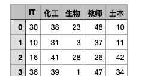
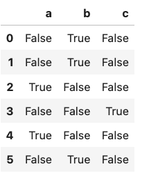
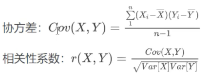
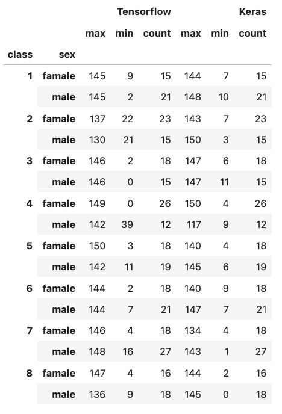
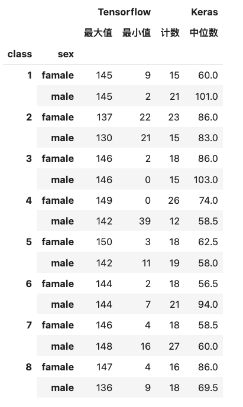
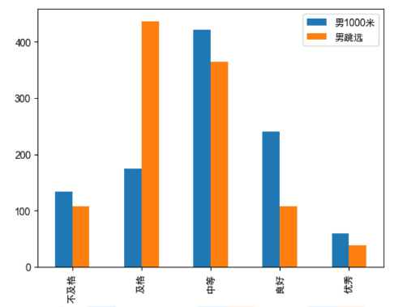
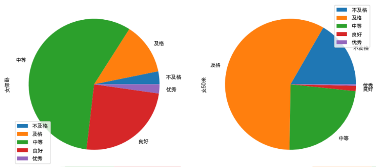
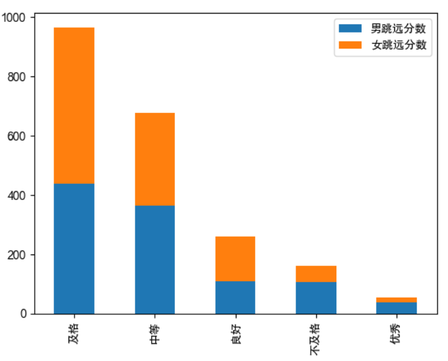

#  Pandas 数据分析库

<link rel="stylesheet" href="https://cdnjs.cloudflare.com/ajax/libs/KaTeX/0.5.1/katex.min.css"/>
<link rel="stylesheet" href="https://cdn.jsdelivr.net/github-markdown-css/2.2.1/github-markdown.css"/>

## 目录

- [1. Numpy 科学计算库](/ai/ml-intro/)
- [2. Pandas 数据分析库](/ai/ml-intro/02-pandas/)
- [3. Mathplotlib 可视化库](/ai/ml-intro/03-matplotlib/)
- [4. 线性回归](/ai/ml-intro/04-linear-regression/)
- [5. 梯度下降](/ai/ml-intro/05-gradient-descent/)

## 简介

```
链接：https://pan.baidu.com/s/1Tbn5AQpGBxQ52Y4AYzkEXQ?pwd=5555
```

- Python 在数据处理和准备方面一直做的很好，但在**数据分析和建模**方面就差一些。pandas 填补了这一空白，使您可以在 Python 中执行整个数据分析流程，而不必切换到特定于领域的语言，比如 R。
- 与出色的 jupyter 工具包和其他库相结合，Python 中用于进行数据分析的环境在性能、生产率和协作能力方面是卓越的。
- pandas 是 Python 的**核心数据分析**支持库，提供了快速、灵活、明确的数据结构，旨在简单、直观地处理关系型、标注型数据。pandas 是 Python 进行数据分析的必备高级工具
- pandas 的主要数据结构是 **Series 和 DataFrame**，这两种数据结构足以处理金融、统计、社会科学、工程等领域里的大多数案例
- 处理数据一般分为几个阶段：**数据整理与清理、数据分析与建模、数据可视化与制表**，pandas 是处理数据的理想工具

安装

```sh
pip install pandas
```

## 数据结构

### Series

```py
# 不指定索引，使用默认索引，从 0 开始
pd.Series(data = [2, 4, 5, 9])
#0    2
#1    4
#2    5
#3    9
#dtype: int64
```

```py
pd.Series(data = [1, 2, 3, 4], index = ['a', 'b', 'c', 'd'])
#a    1
#b    2
#c    3
#d    4
#dtype: int64
```

一维 numpy 数组使用自然索引（从 0 开始的自然数作为索引）；而 Series 对象的索引是任意类型，且索引之间不能重复。

### DataFrame

二维数组

```py
pd.DataFrame(data = np.random.randint(0, 100, size = (5, 3)))
```

<table >
  <thead>
    <tr style="text-align: right;">
      <th></th>
      <th>0</th>
      <th>1</th>
      <th>2</th>
    </tr>
  </thead>
  <tbody>
    <tr>
      <th>0</th>
      <td>48</td>
      <td>45</td>
      <td>61</td>
    </tr>
    <tr>
      <th>1</th>
      <td>76</td>
      <td>43</td>
      <td>2</td>
    </tr>
    <tr>
      <th>2</th>
      <td>85</td>
      <td>25</td>
      <td>73</td>
    </tr>
    <tr>
      <th>3</th>
      <td>94</td>
      <td>25</td>
      <td>85</td>
    </tr>
    <tr>
      <th>4</th>
      <td>14</td>
      <td>74</td>
      <td>56</td>
    </tr>
  </tbody>
</table>

```py
# 指定列名、索引和类型
pd.DataFrame(data = np.random.randint(0, 100, size = (5, 3)),
            columns=['Python', 'English', 'Math'],
            index=list('ABCDE'),
            dtype=np.float32)
```

<table >
  <thead>
    <tr style="text-align: right;">
      <th></th>
      <th>Python</th>
      <th>English</th>
      <th>Math</th>
    </tr>
  </thead>
  <tbody>
    <tr>
      <th>A</th>
      <td>56.0</td>
      <td>40.0</td>
      <td>81.0</td>
    </tr>
    <tr>
      <th>B</th>
      <td>41.0</td>
      <td>7.0</td>
      <td>65.0</td>
    </tr>
    <tr>
      <th>C</th>
      <td>62.0</td>
      <td>69.0</td>
      <td>27.0</td>
    </tr>
    <tr>
      <th>D</th>
      <td>88.0</td>
      <td>69.0</td>
      <td>60.0</td>
    </tr>
    <tr>
      <th>E</th>
      <td>26.0</td>
      <td>96.0</td>
      <td>57.0</td>
    </tr>
  </tbody>
</table>

**另一种创建方式**

```py
pd.DataFrame(data = {
    'Python': np.random.randint(0, 100, size=5),
    'English': np.random.randint(0, 100, size=5),
    'Math': np.random.randint(0, 100, size=5),
}, index = list('ABCDE'), dtype = np.float32)
```

<table >
  <thead>
    <tr style="text-align: right;">
      <th></th>
      <th>Python</th>
      <th>English</th>
      <th>Math</th>
    </tr>
  </thead>
  <tbody>
    <tr>
      <th>A</th>
      <td>13.0</td>
      <td>63.0</td>
      <td>67.0</td>
    </tr>
    <tr>
      <th>B</th>
      <td>70.0</td>
      <td>17.0</td>
      <td>60.0</td>
    </tr>
    <tr>
      <th>C</th>
      <td>86.0</td>
      <td>73.0</td>
      <td>49.0</td>
    </tr>
    <tr>
      <th>D</th>
      <td>68.0</td>
      <td>9.0</td>
      <td>10.0</td>
    </tr>
    <tr>
      <th>E</th>
      <td>30.0</td>
      <td>47.0</td>
      <td>68.0</td>
    </tr>
  </tbody>
</table>

## 数据查看

- `dt.shape`
- `dt.head(10)` 查看前 10 条数据
- `dt.tail()` 默认查看后 5 条数据
- `df.dtypes` 列类型
- `df.index` 行索引
- `df.columns` 列索引
- `df.values` DataFrame 中维护的数据，是一个 numpy 数组
- `df.describe()` 查看数值型列的统计信息，属性有 计数、平均值、标准差、最小值、四分位数、中位数、最大值
- `df.info()` 查看列索引、数据类型、非空计数、内存信息


示例

```py
df = pd.DataFrame(data = np.random.randint(0, 100, size = (150, 3)),
            columns=['Python', 'English', 'Math'],
            dtype=np.float32)

df
```

<table >
  <thead>
    <tr style="text-align: right;">
      <th></th>
      <th>Python</th>
      <th>English</th>
      <th>Math</th>
    </tr>
  </thead>
  <tbody>
    <tr>
      <th>0</th>
      <td>15.0</td>
      <td>67.0</td>
      <td>94.0</td>
    </tr>
    <tr>
      <th>1</th>
      <td>70.0</td>
      <td>96.0</td>
      <td>69.0</td>
    </tr>
    <tr>
      <th>2</th>
      <td>88.0</td>
      <td>90.0</td>
      <td>59.0</td>
    </tr>
    <tr>
      <th>3</th>
      <td>80.0</td>
      <td>74.0</td>
      <td>66.0</td>
    </tr>
    <tr>
      <th>4</th>
      <td>66.0</td>
      <td>17.0</td>
      <td>17.0</td>
    </tr>
    <tr>
      <th>...</th>
      <td>...</td>
      <td>...</td>
      <td>...</td>
    </tr>
    <tr>
      <th>145</th>
      <td>75.0</td>
      <td>71.0</td>
      <td>81.0</td>
    </tr>
    <tr>
      <th>146</th>
      <td>52.0</td>
      <td>8.0</td>
      <td>35.0</td>
    </tr>
    <tr>
      <th>147</th>
      <td>7.0</td>
      <td>68.0</td>
      <td>23.0</td>
    </tr>
    <tr>
      <th>148</th>
      <td>43.0</td>
      <td>61.0</td>
      <td>41.0</td>
    </tr>
    <tr>
      <th>149</th>
      <td>31.0</td>
      <td>24.0</td>
      <td>73.0</td>
    </tr>
  </tbody>
</table>

```py
#查看形状
df.shape
#(150, 3)

#显示前 10 个，如果不指定数字，默认为 5 个
df.head(10)

# 默认查看后 5 个，可以指定数字
df.tail()

# 查看列的类型
df.dtypes
#Python     float32
#English    float32
#Math       float32
#dtype: object

#修改某一列的类型
df['Python'] = df['Python'].astype(np.int64)
df.dtypes
#Python       int64
#nglish    float32
#Math       float32
#dtype: object

#获取行索引
df.index

#获取列索引
df.columns

#查看 df 中的 ndarray。这里可以推断 pandas 是基于 numpy 开发的
type(df.values)
#numpy.ndarray
df.values.shape
#(150, 3)
```

```py
#查看数值型列的统计信息，属性有 计数、平均值、标准差、最小值、四分位数、中位数、最大值
df.describe()
```

<table >
  <thead>
    <tr style="text-align: right;">
      <th></th>
      <th>Python</th>
      <th>English</th>
      <th>Math</th>
    </tr>
  </thead>
  <tbody>
    <tr>
      <th>count</th>
      <td>150.000000</td>
      <td>150.000000</td>
      <td>150.000000</td>
    </tr>
    <tr>
      <th>mean</th>
      <td>48.100000</td>
      <td>49.573334</td>
      <td>46.773335</td>
    </tr>
    <tr>
      <th>std</th>
      <td>28.154833</td>
      <td>28.612276</td>
      <td>28.339066</td>
    </tr>
    <tr>
      <th>min</th>
      <td>0.000000</td>
      <td>0.000000</td>
      <td>0.000000</td>
    </tr>
    <tr>
      <th>25%</th>
      <td>24.250000</td>
      <td>24.000000</td>
      <td>19.500000</td>
    </tr>
    <tr>
      <th>50%</th>
      <td>46.000000</td>
      <td>52.000000</td>
      <td>48.500000</td>
    </tr>
    <tr>
      <th>75%</th>
      <td>70.750000</td>
      <td>72.750000</td>
      <td>69.000000</td>
    </tr>
    <tr>
      <th>max</th>
      <td>98.000000</td>
      <td>99.000000</td>
      <td>98.000000</td>
    </tr>
  </tbody>
</table>

```py
#查看列索引、数据类型、非空计数、内存信息
df.info()
```

```
<class 'pandas.core.frame.DataFrame'>
RangeIndex: 150 entries, 0 to 149
Data columns (total 3 columns):
 #   Column   Non-Null Count  Dtype  
---  ------   --------------  -----  
 0   Python   150 non-null    int64  
 1   English  150 non-null    float32
 2   Math     150 non-null    float32
dtypes: float32(2), int64(1)
memory usage: 2.5 KB
```

## 数据加载与持久化

### csv 格式

```py
df = pd.DataFrame(data = np.random.randint(0, 50, size = (50, 5)),
               columns = ['IT', '化工', '生物', '教师', '土木'])


# 持久化到 csv 文件
#   sep: 分隔符，默认为英文逗号
#   header: 是否保存列索引，即 'IT','化工','生物','教师','土木'
#   index: 是否保存行索引，即 0,1,2...
df.to_csv('salary.csv', sep=':', header=True, index=True)
```

生成的 `salary.csv` 前几行数据

```
:IT:化工:生物:教师:土木
0:30:38:23:48:10
1:10:31:3:37:11
2:16:41:28:26:42
3:36:39:1:47:34
4:14:38:8:2:7
```

> 为啥以第一行以 `:` 开头？因为行索引对应的一列没有列名，所以这一列为空
>

```py
# 读取 csv 文件
#   sep: 指定分隔符
#   header: 指定列索引
#   index_col: 指定行索引为第 0 列
df2 = pd.read_csv('salary.csv', sep=':', header=[0], index_col=0)
```

### excel 格式

```sh
pip install xlrd xlwt openpyxl
```

```py
df1 = pd.DataFrame(data = np.random.randint(0, 50, size = (50, 5)),
               columns = ['IT', '化工', '生物', '教师', '土木'])

df1.to_excel('salary1.xlsx',
            sheet_name='salary', # 工作表名
            header=True, # 导出列索引
            index=False) # 不导出行索引

# 读取 xlsx 文件
res = pd.read_excel('salary1.xlsx',
            sheet_name=0, #读取第一个工作表。也可以直接指定名字 'salary'
            header=0, # 使用第一行数据作为列索引
            names=list('ABCDE'), #替换列索引
            # index_col=0 # 指定哪一列作为行索引。默认使用自然索引。如果导出了行索引，可设置为 0 使用它
                   )
```

同时导出多个工作表

```py
df1 = pd.DataFrame(data = np.random.randint(0, 50, size = (50, 5)),
               columns = ['IT', '化工', '生物', '教师', '土木'])
df2 = pd.DataFrame(data = np.random.randint(0, 50, size = (150, 3)),
               columns = ['Tensorflow', 'Pytorch', 'Keras'])

with pd.ExcelWriter('salary2.xlsx') as w:
    df1.to_excel(w, sheet_name='salary', index=False)
    df2.to_excel(w, sheet_name='score', index=False)
    
df3 = pd.read_excel('salary2.xlsx', sheet_name='score')
df4 = pd.read_excel('salary2.xlsx', sheet_name='salary')
```

## 数据选择

### 列获取

```py
df = pd.DataFrame(np.random.randint(0, 150, size=(1000, 3)),
                  columns=['Python', 'English', 'Math'])

#获取某一列，得到的数据类型为 Series
df['Python']
df.Math

#同时获取多列，得到的是 DataFrame 对象
df[['English', 'Math']]
```

### 行选取

```py
df2 = pd.DataFrame(np.random.randint(0, 150, size=(5, 3)),
                  columns=['Python', 'English', 'Math'],
                  index=list('ABCDE'))

#获取某一行
df2.loc['A']

#获取多行
df2.loc[['A', 'D']]

#通过整数来索引第一行
df2.iloc[0]

#通过整数来索引多行
df2.iloc[[0, 1]]
```

### 获取具体坐标的数值

```py
df2['Math']['B']

df2.loc['B']['Math']
df2.loc['B', 'Math']
df2.loc['B'].Math

df2.iloc[1]['Math']
df2.iloc[1].Math
df2.iloc[1, 2]
```

### 指定多行多列

```py
#指定列
df2.loc[['A','C']]['English']
df2.loc[['A','C'], 'English']
df2.loc[['A','C']].English

#指定多列
df2.loc[['A','C']][['English', 'Math']]
df2.loc[['A','C'], ['English', 'Math']]
```

### 行切片

通常要**选出**哪几列，所以没有列切片

```py
df2.loc['A':'C']
df2.iloc[0:3]

df2.loc['C':][['English', 'Math']]
df2.loc['C':, ['English', 'Math']]

df2.iloc[2:][['English', 'Math']]
```

### 布尔索引

```py
df = pd.DataFrame(np.random.randint(0, 150, size=(1000, 3)),
                  columns=['Python', 'English', 'Math'])

# 单条件筛选：Python 零分的条件
cond = df['Python'] == 0
df[cond]
```

```py
# 多条件筛选：能上 top10 的学生成绩
cond1 = df['Python'] > 140
cond2 = df['Math'] > 140
cond3 = df['English'] > 140
cond = cond1 & cond2 & cond3
df[cond]
```

### 赋值操作

```py
#一维序列，表示 10 个学生的 Pytorch 成绩
s = pd.Series(np.random.randint(0, 150, size=10),
              index=list('ABCDEFGHIJ'),
              name='Pytorch')

#二维数组，表示学生成绩
df = pd.DataFrame(np.random.randint(0, 150, size=(10, 3)),
                  index=list('ABCDEFGHIJ'),
                  columns=['Pandas', 'Tensorflow', 'Keras'])

#增加一列，会根据行索引自动对齐
df['Pytorch'] = s
#增加一列，使用自然索引
df['Java'] = np.random.randint(0, 100, size = 10)

#按标签赋值
df.loc['A', 'Pytorch'] = 150
#按位置赋值。修改 1,2 坐标的元素
df.iloc[1, 2] = 150

#对某一列进行赋值
#df.loc[:, 'Pandas'] = 10
df.loc[:, 'Pandas'] = np.array([100] * 10)

#对某一行进行赋值
#df.iloc[0] = 92
df.iloc[0] = np.array([92] * 4)

cond = df < 92
df[cond] = 92
```

## 练习 1

1、创建 1000 条语文、数学、英语、Python 的考试成绩 DataFrame，最高分为 150，分别将数据保存到 csv 文件和 excel 文件，保存时不保存行索引

```py
df = pd.DataFrame(np.random.randint(0, 151, size=(1000, 4)),
                  columns=['语文', '数学', '英语', 'Python'])
df.to_csv('scores.csv', index=False, header=True)
df.to_excel('scores.xlsx', index=False, header=True)
```

2、使用字典创建 DataFrame，行索引为 a~z，列索引是身高（160~185）、体重（50~90）、学历（无、本科、硕士、博士）。身高和体重使用 Numpy 随机生成；学历数据先创建数组 edu=np.array(["无","本科","硕士","博士"])，然后使用花式索引从四个数据中选择 26 个数据

```py
edu = np.array(["无","本科","硕士","博士"])
random_idx = np.random.randint(0, 4, size = 26)

import string
df = pd.DataFrame(data = {
                    'height': np.random.randint(160, 186, size=26),
                    'weight': np.random.randint(50, 91, size=26),
                    'education': edu[random_idx],
                    }, 
                  index=[letter for letter in string.ascii_lowercase])
```

3、使用题目 2 中的数据进行筛选：

- 筛选索引大于 't' 的所有数据
- 筛选学历为博士，身高大于 170 或体重小于 80 的学生

```py
df.loc['t':]

cond1 = df['education'] == '博士'
cond2 = df['weight'] < 80
cond3 = df['height'] > 170
cond = cond1 & cond2 & cond3
df[cond]
```

4、对题目 2 中的数据进行修改
- 本科生减肥，减掉体重 10
- 博士生减肥，减掉体重范围是 5~10

```py
cond = df['education'] == '本科'
df.loc[cond, 'weight'] -= 10

cond = df['education'] == '博士'
arr = np.random.randint(5, 11, size=df[cond].shape[0])
#两个数组相减
df.loc[cond, 'weight'] -= arr
```

## 数据集成

### concat 合并 df

```py
# 一班的部分考试成绩
df1 = pd.DataFrame(np.random.randint(0, 150, size=(10, 3)),
                   index=list('ABCDEFGHIJ'),
                   columns=['Pytorch', 'Tensorflow', 'Keras'])

# 二班的部分考试成绩
df2 = pd.DataFrame(np.random.randint(0, 150, size=(10, 3)),
                   index=list('KLMNOPQRST'),
                   columns=['Pytorch', 'Tensorflow', 'Keras'])

# 一班的另一部分考试成绩
df3 = pd.DataFrame(np.random.randint(0, 150, size=(10, 2)),
                   index=list('ABCDEFGHIJ'),
                   columns=['Python', 'English'])
```

**行合并** ：考试科目一样，属于**列索引相同的 dataframe 合并**

```py
#在 0 轴（竖轴）上合并 df1 和 df2
pd.concat([df1, df2], axis = 0)
```

**列合并**：考试的学生一样，属于**行索引相同的 dataframe 合并**

```py
#在 1 轴（横轴）上合并 df1 和 df2
pd.concat([df1, df3], axis = 1)
```

### insert 添加列

```py
df = pd.DataFrame(np.random.randint(0, 150, size=(10, 3)),
                   index=list('ABCDEFGHIJ'),
                   columns=['Pytorch', 'Tensorflow', 'Keras'])
```

添加一列并指定默认值

```py
# 在 dataframe 中插入一列
# loc: 插入位置索引
# column: 列名
# value: 默认值
df.insert(loc=2, column='Math', value=91)
```

在指定列后添加一列现有数据

```py
# 获取 Math 列的后边一列的索引
target_col_idx = list(df.columns).index('Math') + 1

# 插入一个数组
df.insert(loc=target_col_idx, column='English', 
          value=np.random.randint(0, 150, size=10))
```

### sql-join 风格的合并

```py
# 该表记录 name 和 weight
df1 = pd.DataFrame(data = {
    'name': ['softpo', 'Daniel', 'Brandon', 'Ella'],
    'weight': [70, 55, 75, 65]
})
# 该表记录 name 和 height
df2 = pd.DataFrame(data = {
    'name': ['softpo', 'Daniel', 'Brandon', 'Cindy'],
    'height': [172, 170, 170, 166]
})
# 该表与 df1 很像，没有同名列，但 name 和 名字 两列语义相同
df3 = pd.DataFrame(data = {
    '名字': ['softpo', 'Daniel', 'Brandon', 'Cindy'],
    'height': [172, 170, 170, 166]
})
```

使用 merge 方法**根据同名列进行列合并**

```py
# 合并 df1 和 df2
# 默认会找同名列进行合并
pd.merge(df1, df2)

# 合并 df1 和 df3
# 如果二者没有同名列，需要指定哪一列进行合并
pd.merge(df1, df3, left_on='name', right_on='名字')
```

> 如果有多个同名列，则会比较多个列即 `df1.col1=df1.col1 and df1.col2=df1.col2 and ...`


使用 merge 方法**根据行索引进行列合并**

```py
df4 = pd.DataFrame(np.random.randint(0, 10, size=(5, 3)),
                   index=list('ABCDE'),
                   columns=['P1', 'P2', 'P3'])

# 创造一个序列对象
s4 = df4.mean(axis = 1)
print(type(s4))
#添加序列名
s4.name = 'Avg'

#通过索引合并两个 Series|DataFrame 对象
pd.merge(df4, s4, left_index=True, right_index=True)
```

小结

- `merge` 方法比较灵活
- 默认表示内连接，对应 `how` 参数，也可指定**外连接**合并

## 数据清洗

### 重复数据

```py
df = pd.DataFrame({
    'color': ['red', 'blue', 'red', 'green', 'blue', None, 'red'],
    'price': [10, 20, 10, 15, 20, 0, np.NaN]
})

#判断是否存在重复数据，这里的数据表示整行重复而非单个数据重复
df.duplicated()

#删除重复数据，返回拷贝的数组
df.drop_duplicates()
```

### 空数据

```py
df = pd.DataFrame({
    'color': ['red', 'blue', 'red', 'green', 'blue', None, 'red'],
    'price': [10, 20, 10, 15, 20, 0, np.NaN]
})

#查看空数据。什么是空？ None、np.NaN 等
df.isnull()

#删除空数据，返回拷贝的数组
df.dropna()

#填充空数据，返回拷贝的数组
df.fillna(0)
```

### 指定行或列删除

```py
df = pd.DataFrame({
    'color': ['red', 'blue', 'red', 'green', 'blue', None, 'red'],
    'price': [10, 20, 10, 15, 20, 0, np.NaN]
})

#删除列，在原对象上删除
#del df['color']

# 删除指定列，返回拷贝的对象
df.drop(labels=['price'], axis = 1)

# 删除指定行，返回拷贝的对象
df.drop(labels=[0,1,3], axis=0)
```

### filter 方法过滤

```py
df = pd.DataFrame(np.array([[3, 7, 1], [2, 8, 256]]),
                  index=['dog', 'cat'],
                  columns=['China', 'America', 'France'])

#指定列
df.filter(items=['China', 'France'])

#过滤索引名以 a 结尾 的列，因为指定了 axis=1 表示列
df.filter(regex='a$', axis=1)

#过滤索引名中包含 og 的行，因为指定了 axis=0 表示行
df.filter(like='og', axis=0)
```

### 异常值过滤

```py
#正态分布 1000x3
df2 = pd.DataFrame(np.random.randn(10000,3))

#列标准差趋近于1
df2.std()

#假设：判定值大于 3 倍的标准差为异常值。则异常表达式为
# 小概率事件：https://baike.baidu.com/item/%E6%AD%A3%E6%80%81%E5%88%86%E5%B8%83/829892#5-2
cond = df2.abs() > 3 * df2.std()

#查看第一列异常值。注意：dataframe[i] 用来取列
df2[cond[0]].head()

#查看每一列的异常值
condn = cond[0] | cond[1] | cond[2]
df2[condn].head()

#另一种方式查看每一列的异常值
c2 = cond.any(axis=1)
df2[c2].head()
```

## 数据转换

### 轴和元素的替换

```py
df = pd.DataFrame(np.random.randint(0, 10, size=(10,3)),
                  index=list('ABCDEFGHIJ'),
                  columns=['Python', 'Tensorflow', 'Keras'])

#赋空值
df.iloc[4, 2] = None

#轴替换：重命名行、列索引，返回拷贝的新对象
df.rename(index = {'A': 'A2', 'B': 'B2'},
          columns={'Python': '人工智能'})

# 替换值。范围是所有元素，如果匹配上则替换。返回拷贝的新对象
df.replace(5, 1024)

# 对多个元素进行替换
df.replace([3, 5], 1024)

# 指定多个替换对儿
df.replace({3 : -1000, 5 : 9999})

# 对某一列的元素进行替换
df.replace({'Python' : 6}, 6666)

# 对某一列的多个元素进行替换
#df.replace({'Python' : [4, 5]}, 6666)
```

### 使用 map 修改元素

对于 Series 对象

```py
df = pd.DataFrame(np.random.randint(0, 10, size=(10,3)),
                  index=list('ABCDEFGHIJ'),
                  columns=['Python', 'Tensorflow', 'Keras'])
s = df['Keras']

#字典映射
s.map({1: 'Hello', 5: 'World', 7: 'AI'})

#自定义映射回调
def convert(x):
    d = {1: 'Hello', 5: 'World', 7: 'AI'}
    return d[x] if d.get(x) != None else x
s.map(convert)

#隐式函数
d = {1: 'Hello', 5: 'World', 7: 'AI'}
s.map(lambda x:d.get(x) if d.get(x) != None else x)
#s.map(lambda x:True if x >= 5 else False)
```

对于 DataFrame 对象

```py
df = pd.DataFrame(np.random.randint(0, 100, size=(10, 3)),
                  index=list('ABCDEFGHIJ'),
                  columns=['Python', 'Math', 'English'])
display(df.head())

df = df.map(lambda  x: x + 10)

display(df.head())
```

### 使用 apply 修改元素

对于 Series 对象

```py
df = pd.DataFrame(np.random.randint(0, 100, size=(30, 3)),
                  columns=['Python', 'Math', 'English'])
s = df['Python']

#--------------------

#定义规则函数
def convert(x):
    if x < 60:
        return '不及格'
    elif x < 80:
        return '中等'
    else:
        return '优秀'

#使用 series.apply 方法、根据规则函数获取学生的 Python 程度
res = s.apply(convert)
display(res.head(10))

#--------------------

# 将得到的列插入原表
target_col_idx = list(df.columns).index('Python') + 1
df.insert(loc=target_col_idx, column='Python程度', value=res)
df.head(10)
```

```py
# apply 隐式函数
df['Python'] = s.apply(lambda x : x + 10)
```

扩展：统计学生在**所有学科**中的表现程度

```py
#多列转换
#成绩表
df = pd.DataFrame(np.random.randint(0, 100, size=(30, 3)),
                  columns=['Python', 'Math', 'English'])
#定义规则函数
def convert(x):
    if x < 60:
        return '不及格'
    elif x < 80:
        return '中等'
    else:
        return '优秀'

for course in df.columns:
    s = df[course]
    #使用 series.apply 方法、根据规则函数获取学生的 Python 程度
    res = s.apply(convert)
    
    # 将得到的列插入原表
    target_col_idx = list(df.columns).index(course) + 1
    df.insert(loc=target_col_idx, column=course + '程度', value=res)

df.head(10)
```


对于 DataFrame 对象

```py
df = pd.DataFrame(np.random.randint(0, 100, size=(30, 3)),
                  columns=['Python', 'Math', 'English'])
s = df['Python']

display(df.head(5))

# apply 隐式函数
df['Python'] = s.map(lambda x : x + 10)
display(df.head(5))
```

旧的 applymap 方法

```py
df = pd.DataFrame(np.random.randint(0, 100, size=(10, 3)),
                  index=list('ABCDEFGHIJ'),
                  columns=['Python', 'Math', 'English'])
display(df.head())

#DataFrame.applymap has been deprecated. Use DataFrame.map instead.
df = df.applymap(lambda  x: x + 10)

display(df.head())
```

---

总结：`Series` 和 `DataFrame` 对象都可以使用 map、apply 方法操作元素

### transform 数据变形

针对 Series 对象

```py
df = pd.DataFrame(np.random.randint(0, 100, size=(10, 3)),
                  columns=['Python', 'Math', 'English'])

#指定一个操作
df['Python'].transform(lambda x:x+10)

# 指定多个操作
def cb(x):
    return 25 if x <= 50 else 75
df['Python'].transform([lambda x:x+10, cb, np.exp, np. sqrt])
```

针对 DataFrame 对象

```py
df = pd.DataFrame(np.random.randint(0, 100, size=(10, 3)),
                  columns=['Python', 'Math', 'English'])

#针对所有数据指定一个操作
df.transform(lambda x:x+10)

#对不同列指定不同的操作
df.transform({'Python': np.sqrt, 'Math': np.exp, 'English': lambda x:x+10})

#对多个列同时指定多个操作。会产生 列数*操作数 个列，这些列通过多级索引组织
def cb(x):
    return 25 if x <= 50 else 75
res = df.transform([lambda x:x+10, cb, np.exp, np. sqrt])
display(res)
print(res.columns)
```

> apply 方法也具有 transform 方法的功能

### 重排随机抽样哑变量

重排

```py
df = pd.DataFrame(np.random.randint(0, 100, size=(10, 3)),
                  index=list('ABCDEFGHIJ'),
                  columns=['Python', 'Math', 'English'])

# 随机排列 0-9 这 10 个数字
idx = np.random.permutation(10)

# 重排
df.take(idx)
```

随机抽样

```py
# 得到 5 个随机数，范围是 0-9
idx = np.random.randint(0, 10, size=5)
display(idx)

# 根据生成的随机数进行抽样。结果可能重复
df.take(idx)
```

哑变量

**独热编码**：给定一串编码，其中只有一个为真或1，其余都为假或0

- 表示 b：(0, 1, 0)
- 表示 a：(1, 0, 0)
- 表示 a：(0, 0, 1)

```py
df = pd.DataFrame({
    'key': ['b', 'b', 'a', 'c', 'a', 'b']
})
pd.get_dummies(df, prefix='', prefix_sep='')
```

 

## 练习 2 - 处理体测成绩

初始数据文件

- `体测成绩.xlsx`
- `体测成绩评分表.xlsx`

任务要求

```
1、体测成绩.xlsx 中的【男生】工作表
- 数据清理
- 【男1000米跑】字段类型转换
 
 
2、体测成绩.xlsx 中的【女生】工作表
- 数据清理
- 【女800米跑】字段类型转换
 
 
3、体测成绩评分表.xlsx 处理
- 数据清理
- 数据类型转换，两列：【男1000米跑-成绩】和【女800米跑-成绩】
- 将结果导出新的 xlsx 文件


4、数据转换
- 将男生体测成绩转为分数，将运动类型分为速度型和力量型单独计算
- 持久化
- 女生成绩转换同理

所用到知识点
* 数据转换
* 字符串拆分
* DataFrame增加一列
* 定义函数，将成绩转为分数
```

`1`

```py
df_boys = pd.read_excel('体测成绩.xlsx', sheet_name=0, header=0)

#全局空数据填写为 0
df_boys = df_boys.fillna(0)

def convert_time_to_float(s):
    if isinstance(s, str):
        n = s.replace("\'", '.')
        return float(n)
    else:
        return s

df_boys['男1000米跑'] = df_boys['男1000米跑'].transform(convert_time_to_float)

df_boys.to_excel('体测成绩_男生_处理.xlsx', header=True)
```

`2`

```py
df_girls = pd.read_excel('体测成绩.xlsx', sheet_name=1, header=0)
df_girls.head()

#全局空数据填写为 0
df_girls = df_girls.fillna(0)

def convert_time_to_float(s):
    if isinstance(s, str):
        n = s.replace("\'", '.')
        return float(n)
    else:
        return s

df_girls['女800米跑'] = df_girls['女800米跑'].transform(convert_time_to_float)

df_girls.to_excel('体测成绩_女生_处理.xlsx', header=True)
```

`3`

```py
# header：指定第一行和第二行用作列索引
df_pfb = pd.read_excel('体测成绩评分表.xlsx', sheet_name=0, header=[0, 1])

df_pfb.fillna(0)

def convert(x):
    if isinstance(x, str):
        return x.replace("\'", '.').replace('\"', '')
    else:
        return x

#男1000米跑-成绩
df_pfb.iloc[:, -4] = df_pfb.iloc[:, -4].apply(convert)

#女800米跑-成绩
df_pfb.iloc[:, -2] = df_pfb.iloc[:, -2].apply(convert)

# 持久化处理后的结果
# 指定 header 表示将第一行和第二行作为索引
df_pfb.to_excel('./体测成绩评分表_处理.xlsx', header=[0, 1])
```

`4`

```py
# 读取 1. 中处理后导出的数据
df_boys = pd.read_excel('体测成绩_男生_处理.xlsx', index_col=0)

# 加载处理后的评分表
df_pfb2 = pd.read_excel('./体测成绩评分表_处理.xlsx', header=[0, 1], index_col=0)

#----------速度型运动成绩转换---------------

cols = ['男1000米跑', '男50米跑']
def convert(x, col):
    if x == 0: # 没参加考试
        return 0
    for i in range(20): # 20 个成绩等级
        if x <= df_pfb2[col]['成绩'][i]:
            return df_pfb2[col]['分数'][i]
    return 0 # 跑的太慢了，超出了所有等级，视作无效

for col in cols:
    s = df_boys[col].apply(convert, args=(col,))
    col_idx = list(df_boys.columns).index(col) + 1
    df_boys.insert(loc=col_idx, column=col+'分数', value=s)

#----------力量型运动成绩转换---------------

cols = ['男跳远', '男体前屈', '男引体', '男肺活量']
def convert2(x, col):
    if x == 0: # 没参加考试
        return 0
    for i in range(20): # 20 个成绩等级
        if x >= df_pfb2[col]['成绩'][i]:
            return df_pfb2[col]['分数'][i]
    return 0 # 跑的太慢了，超出了所有等级，视作无效

for col in cols:
    s = df_boys[col].apply(convert2, args=(col,))
    col_idx = list(df_boys.columns).index(col) + 1
    df_boys.insert(loc=col_idx, column=col+'分数', value=s)

#----------导出---------------

df_boys.to_excel('体测分数_男生_处理.xlsx', header=True)
```

```py
# 读取 1. 中处理后导出的数据
df_girls = pd.read_excel('体测成绩_女生_处理.xlsx', index_col=0)

# 加载处理后的评分表
df_pfb2 = pd.read_excel('./体测成绩评分表_处理.xlsx', header=[0, 1], index_col=0)

#----------速度型运动成绩转换---------------

cols = ['女800米跑', '女50米跑']
def convert(x, col):
    if x == 0: # 没参加考试
        return 0
    for i in range(20): # 20 个成绩等级
        if x <= df_pfb2[col]['成绩'][i]:
            return df_pfb2[col]['分数'][i]
    return 0 # 跑的太慢了，超出了所有等级，视作无效

for col in cols:
    s = df_girls[col].apply(convert, args=(col,))
    col_idx = list(df_girls.columns).index(col) + 1
    df_girls.insert(loc=col_idx, column=col+'分数', value=s)

#----------力量型运动成绩转换---------------

cols = ['女跳远', '女体前屈', '女仰卧', '女肺活量']
def convert2(x, col):
    if x == 0: # 没参加考试
        return 0
    for i in range(20): # 20 个成绩等级
        if x >= df_pfb2[col]['成绩'][i]:
            return df_pfb2[col]['分数'][i]
    return 0 # 跑的太慢了，超出了所有等级，视作无效

for col in cols:
    s = df_girls[col].apply(convert2, args=(col,))
    col_idx = list(df_girls.columns).index(col) + 1
    df_girls.insert(loc=col_idx, column=col+'分数', value=s)

df_girls.to_excel('体测分数_女生_处理.xlsx', header=True)
#注：这里没有合并两个工作表到同一个 xlsx 文件
```

## 数据重塑

### 转置

```py
df = pd.DataFrame(np.random.randint(0, 150, size=(10, 3)),
                   index=list('ABCDEFGHIJ'),
                   columns=['Pytorch', 'Tensorflow', 'Keras'])

display(df)

# 转置
df.T
```

### 多层索引

多层行索引

```py
df = pd.DataFrame(np.random.randint(0, 100, size=(20, 3)),
                   # ([第一层索引，第二层索引])，二者个数乘积是行数
                   index=pd.MultiIndex.from_product([list('ABCDEFGHIJ'), ['上', '下']]),
                   columns=['Pytorch', 'Tensorflow', 'Keras'])

# unstack：行索引变为列索引
# 将第二级行索引变为第二级列索引，level=-1表示倒数第一级别索引，同为正数第二级别即level=1
display(df.unstack(level = -1)) # level=-1为默认
# 将第一级行索引变为第二级列索引
display(df.unstack(level = 0)) # 或 level=-2

#运算
df.sum(axis=1)
```

多层列索引

```py
df2 = pd.DataFrame(np.random.randint(0, 100, size=(10, 6)),
                   # ([第一层索引，第二层索引])，二者个数乘积是行数
                   index=list('ABCDEFGHIJ'),
                   columns=pd.MultiIndex.from_product([['Pytorch', 'English', 'Keras'], 
                                                       ['期中', '期末']]))

# stack：列索引转为行索引
#将第二级列索引转为第二级行索引
display(df2.stack(future_stack=True, level=1))
#将第一级列索引转为第二级行索引
display(df2.stack(future_stack=True, level=0))

#运算
df2.sum(axis=0)

#取值
df2['Pytorch', '期中']['A']
```

> 删除多层索引，比如 `df3.columns.droplevel(0)`

## 数学和统计方法

### 简单统计指标

```py
df = pd.DataFrame(np.random.randint(0, 100, size=(20,3)),
                  index=list('ABCDEFGHIJKLMNOPQRST'),
                  columns=['Python', 'Math', 'English'])
def convert(x):
    return np.NaN if x > 90 else x
df['Python'] = df['Python'].map(convert)
df['Math'] = df['Math'].map(convert)
df['English'] = df['English'].map(convert)

#Count non-NA cells for each column or row.
df.count(axis=0)

df.max()
df.min()
df.sum()
df.mean()
df.median()

#返回请求轴上给定分位数的值
df.quantile(q = 0.8)

#每一列数据汇总（非空计数、平均值、标准差、最小值、1/4分位数、1/2分位数、3/4分位数、最大值）
df.describe()
```

### 索引标签和位置获取

- `s.argmax()` 最大值索引
- `s.argmin()` 最小值索引
- `s.idmin()` 最小值索引标签
- `s.idmax()` 最大值索引标签

示例：

```py
df = pd.DataFrame(np.random.randint(0, 100, size=(20,3)),
                  index=list('ABCDEFGHIJKLMNOPQRST'),
                  columns=['Python', 'Math', 'English'])
def convert(x):
    return np.NaN if x > 90 else x
df['Python'] = df['Python'].map(convert)
df['Math'] = df['Math'].map(convert)
df['English'] = df['English'].map(convert)

#最小值索引
min_idx = df['Python'].argmin()
print(min_idx)
print(df['Python'].iloc[min_idx])
print(df['Python'].min())


#最大值索引
max_idx = df['Python'].argmax()
print(max_idx)
print(df['Python'].iloc[max_idx])
print(df['Python'].max())


#最大值索引标签
max_id = df['Python'].idxmax()
print(max_id)
print(df['Python'].loc[max_id])
print(df['Python'].max())

#最小值索引标签
min_id = df['Python'].idxmin()
print(min_id)
print(df['Python'].loc[min_id])
print(df['Python'].min())
```

### 更多统计标签

- `value_counts()`
- `unique()`
- `cumsum()`
- `cumprod()`
- `std()`
- `var()`
- `cummin()`
- `cummax()`
- `diff()`
- `pct_change()`

示例

```py
df = pd.DataFrame(np.random.randint(0, 100, size=(20,3)),
                  index=list('ABCDEFGHIJKLMNOPQRST'),
                  columns=['Python', 'Math', 'English'])
def convert(x):
    return np.NaN if x > 90 else x
df['Python'] = df['Python'].map(convert)
df['Math'] = df['Math'].map(convert)
df['English'] = df['English'].map(convert)

#统计元素出现次数
df['Python'].value_counts()

#元素去重
df['Python'].unique()

#累加
df.cumsum()

#累乘
df.cumprod()

#标准差
df.std()

#方差
df.var()

#累计最小值
df.cummin()

#累计最大值
df.cummax()

#计算差分，df.iloc[i] - df.iloc[i-1]
df.diff()

#计算百分比变化
df.pct_change(fill_method=None)
```

### 高级统计指标

```py
df = pd.DataFrame(np.random.randint(0, 100, size=(20,3)),
                  index=list('ABCDEFGHIJKLMNOPQRST'),
                  columns=['Python', 'Math', 'English'])
def convert(x):
    return np.NaN if x > 90 else x
df['Python'] = df['Python'].map(convert)
df['Math'] = df['Math'].map(convert)
df['English'] = df['English'].map(convert)


#协方差
df.cov()

#两列的协方差
df['Python'].cov(df['English'])

#相关性系数
df.corr()

#单一属性相关性系数
df.corrwith(df['English'])
```

协方差和相关性系数都用来表示相关程度

 

## 数据排序

```py
df = pd.DataFrame(np.random.randint(0, 30, size=(30, 3)),
                  index=list('qwertyuioijhgfcasdcvbnerfghjcf'),
                  columns=['Python', 'Math', 'English'])

#根据索引名排序
#1.默认按照 行索引标签 排序
d1 = df.sort_index(axis=0, ascending=True).head()
display(d1)
#2.按照 列索引标签 排序
d2 = df.sort_index(axis=1, ascending=True).head()
display(d2)

#根据属性值排序
#1.根据某一列排序
d1 = df.sort_values(by = 'Python')
display(d1)
#2.根据多列排序
d2 = df.sort_values(by = ['Python', 'Math'])
display(d2)
```

## 分箱操作

分箱操作就是将连续数据转换为分类对应物的过程。比如将连续的身高数据划分为：矮中高。

分箱操作（也叫面元划分或者离散化）分为等距分箱和等频分箱。

```py
df = pd.DataFrame(data = np.random.randint(0,151,size = (100,3)),
                  columns=['Python','Tensorflow','Keras'])
```

**等宽分箱**

```py
# 取值分为三段，每段长度约为 50
t = pd.cut(df.Python, bins = 3)
display(t)
print('-------')
t.value_counts()
```

```
0     (51.667, 100.333]
1       (2.854, 51.667]
2     (51.667, 100.333]
3      (100.333, 149.0]
4      (100.333, 149.0]
            ...        
95     (100.333, 149.0]
96      (2.854, 51.667]
97     (100.333, 149.0]
98      (2.854, 51.667]
99    (51.667, 100.333]
Name: Python, Length: 100, dtype: category
Categories (3, interval[float64, right]): [(2.854, 51.667] < (51.667, 100.333] < (100.333, 149.0]]
-------
Python
(100.333, 149.0]     37
(51.667, 100.333]    34
(2.854, 51.667]      29
Name: count, dtype: int64
```

**指定宽度分箱**

```py
t = pd.cut(df.Keras,#分箱数据
       bins = [0,60,90,120,150],#分箱断点
       right = False,# includes the rightmost edge or not
       labels=['不及格','中等','良好','优秀'])# 分箱后分类
display(t)
print('-------')
t.value_counts()
```

```
0      良好
1     不及格
2      良好
3      良好
4     不及格
     ... 
95     良好
96     良好
97    不及格
98     优秀
99     中等
Name: Keras, Length: 100, dtype: category
Categories (4, object): ['不及格' < '中等' < '良好' < '优秀']
-------
Keras
不及格    42
良好     25
中等     18
优秀     15
Name: count, dtype: int64
```

等频分箱

```py
t = pd.qcut(df.Python,
        q = 4,# 4等分
        labels=['差','中','良','优']) # 分箱后分类
display(t)
print('-------')
t.value_counts()
```

```
0     良
1     差
2     中
3     优
4     优
     ..
95    优
96    差
97    优
98    差
99    中
Name: Python, Length: 100, dtype: category
Categories (4, object): ['差' < '中' < '良' < '优']
-------
Python
差    25
中    25
良    25
优    25
Name: count, dtype: int64
```

## 分组聚合

啥是分组？比如一个学生表，可以**按地区字段**对学生进行**分组**。

```sql
select area,count(*) from tbl_stu group by area;
```

### 分组

```py
df = pd.DataFrame({
    'sex': np.random.randint(0, 2, size=300),#0famale, 1male
    'class': np.random.randint(1, 9, size=300),#Class No.1~8
    'Python': np.random.randint(0, 151, size=300),
    'Keras': np.random.randint(0, 151, size=300),
    'Tensorflow': np.random.randint(0, 151, size=300),
    'Java': np.random.randint(0, 151, size=300),
    'C++': np.random.randint(0, 151, size=300),
})

df['sex'] = df['sex'].map({0:'famale', 1:'male'})
```

```py
# 1、先分组、再选择列
g = df.groupby(by = 'sex')[['Python', 'Java']]

def printg(g):
    i = 0
    for name,data in g:
        if i > 2:
            print('数据太多...省略一万字...')
            return
        print(name)
        print(data)
        print('---')
        i += 1

printg(g)

#对多个列进行分组
#g = df.groupby(by = ['class', 'sex'])[['Python']]
#printg(g)
```

```py
# 2、对一列值进行分组。写法比较奇怪
g = df['Python'].groupby(df['class'])
printg(g)
#等价写法
# printg(df.groupby(by = 'class')[['Python']])

#多分组
# printg(df['Keras'].groupby([df['class'], df['sex']]))
```

```py
# 3、按数据类型分组。老师没讲也没看懂
printg(df.groupby(df.dtypes, axis=1))
```

```py
# 4、通过字典进行分组。老师没讲也没看懂
m = {
    'sex': 'category',
    'class': 'category',
    'Pytorch': 'IT',
    'Keras': 'IT',
    'Tensorflow': 'IT',
    'Java': 'IT',
    'C++': 'IT'
}
printg(df.groupby(m, axis=1))
```

### 分组聚合

```py
df = pd.DataFrame({
    'sex': np.random.randint(0, 2, size=300),#0famale, 1male
    'class': np.random.randint(1, 9, size=300),#Class No.1~8
    'Python': np.random.randint(0, 151, size=300),
    'Keras': np.random.randint(0, 151, size=300),
    'Tensorflow': np.random.randint(0, 151, size=300),
    'Java': np.random.randint(0, 151, size=300),
    'C++': np.random.randint(0, 151, size=300),
})

df['sex'] = df['sex'].map({0:'famale', 1:'male'})
```

```py
#按性别分组计算平均值
df.groupby(by = 'sex').mean().round(1)

#按性别分组统计男女生数量
df.groupby(by = 'sex').size()

#按性别和班级分组统计各班男女生数量
df.groupby(by = ['sex', 'class']).size()

#按性别和班级分组，统计各班男女生的 Python,Java 平均分
g = df.groupby(by = ['sex', 'class'])[['Python', 'Java']].mean()
#使用之前的知识：多层索引数据重塑
g
display(g.unstack())
```

### 分组聚合 apply 和 transform

- `apply` 返回汇总情况
- `transform` 返回每个元素的计算结果

示例

```py
df = pd.DataFrame({
    'sex': np.random.randint(0, 2, size=300),#0famale, 1male
    'class': np.random.randint(1, 9, size=300),#Class No.1~8
    'Python': np.random.randint(0, 151, size=300),
    'Keras': np.random.randint(0, 151, size=300),
    'Tensorflow': np.random.randint(0, 151, size=300),
    'Java': np.random.randint(0, 151, size=300),
    'C++': np.random.randint(0, 151, size=300),
})

df['sex'] = df['sex'].map({0:'famale', 1:'male'})

#apply() 返回统计结果
df.groupby(by = ['class', 'sex'])[['Python', 'Keras']].apply(np.mean, axis=0).round(1)

#transform() 返回所有结果
#问：为何没有体现性别？
#答：体现了，比如行索引为 0 的 Python 列的值代表的是它（指行索引为 0 的学生）
#   所在班级以及它所属性别的该学科平均值。有点绕，就是需要反推出学生所在的班级和性别
df.groupby(by = ['class', 'sex'])[['Python', 'Keras']].transform('mean').round(1)
```

### 分组聚合 agg

可对不同的列执行不同的操作，功能更强大

```py
df = pd.DataFrame({
    'sex': np.random.randint(0, 2, size=300),#0famale, 1male
    'class': np.random.randint(1, 9, size=300),#Class No.1~8
    'Python': np.random.randint(0, 151, size=300),
    'Keras': np.random.randint(0, 151, size=300),
    'Tensorflow': np.random.randint(0, 151, size=300),
    'Java': np.random.randint(0, 151, size=300),
    'C++': np.random.randint(0, 151, size=300),
})
df['sex'] = df['sex'].map({0:'famale', 1:'male'})

#分组后调用 agg 对多列同时应用多种统计汇总
df.groupby(by = ['class', 'sex'])[['Tensorflow', 'Keras']] \
    .agg(['max', 'min', pd.Series.count])
```

 

```py
#不同列应用不同的统计汇总
df.groupby(by = ['class', 'sex'])[['Tensorflow', 'Keras']] \
    .agg({
        'Tensorflow': [('最大值', 'max'), ('最小值', 'min')],
        'Keras': [('计数', pd.Series.count), ('中位数', 'median')]
    })
```

 

### 透视表

透视表（pivot table）可实现【分组聚合 agg】的功能

```py
df = pd.DataFrame({
    'sex': np.random.randint(0, 2, size=300),#0famale, 1male
    'class': np.random.randint(1, 9, size=300),#Class No.1~8
    'Python': np.random.randint(0, 151, size=300),
    'Keras': np.random.randint(0, 151, size=300),
    'Tensorflow': np.random.randint(0, 151, size=300),
    'Java': np.random.randint(0, 151, size=300),
    'C++': np.random.randint(0, 151, size=300),
})
df['sex'] = df['sex'].map({0:'famale', 1:'male'})
df.head()

def count(x):
    return len(x)

df.pivot_table(values=['Python', 'Keras', 'Tensorflow'], #要透视分组的值，就是要查看的列
               index=['class', 'sex'], #分组透视指标，就是以 xxx 分组
               aggfunc={ #指定列的聚合操作
                   'Python': [('最大值', 'max')],
                   'Keras': [('最小值', 'min'), ('最大值', 'max')],
                   'Tensorflow': [('最小值', 'min'), ('平均值', 'mean'), ('计数', count)],
               })
```

### 数据可视化入门

```py
# 线性图
df1 = pd.DataFrame(data = np.random.randn(1000,4),
                  index = pd.date_range(start = '27/6/2012',periods=1000),
                  columns=list('ABCD'))
df1.cumsum().plot() 

# 条形图
df1 = pd.DataFrame(data = np.random.randn(10,4),
                  columns=list('ABCD'))
df1.plot.bar(stacked = True) # stacked 表示是否堆叠

# 饼图
df3 = pd.DataFrame(data = np.random.rand(4,2),
                   index = list('ABCD'),
                   columns=['One','Two'])
df3.plot.pie(subplots = True,figsize = (8,8)) # subplots 表示多个图；figsize 表示尺寸

# 散点图
df4 = pd.DataFrame(np.random.rand(50, 4), columns=list('ABCD'))
df4.plot.scatter(x='A', y='B') # A和B关系绘制
# 在一张图中绘制AC散点图，同时绘制BD散点图
ax = df4.plot.scatter(x='A', y='C', color='DarkBlue', label='Group 1');
df4.plot.scatter(x='B', y='D', color='DarkGreen', label='Group 2', ax=ax)
# 气泡图，散点有大小之分
df4.plot.scatter(x='A',y='B',s = df4['C']*200)

# 面积图
df5 = pd.DataFrame(data = np.random.rand(10, 4), columns=list('ABCD'))
df5.plot.area(stacked = True);# stacked 是否堆叠

# 箱式图
df6 = pd.DataFrame(data = np.random.rand(10, 5), columns=list('ABCDE'))
df6.plot.box()

# 直方图
df7 = pd.DataFrame({'A': np.random.randn(1000) + 1,
                    'B': np.random.randn(1000),
                    'C': np.random.randn(1000) - 1})
df7.plot.hist(alpha=0.5) #带透明度直方图
df7.plot.hist(stacked = True)# 堆叠图
df7.hist(figsize = (8,8)) # 子视图绘制
```


## 练习 3 - 结合可视化库

```
数据文件：【练习 2 中处理好的分数文件】

1.将一班男生的‘男1000米跑’成绩制成线性图
hint：姓名一列数值后面跟的数字表示班级，需要使用正则表达式提取

2.对各项体侧指标进行分箱操作：不及格（0~59）、及格（60~69）、中等(70~79)、良好(80~89)、优秀(90~100)

3.绘制全校男生1000米跑和男跳远的条形图（分箱操作后统计各个成绩水平数量）

4.绘制全校女生50米跑和女仰卧的饼图（分箱操作后统计各个成绩水平的数量）

5.绘制男跳远、女跳远的堆叠条形图（分箱操作后统计各个成绩水平的数量）
```

`1 ` 将一班男生的‘男1000米跑’成绩制成线性图。hint：姓名一列数值后面跟的数字表示班级，需要使用正则表达式提取

```py
df_boys = pd.read_excel('体测分数_男生_女生_处理.xlsx', sheet_name='男生')
df_girls = pd.read_excel('体测分数_男生_女生_处理.xlsx', sheet_name='女生')

import re

def convert(x):
    # return x[3:]
    match = re.search(r'\d+$', x)
    if match:
        return match.group()
    else:
        return '0'

#添加班级列，int16 类型
df_boys['班级'] = df_boys['姓名'].map(convert).astype(np.int16)

#找到需要的两列数据
cond = df_boys['班级'] == 1
score_of_clz_1 = df_boys[cond][['男1000米跑', '班级']]

#重建索引。因为上边取道的数据 score_of_clz_1 行索引不连续
score_of_clz_1 = score_of_clz_1.reset_index()

#取出成绩一列进行绘图
score_of_clz_1 = score_of_clz_1['男1000米跑']
score_of_clz_1.plot()
```

`2` 对各项体侧指标进行分箱操作：不及格（0\~59）、及格（60\~69）、中等(70\~79)、良好(80\~89)、优秀(90\~100)

```py
for col_name in df_boys.columns:
    if not col_name.endswith('分数'):
        continue
    t = pd.cut(df_boys[col_name],
           bins=[0, 60, 70, 80, 90, 100],
           right=False,
           labels=['不及格', '及格', '中等', '良好', '优秀'])
    display(t.value_counts())
    print('---')

for col_name in df_girls.columns:
    if not col_name.endswith('分数'):
        continue
    t = pd.cut(df_girls[col_name],
           bins=[0, 60, 70, 80, 90, 100],
           right=False,
           labels=['不及格', '及格', '中等', '良好', '优秀'])
    display(t.value_counts())
    print('---')
```

`3` 绘制全校男生1000米跑和男跳远的条形图（分箱操作后统计各个成绩水平数量）

```py
boys_1000m_levels = pd.cut(df_boys['男1000米跑分数'],
       bins=[0, 60, 70, 80, 90, 100],
       right=False,
       labels=['不及格', '及格', '中等', '良好', '优秀'])

boys_jump_levels = pd.cut(df_boys['男跳远分数'],
       bins=[0, 60, 70, 80, 90, 100],
       right=False,
       labels=['不及格', '及格', '中等', '良好', '优秀'])

data = pd.DataFrame({
    '男1000米': boys_1000m_levels.value_counts(),
    '男跳远': boys_jump_levels.value_counts(),
})
data.plot.bar()
```



`4` 

```py
girls_50m_levels = pd.cut(df_girls['女50米跑分数'],
       bins=[0, 60, 70, 80, 90, 100],
       right=False,
       labels=['不及格', '及格', '中等', '良好', '优秀'])

girls_getup_levels = pd.cut(df_girls['女仰卧分数'],
       bins=[0, 60, 70, 80, 90, 100],
       right=False,
       labels=['不及格', '及格', '中等', '良好', '优秀'])

display(girls_50m_levels.value_counts(), girls_getup_levels.value_counts())

pd.DataFrame({
    '女仰卧': girls_getup_levels.value_counts(),
    '女50米': girls_50m_levels.value_counts()
}).plot.pie(subplots = True, figsize=(12, 6))
```



`5` 绘制男跳远、女跳远的堆叠条形图（分箱操作后统计各个成绩水平的数量）

```py
boys_jump_levels = pd.cut(df_boys['男跳远分数'],
       bins=[0, 60, 70, 80, 90, 100],
       right=False,
       labels=['不及格', '及格', '中等', '良好', '优秀'])

girls_jump_levels = pd.cut(df_girls['女跳远分数'],
       bins=[0, 60, 70, 80, 90, 100],
       right=False,
       labels=['不及格', '及格', '中等', '良好', '优秀'])

display(boys_jump_levels.value_counts(), girls_jump_levels.value_counts())

pd.DataFrame({
    '男跳远分数': boys_jump_levels.value_counts(),
    '女跳远分数': girls_jump_levels.value_counts(),
}).plot.bar(stacked = True)
```



## 总结 pandas 库

- 一个快速、高效的 **DataFrame** 对象，用于数据操作和综合索引；
- 用于在内存数据结构和不同格式之间**读写数据**的工具：CSV 和文本文件、Microsoft Excel、SQL 数据库和快速 HDF 5 格式；
- 智能**数据对齐**和丢失数据的综合处理：在计算中获得基于标签的自动对齐，并轻松地将凌乱的数据操作为有序的形式；
- 数据集的**灵活调整**和旋转；
- 基于智能标签的**切片、花式索引**和大型数据集的**子集**；
- 可以从数据结构中插入和删除列，以实现**大小可变**；
- 通过在强大的引擎中**聚合**或转换数据，允许对数据集进行拆分应用组合操作;
- 数据集的高性能**合并和连接**；
- **层次轴索引**提供了在低维数据结构中处理高维数据的直观方法；
- **时间序列**-功能：日期范围生成和频率转换、移动窗口统计、移动窗口线性回归、日期转换和滞后。甚至在不丢失数据的情况下创建特定领域的时间偏移和加入时间序列；
- 对**性能进行了高度优化**，用 Cython 或 C 编写了关键代码路径。
- Python 与 pandas 在广泛的**学术和商业**领域中使用，包括金融，神经科学，经济学，统计学，广告，网络分析，等等
- 学到这里，体会一会 pandas 库的亮点，如果对哪些还不熟悉，请对之前知识点再次进行复习。


