# Matplotlib 数据可视化

<link rel="stylesheet" href="https://cdnjs.cloudflare.com/ajax/libs/KaTeX/0.5.1/katex.min.css"/>
<link rel="stylesheet" href="https://cdn.jsdelivr.net/github-markdown-css/2.2.1/github-markdown.css"/>


## 目录

- [1. Numpy 科学计算库](/ai/ml-intro/)
- [2. Pandas 数据分析库](/ai/ml-intro/02-pandas/)
- [3. Mathplotlib 可视化库](/ai/ml-intro/03-matplotlib/)
- [4. 线性回归](/ai/ml-intro/04-linear-regression/)
- [5. 梯度下降](/ai/ml-intro/05-gradient-descent/)

## 了解

- [Matplotlib documentation — Matplotlib 3.8.3 documentation](https://matplotlib.org/stable/)
- [Seaborn: statistical data visualization — seaborn 0.13.2 documentation (pydata.org)](https://seaborn.pydata.org/index.html#)

[示例 — Matplotlib 3.8.3 documentation](https://matplotlib.org/stable/gallery/index.html)

```sh
pip install matplotlib
```

Matplotlib 是一个 Python 的 2D 绘图库，支持在交互式环境下生成出版质量级别的图形。通过这个标准库，开发者只需要几行代码就可以实现生成绘图，折线图、散点图、柱状图、饼图、直方图、组合图等数据分析可视化图表。

## 基础知识

### 基础绘制

```py
import numpy as np
from matplotlib import pyplot as plt

# 等比数列，共 100 个数，第一个值为 0，最后一个为 2PI
x = np.linspace(0, 2 * np.pi, 100)
y = np.sin(x)

plt.plot(x, y)
```

```py
x = np.linspace(0, 2 * np.pi, 100)
y = np.sin(x)

plt.plot(x, y)

#坐标范围
plt.xlim(-1, 10)
plt.ylim(-1.5, 1.5)

#网格线
plt.grid(color = 'green', alpha = 0.2, linestyle = '--')
```

### 标题和坐标轴

```py
# 解决中文无法显示：https://zhuanlan.zhihu.com/p/345605782 （推荐第三种方式）

# 查看支持的字体
# import matplotlib
# [(i.name,i.fname[-29:]) for i in matplotlib.font_manager.FontManager().ttflist]
```

标题设置（配置中文字体）

```py
#调整图片大小，单位为英寸
plt.figure(figsize = (12, 8))

x = np.linspace(0, 2 * np.pi, 100)
y = np.sin(x)

plt.plot(x, y)

#使用中文字符集
plt.rcParams['font.sans-serif'] = ['STHeiti']
#使用中文字符集的数字负号
plt.rcParams['axes.unicode_minus'] = False
#调整大小
plt.rcParams['font.size'] = 28

#设置标题
title = plt.title('Sin(x) 正弦波', fontsize = 18, pad = 20, color = 'red')
```

坐标轴标签

```py
x = np.linspace(0, 2 * np.pi, 100)
y = np.sin(x)

plt.plot(x, y)
plt.title('Sin(x) 正弦波', pad = 20)
plt.rcParams['font.size'] = 18

# x 轴标签
xlable = plt.xlabel('x')
# y 轴标签。不旋转
ylable = plt.ylabel('y = sin(x)', rotation = 0, horizontalalignment='right')
```

 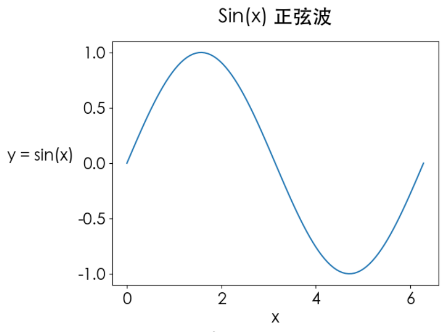

坐标轴刻度

```py
x = np.linspace(0, 2 * np.pi, 100)
y = np.sin(x)

plt.plot(x, y)
plt.title('Sin(x) 正弦波', pad = 20)
plt.rcParams['font.size'] = 18

#设置 y 刻度
yticks = plt.yticks([-1, 0, 1])
#设置 x 刻度 1
#xticks = plt.xticks(np.arange(0, 7))
#设置 x 刻度 2
# xticks = plt.xticks([0, np.pi / 2, np.pi, 3 * np.pi / 2, 2 * np.pi])
#设置 x 刻度 3，显示对应的希腊字母
xticks = plt.xticks([0, np.pi / 2, np.pi, 3 * np.pi / 2, 2 * np.pi],
                    [0, r'$\frac{\pi}{2}$', r'$\pi$', r'$\frac{3\pi}{2}$', r'$2\pi$'],
                    color='red')
```

 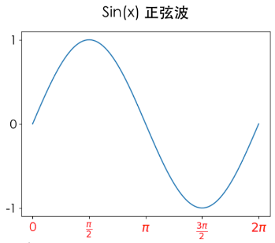

### 图例

也就是文字说明

```py
plt.figure(figsize=(9, 6))

x = np.linspace(0, 2 * np.pi)
plt.plot(x, np.sin(x))
plt.plot(x, np.cos(x))
plt.plot(x, np.sin(x) + np.cos(x))

#图例
plt.legend(['Sin', 'Cos', 'Cos + Sin'], 
           fontsize=18, 
           loc='center', 
           ncol=3, 
           bbox_to_anchor=[0.5, 1.1])
```

 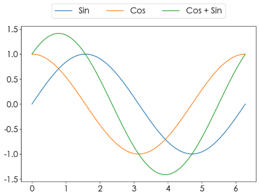

```
`plt.legend()` 的方法参数 bbox_to_anchor

---

bbox_to_anchor : `.BboxBase`, 2-tuple, or 4-tuple of floats
    Box that is used to position the legend in conjunction with *loc*.
    Defaults to `axes.bbox` (if called as a method to `.Axes.legend`) or
    `figure.bbox` (if `.Figure.legend`).  This argument allows arbitrary
    placement of the legend.

    Bbox coordinates are interpreted in the coordinate system given by
    *bbox_transform*, with the default transform
    Axes or Figure coordinates, depending on which ``legend`` is called.

    If a 4-tuple or `.BboxBase` is given, then it specifies the bbox
    ``(x, y, width, height)`` that the legend is placed in.
    To put the legend in the best location in the bottom right
    quadrant of the axes (or figure)::

        loc='best', bbox_to_anchor=(0.5, 0., 0.5, 0.5)

    A 2-tuple ``(x, y)`` places the corner of the legend specified by *loc* at
    x, y.  For example, to put the legend's upper right-hand corner in the
    center of the axes (or figure) the following keywords can be used::

        loc='upper right', bbox_to_anchor=(0.5, 0.5)
```

### 脊柱移动

```py
plt.figure(figsize=(9, 6))

x = np.linspace(0, 2 * np.pi)
#绘制两个图形，需成对儿出现
plt.plot(x, np.sin(x), x, np.cos(x))

#当前子视图，代表两个轴
axes = plt.gca()

#隐藏右边和上边的两条线
axes.spines['right'].set_alpha(0)
axes.spines['top'].set_alpha(0)
#设置下边和左边两条线的位置，data 表示数据
axes.spines['left'].set_position(('data', np.pi)) # 修改竖轴的在 x 上的位置是 pi
axes.spines['bottom'].set_position(('data', 0)) # 修改横轴的在 y 上的位置是 pi
```

 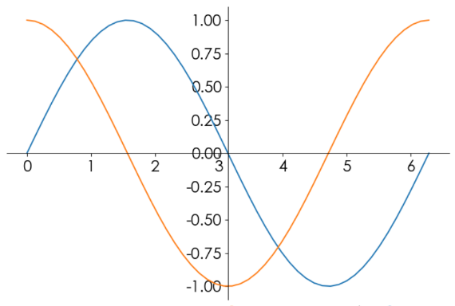

### 图片保存

```py
...

#设置轴面颜色
axes = plt.gca()
axes.set_facecolor('#eee')

#保存图片。也支持 jpg、pdf 等格式。dpi 调整图片分辨率
plt.savefig('sin_cos_200.png', dpi=200)
```

## 风格和样式

颜色线形点形线宽透明度等属性

颜色：https://matplotlib.org/stable/gallery/color/index.html

```
**Markers**

=============   ===============================
character       description
=============   ===============================
``'.'``         point marker
``','``         pixel marker
``'o'``         circle marker
``'v'``         triangle_down marker
``'^'``         triangle_up marker
``'<'``         triangle_left marker
``'>'``         triangle_right marker
``'1'``         tri_down marker
``'2'``         tri_up marker
``'3'``         tri_left marker
``'4'``         tri_right marker
``'8'``         octagon marker
``'s'``         square marker
``'p'``         pentagon marker
``'P'``         plus (filled) marker
``'*'``         star marker
``'h'``         hexagon1 marker
``'H'``         hexagon2 marker
``'+'``         plus marker
``'x'``         x marker
``'X'``         x (filled) marker
``'D'``         diamond marker
``'d'``         thin_diamond marker
``'|'``         vline marker
``'_'``         hline marker
=============   ===============================

**Line Styles**

=============    ===============================
character        description
=============    ===============================
``'-'``          solid line style
``'--'``         dashed line style
``'-.'``         dash-dot line style
``':'``          dotted line style
=============    ===============================

**Colors**

The supported color abbreviations are the single letter codes

=============    ===============================
character        color
=============    ===============================
``'b'``          blue
``'g'``          green
``'r'``          red
``'c'``          cyan
``'m'``          magenta
``'y'``          yellow
``'k'``          black
``'w'``          white
=============    ===============================

**Format Strings**

A format string consists of a part for color, marker and line::

    fmt = '[marker][line][color]'

Example format strings::

    'b'    # blue markers with default shape
    'or'   # red circles
    '-g'   # green solid line
    '--'   # dashed line with default color
    '^k:'  # black triangle_up markers connected by a dotted line
```

示例 1

```py
plt.figure(figsize=(12, 8), )
x = np.linspace(0, 2 * np.pi, 20)
y1 = np.sin(x)
y2 = np.cos(x)

# color or c: color
# linestyle or ls: {'-', '--', '-.', ':', '', (offset, on-off-seq), ...}
# marker: marker style string, `~.path.Path` or `~.markers.MarkerStyle`
# linewidth or lw: float

plt.plot(x, y1, color = 'indigo', ls = '-.', marker = 'p')
plt.plot(x, y2, color = '#FF00EE', ls = '--', marker = 'o')
plt.plot(x, y1+y2, color = (0.2, 0.7, 0.2), ls = ':', marker = '*')
plt.plot(x, y1+2*y2, linewidth = 3, alpha = 0.7, color = 'orange')
plt.plot(x, y1-y2, 'bo--')

plt.legend(['sin', 'cos', 'sin+cos', 'sin+2cos', 'sin-cos'])
```

 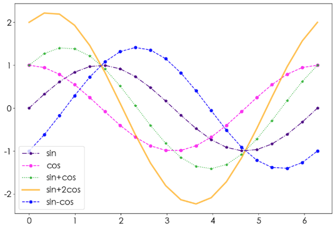

示例 2

```py
def f(x):
    return np.exp(-x) * np.cos(2 * np.pi *x)

x = np.linspace(0, 5, 50)
plt.figure(figsize=(10, 8))

_ = plt.plot(x, f(x), color = 'purple',
         marker = 'o',#点类型
         ls = '--',#线类型
         lw = 2,#线宽
         alpha = 0.6,#点和线的透明度
         markerfacecolor = 'red',#点颜色
         markersize = 10,#点大小
         markeredgecolor = 'green',#点边缘颜色
         markeredgewidth = 3)#点边缘宽度
```

 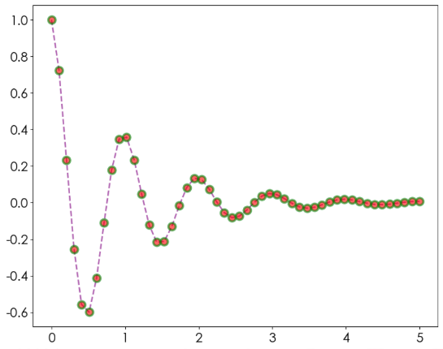

## 多图布局

### 子视图

```py
plt.figure(figsize=(12, 8))
x = np.linspace(0.1, 2*np.pi)

# 两行、两列、第一个图。按从左到右，从上到下堆叠
ax = plt.subplot(3, 2, 1)
ax.plot(x, np.sin(x))

ax = plt.subplot(3, 2, 2)
ax.plot(x, np.cos(x))

ax = plt.subplot(3, 2, 3)
ax.plot(x, np.power(x, 1))

ax = plt.subplot(3, 2, 4)
ax.plot(x, np.power(x, 2))
```

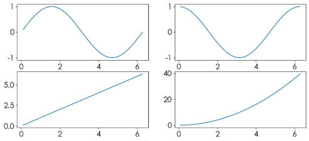

```py
#另一写法
fig,axes = plt.subplots(2, 2)
x = np.linspace(0.1, 2 * np.pi)

axes[0, 0].plot(x, np.sin(x))
axes[0, 1].plot(x, np.cos(x))
axes[1, 0].plot(x, np.exp(x))
axes[1, 1].plot(x, np.log(x))
```

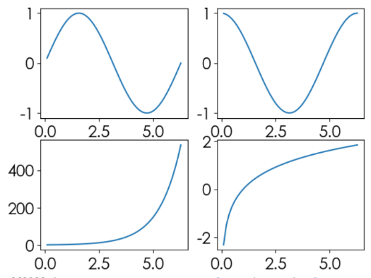

### 嵌套视图

```py
x = np.linspace(-np.pi, np.pi, 20)
y = np.sin(x)

#视图1
plt.figure(figsize = (9,6))
ax = plt.subplot(221) # 等价于 plt.subplot(2, 2, 1)
ax.plot(x, y, color = 'red')
ax.set_facecolor('#eee')

#视图2
ax = plt.subplot(2, 2, 2)
line, = ax.plot(x, -y) # 把数据从单值列表中取出来，比如 a, = [1]
line.set_marker('*')
line.set_markerfacecolor('red')
line.set_markeredgecolor('green')
line.set_markersize(10)

#视图3
# ax = plt.subplot(2, 2, (3, 4))
ax = plt.subplot(2, 2, (3, 4))
plt.sca(ax) # 设置当前视图为 ax，后续使用 plt.plot() 表示把图画到当前视图
plt.plot(x, np.sin(x * x))
```

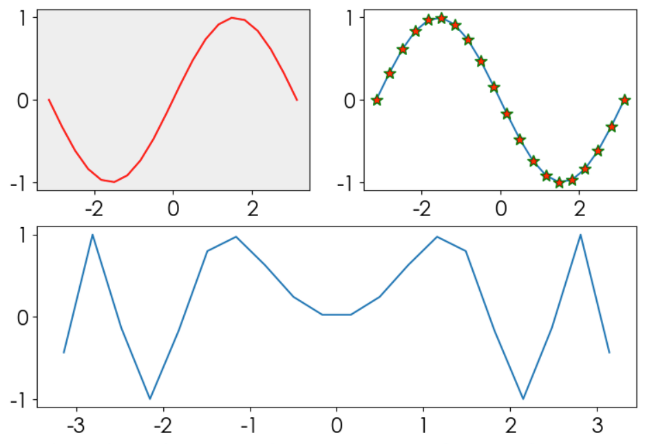

示例 2

```py
x = np.linspace(-np.pi, np.pi, 25)
y = np.sin(x)

# 返回视图对象
fig = plt.figure(figsize = (9, 6))

plt.plot(x, y)

#嵌套方式一
ax = plt.axes([0.2, 0.55, 0.3, 0.3]) # [left, bottom, width, height]
ax.plot(x, y, color = 'g')

#嵌套方式二
ax = fig.add_axes([0.55, 0.2, 0.3, 0.3]) # 使用视图对象添加子视图
ax.plot(x, y, color = 'r')
```

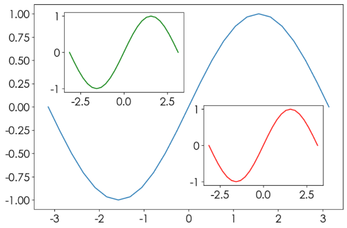

### 多图布局分格显示

**均匀布局**

```py
x = np.linspace(0.1, 2 * np.pi)

fig, ((ax11, ax12, ax13), (ax21, ax22, ax23), (ax31, ax32, ax33)) = \
 plt.subplots(3, 3)

fig.set_figwidth(9)
fig.set_figheight(6)

ax11.plot(x, np.sin(x))
ax12.plot(x, np.cos(x))
ax13.plot(x, np.sin(x) + np.cos(x))

ax21.plot(x, np.power(x, 1))
ax22.plot(x, np.power(x, 2))
ax23.plot(x, np.power(x, 3))

ax31.plot(x, np.exp(x))
ax32.plot(x, np.log(x))
ax33.plot(x, np.log2(x))
```

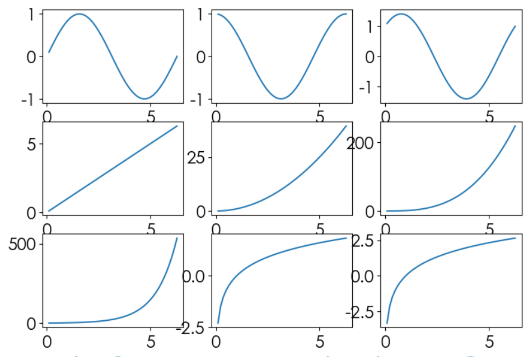


**不均匀布局**

一种绘制方式

```py
x = np.linspace(0.1, 2 * np.pi, 200)
fig = plt.figure(figsize = (12, 9))

ax1 = plt.subplot(3, 1, 1) # 一列
ax1.plot(x, np.sin(x))
ax1.set_title('ax1_title')

ax2 = plt.subplot(3, 3, (4, 5))
ax2.set_facecolor('#eee')
ax2.plot(x, np.cos(x), color = 'red')

ax3 = plt.subplot(3, 3, (6, 9))
ax3.plot(x, x - x ** 2)

ax3 = plt.subplot(3, 3, 7)
ax3.plot(x, x ** 4)

ax3 = plt.subplot(3, 3, 8)
ax3.plot(x, x)

plt.show()
```

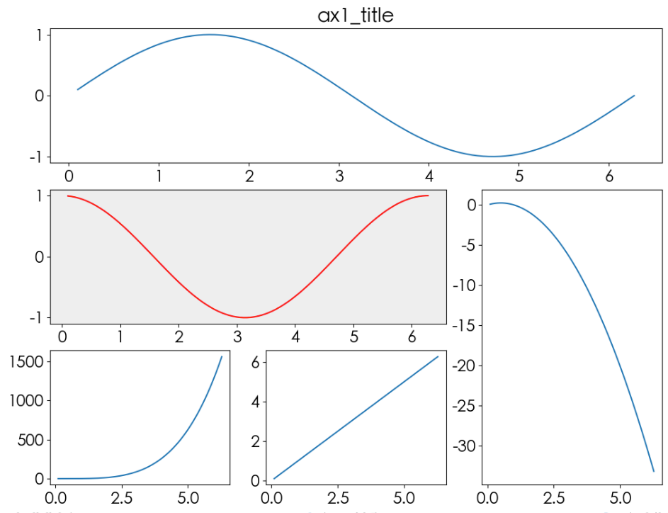

### 双轴显示

```py
plt.figure(figsize=(12, 10))

x = np.linspace(-np.pi, np.pi, 50)

plt.plot(x, np.sin(x), color='blue')
_ = plt.yticks(np.linspace(-1, 1, 11), color='blue')

axes = plt.gca() # 获取当前视图
axes.twinx() # 根据当前视图创建共用 x 轴的视图
plt.plot(x, np.exp(x), color='red')
_ = plt.yticks(np.linspace(0, 24, 6), color='red')
```

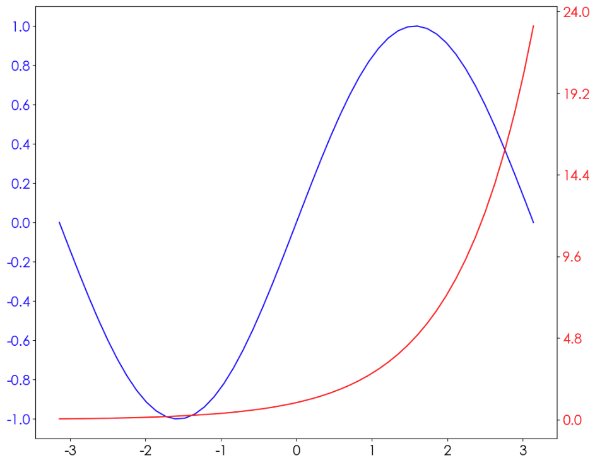

> 同理也可以共 y 轴，但不常用

## 练习 1

```
1、画图。要求

- 背景颜色：灰色
- 视图颜色：灰色
- 网站线颜色：白
- 网格线样式：虚
- 函数方程式：y = np.sin(x + i * 0.5) * (7 - i), 0<i<7
```

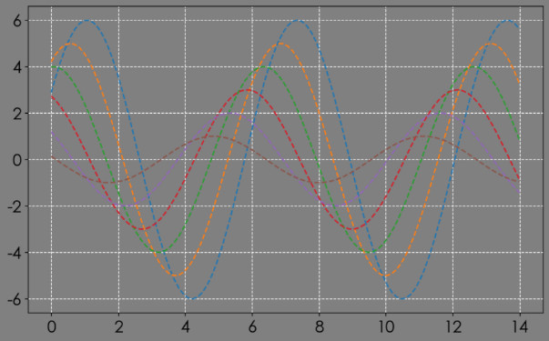

```py
x = np.linspace(0, 14, 100)

#Create a new figure, or activate an existing figure.
fig = plt.figure(figsize = (10, 6))
fig.set_facecolor('gray')

#Add an Axes to the current figure and make it the current Axes.
ax = plt.axes()
ax.set_facecolor('gray')

for i in range(1, 7):
    ax.plot(x, np.sin(x + i*0.5) * (7 - i), ls = '--', )

#网格线
ax.grid(color = 'white', linestyle = '--')
```

```py
#另一个答案
#--------
x = np.linspace(0, 14, 100)

fig = plt.figure(figsize = (10, 6))
fig.set_facecolor('gray')

for i in range(1, 7):
    #在当前视图上绘制
    plt.plot(x, np.sin(x + i*0.5) * (7 - i), ls = '--', )

#获取当前视图
axes = plt.gca()
axes.set_facecolor('gray')

plt.grid(color = 'white', linestyle = '--')
```

```
2、根据所提供的数据进行分组聚合运算，绘制如下图形

- 原始数据：`PM2.5.xlsx`
- 分组聚合，求各城市春夏秋冬 PM2.5 的平均值
- 对前一步的结果进行数据重塑
- 调整行索引顺序为：北京、上海、广州、沈阳、成都
- 调正列索引顺序为：春夏秋冬
- 设置中文字体显示
- 使用 DataFrame 方法绘制条形图
```

```py
df = pd.read_excel('PM2.5.xlsx')
df2 = df.groupby(by = ['城市', '季节'])[['PM2.5']].mean().round(2)
#数据重塑
df3 = df2.unstack(level=1)
df3 = df3.loc[['北京', '上海', '广州', '沈阳', '成都']]
#删除第 1 层列索引
df3.columns = df3.columns.droplevel(0)
df3 = df3[list('春夏秋冬')]
df3.plot.bar(figsize = (12, 9))
```

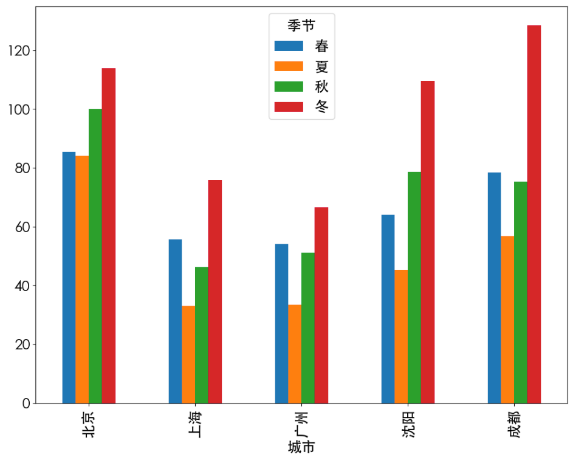

## 文本箭头注释

常用函数汇总

|  Pyplot函数  |            API方法            |          描述            |
| :---------: | :-------------------------:  | :----------------------: |
|   `text()`   |     `mpl.axes.Axes.text()`     |在 Axes 对象的任意位置添加文字  |
|  `xlabel()`  |  `mpl.axes.Axes.set_xlabel()`  |       为 X 轴添加标签      |
|  `ylabel()`  |  `mpl.axes.Axes.set_ylabel()`  |       为 Y 轴添加标签      |
|   `title()`   |  `mpl.axes.Axes.set_title()`  |     为 Axes 对象添加标题   |
|  `legend()`  |    `mpl.axes.Axes.legend()`    |     为 Axes 对象添加图例   |
| `annnotate()` |   `mpl.axes.Axes.annotate()`   |为 Axes 对象添加注释（箭头可选）|
|  `figtext()`  |   `mpl.figure.Figure.text()`   |在 Figure 对象的任意位置添加文字|
| `suptitle()` | `mpl.figure.Figure.suptitle()` | 为 Figure 对象添加中心化的标题 |

### 文本

```py
x = np.linspace(0.0, 5.0, 100)
y = np.cos(2 * np.pi * x) * np.exp(-x)

plt.figure(figsize=(9, 6))

plt.plot(x, y, 'green')

#视图标题。指定字体属性
plt.title('exponential decay', fontdict = {'fontsize': 20,
                                         'family': 'Kaiti SC',
                                         'color':  'red',
                                         'weight': 'bold'})

#超级标题（figure 级别）
plt.suptitle('指数衰减', y = 1.05,fontdict = font, fontsize = 30)

#文本
plt.text(x = 3, y = 0.8, # 横纵坐标位置
         s = r'$\cos(2 \pi t) * \exp(-t)$') # 文本内容

plt.xlabel('time (s)')
plt.ylabel('voltage (mV)')
plt.show()
```

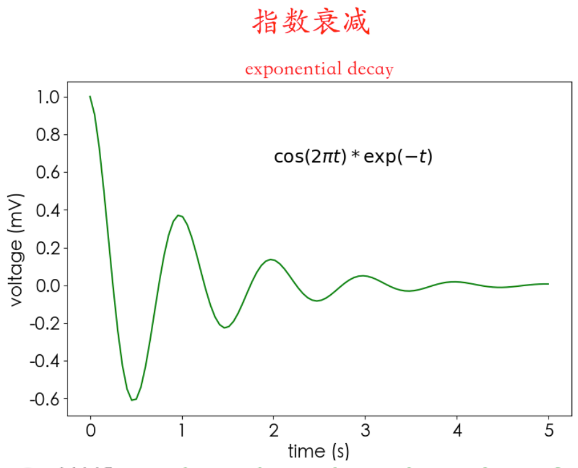

### 箭头

```py
#10 个点
loc = np.random.randint(0, 10, size=(10, 2))
plt.figure(figsize=(10, 10))
#把点画出来
plt.plot(loc[:, 0], loc[:, 1], 'go', ms=10)
plt.grid(True)

#路径
way = np.arange(10)
np.random.shuffle(way) # 打散

for i in range(0, len(way)-1):
    start = loc[way[i]]
    end = loc[way[i+1]]
    #箭头
    plt.arrow(start[0], start[1], end[0]-start[0], end[1]-start[1],#坐标与轴方向距离
              head_width=0.2, lw=2,#箭头长度，箭尾线宽
              length_includes_head=True)
    #给 start 添加文本编号
    plt.text(start[0], start[1], s = i, fontsize=18, color='red')
    #最后一个箭头时给最后一个点添加编号
    if i == len(way) - 2:
        plt.text(end[0], end[1], s = i + 1, fontsize=18, color='red')
        print(loc[way[0]]-end[0])
        plt.arrow(end[0], end[1], 
                  loc[way[0]][0]-end[0], loc[way[0]][1]-end[1],#坐标与轴方向距离
                  head_width=0.2, lw=2,#箭头长度，箭尾线宽
                  length_includes_head=True, color='red')
```

 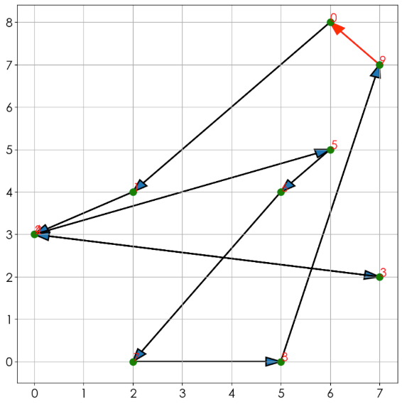

### 注释

```py
plt.figure(figsize=(10, 8))
fig, ax = plt.subplots()

x = np.arange(0.0, 5.0, 0.01)
y = np.cos(2 * np.pi * x)
line, = ax.plot(x, y, lw=2)

ax.annotate('local max',
            xy=(2, 1.1),#箭头结束位置
            xytext=(3, 1.5),#文本位置，也是箭头开始位置
            arrowprops=dict(facecolor='black', shrink=0.05))

ax.annotate('local min',
            xy=(2.6, -1),#箭头结束位置
            xytext=(4, -1.5),#文本位置，也是箭头开始位置
            arrowprops=dict(facecolor='black',
                            width=2,#箭体宽度
                            headwidth=10,#箭头头部宽度
                            headlength=30,#箭头头部长度
                            shrink=0.01))#箭头箭尾收缩百分比

ax.annotate('median',
            xy=(2.25, 0),#箭头结束位置
            xytext=(0.5, -1.8),#文本位置，也是箭头开始位置
            arrowprops=dict(arrowstyle='-|>'),
           fontsize=20)

ax.set_ylim(-2, 2)
```

 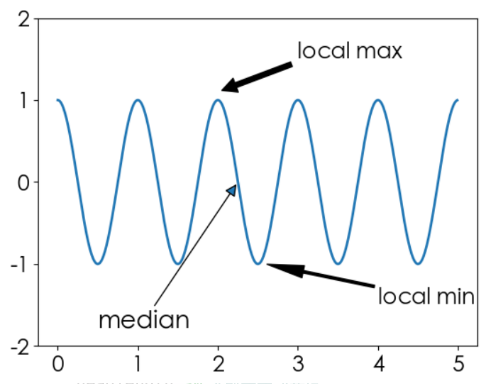

### 注释箭头连接形状

示例

```py
x = np.linspace(0, 2 * np.pi)
plt.plot(x, np.sin(x))
plt.annotate(text = r'$(\pi, 0)$',
            xy=(3.14, 0),
            xytext=(5, 0.6),
            arrowprops=dict(arrowstyle='->', color='red',
                            shrinkA = 5,shrinkB = 5,
                            connectionstyle='angle3,angleA=90,angleB=0'))
```

 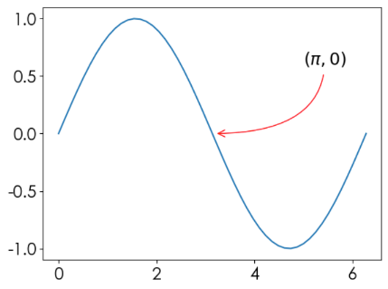

其他箭头连接样式

```py
def annotate_con_style(ax, connectionstyle):
    x1, y1 = 3,2
    x2, y2 = 8,6
    ax.plot([x1, x2], [y1, y2], ".")
    ax.annotate(text = '',
                xy=(x1, y1), # 相当于B点，arrow head
                xytext=(x2, y2), # 相当于A点，arrow tail
                arrowprops=dict(arrowstyle='->', color='red',
                                shrinkA = 5,shrinkB = 5,
                                connectionstyle=connectionstyle))
 
    ax.text(.05, 0.95, connectionstyle.replace(",", "\n"),
            transform=ax.transAxes, # 相对坐标
            ha="left", va="top")# 指定对齐方式
 
# 常用箭头连接样式
fig, axs = plt.subplots(3, 5, figsize=(12, 10))
annotate_con_style(axs[0, 0], "angle3,angleA=90,angleB=0")
annotate_con_style(axs[1, 0], "angle3,angleA=0,angleB=90")
annotate_con_style(axs[2, 0], "angle3,angleA = 0,angleB=150")
annotate_con_style(axs[0, 1], "arc3,rad=0.")
annotate_con_style(axs[1, 1], "arc3,rad=0.3")
annotate_con_style(axs[2, 1], "arc3,rad=-0.3")
annotate_con_style(axs[0, 2], "angle,angleA=-90,angleB=180,rad=0")
annotate_con_style(axs[1, 2], "angle,angleA=-90,angleB=180,rad=5")
annotate_con_style(axs[2, 2], "angle,angleA=-90,angleB=10,rad=5")
annotate_con_style(axs[0, 3], "arc,angleA=-90,angleB=0,armA=30,armB=30,rad=0")
annotate_con_style(axs[1, 3], "arc,angleA=-90,angleB=0,armA=30,armB=30,rad=5")
annotate_con_style(axs[2, 3], "arc,angleA=-90,angleB=0,armA=0,armB=40,rad=0")
annotate_con_style(axs[0, 4], "bar,fraction=0.3")
annotate_con_style(axs[1, 4], "bar,fraction=-0.3")
annotate_con_style(axs[2, 4], "bar,angle=180,fraction=-0.2")

for ax in axs.flat:
    # 设置轴域刻度
    ax.set(xlim=(0, 10), ylim=(0, 10),xticks = [],yticks = [],aspect=1)
fig.tight_layout(pad=0.2)
```

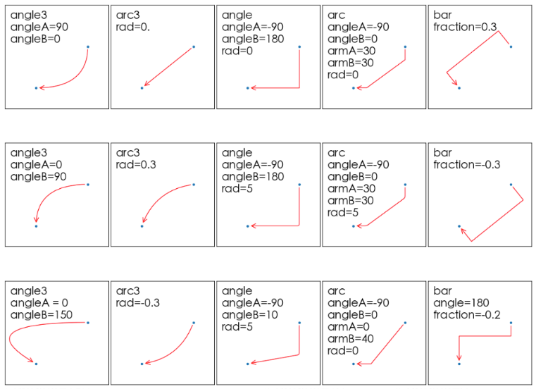

## 常用视图

### 折线图

```py
x = np.random.randint(0, 10, size=15)

#一图多线
plt.figure(figsize=(9,6))
plt.plot(x, marker='*', color='r') # 只给一个数组，索引作为横坐标
plt.plot(x.cumsum(), marker='o')
```

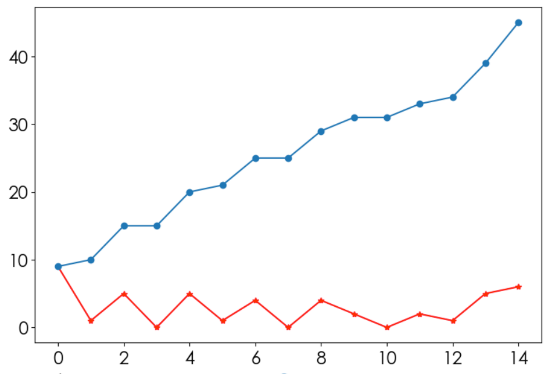

```py
#多图布局

#Create a figure and a set of subplots.
fig, axes = plt.subplots(2, 1)
fig.set_figwidth(9)
fig.set_figwidth(6)

axes[0].plot(x, marker='*', color='r')
axes[1].plot(x.cumsum(), marker='o')
```

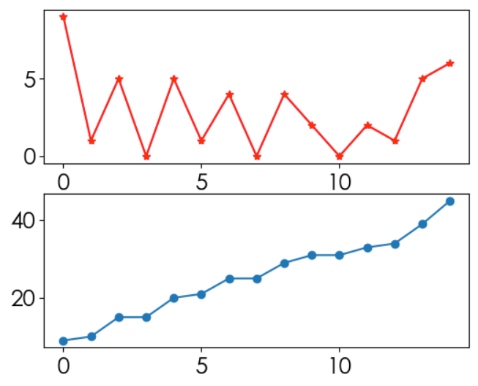

### 柱状图

```py
#6个年级
labels = ['G1', 'G2', 'G3', 'G4', 'G5', 'G6']
#年级均值
men_mean = np.random.randint(20, 35, size=6)
#年级标准差
men_std = np.random.randint(1, 7, size=6)

width = 0.35
plt.bar(labels,#横座标
        men_mean,#数据
        width,#柱状体宽度
        yerr=men_std,#误差条，通常使用标准差表示
        label='Men')#标签

plt.ylabel('Scores')
plt.title('Scores by group and gender')
plt.legend()
```

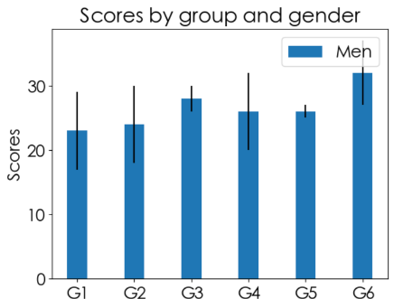

```py
labels = ['G1', 'G2', 'G3', 'G4', 'G5', 'G6']

men_mean = np.random.randint(20, 35, size=6)
wen_mean = np.random.randint(20, 35, size=6)
men_std = np.random.randint(1, 7, size=6)
wen_std = np.random.randint(1, 7, size=6)

width = 0.35
plt.bar(labels,#横座标
        men_mean,#数据
        width,#柱状体宽度
        yerr=men_std,#误差条
        label='Men')#标签

plt.bar(labels,#横座标
        wen_mean,#数据
        width,#柱状体宽度
        yerr=wen_std,#误差条
        bottom=men_mean,#下边是什么数据
        label='Women')#标签

plt.ylabel('Scores')
plt.title('Scores by group and gender')
plt.legend()
```

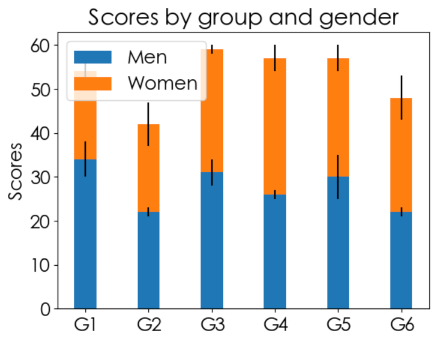

### 条形图

```py
boys = np.random.randint(0, 35, size=6)
girls = np.random.randint(0, 35, size=6)

plt.figure(figsize = (9, 6))

x = np.arange(6)
width = 0.3
plt.bar(x - width/2, boys, width)
plt.bar(x + width/2, girls, width)

plt.legend(['Boys', 'Girls'])

#横轴刻度
labels = ['G1', 'G2', 'G3', 'G4', 'G5', 'G6']
_ = plt.xticks(x, labels)

#放文本
for i in range(6):
    s1 = boys[i]
    plt.text(x = i - width/2, y = s1 + 0.2, s = s1, fontdict={"fontsize":12}, ha='center')
    s2 = girls[i]
    plt.text(x = i + width/2, y = s2 + 0.2, s = s2, fontdict={"fontsize":12}, ha='center')
```

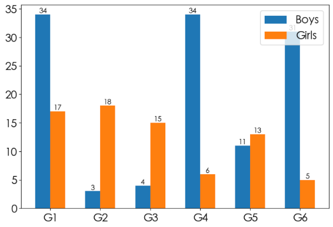

### 极座标图

```py
x = np.linspace(0, 4 * np.pi, 200)
y = np.linspace(0, 2, 200)

plt.subplot(1,1,1,projection = 'polar')
plt.plot(x, y)
```

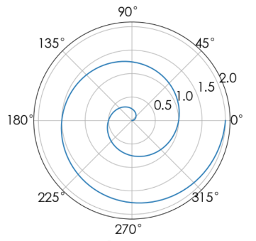

```py
x = np.linspace(0, 4 * np.pi, 200)
y = np.linspace(0, 2, 200)

ax = plt.subplot(1,1,1,projection = 'polar')
ax.plot(x, y)

# 最大半径
ax.set_rmax(3)
# 设置刻度
ax.set_rticks([0.5, 1, 1.5, 2])
# 网格
ax.grid(True)
```

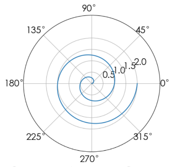

### 条形极座标

```py
N = 8
x = np.linspace(0, 2 * np.pi, N, endpoint=False)
y = np.random.randint(3, 15, size = N)

# 2pi / N
width = 2 * np.pi / N

# 随机生成 N 种颜色
colors = np.random.rand(N, 3)

plt.subplot(1,1,1,projection = 'polar')

# width: 每个条形的宽度
plt.bar(x, y, width, color = colors)
```

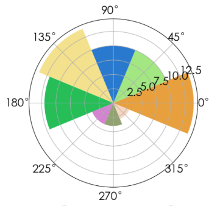

### 直方图

```py
miu = 100
sigma = 15
x = np.random.normal(loc = miu, scale = sigma, size = 100000)

fig, ax = plt.subplots()

#创建直方图，常用来描述统计性的数据。x 个数据分为 bins 个条
n, bins, patches = ax.hist(x, bins=100, rwidth = 0.8)
# rwidth: The relative width of the bars as a fraction of the bin width.

# len(bins) = len(n) + 1
#----
# n[0]  = count(x < bins[0])
# n[i]  = count(bins[i-1] <= x < bins[i])
# n[99] = count(x >= bins[99])
#----
```

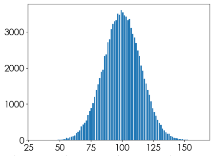

### 箱形图

```py
x = np.random.normal(size = (500, 4))
labels = ['A', 'B', 'C', 'D']
_ = plt.boxplot(x, 1, 'r.', labels)
```

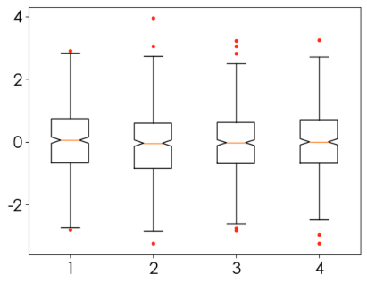

红点表示**异常值**

从上到下分别是零分位、四分之一分位、中分位、四分之三分位、百分位线

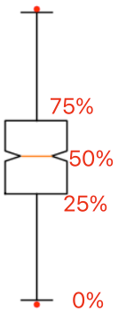

可用来观察异常值情况、分布情况

### 散点图

```py
x = np.random.randn(100, 2)
r = np.random.randint(50, 300, size = 100)
c = np.random.randn(100)

plt.scatter(x[:, 0],
            x[:, 1],
            r,#半径
            c,#颜色
            alpha=0.7)
```

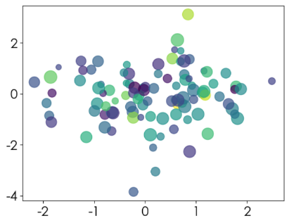

### 饼图

```py
labels = ['五星', '四星', '三星', '二星', '一星']
percent = [96, 261, 105, 30, 9]

plt.figure(figsize=(5, 5), dpi=150)

_ = plt.pie(x = percent,
            explode=(0, 0, 0, 0.1, 0), #偏移中心量
            labels=labels,#标签
            autopct='%0.1f%%',#显示百分比
            #shadow=True#阴影
           )
```

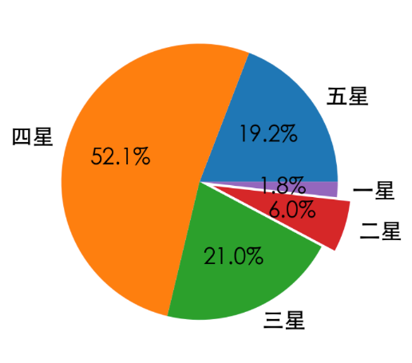

### 嵌套饼图

```py
food = pd.read_excel('./food.xlsx')
plt.figure(figsize=(8,8))

# 分组聚合，内圈数据
inner = food.groupby(by = 'type')['花费'].sum()
outer = food['花费'] # 外圈数据

# 绘制内部饼图
plt.pie(x = inner, # 数据
        radius=0.6, # 饼图半径
        wedgeprops=dict(linewidth=3,width=0.6,edgecolor='w'),# 饼图格式：间隔线宽、饼图宽度、边界颜色
        labels = inner.index, # 显示标签
        labeldistance=0.4) # 标签位置

# 绘制外部饼图
plt.pie(x = outer, 
        radius=1, # 半径
        wedgeprops=dict(linewidth=3,width=0.3,edgecolor='k'),# 饼图格式：间隔线宽、饼图宽度、边界颜色
        labels = food['食材'], # 显示标签
        labeldistance=1.2) # 标签位置
 
# 设置图例标题，bbox_to_anchor = (x, y, width, height)控制图例显示位置
plt.legend(inner.index,bbox_to_anchor = (0.9,0.6,0.4,0.4),title = '食物占比')
plt.tight_layout()
```

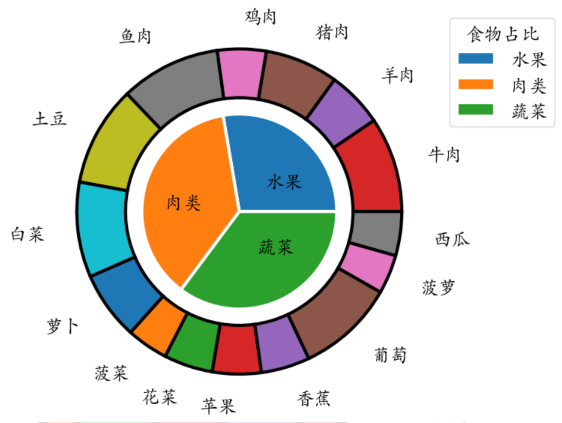

甜甜圈

```py
plt.figure(figsize=(6,6))
# 甜甜圈原料
recipe = ["225g flour",
          "90g sugar",
          "1 egg",
          "60g butter",
          "100ml milk",
          "1/2package of yeast"]
# 原料比例
data = [225, 90, 50, 60, 100, 5]
wedges, texts = plt.pie(data,startangle=40)
bbox_props = dict(boxstyle="square,pad=0.3", fc="w", ec="k", lw=0.72)
kw = dict(arrowprops=dict(arrowstyle="-"),
          bbox=bbox_props,va="center")

for i, p in enumerate(wedges):
    ang = (p.theta2 - p.theta1)/2. + p.theta1 # 角度计算
    # 角度转弧度----->弧度转坐标
    y = np.sin(np.deg2rad(ang))
    x = np.cos(np.deg2rad(ang))
    ha = {-1: "right", 1: "left"}[int(np.sign(x))] # 水平对齐方式
    connectionstyle = "angle,angleA=0,angleB={}".format(ang) # 箭头连接样式
    kw["arrowprops"].update({"connectionstyle": connectionstyle}) # 更新箭头连接方式
    plt.annotate(recipe[i], xy=(x, y), xytext=(1.35*np.sign(x), 1.4*y),
                 ha=ha,**kw,fontsize = 18,weight = 'bold')
plt.title("Matplotlib bakery: A donut",fontsize = 18,pad = 25)
plt.tight_layout()
```

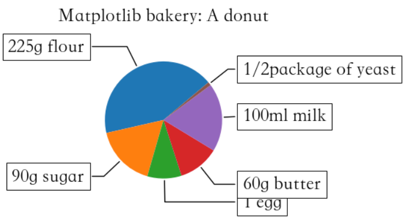

### 热力图

```py
plt.figure(figsize=(6, 6))


vegetables = ["cucumber", "tomato", "lettuce", "asparagus","potato", "wheat", "barley"]
farmers = list('ABCDEFG')

harvest = np.random.rand(7, 7) * 5 # 农民丰收数据
im = plt.imshow(harvest, cmap='PuBu') # cmap,colormap: plt.colormaps()

plt.xticks(np.arange(len(farmers)),farmers,rotation = 45,ha = 'right')
plt.yticks(np.arange(len(vegetables)),vegetables)

# ------------- 绘制文本 ------------- 
for i in range(len(vegetables)):
    for j in range(len(farmers)):
        text = plt.text(j, i, round(harvest[i, j],1),
                       ha="center", va="center", color='r')
plt.title("Harvest of local farmers (in tons/year)",pad = 20)
fig.tight_layout()
```

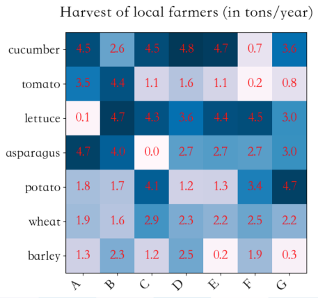

### 面积图

```py
plt.figure(figsize=(6, 4))
days = [1,2,3,4,5]  
sleeping =[7,8,6,11,7]
eating = [2,3,4,3,2]
working =[7,8,7,2,2]
playing = [8,5,7,8,13]

plt.stackplot(days,sleeping,eating,working,playing)  
plt.legend(['Sleeping','Eating','Working','Playing'],fontsize = 18)
```

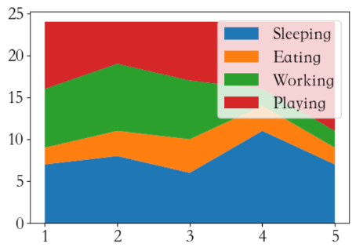

### 蜘蛛图

```py
# stats=[83, 61, 95, 67, 76, 88]
# angles=np.linspace(0, 2*np.pi, len(labels), endpoint=False)
# stats=np.concatenate((stats,[stats[0]]))
# angles=np.concatenate((angles,[angles[0]]))

labels=np.array(["个人能力","IQ","服务意识","团队精神","解决问题能力","持续学习"])
x = np.linspace(0, 2 * np.pi, len(labels))
print(x)
y = [83, 61, 95, 67, 76, 88]

# 把第一个元素拼接到最后，形成闭合多边形
y = np.concatenate([y, [y[0]]])
print(y)
x = np.concatenate([x, [x[0]]])

fig = plt.figure(figsize=(6, 6))
ax = fig.add_subplot(111, polar=True)   
ax.plot(x, y, 'r*--', linewidth=2) # 'o-'

ax.fill(x, y, alpha=0.35) # 填充
_ = ax.set_xticks(x[:-1], labels)
```

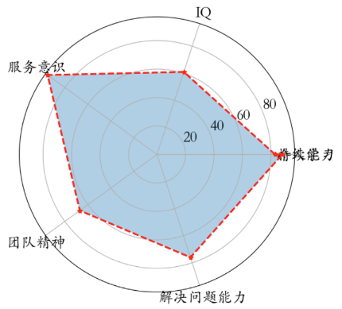

## 3D 图形

https://matplotlib.org/stable/gallery/mplot3d/index.html

```py
x = np.linspace(0, 60, 300)
y = np.sin(x)
z = np.cos(x)

fig = plt.figure(figsize=(9, 6))

ax = fig.add_subplot(projection='3d')
ax.plot(x, y, z)
```

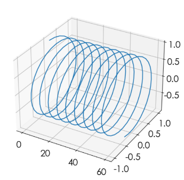

## Seaborn ⭐️

Seaborn 是一个**基于 matplotlib** 的 Python 数据可视化库。 它提供了一个高级界面，用于绘制有吸引力且信息丰富的统计图形。

安装：https://seaborn.pydata.org/installing.html

### 快速上手

```py
#suppress pandas future warning
#https://stackoverflow.com/a/15778297
import warnings
warnings.simplefilter(action='ignore', category=FutureWarning)

import seaborn as sns
import matplotlib.pyplot as plt
import pandas as pd
import numpy as np

# 修改主题分格 style: darkgrid|whitegrid|dark|white|ticks
# context: paper|notebook|talk|poster
sns.set(style = 'darkgrid', context = 'poster', font='STHeiti')
plt.rcParams['font.sans-serif'] = ['STHeiti']
plt.rcParams['axes.unicode_minus'] = False

plt.figure(figsize = (9, 6))

x = np.linspace(0, 2 * np.pi, 20)
y = np.sin(x)

#线形图
sns.lineplot(x=x, y=y, color = 'green', ls = '--')
sns.lineplot(x=x, y=np.cos(x), color = 'red', ls = '-.')
```

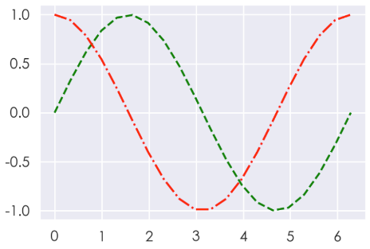

### 调色板

参数 `palette` 用于修改颜色分格，默认有六种选择：`deep, muted, bright, pastel, dark, colorblind`

matplotlib 提供了更多的选择，可通过 `plt.colormaps()` 查看
### 线形图

```py
plt.figure(figsize=(9,6))
fmri = pd.read_csv('./fmri.csv') # fmri这一核磁共振数据
ax = sns.lineplot(data= fmri,
                  x = 'timepoint',#绘制 timepoint 一列
                  y = 'signal',#绘制signal一列
                  hue = 'event',#根据指定的属性即 event 进行分组
                  style = 'event' ,#根据指定的属性即 event 指定样式
                  palette='colorblind',#颜色风格
                  markers=True,
                  markersize = 10)
```

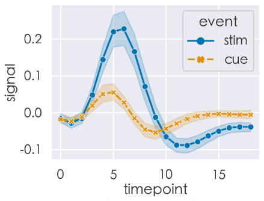

### 散点图

```py
data = pd.read_csv('./tips.csv') # 小费

plt.figure(figsize=(9,6))
sns.set(style = 'darkgrid',context = 'talk')

# 散点图
fig = sns.scatterplot(x = 'total_bill', y = 'tip', 
                      hue = 'time', data = data, 
                      palette = 'autumn', s = 100)
```

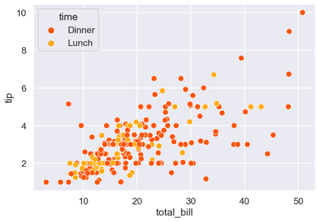

### 柱状图

```py
plt.figure(figsize = (9,6))
sns.set(style = 'whitegrid')

tips = pd.read_csv('./tips.csv') # 小费

ax = sns.barplot(x = "day", y = "total_bill", 
                 data = tips,hue = 'sex',
                 palette = 'colorblind',
                 capsize = 0.2)
```

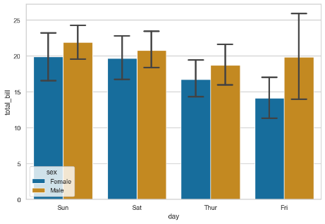

### 箱式图

```py
sns.set(style = 'ticks')
tips = pd.read_csv('./tips.csv')
ax = sns.boxplot(x="day", y="total_bill", data=tips,palette='colorblind')
```

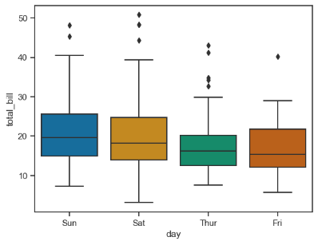

### 直方图

```py
sns.set(style = 'dark')
x = np.random.randn(5000)
sns.histplot(x,kde = True)
```

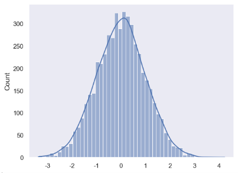

```py
sns.set(style = 'darkgrid')
tips = pd.read_csv('./tips.csv')
sns.histplot(x = 'total_bill', data = tips, kde = True)
```

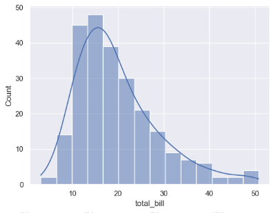

### 分类散点图

```py
sns.set(style = 'darkgrid')
exercise = pd.read_csv('./exercise.csv')
sns.catplot(x="time", y="pulse", hue="kind", data=exercise)
```

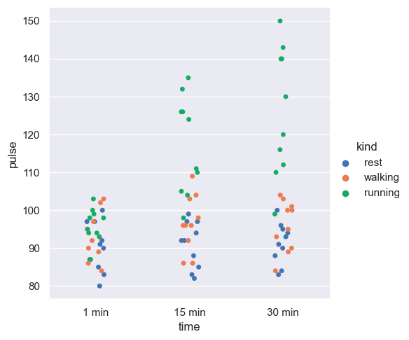

### 热力图

```py
plt.figure(figsize=(12,9))

flights = sns.load_dataset("flights")

# 数据透视
flights = (
    flights
    .pivot(index="month", columns="year", values="passengers")
)

f, ax = plt.subplots(figsize=(9, 6))
sns.heatmap(flights, annot=True, fmt="d", linewidths=.5, ax=ax)
```

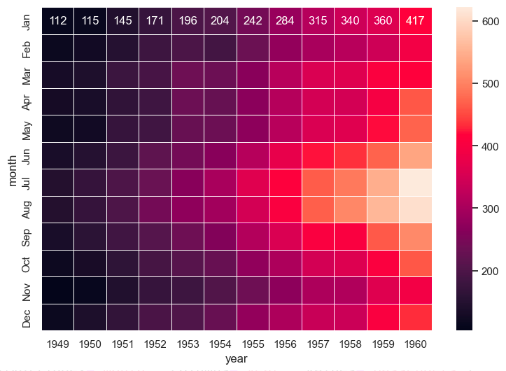


