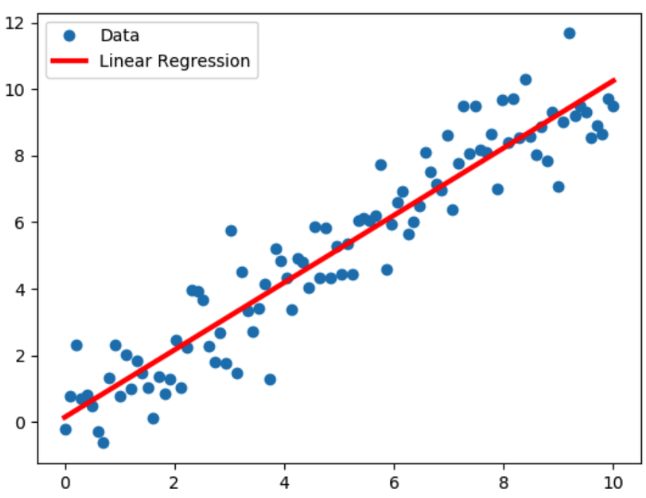
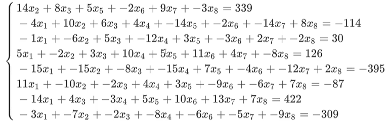
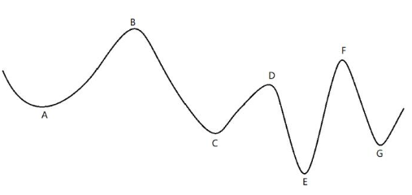
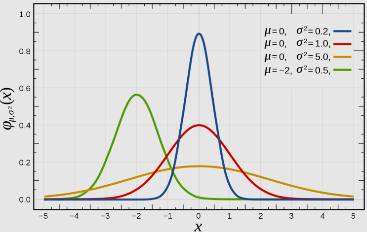
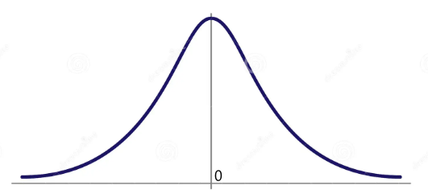
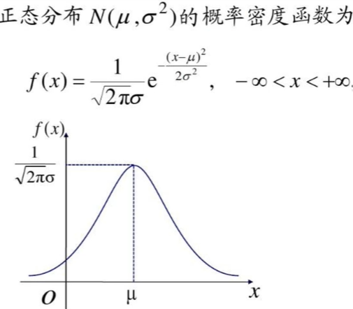
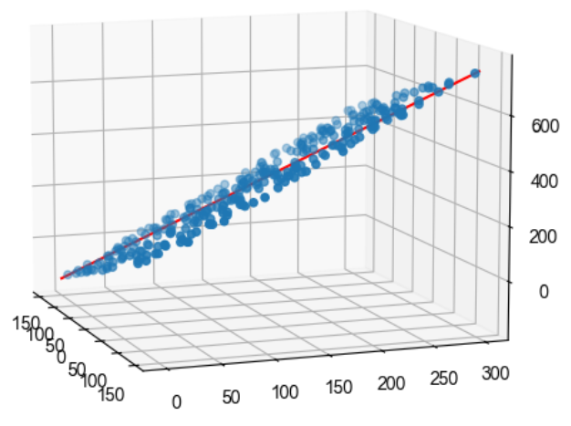
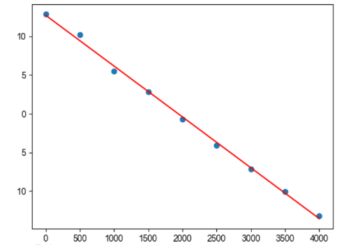

# 多元线性回归

<link rel="stylesheet" href="https://cdnjs.cloudflare.com/ajax/libs/KaTeX/0.5.1/katex.min.css"/>
<link rel="stylesheet" href="https://cdn.jsdelivr.net/github-markdown-css/2.2.1/github-markdown.css"/>

## 目录

- [1. Numpy 科学计算库](/ai/ml-intro/)
- [2. Pandas 数据分析库](/ai/ml-intro/02-pandas/)
- [3. Mathplotlib 可视化库](/ai/ml-intro/03-matplotlib/)
- [4. 线性回归](/ai/ml-intro/04-linear-regression/)
- [5. 梯度下降](/ai/ml-intro/05-gradient-descent/)

## 基本概念

线性回归是机器学习中**有监督**机器学习下的一种**算法**。回归问题主要关注的是**因变量**和**一个或多个数值型的自变量**之间的关系。

- 因变量（也叫目标变量），表示需要进行预测的值，通常用 `target`、`y` 表示
- 自变量，是影响因变量的因素，通常用 $X_1...X_n$ 表示，可以是连续值，也可以是离散值
- 自变量和因变量之间的关系称为模型（`model`），使我们需要求解的

### 连续值与离散值

连续值：身高、体重、智商等

离散值：某国的省份、某学校所开的专业等

### 简单线性回归

算法说白了就是公式，简单线性回归也属于一个算法，他对应的公式为：

$y=wx+b$

这个公式中，y 是目标变量即未来要预测的值，x 是影响 y 的因素，w 和 b 是公式上的参数，即要求的模型。

实际上 b 就是截距，w 就是斜率。因为 y 仅受 x 一次方的影戏，所以称该模型为简单线性回归。

大家上小学时就会解这种一元一次方程了，为什么那时不叫人工智能算法呢？因为人工智能算法要求的是最优解！

### 最优解

- 真实值，一般用 $y$ 表示
- 预测值，是把已知的 $x$ 带入到公式里计算得到的，一般用 $\hat y$ 表示
- 误差，表示真实值和预测值之间的差距，一般用 $\varepsilon$ 表示
- 总体误差，该值由损失函数（Loss Function）计算得到，通常用 $Loss$ 表示
- 最优解：尽可能找到一个模型使得 $Loss$​ 最小



### 多元线性回归

现实生活中，往往影响 y 的因素不止一个，这时 x 就从一个变成了 n 个，此时的问题就变成了多元线性回归，公式为：

$\hat y = w_1x_1+w_2x_2+...+w_nx_n+b$

其中的 b 表示截距，也可以用 $w_0$ 表示：

$\hat y = w_1x_1+w_2x_2+...+w_nx_n+w_0$

更进一步，**使用向量来表示**：

- $X$ 表示所有的变量，是一维向量，即 $X = \begin{pmatrix}1 \space x_1 \space x_2 \space  ...\space  x_n \end{pmatrix}$
- $W$ 表示所有系数（包含 $w_0$），是一维向量，即 $W = \begin{pmatrix}w_0 \space w_1 \space w_2 \space  ...\space  w_n \end{pmatrix}$

根据向量乘法规律可以写为：$\hat y = W^TX$

## 正规方程

正规方程可以推算出多元代数方程的最优解。

正规方程由最小二乘法推导出

正规方程为 $W=(X^TX)^{-1}X^Ty$，其中的 $W$ 也可用 $\theta$ 表示

### 最小二乘法及其矩阵表示

**最小二乘法**公式：（出自高斯）

<font size=5>$J(\theta)=\frac{1}{2} \sum \limits_{i=0}^m (h_{\theta}(x^{(i)}) - y^{(i)}) ^ 2$</font>

> $y^{(i)}$：表示第 i 个数据的真实值。
>
> $h_{\theta}(x^{(i)})$ ：表示第 i 个数据的预测值。其中的 $\theta$ 也可以用 $w$ 或 $a$ 表示
>
> $m$：表示一共 m 个样本

**将其转化为矩阵表示**（上边的公式侧重于对单个样本的计算；下边矩阵操作可以理解为把 m 个样本数据 `“摞”` 起来一起算）

<font size=5>$J(\theta)=\frac{1}{2} (X\theta - y)^T(X\theta - y)$</font>

其中

<font size=5>$\theta_{(n+1,1)} = \begin{pmatrix} \theta_0 \\ \theta_1 \\ \theta_2 \\  ...\\  \theta_n \end{pmatrix}$</font>

<font size=5>$X_{(m,n+1)} = \begin{pmatrix} x^{(1)} \\ x^{(2)} \\ ... \\ x^{(m)} \end{pmatrix}$</font>

其中 $x^{(i)}$ 表示第 i 个样本，是一个一维变量，即 <font size=5>$x^{(i)} = \begin{pmatrix} 1 \space x_1^{(i)} \space x_2^{(i)} \space  ...\space  x_n^{(i)} \end{pmatrix}$​</font>

$y$ 表示这 m 个样本的结果，即 <font size=5>$y_{(m,1)} = \begin{pmatrix} y^{(1)} \space y^{(2)} \space  ...\space y^{(m)} \end{pmatrix}$</font>

### 多元一次方程举例及求解

1、二元一次方程

```
x + y = 14
2x - y = 10
```


2、三元一次方程

```
x - y + z = 100
2x + y - z = 80
3x - 2y + 6z = 256
```


3、八元一次方程



```py
x = np.array([[0, 14, 8, 0, 5, -2, 9, -3],
            [-4, 10, 6, 4, -14, -2, -14, 8],
            [-1, -6, 5, -12, 3, -3, 2, -2],
            [5, -2, 3, 10, 5, 11, 4, -8],
            [-15, -15, -8, -15, 7, -4, -12, 2],
            [11, -10, -2, 4, 3, -9, -6, 7],
            [-14, 0, 4, -3, 5, 10, 13, 7],
            [-3, -7, -2, -8, 0, -6, -5, -9]])

y = np.array([339, -114, 30, 126, -395, -87, 422, -309])
```


上边三个多元一次方程求解：

```py
x = np.array([[1, 1], [2, -1]])
y = np.array([14, 10])

# 方式一：使用 np.linalg 求解
np.linalg.solve(x, y)

# 方式二：使用正规方程求解
np.linalg.inv(x.T @ x) @ x.T @ y
```

### 使用 sklearn 求解方程

```sh
pip install -U scikit-learn
```

求解不带截距的八元一次方程

```py
x = np.array([[0, 14, 8, 0, 5, -2, 9, -3],
            [-4, 10, 6, 4, -14, -2, -14, 8],
            [-1, -6, 5, -12, 3, -3, 2, -2],
            [5, -2, 3, 10, 5, 11, 4, -8],
            [-15, -15, -8, -15, 7, -4, -12, 2],
            [11, -10, -2, 4, 3, -9, -6, 7],
            [-14, 0, 4, -3, 5, 10, 13, 7],
            [-3, -7, -2, -8, 0, -6, -5, -9]])

y = np.array([339, -114, 30, 126, -395, -87, 422, -309])

# fit_intercept 表示是否计算截距。我们提供的八元一次方程没有设置截距，所以不设置
model = LinearRegression(fit_intercept=False)

# 拟合（将机器学习模型与训练数据进行匹配，以学习数据中的模式和关系）
reg = model.fit(x, y)

# coefficent，系数
print(reg.coef_)#array([ 1.,  5., 15.,  3.,  8.,  4., 17., 12.])

# 截距，因为我们没有设置截距，所以为 0
print(reg.intercept_)#0.0
```


**带截距的线性方程**

```py
x = np.array([[0, 14, 8, 0, 5, -2, 9, -3],
            [-4, 10, 6, 4, -14, -2, -14, 8],
            [-1, -6, 5, -12, 3, -3, 2, -2],
            [5, -2, 3, 10, 5, 11, 4, -8],
            [-15, -15, -8, -15, 7, -4, -12, 2],
            [11, -10, -2, 4, 3, -9, -6, 7],
            [-14, 0, 4, -3, 5, 10, 13, 7],
            [-3, -7, -2, -8, 0, -6, -5, -9]])
y = np.array([339, -114, 30, 126, -395, -87, 422, -309])

#添加截距
h = y + 12

#再次拟合
m = LinearRegression(fit_intercept=True)
r = m.fit(x, h)
print(r.coef_)
print(r.intercept_)
```

结果：

```
[ 3.45714358  6.90856568 10.8264159   0.44734523 
  6.86091921  6.24871714 17.47728367 12.78738885]
26.928205008398017
```

分析：输入八个八元一次方程，想要输出九个系数，此时存在多个解。

> 八个：x 矩阵的行数；八元：x 矩阵列数

**解决：再添加一个方程**

```py
#先计算无截距的八元一次方程
x = np.array([[0, 14, 8, 0, 5, -2, 9, -3],
            [-4, 10, 6, 4, -14, -2, -14, 8],
            [-1, -6, 5, -12, 3, -3, 2, -2],
            [5, -2, 3, 10, 5, 11, 4, -8],
            [-15, -15, -8, -15, 7, -4, -12, 2],
            [11, -10, -2, 4, 3, -9, -6, 7],
            [-14, 0, 4, -3, 5, 10, 13, 7],
            [-3, -7, -2, -8, 0, -6, -5, -9]])
y = np.array([339, -114, 30, 126, -395, -87, 422, -309])
model = LinearRegression(fit_intercept=False)
reg = model.fit(x, y)

#创建一个随机的新样本
r_x = np.random.randint(0, 20, size=(1, 8))
#把新样本加入 x
x2 = np.concatenate([x, r_x])
#使用求出的系数计算新样本对应的解，加入 y
y2 = np.concatenate([y, reg.coef_ @ r_x.T])

#再次拟合（计算截距）
model = LinearRegression(fit_intercept=True)
reg = model.fit(x2, y2 + 12)
print(reg.coef_)#[ 1.  5. 15.  3.  8.  4. 17. 12.]
print(reg.intercept_)#12.000000000000043
```

x2 形状为 `9x8`，y2 向量长度为 9，表示输入了九个八元一次方程组。因为要计算截距，所以又多了一个变量，相当于九个九元一次方程，可以求解。

### 矩阵的转置和求导公式

**转置公式**

- $(mA)^T = mA^T$ 其中 m 为常数
- $(A+B)^T=A^T+B^T$
- $(AB)^T=B^TA^T$
- $(A^T)^T=A$

**求导公式**

- <font size=4>$\frac{\partial X^T}{\partial X} = I$</font> ，其中 $I$ 表示单位矩阵
- <font size=4>$\frac{\partial X^TA}{\partial X} = A$</font>
- <font size=4>$\frac{\partial A X^T}{\partial X} = A$</font>
- <font size=4>$\frac{\partial AX}{\partial X} = A^T$</font>
- <font size=4>$\frac{\partial XA}{\partial X} = A^T$</font>
- <font size=4>$\frac{\partial X^TAX}{\partial X} = (A+A^T)X$</font>，其中 $A$ 不是对称矩阵
- <font size=4>$\frac{\partial X^TAX}{\partial X} = 2AX$</font>，其中 $A$ 是对称矩阵

### 推导正规方程

1、展开矩阵乘法

<font color=green size=5>$J(\theta)=\frac{1}{2} (X\theta - y)^T(X\theta - y)$​</font>

<font color=green size=5>$J(\theta)=\frac{1}{2} (\theta^TX^T - y^T)(X\theta - y)$</font>

<font color=green size=5>$J(\theta)=\frac{1}{2} (\theta^TX^TX\theta - \theta^TX^Ty - y^TX\theta + y^Ty)$</font>

2、求导

<font color=green size=5>$J'(\theta)=\frac{1}{2} (\theta^TX^TX\theta - \theta^TX^Ty - y^TX\theta + y^Ty)'$</font>

<font color=green size=5>$J'(\theta)=\frac{1}{2} (X^TX\theta + (\theta^TX^TX)^T - X^Ty - (y^TX)^T)$</font>

<font color=green size=5>$J'(\theta)=\frac{1}{2} (X^TX\theta + X^TX\theta - X^Ty - X^Ty)$</font>

<font color=green size=5>$J'(\theta)=X^TX\theta - X^Ty$</font>

<font color=green size=5>$J'(\theta)=X^T(X\theta - y)$</font>

3、令 $J'(\theta)=0$（开口向上的凸函数在其导数为 0 时取得最小值）

<font color=green size=5>$X^TX\theta = X^Ty$</font>

4、矩阵没有除法，所以需要使用逆矩阵进行转化

<font color=green size=5>$(X^TX)^{-1}X^TX\theta = (X^TX)^{-1}X^Ty$</font>

把 $(X^TX)$ 看作一个整体，可以利用 $Z^{-1}Z^ = I$ （$I$ 表示单位矩阵）消去 $X^TX$，即

<font color=green size=5>$I\theta = (X^TX)^{-1}X^Ty$​</font>

因为 $IA=A$，可以得到最终结果

<font color=red size=5>$\theta = (X^TX)^{-1}X^Ty$</font>

### 判定为凸函数

如果损失函数为凸函数，那么在它取得极值处所对应的自变量一定是全局最优解（对应最大损失或最小损失）。

> 受中文象形特点的影响，我们可能认为形如$y=x^2$的函数为凹函数，实际上它是一个开口向上的凸函数。所以我们在讨论凸函数时，要么指上凸的函数，要么值下凸的函数。



判断凸函数的方式有很多，其中一个方法是：计算二阶导数，如果二阶导数大于等于 0，那么一定是凸函数

<font color=green size=5>$J'(\theta)=X^TX\theta - X^Ty$</font>

<font color=green size=5>$J''(\theta)=X^TX$</font>

这里损失函数的二阶导数是 $X^TX$ ，一定大于等于 0，所以损失函数一定是凸函数。

## 线性回归算法推导

上一节中我们基于损失函数（也就是最小二乘法）推导出了正规方程，那么损失函数是怎么来的？

<font size=5>$J(\theta)=\frac{1}{2} \sum \limits_{i=0}^m (h_{\theta}(x^{(i)}) - y^{(i)}) ^ 2$</font>

### 理解回归

**回归**这个词由高尔顿发明，他通过大量数据发现：父亲比较高，儿子也比较高；父亲比较矮，那么儿子也比较矮。所谓龙生龙凤生风老鼠儿子会打洞，但是会存在一定偏差。

回归简单来说就是**回归平均值**，但这里的平均值并不是把历史数据直接当成未来的预测值，而是会把期望值当作预测值。

人类社会有很多事情都被大自然这种神奇的力量支配着，比如身高、体重、智商，这种现象被称为**正态分布**。

**高斯**深入研究了正态分布，最终推导出最小二乘法，也就是线性回归的原理



### 误差分析

误差 $\varepsilon$ 表示样本的实际值减去预测值，用公式表示为

$\varepsilon_i = |y_i - \hat y|= |y_i - \theta^Tx_i|$

假设所有样本的误差都是独立的，且有上下的随机震荡，那么**足够多的样本误差叠加后所形成的分布服从的就是正态分布**。

因为我们的模型，也就是预测函数 $\hat y = \theta^Tx$ 中包含截距 $\theta_0$，所以可以通过调整它使正态分布的均值为 0。

机器学习中我们**假设**误差符合均值为 0，方差为定值的正态分布！



### 最大似然估计

最大似然估计 MLE（maximum likehood estimation），是一种重要而普遍的求估计量的方法。它明确地使用概率模型，目标是寻找能够以较高概率产生观察数据的系统发生树。最大似然估计是一类完全基于统计的系统发生树重建方法的代表。

---

举例：假设有一个已经摇匀的罐子，其中由黑白两种球，我们可以通过统计每次拿出球（记录后放回）的颜色来估计其中黑白球的比例。比如在前一百次记录中有七十次是白球，请问其中白球所占的比例最有可能是多少

答案是 0.7。但怎么验证呢？

假设白球概率为 p，那么黑球为 (1-p)

那么

- 取一次是白球：$P = p$
- 取两次都是白球：$P = p^2$
- 取五次都是白球：$P = p^5$
- 取五次有三次是白球：$P = C_5^3 p^3(1-p)^2$
- 取一百次有七十次是白球：$P = C_{100}^{70} p^{70}(1-p)^{30}$

最大似然估计关注的问题：何时 $P$ 最大

问题转换为求 $f(p) = Cp^{70}(1-p)^{30}$ 的最大值

> 假设 $f(p)$ 在 (0, 1) 上的二阶导数满足 $f''(p) <= 0$ ，那么 $f(p)$ 是底朝下的凸函数

令 $f'(p)=0$ ，化简后可得： $p=0.7$​

---

- 问题：在前一百次记录中有七十次是白球，其中白球所占的比例最有可能是多少
- 推测：0.7
- 使用 MLE 验证：p 取 0.7 时，取一百次球其中有七十次是白球的概率最大

### 概率密度函数

正态分布，也叫高斯分布，它的概率密度函数如下



$\sigma$ 表示标准差，$\mu$ 表示平均值

---

我们**假设样本误差服从高斯分布**，所以可以表达其概率密度函数的值为：

<font size=6>$f(\varepsilon|\mu, \sigma^2) = \frac{1}{\sigma\sqrt{2\pi}} e^{-\frac{(\varepsilon-\mu)^2}{2\sigma^2}}$</font>

我们可以通过调整截距来使平均误差$\mu = 0$，所以公式可被简化为

<font size=6>$f(\varepsilon|0, \sigma^2) = \frac{1}{\sigma\sqrt{2\pi}} e^{-\frac{\varepsilon^2}{2\sigma^2}}$​</font>

### 误差总似然

计算误差总似然，用它来表示样本的误差水平。

假设误差服从正态分布，则误差越小，误差总似然越大，所以需要最大化误差总似然，从中推出损失函数。

---

类似于之前计算概率时使用的公式即 $P=C_{100}^{30}p^{70}(1-p)^{30}$ 来进行概率乘法：

<font size=5>$P=\prod\limits_{i=0}^m f(\varepsilon^{(i)}|0,\sigma^2)=\prod\limits_{i=0}^m \frac{1}{\sigma\sqrt{2\pi}} e^{-\frac{(\varepsilon^{(i)})^2}{2\sigma^2}}$</font>

> 其中 $\varepsilon^{(i)}$ 表示第 i 个样本的误差值，即 $\varepsilon^{(i)} = |y^{(i)}-W^Tx^{(i)}|$

<font size=5>$P=\prod\limits_{i=0}^m \frac{1}{\sigma\sqrt{2\pi}} e^{-\frac{(y^{(i)}-W^Tx^{(i)})^2}{2\sigma^2}}$</font>

此时公式的未知变量是 $W^T$。如果把 $P$ 当成一个方程，那么它就是关于 $W$ 的方程，其余符号都是常量

所以问题转化成了求最大似然

类乘的最大似然求解比较麻烦，需要通过求对数把类乘问题转化为累加问题

<font size=5>$lg(P_W) = lg(\prod \limits_{i=0}^m \frac{1}{\sigma\sqrt{2\pi}} e^{-\frac{(y^{(i)}-W^Tx^{(i)})^2}{2\sigma^2}})$</font>

### 对数相关的公式

- $log_a(XY) = log_aX + log_aY$
- $log_a \frac{X}{Y} = log_aX - log_aY$
- $log_aX^n = nlog_aX$
- $log_a(X_1X_2...X_n) = log_aX_1 + log_aX_2 + ... + log_aX_n$
- $log_a a^n = n$，其中 n 为实数
- $log_a \frac{1}{X} = -log_a X$

### 最小二乘法推导

<font size=5>$lg(P_W) = lg(\prod \limits_{i=0}^m \frac{1}{\sigma\sqrt{2\pi}} e^{-\frac{(y^{(i)}-W^Tx^{(i)})^2}{2\sigma^2}})$</font>

<font color=green size=5>$lg(P_W) = \sum \limits_{i=0}^m lg(\frac{1}{\sigma\sqrt{2\pi}} e^{-\frac{(y^{(i)}-W^Tx^{(i)})^2}{2\sigma^2}})$</font>

<font color=green size=5>$lg(P_W) = \sum \limits_{i=0}^m (lg\frac{1}{\sigma\sqrt{2\pi}} - \frac{1}{2\sigma^2} (y^{(i)} - W^Tx^{(i)})^2)$</font>

上述公式求最大值问题，即可转变为如下求最小值问题：

<font color=green size=5>$L(W)=\frac{1}{2} \sum \limits_{i=0}^m (y^{(i)}-W^Tx^{(i)})^2)$</font>

其中 $L$ 表示损失函数，损失函数越小，上边的 $lg(P_W)$ 就越大

进一步提取可以得到

<font color=green size=5>$J(W)=\frac{1}{2} \sum \limits_{i=0}^m (h_{W}(x^{(i)}) - y^{(i)}) ^ 2$</font>

其中 $\hat y^{(i)} = h_{W}(x^{(i)}) = W^Tx^{(i)}$​ 表示第 i 个数据的预测值

这个式子就叫最小二乘法，也叫 MSE（Mean Square Error）

---

总结：假定误差服从正态分布，使用最大似然估计思想，最小化损失函数就能得到最优解。

假如误差服从[泊松分布或其他分布](https://zhuanlan.zhihu.com/p/615643051)，就得用对应分布的概率密度函数推导损失函数了

## 线性回归实战

### 使用正规方程进行求解

**简单线性回归，步骤：**

**1、随机生成样本**

1. 随机生成等差数列
2. 随机生成斜率和截距
3. 根据 $y=xw+b$ 计算 y，添加噪声模拟真实值

**2、使用正规方程倒推斜率和截距**

已知样本数据，即 $X(30, 1)$ 和 $y(30, 1)$，使用正规方程计算权重 $W=(X^TX)^{-1}X^Ty$

（也可用 sklearn 提供的线性回归类计算）

```py
X = np.linspace(0, 10, num = 30).reshape(30, 1) # 等差数列
w = np.random.randint(1, 5, size = 1) # 随机斜率
b = np.random.randint(1, 10, size = 1) # 随机截距
noise = np.random.randn(30, 1) # # 噪声
y = (X * w + noise) + b #计算真实值。添加噪声，模拟真实值
# y(30, 1) = X(30, 1) · w(1, 1) + b(1, 1)

#根据样本数据绘制散点图
plt.scatter(X, y)
#---------------------- 2 -------------------------------------

# X(30, 1) ------添加系数列----->  X(30, 2)。    也可以将系数列放在第一列
X = np.concatenate([X, np.full(shape = (30, 1), fill_value = 1)], axis = 1)

# 使用正规方程求解 W
W = np.linalg.inv(X.T.dot(X)).dot(X.T).dot(y).round(2)

print('真实斜率和截距为', w, b)
print('计算的结果是', W.flatten())

# 根据计算出的 w 和 b 绘制“模型”
_ = plt.plot(X[:, 0], X.dot(W), color='red')
```


**多元线性回归**

```py
x1 = np.random.randint(-150, 150, size = (300, 1))
x2 = np.random.randint(0, 300, size = (300, 1))

w = np.random.randint(1, 5, size = 2)
b = np.random.randint(1, 10, size = 1)

y = x1 * w[0] + x2 * w[1] + b + np.random.rand(300, 1)

fig = plt.figure(figsize=(6, 6))
ax = plt.subplot(111, projection = '3d')
ax.scatter(x1, x2, y)
ax.view_init(elev = 10, azim = -20)#调整视角

#------------------------- 2 -------------------------------------

X = np.concatenate([x1, x2, np.full(shape = (300, 1), fill_value = 1)], axis = 1)

# 通过正规方程求解
W = np.linalg.inv(X.T @ X).dot(X.T).dot(y).round(2)

print('真实斜率和截距为', w, b)
print('计算的结果是', W.flatten())

x1 = np.array([[-150], [150]])
x2 = np.array([[0], [300]])
ax.plot(x1, x2, x1 * W[0] + x2 * W[1] + W[2], color = 'red')
```




### 使用 sklearn 进行求解

**简单线性回归**

```py
X = np.linspace(0, 10, num = 30).reshape(30, 1) # 等差数列
w = np.random.randint(1, 5, size = 1) # 随机斜率
b = np.random.randint(1, 10, size = 1) # 随机截距
noise = np.random.randn(30, 1) # # 噪声
y = (X * w + noise) + b #计算真实值。添加噪声，模拟真实值
# y(30, 1) = X(30, 1) · w(1, 1) + b(1, 1)

#根据样本数据绘制散点图
plt.scatter(X, y)
#---------------------- 2 -------------------------------------

reg = LinearRegression(fit_intercept=True)
reg.fit(X, y)#无需指定索引列

print('真实斜率和截距为', w, b)
print('计算的结果是', reg.coef_, reg.intercept_)
print()

# 根据计算出的 w 和 b 绘制“模型”
x_t = np.array([0, 10])
_ = plt.plot(x_t, x_t * reg.coef_[0][0] + reg.intercept_[0], color = 'red')
```

**多元线性回归**

```py
x1 = np.random.randint(-150, 150, size = (300, 1))
x2 = np.random.randint(0, 300, size = (300, 1))

w = np.random.randint(1, 5, size = 2)
b = np.random.randint(1, 10, size = 1)

y = x1 * w[0] + x2 * w[1] + b + np.random.rand(300, 1)

fig = plt.figure(figsize=(6, 6))
ax = plt.subplot(111, projection = '3d')
ax.scatter(x1, x2, y)
ax.view_init(elev = 10, azim = -20)#调整视角

#------------------------- 2 -------------------------------------

reg = LinearRegression()
reg.fit(np.concatenate([x1, x2], axis = 1), y)

print('真实斜率和截距为', w, b)
print('计算的结果是', reg.coef_, reg.intercept_)

x1 = np.array([[-150], [150]])
x2 = np.array([[0], [300]])
ax.plot(x1, x2, x1 * reg.coef_[0][0] + x2 * reg.coef_[0][1] + reg.intercept_[0], color = 'red')
```


## 作业

### 题目 1

- 气温会随着海拔高度的升高而降低,，我们可以通过测量不同海拔高度的气温来预测海拔高度和气温的关系。
- 我们假设海拔高度和气温的关系可以使用如下公式表达: $y(气温) = w * x(海拔) + b$
- 理论上来讲，确定以上公式 w 和 b的值只需在两个不同高度测试，就可以算出来 w 和 b 的值了。但是由于所有的设备都是有误差的，而使用更多的高度测试的值可以使得预测的值更加准确。
- 我们提供了在9个不同高度测量的气温值，请你根据今天学习的线性回归（正轨方程）方法预测 w 和 b 的值。根据这个公式, 我们预测一下在8000米的海拔, 气温会是多少？

```
数据：第一列表示海拔、第二列表示气温
-----------------------
[[0.0, 12.834044],
[500.0, 10.190649],
[1000.0, 5.500229],
[1500.0, 2.854665],
[2000.0, -0.706488],
[2500.0, -4.065323],
[3000.0, -7.127480],
[3500.0, -10.058879],
[4000.0, -13.206465]]
```

```py
data = np.array([[0.0, 12.834044],
            [500.0, 10.190649],
            [1000.0, 5.500229],
            [1500.0, 2.854665],
            [2000.0, -0.706488],
            [2500.0, -4.065323],
            [3000.0, -7.127480],
            [3500.0, -10.058879],
            [4000.0, -13.206465]])
altitude = data[:, 0]
temperature = data[:, 1]

plt.scatter(altitude, temperature)

# ------------------- 计算模型 ------------------------

reg = LinearRegression(fit_intercept=True)
r = reg.fit(altitude.reshape(-1, 1),
       temperature.reshape(-1, 1))
print(r.coef_, r.intercept_)

x = np.array([0, 4000])
plt.plot(x, x * r.coef_[0][0] + r.intercept_[0], color = 'red')

# 预测
print('预测 8000 米海拔的气温为:', r.predict([[8000]])[0][0])
```



### 题目 2 - 蒸汽量预测

数据下载：https://www.heywhale.com/mw/dataset/64214131a119a32d1b00ecf3

---

- **赛题背景**

火力发电的基本原理是：燃料在燃烧时加热水生成蒸汽，蒸汽压力推动汽轮机旋转，然后汽轮机带动发电机旋转，产生电能。在这一系列的能量转化中，影响发电效率的核心是锅炉的燃烧效率，即燃料燃烧加热水产生高温高压蒸汽。锅炉的燃烧效率的影响因素很多，包括锅炉的可调参数，如燃烧给量，一二次风，引风，返料风，给水水量；以及锅炉的工况，比如锅炉床温、床压，炉膛温度、压力，过热器的温度等。

- **赛题描述**

经脱敏后的锅炉传感器采集的数据（采集频率是分钟级别），根据锅炉的工况，预测产生的蒸汽量。

- **数据说明**

数据分成训练数据（train.txt）和测试数据（test.txt），其中字段 ”V0”-“V37” 这38个字段是作为特征变量，”target”作为目标变量。选手利用训练数据训练出模型，预测测试数据的目标变量，排名结果依据预测结果的MSE（mean square error）。

- **结果提交**

选手需要提交测试数据的预测结果（txt格式，只有1列预测结果）。

- **结果评估**

预测结果以 mean square error 作为评判标准。

---

### 题目 3 - 房价预测

一般的研究步骤：

1. 加载数据
2. 查看数据
3. 数据拆分
4. 数据建模
5. 模型验证
6. 模型评估

---

1、加载数据

```py
data_url = "http://lib.stat.cmu.edu/datasets/boston"
raw_df = pd.read_csv(data_url, sep="\s+", skiprows=22, header=None)
data = np.hstack([raw_df.values[::2, :], raw_df.values[1::2, :2]])
target = raw_df.values[1::2, 2]
```

2、数据查看

```py
print(data.shape)#样本，每个样本有 13 个特征
print(target.shape)#价格
```

3、数据拆分

```py
idx = np.arange(506)
np.random.shuffle(idx)#索引打散

# 4：1 拆分
train_index = idx[:405] # 506 * 0.8 = 404.8 ≈ 405
test_index = idx[405:]

X_train = data[train_index]
X_test = data[test_index]

y_train = target[train_index]
y_test = target[test_index]

print('train set:', X_train.shape, y_train.shape)
print('test set:', X_test.shape, y_test.shape)
```

4、数据建模

```py
np.set_printoptions(suppress=True)
model = LinearRegression(fit_intercept=True)
model.fit(X_train, y_train)

# coef_ 表示斜率，其中有正有负，分别表示什么呢？
# 正表示正相关，比如面积、卧室数量；负表示负相关，比如犯罪率、环境污染
display(model.coef_, model.intercept_)
```

5、模型验证

```py
#预测结果
y_ = model.predict(X_test).round(2)
y_ - y_test
```

6、模型评估

```py
#越接近 1 表示模型越好
model.score(X_test, y_test)
```

