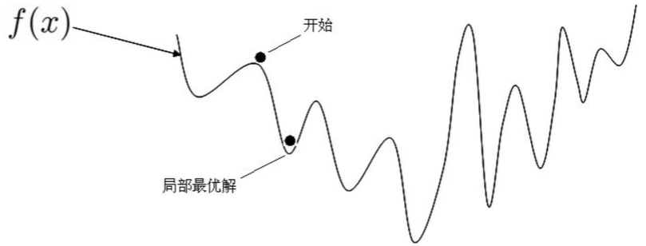
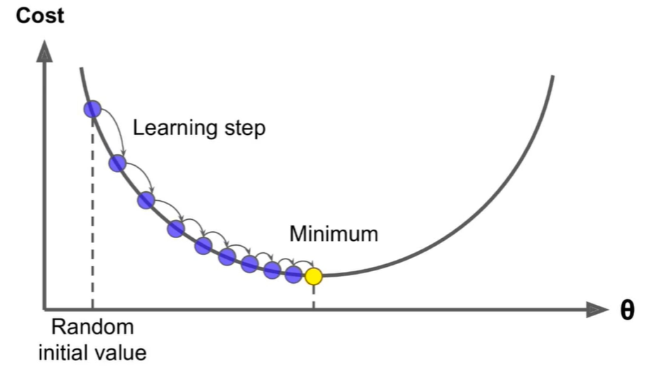
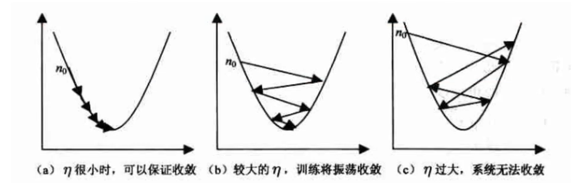
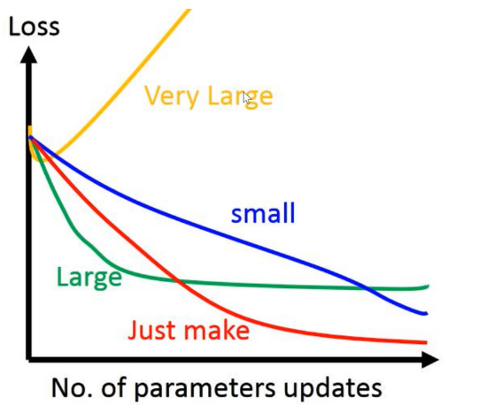
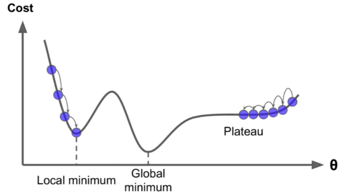
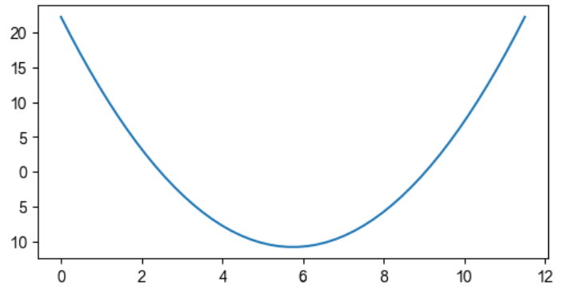
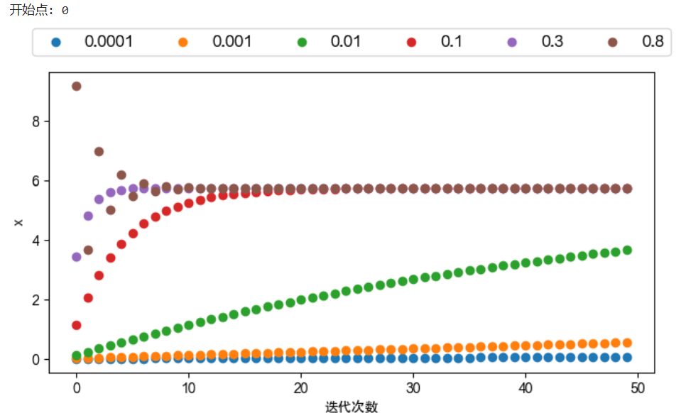
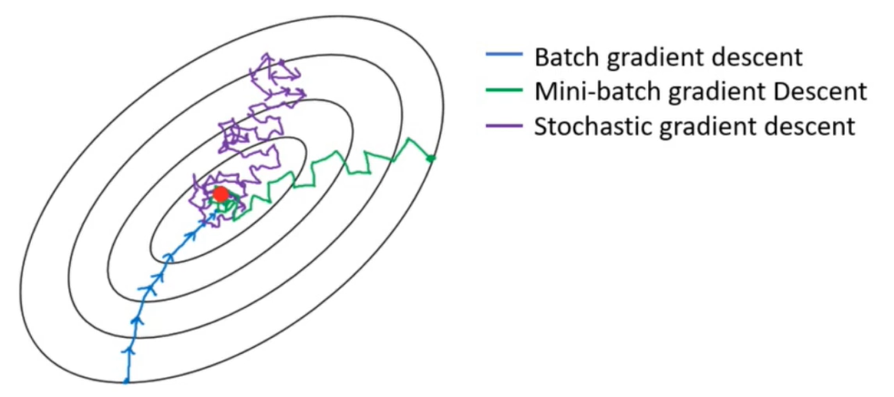
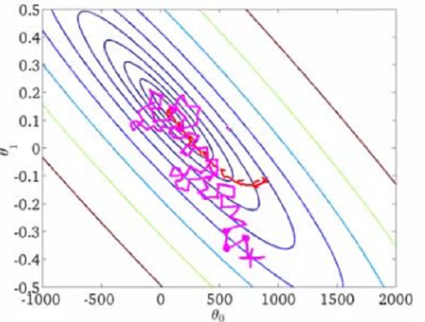
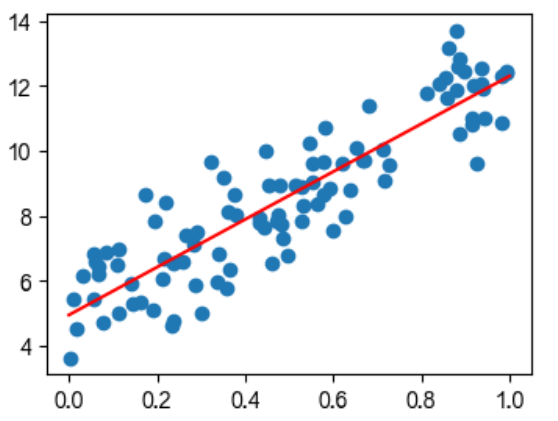

# 梯度下降及优化

<link rel="stylesheet" href="https://cdnjs.cloudflare.com/ajax/libs/KaTeX/0.5.1/katex.min.css"/>
<link rel="stylesheet" href="https://cdn.jsdelivr.net/github-markdown-css/2.2.1/github-markdown.css"/>

## 目录

- [1. Numpy 科学计算库](/ai/ml-intro/)
- [2. Pandas 数据分析库](/ai/ml-intro/02-pandas/)
- [3. Mathplotlib 可视化库](/ai/ml-intro/03-matplotlib/)
- [4. 线性回归](/ai/ml-intro/04-linear-regression/)
- [5. 梯度下降](/ai/ml-intro/05-gradient-descent/)

## 梯度下降介绍

机器学习的**损失函数并非都是凸函数**，设置导数为 0 会得到很多个极值，不能确定唯一解，比如如下函数：



对于损失函数是凸函数的模型来说可以使用正规方程（$\theta=(X^TX)^{-1}X^Ty$）进行求解，但正规方程不适合计算特征维度较大的样本，因为逆矩阵运算的时间复杂度是 $O(n^3)$。换句话说，如果特征数量翻倍，那么计算时间大致变为原来的 8 倍。如果特征向量长度太大，运行时间会非常漫长。所以使用正规方程求解不是机器学习或深度学习的常用手段。

之前的正规方程是令导数为 0 进行计算，一步到位；而梯度下降的做法是**一步步**逼近最优解：



特点：从随机初始化的点向最低点一步步靠近，步幅逐渐变小，走过的点（设 $\theta_0$ ）的导数绝对值即 $|Cost'(\theta_0)|$ 逐渐趋近于 0

### 梯度下降公式

<font size=5>$\theta^{t+1} = \theta^{t} - \alpha * gradient$</font>

<font size=5>$\theta^{t+1} = \theta^{t} - \alpha * \frac {\partial J(\theta)}{\partial \theta}$</font>

其中，$\theta$ 为模型参数；$t$ 为迭代次数；$\alpha$ 为学习率，表示步幅；$gradient$ 为梯度

关于 $\theta - \alpha * gradient$ 的解释：无论梯度为正还是为负，都表示 $(\theta_0, J(\theta_0))$ 的下降。

> 补充：一元函数梯度就是其导数，多元函数梯度就是偏导数向量

### 学习率

学习率，通常用 $\eta$、$\alpha$ 等字母表示，表示梯度下降算法中每次调整的步幅。

如果过大可能一下子就迈过到另一边了（下图 c），然后下一次梯度下降又迈回来，使得来回震荡。

如果太小可能出现下降的太慢的情况（下图 a），也会使得整体迭代次数增加。



设置学习率是一门学问，一般我们会把它设置成一个比较小的数，0.1、0.01、0.001、0.0001 等都是常见的设定数值。

一般情况下学习率在整体迭代过程中是不变的，但是也**可以设置成随着迭代次数增多学习率逐渐变小**，因为在靠近谷底使用较小的步幅可以更精准地走入最低点，同时防止走过。后边的课中我们会介绍一些优化算法来控制学习率。



### 全局最优解



> `plateau`：高原

上图损失函数是一个非凸函数，显示了梯度下降的**两个主要挑战**：

- 如果随机初始化的点在左边，那么会收敛到一个局部最小值，而非全局最小值
- 如果随机初始化的点在右边，那么需要经过很长时间才能越过高原（梯度小，是一个停滞带）。如果迭代次数较少则永远达不到全局最小值

反思上图非凸损失函数的梯度下降：对非凸损失函数使用梯度下降有可能落到局部最小值，所以步长不能设置的太小太稳健，那样就可能跨过局部最优解，虽说局部最小值也没大问题，因为模型只要是**能用**就好嘛，但我们肯定还是尽量要奔着全局最优解去。

> 线性回归模型中损失函数 MSE 是个凸函数，它是一个连续函数且只有一个全局最小值，斜率不会发生陡峭的变化，通常设置合适的学习率，经过一定次数的梯度下降后总会趋近全局最小值。

### 梯度下降步骤

梯度下降就是“猜”最优解的过程：

1. 随机生成 $\theta$。通常使用随机生成的均值为 0 方差为 1 的正态分布数据
2. 求梯度 $g$。它代表曲线上某点的斜率，沿着斜率方向往下就相当于沿着坡度最陡峭的方向下降。
3. 更新 $\theta$。
4. 判断是否收敛，如果收敛了则跳出，如果没有则重复回到 2 继续重复 2，3，4 这三步。

**收敛判断标准**：损失函数 Loss 变化微小甚至不再改变

### 模拟梯度下降

```py
f = lambda x : (x - 3.5) ** 2 - 4.5 * x + 10
# 导函数
g = lambda x : 2 * (x - 3.5) - 4.5

plt.figure(figsize = (6, 3))
X = np.linspace(0, 11.5)
plt.plot(X, f(X))
```



**计算不同学习率下的梯度下降**。这里指定迭代次数，不进行收敛条件判断

```py
#梯度下降，迭代次数为 times，eta 为学习率，start 为初始值
def update(eta, start=0, times=1000):
    #假设起始值相同
    x = start
    #记录所有变化的 x
    res = []
    for i in range(times):
        x = x - eta * g(x)
        res.append(x)
    return np.array(res)

plt.figure(figsize = (8, 4))

#----------------------------------------

start_x = np.random.randint(0, 12, size = 1)[0]
print('开始点:', start_x)

# 多个学习率
etas = [0.0001, 0.001, 0.01, 0.1, 0.3, 0.8]

# 查看每个学习率下单变量 x 的收敛情况
for e in etas:
    times = 50
    plt.scatter(np.arange(times), update(e, start = start_x, times = times))

#----------------------------------------

plt.xlabel('迭代次数')
plt.ylabel('x')

#图例
_ = plt.legend(etas, 
           fontsize=12,
           loc='center', 
           ncol=6, 
           bbox_to_anchor=[0.5, 1.1])
```



## 梯度下降方法

### 三种梯度下降的不同

梯度下降分为三类：

- 批量梯度下降 BGD（Batch Gradient Descent）
- 小批量梯度下降 MBGD（Mini Batch Gradient Descent）
- 随机梯度下降 SGD（Stochastic Gradient Descent）



前边的学习中，我们了解到梯度下降公式为：

<font size=5>$\theta^{t+1} = \theta^{t} - \alpha * \frac {\partial J(\theta)}{\partial \theta}$</font>

三种梯度下降方法的不同体现在**求解梯度**（梯度就是 $\frac {\partial J(\theta)}{\partial \theta}$）上：

- **批量梯度下降 BGD**：**每次迭代**都使用**所有样本**来计算梯度
- **小批量梯度下降 MBGD**：**每次迭代**都使用**一部分样本**（在样本中抽样）来计算梯度
- **随机梯度下降 SGD**：**每次迭代**都随机抽取**一个样本**来计算梯度

### 线性回归梯度更新公式

最小二乘法 MSE：用来衡量 $\hat y$ 与 $y$ 二者的接近程度，理想状态下二者无偏差，所以 $J(\theta)$ 越小表示模型参数 $\theta$ 越好

<font size=5>$J(\theta)=\frac{1}{2} \sum \limits_{i=0}^m (h_{\theta}(x^{(i)}) - y^{(i)}) ^ 2$</font>

矩阵写法为

<font size=5>$J(\theta)=\frac{1}{2} (X\theta - y)^T(X\theta - y)$</font>

最小二乘法 MSE 也是线性回归的损失函数，自变量是 $\theta$，其余的参数都可以看成已知量（常量）

---

梯度下降公式也可以写为：

<font size=6>$\theta_k^{t+1} = \theta_k^{t} - \alpha * \frac {\partial J(\theta)}{\partial \theta_k}$</font>

**其中的 k 表示第几个系数，求解它的偏导数（这里使用 m 个样本进行计算）**：

<font size=6>$\frac{\partial J(\theta)}{\partial \theta_k} = \frac{\partial}{\partial \theta_k} \frac{1}{2} \sum \limits_{i=0}^m (h_{\theta}(x^{(i)}) - y^{(i)})^2$</font>

<font size=6>$\frac{\partial J(\theta)}{\partial \theta_k} = \sum \limits_{i=0}^m \left((h_{\theta}(x^{(i)}) - y^{(i)}) \frac{\partial}{\partial \theta_k} (h_{\theta}(x^{(i)}) - y^{(i)}) \right)$</font>

第 i 个样本的预测值可以表示为：

<font size=6>$h_{\theta}(x^{(i)}) = \sum \limits_{j=0}^n \theta_jx_j^{(i)}$</font>

代入继续化简

<font size=6>$\frac{\partial J(\theta)}{\partial \theta_k} = \sum \limits_{i=0}^m \left((h_{\theta}(x^{(i)}) - y^{(i)}) \frac{\partial}{\partial \theta_k} (\sum \limits_{j=0}^n \theta_jx_j^{(i)} - y^{(i)}) \right)$</font>

<font size=6>$\frac{\partial J(\theta)}{\partial \theta_k} = \sum \limits_{i=0}^m ((\sum \limits_{j=0}^n \theta_jx_j^{(i)} - y^{(i)}) x_k^{(i)})$</font>

所以可得

<font size=6>$\theta_k^{t+1} = \theta_k^{t} - \alpha * \sum \limits_{i=0}^m ((\sum \limits_{j=0}^n \theta_jx_j^{(i)} - y^{(i)}) x_k^{(i)})$</font>

### BGD 更新公式

矩阵写法

<font color=green size=6>$\theta^{t+1} = \theta^t - \alpha * X^T(X\theta - y)$</font>

其中各变量的形状为：

- $X(m, n+1)$
- $\theta(n+1, 1)$
- $y(m, 1)$
- $(X^T(X\theta - y)).shape = (n+1, 1)$

优点：

1. 每次迭代都会使用所有样本进行计算，利用矩阵操作实现了并行
2. 由全量数据确定的下降方向能够更好的代表总体，从而更准确地朝着极值所在方向前进

缺点：当样本数目更大时，每次迭代都要对所有样本进行计算，训练过程比较慢。

### SGD 更新公式

随机梯度下降方法（SGD）不同于批量梯度下降（BGD），SGD 每次迭代时使用一个样本对参数进行更新。

<font size=6>$\theta_k^{t+1} = \theta_k^{t} - \alpha * ((\sum \limits_{j=0}^n \theta_jx_j^{(i)} - y^{(i)}) x_k^{(i)})$</font>

其中的 $x^{(j)}$ 和 $y^{(i)}$ 表示随机选中的某个样本

优点：每次迭代只对一条数据进行计算，大大加快了运行速度

缺点：

- 准确度下降。
- 可能会收敛到局部最优解，由于单个样本并不能代表全体样本的趋势

---

BGD vs SGD：



### MBGD 更新公式

更新公式同 BGD 更新公式。

小批量梯度下降（MBGD）在每次迭代时使用总样本中的一部分（通常用 batch_size 表示规模）样本来对参数进行更新。

MBGD 是对 BGD 和 SGD 的一个折中方法，实现了更新速度与更新次数之间的平衡：

- 相对于 SGD，MBGD 降低了收敛波动性，即降低了参数变化值的方差，使得更新更加稳定
- 相对于 BGD，MBGD 提高了学习速度，并且不用担心内存瓶颈

一般情况下，MBGD 是梯度下降的推荐变体，特别是是在深度学习中。

样本数 batch_size 的选择：进行多次实践，类比学习率的选择，最终选择一个更新速度和更新次数都比较合适时的值。

---

从下降轨迹图认识三种方法


## 三种 GD 下降方法练习

**BGD 方法公式**

<font color=green size=6>$\theta^{t+1} = \theta^t - \alpha * X^T(X\theta - y)$</font>

其中各变量的形状为：

- $X(m, n+1)$
- $\theta(n+1, 1)$
- $y(m, 1)$
- $(X^T(X\theta - y)).shape = (n+1, 1)$

---

**SGD 方法公式**

<font size=6>$\theta_k^{t+1} = \theta_k^{t} - \alpha * ((\sum \limits_{j=0}^n \theta_jx_j^{(i)} - y^{(i)}) x_k^{(i)})$</font>

---

**MBGD 方法公式**

类似于 BGD 的公式，区别是调整了 X、y 的样本数

### BGD 1元1次线性回归

```py
X = np.random.rand(100, 1)
w, b = np.random.randint(1, 10, size = 2)

y = w * X + b + np.random.randn(100, 1)

#添加截距列
X = np.concatenate([X, np.full(shape = (100, 1), fill_value = 1)], axis = 1)

epoches = 10000
eta = 0.01

#要求解的系数
theta = np.random.randn(2, 1)

for i in range(epoches):
    #计算梯度
    g = X.T @ (X @ theta - y)
    #更新 theta
    theta = theta - eta * g

print('真实的斜率和截距为', w, b)
print('求出的斜率和截距为', theta.flatten())

# ------------------------

plt.figure(figsize = (4, 3))
_ = plt.scatter(X[:, [0]], y)

x2 = np.array([0, 1])
_ = plt.plot(x2, x2 * theta[0] + theta[1], color = 'red')
```



---

以上梯度下降代码进行**优化**：如果想要找到更精确的最小值，则需要逐步减小步幅，即学习率


优化方法：随着迭代次数添加，一点点减小学习率，可以 1找到损失函数更精确的最低点，2一定程度上规避不收敛的情况

```py
t0 = 5
t1 = 1000
def learning_rate_schedule(t): # 逆时衰减函数
    return t0 / (t + t1)

times = 0
for i in range(epoches):
    g = X.T @ (X @ theta - y)
    #随着迭代次数的增加，通过逆时衰减函数逐步减小学习率
    lr = learning_rate_schedule(times)
    theta = theta - lr * g
    times += 1
```

### BGD n元1次线性回归

<font size=5>$y_{(m,1)} = X_{(m,n)}w_{(n,1)} + b + noise_{(m,1)}$</font>


```py
m = 100 # 样本数
n = 10 #特征数
X = np.random.rand(m, n)
w = np.random.randint(1, 10, size = (n, 1)) # 随机斜率
b = np.random.randn(1)[0] # 随机截距

y = X @ w + np.random.randn(m, 1)

# ------------------------------

#添加系数列
X = np.concatenate([X, np.full(shape = (m, 1), fill_value = 1)], axis = 1)

epoches = 10000

t0 = 5
t1 = 1000
def learning_rate_schedule(t): # 逆时衰减函数
    return t0 / (t + t1)

#要求解的系数数组，[theta_1, theta_2, ..., theta_n, theta_0]，最后一个 theta_0 呼应上边添加的一列
theta = np.random.randn(n + 1, 1)

times += 0
for i in range(epoches):
    #计算梯度
    g = X.T @ (X @ theta - y)
    #更新 theta
    lr = learning_rate_schedule(times)
    theta = theta - lr * g
    times += 1

print('真实的斜率和截距为', w.flatten(), b)
print('求出的斜率和截距为', theta.flatten())
```

### SGD 1元1次线性回归

```py
X = np.random.rand(100, 1)
w, b = np.random.randint(1, 10, size = 2)

y = w * X + b + np.random.randn(100, 1)

# ------------------------------

#添加截距列
X = np.concatenate([X, np.full(shape = (100, 1), fill_value = 1)], axis = 1)
epoches = 10000

t0 = 5
t1 = 1000
def learning_rate_schedule(t): # 可以被叫做逆时衰减函数
    return t0 / (t + t1)

#要求解的系数
theta = np.random.randn(2, 1)

times = 0
for i in range(epoches):
    #随机取出一个样本
    idx = np.random.randint(0, 100, size = 1)[0]
    X_random = X[[idx]] # (1,2)
    y_random = y[[idx]] # (1,1)
    #计算梯度
    g = X_random.T @ (X_random @ theta - y_random)
    #更新 theta
    lr = learning_rate_schedule(times)
    theta = theta - lr * g
    times += 1

print('真实的斜率和截距为', w, b)
print('求出的斜率和截距为', theta.flatten())

# ------------------------

plt.figure(figsize = (4, 3))
_ = plt.scatter(X[:, [0]], y)

x2 = np.array([0, 1])
_ = plt.plot(x2, x2 * theta[0] + theta[1], color = 'red')
```

### SGD n元1次线性回归

```py
m = 100 # 样本数
n = 10 #特征数
X = np.random.rand(m, n)
w = np.random.randint(1, 10, size = (n, 1)) # 随机斜率
b = np.random.randint(1, 10, size = (1, 1))[0] # 随机截距

y = X @ w + b + np.random.randn(m, 1)

# ------------------------------

#添加截距列
X = np.concatenate([X, np.full(shape = (m, 1), fill_value = 1)], axis = 1)

epoches = 10000

t0 = 5
t1 = 1000
def learning_rate_schedule(t): # 逆时衰减函数
    return t0 / (t + t1)

#要求解的系数数组，[theta_1, theta_2, ..., theta_n, theta_0]，最后一个 theta_0 呼应上边添加的一列
theta = np.random.randn(n + 1, 1)

times += 0
for i in range(epoches):
    #随机取出一个样本
    idx = np.random.randint(0, m, size = 1)[0]
    X_random = X[[idx]] # (1, n+1)
    y_random = y[[idx]] # (1, 1)
    #计算梯度
    g = X_random.T @ (X_random @ theta - y_random)
    #更新 theta
    lr = learning_rate_schedule(times)
    theta = theta - lr * g
    times += 1

print('真实的斜率和截距为', w.flatten(), b)
print('求出的斜率和截距为', theta.flatten())
```

### MBGD 1元1次线性回归

```py
X = np.random.rand(100, 1)
w, b = np.random.randint(1, 10, size = 2)

y = w * X + b + np.random.randn(100, 1)

# ------------------------------

#添加截距列
X = np.concatenate([X, np.full(shape = (100, 1), fill_value = 1)], axis = 1)
epoches = 10000

t0 = 5
t1 = 1000
def learning_rate_schedule(t): # 可以被叫做逆时衰减函数
    return t0 / (t + t1)

#要求解的系数
theta = np.random.randn(2, 1)

batch_size = 16 # 每批样本数
batch_num = 100 // batch_size # 一共多少批

times = 0
for i in range(epoches):
    #随机取出一批
    batch_idx_start = np.random.randint(0, batch_size * batch_num, size = 1)[0]
    X_batch = X[batch_idx_start : (batch_idx_start + batch_size)]
    y_batch = y[batch_idx_start : (batch_idx_start + batch_size)]
    #计算梯度
    g = X_batch.T @ (X_batch @ theta - y_batch)
    #更新 theta
    lr = learning_rate_schedule(times)
    theta = theta - lr * g
    times += 1

print('真实的斜率和截距为', w, b)
print('求出的斜率和截距为', theta.flatten())
```

### MBGD n元1次线性回归

```py
m = 100 # 样本数
n = 10 #特征数
X = np.random.rand(m, n)
w = np.random.randint(1, 10, size = (n, 1)) # 随机斜率
b = np.random.randint(1, 10, size = (1, 1))[0] # 随机截距

y = X @ w + b + np.random.randn(m, 1)

# ------------------------------

#添加截距列
X = np.concatenate([X, np.full(shape = (m, 1), fill_value = 1)], axis = 1)

epoches = 10000

t0 = 5
t1 = 1000
def learning_rate_schedule(t): # 逆时衰减函数
    return t0 / (t + t1)

#要求解的系数数组，[theta_1, theta_2, ..., theta_n, theta_0]，最后一个 theta_0 呼应上边添加的一列
theta = np.random.randn(n + 1, 1)

batch_size = 16 # 每批样本数
batch_num = m // batch_size # 一共多少批

times += 0
for i in range(epoches):
    #随机取出一批
    batch_idx_start = np.random.randint(0, batch_size * batch_num, size = 1)[0]
    X_batch = X[batch_idx_start : (batch_idx_start + batch_size)]
    y_batch = y[batch_idx_start : (batch_idx_start + batch_size)]
    #计算梯度
    g = X_random.T @ (X_random @ theta - y_random)
    #更新 theta
    lr = learning_rate_schedule(times)
    theta = theta - lr * g
    times += 1

print('真实的斜率和截距为', w.flatten(), b)
print('求出的斜率和截距为', theta.flatten())
```


**实验结果：SGD 和 MBGD 对于 n 元1次线性回归的收敛效果差于 BGD**

## 归一化