# flutter 入门

- [仓库](https://gitee.com/egu0/flutter_note0)
- [仓库：getx 工具使用](https://gitee.com/egu0/flutter_note1_getx)

## 安装 Flutter

下载 flutter：<https://docs.flutter.dev/get-started/install/windows>

解压

配置环境变量

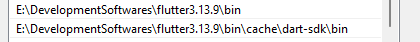

添加两个系统变量：

| key                      | value                         |
| ------------------------ | ----------------------------- |
| PUB_HOSTED_URL           | <https://pub.flutter-io.cn>     |
| FLUTTER_STORAGE_BASE_URL | <https://storage.flutter-io.cn> |

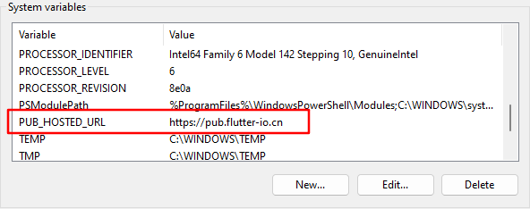

验证安装情况

- `flutter --version`
- `dart --version`

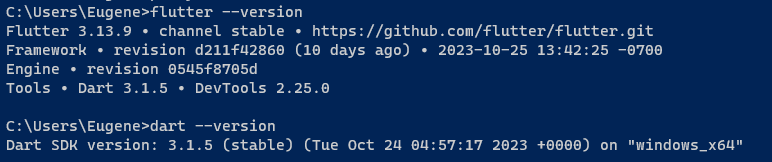

使用 `flutter doctor` 检查安装的工具信息

## 开发工具

以 VSCode 为示例。安装插件 `dart` 和 `flutter`

下载 [雷电模拟器](https://www.ldmnq.com/)，安装后等待启动，然后配置

- 点击模拟器控制栏图标【`三`】，进入【软件设置】，调节为【手机版】
- 进入手机【设置】下的【关于平板电脑】，点击【版本号】直到进入开发者模式；然后进入【系统】下的【开发者选项】，打开【USB 调试】

VSCode 中调出 Control Panel，输入 flutter 创建新项目。创建后，点击右下角，选择【模拟器中的手机实例】后运行

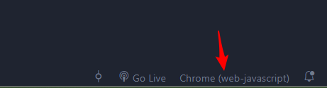

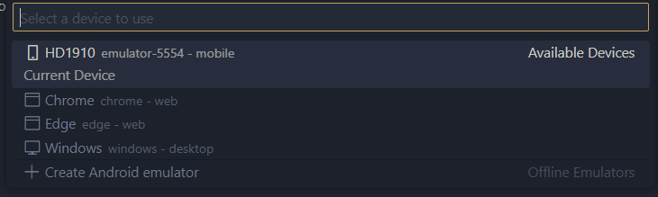

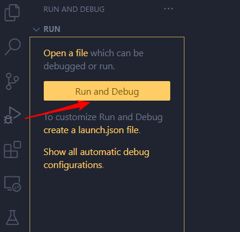

注意：

- 【低配电脑可能启动时间较长，也可以连接外部实体手机解决电脑资源不足的问题】
- 【第一次启动较慢，可能要半小时 QWQ；之后每次启动时长在一分钟之内】
- 【异常：Could not determine the dependencies of task ':app:compileDebugJavaWithJavac'. Failed to install the following Android SDK packages as some licences have not been accepted.】：需要下载 [Android Studio](https://developer.android.com/studio?hl=en) 安装 SDK（创建一个 flutter 项目运行会自动安装）
- 【可以使用 AS 或 Idea 开发。二者都需要现在 dart 和 flutter 插件然后重启。推荐使用 AS】

## 控件了解

### Text

文本控件

编写示例：`main.dart`

```dart
import 'package:flutter/material.dart';

main() {
  runApp(MaterialApp(home: Home()));
}

class Home extends StatelessWidget {          // 无状态控件
  @override
  Widget build(BuildContext context) {
    return Text('flutter');//默认样式
  }
}
```

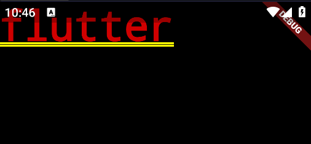

可以看到文本展示在屏幕的左上角，显示在【状态栏】下方，很别扭

其他：可以修改文本样式，比如

```dart
return Text('flutter', style: TextStyle(color: Colors.blue, fontSize: 14));
```

### Scaffold

scaffold：脚手架

示例：

```dart
import 'package:flutter/material.dart';

main() {
  runApp(MaterialApp(home: Home()));
}

class Home extends StatelessWidget {
  @override
  Widget build(BuildContext context) {
    return Scaffold(
      appBar: AppBar(
        title: const Text('flutter'),
      ),
    );
  }
}
```

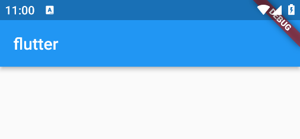

产生的界面更加符合页面的布局。另外，也可以设置页面栏的样式

```dart
return Scaffold(
  appBar: AppBar(
    title: const Text('FLUTTER'),
    centerTitle: true, // 居中
    backgroundColor: Colors.lightGreen, // 颜色
  ),
);
```

补充：**夜间模式**

```dart
main() {
  runApp(MaterialApp(
      theme: ThemeData.dark(), // 开启夜间模式
      home: Home()));
}
```

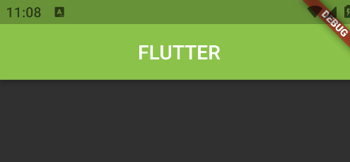

### 图片

- 本地图片
- 网络图片
- 圆形头像
- 占位图

本地图片：放在根目录下某个文件夹内，比如

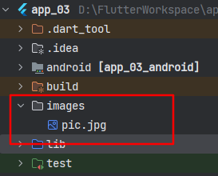

在 `pubspec.yaml` 中配置图片资源目录

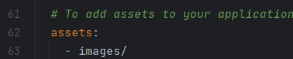

使用图片控件

```dart
return Scaffold(
      appBar: AppBar(title: const Text('FLUTTER'),),
      body: Image.asset('images/pic.jpg'),
    );
```

`Image.asset()` 其他属性：

- `fit`: fill/contain/cover/fitWidth/fitHeight/none/scaleDown
- `repeat`: repeat/repeatX/repeatY/noRepeat
- `width`
- `height`

一个示例

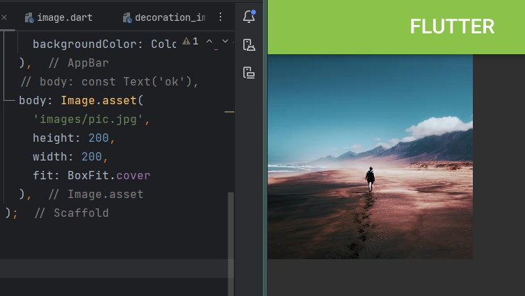

网络图片。示例：

```dart
body: Image.network(
    'https://www.bing.com/th?id=OHR.SilencioSpain_ZH-CN2955614478_1920x1080.webp&qlt=50',
    height: 300,
    width: 300,
    fit: BoxFit.cover,
),
```

圆形头像

```dart
body: const CircleAvatar(
  backgroundImage: NetworkImage('https://www.bing.com/th?id=OHR.SilencioSpain_ZH-CN2955614478_1920x1080.webp&qlt=50'),
  radius: 60,                   // 半径
));
```

占位图

```dart
body: const FadeInImage(
    placeholder: AssetImage('images/pic.jpg'), // 展位图
    image: NetworkImage(                       // 最终图
      'https://www.bing.com/th?id=OVFT.00pvpG2J1rSzcg8ER7DuTi&w=186&h=88&c=7&rs=2&qlt=80&pid=PopNow'
    ),
),
```

### 三种布局

行：

```dart
body: const Row(
    children: [
      Text('data-1 '),
      Text('data-2 '),
      Text('data-3 '),
      Text('data-4 '),
      Text('data-5 '),
    ],
),
```

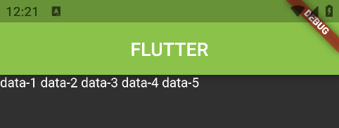

列：

```dart
body: const Column(
    children: [
      Text('data-1'),
      Text('data-2'),
      Text('data-3'),
      Text('data-4'),
      Text('data-5'),
    ],
),
```

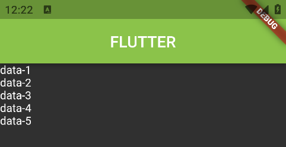

混合布局：（混合以上两种）

```dart
      body: const Column(
        children: [
          Row(
            children: [
              Text('1-1 '),
              Text('1-2 '),
              Text('1-3 '),
              Text('1-4 '),
            ],
          ),
          Row(
            children: [
              Text('2-1 '),
              Text('2-2 '),
              Text('2-3 '),
              Text('2-4 '),
            ],
          ),
        ],
      ),
```

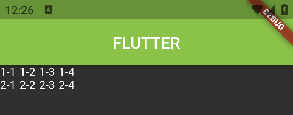

【觉得别扭？反过来用就好了】

### 按钮

- ElevatedButton
- TextButton
- OutlinedButton
- FloatingActionButton（作为 scaffold 的属性）

```dart
return Scaffold(
    appBar: AppBar(
        title: const Text('FLUTTER')
    ),
    body: Row(
        children: [
          ElevatedButton(
            child: const Text('Download'),
            onPressed: () {
              print('BTN-1');
            },
          ),
          TextButton(
              onPressed: () {
                print('BTN-2');
              },
              child: const Icon(Icons.back_hand)),
          OutlinedButton(
              onPressed: () {
                print('BTN-3');
              },
              child: const Text('Submit'))
        ],
    ),
    floatingActionButton: FloatingActionButton(
        child: const Icon(Icons.add),
        onPressed: () {
          print('add');
        },
    ),
);
```

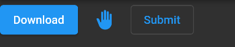

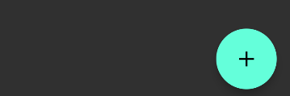

为按钮添加样式：

```dart
  ElevatedButton(
    child: const Text('Download'),
    onPressed: () {
      print('BTN-1');
    },
    style: ButtonStyle(
        backgroundColor: MaterialStateProperty.all(Colors.pink)),
  ),
```

或

```dart
  ElevatedButton(
    child: const Text('Download'),
    onPressed: () {
      print('BTN-1');
    },
    style: ElevatedButton.styleFrom(backgroundColor: Colors.purple),
  ),
```

将按钮点击回调函数提取到控件内

```dart
class Home extends StatelessWidget {
  const Home({super.key});

  @override
  Widget build(BuildContext context) {
    return Scaffold(
      appBar: AppBar(
        title: const Text('FLUTTER'),
      ),
      floatingActionButton:
          FloatingActionButton(onPressed: fun1, // 指定方法名
                               child: const Icon(Icons.add)),
    );
  }

  void fun1() { // 将方法放在控件内
    print('floating button is clicked');
  }
}
```

### 有状态控件

```dart
import 'package:flutter/material.dart';

main() {
  runApp(const MaterialApp(home: StatefulHome()));
}

// 定义有状态控件
class StatefulHome extends StatefulWidget {
  const StatefulHome({super.key});

  @override
  State<StatefulHome> createState() => _HomeState();
}

// 定义状态类
class _HomeState extends State<StatefulHome> {
  var count = 0;

  @override
  Widget build(BuildContext context) {
    return Scaffold(
      appBar: AppBar(
        title: const Text("Stateful"),
        backgroundColor: Colors.cyan,
      ),
      body: Center(
        child: Text(
          'Counter: $count',
          style: const TextStyle(fontSize: 24),
        ),
      ),
      floatingActionButton: FloatingActionButton(
        onPressed: () {
          print('ADD one');
          setState(() {  // 改变状态，告诉 flutter 执行完后进行 rebuild
            count++;
          });
        },
        child: const Icon(Icons.add),
      ),
    );
  }
}
```

分析创建项目时自带的 `main.dart`

```dart
import 'package:flutter/material.dart';

void main() {
  runApp(const MyApp());
}

class MyApp extends StatelessWidget { // 无状态
  const MyApp({super.key});

  @override
  Widget build(BuildContext context) {
    return MaterialApp( // 有状态
      title: 'Flutter Demo',
      theme: ThemeData(   // 应用的主题。可以改变 seedColor 的值然后保存，热加载后主题改变，MyHomePage 组件中的【计数】不会改变
        colorScheme: ColorScheme.fromSeed(seedColor: Colors.deepPurple),
        useMaterial3: true,
      ),
      home: const MyHomePage(title: 'Flutter Demo Home Page'), // 有状态
    );
  }
}

// 有状态的控件
class MyHomePage extends StatefulWidget {
  const MyHomePage({super.key, required this.title});

  final String title;

  @override
  State<MyHomePage> createState() => _MyHomePageState();
}

class _MyHomePageState extends State<MyHomePage> {
  int _counter = 0;

  void _incrementCounter() {
    setState(() {  // 调用 setState 告诉 flutter 框架 状态改变了，完事后会调用 build 方法更新页面
      _counter++;
    });
  }

  @override
  Widget build(BuildContext context) {
    return Scaffold(
      appBar: AppBar(
        backgroundColor: Theme.of(context).colorScheme.inversePrimary,
        title: Text(widget.title),
      ),
      body: Center(
        child: Column(
          mainAxisAlignment: MainAxisAlignment.center,
          children: <Widget>[
            const Text(
              'You have pushed the button this many times:',
            ),
            Text(
              '$_counter',
              style: Theme.of(context).textTheme.headlineMedium,
            ),
          ],
        ),
      ),
      floatingActionButton: FloatingActionButton(
        onPressed: _incrementCounter,
        tooltip: 'Increment',
        child: const Icon(Icons.add),
      ), 
    );
  }
}
```

### 颜色

默认使用方式

```dart
  appBar: AppBar(
    title: const Text("Stateful"),
    backgroundColor: Colors.red,            //   final Color? backgroundColor;
  ),
```

使用方式一：适用预定义的颜色

```dart
  appBar: AppBar(
    title: const Text("Stateful"),
    backgroundColor: Colors.red[50],            //   final Color? backgroundColor;
  ),
```

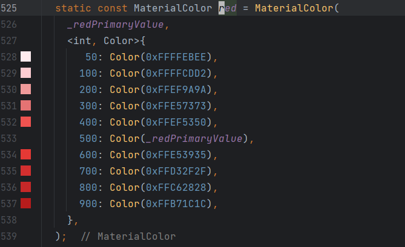

使用方式二：

```dart
backgroundColor: const Color.fromARGB(255, 255, 0, 0), // 第一个参数表示 alpha，范围为 0-255
```

使用方法三：

```dart
backgroundColor: const Color.fromRGBO(255, 0, 0, 1), // 最后一个参数表示 opcity，double 类型，范围为 0-1
```

使用方法四：

```dart
backgroundColor: const Color(0XFFFF0000), // 十六进制数，共 32 位，每 8 位一组，每组范围为 0-255，分别是 A、R、G、B
```

### Container

container 是开发过程中使用频率最高的**单组件控件**，除了只能放一个子节点，其类似于 div 标签

**基本使用**

```dart
  body: Container(
      color: Colors.green,
      child: const Text('GUO', style: TextStyle(backgroundColor: Colors.pink),)
  ),
```

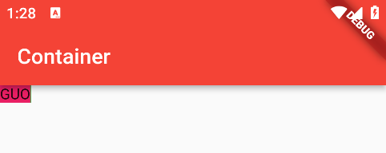

```dart
  body: Container(
      color: Colors.green,
      width: 300,
      height: 300,
      child: const Text('GUO', style: TextStyle(backgroundColor: Colors.pink),)
  ),
```

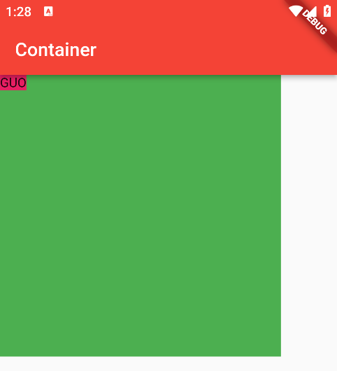

**对齐方式**

```dart
      body: Container(
        color: Colors.green,
        width: 300,
        height: 300,
        alignment: Alignment.center, // 水平和垂直两个方向对其
        child: const Text(
          'GUO',
          style: TextStyle(backgroundColor: Colors.pink),
        ),
      ),
```

其他值

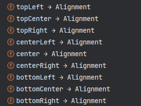

另一种方式设置对齐

```dart
      body: Container(
        color: Colors.green,
        width: 300,
        height: 300,
        alignment: const Alignment(0.5, -0.5), // (x, y)
        child: const Text(
          'GUO',
          style: TextStyle(backgroundColor: Colors.pink),
        ),
      ),
```

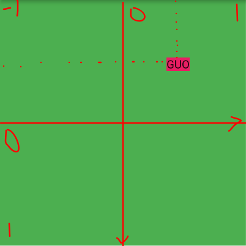

**内边距**

```dart
// padding: const EdgeInsets.all(50), // padding: 50
// padding: const EdgeInsets.only(left: 100), // padding-left: 100
padding: const EdgeInsets.symmetric(horizontal: 50), // padding-left:50; padding-right:50
```

上边距

```dart
return Container(
    decoration: BoxDecoration(border: Border(top: BorderSide(color: Colors.green))),
    child: Text('data', style: const TextStyle(fontSize: 50),),
);
```

### 手势

```dart
    body: GestureDetector(  // 需要在目标组件套上 GestureDetector
      child: const Text(    // 目标组件
        '蹂躏我吧',
        style: TextStyle(fontSize: 30, backgroundColor: Colors.pink),
      ),
      onTap: () {
        print('点击了一哈');
      },
      onLongPress: () {
        print('长按');
      },
      onDoubleTap: () {
        print('双击');
      },
    )
```

### 文本框

```dart
import 'package:flutter/material.dart';

main() {
  runApp(MaterialApp(home: StatelessHome()));
}

class StatelessHome extends StatelessWidget {
  var c1 = TextEditingController();   // 与 textField 绑定后，可以通过控制器获得文本

  StatelessHome({super.key});

  @override
  Widget build(BuildContext context) {
    return Scaffold(
        appBar: AppBar(
          title: const Text('Container'),
          backgroundColor: Colors.red,
        ),
        body: Column(children: [
          TextField(controller: c1,), // 绑定
          ElevatedButton(
              onPressed: () {
                print(c1.text); // 获取文本
              },
              child: const Text('获取文本'))
        ]));
  }
}

```

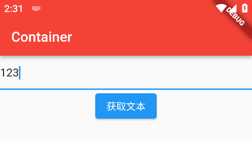

其他属性

```dart
class StatelessHome extends StatelessWidget {
  // 与 textField 绑定以获得文本
  var c1 = TextEditingController();

  StatelessHome({super.key});

  @override
  Widget build(BuildContext context) {
    return Scaffold(
        appBar: AppBar(
          title: const Text('Container'),
          backgroundColor: Colors.red,
        ),
        body: Column(children: [
          const Text(''),
          const Text(''),
          TextField(
            controller: c1,
            // obscureText: true, // 隐藏输入内容。输入时有回显
            cursorColor: Colors.purple, // 光标颜色
            cursorWidth: 8, // 光标宽度
            cursorRadius: const Radius.circular(3), // 光标圆角
            maxLines: 3, // 最大行数
            minLines: 1, // 初始行数
            maxLength: 40, // 最多输入字符数量
            decoration: InputDecoration(
              // icon: const Icon(Icons.person), // 输入框外部图标
              prefixIcon: const Icon(Icons.phone), // 输入框中左边图标
              // suffixIcon: Icon(Icons.cancel), // 输入框中右边图标
              suffixIcon: IconButton(onPressed: () { c1.clear(); }, icon: Icon(Icons.cancel)),
              hintText: '请输入账号/手机/邮箱',
              labelText: '文本框名',
              // border: const OutlineInputBorder(), //方形框框
              border: OutlineInputBorder(borderRadius: BorderRadius.circular(10))
            ),
          ),
          ElevatedButton(
              onPressed: () {
                print(c1.text);
              },
              child: const Text('获取文本'))
        ]));
  }
}
```

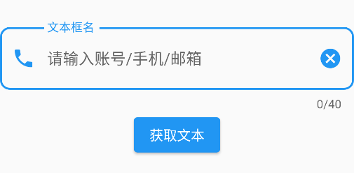

### 列表

静态列表

```dart
return Scaffold(
  appBar: AppBar(
    title: const Text('bar'),
  ),
  body: ListView(children: [
    Text('Apple', style: TextStyle(fontSize: 50),),
    Text('Banana', style: TextStyle(fontSize: 50),),
    Text('Grapes', style: TextStyle(fontSize: 50),),
  ],),
);
```

动态渲染

```dart
return Scaffold(
    appBar: AppBar(
      title: const Text('bar'),
    ),
    body: ListView.builder(
        itemCount: 40,
        itemBuilder: (BuildContext context, int index) {
          return Text(
            'data-entry-$index',
            style: const TextStyle(fontSize: 50),
          );
        }
    )
);
```

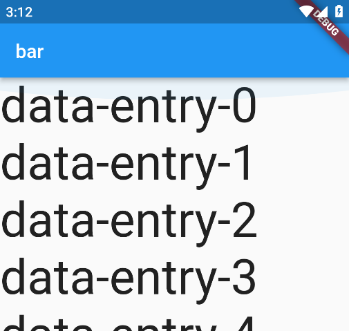

为每一项添加分割线

```dart
return Scaffold(
    appBar: AppBar(
      title: const Text('bar'),
    ),
    
    body: ListView.builder(
        itemCount: 40,

        itemBuilder: (BuildContext context, int index) {  
          // 将 Text 放入 Container，并为容器添加一个上边距
          return Container(
            decoration: const BoxDecoration(
                border: Border(top: BorderSide(color: Colors.green))),
            child: Text(
              'data-entry-$index',
              style: const TextStyle(fontSize: 50),
            ),
          );   
        }
    )

);
```

使用 `ListView` 提供的 `separated()`

```dart
return Scaffold(
    appBar: AppBar(
      title: const Text('bar'),
    ),
    
    body: ListView.separated(
      itemCount: 40,
        
      itemBuilder: (BuildContext context, int index) {
        return Text(
          'data-entry-$index',
          style: const TextStyle(fontSize: 30),
        );
      },
        
      separatorBuilder: (BuildContext context, int index) {
        return const Divider(
          color: Colors.red,
          height: 30, // 分割线高度
          endIndent: 10,
          indent: 10,
        );
      },
        
    )
);
```

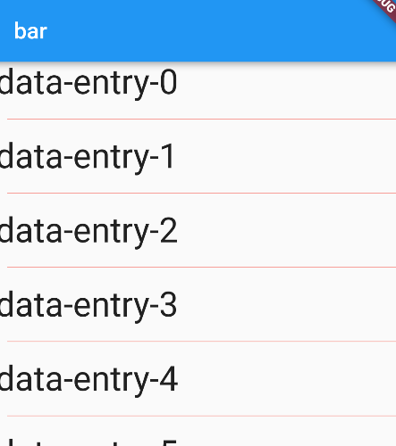

列表项为【列表图块】

```dart
    return Scaffold(
        appBar: AppBar(
          title: const Text('bar'),
        ),
        body: ListView.separated(
            
          itemCount: 40,
            
          itemBuilder: (BuildContext context, int index) {
            return ListTile(        // 创建列表图块
              leading: CircleAvatar(backgroundImage: AssetImage('images/pic.jpg')),
              title: Text('Eugene Guo'),
              subtitle: Text('一个铁罕汗'),
              trailing: TextButton(onPressed: () {  }, child: Icon(Icons.arrow_right_outlined),),
            );
          },
            
          separatorBuilder: (BuildContext context, int index) {
            return const Divider(
              color: Colors.red,
              height: 10, // 分割线高度
              endIndent: 10,
              // indent: 10,
            );
          },
            
        )
    );
```

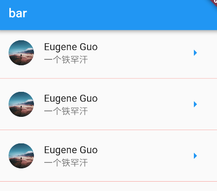

### 弹窗

- 警告弹窗
- 底部弹窗

警告弹窗

```dart
import 'package:flutter/material.dart';

main() {
  runApp(MaterialApp(home: _StatefulHome2()));
}

class _StatefulHome2 extends StatefulWidget {
  @override
  State<StatefulWidget> createState() => _State2();
}

class _State2 extends State<_StatefulHome2> {
  @override
  Widget build(BuildContext context) {
    return Scaffold(
        appBar: AppBar(
          title: const Text('bar'),
        ),
        body: Center(
          child: Column(
            mainAxisAlignment: MainAxisAlignment.center, // 列垂直居中对齐
            children: [
              ElevatedButton(
                  onPressed: () {
                    _showAlertDialog('发生什么事了');
                  },
                  child: Text('显示Alert弹窗'))
            ],
          ),
        ));
  }

  void _showAlertDialog(String content) {
    showDialog(
        context: context,
        builder: (_) {
          return AlertDialog(
            title: Text('注意'),
            content: Text(content),
            actions: [
              TextButton(
                  onPressed: () {
                    Navigator.pop(context);
                  },
                  child: Text('确定'))
            ],
          );
        });
  }
}
```

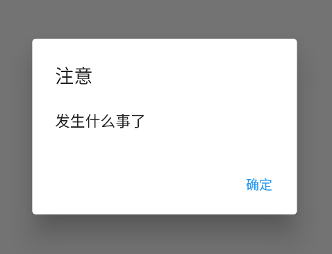

底部弹窗

```dart
  void _showModalBottomDialog() {
    showModalBottomSheet(
        context: context,
        builder: (_) {
          return Container(
            child: Column(
              children: [
                Text('token: sk-123456789'),
                TextButton(
                    onPressed: () {
                      Navigator.pop(context);
                    },
                    child: Text('Copy to clipboard'))
              ],
              mainAxisAlignment: MainAxisAlignment.center,
            ),
            height: 100,
          );
        });
  }
```

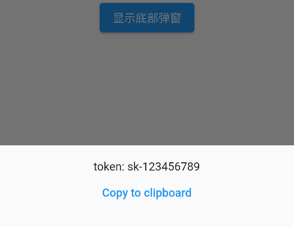

一个复杂案例

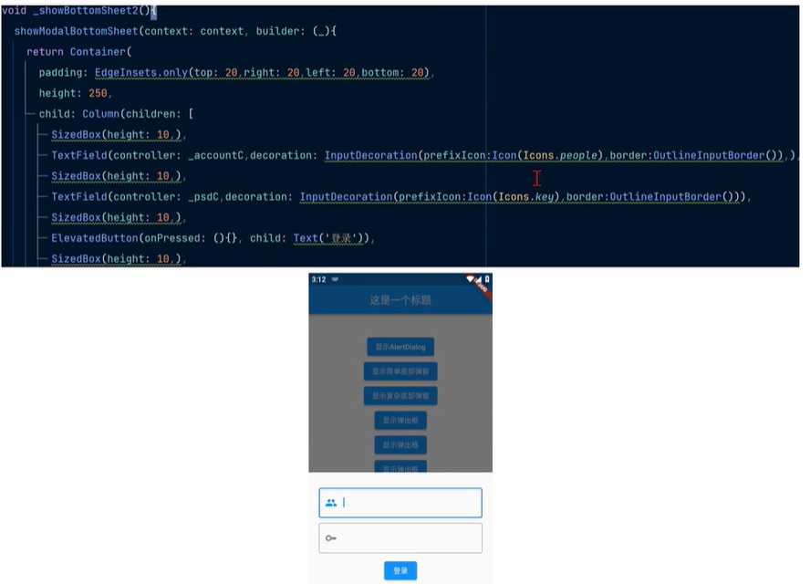

## 进阶

### 组件化开发

示例：将 AlertDialog 进行封装

创建 `lib/components/MyAlertDialog.dart`

```dart
import 'package:flutter/material.dart';

class MyAlertDialog0 extends StatefulWidget {
  final String content;

  // 传递 content
  const MyAlertDialog0({super.key, required this.content});

  @override
  State<StatefulWidget> createState() => _MyAlertDialogState();
}

class _MyAlertDialogState extends State<MyAlertDialog0> {
  @override
  Widget build(BuildContext context) {
    return AlertDialog(
      title: Text('注意'),
      content: Text(widget.content),
      actions: [
        TextButton(
            onPressed: () {
              Navigator.pop(context);
            },
            child: Text('确定'))
      ],
    );
  }
}
```

使用封装的 AlertDialog

```dart
void _showAlertDialog(String content) {
showDialog(
    context: context,
    builder: (_) {
      return AlertDialog(
        title: Text('注意'),
        content: Text(content),
        actions: [
          TextButton(
              onPressed: () {
                Navigator.pop(context);
              },
              child: Text('确定'))
        ],
      );
    });
  }


//     |
//     |
//    \ /


  import 'package:app_03/components/MyAlertDialog.dart';
...
  void _showAlertDialog(String content) {
    showDialog(
        context: context,
        builder: (_) {
          return MyAlertDialog0(content: content);
        });
  }
...
```

### 使用 getx 包

找包：<https://pub.dev/packages>

添加 `getx` 依赖：`pubspec.yaml`

```
dependencies:
  flutter:
    sdk: flutter
  get: ^4.6.6   # 导入 getx 包
```

然后下载依赖

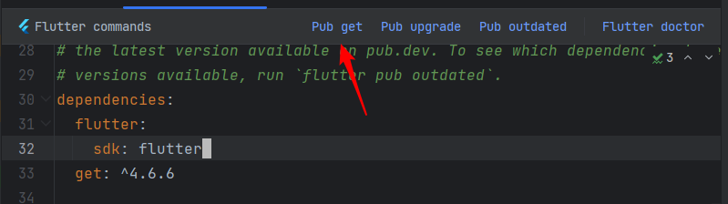

简单使用 getx

```dart
import 'package:flutter/material.dart';
import 'package:get/get.dart';

main() {
  // runApp(MaterialApp(home: StatelessHome()));
  runApp(GetMaterialApp(home: StatelessHome()));
}

class StatelessHome extends StatelessWidget {
  const StatelessHome({super.key});

  @override
  Widget build(BuildContext context) {
    return Scaffold(
      appBar: AppBar(
        title: const Text('bar'),
      ),
      body: ElevatedButton(
        onPressed: () {
          // 发送提示
          Get.snackbar('QQ', '您收到了一条群组消息', icon: Icon(Icons.message), borderRadius: 10);
        },
        child: Text('click me'),
      ),
    );
  }
}

```

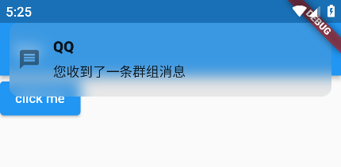

### 发送后端请求

使用 [dio](https://pub.dev/packages/dio) 依赖

```dart

class StatelessHome extends StatelessWidget {
  const StatelessHome({super.key});

  @override
  Widget build(BuildContext context) {
    return Scaffold(
      appBar: AppBar(
        title: const Text('bar'),
      ),

      body: Column(
        mainAxisAlignment: MainAxisAlignment.center,
        children: [
          ElevatedButton(
              onPressed: () {
                _getHttp();
              },
              child: Text('get')),
          ElevatedButton(onPressed: _postHttp, child: Text('post')),
        ],
      ),
    );
  }

  void _getHttp() async {
    MyDio.Dio dio = MyDio.Dio();
    MyDio.Response rsp =
        await dio.get('https://jsonplaceholder.typicode.com/posts/1');
    print(rsp.data.toString());
  }

  void _postHttp() async {
    MyDio.Dio dio = MyDio.Dio();
      
    // 表单数据
    // MyDio.FormData formData = MyDio.FormData.fromMap({'id': 1, 'name': 'GUO', 'email': 'guo@gmail.com'});
      
    MyDio.Response rsp = await dio.post('https://jsonplaceholder.typicode.com/posts',
        data: {'no': 12, 'name': 'dio'}); // 传递 json 数据
      
    print(rsp.data.toString());
  }
}
```

### 跳转

<https://www.bilibili.com/video/BV138411B7Zz?p=20>

跳转到指定页

```dart
return Scaffold(
  appBar: AppBar(
    title: const Text('bar'),
  ),
  body: Column(
    mainAxisAlignment: MainAxisAlignment.start,
    children: [
      Text(
        '主页',
        style: TextStyle(fontSize: 40),
      ),
      ElevatedButton(onPressed: (){}, child: Text('ok')),
      ElevatedButton(onPressed: (){}, child: Text('ok')),
      ElevatedButton(
          onPressed: () {
            // 跳到某个页面（组件类）
            Navigator.push(context, MaterialPageRoute(builder: (_) => PageAbout()));
          },
          child: Text('关于'))
    ],
  ),
);
```

返回上一页

```dart
    return Scaffold(
      appBar: AppBar(
        title: const Text('bar'),
      ),
      body: Column(
        mainAxisAlignment: MainAxisAlignment.center,
        children: [
          Text(
            '关于我',
            style: TextStyle(fontSize: 30),
          ),
          Text('email: guo@gmail.com'),
          Text('site: https://about.me'),
          TextButton(
              onPressed: () {
                Navigator.pop(context); // 返回上一个页面
              },
              child: Text('返回主页'))
        ],
      ),
    );
```

**页面跳转时传递参数**

若目标页面是无状态的

```dart
// 目标页面
class PageAbout extends StatelessWidget {
    // 构造函数
  const PageAbout({super.key, required this.data_from_caller});
    // 成员
  final String data_from_caller;
    
  @override
  Widget build(BuildContext context) {
    return Scaffold(
      appBar: AppBar(
        title: Text(data_from_caller), // 使用变量
      ),
        )};
}


// 调用者 部分代码
          ElevatedButton(
              onPressed: () {
                Navigator.push(
                    context,
                    MaterialPageRoute(
                        builder: (_) =>
                            PageAbout(data_from_caller: '张三的订单完成情况'))); // 指定属性名进行传值
              },
              child: Text('关于'))

```

若目标页面是有状态的

```dart
// 创建有状态组件
import 'package:flutter/material.dart';

class PageArchive extends StatefulWidget {
  const PageArchive({super.key, required this.data_from_caller});

  final String data_from_caller;

  @override
  State<StatefulWidget> createState() => _PageArchiveState();
}

class _PageArchiveState extends State<PageArchive> {
  @override
  Widget build(BuildContext context) {
    return Scaffold(
      appBar: AppBar(
        title: const Text('传递数值到有状态页面'),
      ),
      body: Column(
        children: [
          const Text(
            'Archived stuff',
            style: TextStyle(fontSize: 30),
          ),
          Text(widget.data_from_caller) // 通过 widget 变量来获取【传递到组件的值】
        ],
      ),
    );
  }
}


// 调用者部分代码
          ElevatedButton(
              onPressed: () {
                Navigator.push(
                    context,
                    MaterialPageRoute(
                        builder: (_) => PageArchive(
                            data_from_caller: 'jex v3.1 aie8a7kae')));
              },
              child: const Text('归档'))
```

### 生命周期

无状态组件：仅有一个生命周期函数，即 build，在页面渲染时触发。

有状态组件：

> 与无状态组件相比，有状态组件是动态的并且具有可变的内部状态。这意味着它们可以在整个生命周期中轻松修改，而无需重新初始化。当我们需要**在运行时动态更新应用程序的状态**时，就会使用有状态的组件。 例如：当用户按下按钮时触发应用程序中的操作。因此，这些组件是创建 flutter 应用程序时最常用的组件。
>
> 在 Flutter 中构建 Stateful Widget 时，框架会生成连接到其 widget 的状态对象。**状态对象负责保存组件的所有可变状态**。 有状态组件的生命周期基于其状态及其变化方式。当构建 Stateful Widget 时，首先执行其构造函数，然后调用 createState () 方法。生命周期从 createState () 方法开始。
>
> <https://flutterguide.com/lifecycle-methods-of-flutter-widgets/>

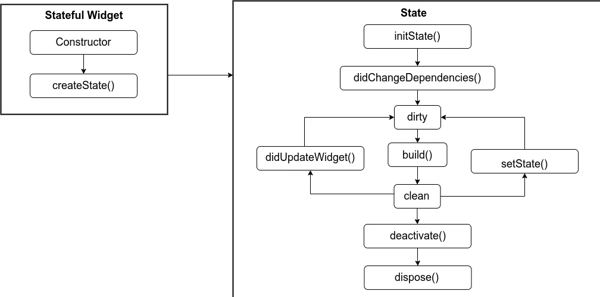

部分示例代码

```dart
class _PageArchiveState extends State<PageArchive> {
  @override
  void initState() {
    super.initState();
    print('初始化状态对象');
  }

  @override
  void dispose() {
    super.dispose();
    print('废弃状态对象');
  }
...
```

### 打包为多个端的应用

参考视频：<https://www.bilibili.com/video/BV138411B7Zz/?p=21>

1. 配置 app 名字
2. 配置权限
3. 制作图标，生成不同分辨率的图标
4. 配置签名信息
5. 打包 apk
6. 打包 windows 平台
7. 打包 web 平台

### Scaffold 进阶

1. 应用栏`appBar`
   1. `ttitle`标题、居中`centerTitle`
   2. `actions`右侧图标，可放多个
   3. `leading`左侧图标，可放一个
2. 抽屉 `drawer`
   1. `child`内容，通常是一个列表
      1. 抽屉头
      2. 菜单
3. 浮动按钮`floatingActionButton`，位置`floatingActionButtonLocation`

```dart
    return Scaffold(
      // 应用栏
      appBar: AppBar(
        title: const Text('SCAFFOLDDD'), // 标题
        centerTitle: true, // 标题居中
        // 右侧组件
        actions: [
          IconButton(onPressed: () {}, icon: Icon(Icons.search)),
          IconButton(onPressed: () {}, icon: Icon(Icons.more_horiz)),
        ],
        // leading: IconButton( // 左侧小组件
        //   icon: Icon(Icons.arrow_back),
        //   onPressed: () {},
        // ),
      ),

      // 抽屉。若设置 appBar.leading 则无法设置抽屉
      drawer: Drawer(
        child: ListView(
          padding: EdgeInsets.zero, // 修改为 padding:0, 改变抽屉部分【手机状态栏】颜色
          children: [
            DrawerHeader(
              child: Text('header'),
              decoration: BoxDecoration(color: Colors.blue[200]),
            ),
            ListTile(
              title: Text(
                '个人资料',
                style: TextStyle(
                    color: Colors.blue[300], fontWeight: FontWeight.w600),
              ),
              trailing: IconButton(
                onPressed: () {},
                icon: Icon(Icons.person),
              ),
            ),
            ListTile(
              title: Text(
                '隐私设置',
                style: TextStyle(
                    color: Colors.blue[300], fontWeight: FontWeight.w600),
              ),
              trailing: IconButton(
                onPressed: () {},
                icon: Icon(Icons.privacy_tip),
              ),
            ),
            ListTile(
              title: Text(
                '注销登录',
                style: TextStyle(
                    color: Colors.blue[300], fontWeight: FontWeight.w600),
              ),
              trailing: IconButton(
                onPressed: () {},
                icon: Icon(Icons.logout),
              ),
            ),
          ],
        ),
      ),
        
      // 浮动按钮，位置
      floatingActionButtonLocation: FloatingActionButtonLocation.endFloat,
      floatingActionButton: FloatingActionButton(
        onPressed: () {},
        child: Icon(Icons.add),
      ),
    );

```

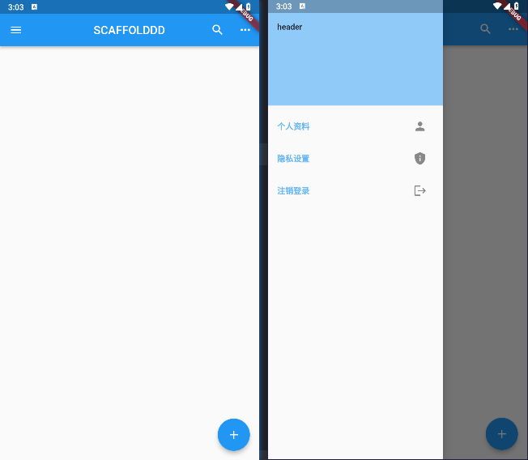

另一个抽屉头

```dart
UserAccountsDrawerHeader(
    currentAccountPicture: CircleAvatar(
      backgroundImage: AssetImage('images/pic.jpg'),
    ),
    accountName: Text('Zhangsan'),
    accountEmail: Text('zhangsan@gmail.com')),
```

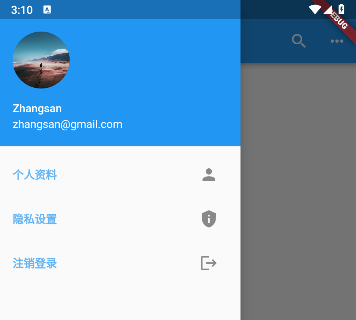

底部导航栏。

1. 先准备 4 个【有状态组件】，比如

```dart
import 'package:flutter/material.dart';

class Cart extends StatefulWidget {
  const Cart({super.key});

  @override
  State<StatefulWidget> createState() => _CartState();
}

class _CartState extends State<Cart> {
  @override
  Widget build(BuildContext context) {
    return Center(
      child: Text('购物车'),
    );
  }
}
```

2. 添加到 Scaffold 中

```dart

class _Page0State extends State<Page0> {
    // 创建4个组件
  List _pages = [HomePage(), Category(), Cart(), Person()];
    // 底部导航栏项
  List<BottomNavigationBarItem> _bottomItems = [
    BottomNavigationBarItem(icon: Icon(Icons.home), label: '首页'),
    BottomNavigationBarItem(icon: Icon(Icons.category), label: '分类'),
    BottomNavigationBarItem(icon: Icon(Icons.shopping_cart), label: '购物车'),
    BottomNavigationBarItem(icon: Icon(Icons.manage_accounts), label: '个人中心'),
  ];
    // 当前页面索引
  int _currentPageIndex = 0;

  @override
  Widget build(BuildContext context) {
    return Scaffold(
        
      ....

      bottomNavigationBar: BottomNavigationBar(
        type: BottomNavigationBarType.fixed, // 当 items.length >3，导航栏自动变为 shifting 状态，即自动转移。需要手动调为固定状态
        items: _bottomItems,      // 底部放哪些导航项
        currentIndex: _currentPageIndex, // 当前选中索引，从 0 开始
        onTap: (index) {             // 点击导航项时
          setState(() {
            print('current page index: ${index}');
            _currentPageIndex = index;
          });
        },
      ),
 
        // 动态切换
      body: _pages[_currentPageIndex],
        
    );
  }
}

```

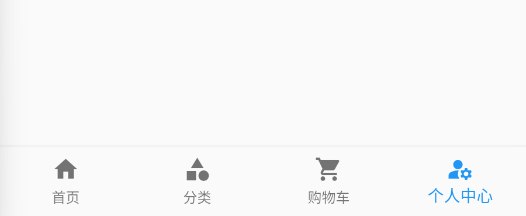

### 整合 sqflite

<https://pub.dev/packages/sqflite>

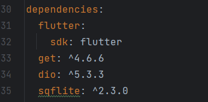

简单示例

```dart
import 'package:flutter/material.dart';
import 'package:sqflite/sqflite.dart' as sql;
import 'package:path/path.dart';

main() {
  runApp(MaterialApp(home: Page0()));
}

class Page0 extends StatefulWidget {
  const Page0({super.key});

  @override
  State<StatefulWidget> createState() => _Page0State();
}

class _Page0State extends State<Page0> {
    
    // 获取连接
  Future<sql.Database> getDb() async {
    // 获取可存放路径
    String p = await sql.getDatabasesPath();
    print('sqflite 保存数据所在目录为 ${p}');
    // join() 来自 path/path.dart，拼接路径
    return await sql.openDatabase(join(p, 'mydb.db'));
  }

  String tableName = 'record2';

    // 创建表格
  void createTable() async {
    var db = await getDb();
    db.execute("""create table if not exists ${tableName}(
      id integer primary key autoincrement,
      money text, date1 text)
      """);
  }

    // 插入一条数据
  void insertOne() async {
    var db = await getDb();
    var res =
        await db.insert(tableName, {'money': '200', 'date1': '2023.11.6'});
    print('插入状态为 ${res}');
  }

    // 查询所有
  void selectAll() async {
    var db = await getDb();
    var allData = await db.query('${tableName}', orderBy: 'id');
    print('查询到的数据为:');
    allData.forEach((e) {
      print(e);
    });
    print('------');
  }

  @override
  Widget build(BuildContext context) {
    return Scaffold(
      // 应用栏
      appBar: AppBar(
        title: const Text('SQFLITE'), // 标题
      ),
      body: Column(
        children: [
          ElevatedButton(onPressed: createTable, child: Text('创建表格')),
          ElevatedButton(onPressed: selectAll, child: Text('查询所有数据')),
          ElevatedButton(onPressed: insertOne, child: Text('添加数据')),
        ],
      ),
    );
  }
}
```

### 主题

```dart
  // runApp(MaterialApp(theme: ThemeData.light(), home: Page0())); // 默认
  runApp(MaterialApp(theme: ThemeData.dark(), home: Page0()));
```

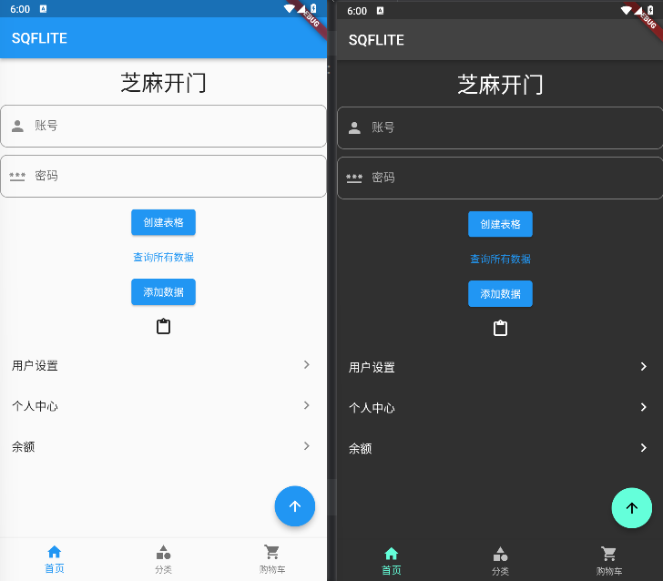

```dart
runApp(MaterialApp(
  theme: ThemeData(colorScheme: ColorScheme.fromSeed(seedColor: Colors.deepPurple),),
  home: Page0())
);
```

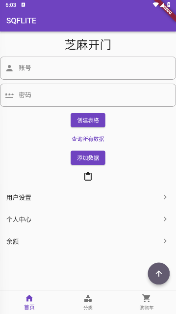

```dart
runApp(MaterialApp(
    theme: ThemeData(colorScheme: ColorScheme.light(), useMaterial3: true),
    home: Page0())
        );
```

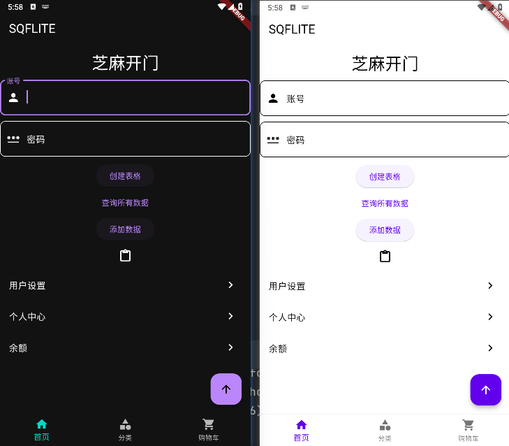

[课程链接](https://www.bilibili.com/video/BV138411B7Zz)
