# 什么是 Redux

## 目录

- [1. React 入门](/frameworks/react0/)
- [2. Redux](/frameworks/react0/02_redux/)
- [3. Router](/frameworks/react0/03_router/)
- [4. 极客网](/frameworks/react0/04_jikewang/)
- [5. React 进阶](/frameworks/react0/05_enhance/)
- [6. Zustand](/frameworks/react0/06_zustand/)
- [7. 使用 TS 编写 React](/frameworks/react0/07_with_ts/)

## Redux 介绍

Redux 是 React 最常用的**集中状态管理工具**，类似于 Vue 中的 Vuex 和 Pinia，**可以独立于框架运行**

作用：通过集中管理的方式管理应用的状态

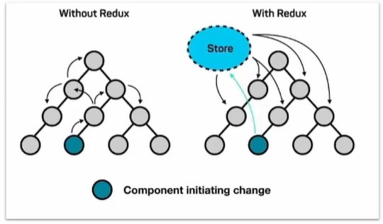

## Redux 快速上手

使用【原生 Redux】的步骤：

1. 定义一个 **reducer 函数**（根据当前想要做的修改返回一个新的状态）
2. 使用 createStore 方法传入 reducer 函数生成一个 **store 实例对象**
3. 使用 store 实例的 **subscribe 方法**订阅数据的变化（数据变化时会得到通知）
4. 使用 store 实例的 **dispatch 方法提交 action 对象**，触发数据变化（告诉 reducer 如何改数据）
5. 使用 store 实例的 **getState 方法**获取最新的状态数据更新到视图中

示例：使用 原生 Redux 实现计数器

```html
<button id="decr">-</button>
<span id="display_span">0</span>
<button id="incr">+</button>

<script src="https://unpkg.com/redux@latest/dist/redux.min.js"></script>

<script>
  //1.定义 reducer 函数。作用：根据不同的 action 对象，返回不同的新的 state
  function reducer(state = { count: 0 }, action) {
    // arg1: 管理的数据的初始状态
    // arg2：对象类型，其中的 type 属性表示何种修改类型
    if (action.type === 'increment') {
      return { count: state.count + 1 }
    } else if (action.type === 'decrement') {
      return { count: state.count - 1 }
    } else {
      return state
    }
  }

  //2.使用 reducer 函数生成 store 实例
  const store = Redux.createStore(reducer)
  
  //3.通过 store 实例的 subscribe 订阅数据变化。在 state 变化时自动执行
  store.subscribe(() => {
    //5.通过 store 实例的 getState 方法获取最新状态更新到视图中
    const state = store.getState()
    console.log('state 变化了: ', state)
    const ele = document.getElementById('display_span')
    ele.innerHTML = state.count
  })

  //4.通过 store 实例的 dispatch 函数提交 action 更改状态
  const inBtn = document.getElementById('incr')
  inBtn.addEventListener('click', () => {
    // incr
    store.dispatch({
      type: 'increment',
    })
  })
  const deBtn = document.getElementById('decr')
  deBtn.addEventListener('click', () => {
    // decr
    store.dispatch({
      type: 'decrement',
    })
  })
</script>
```

小结

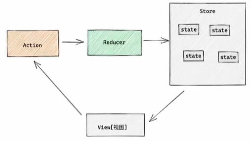

为了职责清晰、数据流向明确，Redux 把整个数据修改流程分成了**三个核心概念**，分别为：state、action 和 reducer

1. `state`：一个对象，存放我们管理的数据状态
2. `action`：一个对象，用来描述你想怎么改数据
3. `reducer`：一个函数，根据 action 描述生成一个新的 state

## 与 React 整合

### 环境准备

在 React 中使用 redux，官方要求安装两个其他插件：`Redux Toolkit` 和 `react-redux`

1. `Redux Toolkit`（RTK）是官方推荐编写 Redux 逻辑的方式，是一套工具的集合，**简化书写方式**
2. `react-redux`：用来**链接 Redux 和 React 组件**的**中间件**

准备

```
// 基于 CRA 模板创建项目
npx create-react-app 02_react_redux

// 安装配套工具
npm i @reduxjs/toolkit react-redux

// 启动
npm start
```

**store 目录结构设计**

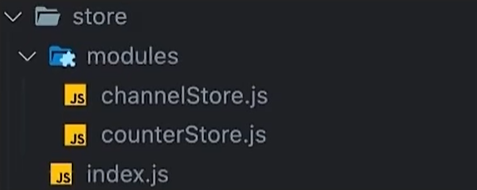

1. 通常集中状态管理的部分都会单独创建一个**单独的 store 目录**
2. 应用通常会有很多子 store 模块，所以创建一个 modules 目录，在内部编写业务分类的子 store
3. store 的入口文件 index.js 的作用是组合 modules 中所有的子模块，并导出 store

### 实现 counter

步骤：

1. 配置 counterStore 模块
2. 组合 counterStore 模块到根 store 模块中
3. 注入 store 到 React 中（基于 react-redux 工具）
4. 使用 store 中的数据
5. 修改 store 中的数据

**1、配置 counterStore 模块**

```jsx
import { createSlice } from '@reduxjs/toolkit'

const counterStore = createSlice({
  name: 'counter',
  // The initial state that should be used when the reducer is called the first time.
  initialState: {
    count: 0,
  },
  // A mapping from action types to action-type-specific case reducer functions.
  // For every action type, a matching action creator will be generated using createAction().
  reducers: {
    increment(state) {
      state.count++
    },
    decrement(state) {
      state.count--
    },
  },
})

// action 创建者，顾名思义，用来创建 action。用来作 dispatch 函数的参数
const { increment, decrement } = counterStore.actions
// The slice's reducer.
const counterReducer = counterStore.reducer

export { increment, decrement }
export default counterReducer
```

2、组合 counterStore 模块到根 store 模块中

```js
import { configureStore } from '@reduxjs/toolkit'
import counterReducer from './modules/counterStore'

// 创建根 store ，组合子模块 counterStore
const store = configureStore({
  // A single reducer function that will be used as the root reducer,
  // or an object of slice reducers that will be passed to combineReducers().
  reducer: {
    counter: counterReducer,
  },
})

export default store
```

3、注入 store 到 React 中

react-redux 负责把 redux 和 react 链接起来：使用内置的 Provider 组件，通过 store 参数把创建好的 store 实例注入到应用中

```jsx
import React from 'react'
import App from './App'

import store from './store'
import { Provider } from 'react-redux'

const root = ReactDOM.createRoot(document.getElementById('root'))
root.render(
  <Provider store={store}>
    <App />
  </Provider>
)
```

4、使用 store 中的数据

在 React 组件中使用 store 中的数据，需要使用一个 hook 函数即 `useSelector`，把 store 中的数据映射到组件中。比如

```jsx
import { useSelector } from 'react-redux'

function App() {
  // store.counter 中的 counter 是在创建根 store 时指定的 reducer 对象键
  const { count } = useSelector((store) => store.counter)  // const { “store中变量名” } = ...((store)=> store.reducer键名)
  return <div>count is: {count}</div>
}

export default App
```

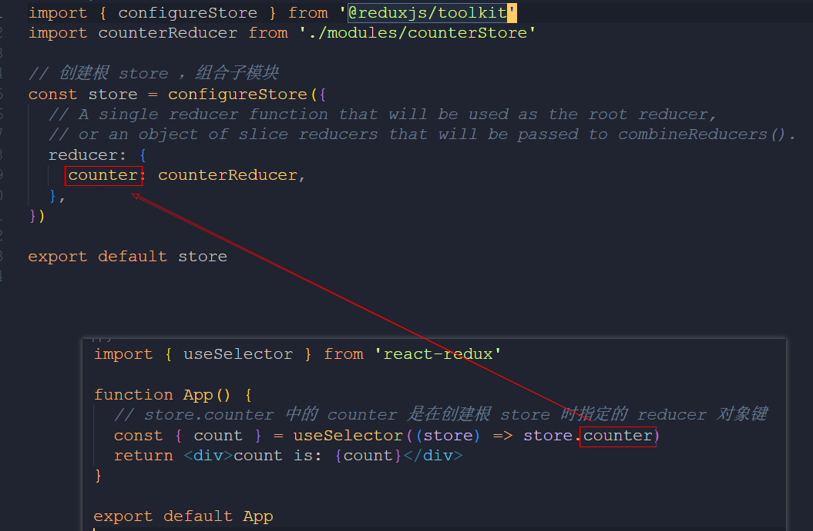

5、修改 store 中的数据

React 组件中修改 store 中的数据需要借助另外一个 hook 函数，`useDispatch`，它的作用是生成提交 action 对象的 dispatch 函数。比如

```jsx
import { useDispatch, useSelector } from 'react-redux'
import { decrement, increment } from './store/modules/counterStore'

function App() {
  const { count } = useSelector((store) => store.counter)

  // 得到 dispatch 函数
  const dispatch = useDispatch()

  return (
    <div>
      count is: {count}
      {/* 调用 dispatch 函数提交 action 对象 */}
      <button onClick={() => dispatch(increment())}>+</button>
      <button onClick={() => dispatch(decrement())}>-</button>
    </div>
  )
}

export default App
```

总结：

- `useSelector` 把 store 中的数据映射到组件中
- `useDispatch` 用于创建【提交 action 对象的】dispatch 函数

### 提交 action 传参

```jsx
<div>
  count is: {count}
  <button onClick={() => dispatch(increment())}>+</button>
  <button onClick={() => dispatch(decrement())}>-</button>
    { /* 在创建 action 的函数中传递参数 */ }
  <button onClick={() => dispatch(incrementBy(10))}>+10</button>
  <button onClick={() => dispatch(incrementBy(20))}>+20</button>
</div>
```

```js
const counterStore = createSlice({
  name: 'counter',
  initialState: {
    count: 0,
  },
  reducers: {
    increment(state) {
      state.count++
    },
    decrement(state) {
      state.count--
    },
    incrementBy(state, action) {              // 添加一个参数 action
      state.count += action.payload           // 通过 action.payload 获取传递的参数
    },
  },
})
```

结果

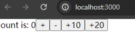

### 异步状态操作

操作步骤

1. 创建和配置 store 的写法保持不变
2. 单独封装一个函数，在其内部 return 一个新函数，在新函数中：
   1. 封装异步请求获取数据
   2. 调用同步 actionCreator 传入异步数据，生成一个 action 对象，并使用 dispatch 提交
3. 组件中 dispatch 写法保持不变

示例

```jsx
import { createSlice } from '@reduxjs/toolkit'
import axios from 'axios'

// 1.
const channelStore = createSlice({
  name: 'channel',
  initialState: {
    channelList: [],
  },
  reducers: {
    setChannelList(state, action) {
      state.channelList = action.payload
    },
  },
})

const { setChannelList } = channelStore.actions
const channelReducer = channelStore.reducer

// 2. 异步请求部分，可以看作是 action 创建者
const fetchChannelList = () => {
  return async (dispatch) => {
    const rsp = await axios.get('https://jsonplaceholder.typicode.com/users')
    console.log(rsp)
    dispatch(setChannelList(rsp.data))
  }
}

export { fetchChannelList }
export default channelReducer
```

```jsx
import { useDispatch, useSelector } from 'react-redux'
import { decrement, increment, incrementBy } from './store/modules/counterStore'
import { useEffect } from 'react'
import { fetchChannelList } from './store/modules/channelStore'

function App() {
  const { count } = useSelector((store) => store.counter)
  // 映射到组件中
  const { channelList } = useSelector((store) => store.channel)

  const dispatch = useDispatch()
  // 3. 通过 useEffect 触发
  useEffect(() => {
    dispatch(fetchChannelList())
  }, [dispatch])

  return (
    <div>
      count is: {count}
      <button onClick={() => dispatch(increment())}>+</button>
      <button onClick={() => dispatch(decrement())}>-</button>
      <button onClick={() => dispatch(incrementBy(10))}>+10</button>
      <button onClick={() => dispatch(incrementBy(20))}>+20</button>
          
      <ol>
        {channelList.map((item, index) => (
          <li key={index}>{item.name}</li>
        ))}
      </ol>
    </div>
  )
}

export default App
```

### Redux 谷歌插件

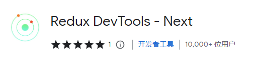

查看 action 详情

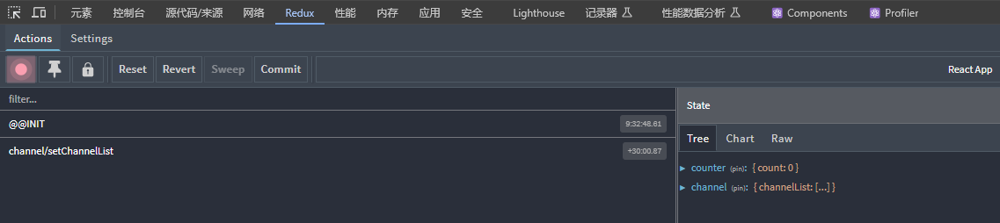

## 美团案例

### 案例演示与环境准备

```sh
git clone https://git.itcast.cn/heimaqianduan/redux-meituan.git
```

```sh
npm install
npm start
```

### 商品列表渲染

步骤：

1. 启动项目（jsonserver mock 服务 + 前端服务）
2. 使用 RTK (Redux Toolkit) 编写 store（异步 action）
3. 组件触发 action 并且渲染数据

示例：异步请求获取商品列表

```js
import { createSlice } from '@reduxjs/toolkit'
import axios from 'axios'

const foodsStore = createSlice({
  name: 'foods',
  initialState: {
    // 商品列表
    foodsList: [],
  },
  reducers: {
    setFoodsList(state, action) {
      state.foodsList = action.payload
    },
  },
})

const { setFoodsList } = foodsStore.actions
const foodsReducer = foodsStore.reducer

// 异步获取部分
const fetchFoodsList = () => {
  return async (dispatch) => {
    const rsp = await axios.get('http://localhost:3004/takeaway')
    dispatch(setFoodsList(rsp.data))
  }
}

export { fetchFoodsList }
export default foodsReducer
```

### 分类与激活交互

步骤：

1. 在 RTK 中管理 activeIndex 状态，表示当前激活项的下表
2. 点击分类后触发 action 更改 activeIndex
3. 动态控制激活类名显示

文件 `components/Menu/index.js`

```jsx
import classNames from 'classnames'
import './index.scss'
import { useDispatch, useSelector } from 'react-redux'
import { changeActiveIndex } from '../../store/modules/takeaway'

const Menu = () => {
  const { foodsList, activeIndex } = useSelector((store) => store.foods)
  const menus = foodsList.map((item) => ({ tag: item.tag, name: item.name }))
  const dispatch = useDispatch()
  return (
    <nav className="list-menu">
      {menus.map((item, index) => {
        return (
          <div
            onClick={() => dispatch(changeActiveIndex(index))}
            key={item.tag}
            className={classNames(
              'list-menu-item',
              activeIndex === index && 'active'
            )}>
            {item.name}
          </div>
        )
      })}
    </nav>
  )
}

export default Menu
```

**激活交互**

解决思路：仅展示某一视频分类，根据分类项的下标与激活项的下标比较进行动态渲染

```jsx
...
<div className="goods-list">
  {foodsList.map((item, index) => {
    return (
      index === activeIndex && (
        <FoodsCategory
          key={item.tag}
          // 列表标题
          name={item.name}
          // 列表商品
          foods={item.foods}
        />
      )
    )
  })}
</div>
...
```

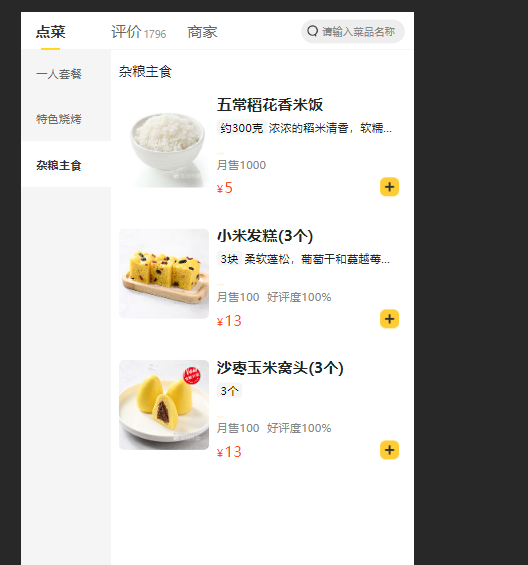

### 添加购物车

步骤：

1. 使用 RTK 管理新状态 cartList，表示为选购的食品。添加食品的逻辑：如果添加过，则更新食品数量；反之直接 push 进去
2. 在组件中点击时收集数据提交 action 添加购物车

示例：添加食品到购物车的逻辑

```jsx
addCartList(state, action) {
  // 判断是否添加过购物车
  const item = state.cartList.find((item) => item.id === action.payload.id)
  if (item) {
    item.count++
  } else {
    state.cartList.push(action.payload)
  }
},
....
```

示例：点击添加按钮，提交 action 时传递参数

```jsx
    <span
      className="plus"
      onClick={() =>
        dispatch(
          addCartList({
            id,
            picture,
            name,
            unit,
            description,
            food_tag_list,
            month_saled,
            like_ratio_desc,
            price,
            tag,
            count,
          })
        )
      }
    ></span>
```

### 统计功能

1. 基于 store.cartList 的长度渲染数量
2. 基于 store.cartList 计算总价格
3. 基于 store.cartList 的长度进行高亮展示

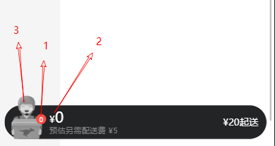

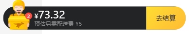

### 购物车列表

功能：

1. 购物车列表渲染
2. 购物车中食品增减逻辑
3. 清空购物车逻辑

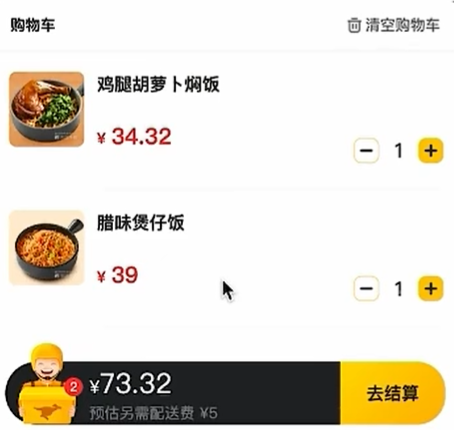

步骤：

1. 使用 cartList 遍历渲染列表
2. RTK 中添加 增减 reducer，在组件中提交对应的 action
3. RTK 中添加 清除购物车 reducer，在组件中提交对应的 action

### 控制购物车显隐

需求：

1. 点击统计区域时，购物车列表显示
2. 点击蒙层区域时，购物车和蒙层隐藏

实现步骤：

1. 使用 useState 声明控制显隐的状态（这里的状态无需全局保存）
2. 点击统计区域设置状态为 true
3. 点击蒙层区域设置状态为 false
