# ReactRouter 与实战

## 目录

- [1. React 入门](/frameworks/react0/)
- [2. Redux](/frameworks/react0/02_redux/)
- [3. Router](/frameworks/react0/03_router/)
- [4. 极客网](/frameworks/react0/04_jikewang/)
- [5. React 进阶](/frameworks/react0/05_enhance/)
- [6. Zustand](/frameworks/react0/06_zustand/)
- [7. 使用 TS 编写 React](/frameworks/react0/07_with_ts/)

## ReactRouter 入门

### 安装与准备

```sh
# 创建项目
npx create-react-app 01_router
cd 01_router/
npm install

# 安装最新的 ReactRouter 包
npm i react-router-dom

# 启动
npm start
```

### 快速上手

从示例出发：创建一个可以切换文章页和日志页的路由系统

```jsx
import React from 'react'
import ReactDOM from 'react-dom/client'
import { RouterProvider, createBrowserRouter } from 'react-router-dom'

function JournalPage() {
  return <div>日志页</div>
}

// 1. 创建路由对象并配置路由对应关系
const router = createBrowserRouter([
  {
    path: '/article',
    element: <div>文章页</div>,
  },
  {
    path: '/journal',
    element: JournalPage(),
  },
])

const root = ReactDOM.createRoot(document.getElementById('root'))
root.render(
  <React.StrictMode>
    { /* 2. 通过 RouterProvider 传递创建的 router 对象 */ }
    <RouterProvider router={router}></RouterProvider>
  </React.StrictMode>
)
```

访问两个路径，发现分别被路由到两个组件上

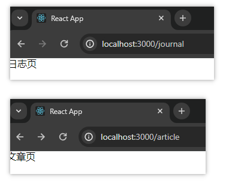

### 抽象路由模块

按照规范，把路由模块和页面单独提取出来，使项目目录更加清晰直观。

步骤：

1. 创建 `src/page` 目录，将页面放在其中
2. 创建 `src/router` 目录，在其中编写路由对象的创建逻辑
3. 在应用入口文件中使用 `RouterProvider` 并注入 router 实例

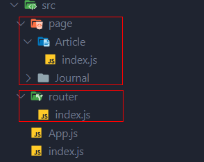

### 路由导航跳转

通常有两种方式可以选择。

1、声明式导航

在模板中通过 Link 组件描述出要跳转到哪里去，比如后台管理系统的左侧菜单通常使用这种方式进行。

使用说明：通过给组件的 to 属性指定要跳转的路由 path，组件会被渲染为浏览器支持的 a 链接，如果需要传参，直接通过**字符串拼接方式**的拼接方式即可

```jsx
<Link to='/article'>文章</Link>
```

2、编程式导航

通过 `useNavigate` 钩子得到导航方法，然后通过调用方法以命令式的形式进行路由跳转。比如想在登录请求完毕后跳转就可以选择这种方式。

相较于声明式导航，这种方法更加灵活

使用说明：调用 navigate 方法并传入地址实现跳转

```jsx
import { useNavigate } from 'react-router-dom'

function Journal() {
  // 1. 调用 hook 获取导航方法
  const navigate = useNavigate()
  return (
    <div>
      <div>我是日志页</div>
      { /* 2. 调用导航方法并传入路径 */ }
      <button onClick={() => navigate('/article')}>去文章页</button>
    </div>
  )
}

export default Journal
```

二者的用法有何区别？声明式导航通常用于菜单导航，编程式导航通常应用于代码中比如登录页跳转

### 导航跳转传参

通常情况下有两种传参方式。

**1**、`searchParams` 传参

使用方法

```jsx
// 参数传递
navigate('/article?id=1001&name=guo')

// 参数接收
const [params] = useSearchParams()
let id = params.get('id')
let name = params.get('name')
```

示例

```jsx
import { Link, useNavigate } from 'react-router-dom'

function Journal() {
  const navigate = useNavigate()
  return (
    <div>
      <div>我是日志页</div>
      <div>
        { /* 1. 传递参数 */ }
        <Link to={'/article?id=1001&name=eugene'}>去文章页</Link>
      </div>
      <div>
        { /* 2. 传递参数 */ }
        <button onClick={() => navigate('/article?id=1002&name=guo')}>
          去文章页
        </button>
      </div>
    </div>
  )
}

export default Journal
```

```jsx
import { useSearchParams } from 'react-router-dom'

function Article() {
  // 通过 useSearchParams hook 获取参数对象
  const [parmas] = useSearchParams()
  return (
    <div>
      { /* 通过 参数对象.get(xx) 获取参数值 */ }
      我是文章页, id={parmas.get('id')}, name={parmas.get('name')}
    </div>
  )
}

export default Article
```

**2**、`params` 传参

使用方法

```jsx
// 定义路由路径模板
const router = createBrowserRouter([
  {
    path: '/article/:id',            // 定义 URI 模板。使用占位符
    element: <Article />,
  },
])

// 传递参数
navigate('/article/1001')

// 接收参数
const params = useParams()
let id = params.id
```

示例：

定义路由规则

```jsx
const router = createBrowserRouter([
  {
    path: '/article',
    element: <Article />,
  },
  {
    path: '/journal',
    element: <Journal />,
  },
  {
    path: '/aboutme/:id',            // 定义 URI 模板。使用占位符
    element: <AboutMe />,
  },
])
```

传递参数

```jsx
<div>
  <button onClick={() => navigate('/aboutme/1002')}>去文章页2</button>
</div>
```

接收参数

```jsx
import { useParams } from 'react-router-dom'
function AboutMe() {
  const params = useParams()
  return <div>关于俺。id={params.id}</div>
}
export default AboutMe
```

### 嵌套路由配置

解释：在一级路由中又嵌套了其他路由，这种关系叫做嵌套路由，嵌套至一级路由内的路由又称作二级路由。

比如以下示例图，Layout Component 为一级路由，其中又包含了两个路由项，这两个路由项可看成二级路由。

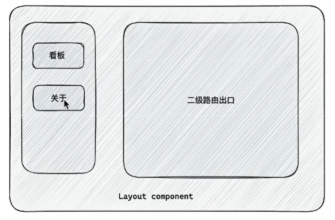

使用步骤

1. 使用 `children` 属性配置路由嵌套关系
2. 使用 `Outlet` 组件配置二级路由渲染位置

示例

`src/router/index.js`

```js
const router = createBrowserRouter([
  {
    path: '/',
    element: <Layout />,
    children: [                        // 配置子路由
      {
        path: 'page1',                 // 子路由路径不以/开头
        element: <Page1 />,
      },
      {
        path: 'page2',
        element: <Page2 />,
      },
    ],
  },
])
```

`src/page/Layout/index.js`

```jsx
const { Link, Outlet } = require('react-router-dom')

const Layout = () => {
  return (
    <div>
      俺是Layout组件。<Link to={'/page1'}>Page1</Link>, <Link to={'/page2'}>Page2</Link>

      {/* 二级路由渲染位置 */}
      <div style={{ border: '1px solid grey' }}>
        <Outlet />
      </div>
    </div>
  )
}

export default Layout
```

结果：

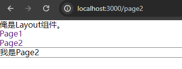

---

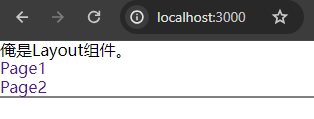

**<u>问题</u>**：如上图所示，Layout 组件在初始状态（未点击导航项前）时二级路由默认不会渲染任何内容。如何**设置二级路由默认渲染指定页面**呢？

答：修改需要配置为默认路由的二级路由项，该项无需配置 path 属性，但应该添加一项 `index: true` 配置

```jsx
const router = createBrowserRouter([
  {
    path: '/',
    element: <Layout />,
    children: [
      {
        index: true,              // 默认二级路由
        element: <Page1 />,
      },
      {
        path: 'page2',
        element: <Page2 />,
      },
    ],
  },
])
```

`Layout/index.js`

```jsx
const Layout = () => {
  return (
    <div>
      俺是Layout组件。
      { /* 因为 Page1 被设置成了默认路由，则这里的路径应该设置为“一级路由” */ }
      <Link to={'/'}>Page1</Link>,  
      <Link to={'/page2'}>Page2</Link>

      {/* 二级路由渲染位置 */}
      <div style={{ border: '1px solid grey' }}>
        <Outlet />
      </div>
    </div>
  )
}
```

结果很理想

 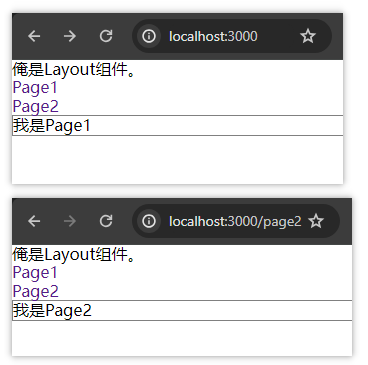

### 404 路由配置

默认情况下，当浏览器输入 URL 的路径在整个路由配置中都找不到对应的 path 时，会出现一个错误界面，比如：

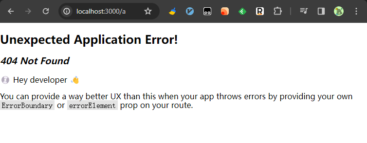

为了用户体验，可以使用 404 兜底组件进行渲染。

步骤：

1. 准备一个 NotFound 组件
2. 在路由表数组的末尾添加一项 `path: *` 的路由配置

比如：

```jsx
const router = createBrowserRouter([
  ...
  ...
  {
    path: '*',
    element: <div>not found</div>,
  },
])
```

### 两种路由模式

各种主流框架的路由模式通常都有两种：history 和 hash。ReactRouter 中需要分别使用 createBrowserRouter 和 createHashRouter 函数创建。

区别：
| 路由模式    | url形式       | 底层原理                      | 是否需要后端支持 |
| ----------- | ------------- | ----------------------------- | ---------------- |
| **history** | `url/login`   | history 对象 + pushState 事件 | 需要             |
| **hash**    | `url/#/login` | 监听 hashChange 变化          | 不需要           |

## 记账本案例

### 项目搭建

```sh
# 创建项目
npx create-react-app 02_accounting_app

# 安装必要依赖
npm i @reduxjs/toolkit react-redux react-router-dom dayjs classnames antd-mobile axios

# 处理文件

# 启动
npm run start
```

> 依赖介绍：
>
> 1. Redux 状态管理 - `@reduxjs/toolkit`、`react-redux`
> 2. 路由 - `react-router-dom`
> 3. 时间处理 - `dayjs`
> 4. class 类名处理 - `classnames`
> 5. 移动端组件库 - `antd-mobile`
> 6. 请求插件 - `axios`

### 配置别名路径 @

1. 开发环境路径解析配置，属于 webpack 层面，要求把代码中 `@/` 改为 `src/`
2. 路径自动补全配置，属于 VSCode 层面，要求在输入 `@/` 时自动联想出来对应的 `src/` 下的子级目录

**1、开发环境路径解析配置**

> CRA 模板把 webpack 配置包装到了黑盒里无法直接修改，需要借助一个插件：`croco`

配置步骤：

1. 安装 craco：`npm i -D craco`
2. 在项目根目录下创建配置文件：`craco.config.js`。然后在其中添加路径解析配置
3. 在 `package.json` 中配置启动和打包命令

`craco.config.js`

```js
const path = require('path')

module.exports = {
  // webpack 配置
  webpack: {
    // 配置别名
    alias: {
      // 约定：使用 @ 表示 src 文件所在路径
      '@': path.resolve(__dirname, 'src'),
    },
  },
}
```

`package.json`，将 `start` 命令对应的 `react-scripts start` 替换为 `craco start`

```json
{
    ...
  "scripts": {
    "start": "craco start",
    "build": "croco build",
      ...
  },
    ...
  "devDependencies": {
    "craco": "^0.0.3"
  }
}

```

> 小实验：验证是否可以使用 @ 指代 src 目录
>
> 1. 创建文件 `src/test.js`，在其中定义一个 sum 方法并默认导出
> 2. 在 `index.js` 中从 `@/test.js` 导入 sum 方法，并调用

**2、路径自动补全配置**

VsCode 的联想配置，需要我们在项目根目录下添加 `jsconfig.json` 文件，加入配置后 VsCode 会自动读取配置帮我们自动联想提示。

> 注意：这里的路径自动补全是 VsCode 提供的功能，而无需安装 VsCode 插件。

```json
{
  "compilerOptions": {
    "baseUrl": "./",
    "paths": {
      "@/*": ["src/*"]
    }
  }
}
```

### 数据 Mock

在前后端分离的开发模式下，前端可以在没有实际后端接口的支持下进行接口数据的模拟，以进行正常的业务功能开发工作。

常见的 Mock 方式：

1. 前端直接写假数据。静态数据，无需外部服务
2. 自研 Mock 平台。成本高，一般的中小公司不具备研发成本
3. `json-server` 等工具。提供后台服务且成本低

这里选择 `json-server` 实现数据 Mock

`json-server` 是一个 node 包，可以在不到 30s 内获得零编码的完整的 Mock 服务。[github json-server](https://github.com/typicode/json-server)

使用步骤：

1. 安装 json-server 作为开发依赖：`npm i -D json-server`
2. 准备 `data.json` 文件，放在根目录下： `server/data.json`。填充 [json 数据](https://github.com/GreatArchimage/react-bill/blob/main/server/data.json)
3. 在 `package.json` 的 `scripts` 项下添加启动命令：`"server" : "json-server ./server/data.json --port 8888"`
4. 使用 `npm run server` 命令启动。访问接口测试

### 整体路由设计

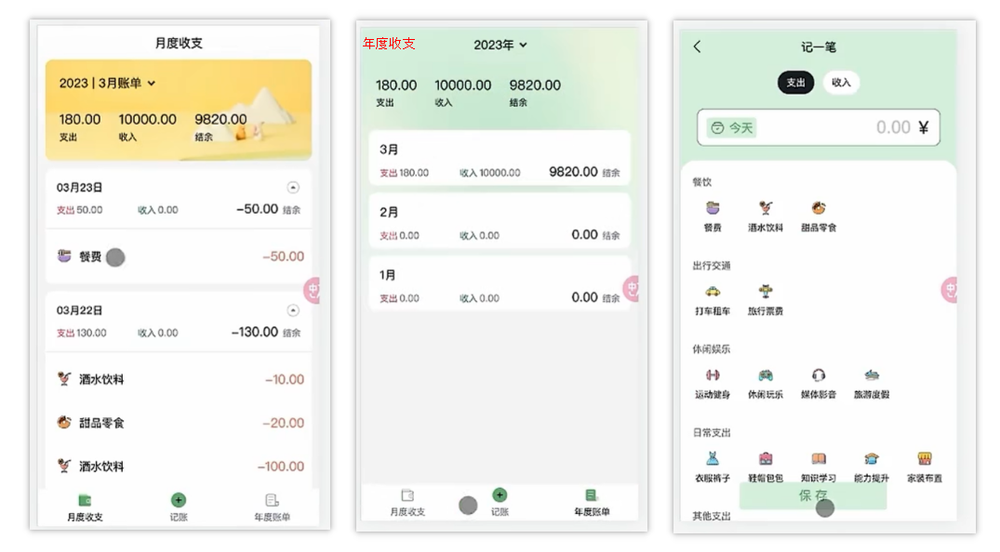

此应用主要包含三个页面：月度账单、年度账单、添加记账，分别如上图所示。

1. 默认会进入“月度收支”页面，如上边的左图所示。

2. 点击“年度账单” 会进入上边的右图所示页面。
3. 点击“记账”会进入上边所示的中间图片页面。

由此可得：”月度收支“ 和 ”年度账单“ 是属于同一个一级路由下的二级路由，”记账“ 属于一级路由。

路由结构为：

```
- 添加记账
- Layout
 - 月度账单（默认二级路由）
 - 年度账单
```

创建路由实例

```jsx
const router = createBrowserRouter([
  {
    path: '/',
    element: <Layout />,
    children: [
      {
        index: true,                   // 【月度账单页面】为默认的二级路由
        element: <MonthBill />,
      },
      {
        path: 'year',
        element: <YearBill />,
      },
    ],
  },
  {
    path: '/new',
    element: <NewBill />,
  },
])
```

Layout 容器页面

```jsx
import { Outlet, useNavigate } from 'react-router-dom'

const Layout = () => {
  const navigate = useNavigate()
  return (
    <div>
      <div>
        { /* 二级路由渲染位置 */ }
        <Outlet />
      </div>
      <div>我是Layout</div>
      <button onClick={() => navigate('/')}>月度账单</button>
      <button onClick={() => navigate('/new')}>新建账单</button>
      <button onClick={() => navigate('/year')}>年度账单</button>
    </div>
  )
}
export default Layout
```

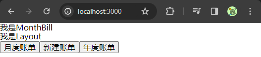

补全其他页面。。。

### antD 主题定制

两种定制方案：

1. 全局定制。**整个应用范围**内的组件都生效
2. 局部定制。**只在某些元素内部**的组件生效

**1、全局定制**

创建 `src/theme.css` 样式文件，在其中编写

```css
:root:root {
  --adm-color-primary: #a062d4;
}
```

在 `index.js` 中引入样式文件

```js
import '@/theme.css'
```

使用该 primary 颜色

```jsx
import { Outlet, useNavigate } from 'react-router-dom'
// 1.引入按钮
import { Button } from 'antd-mobile'

const Layout = () => {
  const navigate = useNavigate()
  return (
    <div>
      <div>我是Layout</div>
      { /* 2.使用Button按钮并定义 color=primary 属性 */ }
      <Button color={'primary'} onClick={() => navigate('/')}>测试按钮</Button>
    </div>
  )
}
export default Layout
```

**2、局部定制**

比如指定在 `class = purple` 的标签内生效

```css
// .purple-part 内的元素的颜色变量值设置
.purple-part {
  --adm-color-primary: #a062d4;
}
```

```jsx
import { Outlet, useNavigate } from 'react-router-dom'
import { Button } from 'antd-mobile'

const Layout = () => {
  const navigate = useNavigate()
  return (
    <div>
      <div>我是Layout</div>
      <Button color="primary">默认样式</Button>
      <div className="purple-part">
        <Button color="primary">局部样式</Button>
      </div>
    </div>
  )
}
export default Layout
```

结果：

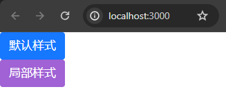

参考链接：[antD mobile 主题](https://mobile.ant.design/zh/guide/theming/)

### 使用 Redux 管理账目列表

使用 RTK 管理账目数据。

示例：管理账目数据和展示数据

```jsx
import { createSlice } from '@reduxjs/toolkit'
import axios from 'axios'

const billStore = createSlice({
  name: 'bill',
  initialState: {
    billList: [],
  },
  reducers: {
    setBillList(state, action) {
      state.billList = action.payload
    },
  },
})

// 异步数据获取
const { setBillList } = billStore.actions
const fetchBillList = () => {
  return async (dispatch) => {
    const rsp = await axios.get('http://localhost:8888/ka')
    dispatch(setBillList(rsp.data))
  }
}
export { fetchBillList }

// billReducer
const billReducer = billStore.reducer
export default billReducer
```

```jsx
import { fetchBillList } from '@/store/modules/billStore'
import { useEffect } from 'react'
import { useDispatch } from 'react-redux'
import { Outlet, useNavigate } from 'react-router-dom'

const Layout = () => {
  //创建dispatch对象
  const dispatch = useDispatch()
  //使用 useEfffect 钩子触发异步请求
  useEffect(() => {
    dispatch(fetchBillList())
  }, [dispatch])

  const navigate = useNavigate()
  return (
    <div>
      <div>
        <Outlet />
      </div>
      <div>我是Layout</div>
      <button onClick={() => navigate('/')}>月度账单</button>
      <button onClick={() => navigate('/new')}>新建账单</button>
      <button onClick={() => navigate('/year')}>年度账单</button>
    </div>
  )
}
export default Layout
```

### TabBar 功能实现

需求：使用 `antD` 提供的 `TabBar` 标签栏组件进行布局一级路由的切换

[TabBar 文档](https://mobile.ant.design/zh/components/tab-bar)

1、安装 sass。然后重启项目

```sh
npm i -D sass
```

2、在 `pages/Layout/` 下添加 `index.scss` （注意后缀为 **.scss**）

```css
.layout {
  .container {
    position: fixed;
    top: 0;
    bottom: 50px;
    width: 100%;
  }
  .footer {
    position: fixed;
    bottom: 0;
    width: 100%;
  }
}
```

3、修改 `pages/Layout/index.js`

```jsx
const Layout = () => {
  return (
    <div className="layout">
      <div className="container">
        <Outlet />
      </div>
      <div className="footer">
        <TabBar>
          {tabs.map((item) => (
            <TabBar.Item key={item.key} icon={item.icon} title={item.title} />
          ))}
        </TabBar>
      </div>
    </div>
  )
}
```

得到布局：

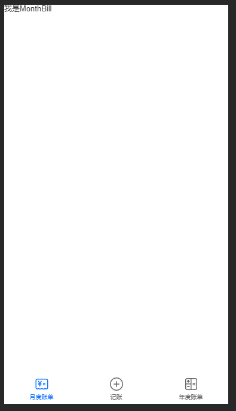

4、路由切换功能实现

可以根据 TabBar 组件的 onChange 回调获取当前点击的 Tab 页，进而完成切换

```jsx
const tabs = [
  {
    key: '/',
    title: '月度账单',
    icon: <BillOutline />,
  },
  {
    key: '/new',
    title: '记账',
    icon: <AddCircleOutline />,
  },
  {
    key: '/year',
    title: '年度账单',
    icon: <CalculatorOutline />,
  },
]

const Layout = () => {
  const navigate = useNavigate()
  // 2. 根据 tabbar 的点击切换路由的逻辑
  const changeTab = (path) => {
    // 这里的 path 就是 tabs[x].key
    console.log(path)
    navigate(path)
  }
  
  return (
    <div className="layout">
      <div className="container">
        <Outlet />
      </div>
      <div className="footer">
        { /* 1. 添加 onChange 回调 */ }
        <TabBar onChange={changeTab}>
          {tabs.map((item) => (
            <TabBar.Item key={item.key} icon={item.icon} title={item.title} />
          ))}
        </TabBar>
      </div>
    </div>
  )
}
```

`@/pages/Layout/index.js` 完整代码

```jsx
import { fetchBillList } from '@/store/modules/billStore'
import { useEffect } from 'react'
import { useDispatch } from 'react-redux'
import { Outlet, useNavigate } from 'react-router-dom'
import { TabBar } from 'antd-mobile'
import {
  BillOutline,
  AddCircleOutline,
  CalculatorOutline,
} from 'antd-mobile-icons'

// 引入样式文件
import './index.scss'

const tabs = [
  {
    key: '/',
    title: '月度账单',
    icon: <BillOutline />,
  },
  {
    key: '/new',
    title: '记账',
    icon: <AddCircleOutline />,
  },
  {
    key: '/year',
    title: '年度账单',
    icon: <CalculatorOutline />,
  },
]

const Layout = () => {
  // 获取数据
  const dispatch = useDispatch()
  useEffect(() => {
    dispatch(fetchBillList())
  }, [dispatch])

  // 根据 tabbar 的点击切换路由的逻辑
  const navigate = useNavigate()
  const changeTab = (path) => {
    // 这里的 path 就是 tabs[x].key
    console.log(path)
    navigate(path)
  }

  return (
    <div className="layout">
      <div className="container">
        <Outlet />
      </div>
      <div className="footer">
        <TabBar onChange={changeTab}>
          {tabs.map((item) => (
            <TabBar.Item key={item.key} icon={item.icon} title={item.title} />
          ))}
        </TabBar>
      </div>
    </div>
  )
}
export default Layout
```

### 统计区-功能了解及结构搭建

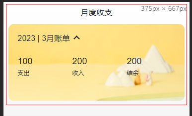

页面内容

```jsx
import { NavBar, DatePicker } from 'antd-mobile'
import './index.scss'

const MonthBill = () => {
  return (
    <div className="monthlyBill">
      <NavBar className="nav" backArrow={false}>
        月度收支
      </NavBar>
      <div className="content">
        <div className="header">
          {/* 时间切换区域 */}
          <div className="date">
            <span className="text">2023 | 3月账单</span>
            <span className="arrow expand"></span>
          </div>
          {/* 统计区域 */}
          <div className="twoLineOverview">
            <div className="item">
              <span className="money">{100}</span>
              <span className="type">支出</span>
            </div>
            <div className="item">
              <span className="money">{200}</span>
              <span className="type">收入</span>
            </div>
            <div className="item">
              <span className="money">{200}</span>
              <span className="type">结余</span>
            </div>
          </div>
          {/* 时间选择区 */}
          <DatePicker
            className="kaDate"
            title="记账日期"
            precision="month"
            visible={false}
            max={new Date()}
          />
        </div>
      </div>
    </div>
  )
}
export default MonthBill
```

`index.scss`

```css
.monthlyBill {
  --ka-text-color: #191d26;
  height: 100%;
  background: linear-gradient(180deg, #ffffff, #f5f5f5 100%);
  background-size: 100% 240px;
  background-repeat: no-repeat;
  background-color: rgba(245, 245, 245, 0.9);
  color: var(--ka-text-color);

  .nav {
    --adm-font-size-10: 16px;
    color: #121826;
    background-color: transparent;
    .adm-nav-bar-back-arrow {
      font-size: 20px;
    }
  }

  .content {
    height: 640px;
    padding: 0 10px;
    overflow-y: scroll;
    -ms-overflow-style: none; /* Internet Explorer 10+ */
    scrollbar-width: none; /* Firefox */
    &::-webkit-scrollbar {
      display: none; /* Safari and Chrome */
    }

    > .header {
      height: 135px;
      padding: 20px 20px 0px 18.5px;
      margin-bottom: 10px;
      background-image: url(https://yjy-teach-oss.oss-cn-beijing.aliyuncs.com/reactbase/ka/month-bg.png);
      background-size: 100% 100%;

      .date {
        display: flex;
        align-items: center;
        margin-bottom: 25px;
        font-size: 16px;

        .arrow {
          display: inline-block;
          width: 7px;
          height: 7px;
          margin-top: -3px;
          margin-left: 9px;
          border-top: 2px solid #121826;
          border-left: 2px solid #121826;
          transform: rotate(225deg);
          transform-origin: center;
          transition: all 0.3s;
        }
        .arrow.expand {
          transform: translate(0, 2px) rotate(45deg);
        }
      }
    }
  }
  .twoLineOverview {
    display: flex;
    justify-content: space-between;
    width: 250px;

    .item {
      display: flex;
      flex-direction: column;

      .money {
        height: 24px;
        line-height: 24px;
        margin-bottom: 5px;
        font-size: 18px;
      }
      .type {
        height: 14px;
        line-height: 14px;
        font-size: 12px;
      }
    }
  }
}
```

### 统计区-时间选择框的切换

需求：

1. 点击上箭头，打开时间选择弹框
2. 点击弹框上的取消/确认按钮或蒙层区域，关闭时间选择弹框
3. 弹框关闭时显示上箭头，打开时箭头朝上

思路：维护一个状态用来控制弹框的显隐状态和箭头方向

```jsx
// 时间选择器可见状态
const [datePickerVisible, setDatePickerVisible] = useState(false)

...

{/* 时间切换区域 */}
<div className="date" onClick={() => setDatePickerVisible(true)}>
    <span className="text">2023 | 3月账单</span>
    <span
      className={classNames('arrow', datePickerVisible && 'expand')}
    ></span>
</div>

...

{/* 时间选择区 */}
<DatePicker
    className="kaDate"
    title="记账日期"
    precision="month"
    visible={datePickerVisible}
    onConfirm={() => setDatePickerVisible(false)}
    onCancel={() => setDatePickerVisible(false)}
    onClose={() => setDatePickerVisible(false)}
    max={new Date()}
    />
</div>
```

### 统计区-点击确认切换时间显示

思路：维护一个控制时间显示的状态，然后在 onConfirm 钩子中获取选中的时间赋值给状态变量

```jsx
// 控制显示时间的状态
const [currentDateStr, setCurrentDateStr] = useState(
  dayjs(new Date()).format('YYYY | M')
)
// 确定选择日期
const onConfirmHandle = (date) => {
  setCurrentDateStr(dayjs(date).format('YYYY | M'))
}

...

{/* 时间切换区域 */}
<div className="date" onClick={() => setDatePickerVisible(true)}>
    <span className="text">{currentDateStr}月账单</span>
    <span className={classNames('arrow', datePickerVisible && 'expand')}></span>
</div>
```

### 统计区-数据按月分组

```jsx
  // 从 store 中获取账单列表
  const billList = useSelector((state) => state.bills.billList)
  console.log(billList)
  // useMemo: 类似于 Vue 中的计算属性。arg1 定义计算逻辑，arg2 表示依赖项数组
  const monthlyBillList = useMemo(() => {
    // return 出去计算后的值
    return _.groupBy(billList, (item) => dayjs(item.date).format('YYYY-MM'))
  }, [billList])
  console.log(monthlyBillList)
```

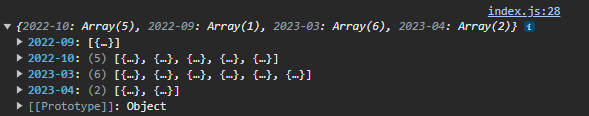

### 统计区-选择月份后做统计

需求：点击事件确认按钮之后，把当前月的统计数据计算出来显示到页面中

思路：

1. 点击获取**当前选中的月份**信息，比如 `2023-11`
2. 在按月分组数据中找到**对应数组**
3. 基于数组做运算。（使用 `useMemo` 钩子）

```jsx
  // 确定选择日期
  const onConfirmHandle = (date) => {
    setCurrentDateStr(dayjs(date).format('YYYY | M'))

    // 根据 YYYY-MM 从上一小节获取的日期分组中获取当前月的所有数据
    let monthKey = dayjs(date).format('YYYY-MM')
    // 1. 获取对应月份的数据
    setCurrentMonthBillList(monthlyBillListGroup[monthKey])
  }
  
  
  // 2. 记录当前月份的账单列表
  const [currentMonthBillList, setCurrentMonthBillList] = useState([])
  // 3. 使用 useMemo “动态” 统计当月收支：当依赖项变化时才做计算
  let currentMonthBillStatistics = useMemo(() => {
    let pay = currentMonthBillList
      .filter((item) => item.type === 'pay')
      .reduce((a, c) => a + c.money, 0)
    let income = currentMonthBillList
      .filter((item) => item.type === 'income')
      .reduce((a, c) => a + c.money, 0)
    return {
      pay,
      income,
      total: pay + income,
    }
  }, [currentMonthBillList])

  
  {/* 统计区域 */}
  <div className="twoLineOverview">
    <div className="item">
      <span className="money">
        {currentMonthBillStatistics.pay.toFixed(2)}
      </span>
      <span className="type">支出</span>
    </div>
    <div className="item">
      <span className="money">
        {currentMonthBillStatistics.income.toFixed(2)}
      </span>
      <span className="type">收入</span>
    </div>
    <div className="item">
      <span className="money">
        {currentMonthBillStatistics.total.toFixed(2)}
      </span>
      <span className="type">结余</span>
    </div>
  </div>
```

### 统计区-初始化渲染

需求：打开月度账单时，把当前月份的统计数据渲染到页面中

```jsx
  // 记录当前月份的账单列表
  const [currentMonthBillList, setCurrentMonthBillList] = useState([])
  let currentMonthBillStatistics = useMemo(() => {
    let pay = currentMonthBillList
      .filter((item) => item.type === 'pay')
      .reduce((a, c) => a + c.money, 0)
    let income = currentMonthBillList
      .filter((item) => item.type === 'income')
      .reduce((a, c) => a + c.money, 0)
    return {
      pay,
      income,
      total: pay + income,
    }
  }, [currentMonthBillList])
  
  // 统计区域初始化渲染
  useEffect(() => {
    let currentMonth = dayjs(new Date()).format('YYYY-MM')
    monthlyBillListGroup[currentMonth] &&
      setCurrentMonthBillList(monthlyBillListGroup[currentMonth])
  }, [monthlyBillListGroup])
```

### 列表区-单日列表

需求：把**当前月**的账单数据**以单日为单位**进行统计显示

步骤：

1. 准备单日账单统计组件
2. 把当前月的数据按照日来分组
3. 遍历数据给组件传入日期数据和当日列表数据

示例

 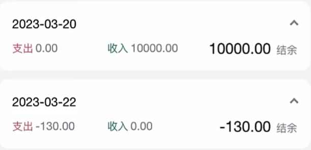

初始的单日账单统计组件（CV 大法）

```jsx
import classNames from 'classnames'
import './index.scss'

const DailyBill = () => {
  return (
    <div className={classNames('dailyBill')}>
      <div className="header">
        <div className="dateIcon">
          <span className="date">{'2023-3-12'}</span>
          <span className={classNames('arrow')}></span>
        </div>
        <div className="oneLineOverview">
          <div className="pay">
            <span className="type">支出</span>
            <span className="money">
              {100}
            </span>
          </div>
          <div className="income">
            <span className="type">收入</span>
            <span className="money">
              {200}
            </span>
          </div>
          <div className="balance">
            <span className="money">
              {100}
            </span>
            <span className="type">结余</span>
          </div>
        </div>
      </div>
    </div>
  )
}

export default DailyBill
```

```scss
.dailyBill {
  margin-bottom: 10px;
  border-radius: 10px;
  background: #ffffff;

  .header {
    --ka-text-color: #888c98;
    padding: 15px 15px 10px 15px;

    .dateIcon {
      display: flex;
      justify-content: space-between;
      align-items: center;
      height: 21px;
      margin-bottom: 9px;
      .arrow {
        display: inline-block;
        width: 5px;
        height: 5px;
        margin-top: -3px;
        margin-left: 9px;
        border-top: 2px solid #888c98;
        border-left: 2px solid #888c98;
        transform: rotate(225deg);
        transform-origin: center;
        transition: all 0.3s;
      }
      .arrow.expand {
        transform: translate(0, 2px) rotate(45deg);
      }

      .date {
        font-size: 14px;
      }
    }
  }
  .oneLineOverview {
    display: flex;
    justify-content: space-between;

    .pay {
      flex: 1;
      .type {
        font-size: 10px;
        margin-right: 2.5px;
        color: #e56a77;
      }
      .money {
        color: var(--ka-text-color);
        font-size: 13px;
      }
    }

    .income {
      flex: 1;
      .type {
        font-size: 10px;
        margin-right: 2.5px;
        color: #4f827c;
      }
      .money {
        color: var(--ka-text-color);
        font-size: 13px;
      }
    }

    .balance {
      flex: 1;
      margin-bottom: 5px;
      text-align: right;

      .money {
        line-height: 17px;
        margin-right: 6px;
        font-size: 17px;
      }
      .type {
        font-size: 10px;
        color: var(--ka-text-color);
      }
    }
  }

  .billList {
    padding: 15px 10px 15px 15px;
    border-top: 1px solid #ececec;
    .bill {
      display: flex;
      justify-content: space-between;
      align-items: center;
      height: 43px;
      margin-bottom: 15px;

      &:last-child {
        margin-bottom: 0;
      }

      .icon {
        margin-right: 10px;
        font-size: 25px;
      }
      .detail {
        flex: 1;
        padding: 4px 0;

        .billType {
          display: flex;
          align-items: center;
          height: 17px;
          line-height: 17px;
          font-size: 14px;
          padding-left: 4px;
        }
      }
      .money {
        font-size: 17px;

        &.pay {
          color: #ff917b;
        }
        &.income {
          color: #4f827c;
        }
      }
    }
  }
}
.dailyBill.expand {
  .header {
    border-bottom: 1px solid #ececec;
  }
  .billList {
    display: block;
  }
}
```

部分逻辑

```jsx
  // 将当前月数据按天分组
  let dailyBillList = useMemo(() => {
    let dailyBills = _.groupBy(currentMonthBillList, (item) =>
      dayjs(item.date).format('YYYY-MM-DD')
    )
    let days = Object.keys(dailyBills)
    return { dailyBills, days }
  }, [currentMonthBillList]) // 以来当前月份收支列表

  ...

{dailyBillList.days.map((key, index) => (
  <DailyBill
    key={index}
    day={key}
    bills={dailyBillList.dailyBills[key]}
  />
))}
```

```jsx
import classNames from 'classnames'
import './index.scss'
import { useMemo } from 'react'

const DailyBill = ({ day, bills }) => {
  let currentMonthBillStatistics = useMemo(() => {
    let pay = bills
      .filter((item) => item.type === 'pay')
      .reduce((a, c) => a + c.money, 0)
    let income = bills
      .filter((item) => item.type === 'income')
      .reduce((a, c) => a + c.money, 0)
    return {
      pay,
      income,
      total: pay + income,
    }
  }, [bills])
  return (
    <div className={classNames('dailyBill')}>
      <div className="header">
        <div className="dateIcon">
          <span className="date">{day}</span>
          <span className={classNames('arrow')}></span>
        </div>
        <div className="oneLineOverview">
          <div className="pay">
            <span className="type">支出</span>
            <span className="money">
              {currentMonthBillStatistics.pay.toFixed(2)}
            </span>
          </div>
          <div className="income">
            <span className="type">收入</span>
            <span className="money">
              {currentMonthBillStatistics.income.toFixed(2)}
            </span>
          </div>
          <div className="balance">
            <span className="money">
              {currentMonthBillStatistics.total.toFixed(2)}
            </span>
            <span className="type">结余</span>
          </div>
        </div>
      </div>
    </div>
  )
}

export default DailyBill
```

### 列表区-单日账单列表

需求：把单日的账单列表渲染到视图中

 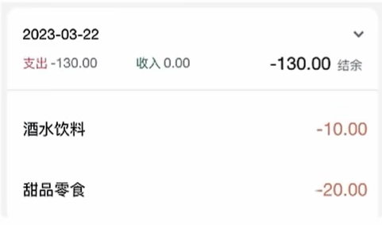

步骤：

1. 准备列表模板
2. 渲染模板数据
3. 适配中文显示

列表模板

```jsx
  {/* 单日列表 */}
  <div className="billList">
    {bills.map((item) => {
      return (
        <div className="bill" key={item.id}>
          <div className="detail">
            <div className="billType">{item.useFor}</div>
          </div>
          <div className={classNames('money', item.type)}>
            {item.money.toFixed(2)}
          </div>
        </div>
      )
    })}
  </div>
```

常量关系

```js
export const billListData = {
  pay: [
    {
      type: 'foods',
      name: '餐饮',
      list: [
        { type: 'food', name: '餐费' },
        { type: 'drinks', name: '酒水饮料' },
        { type: 'dessert', name: '甜品零食' },
      ],
    },
    {
      type: 'taxi',
      name: '出行交通',
      list: [
        { type: 'taxi', name: '打车租车' },
        { type: 'longdistance', name: '旅行票费' },
      ],
    },
    {
      type: 'recreation',
      name: '休闲娱乐',
      list: [
        { type: 'bodybuilding', name: '运动健身' },
        { type: 'game', name: '休闲玩乐' },
        { type: 'audio', name: '媒体影音' },
        { type: 'travel', name: '旅游度假' },
      ],
    },
    {
      type: 'daily',
      name: '日常支出',
      list: [
        { type: 'clothes', name: '衣服裤子' },
        { type: 'bag', name: '鞋帽包包' },
        { type: 'book', name: '知识学习' },
        { type: 'promote', name: '能力提升' },
        { type: 'home', name: '家装布置' },
      ],
    },
    {
      type: 'other',
      name: '其他支出',
      list: [{ type: 'community', name: '社区缴费' }],
    },
  ],
  income: [
    {
      type: 'professional',
      name: '其他支出',
      list: [
        { type: 'salary', name: '工资' },
        { type: 'overtimepay', name: '加班' },
        { type: 'bonus', name: '奖金' },
      ],
    },
    {
      type: 'other',
      name: '其他收入',
      list: [
        { type: 'financial', name: '理财收入' },
        { type: 'cashgift', name: '礼金收入' },
      ],
    },
  ],
}

export const billTypeToName = Object.keys(billListData).reduce((prev, key) => {
  billListData[key].forEach((bill) => {
    bill.list.forEach((item) => {
      prev[item.type] = item.name
    })
  })
  return prev
}, {})
```

使用中文显示

```jsx
{bills.map((item) => {
  return (
    <div className="bill" key={item.id}>
      <div className="detail">
          { /* 获取中文类型 */ }
        <div className="billType">{billTypeToName[item.useFor]}</div>
      </div>
      <div className={classNames('money', item.type)}>
        {item.money.toFixed(2)}
      </div>
    </div>
  )
})}
```

### 列表区-单日账单列表显隐切换

步骤：

1. 在【单日账单】组件中维护一个控制显隐的状态
2. 点击时做取反操作
3. 根据状态适配箭头显隐

 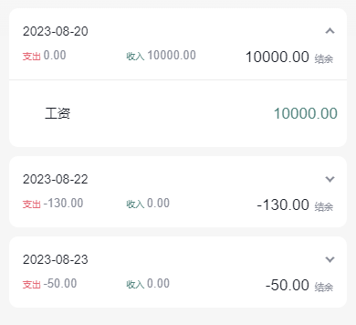

```jsx
const [billListVisible, setBillListVisible] = useState(false)

...

<span
    className={classNames('arrow', billListVisible && 'expand')}
    onClick={() => setBillListVisible(!billListVisible)}
></span>

...

<div className="billList" style={{ display: billListVisible ? 'block' : 'none' }}>
    {bills.map((item) => {
      return (
        <div className="bill" key={item.id}>
          <div className="detail">
            <div className="billType">{billTypeToName[item.useFor]}</div>
          </div>
          <div className={classNames('money', item.type)}>
            {item.money.toFixed(2)}
          </div>
        </div>
      )
    })}
</div>
```

### 列表区-为账单添加图标

 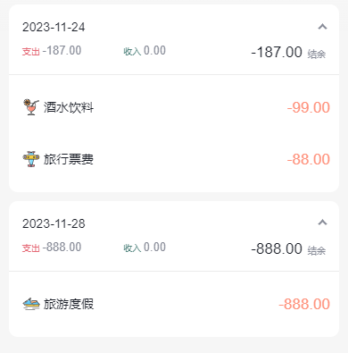

封装图标组件

```jsx
const Icon = ({ type }) => {
  return (
    
  )
}

export default Icon
```

```jsx
        {bills.map((item) => {
          return (
            <div className="bill" key={item.id}>
                  {/*引入 Icon 组件*/}
              <Icon type={item.useFor} />
              <div className="detail">
                <div className="billType">{billTypeToName[item.useFor]}</div>
              </div>
              <div className={classNames('money', item.type)}>
                {item.money.toFixed(2)}
              </div>
            </div>
          )
        })}
```

### 新增页-基础结构

```jsx
import { Button, DatePicker, Input, NavBar } from 'antd-mobile'
import Icon from '@/components/Icon'
import './index.scss'
import classNames from 'classnames'
import { billListData } from '@/contants'
import { useNavigate } from 'react-router-dom'

const New = () => {
  const navigate = useNavigate()
  return (
    <div className="keepAccounts">
      <NavBar className="nav" onBack={() => navigate(-1)}>
        记一笔
      </NavBar>

      <div className="header">
        <div className="kaType">
          <Button
            shape="rounded"
            className={classNames('selected')}
          >
            支出
          </Button>
          <Button
            className={classNames('')}
            shape="rounded"
          >
            收入
          </Button>
        </div>

        <div className="kaFormWrapper">
          <div className="kaForm">
            <div className="date">
              <Icon type="calendar" className="icon" />
              <span className="text">{'今天'}</span>
              <DatePicker
                className="kaDate"
                title="记账日期"
                max={new Date()}
              />
            </div>
            <div className="kaInput">
              <Input
                className="input"
                placeholder="0.00"
                type="number"
              />
              <span className="iconYuan">¥</span>
            </div>
          </div>
        </div>
      </div>

      <div className="kaTypeList">
        {billListData['pay'].map(item => {
          return (
            <div className="kaType" key={item.type}>
              <div className="title">{item.name}</div>
              <div className="list">
                {item.list.map(item => {
                  return (
                    <div
                      className={classNames(
                        'item',
                        ''
                      )}
                      key={item.type}

                    >
                      <div className="icon">
                        <Icon type={item.type} />
                      </div>
                      <div className="text">{item.name}</div>
                    </div>
                  )
                })}
              </div>
            </div>
          )
        })}
      </div>

      <div className="btns">
        <Button className="btn save">
          保 存
        </Button>
      </div>
    </div>
  )
}

export default New
```

配套样式

```scss
.keepAccounts {
  --ka-bg-color: #daf2e1;
  --ka-color: #69ae78;
  --ka-border-color: #191d26;

  height: 100%;
  background-color: var(--ka-bg-color);

  .nav {
    --adm-font-size-10: 16px;
    color: #121826;
    background-color: transparent;
    &::after {
      height: 0;
    }

    .adm-nav-bar-back-arrow {
      font-size: 20px;
    }
  }

  .header {
    height: 132px;

    .kaType {
      padding: 9px 0;
      text-align: center;

      .adm-button {
        --adm-font-size-9: 13px;

        &:first-child {
          margin-right: 10px;
        }
      }
      .selected {
        color: #fff;
        --background-color: var(--ka-border-color);
      }
    }

    .kaFormWrapper {
      padding: 10px 22.5px 20px;

      .kaForm {
        display: flex;
        padding: 11px 15px 11px 12px;
        border: 0.5px solid var(--ka-border-color);
        border-radius: 9px;
        background-color: #fff;

        .date {
          display: flex;
          align-items: center;
          height: 28px;
          padding: 5.5px 5px;
          border-radius: 4px;
          // color: #4f825e;
          color: var(--ka-color);
          background-color: var(--ka-bg-color);

          .icon {
            margin-right: 6px;
            font-size: 17px;
          }
          .text {
            font-size: 16px;
          }
        }

        .kaInput {
          flex: 1;
          display: flex;
          align-items: center;

          .input {
            flex: 1;
            margin-right: 10px;
            --text-align: right;
            --font-size: 24px;
            --color: var(--ka-color);
            --placeholder-color: #d1d1d1;
          }

          .iconYuan {
            font-size: 24px;
          }
        }
      }
    }
  }

  .container {
  }
  .kaTypeList {
    height: 490px;
    padding: 20px 11px;
    padding-bottom: 70px;
    overflow-y: scroll;
    background: #ffffff;
    border-radius: 20px 20px 0 0;
    -ms-overflow-style: none; /* Internet Explorer 10+ */
    scrollbar-width: none; /* Firefox */
    &::-webkit-scrollbar {
      display: none; /* Safari and Chrome */
    }

    .kaType {
      margin-bottom: 25px;
      font-size: 12px;
      color: #333;

      .title {
        padding-left: 5px;
        margin-bottom: 5px;
        font-size: 13px;
        color: #808080;
      }
      .list {
        display: flex;

        .item {
          width: 65px;
          height: 65px;
          padding: 9px 0;
          margin-right: 7px;
          text-align: center;
          border: 0.5px solid #fff;
          &:last-child {
            margin-right: 0;
          }

          .icon {
            height: 25px;
            line-height: 25px;
            margin-bottom: 5px;
            font-size: 25px;
          }
        }
        .item.selected {
          border: 0.5px solid var(--ka-border-color);
          border-radius: 5px;
          background: var(--ka-bg-color);
        }
      }
    }
  }

  .btns {
    position: fixed;
    bottom: 15px;
    width: 100%;
    text-align: center;

    .btn {
    width: 200px;
    --border-width: 0;
    --background-color: #fafafa;
    --text-color: #616161;
    &:first-child {
    margin-right: 15px;
    }
    }
    .btn.save {
    --background-color: var(--ka-bg-color);
    --text-color: var(--ka-color);
    }
    }
  }
```

### 新增页-收入支出页切换

内容：

1. 维护控制收入支出的状态（控制 UI 的变化）
2. 点击按钮切换安装状态
3. 适配按钮样式
4. 适配收支类型列表显示

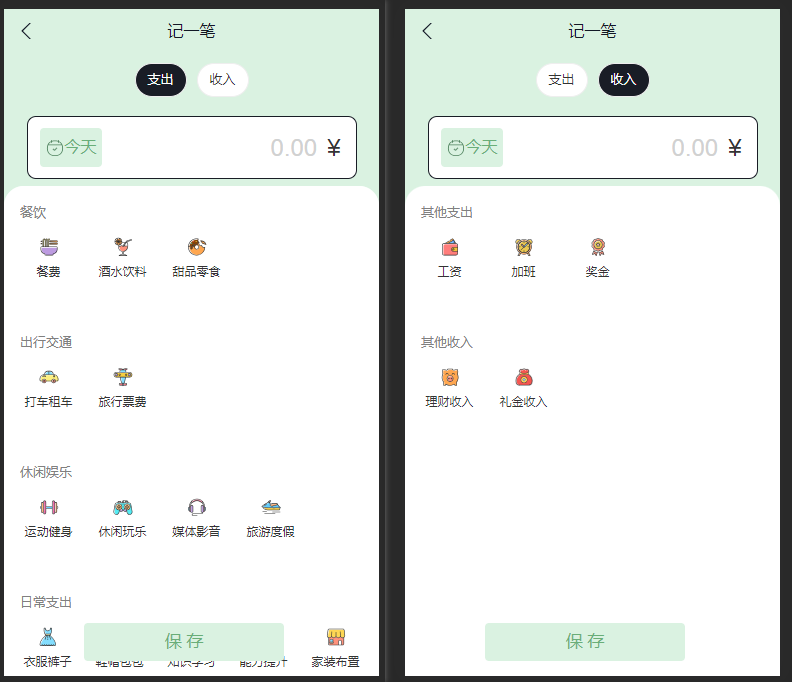

部分代码：

```jsx
  // 当前标签页类型
  const [billType, setBillType] = useState('pay')
  
  ...
  
<Button
shape="rounded"
onClick={() => setBillType('pay')}
className={classNames(billType === 'pay' ? 'selected' : '')}>
支出</Button>
<Button
onClick={() => setBillType('income')}
className={classNames(billType === 'income' ? 'selected' : '')}
shape="rounded">
收入</Button>

...

<div className="kaTypeList">
    {billListData[billType].map((item) => {
    return ...}) }
</div>
```

### 新增页-实现新增账单逻辑

步骤：

1. 在组件中收集接口数据
   1. `type` - 账单类型，支出 pay / 收入 income
   2. `money` - 账单金额，支出为负 / 收入为正
   3. `date` - 记账时间
   4. `useFor` - 账单类型
2. 在 Redux 中编写异步代码
3. 点击保存时提交 action

在 Redux 中添加【异步提交 action】

```jsx
const billStore = createSlice({
  name: 'bill',
  initialState: {
    billList: [],
  },
  reducers: {
    addBill(state, action) {
      state.billList.push(action.payload)
    },
  },
})

const { addBill } = billStore.actions

// 2. 异步添加数据action
const insertBillAction = (bill) => {
  return async (dispatch) => {
    const rsp = await axios.post('http://localhost:8888/ka', bill)
    dispatch(addBill(rsp.data))
  }
}

export { insertBillAction }
...
```

```jsx
  // 输入的金额
  const [money, setMoney] = useState(0)
  const onChangeMoney = (e) => {
    setMoney(e)
  }
  // 收支类型
  const [useFor, setUseForType] = useState('')
  const onSaveBill = () => {
    // 1. 收集数据
    const data = {
      type: billType,
      money: billType === 'income' ? +money : -money,
      date: new Date(),
      useFor,
    }
    dispatch(insertBillAction(data))
  }
  
  ...
  
<div className="btns">
    <Button onClick={onSaveBill} className="btn save">
      保 存
    </Button>
</div>
```

### 新增页-收尾优化

1、消费类型选中效果。基于 `selected` css 类做展示效果

```jsx
    {item.list.map((item) => {
      return (
        <div onClick={() => setUseForType(item.type)}
             className={classNames('item', useFor === item.type ? 'selected' : '')}
             key={item.type} >
          <div className="icon">
            <Icon type={item.type} />
          </div>
          <div className="text">{item.name}</div>
        </div>
      )
    })}
```

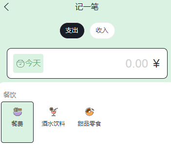

2、切换时间

```jsx
  // 保存回调
  const onSaveBill = () => {
    const data = {
      type: billType,
      money: billType === 'income' ? +money : -money,
      date: selectedDate,              // 使用保存的时间对象
      useFor,
    }
    dispatch(insertBillAction(data))
  }
  // 时间弹窗可视
  const [datePickerVisible, setDatePickerVisible] = useState(false)
  // 时间对象
  const [selectedDate, setSelectedDate] = useState(new Date())
  // 时间显示项目
  const [selectedDateStr, setSelectedDateStr] = useState('今天')
  const onChangeDate = (date) => {
    if (dayjs(date).format('YYYY-MM-DD') === dayjs().format('YYYY-MM-DD')) {
      setSelectedDateStr('今天')
    } else {
      setSelectedDateStr(dayjs(date).format('YYYY-MM-DD'))
    }
    setSelectedDate(date)
    setDatePickerVisible(false)
  }

<div className="date">
  <Icon type="calendar" className="icon" />
  <span
    onClick={() => setDatePickerVisible(!datePickerVisible)}
    className="text"
  >
    {/* 时间展示项 */}
    {selectedDateStr}
  </span>
  <DatePicker
    className="kaDate"
    visible={datePickerVisible}
    title="记账日期"
    onConfirm={onChangeDate}
    onCancel={() => setDatePickerVisible(false)}
    onClose={() => setDatePickerVisible(false)}
    max={new Date()}
  />
</div>
```

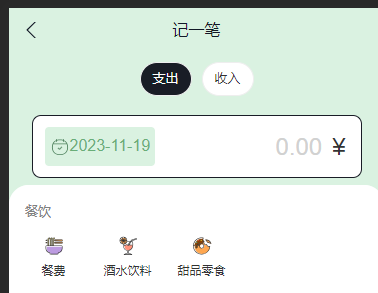
