# 项目实战-极客网

## 目录

- [1. React 入门](/frameworks/react0/)
- [2. Redux](/frameworks/react0/02_redux/)
- [3. Router](/frameworks/react0/03_router/)
- [4. 极客网](/frameworks/react0/04_jikewang/)
- [5. React 进阶](/frameworks/react0/05_enhance/)
- [6. Zustand](/frameworks/react0/06_zustand/)
- [7. 使用 TS 编写 React](/frameworks/react0/07_with_ts/)

## 使用脚手架

1、使用 CRA 工具创建项目

```sh
npx create-react-app 01_jikewang
```

2、按照业务规范整理项目目录

 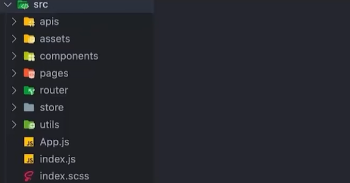

| 目录       | 描述        |
| ---------- | ----------- |
| apis       | 接口及封装  |
| assets     | 静态资源    |
| components | 通用组件    |
| pages      | 页面级组件  |
| router     | 路由 Router |
| store      | Redux 状态  |
| utils      | 工具函数    |

## 安装 sass

SCSS 是一种后缀名为 `.scss` 的**预编译 CSS 语言**，支持一些原生 CSS 不支持的高级用法，比如变量使用、嵌套语法等，使用 SCSS 可以让样式代码**更加灵活高效**

在项目中使用：

```sh
npm i sass -D
# 装完后需重启项目
```

## 安装 antDesign

[Ant Design](https://ant-design.antgroup.com/index-cn) 是蚂蚁金服出品的社区使用最广的 React **PC 端组件库**，内置了常见的**现成组件**，可以帮助我们快速开发 PC 管理后台项目。

安装

```sh
npm install antd --save
```

使用

```jsx
import { Button } from 'antd'
function App() {
  return (
    <div>
      <Button>Button</Button>
    </div>
  )
}
export default App
```

## 基础路由配置

步骤

1. 安装路由包 `react-router-dom`
2. 准备两个基础路由组件 `Layout` 和 `Login`
3. 在 `router/index.js` 文件中引入组件进行路由配置，导出 router 实例
4. 在入口文件中渲染 `<RouterProvider/>` 并传入 router 实例

`router/index.js`

```js
import { createBrowserRouter } from 'react-router-dom'
import Layout from '../pages/Layout'
import Login from '../pages/Login'

// 创建路由
const router = createBrowserRouter([
  {
    path: '/',
    element: <Layout />,
  },
  {
    path: '/login',
    element: <Login />,
  },
])

export default router
```

```jsx
...
import { RouterProvider } from 'react-router-dom'
import router from './router'

const root = ReactDOM.createRoot(document.getElementById('root'))
root.render(<RouterProvider router={router} />)
```

## 配置 @ 别名路径

使用 @ 替换 src 路径，方便开发过程中的路径查找访问

1、针对路径转换，修改 webpack 别名路径配置，需使用 craco 依赖

```sh
npm i craco
```

`craco.config.js`

```js
const path = require('path')

module.exports = {
  // webpack 配置
  webpack: {
    // 配置别名
    alias: {
      // 约定：使用 @ 表示 src 文件所在路径
      '@': path.resolve(__dirname, 'src'),
    },
  },
}
```

修改 package.json 中的 scripts 启动命令

```json
{
    ...
  "scripts": {
    "start": "craco start",
    "build": "croco build",
      ...
  },
    ...
  "devDependencies": {
    "craco": "^0.0.3"
  }
}
```

2、针对联想提示，修改 VSCode 配置 `jsconfig.json`

```json
{
  "compilerOptions": {
    "baseUrl": "./",
    "paths": {
      "@/*": ["src/*"]
    }
  }
}
```

使用 @ 别名路径：

```js
import Layout from '@/pages/Layout'
import Login from '@/pages/Login'
```

## 使用 gitee 管理项目

将项目与 gitee 仓库映射，每次提交时带上备注，方便项目回顾

## 登录

### 准备静态结构

使用 AntD 提供的组件搭建静态结构：[Card](https://ant-design.antgroup.com/components/card-cn)、[Form](https://ant-design.antgroup.com/components/form-cn)、[Button](https://ant-design.antgroup.com/components/button-cn)

> 图片[下载链接](https://github.com/BaichuanTang/Jikeyuan/tree/b9332d0cecf7cd6e46ab44a0f806ed7e2d000e4e/React%20%E5%9F%BA%E7%A1%80%20-%20%E9%85%8D%E5%A5%97%E8%B5%84%E6%96%99/React%20%E5%9F%BA%E7%A1%80%20-%20day06/03-code/react-jike/src/assets)

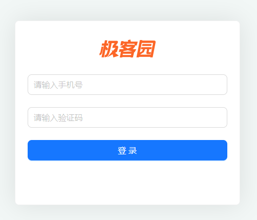

`Login/index.js`

```jsx
import './index.scss'
import { Card, Form, Input, Button } from 'antd'
import logo from '@/assets/logo.png'

const Login = () => {
  return (
    <div className="login">
      <Card className="login-container">
        
        {/* 登录表单 */}
        <Form>
          <Form.Item>
            <Input size="large" placeholder="请输入手机号" />
          </Form.Item>
          <Form.Item>
            <Input size="large" placeholder="请输入验证码" />
          </Form.Item>
          <Form.Item>
            <Button type="primary" size="large" htmlType="submit" block>
              登录
            </Button>
          </Form.Item>
        </Form>
      </Card>
    </div>
  )
}

export default Login
```

`Login/index.scss`

```scss
.login {
  width: 100%;
  height: 100%;
  position: absolute;
  left: 0;
  top: 0;
  background: center/cover url('~@/assets/login.png');

  .login-logo {
    width: 200px;
    height: 60px;
    display: block;
    margin: 0 auto 20px;
  }

  .login-container {
    width: 440px;
    height: 360px;
    position: absolute;
    left: 50%;
    top: 50%;
    transform: translate(-50%, -50%);
    box-shadow: 0 0 50px rgb(0 0 0 / 10%);
  }

  .login-checkbox-label {
    color: #1890ff;
  }
}
```

### 表单校验

在提交登录之前**校验用户的输入是否符合预期**，如果不符合就阻止提交并显示错误信息。

官网示例

```jsx
<Form.Item
  label="Username"
  name="username"
  rules={[
    {
      required: true,
      message: 'Please input your username!',
    },
  ]}>
  <Input />
</Form.Item>
```

需要为 `FormItem` 绑定 `name` 和 `rules` 两个属性。

据此，可以为我们的登录表单添加 **非空校验** 逻辑：

```jsx
<Form>
  <Form.Item
    name="phonenumber"
    rules={[
      {
        required: true,
        message: '请输入手机号！',
      },
    ]}
  >
    <Input size="large" placeholder="请输入手机号" />
  </Form.Item>
  <Form.Item
    name="captche"
    rules={[
      {
        required: true,
        message: '请输入验证码！',
      },
    ]}
  >
    <Input size="large" placeholder="请输入验证码" />
  </Form.Item>
</Form>
```

**高级校验：按照业务进行定制化修改**

1. 在**失焦**时校验，而非提交时
2. 校验手机号格式是否正确

**1、在失焦时做校验**

需要修改 Form 组件的 `validateTrigger` 属性

```jsx
<Form validateTrigger="onBlur">
...
</Form>
```

**2、校验手机号格式是否正确**

在 `rules` 属性中**继续添加手机号正则校验规则**。

校验步骤：根据 `rules` 指定的校验规则从前往后依次校验，如果遇到校验不通过的情况则停止校验。

```jsx
<Form.Item
    name="phonenumber"
    rules={[
      {
        required: true,
        message: '请输入手机号！',
      },
      {
        pattern: /^1[3-9]\d{9}$/,
        message: '手机号格式不正确！',
      },
    ]}
    >
  <Input size="large" placeholder="请输入手机号" />
</Form.Item>
```

### 获取表单数据

当用户输入了正确的表单内容，点击确认按钮时需要**收集到用户当前输入的内容**，用来提交接口请求。

```jsx
  // 表单数据会当作函数参数传给 onFinish 回调
  const onFinishForm = (values) => {
    console.log(values)
  }
  
  <Form onFinish={onFinishForm} validateTrigger="onBlur">
    ...
  </Form>
```

参考：[form - api](https://ant-design.antgroup.com/components/form-cn#api)

### 封装 request 请求模块

在整个项目中会发送很多网络请求，使用 axios 库做好统一封装，方便**统一管理和复用**。

```sh
npm i axios
```

`utils/request.js`

```js
// axios 封装处理，主要有三个内容：
// 1.֫根域名配置
// 2.超时时间
// 3.拦截器 - 请求/响应

import axios from 'axios'

const request = axios.create({
  baseURL: 'http://geek.itheima.net/v1_0',
  timeout: 5000,
})

// 添加请求拦截器：请求发送之前，可以插入自定义配置（比如参数处理）
request.interceptors.request.use(
  (config) => {
    return config
  },
  (error) => {
    return Promise.reject(error)
  }
)

// 添加响应拦截器：接收到响应后，可以插入处理数据的逻辑
request.interceptors.response.use(
  (rsp) => {
    // 对应 2xx 状态码类型响应
    // 此回调中可以写对响应数据的处理逻辑
    return rsp.data
  },
  (error) => {
    // 对应 非2xx 状态码类型响应
    // 此回调中可以写对错误响应的处理逻辑
    return Promise.reject(error)
  }
)

export { request }
```

将 request 对象 “中转导出” 到 `utils/index.js`，作为工具模块中的工具之一。之后直接从 `./utils` 中获取请求对象。

```js
import { request } from './request'

export { request }
```

### 使用 redux 管理 token

Token 作为一个用户标识数据，需要在很**多个模块中共享**，Redux 可以方便地解决状态共享问题。

步骤：

1. Redux 中编写获取 Token 的异步获取和同步修改
2. Login 组件负责提交 action 并且把表单数据传递过来

```sh
npm i react-redux @reduxjs/toolkit
```

`store/modules/user.js` 创建 store 子模块 —— user

```js
import { createSlice } from '@reduxjs/toolkit'

const userStore = createSlice({
  name: 'user',
  initialState: {
    token: '',
  },
  reducers: {
    setToken: (state, action) => {
      state.token = action.payload
    },
  },
})

const { setToken } = userStore.actions
export { setToken }

const userReducer = userStore.reducer
export default userReducer
```

`store/index.js` 创建根 store

```js
import { configureStore } from '@reduxjs/toolkit'
import userReducer from './modules/user'

const store = configureStore({
  reducer: {
    user: userReducer,
  },
})

export default store
```

`@/index.js` 使用 `<Provider />` 组件并传入根 store 对象。

```jsx
import React from 'react'
import ReactDOM from 'react-dom/client'
import './index.scss'
import { RouterProvider } from 'react-router-dom'
import router from './router'
import { Provider } from 'react-redux'
import store from './store'

const root = ReactDOM.createRoot(document.getElementById('root'))
root.render(
  <Provider store={store}>
    <RouterProvider router={router} />
  </Provider>
)
```

### 异步获取 token

[apifox.com 注册登录接口文档](https://apifox.com/apidoc/shared-fa9274ac-362e-4905-806b-6135df6aa90e/api-31967347)

`@/store/modules/user.js`  添加异步函数

```js
const { setToken } = userStore.actions

// 异步方法 完成登录 获取token
const fetchTokenByLogin = (loginForm) => {
  return async (dispatch) => {
    // 1. 发送异步请求
    const rsp = await request.post('/authorizations', loginForm)
    // 2. 提交同步 action 进行 token 存入
    dispatch(setToken(rsp.data.token))
  }
}
export { fetchTokenByLogin }
```

在提交表单时调用异步方法

```jsx
  const onFinishForm = (values) => {
    console.log(values)
    // 触发异步action 登录
    dispatch(fetchTokenByLogin(values))
  }
  
  <Form onFinish={onFinishForm} validateTrigger="onBlur">
    ...
  </Form>
```

登录，并查看结果：

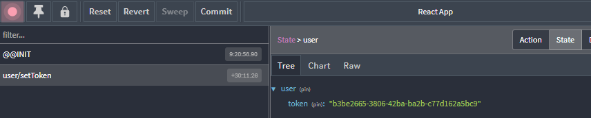

### 登录逻辑

续上一节。登录可能成功或失败，两种情况各自有不同的后续处理流程

- 登录成功时：提示登录成功 & 跳转首页
- 登录失败时：提示

示例

```jsx
  const onFinishForm = async (values) => {
    console.log(values)
    // 触发异步action 登录
    await dispatch(fetchTokenByLogin(values))
    //1.跳转到首页
    navigate('/')
    //2.提示
    message.success('登录成功')
  }
  
  ...
  
  <Form onFinish={onFinishForm} validateTrigger="onBlur">
    ...
  </Form>
```

### token 持久化

现存问题：刷新浏览器后 token 会丢失。因为 Redux 是**基于浏览器内存的存储方式**，刷新时状态恢复为初始值

token 持久化：防止浏览器刷新时丢失 token

---

技术方案：

- 刷新时：先判断 localStorage 中是否已存在，
  - 若存在则指定 `initialState` 为该值，并跳转到首页。
  - 如果不存在则指定 `initialState` 为空串并跳转到登录页。
- 登录时。如果登录成功则将 token 同时存入 redux 和 localStorage 中。

示例

```js
const userStore = createSlice({
  name: 'user',
  initialState: {
    // 1. 优先从 localStorage 中取
    token: localStorage.getItem('token_key') || '',
  },
  reducers: {
    setToken: (state, action) => {
      state.token = action.payload
      // 2. 在 localStorage 也存一份
      localStorage.setItem('token_key', action.payload)
    },
  },
})
```

### 封装 token 的存取删方法

对于 token 的各类操作在项目**多个模块中都有用到**，为了**共享复用**可以封装成工具函数。

思路：创建 `utils/token.js` ，在其中定义 `setToken/getToken/removeToken` 函数并导出

`utils/token.js`

```js
const tokenKey = 'token_key'

function setToken(token) {
  localStorage.setItem(tokenKey, token)
}
function getToken() {
  return localStorage.getItem(tokenKey)
}
function removeToken() {
  localStorage.removeItem(tokenKey)
}

export { setToken, getToken, removeToken }
```

`utils/index.js` 做中转导出

```js
import { request } from './request'
import { getToken, setToken, removeToken } from './token'

export { request, getToken, setToken, removeToken }
```

使用 `setToken/getToken/removeToken` 替换上一节中使用 localStorage 的地方

```js
import { setToken as _setToken, getToken } from '@/utils'

const userStore = createSlice({
  name: 'user',
  initialState: {
    // 1
    token: getToken() || '',
  },
  reducers: {
    setToken: (state, action) => {
      state.token = action.payload
      // 2
      _setToken(action.payload)
    },
  },
})
```

## 在 axios 请求拦截器注入 token

为啥要搞这个？

token 作为用户的标识数据，后端很多接口都会以它为接口权限判断的依据；请求拦截器注入 token 之后，所有用到 axios 实例的接口请求都自动携带了 token。

使用步骤

1. 在 axios 请求拦截器请求头中注入 token
2. 调用接口测试 token 是否成功携带

```js
request.interceptors.request.use(
  (config) => {
    // 注入 token，需要两步：
    // 1.获取token
    const token = getToken()
    // 2.注入token
    if (token) {
      config.headers.Authorization = `Bearer ${token}`
    }
    return config
  },
  (error) => {
    return Promise.reject(error)
  }
)
```

测试：在 `Layout/index.js` 中

```jsx
import { request } from '@/utils'
import { useEffect } from 'react'

const Layout = () => {
  useEffect(() => {
    request.get('/user/profile')
  })
  return <div>Layout</div>
}
export default Layout
```

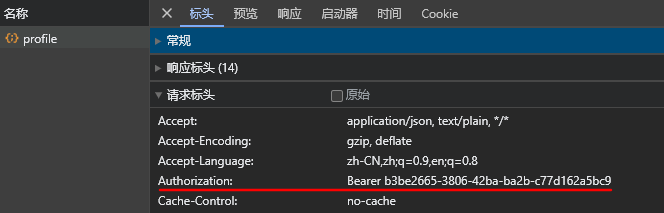

## 根据 token 控制路由跳转

有些路由页面内的内容信息比较敏感，如果用户没有经过登录获取到有效 Token，是没有权限跳转的，**根据 Token 的有无控制当前路由是否可以跳转**就是路由的权限控制。

技术方案：封装一个 “高阶组件”，传入 token 后进行判断然后返回不同的内容

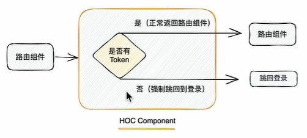

`@/components/AuthRoute.js`

```jsx
// 封装高级组件
// 核心逻辑：有token则正常跳转 无token则去登录

import { getToken } from '@/utils'
import { Navigate } from 'react-router-dom'

export function AuthRoute({ children }) {
  const token = getToken()
  if (token) {
    return <>{children}</>
  } else {
    // 强制跳转到登录页
    return <Navigate to="/login" />
  }
}
```

`@/router/index.js` 修改首页路由对应的组件

```jsx
const router = createBrowserRouter([
  {
    path: '/',
    element: (
      // 使用 AuthRoute 组件包裹需要授权的组件
      <AuthRoute>
        <Layout />
      </AuthRoute>
    ),
  },
  {
    path: '/login',
    element: <Login />,
  },
])
```

验证：无 token 时访问首页、有 token 时访问首页；分别观察两种情况是否会跳转登录页

## Layout

### 结构创建和样式 reset

Layout 结构搭建

`@/pages/Layout/index.js`

```jsx
import { Layout, Menu, Popconfirm } from 'antd'
import {
  HomeOutlined,
  DiffOutlined,
  EditOutlined,
  LogoutOutlined,
} from '@ant-design/icons'
import './index.scss'

const { Header, Sider } = Layout

const items = [
  {
    label: '首页',
    key: '1',
    icon: <HomeOutlined />,
  },
  {
    label: '文章管理',
    key: '2',
    icon: <DiffOutlined />,
  },
  {
    label: '创建文章',
    key: '3',
    icon: <EditOutlined />,
  },
]

const GeekLayout = () => {
  return (
    <Layout>
      <Header className="header">
        <div className="logo" />
        <div className="user-info">
          <span className="user-name">柴柴老师</span>
          <span className="user-logout">
            <Popconfirm title="是否确认退出？" okText="退出" cancelText="取消">
              <LogoutOutlined /> 退出
            </Popconfirm>
          </span>
        </div>
      </Header>
      <Layout>
        <Sider width={200} className="site-layout-background">
          <Menu
            mode="inline"
            theme="dark"
            defaultSelectedKeys={['1']}
            items={items}
            style={{ height: '100%', borderRight: 0 }}></Menu>
        </Sider>
        <Layout className="layout-content" style={{ padding: 20 }}>
          内容
        </Layout>
      </Layout>
    </Layout>
  )
}

export default GeekLayout
```

`@/pages/Layout/index.scss`

```scss
.ant-layout {
  height: 100%;
}

.header {
  padding: 0;
}

.logo {
  width: 200px;
  height: 60px;
  background: url('~@/assets/logo.png') no-repeat center / 160px auto;
}

.layout-content {
  overflow-y: auto;
}

.user-info {
  position: absolute;
  right: 0;
  top: 0;
  padding-right: 20px;
  color: #fff;
  
  .user-name {
    margin-right: 20px;
  }
  
  .user-logout {
    display: inline-block;
    cursor: pointer;
  }
}
.ant-layout-header {
  padding: 0 !important;
}
```

**样式 reset**

```sh
npm i normalize.css
```

在 `@/index.js` 中引入

```js
import 'normalize.css'
```

**使 Layout 页面占据 100% 高度**

`@/index.scss`

```css
html,
body {
  margin: 0;
  height: 100%;
}

#root {
  height: 100%;
}
```

结果：

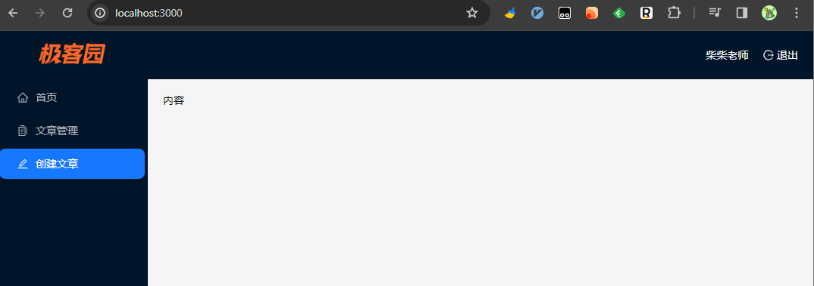

### 二级路由配置

路由结构

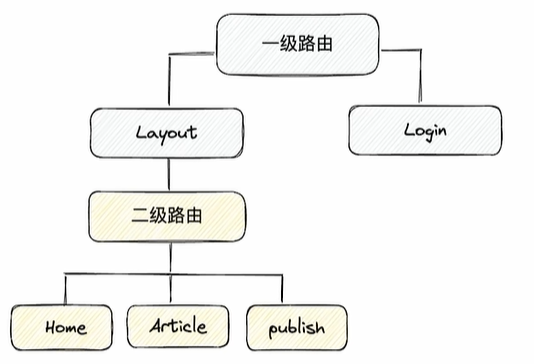

实现步骤：

1. 新增三个二级路由组件，然后在路由组件中进行配置
2. 在 Layout 组件中配置二级路由出口

创建 Home 组件：`@/pages/Home/index.js`

```jsx
const Home = () => {
  return <div>Home</div>
}

export default Home
```

其余两个组件同理。。。

在路由组件中配置上边创建的三个二级路由，部分代码：

```jsx
  {
    path: '/',
    element: (<AuthRoute><Layout /> </AuthRoute>),
    children: [
      {
        //path: 'home',
        index: true,
        element: <Home />,
      },
      {
        path: 'article',
        element: <Article />,
      },
      {
        path: 'publishArticle',
        element: <PublishArticle />,
      },
    ],
  },
```

在 Layout 组件中配置二级路由出口

```jsx
import { Outlet } from 'react-router-dom'

...

<Layout className="layout-content" style={{ padding: 20 }}>
  <Outlet />
</Layout>
```

验证：分别访问 `/` 、`/article` 、`/publishArticle` ，查看页面变化

### 点击菜单跳转路由

想要实现的效果：点击左侧菜单可以跳转到对应的路由组件

分析：

1. 左侧菜单要和路由形成**一一对应**的关系（知道点了哪个菜单项）
2. 点击时拿到路由**路径**，然后调用**路由方法进行跳转**（跳转到对应的路由下面）

步骤：

1. 为菜单参数 `item` （表示菜单项数据）中的每一项添加 key 属性，指定属性值为对应路由的路径地址
2. 点击菜单时通过 key 获取路由地址进行跳转

`@/pages/Layout/index.js`

```jsx
import { useNavigate } from 'react-router-dom'

// 菜单配置
const items = [
  {
    label: '首页',
    key: '/',
    icon: <HomeOutlined />,
  },
  {
    label: '文章管理',
    key: '/article',
    icon: <DiffOutlined />,
  },
  {
    label: '创建文章',
    key: '/publishArticle',
    icon: <EditOutlined />,
  },
]

...

  const navigate = useNavigate()
  // 点击钩子函数
  const clickMenuItem = (route) => {
    navigate(route.key)
  }

...

  <Menu
    mode="inline"
    theme="dark"
    defaultSelectedKeys={['1']}
    items={items}
    onClick={clickMenuItem}
    style={{ height: '100%', borderRight: 0 }}
  ></Menu>
```

### 根据当前路由的路径高亮菜单

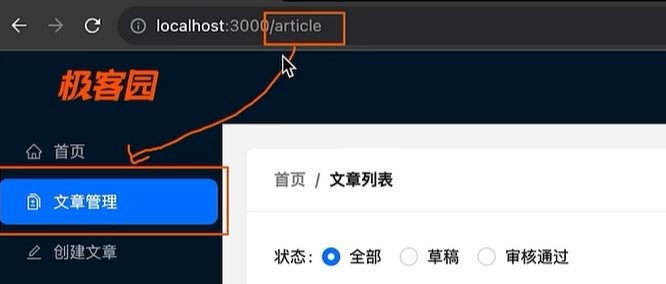

思路：

1. 获取当前 `url` 上的路由路径
2. 找到菜单组件负责高亮的属性，**绑定**当前的路由路径

示例代码：

```jsx
  import { useLocation, useNavigate, Outlet } from 'react-router-dom'

  ...
 
  // 使用 useLocation 钩子获取当前路径（动态变化的）
  const location = useLocation()
  const selectedPath = location.pathname
  
  ...
  
  <Menu
    mode="inline"
    theme="dark"
    selectedKeys={selectedPath}
    items={items}
    onClick={clickMenuItem}
    style={{ height: '100%', borderRight: 0 }}
  ></Menu>
```

### 展示个人信息

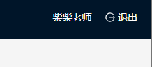

问题：上图中显示的用户信息应该在哪里维护？

和 Token 令牌类似，用户的信息通常很有可能在多个组件中都需要**共享使用**，所以同样应该放到 **Redux 中维护**

实现步骤：

1. 使用 Redux 进行管理
2. 创建异步获取用户信息的 actionCreator，并在 Layout 组件中提交 action

示例代码

`@/store/modules/user.js`

```js
const userStore = createSlice({
  name: 'user',
  initialState: {
    // 优先从 localStorage 中取
    token: getToken() || '',
    // 用户信息
    userInfo: {},
  },
  reducers: {
    ...
    setUserInfo: (state, action) => {
      state.userInfo = action.payload
    },
  },
})

const {  setUserInfo } = userStore.actions

// 异步方法 获取用户信息
const fetchUserInfo = () => {
  return async (dispatch) => {
    // 1. 发送异步请求
    const rsp = await request.get('/user/profile')
    // 2. 提交同步 action 进行 userInfo 存入
    dispatch(setUserInfo(rsp.data))
  }
}

export {  fetchUserInfo }
```

`@/pages/Layout/index.js`

```jsx
import { useDispatch, useSelector } from 'react-redux'
import { useEffect } from 'react'

...

  // 获取 redux 中用户信息中的名字
  const username = useSelector((state) => state.user.userInfo.name)
  // 获取用户信息
  const dispatch = useDispatch()
  useEffect(() => {
    dispatch(fetchUserInfo())
  }, [dispatch])

  return (
    <Layout>
      <Header className="header">
        <div className="logo" />
        <div className="user-info">
          <span className="user-name">{username}</span>
            ...
```

### 退出登录

退出登录是一个通用的业务逻辑，都需要做什么呢？

1. 提示用户是否确认要退出（危险操作，需进行二次确认）
2. 用户确认之后清除用户信息（Token、用户信息等）
3. 跳转到登录页

`@/store/modules/user.js`

```js
const userStore = createSlice({
  name: 'user',
  initialState: {
    // 优先从 localStorage 中取
    token: getToken() || '',
    // 用户信息
    userInfo: {},
  },
  reducers: {
    ...
    clearUserInfo: (state) => {
      state.userInfo = {}
      state.token = ''
      removeToken()
    },
  },
})
```

`@/pages/Layout/index.js`

```jsx
  const onConfirmLogout = () => {
    // 清除用户信息
    dispatch(clearUserInfo())
    // 跳转到首页
    navigate('/login')
  }

// antd 提供的 弹出确认框
<Popconfirm
  title="是否确认退出？"
  onConfirm={onConfirmLogout}
  okText="退出"
  cancelText="取消">
  <LogoutOutlined /> 退出
</Popconfirm>
```

### 处理 token 失效

什么是 token 失效？

为了用户的安全和隐私考虑，在用户**长时间未在网站中做任何操作**且**规定的失效时间到达**之后，当前的 token 就会失效，一旦失效就不能再作为用户令牌表示请求隐私数据。

前端如何知道 Token 已经失效了？

通常在 token 失效之后再去请求接口，后端会返回 **401 状态码**，前端可以监控这个状态做后续的操作。

步骤：在 axios 拦截响应，判断状态码是否为 401。如果是，则清除失效 token，并跳转到登录页面。

```js
request.interceptors.response.use(
  (rsp) => {
    return rsp.data
  },
  (error) => {
    // 401 状态码，表示未授权，需要重新登录
    if (error.response.status === 401) {
      // 1.清除 token
      removeToken()
      // 2.跳转到登录页面
      router.navigate('/login')
    }
    return Promise.reject(error)
  }
)
```

可能在页面上显示异常信息，处理：在 `@/store/modules/user.js` 中修改 `fetchUserInfo` 函数，使用原生的 Promise.then.catch 处理请求

```js
const fetchUserInfo = () => {
  return (dispatch) => {
    // 1. 发送异步请求
    request
      .get('/user/profile')
      .then((rsp) => {
        // 2. 提交同步 action 进行 userInfo 存入
        dispatch(setUserInfo(rsp.data))
      })
      .catch((err) => {
        console.log('获取 user profile 失败', err)
      })
  }
}
```

## Home

### Echarts 基础图表实现

内容：在项目中引入第三方图表插件

1. 按照第三方插件文档中的 “快速开始”，快速跑起来 Demo
2. 按照业务需求修改配置项做定制处理

[快速上手 echarts](https://echarts.apache.org/handbook/zh/get-started/)

```sh
npm i echarts
```

`@/pages/Home/index.js`

```jsx
import * as echarts from 'echarts'
import { useEffect, useRef } from 'react'

const Home = () => {
  // 通过 useRef 获取 dom
  const chartContainer = useRef(null)
  // 通过 useEffect 初始化柱状图
  useEffect(() => {
    //1.获取渲染图表的dom节点
    var chartDom = chartContainer.current
    //2.初始化生成图表实例对象
    var myChart = echarts.init(chartDom)
    //3.准备图表参数
    var option = {
      xAxis: {
        type: 'category',
        data: ['Vue', 'React', 'Angular'],
      },
      yAxis: {
        type: 'value',
      },
      series: [
        {
          data: [120, 200, 150],
          type: 'bar',
        },
      ],
    }
    //4.使用图表参数完成图表的渲染
    option && myChart.setOption(option)
  }, [])
  return (
    <div>
      {/* 需要为柱状图容器设置宽高 */}
      <div
        style={{ width: '500px', height: '400px' }}
        ref={chartContainer}
      ></div>
    </div>
  )
}

export default Home
```

### Echarts 组件封装

上一小节的柱状图可能需要用在多个地方，为了使代码更简洁和容易维护，可以将 “柱状图” 封装在一个单独的组件中。

创建 BarChart 组件：`@/pages/Home/components/BarChart/index.js`

```jsx
import * as echarts from 'echarts'
import { useEffect, useRef } from 'react'

// 使用 prop 参数来控制变化的内容
const BarChart = ({ title }) => {
  // 通过 useRef 获取 dom
  const chartContainer = useRef(null)
  // 通过 useEffect 初始化柱状图
  useEffect(() => {
    //1.获取渲染图表的dom节点
    var chartDom = chartContainer.current
    //2.初始化生成图表实例对象
    var myChart = echarts.init(chartDom)
    //3.准备图表参数
    var option = {
      title: {
        text: title,
      },
      xAxis: {
        type: 'category',
        data: ['Vue', 'React', 'Angular'],
      },
      yAxis: {
        type: 'value',
      },
      series: [
        {
          data: [120, 200, 150],
          type: 'bar',
        },
      ],
    }
    //4.使用图表参数完成图表的渲染
    option && myChart.setOption(option)
  }, [])
  return (
    <div>
      <div
        style={{ width: '500px', height: '400px' }}
        ref={chartContainer}
        id="main"
      ></div>
    </div>
  )
}

export default BarChart
```

在 `@/pages/Home/index.js` 中使用 ”柱状图“ 组件

```jsx
import BarChart from './components/BarChart'

const Home = () => {
  return (
    <div>
      <BarChart title="2023前端框架受欢迎程度" />
    </div>
  )
}

export default Home
```

## 扩展-API模块封装

现存问题：当前的接口请求放到了功能实现的位置，没有在固定的模块内维护，后期查找维护困难

解决思路：把项目中的所有接口按照业务模块分类，**以函数的形式**统一封装到 apis 模块中

```
apis/
  - user.js（存放用户相关请求函数）
  - article.js
  - ...
```

示例：将之前的登录接口和获取用户信息接口放在 `@/apis/user.js` 中

```js
import { request } from '@/utils'

// 名字+固定内容 表明他是一个api函数
export function loginAPI(loginFrom) {
  return request({
    url: '/authorizations',
    method: 'POST',
    data: loginFrom,
  })
}

export function getUserInfoAPI() {
  return request({
    url: '/user/profile',
    method: 'GET',
  })
}
```

使用上边的 api

```js
const fetchTokenByLogin = (loginForm) => {
  return async (dispatch) => {
    // 使用
    const rsp = await loginAPI(loginForm)
    dispatch(setToken(rsp.data.token))
  }
}
```

TODO：验证是否生效

## 文章发布

### 功能介绍

页面内容

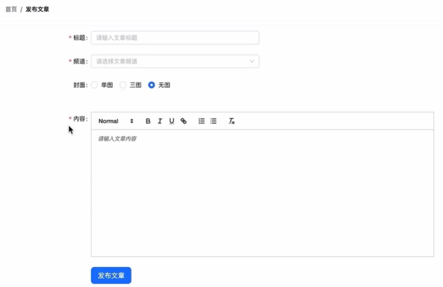

实现步骤：

1. 实现基础文章发布功能
2. 实现封面上传功能
3. 实现带封面的文章

### 准备基础结构

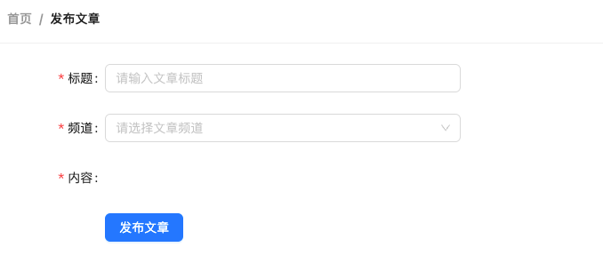

`@/pages/PublishArticle/index.js`

```jsx
import {
  Card,
  Breadcrumb,
  Form,
  Button,
  Radio,
  Input,
  Upload,
  Space,
  Select
} from 'antd'
import { PlusOutlined } from '@ant-design/icons'
import { Link } from 'react-router-dom'
import './index.scss'

const { Option } = Select

const Publish = () => {
  return (
    <div className="publish">
      <Card
        title={
          <Breadcrumb items={[
            { title: <Link to={'/'}>首页</Link> },
            { title: '发布文章' },
          ]}
          />
        }
      >
        <Form
          labelCol={{ span: 4 }}
          wrapperCol={{ span: 16 }}
          initialValues={{ type: 1 }}
        >
          <Form.Item
            label="标题"
            name="title"
            rules={[{ required: true, message: '请输入文章标题' }]}
          >
            <Input placeholder="请输入文章标题" style={{ width: 400 }} />
          </Form.Item>
          <Form.Item
            label="频道"
            name="channel_id"
            rules={[{ required: true, message: '请选择文章频道' }]}
          >
            <Select placeholder="请选择文章频道" style={{ width: 400 }}>
              <Option value={0}>推荐</Option>
            </Select>
          </Form.Item>
          <Form.Item
            label="内容"
            name="content"
            rules={[{ required: true, message: '请输入文章内容' }]}
          ></Form.Item>

          <Form.Item wrapperCol={{ offset: 4 }}>
            <Space>
              <Button size="large" type="primary" htmlType="submit">
                发布文章
              </Button>
            </Space>
          </Form.Item>
        </Form>
      </Card>
    </div>
  )
}

export default Publish
```

`index.scss`

```scss
.publish {
  position: relative;
}

.ant-upload-list {
  .ant-upload-list-picture-card-container,
  .ant-upload-select {
    width: 146px;
    height: 146px;
  }
}
```

### 准备富文本编辑器

步骤：

1. 安装 `react-quill` 富文本编辑器：`npm i react-quill@2.0.0-beta.2`
2. 导入编辑器组件和配套样式组件
3. 渲染编辑器组件
4. 调整编辑器组件样式

**1、安装**

```sh
npm i react-quill@2.0.0-beta.2 --legacy-peer-deps
```

**2 & 3、导入编辑器组件和配套样式**

```js
import ReactQuill from 'react-quill'
import 'react-quill/dist/quill.snow.css'

...

<ReactQuill
  className="publish-quill"
  theme="snow"
  placeholder="请输入文章内容"
/>
```

**4、调整编辑器组件样式**

```scss
.publish-quill {
  .ql-editor {
    min-height: 300px;
  }
}
```

结果：

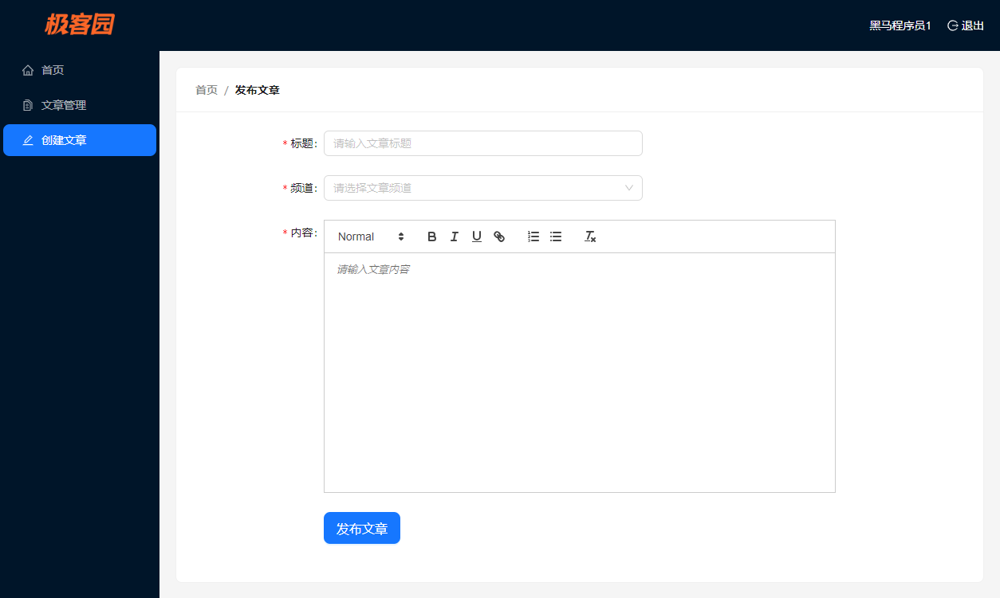

### 频道数据获取与渲染

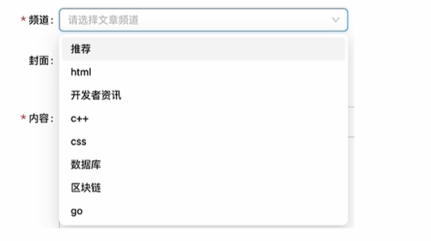

步骤：

1. 根据接口文档在 APIS 模块中封装接口函数
2. 使用 **useState** 维护数据（页面级数据）
3. 在 **useEffect** 中调用接口获取数据并存入 state
4. 绑定数据到下拉框组件中

`@/apis/article.js`

```js
import { request } from '@/utils'

// 获取所有频道
export function getChannelsAPI() {
  return request({
    url: '/channels',
    method: 'get',
  })
}
```

使用

```jsx
const [channelList, setChannelList] = useState([])
useEffect(() => {
    const fetchChannels = async () => {
      const rsp = await getChannelsAPI()
      setChannelList(rsp.data.channels)
    }
    fetchChannels()
    console.log('channelList', channelList)
}, [])

...

<Select placeholder="请选择文章频道" style={{ width: 400 }}>
  {channelList.map((item) => (
    <Option key={item.id} value={item.id}>
      {item.name}
    </Option>
  ))}
</Select>
```

### 收集表单数据 & 提交表单

步骤：

1. 使用 Form 组件收集表单数据
2. 按照接口文档封装接口函数
3. 按照接口文档处理表单数据
4. 提交接口并验证是否成功

**1、收集表单数据**

```jsx
const onFinishForm = (formData) => {
  console.log('formData', formData)
}

...
  
<Form onFinish={onFinishForm}>
...
</Form>
```

**2、封装接口函数**

接口描述：<https://apifox.com/apidoc/shared-fa9274ac-362e-4905-806b-6135df6aa90e/api-32107341>

```js
import { createArticleAPI } from '@/apis/article'

const onFinishForm = (formData) => {
    console.log('formData', formData)
    //1.按照接口文档格式处理收集到的表单数据
    const { title, content, channel_id } = formData
    const articleData = {
      title,
      content,
      cover: {
        type: 0,
        images: [],
      },
      channel_id,
    }
    //2.调用接口进行提交
    createArticleAPI(articleData)
}
```

测试

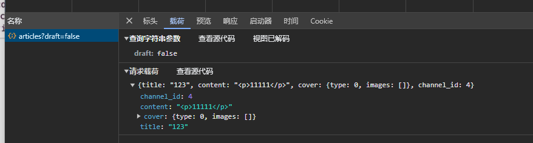

## 文章封面

### 准备初始结构

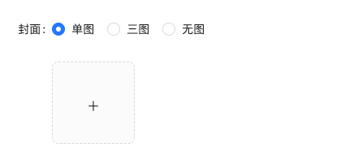

将封面上传区代码放在 频道选项与富文本框之间

```jsx
<Form.Item label="封面">
  <Form.Item name="type">
    <Radio.Group>
      <Radio value={0}>无图</Radio>
      <Radio value={1}>单图</Radio>
      <Radio value={3}>三图</Radio>
    </Radio.Group>
  </Form.Item>
  <Upload
    listType="picture-card"
    showUploadList
  >
    <div style={{ marginTop: 8 }}>
      <PlusOutlined />
    </div>
  </Upload>
</Form.Item>
```

### 基础上传实现

步骤：

1. 为 Upload 组件添加 action 属性，配置[封面图片上传接口地址](https://apifox.com/apidoc/shared-fa9274ac-362e-4905-806b-6135df6aa90e/api-32138020)
2. 为 Upload 组件添加 name 属性，指定其为接口要求的字段名
3. 为 Upload 组件添加 onChange 属性，在事件中拿到当前图片数据，并存储到 React 状态中

示例代码

```jsx
  // 上传图片的数据
  const [imageList, setImageList] = useState([])
  const onUploadChange = (info) => {
    console.log('文件上传中...', info)
    setImageList(info.fileList)
  }
  
  ...
  
// name=image 表示文件对象对应的参数名为image
// action 图片上传地址
<Upload
  name="image"
  action={'http://geek.itheima.net/v1_0/upload'}
  listType="picture-card"
  onChange={onUploadChange}
  showUploadList>
    <div style={{ marginTop: 8 }}>
      <PlusOutlined />
    </div>
</Upload>
```

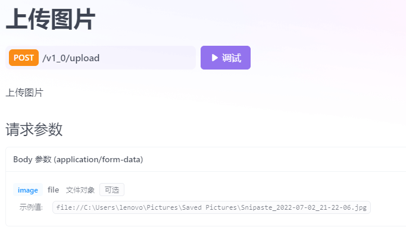

### 切换封面类型

需求：点击无图时隐藏图片上传组件，点击单图或三图时显示上传组件

步骤：

1. 维护一个表示图片上传类型的状态，基于条件渲染做上传组件的动态渲染
2. 根据上传类型的切换进行状态的修改

示例代码：

```jsx
  // 上传图片类型
  const [imageType, setImageType] = useState(0)
  
return (
    ...
    <Form
    onFinish={onFinishForm}
    labelCol={{ span: 4 }}
    wrapperCol={{ span: 16 }}
    initialValues={{ type: 0 }}>
        
   <Form.Item label="封面">
       
        <Form.Item name="type">
          <Radio.Group
            onChange={(e) => {
              console.log('封面图上传模式', e.target.value)
              setImageType(e.target.value)
            }}>
            <Radio value={0}>无图</Radio>
            <Radio value={1}>单图</Radio>
            <Radio value={3}>三图</Radio>
          </Radio.Group>
        </Form.Item>
    
        {imageType > 0 && (
          <Upload
            name="image"
            action={'http://geek.itheima.net/v1_0/upload'}
            listType="picture-card"
            onChange={onUploadChange}
            showUploadList
          >
            <div style={{ marginTop: 8 }}>
              <PlusOutlined />
            </div>
          </Upload>
        )}
       
      </Form.Item>
</Form>)
```

注意：`Form` 组件的 `initialValues` 属性用来设置组件的初始值，二者通过 initialValues 的 key 和 组件的 name 属性值进行映射。

### 控制上传图片的数量

需求：

1. 单图模式下，最多只能上传一张图片
2. 三图模式下，最多能上传三张图片

实现步骤

1. 找到显示上传数量的组件属性
2. 使用 `imageType` 进行绑定控制

示例：基于 Upload 组件的 maxCount 属性进行数量的控制

```jsx
    {imageType > 0 && (
      <Upload
        name="image"
        action={'http://geek.itheima.net/v1_0/upload'}
        listType="picture-card"
        onChange={onUploadChange}
        showUploadList
        maxCount={imageType}
        multiple={imageType > 1}
      >
        <div style={{ marginTop: 8 }}>
          <PlusOutlined />
        </div>
      </Upload>
```

### 提交带封面的表单

[接口参数](https://apifox.com/apidoc/shared-fa9274ac-362e-4905-806b-6135df6aa90e/api-32107341)

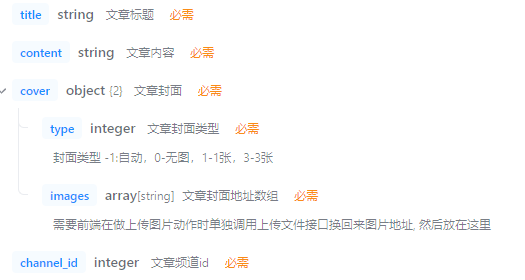

示例

```jsx
  const onFinishForm = (formData) => {
    console.log('formData', formData)
    const { title, content, channel_id } = formData
    //校验上传类型是否和 imageList.size 是否相等
    if (imageType !== imageList.length) {
      message.warning('封面类型与图片数量不匹配')
    }
    const articleData = {
      title,
      content,
      cover: {
        type: imageType, // 封面模式
        images: imageList.map((item) => item.response.data.url), // 图片列表
      },
      channel_id,
    }
    createArticleAPI(articleData)
  }
```

结果：

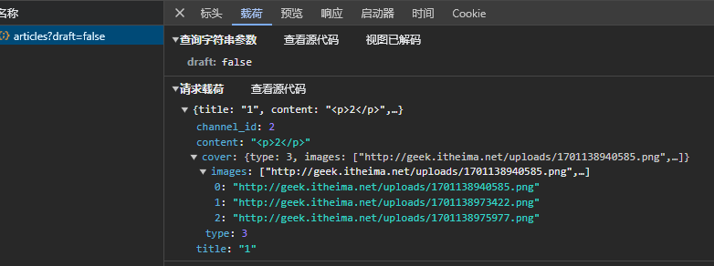

## 文章列表

### 功能描述与结构准备

**筛选区域**

```jsx
import { Link } from 'react-router-dom'
import { Card, Breadcrumb, Form, Button, Radio, DatePicker, Select } from 'antd'
// 引入汉化包，让时间选择器显示中文
import locale from 'antd/es/date-picker/locale/zh_CN'

const { Option } = Select
const { RangePicker } = DatePicker

const Article = () => {
  return (
    <div>
      <Card
        title={
          <Breadcrumb items={[
            { title: <Link to={'/'}>首页</Link> },
            { title: '文章列表' },
          ]} />
        }
        style={{ marginBottom: 20 }}
      >
        <Form initialValues={{ status: '' }}>
          <Form.Item label="状态" name="status">
            <Radio.Group>
              <Radio value={''}>全部</Radio>
              <Radio value={0}>草稿</Radio>
              <Radio value={2}>审核通过</Radio>
            </Radio.Group>
          </Form.Item>

          <Form.Item label="频道" name="channel_id">
            <Select
              placeholder="请选择文章频道"
              defaultValue="lucy"
              style={{ width: 120 }}
            >
              <Option value="jack">Jack</Option>
              <Option value="lucy">Lucy</Option>
            </Select>
          </Form.Item>

          <Form.Item label="日期" name="date">
            {/* 传入locale属性 控制中文显示*/}
            <RangePicker locale={locale}></RangePicker>
          </Form.Item>

          <Form.Item>
            <Button type="primary" htmlType="submit" style={{ marginLeft: 40 }}>
              筛选
            </Button>
          </Form.Item>
        </Form>
      </Card>
    </div>
  )
}

export default Article
```

**列表区域**

```jsx
// 导入资源
import { Table, Tag, Space } from 'antd'
import { EditOutlined, DeleteOutlined } from '@ant-design/icons'
import img404 from '@/assets/error.png'

const Article = () => {
  // 准备列数据
  const columns = [
    {
      title: '封面',
      dataIndex: 'cover',
      width: 120,
      render: cover => {
        return 
      }
    },
    {
      title: '标题',
      dataIndex: 'title',
      width: 220
    },
    {
      title: '状态',
      dataIndex: 'status',
      render: data => <Tag color="green">审核通过</Tag>
    },
    {
      title: '发布时间',
      dataIndex: 'pubdate'
    },
    {
      title: '阅读数',
      dataIndex: 'read_count'
    },
    {
      title: '评论数',
      dataIndex: 'comment_count'
    },
    {
      title: '点赞数',
      dataIndex: 'like_count'
    },
    {
      title: '操作',
      render: data => {
        return (
          <Space size="middle">
            <Button type="primary" shape="circle" icon={<EditOutlined />} />
            <Button
              type="primary"
              danger
              shape="circle"
              icon={<DeleteOutlined />}
            />
          </Space>
        )
      }
    }
  ]
  // 准备表格body数据
  const data = [
    {
      id: '8218',
      comment_count: 0,
      cover: {
        images: [],
      },
      like_count: 0,
      pubdate: '2019-03-11 09:00:00',
      read_count: 2,
      status: 2,
      title: 'wkwebview离线化加载h5资源解决方案'
    }
  ]
  
  return (
    <div>
      {/* ..... */}
      {/* 列表区 */}
      <Card title={`根据筛选条件共查询到 count 条结果：`}>
        <Table rowKey="id" columns={columns} dataSource={data} />
      </Card>
    </div>
  )
}
```

### 频道列表渲染 - 自定义 hook 获取数据

可选的方案：

1. 在 `@/pages/Article/index.js` 中重写一遍（之前在 `@/pages/PublishArticle/index.js` 中写过一遍）
2. 在 redux 中全局维护
3. 自定义 hook

自定义 hook 步骤：

1. 创建一个 `use` 打头的函数
2. 在函数中封装业务逻辑，并 return 出组件中要用到的状态数据
3. 在组件中导入 hook 执行，解构出状态数据以使用

创建 hook：`@/hooks/useChannel.js`

```jsx
// 封装获取频道列表的逻辑

import { useState, useEffect } from 'react'
import { getChannelsAPI } from '@/apis/article'

const useChannel = () => {
  const [channelList, setChannelList] = useState([])
  useEffect(() => {
    const fetchChannels = async () => {
      const rsp = await getChannelsAPI()
      setChannelList(rsp.data.channels)
    }
    fetchChannels()
    console.log('channelList', channelList)
  }, [])
  return channelList
}

export { useChannel }
```

使用 hook 示例

```jsx
// 获取列表数据
const { channelList } = useChannel()
  
return (...
 <Form.Item label="频道" name="channel_id">
    <Select
      placeholder="请选择文章频道"
      defaultValue="lucy"
      style={{ width: 120 }}>
          {channelList.map((item) => (
            <Option key={item.id} value={item.id}>
              {item.name}
            </Option>
          ))}
    </Select>
  </Form.Item>)
```

### 渲染 table 文章列表

实现步骤：

1. 基于接口文档封装请求接口
2. 使用 useState 维护状态数据
3. 使用 useEffect 发送请求
4. 在组件身上绑定对应属性完成渲染

示例代码：

**1、封装请求**

```js
// 获取文章列表
export function getArticlesAPI(params) {
  return request({
    url: '/mp/articles',
    method: 'GET',
    params,
  })
}
```

**2 && 3**

```jsx
  // 文章列表状态
  const [articles, setArticles] = useState([])
  const [articleCount, setArticleCount] = useState(0)
  useEffect(() => {
    const fetchArticles = async () => {
      const rsp = await getArticlesAPI()
      setArticles(rsp.data.results)
      setArticleCount(rsp.data.total_count)
    }
    fetchArticles()
  }, [])
```

**4、渲染数据**

```jsx
  <Card title={`根据筛选条件共查询到 ${articleCount} 条结果：`}>
    <Table rowKey="id" columns={columns} dataSource={articles} />
  </Card>
```

### 适配文章状态

效果：根据文章的不同状态在状态列显示不同的 Tag

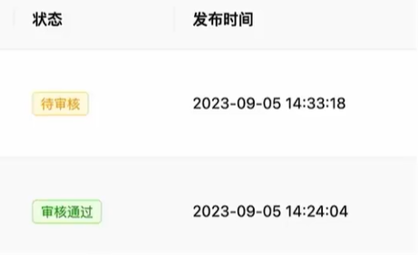

实现思路：

1. 如果要适配的状态有两个：三元条件渲染
2. 如果要适配的状态有多个：枚举渲染

修改表格的列配置：`@/pages/Article/index.js`

示例一：三元条件方案

```jsx
    {
      title: '状态',
      dataIndex: 'status',
      render: (data) =>
        data === 1 ? (
          <Tag color="warning">待审核</Tag>
        ) : (
          <Tag color="green">审核通过</Tag>
        ),
    },
```

示例二：枚举方案

```jsx
const articleStates = {
  1: <Tag color="warning">待审核</Tag>,
  2: <Tag color="green">审核通过</Tag>,
}

...

{
  title: '状态',
  dataIndex: 'status',
  render: (data) => articleStates[data],
},
```

### 筛选功能实现

实现步骤：

1. 根据[接口文档](https://apifox.com/apidoc/shared-fa9274ac-362e-4905-806b-6135df6aa90e/api-32098726)准备完整的请求参数对象
2. 获取用户选择的表单数据
3. 把表单数据放置到接口对应的字段中
4. 重新调用文章列表接口渲染 Table 列表

接口文档：

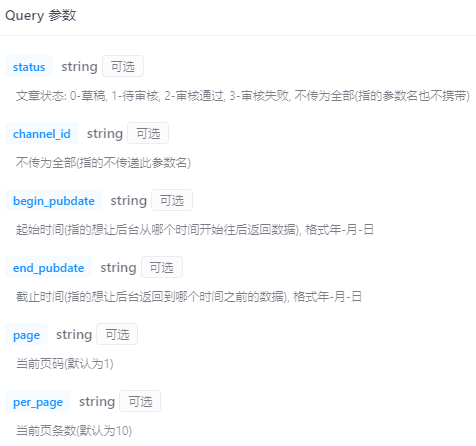

 示例代码：

```jsx
  //1.
  const [reqData, setReqData] = useState({
    page: 1,
    per_page: 4,
  })
  
  useEffect(() => {
    const fetchArticles = async () => {
      const rsp = await getArticlesAPI(reqData)
      setArticles(rsp.data.results)
      setArticleCount(rsp.data.total_count)
    }
    fetchArticles()
  }, [reqData]) // 3.依赖【请求参数】，react 自动发送请求

  //2.
  const onFinishForm = (formData) => {
    console.log(formData)
    setReqData(rebuildState(formData, reqData))
  }
  //3.
  const rebuildState = (formDate, reqData) => {
    const newData = {}
    console.log('formData', formDate)
    newData.channel_id = formDate.channel_id
    newData.status = formDate.status
    newData.page = reqData.page
    newData.per_page = reqData.per_page
    if (formDate.date) {
      newData.begin_pubdate = formDate.date[0].format('YYYY-MM-DD')
      newData.end_pubdate = formDate.date[1].format('YYYY-MM-DD')
    }
    return newData
  }
```

### 分页功能

实现步骤：

1. 获取 总数和每页条数，利用分页组件进行展示
2. 点击分页拿到当前点击的页数
3. 使用页数作为请求参数重新获取文件列表渲染

```jsx
<Table
  rowKey="id"
  columns={columns}
  dataSource={articles}
  pagination={{
    total: articleCount,
    pageSize: reqData.per_page,
  }}
  onChange={(params) => {
    setReqData({
      ...reqData,
      page: params.current, // 选择的页码
    })
  }}
/>
```

### 文章删除功能

 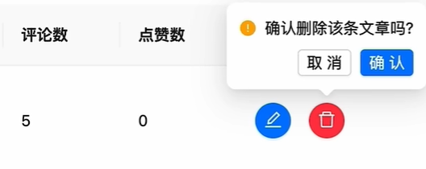

实现步骤：

1. 点击删除后弹出确认框
2. 获取文章 id，调用接口删除文章
3. 更新文章列表

示例代码：

```jsx
  const onRecordDeleteConfirm = async (data) => {
    console.log('delete confirm', data)
    await deleteArticleAPI(data.id) // 调用 api
    setReqData({ ...reqData })
  }
  
  ...
  
{
  title: '操作',
  render: (data) => {
    return (
      <Space size="middle">
        <Button type="primary" shape="circle" icon={<EditOutlined />} />
        <Popconfirm
          title="确定删除吗？"
          description="删除后不可恢复哦"
          onConfirm={() => onRecordDeleteConfirm(data)}
          okText="Yes"
          cancelText="No"
        >
          <Button
            type="primary"
            danger
            shape="circle"
            icon={<DeleteOutlined />}
          />
        </Popconfirm>
      </Space>
    )
  },
},
```

添加 api

```js
// 删除文章
export function deleteArticleAPI(id) {
  return request({
    url: `/mp/articles/${id}`,
    method: 'delete',
  })
}
```

### 编辑文章跳转

效果：点击编辑按钮后跳转到文章编辑页

实现步骤：

1. 获取当前文章 `id`
2. 跳转到创建文章的路由

示例代码

```jsx
const navigate = useNavigate()

(<Button
  type="primary"
  shape="circle"
  icon={<EditOutlined />}
  onClick={() => navigate(`/publishArticle?id=${data.id}`)}
/>)
```

## 文章编辑

### 回填文章内容

步骤：

1. 通过文章 id 获取对应文章记录
2. 调用 Form 组件实例方法 `setFieldsValue` 回显数据

```jsx
  // 创建表单实例
  const [form] = Form.useForm()
  // 回填数据
  const [searchParams] = useSearchParams()
  const articleId = searchParams.get('id')
  useEffect(() => {
    //1.通过id获取数据
    const fetchArticleById = async () => {
      const rsp = await getArticleByIdAPI(articleId)
      form.setFieldsValue(rsp.data)
    }
    fetchArticleById()
    //2.调用方法完成回填
  }, [articleId, form])

...

// 通过form属性绑定 Form 实例
(<Form
  form={form}
  onFinish={onFinishForm}
  labelCol={{ span: 4 }}
  wrapperCol={{ span: 16 }}
  initialValues={{ type: 0 }}>
    ...
</Form>)
```

### 回填封面

效果：回填封面类型以及上传过的封面图片

如何实现：

1. 使用 `cover` 中的 `type` 字段回填封面类型
2. 使用 `cover` 中的 `images` 字段回填封面图片

示例代码：

```jsx
  // 获取表单实例
  const [form] = Form.useForm()
  // 回填数据
  const [searchParams] = useSearchParams()
  const articleId = searchParams.get('id')
  useEffect(() => {
    //1.通过id获取数据
    const fetchArticleById = async () => {
      const rsp = await getArticleByIdAPI(articleId)
      const data = rsp.data
      const { type, images } = data.cover    
      //2.调用方法完成回填
      setImageList(
        images.map((url) => {
          return { url }
        })
      )
      setImageType(type)
      form.setFieldsValue({
        ...data,
        type,
      })
    }
    if (articleId) {
      fetchArticleById()
    }
  }, [articleId, form])

...

// 要为 fileList 绑定 imageList 属性
 {imageType > 0 && (
  <Upload
    name="image"
    action={'http://geek.itheima.net/v1_0/upload'}
    listType="picture-card"
    onChange={onUploadChange}
    showUploadList
    maxCount={imageType}
    multiple={imageType > 1}
    fileList={imageList}
  >
    <div style={{ marginTop: 8 }}>
      <PlusOutlined />
    </div>
  </Upload>
)}
```

### 根据传参适配状态


示例：判断 articleId 是否被传进来，如果没有则表示为发布文章；反之表示修改文章

```jsx
  useEffect(() => {
    //1.通过id获取数据
    const fetchArticleById = async () => {
      const rsp = await getArticleByIdAPI(articleId)
      //2.调用方法完成回填
      ...
    }
    if (articleId) {
      fetchArticleById()
    }
  }, [articleId, form])
```

```jsx
  <Card
    title={
      <Breadcrumb
        items={[
          { title: <Link to={'/'}>首页</Link> },
          { title: articleId ? '编辑文章' : '发布文章' },
        ]}
      />
    }
    >...</Card>
```

### 更新文章内容

问题：替换封面时，会出现结构不一样的情况，之前的【提交表单】回调不适用了

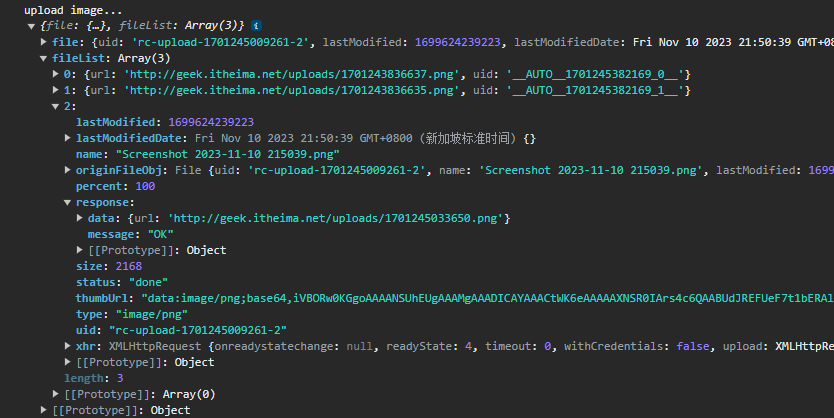

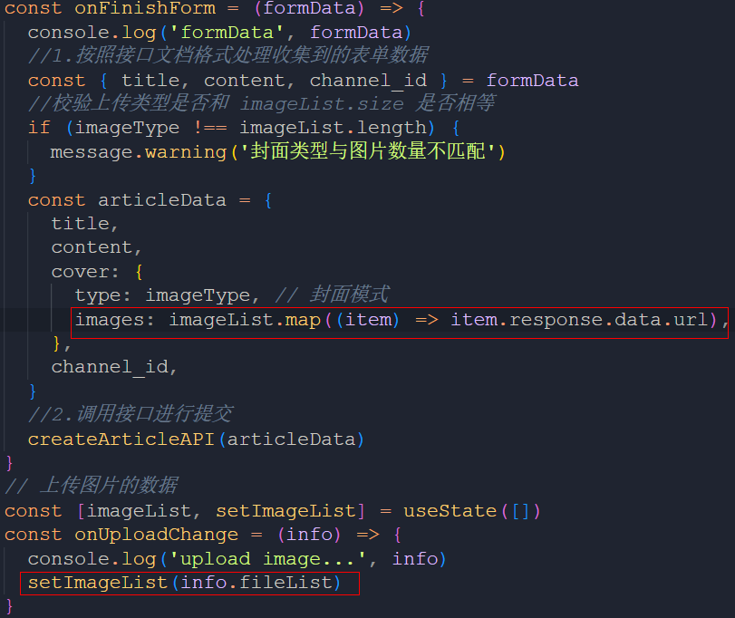

解决：

```jsx
  const onFinishForm = (formData) => {
    console.log('formData', formData)
    const { title, content, channel_id } = formData
    if (imageType !== imageList.length) {
      message.warning('封面类型与图片数量不匹配')
    }
    const articleData = {
      title,
      content,
      cover: {
        type: imageType,
          // 根据 imageList 中的数据进行收集和封装数据
        images: imageList.map((item) => {
          if (item.response) {
            return item.response.data.url
          } else {
            return item.url
          }
        }),
      },
      channel_id,
    }
    createArticleAPI(articleData)
  }
```

创建并调用更改 API

```js
// 更新文章
export function updateArticleAPI(data) {
  return request({
    url: `/mp/articles/${data.id}?draft=false`,
    method: 'PUT',
    data,
  })
}
```

```jsx
  const onFinishForm = (formData) => {
    console.log('formData', formData)
    const { title, content, channel_id } = formData
    if (imageType !== imageList.length) {
      message.warning('封面类型与图片数量不匹配')
    }
    const articleData = {
      title,
      content,
      cover: {
        type: imageType,
        images: imageList.map((item) => {
          if (item.response) {
            return item.response.data.url
          } else {
            return item.url
          }
        }),
      },
      channel_id,
    }
    // 提交
    if (articleId) {
      // 更新
      updateArticleAPI({
        ...articleData,
        id: articleId,
      })
    } else {
      // 新建
      createArticleAPI(articleData)
    }
  }
```

## 项目打包

### 基础打包和本地预览

打包：处理项目中的源代码和资源文件，生成可在生产环境中运行的静态文件的过程

命令：`npm run build`

打包结束后，会在项目根目录生成一个 `build` 目录

本地预览：在本地通过静态服务器模拟生产服务器运行项目的过程

需要全局安装工具：`npm i -g serve`

然后执行命令 `serve -s ./build`

最后在浏览器中访问 `http://localhost:3000`

### 优化-配置路由懒加载

什么是路由懒加载？

是指路由对应的 JS 资源只有在被访问时才会动态获取，目的是为了**优化项目首次打开时间**

配置步骤：

1. 把路由修改为由 React 提供的 `lazy` 函数进行动态导入
2. 使用 React 内置的 `Suspense` 组件包裹路由中的 `element` 选项对应的组件

```jsx
//使用lazy函数懒加载组件
const Home = lazy(() => import('@/pages/Home'))
const Article = lazy(() => import('@/pages/Article'))
const PublishArticle = lazy(() => import('@/pages/PublishArticle'))

const router = createBrowserRouter([
  {
    path: '/',
    element: (
      <AuthRoute>
        <Layout />
      </AuthRoute>
    ),
    children: [
      {
        index: true,
        // 使用 Suspense 组件包括懒加载的组件作为 element 属性值
        element: (
          <Suspense fallback={'加载中'}>
            <Home />
          </Suspense>
        ),
      },
      {
        path: 'article',
        element: (
          <Suspense fallback={'加载中'}>
            <Article />
          </Suspense>
        ),
      },
      {
        path: 'publishArticle',
        element: (
          <Suspense fallback={'加载中'}>
            <PublishArticle />
          </Suspense>
        ),
      },
    ],
  },
  {
    path: '/login',
    element: <Login />,
  },
])
```

结果：首次跳转路由时，会动态加载 JS 资源

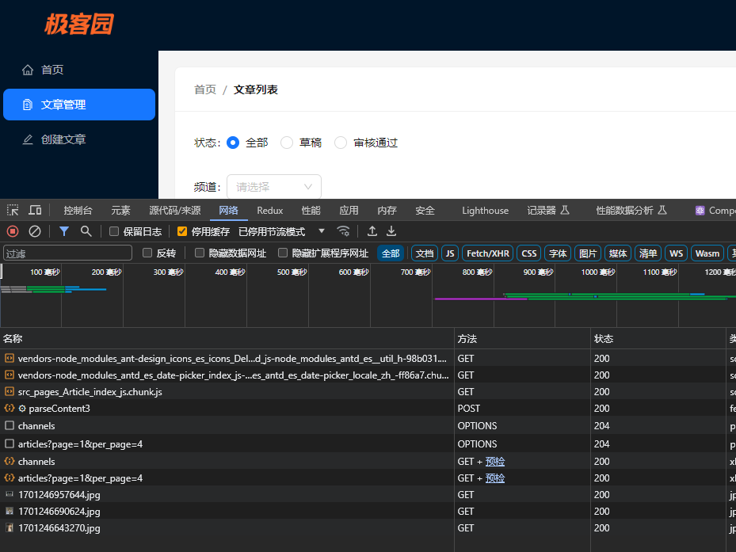

### 优化-包体积可视化分析

通过可视化的方式，可以直观地体现项目中各种包打包之后的体积大小，方便做优化

配置：

1. 安装 `npm i source-map-explorer --legacy-peer-deps`
2. 配置命令 `"analyze": "souce-map-explorer 'build/static/js/*.js'"`
3. 执行 `npm run analyze`，浏览器打开

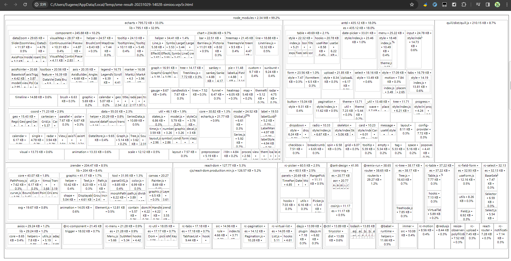

### 优化-CDN配置

CDN：内容分发网络，当用户请求网站内容时，由离用户最近的服务器将缓存的资源内容传递给用户

哪些资源可以从 CDN 获取？

1. 体积较大，需要利用 CDN 文件在浏览器的缓存特性，加快加载时间
2. 非业务 JS 文件，不需要经常做变动，CDN 不用频繁更新缓存

项目中怎么做：

1. 把需要做 CDN 缓存的文件排除在打包之外（react、react-dom）
2. 以 CDN 的方式重新引入资源（react、react-dom）

`craco.config.js`

```js
// 添加自定义对于webpack的配置

const path = require('path')
const { whenProd, getPlugin, pluginByName } = require('@craco/craco')

module.exports = {
  // webpack 配置
  webpack: {
    // 配置别名
    alias: {
      // 约定：使用 @ 表示 src 文件所在路径
      '@': path.resolve(__dirname, 'src')
    },
    // 配置webpack
    // 配置CDN
    configure: (webpackConfig) => {
      let cdn = {
        js:[]
      }
      whenProd(() => {
        // key: 不参与打包的包(由dependencies依赖项中的key决定)
        // value: cdn文件中 挂载于全局的变量名称 为了替换之前在开发环境下
        webpackConfig.externals = {
          react: 'React',
          'react-dom': 'ReactDOM'
        }
        // 配置现成的cdn资源地址
        // 实际开发的时候 用公司自己花钱买的cdn服务器
        cdn = {
          js: [
            'https://cdnjs.cloudflare.com/ajax/libs/react/18.2.0/umd/react.production.min.js',
            'https://cdnjs.cloudflare.com/ajax/libs/react-dom/18.2.0/umd/react-dom.production.min.js',
          ]
        }
      })

      // 通过 htmlWebpackPlugin插件 在public/index.html注入cdn资源url
      const { isFound, match } = getPlugin(
        webpackConfig,
        pluginByName('HtmlWebpackPlugin')
      )

      if (isFound) {
        // 找到了HtmlWebpackPlugin的插件
        match.userOptions.files = cdn
      }

      return webpackConfig
    }
  }
}
```

`index.html`

```html
<body>
  <div id="root"></div>
  <!-- 加载第三发包的 CDN 链接 -->
  <% htmlWebpackPlugin.options.files.js.forEach(cdnURL => { %>
    <script src="<%= cdnURL %>"></script>
  <% }) %>
</body>
```

验证：重新打包 & 本地预览，在开发者工具中查看网络中是否请求了 CDN
