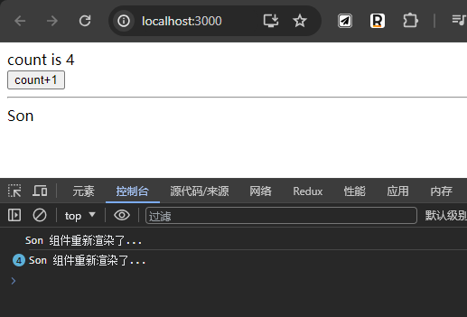
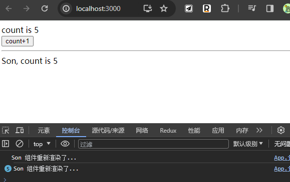
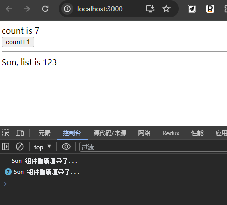
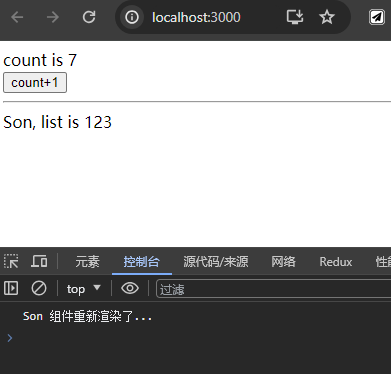
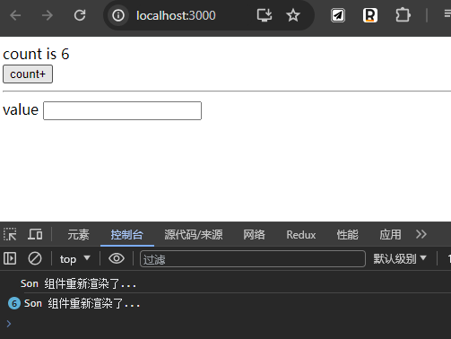
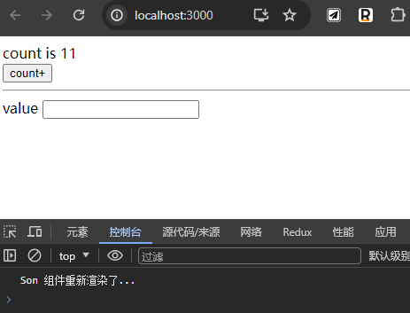
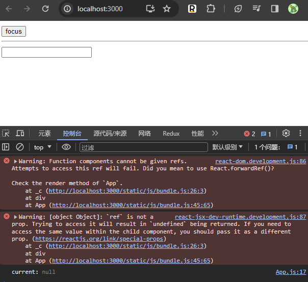
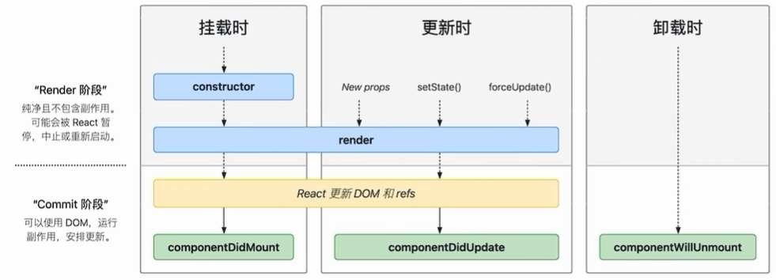

# React 进阶

## 目录

- [1. React 入门](/frameworks/react0/)
- [2. Redux](/frameworks/react0/02_redux/)
- [3. Router](/frameworks/react0/03_router/)
- [4. 极客网](/frameworks/react0/04_jikewang/)
- [5. React 进阶](/frameworks/react0/05_enhance/)
- [6. Zustand](/frameworks/react0/06_zustand/)
- [7. 使用 TS 编写 React](/frameworks/react0/07_with_ts/)

## useReducer - 状态管理

useReducer 和 useState 类似，即状态管理。[二者区别](https://zhuanlan.zhihu.com/p/336837522)

基础使用步骤：

1. 定义一个 reducer 函数，根据 action 的内容处理业务逻辑（return 出新状态）
2. 在组件中调用 useReducer，并**传入 reducer 函数和状态的初始值**（返回数组，状态变量和 dispatch 函数）
3. 事件发生时，通过 dispatch 函数分派一个 action 对象（通知 reducer 要返回哪个新状态并渲染 UI）

示例：计数器

```jsx
import './App.css'
import { useReducer } from 'react'

//1.
function reducer(state, action) {
  switch (action.type) {
    case 'INC':
      return state + 1
    case 'DEC':
      return state - 1
    default:
      return state
  }
}

function App() {
  //2.
  const [count, dispatch] = useReducer(reducer, 0)
  return (
    <div className="App">
      <h1>
        {/* 3. */}
        <button onClick={() => dispatch({ type: 'INC' })}>+</button>
        <span>{count}</span>
        <button onClick={() => dispatch({ type: 'DEC' })}>-</button>
      </h1>
    </div>
  )
}

export default App
```

上边示例 dispatch 函数参数 action 对象中只传递了 type 属性。通常情况下，可以传递任意**自定义**数据，比如 `payload` 等等。

## useMemo - 缓存变量

作用：**缓存计算的结果**，在组件每次重新渲染的时候取出缓存的内容进行渲染，避免重复计算

使用场景：计算量比较大的场景

---

示例：更新 `a 状态` 导致组件重新渲染，此时会导致 `b 状态` 重新计算

初始代码：逻辑为点击按钮时会 setCount1 ，count1 状态更新导致组件重新渲染，此时一并会重新计算 result。

```jsx
import { useState } from 'react'

// 1 2 3 4 5 6  7
// 1 1 2 3 5 8 13
function fib(n) {
  console.log('fib 函数调用了...')
  if (n < 2) return n
  return fib(n - 1) + fib(n - 2)
}

function App() {
  console.log('App 重新渲染了...')
  const [count1, setCount1] = useState(1)
  const result = fib(count1)
  return (
    <div className="App">
      <button onClick={() => setCount1(count1 + 1)}>count1++</button>
      <p>
        count1 is {count1}, result of fib({count1}) is {result}
      </p>
    </div>
  )
}

export default App
```

此时添加另一个状态，同样新增一个用于修改该状态的按钮，点击这个按钮，发现此时重新渲染了 App 组件，并且又一次执行了 `fib(count1)`，造成了**多余的计算**：

```jsx
function App() {
  console.log('App 重新渲染了...')
  const [count1, setCount1] = useState(1)
  const result = fib(count1)

  //新增状态
  const [count2, setCount2] = useState(1)

  return (
    <div className="App">
      <button onClick={() => setCount1(count1 + 1)}>count1++</button>
      <button onClick={() => setCount2(count2 + 1)}>count2++</button>
      <p>
        count1 is {count1}, result of fib({count1}) is {result}
      </p>
      <p>count2 is {count2}</p>
    </div>
  )
}
```

**解决方法**：将 result 的计算交给 `useMemo`

基础语法

```jsx
useMemo(()=> {
    //根据 count1 返回计算的结果
}, [count1])
```

说明：使用 useMemo 做缓存之后可以保证只有 count1 依赖项发生变化时才会重新计算变化

示例

```jsx
function App() {
  console.log('App 重新渲染了...')
  const [count1, setCount1] = useState(1)
  
  // const result = fib(count1)
  const result = useMemo(() => fib(count1), [count1])

  const [count2, setCount2] = useState(1)

  return (
    <div className="App">
      <button onClick={() => setCount1(count1 + 1)}>count1++</button>
      <button onClick={() => setCount2(count2 + 1)}>count2++</button>
      <p>
        count1 is {count1}, result of fib({count1}) is {result}
      </p>
      <p>count2 is {count2}</p>
    </div>
  )
}
```

## React.memo - 缓存组件

React 组件默认渲染机制：父组件重新渲染时子组件也会重新渲染

示例：

```jsx
import { useState } from 'react'

//简化起见，这里的子组件不依赖父组件的属性
function Son() {
  console.log('Son 组件重新渲染了...')
  return <div>Son</div>
}

function App() {
  const [count, setCount] = useState(0)
  return (
    <div>
      count is {count} <br />
      <button onClick={() => setCount(count + 1)}>count+1</button>
      <hr />
      <Son />
    </div>
  )
}

export default App
```



问题：如果子组件本身不需要进行重新渲染则会造成资源浪费，比如上边的 Son 组件

解决方法：使用 memo 函数

```js
const MemoedComp = memo(function SomeComp(props) {
    //...
})
```

说明：经过 memo 函数包裹生成的缓存组件只有在 props 发生变化时才会重新渲染。

使用 memo 函数改造之前的代码：

```jsx
import { memo, useState } from 'react'

// function Son() {
//   console.log('Son 组件重新渲染了...')
//   return <div>Son</div>
// }

const MemoedSon = memo(function Son() {
  console.log('Son 组件重新渲染了...')
  return <div>Son</div>
})

function App() {
  const [count, setCount] = useState(0)
  return (
    <div>
      count is {count} <br />
      <button onClick={() => setCount(count + 1)}>count+1</button>
      <hr />
      {/* <Son /> */}
      <MemoedSon />
    </div>
  )
}

export default App
```

**问题：如果子组件接收了父组件的传值，子组件何时会重新渲染呢？**

判断机制：React 会对每一个 prop 使用 `Object.is` 比较新值和老值。若返回 true 则表示没有变化；反之表示发生了变化。

1、若 prop 是简单类型

```jsx
const MemoedSon = memo(function Son({ count }) {
  console.log('Son 组件重新渲染了...')
  return <div>Son, count is {count}</div>
})

function App() {
  const [count, setCount] = useState(0)
  return (
    <div>
      count is {count} <br />
      <button onClick={() => setCount(count + 1)}>count+1</button>
      <hr />
      <MemoedSon count={count} />
    </div>
  )
}
```



点击按钮时 count 加一，状态变化，子组件重新渲染。

> 问题：如果点击按钮时保持 count，子组件是否会重新渲染？
>
> 答案：不会，基本类型变量通过 Object.is 比较结果是 true，表示传递的值没有变化，子组件进而不会更新。

2、若 prop 是引用类型

```jsx
import { memo, useState } from 'react'

const MemoedSon = memo(function Son({ list }) {
  console.log('Son 组件重新渲染了...')
  return <div>Son, list is {list}</div>
})

function App() {
  const [count, setCount] = useState(0)
  const list = [1, 2, 3]
  return (
    <div>
      count is {count} <br />
      <button onClick={() => setCount(count + 1)}>count+1</button>
      <hr />
      <MemoedSon list={list} />
    </div>
  )
}

export default App
```

结果：点击按钮更新 count 状态，父组件和子组件都发生了重新渲染



解析：子组件只接收了 list 这个属性。在父组件重新渲染时会重新创建 list 数组，引用发生了变化所以子组件会重新渲染

解决：使用 `useMemo` 缓存 list

```jsx
  // const list = [1, 2, 3]

  const list = useMemo(() => {
    return [1, 2, 3]
  }, [])
```



## useCallback - 缓存函数

问题示例：传递函数引用给子组件。当父组件重新渲染时会重新创建函数引用，进而导致子组件重新渲染

```jsx
import { memo, useState } from 'react'

const MemoedSon = memo(function Son({ setContent }) {
  console.log('Son 组件重新渲染了...')
  return (
    <div>
      value&nbsp;
      <input onChange={(e) => setContent(e.target.value)} />
    </div>
  )
})

function App() {
  // 父组件中使用的状态
  const [count, setCount] = useState(0)
  // 传递给子组件的函数引用
  const setContent = (newVal) => {
    console.log('新的表单值为', newVal)
  }
  return (
    <div>
      count is {count} <br />
      <button onClick={() => setCount(count + 1)}>count+</button>
      <hr />
      <MemoedSon setContent={setContent} />
    </div>
  )
}

export default App
```



**解决方法：使用 useCallback 包裹函数，使组件重新渲染时保持函数引用稳定**

```jsx
  // 传递给子组件的函数引用
  // const setContent = (newVal) => {
  //   console.log('新的表单值为', newVal)
  // }

  const setContent = useCallback(
    (newVal) => console.log('新的表单值为', newVal),
    []
  )
```



## React.forwardRef - 暴露dom给父组件

需求：在父组件中点击按钮后完成子组件中输入框的聚焦

```jsx
import { memo, useRef } from 'react'

const MemoedSon = memo(({ ref }) => {
  return (
    <div>
      {/* ref 绑定*/}
      <input ref={ref} />
    </div>
  )
})

function App() {
  //通过 useRef 创建一个 ref 传递给子组件
  const inputRef = useRef(null)
  return (
    <div>
      <button
        onClick={() => {
          console.log('current:', inputRef)
        }}
      >
        focus
      </button>
      <hr />
      <MemoedSon ref={inputRef} />
    </div>
  )
}

export default App
```

此时控制台会报错且点击按钮后无法获取子组件中的 dom



解决方法：使用 `React.forwardRef` 创建子组件，参数是一个 render 函数，函数参数共有两个，第一个是传递的所有参数集合，第二个是 ref，二者名字可自定义

```jsx
// const MemoedSon = memo(({ ref }) => {
//   return (
//     <div>
//       <input ref={ref} />
//     </div>
//   )
// })

const Son = forwardRef((props, ref) => {
  return (
    <div>
      <input ref={ref} />
    </div>
  )
})
```

## useImperativeHandle - 通过ref暴露函数到父组件

```jsx
import { forwardRef, useRef, useImperativeHandle } from 'react'

const MemoedSon = forwardRef((props, ref) => {
  console.log('Son is rerendering...')
  const inputRef = useRef(null)
  //在子组件中定义聚焦函数
  const inputHandle = () => {
    inputRef.current.focus()
  }
  //通过ref将聚焦函数暴露出去
  useImperativeHandle(ref, () => {
    return { inputHandle }
  })
  return (
    <div>
      <input ref={inputRef} />
    </div>
  )
})

function App() {
  const inputRef = useRef(null)
  return (
    <div>
      <button
        onClick={() => {
          console.log('click...')
          console.log(inputRef.current)
          //调用子组件暴露的聚焦函数
          inputRef.current.inputHandle()
        }}
      >
        focus
      </button>
      <hr />
      <MemoedSon ref={inputRef} />
    </div>
  )
}

export default App
```

## 使用Class API编写类组件

使用 Class API 编写基础类组件**示例**

```jsx
import { Component } from 'react'

// 编写组件基本步骤：1.状态变量 2.要渲染的JSX 3.事件回调
class Counter extends Component {
  //1.
  state = {
    count: 0,
  }
  //3.
  increment = () => {
    this.setState({ count: this.state.count + 1 })
  }
  //2.
  render() {
    return (
      <div>
        <p>counter is {this.state.count}</p>
        <button onClick={this.increment}>counter+1</button>
      </div>
    )
  }
}

function App() {
  return (
    <div>
      <Counter />
    </div>
  )
}

export default App
```

以上创建 Counter 组件的方式已不建议使用。有的老项目中可能有这样的代码

## 类组件生命周期钩子



其中两个重要的钩子：

1. `componentDidMount` 组件挂载完毕自动执行，常用于异步获取数据
2. `componentWillUnmount`  组件卸载时自动执行，常用于清理副作用函数，比如清除定时器、清除事件绑定

示例：

```jsx
import { useState, Component } from 'react'

class Counter extends Component {
  componentDidMount() {
    console.log('组件渲染完毕了，开始发送请求获取数据...')

    // 创建定时器
    const timer = setInterval(() => {
      console.log('计数器加1...')
      this.setState({ count: this.state.count + 1 })
    }, 1000)
    this.setState({ timer })
  }
  componentWillUnmount() {
    console.log('组件即将被卸载...')
    //手动清理定时器。（组件卸载时并不会一并清理定时器）
    clearInterval(this.state.timer)
  }
  state = {
    count: 0,
    timer: null,
  }
  increment = () => {
    this.setState({ count: this.state.count + 1 })
  }
  render() {
    console.log('comp rerender...')
    return (
      <div>
        <p>counter is {this.state.count}</p>
        <button onClick={this.increment}>counter+1</button>
      </div>
    )
  }
}

function App() {
  const [visiable, setVisiable] = useState(true)
  return (
    <div>
      <button
        style={{ backgroundColor: visiable ? 'red' : 'green' }}
        onClick={() => setVisiable(!visiable)}
      >
        {visiable ? 'unmount' : 'mount'}
      </button>
      <hr />
      {visiable && <Counter />}
    </div>
  )
}

export default App
```

## 类组件之间通信

### 父传子

父组件：通过 `x={this.stat.y}` 传递

子组件：通过 `this.props.x` 取值

```jsx
class Son1 extends Component {
  state = {
    msg: '般若波罗密',
  }
  render() {
    return (
      <div>
        this is Son1.
        <Son2 msg={this.state.msg} />
      </div>
    )
  }
}

class Son2 extends Component {
  render() {
    return <div>this is Son2. msg is {this.props.msg}</div>
  }
}
```

### 子传父

原理：传递函数给子组件，子组件通过 `this.props` 调用函数将数据传递给父组件

```jsx
class Son1 extends Component {
  state = {
    msg: '般若波罗密',
  }
  getMsg = (data) => {
    alert(`Son1: 从 Son2 获得数据为：${data}`)
  }
  render() {
    return (
      <div
        style={{ border: '1px solid grey', padding: '10px', margin: '10px' }}
      >
        this is Son1.
        <Son2 msg={this.state.msg} onGetMsg={this.getMsg} />
      </div>
    )
  }
}

class Son2 extends Component {
  render() {
    return (
      <div
        style={{ border: '1px solid grey', padding: '10px', margin: '10px' }}
      >
        this is Son2. msg is {this.props.msg} <br />
        <button onClick={() => this.props.onGetMsg('菠萝菠萝蜜！')}>
          send msg to Son1
        </button>
      </div>
    )
  }
}
```

### 兄传弟

示意：`child1` 组件将数据传递到 `child2` 组件

```
                    parent
                   /      \
              child1     child2
```

思路：`child1` 到 `parent` 进行子传父，`parent` 到 `child2` 进行父传子
