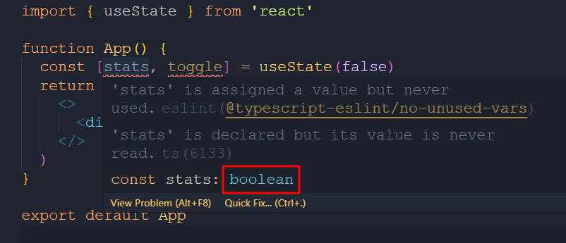
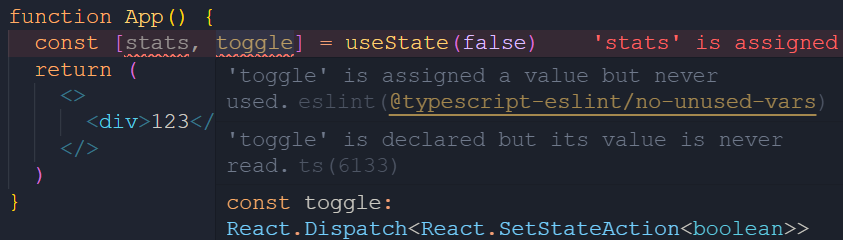
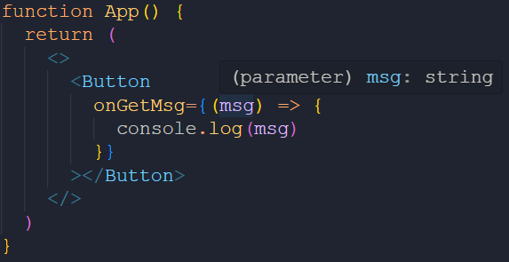
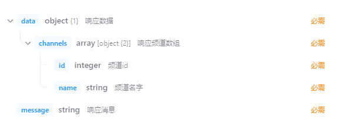
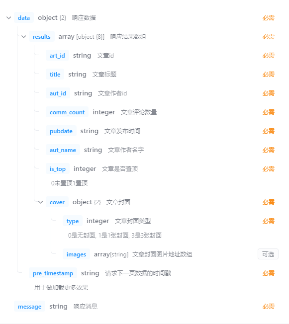

# 使用 TS 和项目

## 目录

- [1. React 入门](/frameworks/react0/)
- [2. Redux](/frameworks/react0/02_redux/)
- [3. Router](/frameworks/react0/03_router/)
- [4. 极客网](/frameworks/react0/04_jikewang/)
- [5. React 进阶](/frameworks/react0/05_enhance/)
- [6. Zustand](/frameworks/react0/06_zustand/)
- [7. 使用 TS 编写 React](/frameworks/react0/07_with_ts/)

## react+ts 环境搭建

基于 vite 搭建 react + TS 的项目：<https://cn.vitejs.dev/guide/#scaffolding-your-first-vite-project>

```sh
# npm 7+
npm create vite@latest my-react-app -- --template react-ts
```

```sh
cd my-react-app
npm install
npm run dev
```

简化项目。src 目录下仅保留三个文件

```tsx
// App.tsx
function App() {
  return (
    <>
      <div>123</div>
    </>
  )
}
export default App

// main.tsx
import ReactDOM from 'react-dom/client'
import App from './App.tsx'
ReactDOM.createRoot(document.getElementById('root')!).render(<App />)

//vite-env.ts
/// <reference types="vite/client" />
```

## useState-自动推导

react 会根据 useState 的初始值自动推导变量类型，不用指定类型





## useState-传递泛型参数

```tsx
import { useState } from 'react'

//定义类型
type User = {
  name: string
  age: number
}

function App() {
  const [user, setUser] = useState<User>()
  return (
    <>...</>
  )
}

export default App
```

问题：`useState` 管理自定义类型的状态时如何使用？

1. userState 参数：`User` | `()=>User`
2. 用于修改状态的回调函数的参数：`User` | `()=>User` | `undefined`

示例：

```tsx
//1.
const [user, setUser] = useState<User>({
  name: '123',
  age: 123,
})
const [user, setUser] = useState<User>(() => {
    return {
      name: '1234',
      age: 1234,
    }
})

//2.
setUser({
  name: '1234',
  age: 1234,
})
setUser(() => {
  return {
    name: '1234',
    age: 1234,
  }
})
```

> 问：何时可以进行 `setUser(undefined)` 呢？答：`useState<User>()` 时

## useState-初始值为null

使用场景：不知道状态的初始值是什么时，将 useState 的初始值置为 null 是一个常见的做法。

方法：**具体类型联合 null**

```tsx
type User = {
  name: string
  age: number
}


function App() {
  //联合类型
  const [user, setUser] = useState<User | null>(null)
  const changeUser = () => {
    setUser(null)
    setUser({
      name: '张三',
      age: 18,
    })
  }
  
  return (
    <>
      <div>
        {/* 使用【可选链】保证类型安全：只有 user 不为空时才进行点运算  */}
        <p>user : {user?.name}</p>
      </div>
    </>
  )
}
```

## props-基础使用

 ```tsx
 //定义结构
 type Props = {
   name: string
   age: number
 }
 
 function Button(props: Props) {
   const { age, name } = props
   return <button>Click Me. {name + ',' + age}</button>
 }
 
 function App() {
   return (
     <>
       <Button name={'Jack'} age={12} />
     </>
   )
 }
 
 export default App
 ```

上边的 `Props` 结构也可以通过 `interface` 关键字定义：

```tsx
interface Props {
  name: string
  age: number
}
```

## props-为children添加类型

`children` 是一个特殊的 prop，支持多种不同类型数据的传入，需要通过一个**内置**的 `ReactNode` **类型**作为其类型。

ReactNode 支持的类型有

```
React.ReactElement, string, number, React.ReactFragment, React.ReactPortal, boolean, null, undefined
```

示例

```tsx
import React from 'react'

interface Props {
  children: React.ReactNode
}

function Button(props: Props) {
  const { children } = props
  return (
    <>
      {children}
    </>
  )
}

function App() {
  return (
    <>
      <Button>
        <span>wtf</span>
      </Button>
    </>
  )
}
```

## props-为事件prop添加类型

在子传父场景下，组件经常执行类型为函数的 prop。这类 prop 的使用重点在于函数参数类型的指定。

示例：

① 子组件

```tsx
interface Props {
  // 指定函数签名，包括参数和返回值。另外该参数是可选的
  onGetMsg?: (msg: string) => void
}

function Button(props: Props) {
  const { onGetMsg } = props

  return (
    <>
      {/* 通过 func?.() 保证类型安全 */}
      <button
        onClick={() => {
          onGetMsg?.('hello!')
        }}
      >
        click me
      </button>
    </>
  )
}
```

② 父组件：传递函数作为 prop（采用**内联函数**的方式）

```tsx
function App() {
  return (
    <>
      <Button
        onGetMsg={(msg) => {
          console.log(msg)
        }}
      ></Button>
    </>
  )
}
```

此时会进行自动类型推断，无需指定类型



如果不采用内联函数的形式传递 prop，而是通过指定函数名的方式进行传递，则需要在定义函数时指定函数参数类型，比如

```tsx
function App() {
    
  //定义回调函数，需指定函数参数类型
  const getMsgHandler = (msg: string) => {
    console.log(msg)
  }

  return (
    <>
      <Button onGetMsg={getMsgHandler}></Button>
    </>
  )
}
```

## useRef-基础用法

```tsx
import { useEffect, useRef } from 'react'

function App() {
  //创建 ref 同时指定类型
  const inputRef = useRef<HTMLInputElement>(null)
  
  useEffect(() => {
    //可选链 类型守卫
    inputRef?.current?.focus()
  })
    
  return (
    <>
      <input ref={inputRef} />
    </>
  )
}

export default App
```

## useRef-稳定的存储器

使用 `ref.current` 做**组件级别**的存储器

```tsx
import { useState, useEffect, useRef } from 'react'

function Comp() {
  const timer = useRef<number | undefined>(undefined)

  useEffect(() => {
    timer.current = setInterval(() => {
      console.log('hello')
    }, 1000)
    return () => {
      clearInterval(timer.current!)
    }
  })

  return <>hello</>
}

function App() {
  const [status, switchStatus] = useState(false)
  return (
    <>
      <button onClick={() => switchStatus(!status)}>switch</button>
      {status && <Comp />}
    </>
  )
}

export default App
```

## 极客网移动端

### 项目框架准备

```sh
npm create vite@latest 02-react-jike-mobile -- --template react-ts
```

简化三个文件...

### 安装 ant design mobile

官方文档：<https://mobile.ant.design/zh/guide/quick-start/>

```sh
npm install --save antd-mobile
```

测试

```tsx
import { Button } from 'antd-mobile'

function App() {
  return (
    <>
      <Button color="success">123</Button>
    </>
  )
}

export default App
```

### 配置基础路由

```sh
npm i react-router-dom
```

创建两个页面：Home 和 Detail

创建路由实例

```tsx
import { createBrowserRouter } from 'react-router-dom'
import Home from '../pages/Home'
import Detail from '../pages/Detail'

const router = createBrowserRouter([
  {
    path: '/',
    element: <Home />,
  },
  {
    path: '/detail',
    element: <Detail />,
  },
])

export default router
```

配置路由实例

```tsx
import ReactDOM from 'react-dom/client'
import './index.css'
import { RouterProvider } from 'react-router-dom'
import router from './router/index.tsx'

ReactDOM.createRoot(document.getElementById('root')!).render(
  <RouterProvider router={router}></RouterProvider>
)
```

验证。。。

### 配置路径别名

内容：

1. 路径解析
2. 智能路径提示

1、`vite.config.ts` 路径解析配置

```tsx
import { defineConfig } from 'vite'
import react from '@vitejs/plugin-react'
import path from 'path' // 需要安装 node 类型包: npm i @types/node -D

// https://vitejs.dev/config/
export default defineConfig({
  plugins: [react()],
  resolve: {
    alias: {
      '@': path.resolve(__dirname, './src'),
    },
  },
})
```

验证：修改上一节 `@/router/index.tsx` 中引入 Home/Detail 组件的 import 语句，将路径格式转为 @ 开头的形式，观察路由实例是否可以继续使用

2、智能路径提示支持 `tsconfig.json`

```json
//在添加两项
{
  "compilerOptions": {
    "baseUrl": ".",
    "paths": {
      "@/*": ["src/*"]
    },
  }
}
```

### axios 封装

```sh
npm i axios
```

封装：

1. 在 utils 中封装 http 模块，主要包括接口基地址、超时时间、拦截器
2. 在 utils 中做统一导出

`@/utils/http.ts`

```ts
import axios from 'axios'

const http = axios.create({
  baseURL: 'http://geek.itheima.net/',
  timeout: 5000,
})

http.interceptors.request.use(
  (config) => {
    return config
  },
  (err) => {
    return Promise.reject(err)
  }
)

http.interceptors.response.use(
  (res) => {
    return res
  },
  (err) => {
    return Promise.reject(err)
  }
)

export default http
```

创建 `@/utils/index.ts` 做中转导出

```ts
// 做中转导出模块

import http from './http'

export { http }
```

### 封装 api 模块

axios 提供了 request 泛型方法，方便我们**传入类型参数**和**推导返回值类型**

```ts
axios.request<Type>(config).then((res)=>{
    // res.data 类型为 Type
    console.log(res.data)
})
```

**示例**

响应体结构



```ts
import { http } from '@/utils'

//1.定义泛型结构
type ResType<T> = {
  message: string
  data: T
}

//2.定义接口真实的数据结构
type ChannelItem = {
  id: number
  name: string
}

type ChannelRes = {
  channels: ChannelItem[]
}

//3.创建请求频道列表的 api
export function fetchChannelAPI() {
  return http.request<ResType<ChannelRes>>({
    url: '/channels',
  })
}
```

进一步，可以将 ResType 提取到一个公用的模块中：`shared.ts`

```ts
type ResType<T> = {
  message: string
  data: T
}
```

然后在使用的地方导入

```ts
//1.定义泛型结构
import type { ResType } from '@/apis/shared'

//2.定义接口真实的数据结构
//3.创建 api 函数
```

### Home-基础数据渲染

`style.css`

```css
.tabContainer {
  position: fixed;
  height: 50px;
  top: 0;
  width: 100%;
}

.listContainer {
  position: fixed;
  top: 50px;
  bottom: 0;
  width: 100%;
}
```

`index.tsx`

```tsx
import { ChannelItem, fetchChannelAPI } from '@/apis/channels'
import { Tabs } from 'antd-mobile'
import { useEffect, useState } from 'react'

const Home = () => {
  const [channels, setChannels] = useState<ChannelItem[]>([])

  useEffect(() => {
    const fetchChannels = async () => {
      const res = await fetchChannelAPI()
      setChannels(res.data.data.channels)
    }
    fetchChannels()
  }, [])

  return (
    <>
      <div className="tabContainer">
        <Tabs>
          {channels.map((item) => (
            <Tabs.Tab title={item.name} key={item.id}></Tabs.Tab>
          ))}
        </Tabs>
      </div>
    </>
  )
}

export default Home
```

### Home-自定义hook函数优化代码

上一小节的代码中，状态数据和组件渲染是写在一起的，可以采用自定义 hook 封装的方式让逻辑和渲染逻辑分离开来。

`useChannels.tsx` 自定义 hook 函数

```tsx
import { useEffect, useState } from 'react'
import { ChannelItem, fetchChannelAPI } from '@/apis/channels'

const useChannels = () => {
  const [channels, setChannels] = useState<ChannelItem[]>([])

  useEffect(() => {
    const fetchChannels = async () => {
      const res = await fetchChannelAPI()
      setChannels(res.data.data.channels)
    }
    fetchChannels()
  }, [])

  return { channels }
}

export { useChannels }
```

在 `index.tsx` 中使用定义的 hook

```tsx
import { Tabs } from 'antd-mobile'
import { useChannels } from './useChannels'

const Home = () => {
  //调用hook获取初始数据
  const { channels } = useChannels()
  
  return (
    <>
      <div className="tabContainer">
        <Tabs>
          {channels.map((item) => (
            <Tabs.Tab title={item.name} key={item.id}></Tabs.Tab>
          ))}
        </Tabs>
      </div>
    </>
  )
}

export default Home
```

### Home-List组件实现

#### 基础 List 组件

`@/pages/Home/HomeList.tsx`

```tsx
import { users } from './users'
import { Image, List } from 'antd-mobile'

const HomeList = () => {
  return (
    <>
      <List>
        {users.map((item) => (
          <List.Item
            key={item.id}
            prefix={
              <Image
                src={item.avatar}
                fit="cover"
                width={40}
                height={40}
                style={{ borderRadius: 20 }}
              />
            }
            description={item.description}
          >
            {item.name}
          </List.Item>
        ))}
      </List>
    </>
  )
}

export default HomeList
```

`@/pages/Home/HomeList/users.ts`

```ts
export const users = [
  {
    id: '1',
    avatar:
      'https://images.unsplash.com/photo-1548532928-b34e3be62fc6?ixlib=rb-1.2.1&q=80&fm=jpg&crop=faces&fit=crop&h=200&w=200&ixid=eyJhcHBfaWQiOjE3Nzg0fQ',
    name: 'Novalee Spicer',
    description: 'Deserunt dolor ea eaque eos',
  },
  {
    id: '2',
    avatar:
      'https://images.unsplash.com/photo-1493666438817-866a91353ca9?ixlib=rb-0.3.5&q=80&fm=jpg&crop=faces&fit=crop&h=200&w=200&s=b616b2c5b373a80ffc9636ba24f7a4a9',
    name: 'Sara Koivisto',
    description: 'Animi eius expedita, explicabo',
  },
  {
    id: '3',
    avatar:
      'https://images.unsplash.com/photo-1542624937-8d1e9f53c1b9?ixlib=rb-1.2.1&q=80&fm=jpg&crop=faces&fit=crop&h=200&w=200&ixid=eyJhcHBfaWQiOjE3Nzg0fQ',
    name: 'Marco Gregg',
    description: 'Ab animi cumque eveniet ex harum nam odio omnis',
  },
  {
    id: '4',
    avatar:
      'https://images.unsplash.com/photo-1546967191-fdfb13ed6b1e?ixlib=rb-1.2.1&q=80&fm=jpg&crop=faces&fit=crop&h=200&w=200&ixid=eyJhcHBfaWQiOjE3Nzg0fQ',
    name: 'Edith Koenig',
    description: 'Commodi earum exercitationem id numquam vitae',
  },
]
```

#### 定义请求文章的 api 函数并使用

接口文档：<https://apifox.com/apidoc/shared-fa9274ac-362e-4905-806b-6135df6aa90e/api-23673257>



`@/apis/articles.ts`  定义 api 函数

```ts
import { http } from '@/utils'
import type { ResType } from './shared'

interface ArticleItem {
  art_id: string
  title: string
  aut_id: string
  comm_count: number
  pubdate: string
  aut_name: string
  is_top: number
  cover: {
    type: string
    images: string[]
  }
}

export interface ArticleRes {
  results: ArticleItem[]
  pre_timestamp: string
}

interface GetArticlesApiParams {
  channel_id: string
  timestamp: string
}

function fetchArticlesAPI(params: GetArticlesApiParams) {
  return http.request<ResType<ArticleRes>>({
    url: '/articles',
    params,
  })
}

export { fetchArticlesAPI }
```

使用请求 api 函数：

```tsx
import { useEffect, useState } from 'react'
import { Image, List } from 'antd-mobile'
import { ArticleRes, fetchArticlesAPI } from '@/apis/articles'

const HomeList = () => {
  const [articles, setArticles] = useState<ArticleRes>({
    results: [],
    pre_timestamp: '' + new Date().getTime(),
  })

  useEffect(() => {
    const fetchData = async () => {
      const res = await fetchArticlesAPI({
        channel_id: '0',
        timestamp: '' + new Date().getTime(),
      })
      setArticles(res.data.data)
    }
    fetchData()
  }, [])

  return (
    <>
      <List>
        {articles.results.map((item) => (
          <List.Item
            key={item.art_id}
            prefix={
              <Image
                src={item.cover.images?.[0]}
                fit="cover"
                width={40}
                height={40}
                style={{ borderRadius: 20 }}
              />
            }
            description={item.pubdate}
          >
            {item.title}
          </List.Item>
        ))}
      </List>
    </>
  )
}

export default HomeList
```

#### 根据频道 id 渲染 List 组件

`HomeList.tsx`

```tsx

//定义 props 结构
interface HomeListProps {
  channel_id: string
}

const HomeList = (props: HomeListProps) => {
  //获取频道 id
  const { channel_id } = props
  
  const [articles, setArticles] = useState<ArticleRes>({
    results: [],
    pre_timestamp: '' + new Date().getTime(),
  })

  useEffect(() => {
    const fetchData = async () => {
      try { // 用 try-catch 处理
        const res = await fetchArticlesAPI({
          channel_id: channel_id,
          timestamp: '' + new Date().getTime(),
        })
        setArticles(res.data.data)
      } catch (err) {
        throw new Error('获取文章列表失败')
      }
    }
    fetchData()
  }, [channel_id])
  
  ...
```

`Home.tsx`

```tsx
const Home = () => {
  const { channels } = useChannels()
  return (
    <>
      <div className="tabContainer">
        <Tabs defaultActiveKey={'0'}>
          {channels.map((item) => (
            <Tabs.Tab title={item.name} key={item.id}>
              {/* 为 tab 页传入当前频道id */}
              <HomeList channel_id={item.id + ''} />
            </Tabs.Tab>
          ))}
        </Tabs>
      </div>
    </>
  )
}
```

#### List 无限加载

组件：<https://mobile.ant.design/zh/components/infinite-scroll>

使用步骤：

1. 使用 `InfiniteScroll` 组件，滚动到底部触发加载下一页动作
2. 加载下一页数据时需要传递上一个请求得到的 `pre_timestamp` 参数
3. 把老数据和新数据做拼接
4. 返回的数据长度为 0 时停止监听边界值

修改样式文件 `@/pages/Home/style.css`

```css
.listContainer {
  position: fixed;
  top: 50px;
  bottom: 0;
  width: 100%;
  overflow: auto;
}
```

修改布局 `@/pages/Home/index.tsx`

```tsx
const Home = () => {
  const { channels } = useChannels()
  return (
    <>
      <div className="tabContainer">
        <Tabs defaultActiveKey={'0'}>
          {channels.map((item) => (
            <Tabs.Tab title={item.name} key={item.id}>
              {/* list 区域可滚动占下面区域，可滚动 */}
              <div className="listContainer">
                <HomeList channel_id={item.id + ''} />
              </div>
            </Tabs.Tab>
          ))}
        </Tabs>
      </div>
    </>
  )
}
```

在 HomeList 组件中编写 无限滚动 逻辑

```tsx
interface HomeListProps {
  channel_id: string
}

const HomeList = (props: HomeListProps) => {
  const { channel_id } = props
  const [articles, setArticles] = useState<ArticleRes>({
    results: [],
    pre_timestamp: '' + new Date().getTime(),
  })

  useEffect(() => {
    const fetchData = async () => {
      ...
    }
    fetchData()
  }, [channel_id])

  //维护【是否有更多】状态
  const [hasMore, setHasMore] = useState(true)
  //加载下一页的函数
  const loadMore = async () => {
    //核心逻辑
    console.log('加载更多...')
    const res = await fetchArticlesAPI({
      channel_id: channel_id,
      timestamp: articles.pre_timestamp,
    })
    setArticles({
      results: [...articles.results, ...res.data.data.results],
      pre_timestamp: res.data.data.pre_timestamp,
    })
    if (res.data.data.results.length === 0) {
      setHasMore(false)
    }
  }

  return (
    <>
      <List>
        ...
      </List>
      <InfiniteScroll threshold={10} loadMore={loadMore} hasMore={hasMore} />
    </>
  )
}

export default HomeList
```

### Detail-路由跳转&数据渲染

步骤：

1. 通过路由跳转方法进行跳转，并传递参数
2. 在详情路由下获取参数并请求数据
3. 渲染数据到页面中

**1、路由跳转**

```tsx
  const navigate = useNavigate()
  const jumpToDetail = (art_id: string) => {
    navigate(`/detail?id=${art_id}`)
  }

  return (
    <>
      <List>
        {articles.results.map((item) => (
          <List.Item
            onClick={() => {
              jumpToDetail(item.art_id)
            }}
              ...</List.Item>
          ...
```

**2、在详情页请求文章数据**

封装 api 函数：`@/apis/articleDetail.ts`

```ts
import { http } from '@/utils'
import { ResType } from './shared'

export interface DetailData {
  /**
   * 文章id
   */
  art_id: string
  /**
   * 文章-是否被点赞，-1无态度, 0未点赞, 1点赞, 是当前登录用户对此文章的态度
   */
  attitude: number
  /**
   * 文章作者id
   */
  aut_id: string
  /**
   * 文章作者名
   */
  aut_name: string
  /**
   * 文章作者头像，无头像, 默认为null
   */
  aut_photo: string
  /**
   * 文章_评论总数
   */
  comm_count: number
  /**
   * 文章内容
   */
  content: string
  /**
   * 文章-是否被收藏，true(已收藏)false(未收藏)是登录的用户对此文章的收藏状态
   */
  is_collected: boolean
  /**
   * 文章作者-是否被关注，true(关注)false(未关注), 说的是当前登录用户对这个文章作者的关注状态
   */
  is_followed: boolean
  /**
   * 文章_点赞总数
   */
  like_count: number
  /**
   * 文章发布时间
   */
  pubdate: string
  /**
   * 文章_阅读总数
   */
  read_count: number
  /**
   * 文章标题
   */
  title: string
}

export const fetchArticleDetailAPI = async (art_id: string) => {
  return http.request<ResType<DetailData>>({
    url: `/articles/${art_id}`,
  })
}
```

`Detail/index.tsx`

```tsx
const Detail = () => {
  const [detail, setDetail] = useState<ArticleDetailData | null>(null)

  const [params] = useSearchParams()
  const art_id = params.get('id')

  const navigate = useNavigate()
  const back = () => {
    navigate(-1)
  }

  useEffect(() => {
    const fetchData = async () => {
      const rsp = await fetchArticleDetailAPI(art_id!)
      setDetail(rsp.data.data)
    }
    fetchData()
  }, [art_id])

...
```

**3、渲染数据**

```tsx
const Detail = () => {
  const [detail, setDetail] = useState<ArticleDetailData | null>(null)

  ...

  if (!detail)
    return (
      <>
        <div>loading...</div>
      </>
    )

  return (
    <>
      <NavBar onBack={back}>{detail?.title}</NavBar>
      <div
        dangerouslySetInnerHTML={{
          __html: detail?.content,
        }}
      ></div>
    </>
  )
}

export default Detail
```
