# React 入门

## 目录

- [1. React 入门](/frameworks/react0/)
- [2. Redux](/frameworks/react0/02_redux/)
- [3. Router](/frameworks/react0/03_router/)
- [4. 极客网](/frameworks/react0/04_jikewang/)
- [5. React 进阶](/frameworks/react0/05_enhance/)
- [6. Zustand](/frameworks/react0/06_zustand/)
- [7. 使用 TS 编写 React](/frameworks/react0/07_with_ts/)

## React 了解

React 由 Meta 公司研发，是一个用于**构建 Web 和原生交互界面的库**

1. 在服务器上，React 可以让你在获取数据的同时开始流式传输 HTML，在任何 JavaScript 代码加载之前逐步填充剩余内容。在客户端，即使是在渲染过程中，React 也会使用标准的 Web API 使 UI 快速响应。
2. 人们希望原生应用程序都与和自己使用的平台相一致的体验。[React Native](https://reactnative.dev/) 和 [Expo](https://expo.dev/) 让你可以使用 React 构建 Android、IOS 等应用程序。他们的样式和体验都和原生应用程序一样，因为它们的用户界面是真正的原生用户界面。这不是一个 Web 视图 —— 你的 React 组件是由平台提供的真实 Android 或 IOS 视图来渲染。

**React 的优势**

1. 相较传统基于 Dom 开发的优势：组件化开发方式、性能高
2. 相较于其他前端框架（Vue、Angular）的优势：丰富的生态、跨平台支持

## 搭建开发环境

```sh
npx create-react-app react-basic
# npx: 工具用来查找并执行后续的包命令
# create-react-app: 核心包，用于创建 React 项目
# react-basic: React 项目名，支持自定义
```

项目结构及简化：

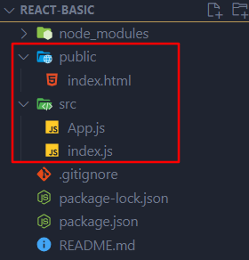

`package.json`

```json
{
 ...
  "dependencies": {
    "@testing-library/jest-dom": "^5.17.0",
    "@testing-library/react": "^13.4.0",
    "@testing-library/user-event": "^13.5.0",
    "react": "^18.2.0",
    "react-dom": "^18.2.0",
    "react-scripts": "5.0.1",
    "web-vitals": "^2.1.4"
  },
    ...
}
```

页面 `index.html`

```html
<!DOCTYPE html>
<html lang="en">
  <head>
    <meta charset="utf-8" />
    <meta name="viewport" content="width=device-width, initial-scale=1" />
    <meta name="theme-color" content="#000000" />
    <meta name="description" />
    <title>React App</title>
  </head>
  <body>
    <noscript>You need to enable JavaScript to run this app.</noscript>
    <div id="root"></div>
  </body>
</html>

```

入口文件 `index.js`

```js
// react 必要的两个核心包
import React from 'react'
import ReactDOM from 'react-dom/client'

// 导入【根组件】
import App from './App'

// 把【根组件】渲染到 #root 的节点
const root = ReactDOM.createRoot(document.getElementById('root'))
root.render(<App />)
```

根组件 `App.js`

```jsx
function App() {
  return <div className="App">Hello</div>
}

export default App
```

## JSX

JSX 是 JavaScript 和 XML 的缩写，表示在 **JS 代码中编写 HTML 模板结构**，它是 React 中编写 UI 模板的方式

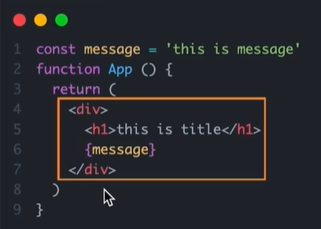

JSX 的优势：

1. HTML 的声明式模板写法
2. JS 的可编程能力

**标准浏览器无法识别 JSX，那她是怎么渲染的？**

答：JSX 不是标准的 JS 语法，它是 **JS 的语法扩展**，浏览器本身不能识别，需要通过**解析工具做解析**之后才能在浏览器中运行。

[试一试 | babeljs.io](https://babeljs.io/repl)

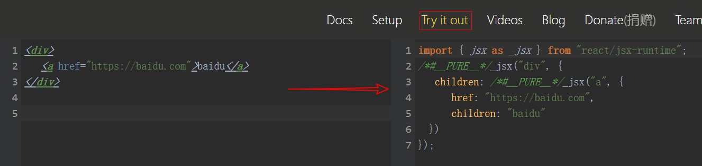

### 表达式

在 JSX 中可以是通过**大括号语法 {}** 识别 JS 中的表达式，比如常见的变量、函数调用、方法调用等等

1. 使用引号传递字符串
2. 使用 Javascript 变量
3. 函数调用和方法调用
4. 使用 Javascript 对象

**注意：**if 语句、switch 语句、变量声明属于语句，不是表达式，不能出现在 {} 中

示例：

```jsx
var count = 10
function getName() {
  return 'GUO'
}
function App() {
  // var a = { color: 'red' }
  return (
    <div className="App">
      <p>{'this is message'}</p>
      <p>{count}</p>
      <p>{getName()}</p>
      <p>{new Date().getDate()}</p>
      <p style={{ color: 'red' }}>this is paragraph</p>
    </div>
  )
}

export default App
```

### 列表渲染

示例

```jsx
function App() {
  var list = [
    { id: 1001, name: 'Vue' },
    { id: 1002, name: 'React' },
    { id: 1003, name: 'Angular' },
  ]
  return (
    <div className="App">
      <ol>
        {list.map((item) => (
          <li key={item.id}>{item.name}</li>
        ))}
      </ol>
    </div>
  )
}

export default App
```

要点：

1. return 的部分就是要进行循环的部分
2. 注意：为每一项加上一个独一无二的 key 字符串或 number id，可以提高性能（框架内部使用）

补充：使用 “循环索引” 做 'key'

```jsx
  <ol>
    {list.map((item, index) => (
      <li key={index}>{item.name}</li>
    ))}
  </ol>
```

### 条件渲染

比如判断 isLogin 变量是否为 true，如果为真则显示 Jack，反之显示 ‘请登录’

在 React 中，可以通过逻辑与运算 &&，三元表达式（?:）实现基础的条件渲染。

```jsx
// 如果 flag 为真表达式结果为 <span>this is span</span>；反之返回空
{ flag && <span>this is span</span>}

// 若 loading 为真则返回 'loading'；反之返回 'this is span'
{ loading ? <span>loading....</span> : <span>this is span</span>}
```

示例

```jsx
function App() {
  var flag = true
  return (
    <div className="App">
      <p>{flag && <span>flag is true.</span>}</p>
      <p>{!flag && <span>flag is false.</span>}</p>
      <p>{flag ? <span>flag is true.</span> : <span>flag is false.</span>}</p>
    </div>
  )
}

export default App
```

问题：上述两种方法中 {} 表达式返回的结果只有两种。如果有多种该怎么解决呢？

**复杂条件渲染**

解决方法：`自定义函数 + if判断语句`

 示例

```jsx
const status = 0

function nextStep() {
  if (status === 0) {
    return <p>订单送达</p>
  } else if (status === 1) {
    return <p>联系不上客户，回店中...</p>
  } else if (status === 2) {
    return <p>放在指定位置，照片为 ...</p>
  } else {
    return <p>联系客服</p>
  }
}

function App() {
  return <div className="App">{nextStep()}</div>
}

export default App
```

### 事件绑定

语法：**on + 事件名称 = { 事件处理程序 }**，整体上遵循驼峰命名法

```jsx
function App() {
  function handleClick() {
    console.log('clicked')
  }
  return (
    <div className="App">{<button onClick={handleClick}>click me</button>}</div>
  )
}

export default App
```

在事件处理函数中**获取事件对象**：

```js
function App() {
  function handleClick(e) {         // 传递一个参数即可
    console.log('clicked')
    console.log(e)
  }
  return (
    <div className="App">{<button onClick={handleClick}>click me</button>}</div>
  )
}

export default App
```

**传递自定义参数**

```jsx
function App() {
  function handleClick(name) {
    console.log(name)
  }
    // 这里也可以使用【箭头函数】的写法
  // const handleClick = (name) => {
  //   console.log(name);
  // }
  return (
    <div className="App">
      {/* 需要传递【箭头函数】而非目标函数！！！ */}
      {<button onClick={() => handleClick('GUO')}>click me</button>}
    </div>
  )
}

export default App
```

**同时传递事件对象和自定义参数**。

注意：【函数声明中的参数顺序】要与【函数调用时的参数顺序】保持一致

```jsx
function App() {
  function handleClick(name, e) {
    console.log(name, e)
  }
  return (
    <div className="App">
      {<button onClick={(e) => handleClick('GUO', e)}>click me</button>}
    </div>
  )
}

export default App
```

## React 组件

### 组件及使用

一个组件就是用户界面的一部分，它可以有自己的逻辑和外观，组件之间**可以互相嵌套，也可以复用多次**。

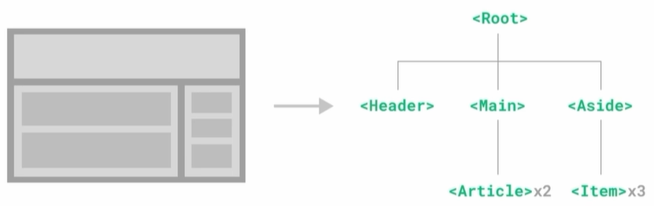

组件化开发可以让开发者搭积木一样构建一个完整的庞大的应用。

在 React 中，一个组件就是**首字母大写的函数**，内部存放了组建的逻辑和视图 UI，渲染组件只需要把组件**当成标签书写**即可。

 ```jsx
 // 1.定义组件
 function Button() {
   return <button>click me!</button>
 }
 
 function App() {
   return (
     <div className="App">
       {/* 2.使用组件。两种方式：自闭和、成对标签 */}
       <Button />
       <Button></Button>
     </div>
   )
 }
 
 export default App
 ```

注：【定义组件】的函数也可以使用【箭头函数】，只需保证【组件的首字母大写】即可！

### useState

`useState` 是一个 React Hook （函数），它允许我们向组件添加一个**状态变量**，从而控制影响组件的渲染结果。

本质：和普通 JS 变量不同的是，状态变量一旦发生变化 组件的视图 UI 也会跟着变化（**数据驱动视图**）

用法示例

```js
const [count, setCount] = useState(0)
```

1. useState 是一个函数，返回值是一个数组
2. 数组中的第一个参数是状态变量，第二个参数是 set 函数 用来修改状态变量
3. useState 的参数将作为 count 的初始值

示例：计数器

```jsx
import { useState } from 'react'

function App() {
  // 1. 调用 useState 添加一个状态变量
  const [counter, setCounter] = useState(0)
  return (
    <div className="App">
      <h1>{counter}</h1>
      {/* 2. 在事件回调中通过 setCounter 修改变量 */}
      <button onClick={() => setCounter(counter + 1)}>+1</button>
    </div>
  )
}

export default App
```

### 修改状态的规则(2条)

1、**状态不可变**

解释：在 React 中，状态被认为是只读的，我们应该始终替换它而不是修改它，直接修改状态不能引发视图更新

比如：直接修改变量。变量被修改，但是视图不会重新渲染

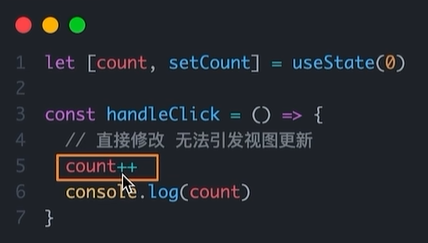

正确的做法是使用【回调钩子函数】修改它

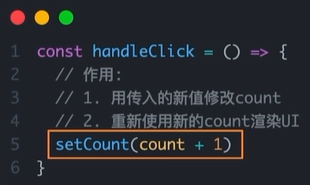

2、**修改对象状态**

规则：对于对象类型的状态变量，应该始终传给 set 方法一个**全新的对象**来进行修改

```jsx
import { useState } from 'react'

function App() {
  const [user, setUser] = useState({
    name: 'Guo',
  })
  return (
    <div className="App">
      <h1>{JSON.stringify(user)}</h1>
      <button
        onClick={() =>
          setUser({              // 传递新对象
            ...user,
            age: 18,
          })
        }
      >
        update
      </button>
    </div>
  )
}

export default App
```

注意：如果传递【老对象】则不会触发视图更新，比如

```jsx
<button onClick={() => {
    user.name = 'M'
    setUser(user)
  }}> update </button>
```

### 组件样式处理

React 组件基础的样式控制有两种方式

1. 行内样式（不推荐）
2. class 类名控制

行内样式

```jsx
<div style={{ color: 'red' }}>this shows inline style</div>
// 这里可以将【样式】提取成一个变量，方便维护和复用
```

class 类名控制。`index.css` 和 `App.js`

```css
.font_color {
  color: red;
}
```

```jsx
import './index.css'

function App() {
  return (
    <div>
      {/* 属性名为【className】而非【class】！ */}
      <div className="font_color">this is div</div>
    </div>
  )
}

export default App
```

### 实战-1.1

`B 站评论列表`

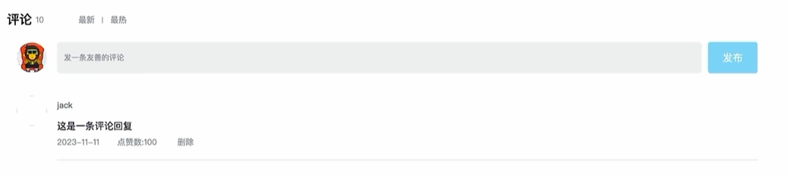

1. 渲染评论列表。数据使用 useState 维护
2. 删除评论实现。只能删除自己的评论（套件渲染），setState 重新渲染
3. 渲染导航 Tab 和高亮功能。核心思路：点击哪个 tab 就把它的 type 记录下来，然后和遍历时的每一项的 type 做匹配，谁匹配到就设置负责高亮的类名
4. 评论列表排序功能实现。使用第三方库 lodash 做排序

渲染导航 Tab 和高亮功能代码示例

```jsx
  const current_user_name = 'guo'
  const [list, setList] = useState(commentList)            // 动态渲染的评论列表
  function handleChangeTab(type) {
    changetTabType(type)
    if (type === 'hot') {
      setList(_.orderBy(list, 'like_number', 'desc')) // 使用 lodash 排序评论
    } else if (type === 'latest') {
      setList(_.orderBy(list, 'comment_date', 'desc'))
    }
  }
  const [current_tab_type, changetTabType] = useState('')       // 动态渲染的高亮页类型
  ...
  <div>
    <span>评论</span>
    <span style={{ marginRight: '20px', fontSize: 13 }}>{list.length}</span>
    {tabInfo.map((tabItem, index) => (
      <span
        key={index}
        onClick={() => handleChangeTab(tabItem.type)}
        className={current_tab_type === tabItem.type ? 'active' : ''}
        style={{ marginRight: '8px' }}
      >
        {tabItem.text}
      </span>
    ))}
  </div>
```

### 使用classNames工具优化类名控制

<https://github.com/JedWatson/classnames>

用法：

```jsx
// 原来的写法
<p className={`nav-item ${cur_type === item.type && 'active')}`}></p>

// 使用 classNames 工具控制类名。更直观
<p className={classNames('nav-item', 'active': cur_type === item.type)}></p>
```

### 表单受控绑定

```jsx
//思路
// 1. 使用 useState 声明一个 react 状态
// 2. 核心绑定流程
//    2.1 通过 value 属性绑定 react 状态
//    2.2 绑定 onChange 事件 通过事件参数 e 拿到输入框的最新值 反向修改到 react 状态


//示例
  var [currentInputValue, setInputValue] = useState('') 
<input
    value={currentInputValue}
    onChange={(e) => setInputValue(e.target.value)}
    placeholder={current_user_name + '，来发一条友善的评论吧~'}
    style={{ width: 'calc(100vw - 100px)' }}
></input>

// 1. 修改组件中的内容，查看内存中 currentInputValue 是否改变（需要安装 react 开发者工具）
//经验证，观察到改变了

// 2. 分别修改 currentInputValue、setInputValue 查看输入框是否改变
//1）currentInputValue = 'abc' // 无法修改输入框的显示值
//2）setInputValue('abc')      // 可以修改输入框的显示值
```

### React中获取DOM

流程

1. 使用 **useRef** 生成 ref 对象，将其**绑定**到目标 dom 标签身上
2. 当 dom 可用（**渲染完毕后**）时，`ref.current` 获取 dom

示例

```jsx
import { useRef } from 'react'

function App() {
  const inputRef = useRef(null)
  return (
    <div>
      <input ref={inputRef}></input>
      <button
        onClick={() => {
          console.dir(inputRef.current)
        }}
      >
        获取value
      </button>
    </div>
  )
}

export default App
```

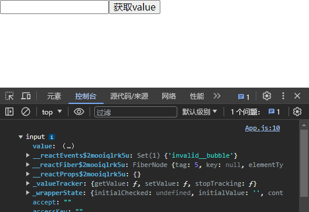

### 实战-1.2

1. 评论发布功能（输入框中评论的获取，以及点击发布按钮发布评论）
2. 时间优化（使用 [dayjs](https://dayjs.gitee.io/docs/zh-CN/display/format) 库进行时间格式化）
3. 发布评论时清空评论与重新聚焦（利用 useRef 获取输入框 dom 进行 refocus）

### 组件通信

组件通信就是**组件之间的数据传递**，根据组件嵌套关系的不同，有不同的通信方法

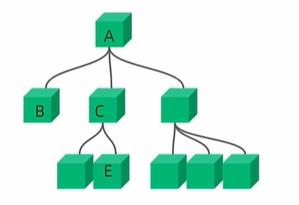

组件之间有不同的关系，对应的，有不同的通信方法：

1. `A-B` 父子通信
2. `B-C` 兄弟通信
3. `A-E` 跨层通信

#### 父子通信

**父传子 —— 基础实现**

实现步骤

1. 父组件传递数据 —— 在子组件标签上**绑定属性**
2. 子组件接收数据 —— 子组件通过 **props 参数**接收数据

```jsx
// 2. 通过参数接收数据
function Son(props) {
  console.log('properties:', props) // 对象
  console.log('properties:', props.name) // 其中包括我们传递的数据
  return <div style={{ backgroundColor: '#eee' }}>SON</div>
}

function App() {
  var name = 'Guo'
  return (
    <div>
      {/* 1. 传递属性 */}
      <Son name={name} />
    </div>
  )
}

export default App
```

**注意点**

**1、可以传递到子组件的数据类型有：数字、字符串、布尔值、数组、对象、函数、JSX**

```jsx
  <Son
    name={name}
    age={20}
    isTrue={true}
    list={['Vue', 'React']}
    obj={{ name: 'jack' }}
    callback={() => console.log(123)}
    child={<span>this is span element.</span>}
  />
```

总结：想传啥就传啥，非常灵活

**2、子组件获取到的 props 是只读对象**

子组件只能读取 props 中的数据，不能直接进行修改，父组件的数据只能由父组件修改

🍬 扩展：特殊的 prop —— children

当我们把内容嵌套在子组件标签中时，父组件会自动在名为 children 的 prop 属性中接收该内容

```jsx
<Son>
  <span>this is span ele.</span>
</Son>

...

function Son(props) {
  console.log('properties:', props)
  return <div style={{ backgroundColor: '#eee' }}>SON. {props.children}</div>
}
```

**子传父**

原理：将回调函数作为参数传递到子组件中，子组件通过回调函数的参数将数据传递到父组件

```jsx
function Son(props) {
  // 2. 利用 props 中的函数回调将数据传递到父组件
  return (
    <div>
      <button onClick={() => props.onSetMsg('this is from Son.')}>
        upload
      </button>
    </div>
  )
}

function App() {
  const setMsg = (msg) => {
    console.log('msg is:', msg)
  }
  return (
    <div>
      {/* 1. 将【函数】作为参数传递给子组件  */}
      <Son onSetMsg={setMsg}></Son>
    </div>
  )
}

export default App
```

思考：如何将子组件传递的数据展示在父组件中呢？

答：使用 useState 维护数据，在回调函数中更新数据

```jsx
function App() {
    // 使用 useState 维护数据
  const [msg, setMsgState] = useState('')
  const setMsg = (msg) => {
      // 每次更新数据时，重新设置以完成再次渲染
    console.log('msg is:', msg)
    setMsgState(msg)
  }
  return (
    <div>
      【{msg}】
      <Son onSetMsg={setMsg}></Son>
    </div>
  )
}
```

#### 使用【状态提升】实现兄弟组件通信

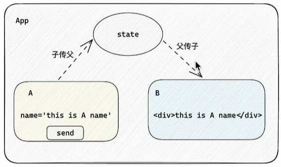

思路：状态提升，即通过父组件进行兄弟组件之间的数据传递

原理：父子组件通信

> 将 "状态" 提升到共同的父组件中，通过父组件完成桥接完成兄弟组件通信。

步骤：

1. A 组件先通过【子传父】的方式把数据传给父组件
2. 父组件拿到数据后通过【父传子】的方式再传递给 B 组件

示例：

```jsx
import { useState } from 'react'

function A(props) {
  return (
    <div>
      this is A.
      <button onClick={() => props.onSetMsg('菠萝菠萝蜜！')}>传给父组件</button>
    </div>
  )
}
function B(props) {
  return <div>b, msg from parent: {props.msg}</div>
}
function App() {
    // 定义“中间状态”
  const [msg, setMsgState] = useState('')
  const setMsg = (msg) => {
      // 父组件更新 组件A 传递来的数据
    setMsgState(msg)
  }
  return (
    <div>
      this is App.
      <A onSetMsg={setMsg} />
          { /* 将 状态 传递给组件B */ }
      <B msg={msg} />
    </div>
  )
}

export default App
```

#### 使用【Context机制】跨层级组件通信

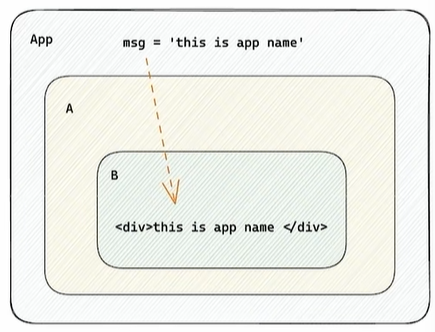

实现步骤：

1. 使用 createContext 方法创建一个上下文对象，假设命名为 Ctx
2. 在顶层组件 App 中通过 **Ctx.Provider 组件**提供数据
3. 在底层组件 B 中通过 **useContext** 钩子函数获取消费数据

示例

```jsx
import { createContext, useContext } from 'react'

// 1.
const msgCtx = createContext()

function B() {
  // 3.
  var msg = useContext(msgCtx)
  return <div>this is B component. msg is: {msg}</div>
}

function A() {
  return (
    <div>
      this is A component.
      <B />
    </div>
  )
}

function App() {
  return (
    <div>
      this is App.
      {/* 2. */}
      <msgCtx.Provider value={'阿弥陀佛~'}>
        <A />
      </msgCtx.Provider>
    </div>
  )
}

export default App
```

注意点：只要形成了【嵌套关系】都可以使用这套机制，比如【父子】、【远亲】等

### useEffect

概念理解：useEffect 是一个 React Hook 函数，用于在 React 组件中创建**由渲染本身引起的**操作，比如发送 Ajax 请求，修改 Dom 等。

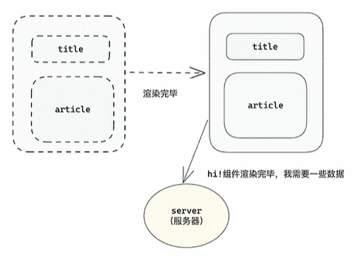

> 上面的组件中没有发生任何的用户事件，**组件渲染完毕之后**就需要和服务器要数据，整个过程属于 “**只由渲染引起的操作**”。

语法

```js
useEffect(() => { }, [])
```

参数 1：是一个函数，可以把它叫做**副作用函数**，在函数内部可以放置要执行的操作

参数 2：是一个可选参数，数组类型，在数组里放置**依赖项**，不同依赖项会影响第一个参数函数的执行。当是一个空数组时，副作用函数只会在组件渲染完毕后执行一次

示例：在组件渲染完毕之后，立刻从服务端获取频道列表数据并显示到页面中

```jsx
import { useEffect, useState } from 'react'

function App() {
  const [list, setList] = useState([])
  
  useEffect(() => {
    async function reqList() {
      const rsp = await fetch('https://jsonplaceholder.typicode.com/users')
      const userList = await rsp.json()
      console.log(userList)
      setList(userList)
    }
    reqList()
  }, [])

  return (
    <div>
      <ol>
        {list.map((item, idx) => (
          <li key={idx}>{item.name}</li>
        ))}
      </ol>
    </div>
  )
}

export default App
```

#### 不同依赖项说明

useEffect 函数的一个参数即副作用函数的执行时机存在多种情况。根据传入依赖项的不同，会有不同的执行表现：

| 依赖项         | 副作用函数执行时机              |
| -------------- | ------------------------------- |
| 省略           | 组件初始渲染 + 组件更新时       |
| 空数组         | 组件初始渲染                    |
| 添加特定依赖项 | 组件初始渲染 + 特定依赖项变化时 |

示例

```jsx
import { useEffect, useState } from 'react'

function App() {
  const [count, setCount] = useState(0)
  // 1. 没有依赖项 => 初始 + 组件更新
  // useEffect(() => {
  //   console.log('副作用函数执行了')
  // })

  // 2. 传入空数组依赖项 => 初始执行一次
  // useEffect(() => {
  //   console.log('副作用函数执行了')
  // }, [])

  // 3. 传入特定依赖项 => 初始 + 依赖项变化时执行
  useEffect(() => {
    console.log('副作用函数执行了')
  }, [count])
  return (
    <div>
      <div>{count}</div>
      <button onClick={() => setCount(count + 1)}>+1</button>
    </div>
  )
}

export default App
```

#### 清除副作用

在 useEffect 中编写的由渲染本身引起的对接组件外部的操作，社区也经常把它叫做**副作用操作**。

比如在 useEffect 中开启了一个定时器，我们想在组件卸载时把这个定时器再清理掉，这个过程就是清理副作用。

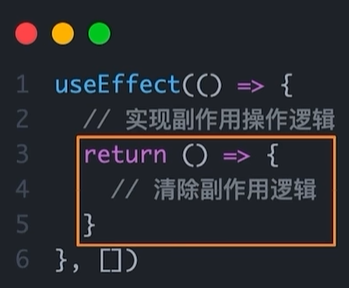

说明：清理副作用的函数**最常见**的执行时机是**组件卸载时自动执行**。

示例：在 Son 组件渲染时开启一个定时器，卸载时清除这个定时器

```jsx
import { useEffect } from 'react'

function Son() {
  useEffect(() => {
    const timer = setInterval(() => {
      console.log('定时器执行中...')
    }, 1000)
    // 清理【副作用】。这里用来清理定时器，否则组件卸载时定时器不会自动结束
    return () => {
      clearInterval(timer)
    }
  }, [])
  return <div>this is Son component.</div>
}

function App() {
  return (
    <div>
      <Son />
      <button onClick={() => {}}>卸载Son组件</button>
    </div>
  )
}

export default App
```

### 自定义hook封装通用逻辑

概念：自定义 Hook 是以 **use 打头的函数**，通过自定义 Hook 函数可以用来实现**逻辑的封装和复用**

通用逻辑：

1. 声明一个以 use 打头的函数
2. 在函数体内封装可复用的逻辑（只要是可复用的逻辑）
3. 把组件中用到的状态或者回调 return 出去（以对象或数组的形式）
4. 在哪个组件中要用到这个逻辑，就执行这个函数，解构出来状态和回调进行使用

示例：折叠器，用来展示和隐藏一个 div 元素

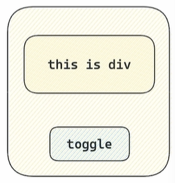

1、直接实现

```jsx
import { useState } from 'react'

function App() {
  const [showEle, changeEleState] = useState(true)
  const toggle = () => changeEleState(!showEle)
  return (
    <div>
      {showEle && <div>this is div.</div>}
      <button onClick={toggle}>toggle</button>
    </div>
  )
}

export default App
```

问题：布尔切换逻辑和当前组件耦合在一起，不方便复用

2、改进，封装自定义 Hook 实现

```jsx
import { useState } from 'react'

// 自定义 hook
function useToggle() {
  // 可复用的逻辑代码
  const [showEle, changeEleState] = useState(true)
  const toggle = () => changeEleState(!showEle)
  // 返回需要在其他组件中使用的状态和回调函数
  return { showEle, toggle }
}

function App() {
  const { showEle, toggle } = useToggle()
  return (
    <div>
      {showEle && <div>this is div.</div>}
      <button onClick={toggle}>toggle</button>
    </div>
  )
}

export default App
```

### React Hooks 使用规则

React Hooks：React 提供的钩子函数，比如 useState, useEffect

使用规则：

1. 只能在组件中或其他自定义 Hook 函数中调用
2. 只能在组件的顶层调用，不能嵌套在 if、for 或其他函数中

不能再组件外调用 React Hook，比如：

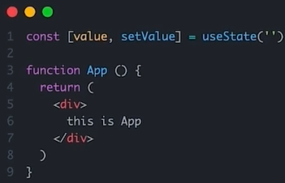

不能在 if 语句中调用 React Hook，比如：

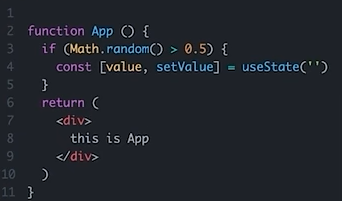

### 实战-1.3

1. 使用请求接口的方式获取评论列表并渲染（useEffect 初次渲染时使用 axios 请求数据）
2. 使用自定义 Hook 函数封装数据请求的逻辑
3. 把评论中每一项抽象成一个独立的组件实现渲染

```jsx
// const [list, setList] = useState(commentList)

// 使用请求获取数据
const [list, setList] = useState([])
useEffect(() => {
  async function getList() {
    const rsp = await axios.get('https://jsonplaceholder.typicode.com/users')
    console.log(rsp)
    setList(commentList)
  }
  getList()
}, [])
```

```jsx
// 自定义 hook 封装逻辑
function useGetData() {
  const [list, setList] = useState([])
  useEffect(() => {
    async function getList() {
      const rsp = await axios.get('https://jsonplaceholder.typicode.com/users')
      console.log(rsp)
      setList(commentList)
    }
    getList()
  }, [])
  return { list, setList }
}

function App() {
    ...
  const { list, setList } = useGetData()
    ...
}
```

```jsx
// 【评论项】组件
function CommentItem(props) {
  const { comment, current_user_name, deleteCommentOfIdx } = props
  return (
    <div>
      <div style={{ marginTop: '30px', display: 'flex', alignItems: 'center' }}>
        
        <div style={{ marginLeft: '10px', display: 'inline-block' }}>
          <p>{comment.user_name}</p>
          <p
            style={{
              fontSize: '21px',
              fontWeight: 360,
              marginBottom: '4px',
              marginTop: '8px',
            }}
          >
            {comment.comment}
          </p>
          <div id="comment-meta-info">
            <span>{comment.comment_date}</span>
            <span>{comment.like_number}点赞</span>
            {current_user_name === comment.user_name && (
              <button onClick={() => deleteCommentOfIdx(index)}>删除</button>
            )}
          </div>
        </div>
      </div>
      <p
        style={{
          margin: '10px 6px 10px 70px',
          border: '1px solid #eee',
        }}
      ></p>
    </div>
  )
}

...
{list.map((comment, index) => (
    <CommentItem
      key={index}
      comment={comment}
      deleteCommentOfIdx={deleteCommentOfIdx}
      current_user_name={current_user_name}
    />
))}
```

组件抽象：“智能组件” 负责数据的获取，“UI组件” 负责数据的渲染
