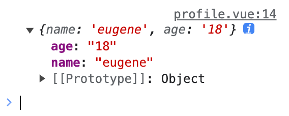
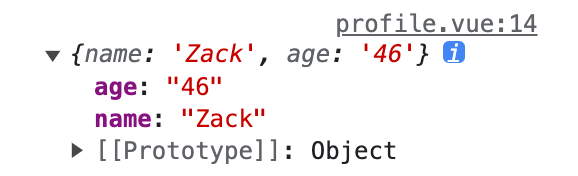
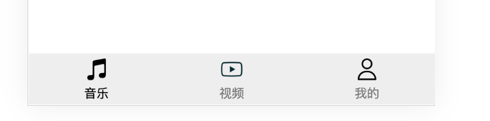
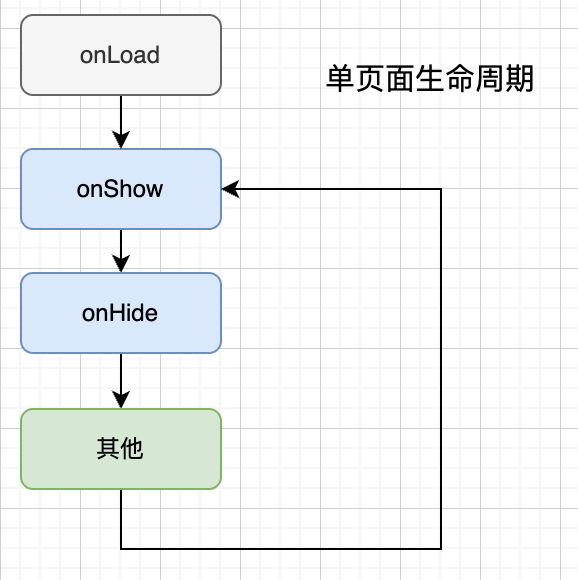
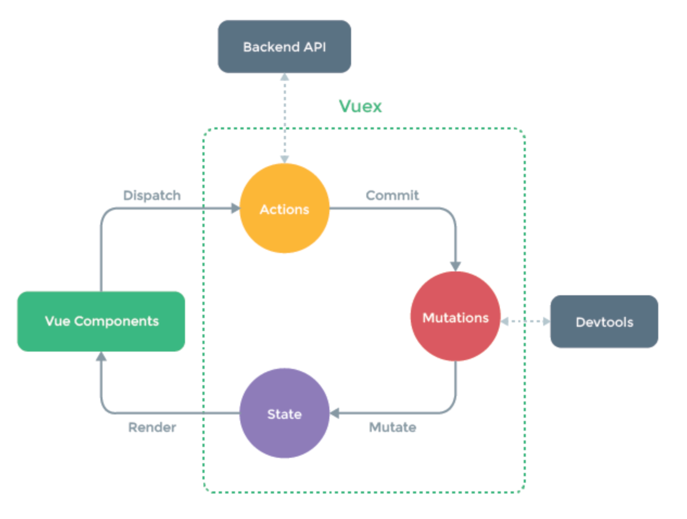

# Uniapp 入门

<https://uniapp.dcloud.net.cn/>

- 使用 [Vue.js](https://vuejs.org/) 开发所有前端应用的框架

- 开发者编写一套代码，可发布到iOS、Android、Web（响应式）、以及各种小程序（微信/支付宝/百度/头条/飞书/QQ/快手/钉钉/淘宝）、快应用等多个平台。
- 周边生态丰富

## 发送请求

```js
  methods: {
   getMsg(msg) {
    console.log('getMsg:', msg);
   },
   async loadData() {
    console.log('loading....');
    // 发送请求：https://uniapp.dcloud.net.cn/api/request/request.html
    var result = await uni.request({
     url: 'https://jsonplaceholder.typicode.com/users',
     method: 'GET'
    })
    if (result.statusCode === 200) {
     console.log(result.data);
    } else {
     console.log(result.statusCode);
    }
   }
  }
```

## 值传递（vue）

**子组件**

```vue
<template>
 <view class="content">
  <button type="primary" @click="sendMsg">Click Me</button>
 </view>
</template>

<script>
 export default {
  props: {        // 父 -> 子
   name: String
  },
  data() {
   return {}
  },
  methods: {
   sendMsg() {
    // 子 -> 父
    this.$emit('getMsg', '我是' + this.name + '的子')
   }
  }
 }
</script>
```

补充：`props` 详细写法

```vue
<script>
 export default {
  props: {
   name: {
        type: String,
    require: false,
        default: ''
      }
  }
 }
</script>
```

**父组件**

```vue
<template>
 <view class="content">
  <mybutton :name="name" @getMsg="getMsg"></mybutton>
 </view>
</template>

<script>
 import mybutton from '@/components/mybutton.vue'
 export default {
  components: {
   mybutton
  },
  data() {
   return {
    name: 'index'
   }
  },
  methods: {
   getMsg(msg) { // 接收来自子的消息
    console.log('getMsg:', msg);
   },
    }
  }
</script>
```

其他 Vue 语法练习：v-for 等

## 使用 iconfont.cn 的图标

购买 =》购物车下载代码

解压到 `@/common/font/` 目录中

在 App.vue 中引入图标

```vue
<style>
 @import './common/font/iconfont.css'
</style>
```

修改 `iconfont.css` 中的资源引用路径

```css
@font-face {
 font-family: "iconfont";
 src: url('iconfont.ttf?t=1695827670465') format('truetype');
}

 |
改为(以 App.vue 为根修改相对路径)
 ↓

@font-face {
 font-family: "iconfont";
 src: url('common/font/iconfont.ttf?t=1695827670465') format('truetype');
}
```

使用

```html
<button><i class="iconfont">&#xe648;</i></button>
<button><i class="iconfont">&#xe649;</i></button>  
```

## 页面跳转

[navigateto](https://uniapp.dcloud.net.cn/api/router.html#navigateto): 保留当前页面，跳转到应用内的某个页面，使用`uni.navigateBack`可以返回到原页面。

```vue
<template>
 <view class="content">
  <button type="primary" @click="goToProfilePage">去我的主页</button>
 </view>
</template>

<script>
 export default {
  methods: {
   goToProfilePage() {
    uni.navigateTo({
     url: '../profile/profile'
    })
   }
  }
 }
</script>
```

**参数如何传递？**

```vue
<script>
 export default {
  data() {
   return {
    name: 'eugene',
    age: 18
   }
  },
  methods: {
   goToProfilePage() {
    uni.navigateTo({
          // 格式：[相对路径 + ?k1=v1&k2=v2...]
     url: '../profile/profile' + '?name=' + this.name + '&age=' + this.age
    })
   }
  }
 }
</script>
```

> onLoad(options) 的参数是其他页面打开当前页面所传递的数据
>
> [https://uniapp.dcloud.net.cn/tutorial/vue3-api.html#_2-如何设置全局的数据和全局的方法](https://uniapp.dcloud.net.cn/tutorial/vue3-api.html#_2-如何设置全局的数据和全局的方法)

```vue
<script>
 export default {
  onLoad(data) { // 接收
   console.log(data);
  }
 }
</script>
```

打印结果：接收到对象，其中所有 value 都是字符串类型



如果传递对象的话需要进行序列化和反序列化处理.

```js
uni.navigateTo({
  url: '../profile/profile' + '?obj=' + JSON.stringify({
    name: 'Zack',
    age: '46'
  })
})

 ↓

onLoad(data) {
  console.log(JSON.parse(data.obj));
}
```



## 底部工具栏

```json
{
  "tabBar": {
  "backgroundColor": "#eee",
  "color": "gray",
  "borderStyle": "white",
  "selectedColor": "black",
  "list": [{
   "text": "音乐",
   "pagePath": "pages/music/music",
   "iconPath": "static/tab/music_1.png",
   "selectedIconPath": "static/tab/music_2.png"
  }, {
   "text": "视频",
   "pagePath": "pages/index/index",
   "iconPath": "static/tab/video_1.png",
   "selectedIconPath": "static/tab/video_2.png"
  }, {
   "text": "我的",
   "pagePath": "pages/mine/mine",
   "iconPath": "static/tab/mine_1.png",
   "selectedIconPath": "static/tab/mine_2.png"
  }]
 }
}
```



## 页面生命周期

<https://uniapp.dcloud.net.cn/tutorial/page.html#lifecycle>

> 其他：
>
> - [应用生命周期](https://uniapp.dcloud.net.cn/collocation/App.html#applifecycle)，有 onLaunch, onShow, onHide 等等
> - [组件生命周期](https://uniapp.dcloud.net.cn/tutorial/page.html#componentlifecycle)，即 Vue 组件的生命周期

常见的页面生命周期钩子：

- onLoad：页面加载，通常只加载一次
- onShow：页面显示
- onHide：页面隐藏



## 整合 vuex

[vuex](https://vuex.vuejs.org/zh/)：单页应用中的缓存（不能应用于多页面），用于缓存不经常发生变化的数据。

**使用 vuex 提供的数据之 state**

创建文件 `@/store/index.js`

```js
//import Vue from 'vue'
import Vuex from 'vuex'

//Vue.use(Vuex)

const store = new Vuex.Store({
 state: {
  name: "Eugene"
 }
})

export default store
```

在 `main.js` 中引入

```js
import store from './store/index.js'
//Vue.prototype.$store = store

app.use(store) // Vue3
```

在`index.vue` 中使用 state 中定义的数据

```vue
<template>
 <view class="content">
  <view class="">
   {{name}}
  </view>
 </view>
</template>

<script>
 import { mapState } from 'vuex'
 export default {
  data() {
   return {
    title: 'Hello'
   }
  },
  computed: {
   ...mapState(['name'])
  }
 }
</script>
```

> 注意：上边三个代码片段适用于 vue3。若要应用于 vue2，需要将注释打开，并将 `app.use(store)` 注释掉

**修改 state 中的数据**

```js
const store = new Vuex.Store({
 state: {
  name: "Eugene"
 },
 mutations: {
  setName(state, payload) {     // 添加方法，用来改变 state 中的数据
   state.name = payload
  }
 }
})
```

```vue
<template>
 <view class="content">
  <view>name: {{name}}</view>
  <br><hr><br>
  <input type="text" v-model="input_name">
  <button @click="changeName">change name</button>
 </view>
</template>

<script>
 import {
  mapState
 } from 'vuex'
 export default {
  data() {
   return {
    input_name: ''
   }
  },
  computed: {
   ...mapState(['name'])
  },
  methods: {
   changeName() {
    this.$store.commit('setName', this.input_name) // 修改
   }
  }
 }
</script>
```

**Vuex 工作原理**



## 实战 - 音乐app

todo
