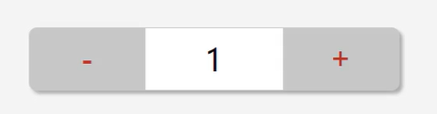
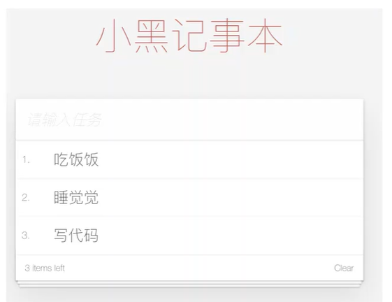
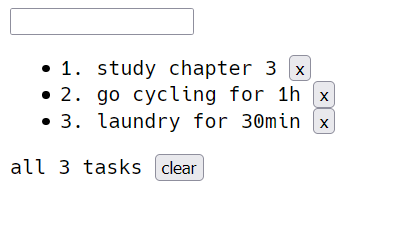
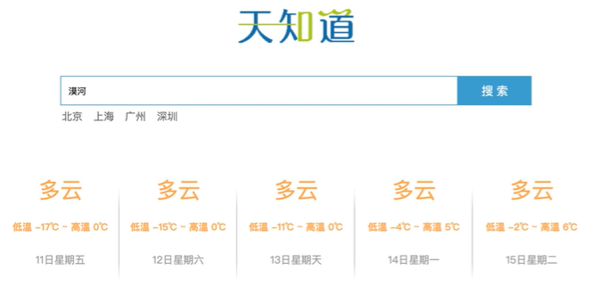
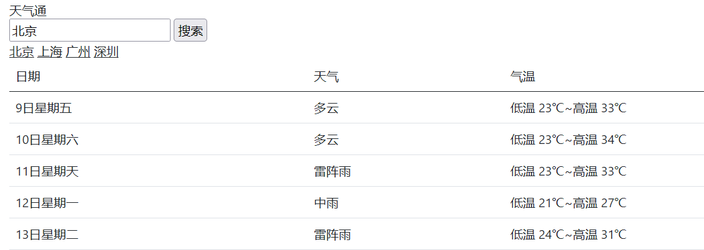
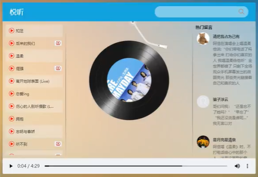
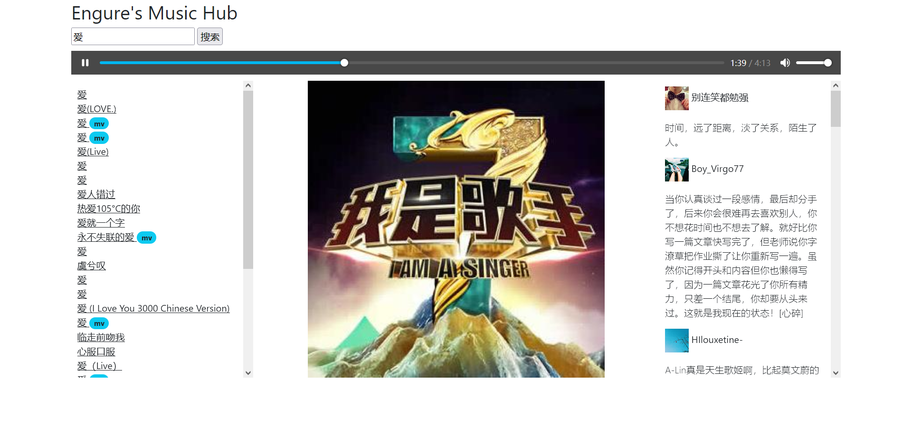
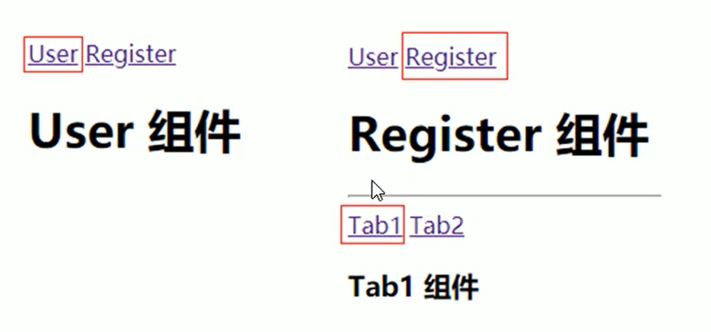

# Vue2 入门

- [教程](https://www.bilibili.com/video/BV12J411m7MG)
- [另一个课程笔记-1](https://juejin.cn/post/7283780768944619583)
- [另一个课程笔记-2](https://juejin.cn/post/7283766792035942454)

## Vue 基础

### Vue简介

特点：

1. JavaScript框架
2. 简化Dom操作
3. 响应式数据驱动

**引入依赖，第一个程序：**

```html
<div id="app">
  {{ message }}
</div>

<script src="https://cdn.jsdelivr.net/npm/vue/dist/vue.js"></script>
<script>
    var app = new Vue({
      el: '#app',
      data: {
        message: 'Hello Vue!'
      }
    })
</script>
```

**el：挂载点，挂载 vue 实例**

 1. Vue实例的作用范围是什么？Vue会管理 el 选项**命中的元素**及其内部的**后代元素**
 2. 是否可以使用其他选择器？可以使用其他选择器（类、标签），但是建议使用 ID 选择器
 3. 是否可以设置其他的 dom 元素呢？可以使用其他的**双标签**，不能使用 HTML 和 BODY 标签

**data：数据对象**

 1. Vue 中用到的数据定义在 data 中
 2. data 中可以写**复杂类型**的数据，比如对象、数组类型
 3. 渲染复杂类型数据时，遵守 **js 语法**即可

```html
<div id="app">
    {{ msg }}
    <h2> {{ person.name }} {{ person.age }} </h2>
    <ul>
        <li>{{ tasks[0] }}</li>
        <li>{{ tasks[1] }}</li>
    </ul>
</div>

<script src="https://cdn.jsdelivr.net/npm/vue/dist/vue.js"></script>
<script>
    var app = new Vue({
        el: "#app",
        data: {
            msg: "你好 小黑！",
            person: {
                name: 'engure',
                age: 22
            },
            tasks: ['算法', 'vue', '八股文']
        }
    })
</script>
```

### 本地应用 ⭐

1. 通过Vue实现常见的网页效果
2. 学习Vue指令

#### v-text

```html
<h2 v-text="message"></h2>
```

设置标签的文本值，替换标签中的**全部内容**

指令后可以写表达式：`v-text="message+123"`，注意其中的 **+** 不能省略

**部分替换**：使用插值表达式 `<h2>msg: {{ msg }}</h2>`
另外，插值表达式中还可以使用**表达式**，比如 `{{msg + '!'}}` 为字符串拼接

#### v-html

相当于**innerHTML**属性

1. v-html指令作用：设置元素的**innerHTML**
2. 内容中有**html**结构会被解析为**标签**
3. v-text指令无论内容是什么，只会解析**文本**
4. 解析文本使用**v-text**，需要解析html结构使用**v-html**

#### v-on

作用：为元素绑定事件

```html
<p id="app" v-on:click="methodName">
    xxxxx
</p>

<script>
 var app = new Vue({
        el:"#app",
        methods: {
            methodName: function(){
                //logic code
            }
        }
    })
</script>
```

1. 绑定事件：v-on:click、v-on:mouseenter、v-on:dblclick（双击）
2. 事件名不用写 **on**
3. 使用 v-on 的**简写** `@`，比如 v-on:click 相当于 `@click`
4. 绑定的方法在 **methods** 属性中
5. 不用关心 dom 操作，应该重点关注数据的变化，方法中使用 **this** 引用当前实例 **data** 中的数据

#### v-on补充

<https://cn.vuejs.org/v2/api/#v-on>

**1. 自定义参数**

```html
<div id="app">
    <input type="button" value="click" @click="me(100,'this-is-a-string')" />
</div>

<script>
    var app = new Vue({
        el: "#app",
        methods: {
            me: function(p1, p2) { //定义接受参数
                alert(p1 + ',' + p2)
            }
        },
    })
</script>
```

**2. 事件修饰符**

```html
<div id="app">
    <input @keyup.enter="ok()" /> <!-- 键修饰符.键别名，监听此键的动作 -->
</div>

<script src="https://cdn.jsdelivr.net/npm/vue/dist/vue.js"></script>
<script>
    var app = new Vue({
        el: "#app",
        methods: {
            ok: function() {
                alert('now, ok to your enter!')
            }
        },
    })
</script>
```

使用 `@keyup=method()` 表示监听此元素的键盘事件

1. 事件绑定的方法写成 **函数调用** 的形式，即可以传入自定义参数
2. 定义方法时需要定义 **形参** 来接收传入的实参
3. 时间的后面跟上 **.修饰符** 可以对事件进行限制
4. **@keyup.enter** 可以限制出发的按键为回车
5. 事件修饰符有多种

#### 计数器

实现一个简单的计数器



```html
<div id="app">
    <button @click="sub"><h2>-</h2></button>
    <span v-text="counter"></span>
    <button @click="add"><h2>+</h2></button>
</div>


<script src="https://cdn.jsdelivr.net/npm/vue/dist/vue.js"></script>
<script>
    var app = new Vue({
        el: "#app",
        data: {
            counter: 0
        },
        methods: {
            sub: function() {
                if (this.counter > 0) this.counter--;
                else alert("别减了，到零了！")
            },
            add: function() {
                if (this.counter < 10) this.counter++;
                else alert("别加了，到10了")
            }
        },
    })
</script>
```

总结：

1. 创建Vue实例：**el**（挂载点），data（数据），**methods**（方法）
2. v-on指令的作用是绑定事件，简写为 **@**
3. 方法中通过 **this**关键字获取 **data** 中的数据
4. **v-text** 指令的作用是：设置元素的文本值，简写为 **{{ }}**
5. **v-html** 指令的作用是：设置元素的 **innerHTML**

#### v-show

```html
<p v-show="false">
    xxxx（不被显示）
</p>
```

根据表达式的真假，切换元素的显示和隐藏

本质：切换元素的 **display**，`display: none` 表示不显示

指令后的内容可以写表达式，比如 `v-show="age>=18"`

1. 作用：根据**真假**切换元素的显示与隐藏，原理是修改元素的display
2. 指令后的内容，最终都会被解析为**布尔值**
3. 数据变化后，对应元素的显示状态会同步更新

#### v-if

根据表达式的真假，切换元素的显示和隐藏

与 **v-show** 很相似，区别是 **操作 dom 元素**

指令后的内容可以使用表达式，比如 `v-if='temperature>=35'`

**操作 dom树 比较消耗性能**，因此：

1. 频繁使用 显示/隐藏 功能的元素 使用 **v-show** 指令
2. 不频繁使用的使用 **v-if** 指令

#### v-bind

设计元素的属性，比如 **src, title, class**

使用 **简写 :**  `v-bind:src="" ==> :src=""`

```html
<div id="app">
    
    <p :class="isActive?'active':''">check check now!</p>
    <!-- 推荐使用对象的方式代替三元表达式 -->
    <p :class="{active:isActive}">check check now!</p>
</div>

<script src="https://cdn.jsdelivr.net/npm/vue/dist/vue.js"></script>
<script>
    var app = new Vue({
        el: "#app",
        data: {
            imgUrl: "./img/a6.png",
            title: "avatar6",
            isActive: true
        }
    })
</script>
```

1. **v-bind** 指令作用：为元素绑定属性
2. 完整写法：**v-bind:属性名**
3. 简写时直接省略 **v-bind**，只保留 **:属性名**
4. 需要动态增删 **class** 建议使用对象的方式

#### 图片切换

```html
<div id="app">
    <button @click="prev" v-show="index>0"><h2> prev </h2></button>
    
    <button @click="next" v-show="index<imgs.length-1"><h2> next </h2></button>
</div>

<script src="https://cdn.jsdelivr.net/npm/vue/dist/vue.js"></script>
<script>
    var app = new Vue({
        el: "#app",
        data: {
            index: 0,
            imgs: ['./img/a1.png',
                './img/a2.png',
                './img/a3.png',
                './img/a4.png',
                './img/a5.png',
                './img/a6.png'
            ]
        },
        methods: {
            prev: function() {
                this.index--;
            },
            next: function() {
                this.index++;
            }
        },
    })
</script>
```

1. **v-on** 用作事件绑定，简写成 **@**
2. **v-bind** 用于设置属性，简写成 **:**
3. **v-show** 用于控制 显示与隐藏，与 **v-if** 略有不同
4. Vue实例方法中访问 **data** 需要使用 **this** 关键字

#### v-for

```html
<li v-for="item in arr" :title="item">
 {{ item }}
</li>
<!-- 使用索引 -->
<li v-for="(item,index) in arr" :title="item+index">
 {{ index }} {{ item }}
</li>
<!-- 遍历对象数组 -->
<li v-for="(item,index) in objArr" :title="item.name+index">
 {{ index+1 }} {{ item.name }} {{ item.age }}
</li>

<script>
 var app = new Vue({
        el:"#app",
        data:{
            arr:['jack','kavin','kate','randle'],
            objArr:[
                {name:'jor', age:35},
                {name:'rose', age:40}
            ]
        }
    })
</script>
```

1. **v-for** 指令的作用：根据数据生成列表结构
2. 数组经常和 **v-for** 结合使用
3. 语法是 **(item, index) in 数据**
4. item 和 index 可以结合其他指令一起使用
5. 数组长度的更新会**同步**到页面上，是**响应式**的

#### v-model

获取和设置**表单**元素的值（**双向元素绑定**）

```html
<div id="app">

    <input v-model="msg" />
    <h3>{{ msg }}</h3>

</div>

<script src="https://cdn.jsdelivr.net/npm/vue/dist/vue.js"></script>
<script>
    var app = new Vue({
        el: "#app",
        data: {
            msg: "你好 小黑！"
        }
    })
</script>
```

1. **v-model** 指令的作用是便捷的设置和获取 **表单元素** 的值
2. 绑定的数据会和表单元素 **值** 相关联
3. 绑定的数据 **<—>** 表单元素的值

### 本地记事本



```html
<!DOCTYPE html>

<div id="app">
    <input v-model="newtask" @keyup.enter="keep" />
    <ul>
        <li v-for="(item,index) in tasks">
         <label> {{ index+1 }}.</label> {{ item }}
            <button @click="del(index)">x</button>
        </li>
    </ul>
    <div v-show="tasks.length != 0">
        <label>all {{tasks.length}} tasks</label>
        <button @click="clear">clear</button>
    </div>
</div>

<script src="https://cdn.jsdelivr.net/npm/vue/dist/vue.js"></script>
<script>
    var app = new Vue({
        el: "#app",
        data: {
            newtask: "",
            tasks: ['study chapter 3', 'go cycling for 1h', 'laundry for 30min']
        },
        methods: {
            keep: function() { // add new task
                if (this.newtask.length != 0) {
                    this.tasks.push(this.newtask);
                    this.newtask = "";
                }
            },
            del: function(index) { // remove tasks[index]
                this.tasks.splice(index, 1) // (start, deleteCount, ..)
            },
            clear: function() { // remove all
                if (this.tasks.length != 0) this.tasks.splice(0)
            }
        },
    })
</script>
```

包含：回车增加、删除某一任务、清空，列表展示，

UI：



**总结：**

1. 列表结构可以通过 **v-for** 指令结合数据生成
2. **v-on** 结合时间修饰符可以对事件进行限制，比如 **.enter**
3. **v-on** 再绑定事件时可以传递自定义参数，比如 `@click=del(index)`
4. 通过 **v-model** 可以快速地设置和获取表单元素的值
5. 基于 **数据** 的开发方式

## 网络应用

Vue 结合网络数据开发应用

1. axios 请求库
2. axios+vue
3. 天气预报案例

### Axios

<https://github.com/axios/axios>

对 ajax 的封装库

功能强大的网络请求库

```html
<script src="https://unpkg.com/axios/dist/axios.min.js"></script>
```

#### axios.get

```js
axios.get(url?key1=value&key2=value2)
          .then(function(resp){}, function(err){})
```

#### axios.post

```js
axios.post(url, {key1:value2, key2:value2})
  .then(function(resp){}, function(err){})
```

小案例：

```html
<button id='get'>get</button>
<button id='post'>post</button>

<script src="http://ajax.aspnetcdn.com/ajax/jQuery/jquery-1.8.0.js"></script>
<script src="https://unpkg.com/axios@0.21.1/dist/axios.min.js"></script>
<script>
    $('#get').on('click', function() {
        axios.get("https://autumnfish.cn/api/joke/list?num=3").then(
            function(resp) {
                console.log(resp)
            },
            function(err) {
                console.log(err)
            }
        )
    })
    $('#post').on('click', function() {
        axios.post("https://autumnfish.cn/api/user/reg", {
            username: "engure"
        }).then(
            function(resp) {
                console.log(resp)
            },
            function(err) {
                console.log(err)
            }
        )
    })
</script>
```

1. **axios** 必须先导入，通过 cdn
2. 使用 **get 或 post** 方法就可以放松对应的请求
3. **then** 方法中的回调函数会在请求成功或失败时触发（前一个成功方法，后一个是失败方法）
4. 通过回调函数的形参可以获取相应内容，或错误信息

### Axios+ Vue

```html
<div id="app">
    <button @click="getJ">获取笑话</button>
    <p> {{ joke }} </p>
</div>

<script src="https://cdn.jsdelivr.net/npm/vue/dist/vue.js"></script>
<script src="https://unpkg.com/axios@0.21.1/dist/axios.min.js"></script>
<script>
    var app = new Vue({
        el: "#app",
        data: {
            joke: "joke to show...."
        },
        methods: {
            getJ: function() {
                var _this = this;
                axios.get("https://autumnfish.cn/api/joke/").then(
                    function(resp) {
                        _this.joke = resp.data
                    },
                    function(err) {
                        _this.joke = err
                    },
                )
            }
        },
    })
</script>
```

1. **axios** 回调函数中的 **this** 已经改变，无法访问到 data 中的数据
2. 把 **this** 保存起来，回调函数中直接使用保存的 **this** 即可
3. 和本地最大的区别就是改变了 **数据来源**

### 天气查询案例



功能：搜索城市回车查询、点击热门城市查询天气

```html
<!DOCTYPE html>
<link href="https://cdn.jsdelivr.net/npm/bootstrap@5.0.2/dist/css/bootstrap.min.css" rel="stylesheet" integrity="sha384-EVSTQN3/azprG1Anm3QDgpJLIm9Nao0Yz1ztcQTwFspd3yD65VohhpuuCOmLASjC" crossorigin="anonymous">

<div id="app" class="container">

    <div class="">天气通</div>

    <div class="">
        <input class="" v-model="city" @keyup.enter="getW" />
        <input class="" type="button" @click="getW" value="搜索" />
    </div>

    <div>
        <a class="link-dark" href="javascript:;" @click="changeC('北京')">北京</a>
        <a class="link-dark" href="javascript:;" @click="changeC('上海')">上海</a>
        <a class="link-dark" href="javascript:;" @click="changeC('广州')">广州</a>
        <a class="link-dark" href="javascript:;" @click="changeC('深圳')">深圳</a>
    </div>

    <div class="">
        <table class="table">
            <thead>
                <td>日期</td>
                <td>天气</td>
                <td>气温</td>
            </thead>
            <tbody>
                <tr v-for="item in data.forecast">
                    <td>{{item.date}}</td>
                    <td>{{item.type}}</td>
                    <td>{{item.low}}~{{item.high}}</td>
                </tr>
            </tbody>
        </table>
    </div>
</div>

<script src="https://cdn.jsdelivr.net/npm/vue/dist/vue.js"></script>
<script src="https://unpkg.com/axios@0.21.1/dist/axios.min.js"></script>
<script>
    var app = new Vue({
        el: "#app",
        data: {
            city: "",
            data: {}
        },
        methods: {
            getW: function() {
                if (this.city.length == 0) return;
                var _this = this;
                axios.get("http://wthrcdn.etouch.cn/weather_mini?city=" + _this.city).then(
                    function(resp) {
                        _this.data = resp.data.data // 此处this的含义，用 a.b.c 获取目标数据
                    },
                    function(err) {
                        _this.data = {}
                    },
                )
            },
            changeC: function(city) {
                this.city = city;
                this.getW() // 通过 this. 调用其他方法
            }
        },
    })
</script>
```



1. 自定义参数可以让代码的 **复用性** 更高
2. **methods** 中定义的方法内部，可以通过 **this** 关键字点出其他方法 ⭐
3. 应用的逻辑代码建议和页面**分离**，使用**单独**的 js文件编写
4. **axios** 回调函数中 **this** 指向改变了，需要额外保存一份
5. 服务器返回的数据比较复杂是，获取的时候需要注意 **层级** 结构 ⭐## 综合应用 - 音乐播放器



功能：歌曲搜索、歌曲播放、歌曲封面、歌曲评论、播放动画、mv播放

### 歌曲搜索

接口：<https://autumnfish.cn/search>
方法：get
参数：keywords

1. 服务器返回的数据比较复杂时，获取的时候要注意 **层级**
2. 通过 **审查元素** 快速定位到需要操纵的元素

参考滚动列表：[html列表可滚动_walle的博客-CSDN博客_html滚动列表](https://blog.csdn.net/wuzuyu365/article/details/53911237/)

### 歌曲播放

接口：<https://autumnfish.cn/song/url>
方法：get
参数：id（歌曲 id）

### 歌曲封面

接口：<https://autumnfish.cn/song/detail>
方式：get
参数：ids（歌曲id）

### 歌曲评论

接口：<https://autumnfish.cn/comment/hot?type=0>
方法：get
参数：id（歌曲id，type固定为0）

### 播放动画

1. **audio** 标签的 **play** 事件会在音频播放的时候触发，`@play="play"`
2. audio 标签的 pause 时间会在音频暂停的时候触发，`@pause="pause"`

### 播放MV

接口：<http://autumnfish.cn/mv/url>
方法：get
参数：id（mvid，不为0）

```html
<div class="" v-show="isMvPlaying" style="display: none;">
        <video :src="mvUrl" class="video" controls="controls"></video>
        <div class="mask" @click="isMvPlaying = !isMvPlaying"></div>
</div>
```

编写遮罩层 mask，用于当点击 视频以外的内容时，关闭视频

```css
<style>
    .mask {
        height: 100%;
        width: 100%;
        background: rgba(0, 0, 0, 0.8);
        position: fixed;
        top: 0;
        left: 0;
        z-index: 980;
    }
    
    .video {
        position: fixed;
        width: 800px;
        height: 546px;
        left: 50%;
        top: 50%;
        margin-top: -273px;
        transform: translateX(-50%);
        z-index: 990;
    }
</style>
```

### 展示



**评论区**有很多 接口 和 Vue项目：<https://www.bilibili.com/video/BV12J411m7MG?p=36>

代码

```html
<!DOCTYPE html>
<link href="https://cdn.jsdelivr.net/npm/bootstrap@5.0.2/dist/css/bootstrap.min.css" rel="stylesheet" integrity="sha384-EVSTQN3/azprG1Anm3QDgpJLIm9Nao0Yz1ztcQTwFspd3yD65VohhpuuCOmLASjC" crossorigin="anonymous">

<style>
    .mask {
        height: 100%;
        width: 100%;
        background: rgba(0, 0, 0, 0.8);
        position: fixed;
        top: 0;
        left: 0;
        z-index: 980;
    }
    
    .video {
        position: fixed;
        width: 800px;
        height: 546px;
        left: 50%;
        top: 50%;
        margin-top: -273px;
        transform: translateX(-50%);
        z-index: 990;
    }
</style>

<div id="app" class="container">

    <div class="h2">Engure's Music Hub</div>
    <input v-model="keywords" @keyup.enter="find" placeholder="搜一首歌曲吧...">
    <input type="button" @click="find" value="搜索">

    <div class="row" style="margin-top: 10px; margin-bottom: 10px;">
        <audio :src="musicUrl" controls="controls" autoplay loop></audio>
    </div>

    <div class="" v-show="isMvPlaying" style="display: none;">
        <video :src="mvUrl" class="video" controls="controls"></video>
        <div class="mask" @click="isMvPlaying = !isMvPlaying"></div>
    </div>

    <div class="row">
        <div class="col">
            <ul style="overflow-y:scroll; height: 500px;list-style: none; padding: 10px;">
                <li v-for="(song,index) in musicList">
                    <a class="link-dark" href="javascript:;" @click="play(song.id,index)">{{ song.name }}
                        <a href="javascript:;" v-show="song.mvid != 0" class="link-dark" @click="playMV(song.mvid)">
                            <span class="badge rounded-pill bg-info text-dark">mv</span>
                        </a>
                    </a>
                </li>
            </ul>
        </div>
        <div class="col-6" style="text-align: center; ">
            
        </div>
        <div class="col">
            <ul style="overflow-y:scroll; height: 500px;list-style: none;padding: 10px;">
                <li v-for="(cmt,index) in comments">
                    <p> {{ cmt.user.nickname }}</p>
                    <p class="fw-light" v-text="cmt.content"></p>
                </li>
            </ul>
        </div>
    </div>

</div>

<script src="https://cdn.jsdelivr.net/npm/vue/dist/vue.js"></script>
<script src="https://unpkg.com/axios@0.21.1/dist/axios.min.js"></script>
<script>
    var app = new Vue({
        el: "#app",
        data: {
            keywords: "周杰伦",
            musicList: [],
            musicUrl: "",
            imgUrl: "",
            comments: [],
            mvUrl: "",
            isMvPlaying: false
        },
        methods: {
            find: function() {
                if (this.keywords.length == 0) return;
                var _this = this;
                axios.get("https://autumnfish.cn/search?keywords=" + _this.keywords).then(
                    function(resp) {
                        // console.log(resp)
                        _this.musicList = resp.data.result.songs
                        console.log(_this.musicList)
                    },
                    function(err) {
                        _this.musicList = []
                    },
                )
            },
            play: function(id, i) {
                var _this = this
                axios.get("https://autumnfish.cn/song/url?id=" + id).then(
                    function(resp) {
                        // console.log(resp)
                        _this.musicUrl = resp.data.data[0].url
                    },
                    function(err) {},
                )
                axios.get("https://autumnfish.cn/song/detail?ids=" + id).then(
                    function(resp) {
                        // console.log(resp)
                        _this.imgUrl = resp.data.songs[0].al.picUrl
                    },
                    function(err) {},
                )
                axios.get("https://autumnfish.cn/comment/hot?type=0&id=" + id).then(
                    function(resp) {
                        // console.log(resp)
                        _this.comments = resp.data.hotComments
                    },
                    function(err) {},
                )
            },
            playMV: function(mvid) {
                var _this = this
                axios.get("https://autumnfish.cn/mv/url?id=" + mvid).then(
                    function(resp) {
                        // console.log(resp)
                        _this.mvUrl = resp.data.data.url
                        _this.isMvPlaying = true;
                    },
                    function(err) {},
                )
            }
        },
    })
</script>
```

## 组件

### 注册全局组件

- 使用 `Vue.component(...)` 的方式创建全局组件，注册属性，创建模版

- `props` 属性：父组件传递数据到子组件。[高级内容](https://cn.vuejs.org/v2/guide/components-props.html)：Prop属性、Prop验证等

- `this.$emit`：将事件传递给父级组件

- `<slot></slot>`：[插槽](https://cn.vuejs.org/v2/guide/components-slots.html)

```html
<div id="app">
 <button-counter title="title1 : " @clicknow="clicknow">
  <h2>hi...h2</h2>
 </button-counter>
 <hr/>
 <button-counter title="title2 : "></button-counter>
</div>


<script>
 // 全局注册
Vue.component('button-counter', {
 props: ['title'], // 接收父组件传值
 data: function () {
  return {
    count: 0
  }
 },
 template: `<div><h1>hi...</h1>
  <button v-on:click="clickfun">
  {{title}} You clicked me {{ count }} times.</button>
  <slot></slot>
  </div>`,
 methods:{
  clickfun : function () {
   this.count ++;
   this.$emit('clicknow', this.count); // 给父组件传递事件
  }
 }
})
  
var vm = new Vue({
 el : "#app",
 data : {
  
 },
 methods:{
  clicknow : function (e) {
   console.log(e);
  }
 }
});
</script>
```

### 注册局部组件

按需引入组件：创建 Vue 实例时，使用 `components` 属性指定要使用的组件

```html
<div id="app">
  <test></test>
</div>


<script>
  new Vue({
    el: '#app',
    components: {
      'test': {
        data: function() {
          return {
            title: 'local-scope-component'
          }
        },
        template: '<h2> {{ title }} </h2>'
      }
    }
  })
</script>

```

### 单文件组件

创建单文件组件

```html
<template>
 <div>
  <h1> {{title}} </h1>
  <h2> {{ msg }}</h2>
 </div>
</template>

<script>
 export default {
  name: 'testComponent',
  data: function() {
   return {
    title: ' test component '
   }
  },
  props: {
   msg: {
    type: String,
    default: ' [msg] '
   }
  }
 }
</script>

<style>
</style>
```

局部引入：

```html
<template>
 <testComponent msg="mmmm"></testComponent>
</template>

<script>
 import testComponent from './components/test.vue'

 export default {
  name: 'App',
  components: {
   testComponent
  }
 }
</script>
```

### 练手：封装 quill 富文本组件

`npm i quill -S`

version： `^1.3.7`

1. 封装组件

```html
<template>
 <div class="editors">
  <div id="editor"></div>
 </div>
</template>

<script>
 import Quill from 'quill'
 import 'quill/dist/quill.snow.css'
 
 export default {
  props: {
   value: {
    type: String
   }
  },
  name: 'editorQuill',
  data: function() {
   return {
    quill: undefined
   }
  },
  mounted: function() {
   this.initEditor()
  },
  methods: {
   initEditor() {
    this.quill = new Quill('#editor', {
     theme: 'snow'
    });
    // 这样初始化不是一种好方法
    this.quill.setContents([{
     insert: this.value
    }])
    // this.$emit 有报错
    this.quill.on('text-change', () => {
     this.$emit('change', this.quill.getContents())
    })
   }
  }
 }
</script>

<style scoped>
 .editors {
  width: 450px;
 }
</style>
```

2. 引入并使用

```html
<template>
 <editor @change="changeEditor" v-bind:value="content">
  </editor>
</template>

<script>
 import editor from '@/components/outer/editor.vue'

 export default {
  name: 'App',
  data: function() {
   return {
    content: 'engure'
   }
  },
  components: {
   editor
  },
  methods: {
   changeEditor(tex) {
    console.log(tex)
   }
  }
 }
</script>

<style>
</style>
```

要点：封装组件的同时还需要考虑数据的出入

## Vue Router

### 关于

`锚点链接、哈希属性` <https://zhuanlan.zhihu.com/p/22795724>

`#` 是用来指导浏览器动作的，对服务器端完全无用。所以，HTTP请求中不包括 `#`

在第一个 `#` 后面出现的任何字符，都会被浏览器解读为位置标识符。这意味着，这些字符都不会被发送到服务器端。

<http://www.example.com/index.html#print>

改变井号后面的参数不会触发页面的重新加载但是会留下一个历史记录。仅改变井号后面的内容，只会使浏览器滚动到相应的位置，并不会重现加载页面。

可以通过 javascript 使用 window.location.hash 来改变井号后面的值，`window.location.hash` 这个属性可以对URL中的井号参数进行修改，基于这个原理，我们可以在不重载页面的前提下创造一天新的访问记录。

还可以监听hash值，当hash值变化时触发事件。

```js
addEventListener("hashchange", function () {
});
```

### Vue Router

```markdown
* 路由链接 route-link
* 路由填充位 route-view
* 配置简单路由
* 路由重定向
* 嵌套路由
* 动态路由匹配
* 命名路由
```

### 基操

1、添加路由链接

router-link 标签是 vue 中提供的标签，默认会被渲染为 a 标签

to 属性会被渲染为 href 属性

to 属性的指默认会被渲染为 # 开头的 hash 地址

```html
<router-link to='/user'>User</router-link>
```

2、添加路由填充位

router-view ，或叫 路由占位符

将来通过路由规则匹配的组件，将会被渲染到 router-view 所在的位置

```html
<router-view></router-view>
```

3、配置路由规则并创建路由实例

routes 路由数组存放路由规则，其中至少包含 path 和 component

- path 表示当前路由规则匹配的 hash 地址
- component 表示当前路由规则对应要展示的组件

```js
// 创建路由实例对象
var router = new VueRouter({
    //routes是路由规则数组
    routes: [
        { path:'/user', component: User},
        { path:'/regster', component: Register},
    ]
})
```

4、把路由挂载到 Vue 根实例中

```js
new Vue({
    el: '#app',
    router
})
```

**路由重定向**

路由重定向：访问 A 时，强制跳转到 C，从而展示特定的组件页面

通过路由规则的 redirect 属性，指定一个新的路由地址，可以很方便地设置路由的重定向

```js
var router = new VueRouter({
    routes: [
        { path: '/', redirect: '/user'},
        { path:'/user', component: User},
        { path:'/regster', component: Register},
    ]
})
```

### 嵌套路由

父级路由链接显示得模板内容中又有子级路由链接，点击子级路由链接显示子级模板内容



父级路由 /register 的模板

```js
const Register = {
    template: `<div>
        <h1>Register 组件<h1>
  <hr/>
  <router-link to="/register/tab1">Tab1></router-link>
  <router-link to="/register/tab2">Tab2></router-link>
  <!-- 子路由填充位 -->
  <router-view/>
      </div>`
}
```

定义路由规则，router-linker 中的 to 属性要和 路由配置中的 path 属性一一对应

```js
const router = new VueRouter({
    routes: [
        { path: '/user', component: User },
        { path: '/register', component: Register, 
         children: [
                // children 下配置子路由链接
                { path: '/register/tab1', Compoennt: Tab1 },
                { path: '/register/tab2', Compoennt: Tab2 }
            ]
        }
    ]
})
```

### 动态路由匹配

有的情况下，路由规则的形式大致相同，可以进行简化

```html
<router-link to='/user/1'>User --> 1</router-link>
<router-link to='/user/2'>User --> 2</router-link>
<router-link to='/user/3'>User --> 3</router-link>

{ path: '/user/1', component: User }
{ path: '/user/2', component: User }
{ path: '/user/3', component: User }
```

使用 **:attr** 动态匹配，attr 表示路由参数，可用 **$route.params.attr** 获取

```js
const router = new VueRouter({
    routes: [
        { path: '/user/:id', component: User }
    ]
})

const User = {
    template: '<div>User {{ $route.params.id }}</div>'
}
```

### 路由组件传参

使用 $route 与对应的路由形成**高度耦合**，不够灵活，所以可以使用 props 将组件和路由解耦

1、路由规则中的 props 属性被设置为布尔值

```js
const router = new VueRouter({
    routes: [
        // 如果 props 被设置为 true，route.params 将会被设置位组件属性
        { path: '/user/:id', component: User, props: true }
    ]
})

const User = {
    props: ['id'], // 使用 props 数组接收路由参数
    template: '<div>User {{ id }}</div>' // 使用路由参数
}
```

2、路由规则中的 props 的值为对象属性

```js
const router = new VueRouter({
    routes: [
        // 如果 props 被设置为对象属性，其中的键即 uname, age 将会被设置位组件属性
        { path: '/user/:id', component: User, props: { uname: 'lili', age: 22 } }
    ]
})

const User = {
    props: ['uname', 'age'], // 使用 props 数组接收路由参数
    template: '<div>User - {{ id }} - {{ uname }} - {{ age }}</div>' // 使用路由参数
}
```

注意：此时路径 path 匹配中的 id 不能通过插值表达式获取，即 `{{ id }}`

3、路由规则中的 props 的值为函数类型，可以同时使用动态参数和静态参数

```js
const router = new VueRouter({
    routes: [
        // 如果 props 是一个函数，则这个函数接收 route 对象为自己的形参
        { path: '/user/:id', component: User, 
          props: route => ({ uname: 'lili', age: 22, id: route.params.id }) }
    ]
})

const User = {
    props: ['uname', 'age'], // 使用 props 数组接收路由参数
    template: '<div>User - {{ id }} - {{ uname }} - {{ age }}</div>' // 使用路由参数
}
```

### 命名路由

给路由规则起别名，使用 name 定义路由的别名

```js
const router = new VueRouter({
    routes: [
        {
            path: '/user/:id',
            name: 'user',
            component: User
        }
    ]
})
```

使用 :to 绑定属性，即一个命名路由

```html
<router-link :to="{ name: 'user', params: { id: 123 } }"></router-link>
```

### 编程式导航

声明式导航，通过点击链接事先定义的链接，比如 a 标签、router-link 标签，这些都是事先定义的

编程式导航，通过调用 JS 的 API 实现导航的方式，比如 location.href='<https://baidu.com>'

- this.$router.push( 'hash地址' )
- this.$route.go(n)

```js
this.$router.push('/user')

this.$router.go(-1)  // 倒退到上个页面（先访问的）
this.$router.go(1)  // 前进到下个页面（后访问的）
```

- route.push() 方法参数规则

```js
router.push('/home') // push(路径名)
router.push({ path: '/user' }) // 对象
router.push({ name: '/user', params: { userId: 1 } })  // 命名路由的方式，传递参数
router.push({ path: '/user', query: { uname: 'lily'}}) // 带查询参数，即 /user?uname=lily
```

## 其他

- [前后端交互](/frameworks/vue2/addon.html)