# CSS 高级

## 目录

- [1. CSS 基础](/langs/css-pink/)
- [2. CSS 进阶](/langs/css-pink/02_enhance/)
- [3. Html5 和 CSS3 了解](/langs/css-pink/03_h5c3_intro/)
- [4. CSS3 转换](/langs/css-pink/04_c3_transform/)

## 本章内容

1. 精灵图
2. 字体图标
3. CSS三角
4. CSS用户界面样式
5. vertical-align 属性应用
6. 溢出的文字省略号显示
7. 常见布局技巧

## 精灵图

主要针对小的背景图片使用的。目的是减少与服务器的请求次数，降低服务器负载

实现方式：借助背景位置属性 `background-position` 来实现

一般情况下设置背景位置设置的坐标都是负值。

```html
  <style>
    .box1 {
      width: 60px;
      height: 60px;
      margin: 20px auto;
      background: url(images/sprites.png);
      /* 单独指定位置 */
      background-position: -182px 0;
    }
    .box2 {
      width: 27px;
      height: 25px;
      margin: 100px auto;
      /* 简写 */
      background: url(images/sprites.png) -155px -106px;
    }
  </style>
  <body>
    <div class="box1"></div>
    <div class="box2"></div>
  </body>
```

## 字体图标

精灵图的缺点：

1. 图片文件比较大
2. 图片本身放大和缩小会失真
3. 一旦图片制作完毕想要更换非常复杂

此时，有一种技术的出现很好的解决了以上问题，就是字体图标 `iconfont`

字体图标可以为前端工程师提供一种方便高效的图标使用方式，展示的是图标，实际属于字体。

字体图标的**优点**

1. 轻量级：一个图标字体要比一系列的图像要小。一旦字体加载了，图标就会马上渲染出来，减少了服务器请求
2. 灵活性：本质上是文字，可以很随意的改变颜色、产生阴影、透明效果、渲染等
3. 兼容性：几乎支持所有浏览器

> 注：字体图标不能替代精灵技术，只是对工作中图标部分技术的提升和优化。

**总结**：

1. 如果遇到一些结构和样式比较简单的小图标，就用字体图标
2. 如果遇到一些结构和样式复杂一点的小图片，就用精灵图

使用步骤：

1. 下载字体图标。<http://icomoon.io>, <http://iconfont.cn>
2. 引入到网页中
3. 追加字体图标

**下载字体图标**

> 已有的字体素材：[icomoon.zip](https://pan.baidu.com/s/1QHpvqVrC4zGIx2ED_G1nsg?pwd=i7mc)，解压，将 fonts 目录放到项目中

**引入字体**。打开压缩包中的 `demo.html` ，复制图标对应的特殊字符到 span 中，并指定 span 的 `font-family`

```html
  <style>
    /* 字体声明 */
    @font-face {
      font-family: 'icomoon';
      src: url('fonts/icomoon.eot?7kkyc2');
      src: url('fonts/icomoon.eot?7kkyc2#iefix') format('embedded-opentype'),
        url('fonts/icomoon.ttf?7kkyc2') format('truetype'),
        url('fonts/icomoon.woff?7kkyc2') format('woff'),
        url('fonts/icomoon.svg?7kkyc2#icomoon') format('svg');
      font-weight: normal;
      font-style: normal;
    }

    span {
      font-family: 'icomoon';
    }
    .ico1 {
      font-size: 88px;
    }
    .ico2 {
      color: orange;
      font-size: 40px;
    }
  </style>
  <body>
    <span class="ico1"></span>
    <span class="ico2"></span>
  </body>
```

**添加新的字体图标**

方法：上传压缩包中的 `selection.json`

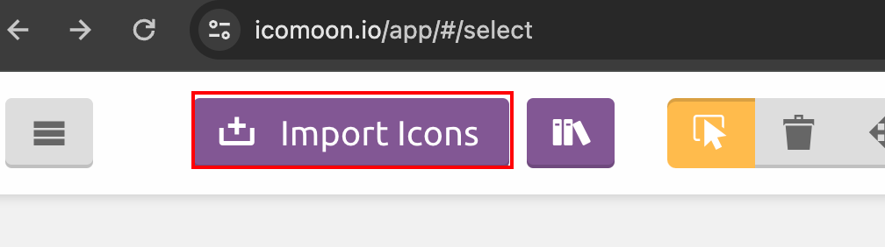

然后重新选择图标，在重新下载替换即可

## CSS 三角

通过边框实现

```html
  <style>
    .box1 {
      width: 0;
      height: 0;
      border: 10px solid transparent;
      border-top-color: #eee;
    }
  </style>
  <body>
    <div class="box1"></div>
  </body>
```

“对话框” 示例

```html
  <style>
    .jd {
      position: absolute;
      width: 120px;
      height: 240px;
      background-color: pink;
    }
    .jd span {
      position: absolute;
      top: -16px;
      left: 80px;
      width: 0;
      height: 0;
      border: 10px solid transparent;
      border-bottom-color: pink;
    }
  </style>
  <body>
    <div class="jd">
      <span></span>
    </div>
  </body>
```

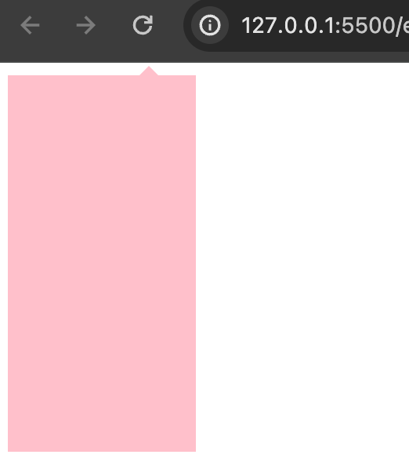

## 用户界面样式

所谓的界面样式，就是更改一些用户操作样式，以提高更好的用户体验。

1. 更改用户的鼠标样式
2. 表单轮廓
3. 防止表单域扩拽

**鼠标样式**

```css
cursor: default|pointer|move|text|not-allowed;
```

示例

```html
<style>
    .default {
      cursor: default;
    }
    .pointer {
      cursor: pointer;
    }
    .move {
      cursor: move;
    }
    .text {
      cursor: text;
    }
    .not-allowed {
      cursor: not-allowed;
    }
  </style>
  <body>
    <div class="default">当前的鼠标样式属性，cursor:default</div>
    <div class="pointer">当前的鼠标样式属性，cursor:pointer</div>
    <div class="move">当前的鼠标样式属性，cursor:move</div>
    <div class="text">当前的鼠标样式属性，cursor:text</div>
    <div class="not-allowed">当前的鼠标样式属性，cursor:not-allowed</div>
  </body>
```

**取消 input 表单轮廓**

```html
  <style>
    input {
      outline: none;
    }
  </style>
  <body>
    <input type="text" />
  </body>
```

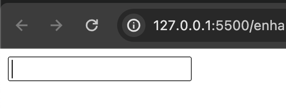

**文本域防扩拽**

```html
  <style>
    .ta {
      outline: none;
      /*禁拖动*/
      resize: none;
    }
  </style>
  <body>
    <textarea class="ta" cols="30" rows="10"></textarea>
  </body>
```

## vertical-align 属性

CSS 的 `vertical-align` 属性使用场景：常用于设置图片或表单（行内块元素）和文字对齐。

官方解释：用于设置一个元素的垂直对齐方式，但他只针对行内元素或者行内块元素有效。

用法：

```css
vertical-align: top|middle|baseline|bottom;
```

| 值         | 描述                                 |
| ---------- | ------------------------------------ |
| *baseline* | 默认。元素放置在父元素的基线上       |
| *top*      | 把元素的顶端与行中最高元素的顶端对齐 |
| *middle*   | 把此元素放置在父元素的中部           |
| *bottom*   | 把元素的顶端与行中最低元素的顶端对齐 |

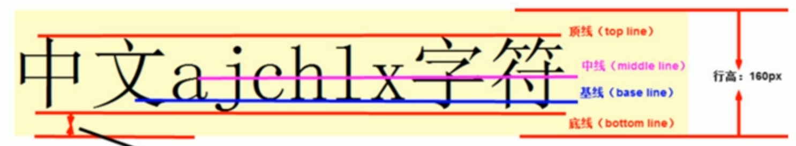

```html
  <style>
    img {
      border: 1px solid #eee;
      width: 50px;
      height: 50px;
      border-radius: 25px;
      object-fit: scale-down;
      vertical-align: middle;
    }
  </style>
  <body>
    <div>
      
      ldh 刘德华
    </div>
  </body>
```

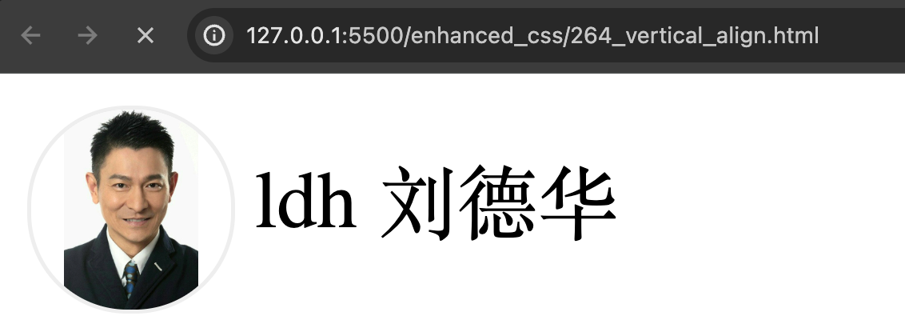

**去除图片底侧空白缝隙**

问题：

```html
  <style>
    .box {
      border: 1px solid black;
    }
    .box img {
      height: 100px;
    }
  </style>
  <body>
    <div class="box">
      
      ldh 是刘德华
    </div>
  </body>
```

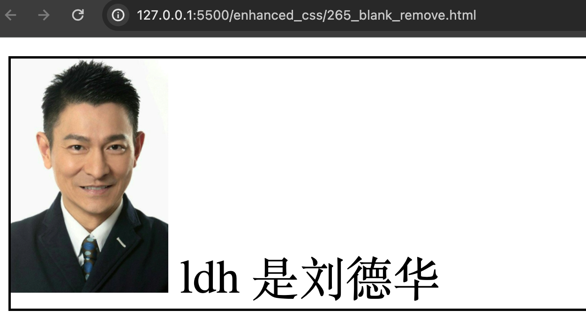

发现图片下面有一个白色缝隙，原因是行内块元素和文字的基线对齐。

解决方法：

1. 给图片添加 `vertical-align: top|middle|bottom;`（推荐）
2. 将图片转为 block 模式

## 溢出文字用省略号显示

### 单行文本

```css
  <style>
    .l {
      width: 150px;
      height: 80px;
      background-color: pink;
      margin: 100px auto;
      /* 如果显示不开则自动换行 */
      /* white-space: normal; */
      /* 1.如果显示不开则必须强制一行内显示 */
      white-space: nowrap;
      /* 2.超出的部分隐藏 */
      overflow: hidden;
      /* 3.用省略号代替超出的部分 */
      text-overflow: ellipsis;
    }
  </style>
  <body>
    <div class="l">啥也不说，省略一万字</div>
  </body>
```

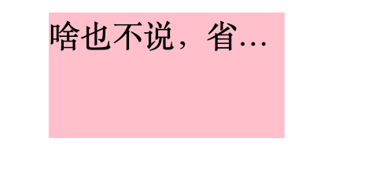

### 多行文本

多行文本溢出显示省略号，有较大的兼容性问题，适合于 webKit 浏览器或移动端（移动端大部分是 webkit 内核）

```html
  <style>
    .l {
      width: 150px;
      /*需要手动控制高度*/
      height: 58px;
      background-color: pink;
      margin: 100px auto;

      overflow: hidden;
      text-overflow: ellipsis;
      /* 弹性伸缩盒子模型 */
      display: -webkit-box;
      /* 限制在一个块元素现实的文本的行数 */
      -webkit-line-clamp: 2;
      /* 设置或检索伸缩盒对象的子元素的排列方式 */
      -webkit-box-orient: vertical;
    }
  </style>
  <body>
    <div class="l">啥也不说，省略一万字啥也不说，省略一万字</div>
  </body>
```

## 布局技巧

### margin负值的运用

**五个盒子紧挨一起一行横排**

```html
  <style>
    .box li {
      float: left;
      list-style: none;
      width: 240px;
      height: 250px;
      border: 1px solid #eee;
      /*添加与border宽度一样的左外边距，消除边框叠加的效果*/
      margin-left: -1px;
    }
  </style>
  <body>
    <ul class="box">
      <li>1</li>
      <li>2</li>
      <li>3</li>
      <li>4</li>
      <li>5</li>
    </ul>
  </body>
```

更进一步：鼠标 hover 时显示 li 的边框

```html
  <style>
    .box li {
      position: relative;
      float: left;
      list-style: none;
      width: 240px;
      height: 250px;
      border: 1px solid #eee;
      margin-left: -1px;
    }
    .box li:hover {
      border: 1px solid red;
      /*利用定位改变层叠顺序*/
      z-index: 3;
    }
  </style>
  <body>
    <ul class="box">
      <li>1</li>
      <li>2</li>
      <li>3</li>
      <li>4</li>
      <li>5</li>
    </ul>
  </body>
```

### 文字围绕浮动元素

```html
  <style>
    * {
      padding: 0;
      margin: 0;
    }
    .box {
      width: 300px;
      height: 70px;
      background-color: #eee;
      margin: 100px auto;
      padding: 5px;
    }
    .box p {
      font-size: 16px;
    }
    .pic {
      float: left;
      width: 120px;
      height: 70px;
      margin-right: 5px;
    }
    .pic img {
      width: 100%;
      object-fit: cover;
      height: 100%;
    }
  </style>
  <body>
    <div class="box">
      <div class="pic">
        
      </div>
      <p>【集锦】热身赛-巴西0-1秘鲁 内马尔替补两人血染赛场</p>
    </div>
  </body>
```

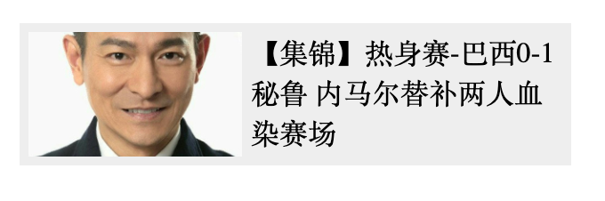

### 行内块妙用

行内块元素：之间有距离，可通过 text-align:center 居中

```html
  <style>
    * {
      padding: 0;
      margin: 0;
    }
    .box {
      padding: 30px 0;
      border: 1px solid #eee;
      margin: 100px auto;
      /*其中行内块元素会水平居中*/
      text-align: center;
    }
    .box a {
      text-decoration: none;
      display: inline-block;
      width: 36px;
      height: 36px;
      margin-left: 2px;
      border: 1px solid #ccc;
      background-color: #f7f7f7;
      color: #333;
      text-align: center;
      line-height: 36px;
      font-size: 14px;
    }
    .box .prev,
    .box .next {
      width: 85px;
    }
    .box .current,
    .box .elp {
      border: none;
    }
    .box input {
      width: 40px;
      height: 34px;
      border: 1px solid #ccc;
      padding: 0 3px;
      outline: none;
    }
    .box button {
      width: 60px;
      height: 36px;
      background-color: #f7f7f7;
      color: #333;
      border: 1px solid #ccc;
    }
  </style>
  <body>
    <div class="box">
      <a href="#" class="prev">&lt;&lt;上一页</a
      ><a href="#" class="current">2</a><a href="#">3</a><a href="#">4</a
      ><a href="#">5</a><a href="#">6</a><a href="#" class="elp">...</a
      ><a href="#" class="next">下一页&gt;&gt;</a> 到第 <input type="text" /> 页
      <button>确定</button>
    </div>
  </body>
```

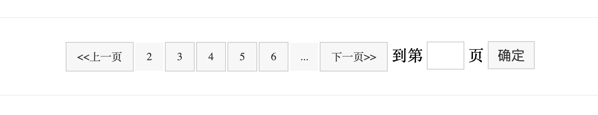

### CSS 三角妙用

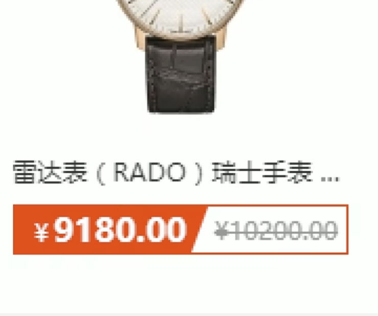

```html
  <style>
    .box {
      background-color: pink;
      border-top: 20px solid red;
      border-right: 20px solid green;
      border-bottom: 20px solid blue;
      border-left: 20px solid yellow;
      margin: 40px auto;
    }
    .l40 {
      width: 40px;
      height: 40px;
    }
    .l20 {
      width: 20px;
      height: 20px;
    }
    .l10 {
      width: 10px;
      height: 10px;
    }
    .l0 {
      width: 0px;
      height: 0px;
    }
    .tri-box {
      width: 0;
      height: 0;
      border-top: 20px solid transparent;
      border-right: 20px solid green;
      border-bottom: 0 solid blue;
      border-left: 0 solid yellow;
      margin: 40px auto;
    }
    .tri-box-2 {
      width: 0;
      height: 0;
      border-top: 35px solid transparent;
      border-right: 20px solid green;
      border-bottom: 0 solid blue;
      border-left: 0 solid yellow;
      margin: 40px auto;
    }
  </style>
  <body>
    <div class="l40 box"></div>
    <div class="l20 box"></div>
    <div class="l10 box"></div>
    <div class="l0 box"></div>
    <div class="tri-box"></div>
    <div class="tri-box-2"></div>
  </body>
```

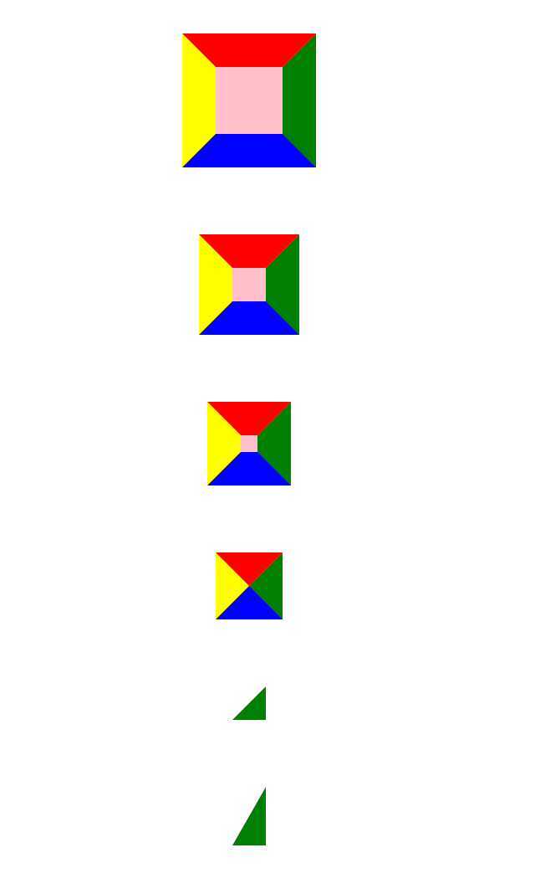

```html
  <style>
    * {
      padding: 0;
      margin: 0;
    }
    .price {
      width: 160px;
      height: 24px;
      line-height: 24px;
      border: 1px solid red;
      margin: 0 auto;
    }
    .miaosha {
      position: relative;
      float: left;
      width: 90px;
      height: 100%;
      background-color: red;
      text-align: center;
      color: #fff;
      font-weight: 700;
      margin-right: 8px;
    }
    .miaosha i {
      position: absolute;
      right: 0;
      top: 0;
      height: 0;
      width: 0;
      border-color: transparent #fff transparent transparent;
      border-style: solid;
      border-width: 24px 10px 0 0;
    }
    .origin {
      font-size: 12px;
      color: gray;
      text-decoration: line-through;
    }
  </style>
  <body>
    <div class="price">
      <span class="miaosha"
        >￥1650
        <i></i>
      </span>
      <span class="origin">￥5650</span>
    </div>
  </body>
```

### CSS 初始化

京东初始化代码

```css
/* 所有标签内外边距清零 */
* {
  margin: 0;
  padding: 0;
}
/* em 和 i 倾斜文字不倾斜 */
em,
i {
  font-style: normal;
}
/* 去掉 li 小圆点 */
li {
  list-style: none;
}
img {
  /* border 0 照顾低版本浏览器，如果图片外面包含了链接会有边框的问题 */
  border: 0;
  /* 取消图片底侧有空白缝隙的问题 */
  vertical-align: middle;
}
button {
  /* 当我们鼠标经过 button 按钮的时候，鼠标变成小手 */
  cursor: pointer;
}
a {
  color: #666;
  text-decoration: none;
}
a:hover {
  color: #c81623;
}
button,
input {
  /*  */
  font-family: Microsoft YaHei, Heiti SC, tahoma, arial, Hiragino Sans GB,
    '\5B8B\4F53', sans-serif;
}
body {
  /* 抗锯齿性 让文字显示的更加清晰 */
  -webkit-font-smoothing: antialiased;
  background-color: #fff;
  /* 文字大小 12px，1.5倍行高 */
  /* \5B8B\4F53 指宋体 */
  font: 12px/1.5 Microsoft YaHei, Heiti SC, tahoma, arial, Hiragino Sans GB,
    '\5B8B\4F53', sans-serif;
  color: #666;
}
.hide,
.none {
  display: none;
}
/* 清除浮动 */
.clearfix:after {
  visibility: hidden;
  clear: both;
  display: block;
  content: '.';
  height: 0;
}
.clearfix {
  *zoom: 1;
}
```
