# HTML5和CSS3了解

## 目录

- [1. CSS 基础](/langs/css-pink/)
- [2. CSS 进阶](/langs/css-pink/02_enhance/)
- [3. Html5 和 CSS3 了解](/langs/css-pink/03_h5c3_intro/)
- [4. CSS3 转换](/langs/css-pink/04_c3_transform/)
- [5. 移动端第一部分](/langs/css-pink/05_mobile_pt1/)
- [6. 移动端第二部分](/langs/css-pink/06_mobile_pt2/)

## HTML5

**HTML5** 新增特性主要是针对以前的不足，增加了一些**新的标签**、**新的表单**和**新的表单属性**等。

这些新特性**都有兼容性问题**，基本是 IE9+ 以上版本的浏览器才支持，如果不考虑兼容性问题，可以大量使用这些新特性。

### 语义化标签

Html4 中新增了一些语义化标签：

- header：头部标签
- nav：导航标签
- article：文章标签
- section：区域标签，可理解为“大号的 div”
- aside：侧边栏标签
- footer：尾部标签

```html
<!DOCTYPE html>
<html lang="en">
  <head>
    <meta charset="UTF-8" />
    <meta name="viewport" content="width=device-width, initial-scale=1.0" />
    <title>Document</title>
    <style>
      header,
      nav {
        height: 120px;
        width: 800px;
        background-color: pink;
        border-radius: 15px;
        margin: 15px auto;
      }
    </style>
    <header>头部区域</header>
    <nav>导航栏区域</nav>
  </head>
</html>
```

注意：

1. 这种语义化标签主要是针对【**搜索引擎**】的（SEO）
2. 这些标签在页面中可以使用**多次**
3. 在 IE9 中，需要把这些元素转换为**块级元素**
4. 实际上，移动端更喜欢用这些标签

### video 标签

HTML5 支持原生的视频格式文件的播放，但目前只支持三种视频格式：MP4、WebM、Ogg。

| 浏览器            | MP4                                                     | WebM | Ogg  |
| :---------------- | :------------------------------------------------------ | :--- | :--- |
| Internet Explorer | YES                                                     | NO   | NO   |
| Chrome            | YES                                                     | YES  | YES  |
| Firefox           | YES 从 Firefox 21 版本开始 Linux 系统从 Firefox 30 开始 | YES  | YES  |
| Safari            | YES                                                     | NO   | NO   |
| Opera             | YES 从 Opera 25 版本开始                                | YES  | YES  |

最好选用 mp4 格式。也可以使用兼容性写法

> <https://www.runoob.com/tags/tag-video.html>

```html
<!DOCTYPE html>
<html lang="en">
  <head>
    <meta charset="UTF-8" />
    <meta name="viewport" content="width=device-width, initial-scale=1.0" />
    <title>Document</title>
    <!-- 
      curl -o hyperos.mp4 https://cdn-file.hyperos.mi.com/hyperos-file/opening/opening_idea_movie_final.mp4
     -->
  </head>
  <body>
    <!-- 谷歌浏览器默认禁用播放。需要添加 autoplay 和 muted 两个属性才可以开启自动播放 -->
    <!-- controls 显示控件 -->
    <!-- loop 循环播放 -->
    <!-- 更多属性：https://www.runoob.com/tags/tag-video.html -->
    <video src="media/hyperos.mp4" autoplay muted controls loop></video>
  </body>
</html>
```

### audio 标签

HTML5 支持原生的音频格式文件的播放，但支持的格式是有限的：

| 浏览器            | MP3  | Wav  | Ogg  |
| :---------------- | :--- | :--- | :--- |
| Internet Explorer | YES  | NO   | NO   |
| Chrome            | YES  | YES  | YES  |
| Firefox           | YES  | YES  | YES  |
| Safari            | YES  | YES  | NO   |
| Opera             | YES  | YES  | YES  |

最好选用 mp3 格式。也可以使用兼容性写法

> <https://www.runoob.com/tags/tag-audio.html>

```html
<!DOCTYPE html>
<html lang="en">
  <head>
    <meta charset="UTF-8" />
    <meta name="viewport" content="width=device-width, initial-scale=1.0" />
    <title>Document</title>
  </head>
  <body>
    <!-- 
      curl -o sample.mp3 https://file-examples.com/storage/fee710faaf65ae8909c8513/2017/11/file_example_MP3_1MG.mp3
     -->

    <audio src="media/sample.mp3" autoplay controls loop></audio>
  </body>
</html>
```

注意：

- 音频标签和视频标签使用方式基本一致
- 浏览器兼容性不同，推荐音频采用 MP3 格式、视频采用 MP4 格式
- 谷歌浏览器把音频和视频的自动播放禁用了
- 可以给视频标签添加 muted 属性来静音播放视频，但音频不可以（需要通过 JS 解决）
- 视频标签是重点，我们经常设置自动播放，不使用 controls 控件，循环和设置大小属性

### 新增的 input 类型

HTML5 中 input 标签新支持的类型：**email、url、date、time、month、week、number、tel、search、color**

```html
<!DOCTYPE html>
<html lang="en">
  <head>
    <meta charset="UTF-8" />
    <meta name="viewport" content="width=device-width, initial-scale=1.0" />
    <title>Document</title>
  </head>
  <body>
    <!-- 需要添加 form 表单域才能在提交时进行验证 -->
    <form action="">
      <ul>
        <li><input type="email">邮箱</input></li>
        <li><input type="url">网址</li>
        <li>
          <input type="date"> 日期
        </li>
        <li><input type="time">时间</li>
        <li><input type="month">月份</li>
        <li><input type="week">星期</li>
        <li><input type="number">数量</li>
        <li><input type="tel">手机</li>
        <li><input type="color">颜色</li>
        <li><input type="search">搜索</li>
      </ul>
      <button type="submit">submit</button>
    </form>
  </body>
</html>
```

### 新增的表单属性

| 属性         | 值        | 说明                                                         |
| ------------ | --------- | ------------------------------------------------------------ |
| required     | required  | 内容能否为空                                                 |
| placeholder  | 提示文本  | 表单提示信息                                                 |
| autofocus    | autofocus | 自动聚焦属性，在页面加载完自动聚焦到指定表单                 |
| autocomplete | off、on   | 当用户键入内容时，浏览器根据之前输入的值进行显示<br />默认打开。需要放在表单内，同时加上 name 属性，同时成功提交 |
| multiple     | multiple  | 文件多选                                                     |

```html
<!DOCTYPE html>
<html lang="en">
  <head>
    <meta charset="UTF-8" />
    <meta name="viewport" content="width=device-width, initial-scale=1.0" />
    <title>Document</title>
  </head>
  <body>
    <form action="">
      <input type="text" required />
      <!-- 表单提示 -->
      <input type="text" placeholder="请输入" />
      <!-- 自动聚焦 -->
      <input type="text" autofocus />
      <!-- autocomplete，为了保护隐私尽量关闭 -->
      <input type="text" name="piggy" autocomplete="off" />
      <!-- multiple -->
      <input type="file" multiple />
      <button type="submit">submit</button>
    </form>
  </body>
</html>
```

## CSS3 新特性

CSS3 现状

- 新增的特性有兼容性问题，ie9+ 才支持
- 应用广泛，移动端支持优于 PC 端
- 不断改进中
- 现阶段主要学习：新增的选择器、盒子模型、其他

### 属性选择器

| 选择符           | 描述                                                      |
| ---------------- | --------------------------------------------------------- |
| `E[attr]`        | 选择具有 att 属性的 E 元素                                |
| `E[attr=“val”]`  | 选择具有 att 属性且属性值**等于 val** 的 E 元素。**常用** |
| `E[attr^=“val”]` | 选择具有 att 属性且属性值**以 val 开头**的 E 元素         |
| `E[attr$=“val”]` | 选择具有 att 属性且属性值**以 val 结尾**的 E 元素         |
| `E[attr*=“val”]` | 选择具有 att 属性且属性值中**包含 val**的 E 元素         |

```html
<!DOCTYPE html>
<html lang="en">
  <head>
    <meta charset="UTF-8" />
    <meta name="viewport" content="width=device-width, initial-scale=1.0" />
    <title>Document</title>
  </head>
  <style>
    /* 选择所有带有 value 的 input */
    input[value] {
      color: pink;
    }  
  </style>
  <body>
    <!-- 利用【属性选择器】 -->
    <input type="text" value="请输入" />
    <input type="text" />
  </body>
  <script></script>
</html>
```

> 注意：**类选择器、属性选择器、伪类选择器** 的权重都是 10

### 结构伪类选择器

结构伪类选择器：主要根据【文档结构】来选择元素，常用于根据父级选择其中的子元素

| 选择符             | 描述                          |
| ------------------ | ----------------------------- |
| `E:first-child`    | 匹配父元素中的第一个子元素 E  |
| `E:last-child`     | 匹配父元素中最后一个子元素 E  |
| `E:nth-child(n)`   | 匹配父元素中的第 n 个子元素 E |
| `E:first-of-type`  | 指定类型 E 的第一个           |
| `E:last-of-type`   | 指定类型 E 的最后一个         |
| `E:nth-of-type(n)` | 指定类型 E 的第 n 个          |

```html
<!DOCTYPE html>
<html lang="en">
  <head>
    <meta charset="UTF-8" />
    <meta name="viewport" content="width=device-width, initial-scale=1.0" />
    <title>Document</title>
  </head>
  <style>
    /* 选择 ul 的第一个 li */
    ul li:first-child {
      color: pink;
    }
    ul li:last-child {
      color: skyblue;
    }
    ul li:nth-child(2) {
      color: orange;
    }
  </style>
  <body>
    <ul>
      <li>我是第1个孩子</li>
      <li>我是第2个孩子</li>
      <li>我是第3个孩子</li>
      <li>我是第4个孩子</li>
      <li>我是第5个孩子</li>
      <li>我是第6个孩子</li>
      <li>我是第7个孩子</li>
      <li>我是第8个孩子</li>
    </ul>
  </body>
</html>
```

`nth-child(n)` 中的 n 可以是数字、关键字或公式

- 关键字：`even`、 `odd`
- 公式：`n`、`2n`、`2n+1` 等

```html
案例：隔行变色
------------------
<style>
  ul li:nth-child(even) {
    background-color: #ccc;
  }
  ul li:nth-child(odd) {
    background-color: #fff;
  }
</style>
<body>
  <ul>
    <li>我是第1个孩子</li>
    <li>我是第2个孩子</li>
    <li>我是第3个孩子</li>
    <li>我是第4个孩子</li>
    <li>我是第5个孩子</li>
    <li>我是第6个孩子</li>
    <li>我是第7个孩子</li>
    <li>我是第8个孩子</li>
  </ul>
</body>
```

```html
公式：选择所有
------------
<style>
  /* 选择 ul 的所有 li */
  ul li:nth-child(n) {
    background-color: #ccc;
  }
</style>
<body>
  <ul>
    <li>我是第1个孩子</li>
    <li>我是第2个孩子</li>
    <li>我是第3个孩子</li>
    <li>我是第4个孩子</li>
    <li>我是第5个孩子</li>
    <li>我是第6个孩子</li>
    <li>我是第7个孩子</li>
    <li>我是第8个孩子</li>
  </ul>
</body>
```

其他公式

| 公式 | 描述                        |
| ---- | --------------------------- |
| 2n   | 2、4、6…. 2n                |
| 2n+1 | 1、3、5…. 2n+1              |
| 5n   | 5、10、15…                  |
| n+5  | 从第五个开始（包括第 5 个） |
| -n+5 | 前 5 个（包括第五个）       |

`first-child` 和  `first-of-type` 的区别？

前者在所有子元素中进行选择，而后者在指定类型的子元素中进行选择

### 伪元素选择器

#### 基本使用

伪元素选择器：可以利用 CSS 创建新标签元素，而不需要 HTML 标签，可以简化 HTML 结构。

| 选择符     | 描述                     |
| ---------- | ------------------------ |
| `::before` | 在元素内部的前面插入内容 |
| `::after`  | 在元素内部的后面插入内容 |

注意：

- 伪元素选择器会创建**行内元素**，该元素无法在文档树中找到，故称为**伪元素**
- 语法：`element::before()`
- before 和 after **必须有 content** 属性
- before 在父元素内容的前面添加元素、after 在父元素内容的后面添加元素
- **伪元素选择器**和**标签选择器**一样，权重都为 1

```html
<!DOCTYPE html>
<html lang="en">
  <head>
    <meta charset="UTF-8" />
    <meta name="viewport" content="width=device-width, initial-scale=1.0" />
    <title>Document</title>
  </head>
  <style>
    div {
      width: 200px;
      height: 200px;
      background-color: pink;
    }
    div::before {
      content: '我';
    }
    div::after {
      content: '人';
    }
  </style>
  <body>
    <div>是</div>
  </body>
</html>
```

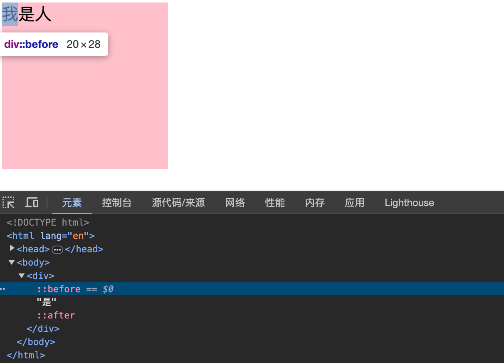

#### 案例一：伪元素字体图标

```html
  <style>
    @font-face {
      font-family: 'icomoon';
      src: url('fonts/icomoon.eot?jtaqgu');
      src: url('fonts/icomoon.eot?jtaqgu#iefix') format('embedded-opentype'),
        url('fonts/icomoon.ttf?jtaqgu') format('truetype'),
        url('fonts/icomoon.woff?jtaqgu') format('woff'),
        url('fonts/icomoon.svg?jtaqgu#icomoon') format('svg');
      font-weight: normal;
      font-style: normal;
      font-display: block;
    }

    div {
      position: relative;
      width: 200px;
      height: 35px;
      border: 1px solid red;
    }
    div::after {
      position: absolute;
      top: 10px;
      right: 10px;
      font-family: 'icomoon';
      /* content: ''; */
      content: '\e900';
    }
  </style>
  <body>
    <div></div>
  </body>
```

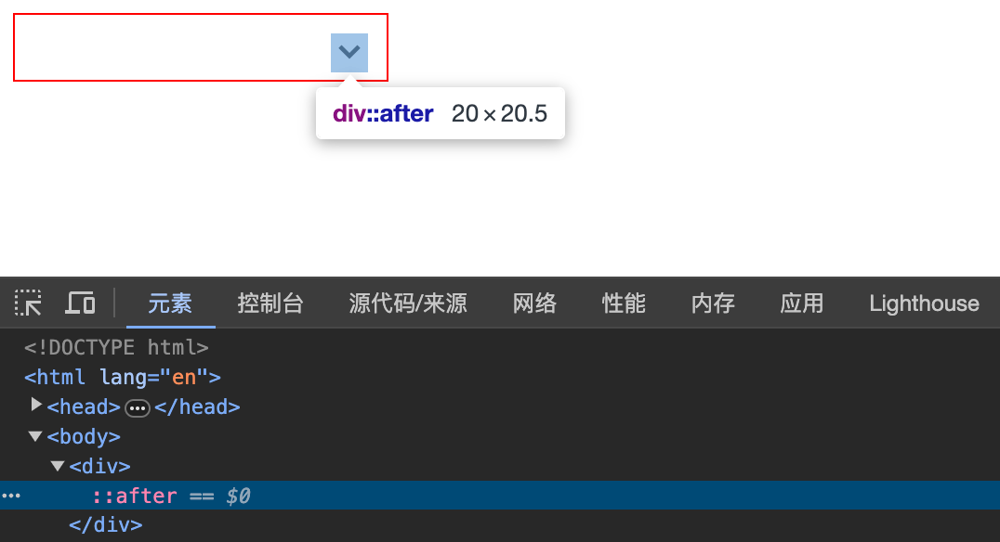

#### 案例二：使用 before 伪元素添加遮罩层

土豆网案例：之前使用 div 做遮罩层

```html
  <div class="tudou">
    <div class="mask"></div>
    
  </div>
```

改进：使用 `::before` 添加遮罩层

```html
<style>
  .tudou {
    position: relative;
    width: 444px;
    height: 320px;
    background-color: pink;
    margin: 30px auto;
  }
  .tudou img {
    width: 100%;
    height: 100%;
  }
  
  /* .mask { */
  .tudou::before {
    content: '';
    /* 隐藏遮罩层 */
    display: none;
    position: absolute;
    top: 0;
    left: 0;
    width: 100%;
    height: 100%;
    background: rgba(0, 0, 0, 0.3) url(./images/arr.png) no-repeat center;
  }
  
  /* 鼠标经过 .tudou, 让 .mask 显示 */
  /* .tudou:hover .mask { */
  .tudou:hover::before {
    display: block;
    cursor: grabbing;
  }
</style>
<body>
  <div class="tudou">
    <!-- <div class="mask"></div> -->
    
  </div>
</body>
```

好处：结构更简单了

#### 案例三：使用伪元素清除浮动

参考：<https://gitee.com/egu0/css_toturials_pink/tree/main/CSS_Workspace#%E6%B8%85%E9%99%A4%E6%B5%AE%E5%8A%A8%E7%9A%84%E6%96%B9%E6%B3%95>

```html
<style>
    .clearfix:after {
      content: '';
      display: block;
      height: 0;
      clear: both;
      visibility: hidden;
    }
    .clearfix {
      /* IE6, IE7 专有 */
      *zoom: 1;
    }
</style>

  <body>
    <div class="box clearfix">
      <div class="first"></div>
      <div class="second"></div>
    </div>
    <div class="footer"></div>
  </body>
```

```html
<style>
    .clearfix:before,
    .clearfix:after {
      content: '';
      display: table;
    }
    .clearfix:after {
      clear: both;
    }
    .clearfix {
      *zoom: 1;
    }
</style>

  <body>
    <div class="box clearfix">
      <div class="first"></div>
      <div class="second"></div>
    </div>
    <div class="footer"></div>
  </body>
```

### 盒子模型 border-box

CSS3 中可以通过 `box-sizing` 属性来指定**盒模型**，有两个值供选择：

- `content-box`：盒子大小为【width + padding + border】，**默认**
- `border-box`：盒子大小为 【width】

```html
<style>
  div {
    width: 200px;
    height: 200px;
    border: 20px solid red;
    padding: 20px;
    /* box-sizing: content-box; */
    box-sizing: border-box;
  }
</style>
<body>
  <div></div>
</body>
```

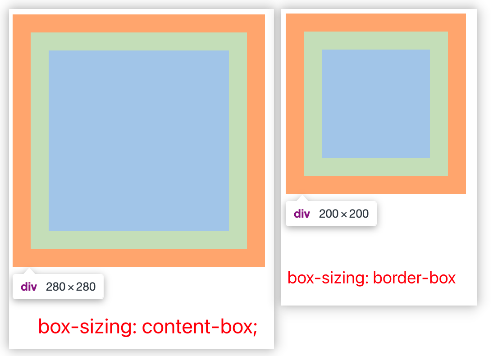

### 图片模糊处理

```
filter: 函数()
例如: filter: blur(5px)
```

<https://developer.mozilla.org/en-US/docs/Web/CSS/filter>

```html
<style>
  img {
    filter: blur(3px);
  }
  img:hover {
    filter: blur(0);
  }
</style>
<body>
  
</body>
```

### calc 函数

calc 函数是一个 CSS3 函数，可以让开发者在声明 CSS 属性时进行一些计算

```html
<style>
  .father {
    width: 200px;
    height: 100px;
    background-color: pink;
  }
  .son {
    /* 宽度永远比父元素小 30px */
    width: calc(100% - 30px);
    height: 20px;
    background-color: orange;
  }
</style>
<body>
  <div class="father">
    <div class="son"></div>
  </div>
</body>
```

### 过渡

是 CSS3 中具有颠覆性的特性之一

过渡动画：从一个状态渐渐过渡到另一个状态。可以让页面更好看。虽然低版本浏览器不支持(`ie9` 以下版本)，但不会影响页面布局

用法：

```
transition: 要过渡的属性 花费时间 运动曲线 何时开始;
--------
属性：目标属性，比如元素的宽度。【不可以省略】
花费时间：单位是秒（必须添加单位），比如 .5s。【不可以省略】
运动曲线：默认是 ease，可省略
何时开始：单位是秒（必须添加单位），用于设置延迟触发时间，默认是 0 秒。可省略
--------
transition 属性添加位置：需要进行过渡的元素
```

通常搭配 `:hover` 一起使用

> 【运动曲线】属性可选值：linear、ease、ease-in、ease-out、ease-in-out

```html
<style>
  .box {
    width: 200px;
    height: 10px;
    border: 1px solid red;
    border-radius: 5px;
  }
  .box_in {
    width: 40%;
    height: 10px;
    border-radius: 2px;
    background-color: red;
    /* 给孩子加 */
    transition: width 0.3s;
  }
  /* 当鼠标悬停在 box 上，box_in 的宽度变为 100% */
  .box:hover .box_in {
    width: 100%;
    height: 10px;
  }
</style>
<body>
  <div class="box">
    <div class="box_in"></div>
  </div>
</body>
```

## 广义的 HTML5

狭义的 HTML5：`HTML5 标签 + CSS3`

一般说的都是广义的 HTML5：`HTML5 标签 + CSS3 + JS`

## 品优购项目

目录

```
项目规划
首页制作
列表页制作
注册页制作
域名注册与网站上传
```

### 项目规划

#### 网站制作流程

 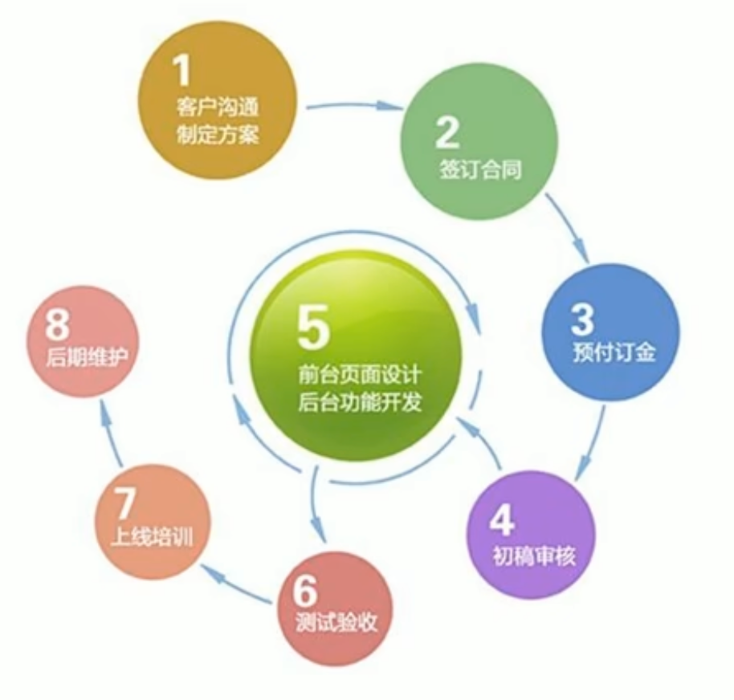

> 初稿审核：网页美工会制作**原型图**和 **psd 效果图**

#### 品优购项目规划

**项目描述**：品优购是一个电商网站，我们要完成 PC 端首页、列表页和注册页面的制作

**学习目的**

1. 电商类网站的制作需要开发者掌握综合性知识，比如布局方式、常见效果和周边技术
2. 品优购项目能复习、总结、提高基础班所学的布局技术
3. 完成项目后，能对实际开发中**制作 PC 端页面的流程**有一个整体的感知
4. 为后期学习移动端项目做铺垫

**开发工具及技术栈**

- 开发工具：VSCode、PS、主流浏览器
- 技术栈：
  - 采用 HTML5 + CSS3 手动布局，大量使用 H5 新增标签和样式
  - 采用结构与样式相分离，模块化开发
  - 良好的代码规范有利于团队更好的开发协作，提高代码质量。代码规范请参考【`shopping/品优购代码规范.md`】

#### 项目搭建

目录结构

```
shopping/       项目文件夹
 - images            样式类图片文件夹
 - css        样式文件夹
 - upload      产品类图片文件夹
 - fonts       字体类文件夹
 - js        脚本文件夹
```

创建文件

- `./index.html` 首页
- `./css/base.css` 初始化样式文件
- `./css/common.css` 公共样式文件

`base.css`

```css
* {
  margin: 0;
  padding: 0;
  box-sizing: border-box;
}
em,
i {
  font-style: normal;
}
li {
  list-style: none;
}
img {
  border: 0;
  vertical-align: middle;
}
button {
  cursor: pointer;
}
a {
  color: #666;
  text-decoration: none;
}
a:hover {
  color: #c81623;
}
button,
input {
  font-family: Microsoft YaHei, Heiti SC, tahoma, arial, Hiragino Sans GB,
    '\5B8B\4F53', sans-serif;
}
body {
  -webkit-font-smoothing: antialiased;
  background-color: #fff;
  font: 12px/1.5 Microsoft YaHei, Heiti SC, tahoma, arial, Hiragino Sans GB,
    '\5B8B\4F53', sans-serif;
  color: #666;
}
.hide,
.none {
  display: none;
}
.clearfix:after {
  visibility: hidden;
  clear: both;
  display: block;
  content: '.';
  height: 0;
}
.clearfix {
  *zoom: 1;
}
```

**模块化开发**

指将一个项目按照功能进行划分，一个功能对应一个模块，互不影响。模块化开发具有重复使用、更换方便等优点。

**公共模块**：有些样式和结构在很多页面中都会出现，比如大部分页面都包含页面头部和底部，此时可以把这些结构和样式单独放入一个模块中，以便重复使用。最典型的应用是 `common.css` 公共样式，即定义一次公共样式，然后在多个页面中使用它。公共样式里可以包含版心宽度、清除浮动、页面文字颜色等公共样式。

**favicon.ico**

1. 制作 ico 图标
2. 将图标放在根目录下
3. 在 html 页面中引入 favicon 图标

```html
  <head>
    <link rel="shortcut icon" href="favicon.ico" />
  </head>
```

**网站 TDK 三大标签 SEO 优化**

SEO（Search Engine Optimization），**搜索引擎优化**，是一种利用搜索引擎的规则提高网站在有关搜索引擎内自然排名的方式。SEO 的目的是通过优化网站内容、结构和关键词，提高网站在搜索引擎结果中的排名，从而帮助网站获取免费的流量，进而在搜索引擎上提升网站的排名，提高网站的知名度。

前端人员：使用【三个标签】来优化 SEO，即**TDK（Title、Description、Keywords）**

- `Title`：建议格式为 `网站名或产品名-网站介绍(30字内)`
- `Description`：概括网站的总体业务和主题，多采用 “我们是xxx”、“我们提供xxx”、“xxx网站作为xxx”、“电话：010…” 之类的句式
- `Keywords`：页面关键字，最好限制为 6~8 个关键词，用英文逗号间隔

示例（仿 jd）

```html
<head>
    <title>品优购-正品低价、品质保障、配送及时、轻松购物！</title>
    <meta name="description"
          content="品优购-专业的综合网上购物商城，为您提供正品低价的购物选择、优质便捷的服务体验。商品来自全球数十万品牌商家，囊括家电、手机、电脑、服装、居家、母婴、美妆、个护、食品、生鲜等丰富品类，满足各种购物需求。"/>
    <meta name="Keywords" content="网上购物,网上商城,家电,手机,电脑,服装,居家,母婴,美妆,个护,食品,生鲜,京东"/>
  ...
</head>
```

### 首页制作

#### 快捷导航结构搭建

常见模块类名命名

| 名称               | 说明               |
| ------------------ | ------------------ |
| 快捷导航栏         | shortcut           |
| 头部               | header             |
| 标志               | logo               |
| 购物车             | shopcart           |
| 热点词             | hotwords           |
| 导航               | nav                |
| 导航左侧           | dropdown、.dd、.dt |
| 导航右侧           | navitems           |
| 页面底部           | footer             |
| 页面底部的服务模块 | mod_service        |
| 页面底部的帮助模块 | mod_help           |
| 页面底部的版权模块 | mod_copyright      |

```html
  <body>
    <!-- 快捷导航模块 -->
    <section class="shortcut">
      <div class="w">
        <div class="fl">123</div>
        <div class="fr">456</div>
      </div>
    </section>
  </body>
```

`common.css`

```css
/* 快捷导航模块 */
.shortcut {
  height: 31px;
  background-color: #f1f1f1;
}
.fl {
  float: left;
}
.fr {
  float: right;
}
```

#### 快捷导航左侧

```html
    <section class="shortcut">
      <div class="w">
        <div class="fl">
          <ul>
            <li>品优购欢迎您！&nbsp;</li>
            <li>
              <a href="#">请登录&nbsp;</a>
              <a class="style_red" href="#">免费注册</a>
            </li>
          </ul>
        </div>
        <div class="fr">456</div>
      </div>
    </section>
```

```css
.shortcut {
  height: 31px;
  background-color: #f1f1f1;
  line-height: 31px;
}
.shortcut ul li {
  float: left;
}
.style_red {
  color: #c81623;
}
```

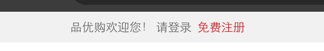

#### 快捷导航右侧

```html
    <section class="shortcut">
      <div class="w">
        <div class="fl">
        </div>
        <div class="fr">
          <ul>
            <li>我的订单</li>
            <li></li>
            <li>我的品优购</li>
            <li></li>
            <li>品优购会员</li>
            <li></li>
            <li>企业采购</li>
            <li></li>
            <li>关注品优购</li>
            <li></li>
            <li>客户服务</li>
            <li></li>
            <li>网站导航</li>
          </ul>
        </div>
      </div>
    </section>
```

```css
/* 选择所有偶数 li */
.shortcut .fr ul li:nth-child(even) {
  width: 1px;
  height: 12px;
  margin: 9px 15px 0;
  background-color: #666;
}
```

#### 快捷导航右侧字体图标

字体素材 `icomoon.zip`：<https://pan.baidu.com/s/1ZUgsZZkWEYMdzSBsh5lNtQ#list/path=%2Fpink%E5%89%8D%E7%AB%AF%E5%9F%BA%E7%A1%80%E5%B8%A6%E8%B5%84%E6%96%99%2F%E5%9F%BA%E7%A1%80%E9%83%A8%E5%88%86%2F11-%E5%89%8D%E7%AB%AF%E5%9F%BA%E7%A1%80-PC%E7%AB%AF%E5%93%81%E4%BC%98%E8%B4%AD%E9%A1%B9%E7%9B%AE%2F%E7%B4%A0%E6%9D%90&parentPath=%2F> ，密码f1vz

```html
  <div class="fr">
    <ul>
      <li>我的订单</li>
      <li></li>
      <li class="arrow-icon">我的品优购</li>
      <li></li>
      <li>品优购会员</li>
      <li></li>
      <li>企业采购</li>
      <li></li>
      <li class="arrow-icon">关注品优购</li>
      <li></li>
      <li class="arrow-icon">客户服务</li>
      <li></li>
      <li class="arrow-icon">网站导航</li>
    </ul>
  </div>
```

```css
/* 字体图标 */
@font-face {
  font-family: 'icomoon';
  src: url('../fonts/icomoon.eot?tomleg');
  src: url('../fonts/icomoon.eot?tomleg#iefix') format('embedded-opentype'),
    url('../fonts/icomoon.ttf?tomleg') format('truetype'),
    url('../fonts/icomoon.woff?tomleg') format('woff'),
    url('../fonts/icomoon.svg?tomleg#icomoon') format('svg');
  font-weight: normal;
  font-style: normal;
  font-display: block;
}
.arrow-icon::after {
  content: '';
  font-family: 'icomoon';
  margin-left: 4px;
}

```

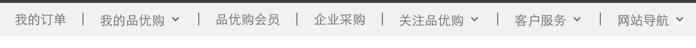

#### 头部结构介绍

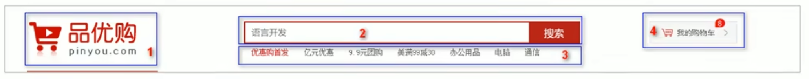

- 1 号盒子是 logo 标志；2 是 search 搜索模块；3 是 hotwords 热词模块；4 是 shopcart 购物车模块
- 四个模块都采用定位

#### 头部 logo 及 SEO 优化

带有 SEO 优化的 logo 模块需要满足以下几点：

1. logo 内首先放一个 `h1` 标签，目的是为了提权，告诉搜索引擎，这个地方很重要
2. h1 标签内放一个**链接**，可以返回首页的，把 logo 的背景图片给链接即可
3. 为了搜索引擎收录我们，我们链接里要放文字（网站名称），但文字不要显示出来
   1. 方法1：使用 `text-indent:-9999px` 属性将其移动到盒子外，然后 `overflow:hidden`，淘宝做法
   2. 方法2：直接给 `font-size:0` 就看不到文字了，京东做法
4. 最后给链接一个 `title` 属性，这样鼠标放到 logo 上就可以看到提示文字了

示例

```html
    <!-- 头部模块 -->
    <header class="header w">
      <!-- logo -->
      <div class="logo">
        <h1><a href="index.html" title="品优购">品优购</a></h1>
      </div>
    </header>
```

```css
/* 头部制作 */
.header {
  position: relative;
  height: 105px;
  background-color: pink;
}
.logo {
  position: absolute;
  top: 25px;
  width: 171px;
  height: 61px;
}
.logo a {
  display: block;
  width: 171px;
  height: 61px;
  background: url(../images/logo.png) no-repeat;
  text-indent: -9999px;
  overflow: hidden;
  /* font-size: 0; */
}
```

#### 头部 search 部分

```html
      <!-- search 模块 -->
      <div class="search">
        <input type="search" placeholder="程序开发" />
        <button>搜索</button>
      </div>
```

修改 `base.css`，去掉 input 和 button 的默认边框

```css
button,
input {  
  /* 去掉默认边框 */
  border: 0;
  outline: none;
}
```

`common.css`

```css
.search {
  position: absolute;
  left: 346px;
  top: 25px;
  width: 538px;
  height: 36px;
  border: 2px solid #b1191a;
}
.search input {
  float: left;
  height: 32px;
  width: 454px;
  padding-left: 10px;
}
.search button {
  float: right;
  width: 80px;
  height: 32px;
  background-color: #b1191a;
}
```

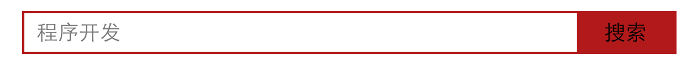

#### 头部 hotwords 部分

```html
      <!-- hotwords 模块 -->
      <div class="hotwords">
        <a href="#" class="style_red">优惠购首发</a>
        <a href="#">亿元优惠</a>
        <a href="#">9.9元团购</a>
        <a href="#">每满99减30</a>
        <a href="#">办公家具</a>
        <a href="#">电脑</a>
        <a href="#">通信</a>
      </div>
```

```css
.hotwords {
  position: absolute;
  top: 66px;
  left: 346px;
}
.hotwords a {
  margin-right: 10px;
}
```

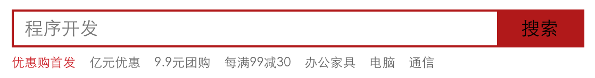

#### 头部 shopcart 部分

```html
      <!-- 购物车模块 -->
      <div class="shopcart">
        <a href="#">我的购物车</a>
      </div>
```

```css
.shopcart {
  position: absolute;
  right: 60px;
  top: 25px;
  width: 140px;
  height: 35px;
  border: 1px solid #dfdfdf;
  background-color: #f7f7f7;
  line-height: 35px;
  text-align: center;
}
.shopcart::after {
  content: '';
  font-family: 'icomoon';
  margin-left: 5px;
}
.shopcart::before {
  content: '';
  font-family: 'icomoon';
  margin-right: 5px;
  color: #c81623;
}
```

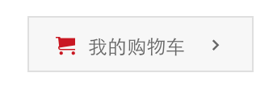

#### 头部 shopcart 中计数徽章

- 采用绝对定位
- 无需给宽度，需要其中的数字“撑开”盒子；需要给高度
- 盒子左下角不是圆角，其余三个是圆角，比如：`border-radius: 7px 7px 7px 0;`

```html
      <!-- 购物车模块 -->
      <div class="shopcart">
        <a href="#"
          >我的购物车
          <i class="count">28</i>
        </a>
      </div>
```

```css
.shopcart .count {
  position: absolute;
  top: -5px;
  left: 100px;
  height: 14px;
  line-height: 14px;
  color: #fff;
  background-color: #e60012;
  padding: 0 5px;
  border-radius: 7px 7px 7px 0;
}
```

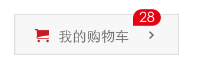

#### 导航模块搭建

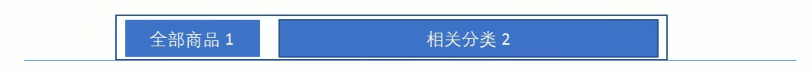

- `nav` 盒子通栏有高度，而且有个下边框
- 1 号盒子左侧浮动，`dropdown` 类
- 2 号盒子左侧浮动，是导航栏组，`navitems` 类

```html
    <!-- 导航模块 -->
    <div class="nav">
      <div class="w">
        <div class="dropdown"></div>
        <div class="navitems">abc</div>
      </div>
    </div>
```

```css
/* nav 模块制作 */
.nav {
  height: 47px;
  border-bottom: 2px solid #b1191a;
}
.nav .dropdown {
  float: left;
  width: 210px;
  height: 45px;
  background-color: #b1191a;
}
.nav .navitems {
  float: left;
  width: 210px;
  height: 45px;
}
```

#### 导航 dropdown 部分搭建

分析上一小节的 1 号盒子：根据相关性判断其中应包括 `.dt` 和 `.dd` 两个盒子

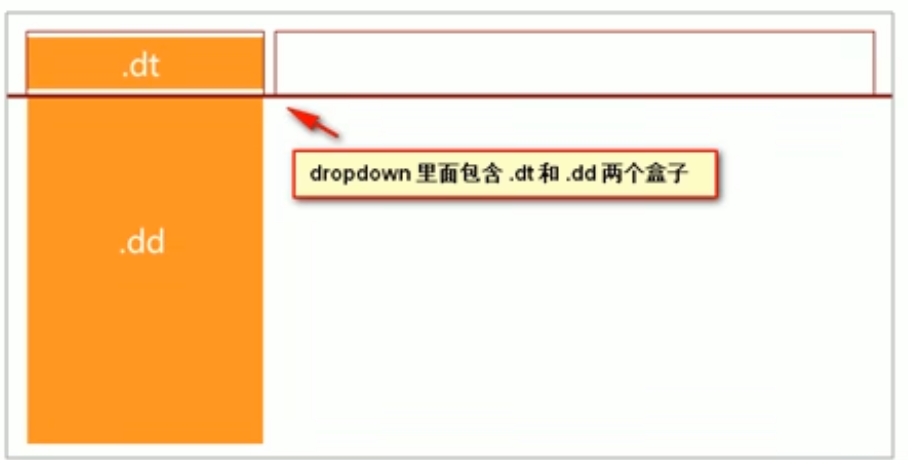

```html
  <div class="dropdown">
    <div class="dt">全部商品分类</div>
    <div class="dd">详细商品分类</div>
  </div>
```

```css
.dropdown .dt {
  width: 100%;
  height: 100%;
  color: #fff;
  text-align: center;
  line-height: 45px;
  font-size: 16px;
}
.dropdown .dd {
  height: 465px;
  width: 210px;
  background-color: #c81623;
}
```

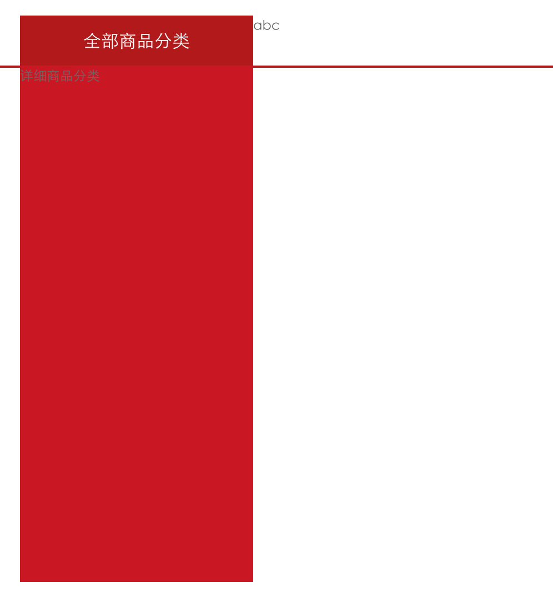

#### 导航 dropdown 部分详细分类

```html
  <div class="dropdown">
    <div class="dt">全部商品分类</div>
    <div class="dd">
                <ul>
                  <li><a href="#">家用电器</a></li>
                  <li>
                    <a href="#">手机</a>、 <a href="#">数码</a>、<a href="#"
                      >通信</a
                    >
                  </li>
                  <li><a href="#">电脑、办公</a></li>
                  <li><a href="#">家居、家具、家装、厨具</a></li>
                  <li><a href="#">男装、女装、童装、内衣</a></li>
                  <li><a href="#">个户化妆、清洁用品、宠物</a></li>
                  <li><a href="#">鞋靴、箱包、珠宝、奢侈品</a></li>
                  <li><a href="#">运动户外、钟表</a></li>
                  <li><a href="#">汽车、汽车用品</a></li>
                  <li><a href="#">母婴、玩具乐器</a></li>
                  <li><a href="#">食品、酒类、生鲜、特产</a></li>
                  <li><a href="#">医药保健</a></li>
                  <li><a href="#">图书、音像、电子书</a></li>
                  <li><a href="#">彩票、旅行、充值、票务</a></li>
                  <li><a href="#">理财、众筹、白条、保险</a></li>
                </ul>
    </div>
  </div>
```

```css
.dropdown .dd ul li {
  position: relative;
  height: 31px;
  line-height: 31px;
  margin-left: 2px;
  padding-left: 10px;
}
.dropdown .dd ul li:hover {
  background-color: #fff;
}
.dropdown .dd ul li a {
  font-size: 14px;
  color: #fff;
}
.dropdown .dd ul li:hover a {
  color: #c81623;
}
.dropdown .dd ul li::after {
  position: absolute;
  top: 1px;
  right: 5px;
  content: '\e920';
  font-family: 'icomoon';
  color: #fff;
  font-size: 14px;
}
```

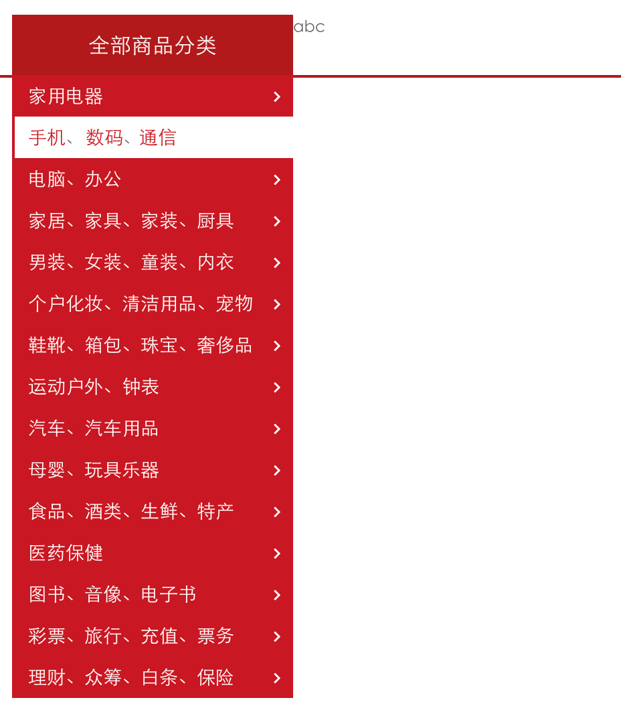

#### 导航 navitems 部分搭建

```html
        <div class="navitems">
          <ul>
            <li><a href="#">服装城</a></li>
            <li><a href="#">服装城</a></li>
            <li><a href="#">服装城</a></li>
            <li><a href="#">服装城</a></li>
            <li><a href="#">服装城</a></li>
            <li><a href="#">服装城</a></li>
            <li><a href="#">服装城</a></li>
            <li><a href="#">服装城</a></li>
          </ul>
        </div>
```

```css
.navitems ul li {
  float: left;
}
.navitems ul li a {
  display: block;
  height: 45px;
  line-height: 45px;
  font-size: 16px;
  padding: 0 25px;
}
```

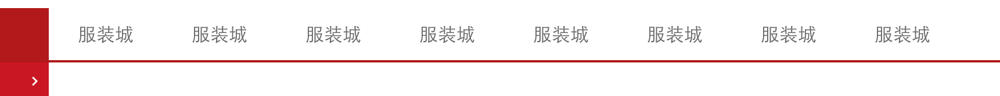

#### 底部模块搭建

```html
    <!-- footer 模块 -->
    <footer class="footer">
      <div class="w">123</div>
    </footer>
```

```css
/* 底部模块 */
.footer {
  height: 415px;
  background-color: #f5f5f5;
  padding-top: 30px;
}
```

#### 底部服务部分

```html
    <footer class="footer">
      <div class="w">
        <div class="mod_service">
          <ul>
            <li>
              <h5></h5>
              <div class="svc_txt">
                <h4>正品保障</h4>
                <p>正品保障，提供发票</p>
              </div>
            </li>
            <li>
              <h5></h5>
              <div class="svc_txt">
                <h4>正品保障</h4>
                <p>正品保障，提供发票</p>
              </div>
            </li>
            <li>
              <h5></h5>
              <div class="svc_txt">
                <h4>正品保障</h4>
                <p>正品保障，提供发票</p>
              </div>
            </li>
            <li>
              <h5></h5>
              <div class="svc_txt">
                <h4>正品保障</h4>
                <p>正品保障，提供发票</p>
              </div>
            </li>
          </ul>
        </div>
      </div>
    </footer>
```

```css
.footer .mod_service {
  height: 80px;
  border-bottom: 1px solid #ccc;
}
.footer .mod_service ul li {
  width: 300px;
  height: 50px;
  float: left;
  padding-left: 35px;
}
.footer .mod_service ul li h5 {
  float: left;
  width: 50px;
  height: 50px;
  background: url(../images/icons.png) no-repeat -252px -2px;
  border-radius: 25px;
  margin-right: 8px;
}
.footer .mod_service ul li .svc_txt h4 {
  font-size: 14px;
}
.footer .mod_service ul li .svc_txt p {
  font-size: 12px;
}
```

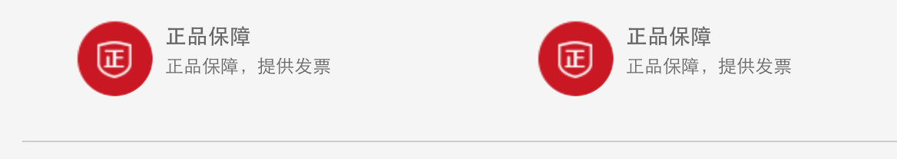

#### 底部帮助部分

```html
<!-- 帮助部分 -->
<div class="mod_help">
  <dl>
    <dt>服务指南</dt>
    <dd><a href="#">购物流程</a></dd>
    <dd><a href="#">会员介绍</a></dd>
    <dd><a href="#">生活流行/团购</a></dd>
    <dd><a href="#">常见问题</a></dd>
    <dd><a href="#">大家电</a></dd>
    <dd><a href="#">联系客服</a></dd>
  </dl>
  <dl>
    <dt>服务指南</dt>
    <dd><a href="#">购物流程</a></dd>
    <dd><a href="#">会员介绍</a></dd>
    <dd><a href="#">生活流行/团购</a></dd>
    <dd><a href="#">常见问题</a></dd>
    <dd><a href="#">大家电</a></dd>
    <dd><a href="#">联系客服</a></dd>
  </dl>
  <dl>
    <dt>服务指南</dt>
    <dd><a href="#">购物流程</a></dd>
    <dd><a href="#">会员介绍</a></dd>
    <dd><a href="#">生活流行/团购</a></dd>
    <dd><a href="#">常见问题</a></dd>
    <dd><a href="#">大家电</a></dd>
    <dd><a href="#">联系客服</a></dd>
  </dl>
  <dl>
    <dt>服务指南</dt>
    <dd><a href="#">购物流程</a></dd>
    <dd><a href="#">会员介绍</a></dd>
    <dd><a href="#">生活流行/团购</a></dd>
    <dd><a href="#">常见问题</a></dd>
    <dd><a href="#">大家电</a></dd>
    <dd><a href="#">联系客服</a></dd>
  </dl>
  <dl>
    <dt>服务指南</dt>
    <dd><a href="#">购物流程</a></dd>
    <dd><a href="#">会员介绍</a></dd>
    <dd><a href="#">生活流行/团购</a></dd>
    <dd><a href="#">常见问题</a></dd>
    <dd><a href="#">大家电</a></dd>
    <dd><a href="#">联系客服</a></dd>
  </dl>
  <dl>
    <dt>帮助中心</dt>
    <dd>
      
      品优购官方
    </dd>
  </dl>
</div>
```

```css
.mod_help {
  height: 185px;
  border-bottom: 1px solid #ccc;
  padding-top: 20px;
  padding-left: 50px;
}
.mod_help dl {
  width: 200px;
  float: left;
}
.mod_help dl:last-child {
  width: 90px;
  text-align: center;
}

.mod_help dl dt {
  font-size: 16px;
}
.mod_help dl dd {
  font-size: 12px;
}
```

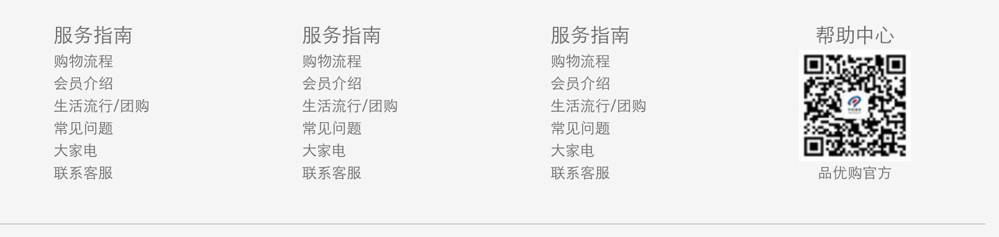

#### 底部版权部分

```html
<!-- 版权部分 -->
<div class="mod_copyright">
  <div class="links">
    <a href="#">关于我们</a> | <a href="#">联系我们</a> |
    <a href="#">联系客服</a> | <a href="#">商家入驻</a> |
    <a href="#">营销中心</a> | <a href="#">手机品优购</a> |
    <a href="#">友情链接</a> | <a href="#">销售联盟</a> |
    <a href="#">品优购社区</a> | <a href="#">品优购公益</a> |
    <a href="#">English</a> | <a href="#">Site</a> |
    <a href="#">Contact</a>
  </div>
  <div class="copyright">
    地址：北京市昌平区建材城西路金燕龙办公楼一层 邮编：100096
    电话：400-618-4000 传真：010-82935100 邮箱: zhanghj+itcast.cn <br />
    京ICP备08001421号京公网安备110108007702
  </div>
</div>
```

```css
.mod_copyright {
  text-align: center;
  margin-top: 20px;
}
.mod_copyright .links {
  margin-top: 15px;
}
.mod_copyright .links a {
  margin: 0 3px;
}
.mod_copyright .copyright {
  line-height: 20px;
}
```

#### 主体模块制作

之前的小节采用模块化的方式在首页中创建了公共部分。

主体模块：维护首页中专有的内容，需要创建新的样式文件 `index.css`

主体模块布局：

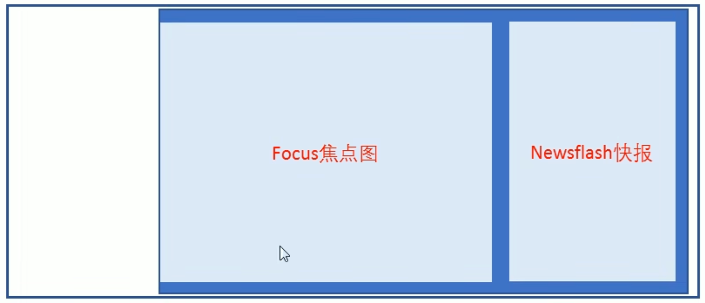

- 高度 `980px`，距离左边 220px（`margin-left`）
- main 盒子中的左侧盒子：左浮动，为 `focus` 焦点图模块
- main 盒子中的右侧盒子：右浮动，为 `newsflash` 新闻快报模块

```html
    <!-- 首页专有模块 -->
    <div class="w">
      <main class="main">
        <div class="focus">焦点图</div>
        <div class="newsflash">快报</div>
      </main>
    </div>
```

`index.css`

```css
.main {
  width: 980px;
  height: 455px;
  margin-left: 220px;
  background-color: pink;
}
.main .focus {
  float: left;
  width: 721px;
  height: 100%;
  background-color: skyblue;
}
.main .newsflash {
  float: right;
  width: 250px;
  height: 100%;
  background-color: lightcyan;
}
```

#### 主体中聚焦和特价两部分搭建

```html
    <!-- 首页专有模块 -->
    <div class="w">
      <main class="main">
        <div class="focus">
          <ul>
            <li></li>
          </ul>
        </div>
        <!-- 快报 -->
        <div class="newsflash">
          <div class="news">新闻</div>
          <div class="lifeservice">生活服务</div>
          <div class="bargain">
            
          </div>
        </div>
      </main>
    </div>
```

```css
.news {
  height: 165px;
  background-color: lightblue;
}
.lifeservice {
  height: 209px;
  background-color: skyblue;
}
.bargain {
  margin-top: 5px;
}
```

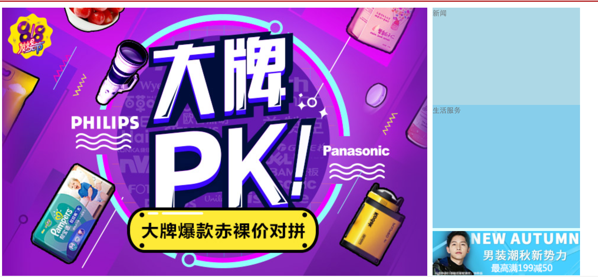

（轮播图制作此处省略）

#### 主体快报中新闻部分

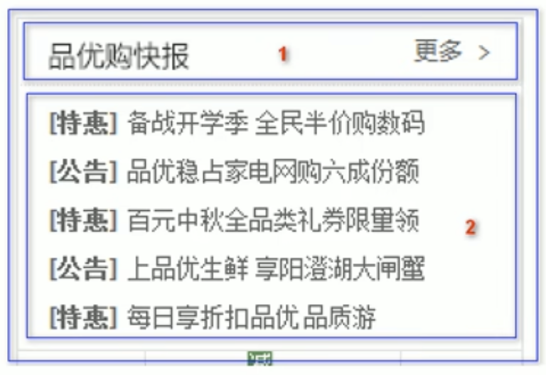

```html
        <div class="newsflash">
          <div class="news">
            <div class="news-hd">
              <h5>品优购快报</h5>
              <a href="#" class="more">更多</a>
            </div>
            <div class="news-bd">
              <ul>
                <li>
                  <a href="#"
                    ><strong>【特惠】</strong> 备战开学季 全民半价购数码</a
                  >
                </li>
                <li>
                  <a href="#"
                    ><strong>【特惠】</strong> 备战开学季 全民半价购数码</a
                  >
                </li>
                <li>
                  <a href="#"
                    ><strong>【公告】</strong> 品优稳占家电网购六成份额</a
                  >
                </li>
                <li>
                  <a href="#"
                    ><strong>【特惠】</strong> 备战开学季 全民半价购数码</a
                  >
                </li>
                <li>
                  <a href="#"
                    ><strong>【公告】</strong> 品优稳占家电网购六成份额</a
                  >
                </li>
              </ul>
            </div>
          </div>
          <div class="lifeservice">生活服务</div>
          <div class="bargain">
            <a href="#">
              
            </a>
          </div>
        </div>
```

```css
.news {
  height: 165px;
  border: 1px solid #e4e4e4;
}
.lifeservice {
  height: 209px;
}
.bargain {
  margin-top: 5px;
}
.news .news-hd {
  height: 32px;
  line-height: 32px;
  border-bottom: 1px dotted #e4e4e4;
}
.news .news-hd h5 {
  float: left;
  font-size: 14px;
  margin-left: 15px;
}
.news .news-hd .more {
  position: relative;
  float: right;
  margin-right: 15px;
}
.news .news-hd .more::after {
  /* 微调箭头的位置 */
  position: absolute;
  top: 0.3px;
  right: -10px;
  content: '\e920';
  font-family: 'icomoon';
}
.news .news-bd {
  padding: 5px 10px 0;
}
.news .news-bd ul li {
  height: 24px;
  line-height: 24px;
}
```

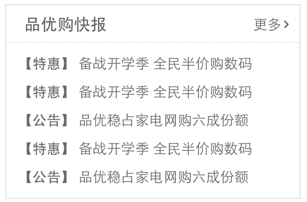

**补充：每条新闻在单行显示，且过长时显示省略号**

```html
    <div class="news-bd">
      <ul>
        <li>
          <a href="#">
            <strong>【特惠】</strong> 备战开学季 全民半价购数码再不来就晚了
          </a>
        </li>
     ...
```

```css
.news .news-bd ul li {
  height: 24px;
  line-height: 24px;
  overflow: hidden;
  white-space: nowrap;
  text-overflow: ellipsis;
}
```

#### 主体快报中生活服务部分

```html
<div class="lifeservice">
  <ul>
    <li>
      <i></i>
      <p>话费</p>
    </li>
    <li>
      <i></i>
      <p>话费</p>
    </li>
    <li>
      <i></i>
      <p>话费</p>
    </li>
...
  </ul>
</div>
```

```css
.lifeservice {
  height: 209px;
  border: 1px solid #e4e4e4;
  border-top: 0;
  overflow: hidden;
}
.lifeservice ul {
  /* 一行装不下 4 个 li：改变 li 的父元素 ul 宽度以让 li 装下 */
  /* 出现新问题：ul 超出其父元素；解决方法：hide overflowed part */
  /* 64*4 = 256 */
  width: 256px;
}
.lifeservice ul li {
  float: left;
  width: 63px;
  height: 71px;
  border-right: 1px solid #e4e4e4;
  border-bottom: 1px solid #e4e4e4;
  text-align: center;
}
.lifeservice ul li i {
  display: inline-block;
  width: 24px;
  height: 28px;
  background: url(../images/icons.png) no-repeat -16px -15px;
  margin-top: 12px;
}
```

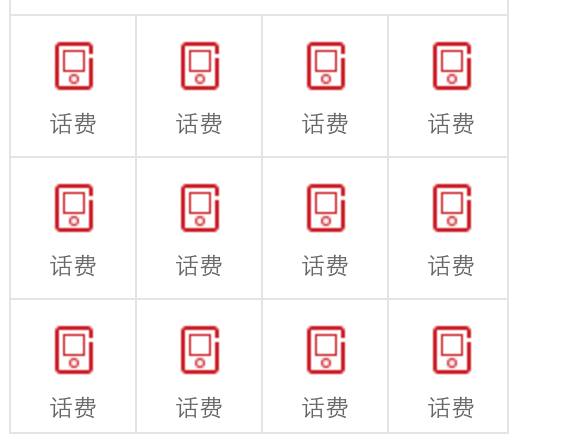

该区域最终效果

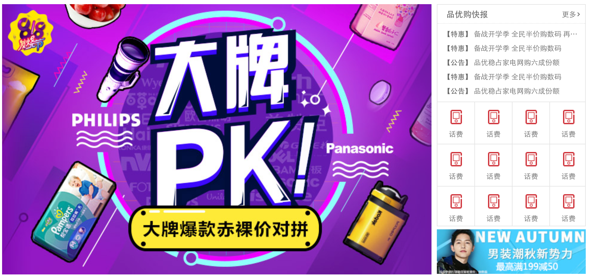

#### 推荐模块制作

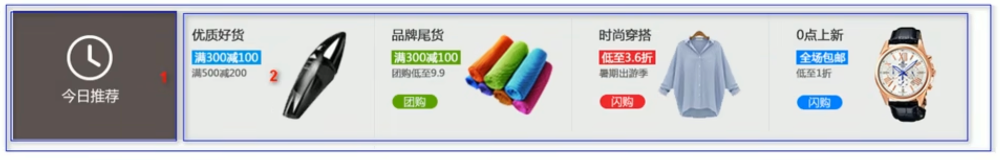

包含三个盒子：大盒子内包含两个子盒子，两个子盒子采用浮动

- 盒子 1 号：`recom-hd`
- 盒子 2 号：`recom-bd`

```html
    <!-- 推荐模块 -->
    <div class="recom w">
      <div class="recom-hd">
        
      </div>
      <div class="recom-bd"></div>
    </div>
```

```css
/* 推荐模块制作 */
.recom {
  height: 163px;
  /* background-color: pink; */
  margin-top: 12px;
}
.recom-hd {
  height: 163px;
  line-height: 163px;
  text-align: center;
  width: 205px;
  float: left;
  background-color: #5c5251;
}
.recom-bd {
  float: right;
}
```

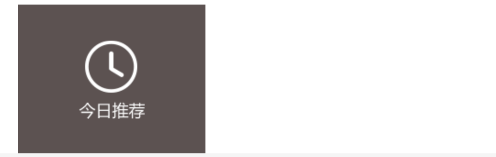

#### 推荐中右边部分

要点：

- `ul>li>img`，浮动 `li`
- 使用竖线将 `li` 隔开
- 固定 img 元素的宽高以避免图片大小不一致导致的错乱

```html
  <!-- 推荐模块 -->
  <div class="recom w">
    <div class="recom-hd">
      
    </div>
    <div class="recom-bd">
      <ul>
        <li></li>
        <li></li>
        <li></li>
        <li></li>
      </ul>
    </div>
  </div>
```

```css
/* 推荐模块制作 */
.recom {
  height: 163px;
  background-color: #ebebeb;
  margin-top: 12px;
}
.recom-hd {
  height: 163px;
  line-height: 163px;
  text-align: center;
  width: 205px;
  float: left;
  background-color: #5c5251;
}
.recom-bd {
  float: left;
}
.recom-bd ul li {
  position: relative;
  float: left;
}
.recom-bd ul li img {
  /* 指定图片大小，避免因图片分辨率不同造成的图片错乱 */
  width: 248px;
  height: 163px;
}
/* .recom-bd ul li::after { */
/* 只选择前三个 li 并为他们添加小竖线 */
.recom-bd ul li:nth-child(-n + 3):after {
  position: absolute;
  right: 0;
  top: 10px;
  content: '';
  width: 1px;
  height: 145px;
  background-color: #ddd;
}
```

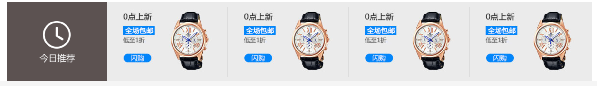

#### 家用电器模块搭建

除了“家用电器”模块，还有“手机通讯”、“电脑办公” 等模块

它们的结构都类似：

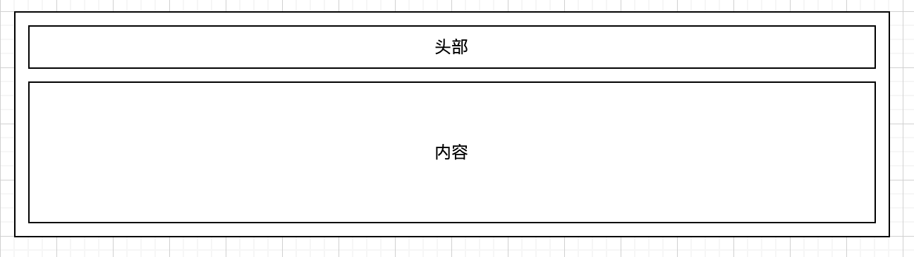

示例

```html
    <!-- “楼层区” 之家用电器模块 -->
    <div class="floor">
      <!-- 家电区域 -->
      <div class="w jiadian">
        <div class="box-hd">头部</div>
        <div class="box-bd">主体</div>
      </div>
    </div>
```

#### 家用电器头部部分

```html
    <div class="floor">
      <!-- 家电区域 -->
      <div class="w jiadian">
        <div class="box-hd">
          <h3>家用电器</h3>
          <div class="tab-list">
            <ul>
              <li><a href="#" class="style_red">热门</a>|</li>
              <li><a href="#">大家电</a>|</li>
              <li><a href="#">生活电器</a>|</li>
              <li><a href="#">厨房电器</a>|</li>
              <li><a href="#">厨房电器</a>|</li>
              <li><a href="#">厨房电器</a>|</li>
              <li><a href="#">厨房电器</a>|</li>
              <li><a href="#">厨房电器</a></li>
            </ul>
          </div>
        </div>
        <div class="box-bd">主体</div>
      </div>
    </div>
```

```css
/* 家用电器模块 */
.floor .w {
  margin-top: 10px;
}
.box-hd {
  height: 30px;
  line-height: 30px;
  border-bottom: 2px solid #c81623;
}
.box-hd h3 {
  float: left;
  color: #c81623;
  font-size: 18px;
  font-weight: 400;
}
.box-hd .tab-list {
  float: right;
}
.box-hd .tab-list ul li {
  float: left;
}
.box-hd .tab-list ul li a {
  margin: 0 15px;
}
```

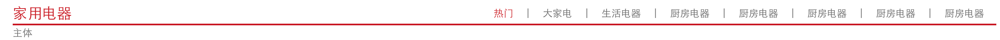

#### 家用电器内容部分-1

```html
        <div class="box-bd">
          <div class="tab-content">
            <div class="tab-list-item">
              <div class="col_210">1</div>
              <div class="col_329">2</div>
              <div class="col_221">3</div>
              <div class="col_221">4</div>
              <div class="col_219">5</div>
            </div>
          </div>
        </div>
```

```css
.box-bd {
  height: 361px;
  background-color: pink;
}
.box-bd .tab-content .tab-list-item > div {
  float: left;
}
.col_210 {
  width: 210px;
}
.col_329 {
  width: 329px;
}
.col_221 {
  width: 221px;
}
.col_219 {
  width: 219px;
}
```

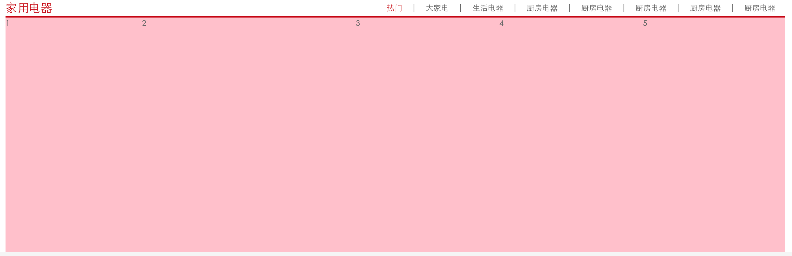

#### 家用电器内容部分-2

```html
        <div class="box-bd">
          <div class="tab-content">
            <div class="tab-list-item">
              <div class="col_210">
                <ul>
                  <li><a href="#">节能补贴</a></li>
                  <li><a href="#">节能补贴</a></li>
                  <li><a href="#">节能补贴</a></li>
                  <li><a href="#">节能补贴</a></li>
                  <li><a href="#">节能补贴</a></li>
                  <li><a href="#">节能补贴</a></li>
                </ul>
                <a href="#">
                  
                </a>
              </div>
              <div class="col_329">2</div>
              <div class="col_221">3</div>
              <div class="col_221">4</div>
              <div class="col_219">5</div>
            </div>
          </div>
        </div>
```

```css
.box-bd .tab-content .tab-list-item > div {
  float: left;
  height: 361px;
}
.col_210 {
  width: 210px;
  background-color: #fbfbfb;
  text-align: center;
}
.col_210 ul {
  padding-left: 12px;
}
.col_210 ul li {
  float: left;
  width: 85px;
  height: 34px;
  line-height: 33px;
  border-bottom: 1px solid #ccc;
  text-align: center;
  margin-right: 10px;
}
```

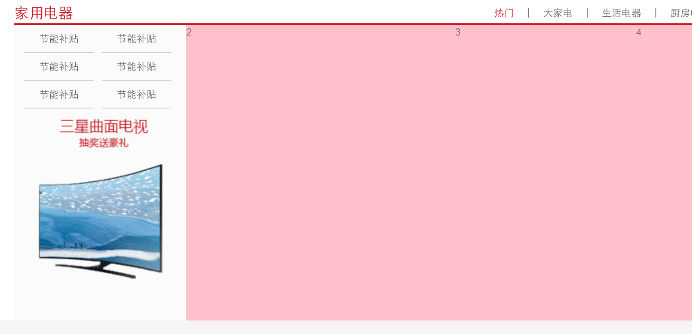

#### 家用电器内容部分-3

```html
      <!-- 家电区域 -->
      <div class="w jiadian">
        <div class="box-hd">
          <h3>家用电器</h3>
          <!-- tab 页列表导航 -->
          <div class="tab-list">
            <ul>
              <li><a href="#" class="style_red">热门</a>|</li>
              <li><a href="#">大家电</a>|</li>
              <li><a href="#">生活电器</a>|</li>
              <li><a href="#">厨房电器</a>|</li>
              <li><a href="#">厨房电器</a>|</li>
              <li><a href="#">厨房电器</a>|</li>
              <li><a href="#">厨房电器</a>|</li>
              <li><a href="#">厨房电器</a></li>
            </ul>
          </div>
        </div>
        <div class="box-bd">
          <!-- tab 页内容区 -->
          <div class="tab-content">
      <!-- 第一个 tab 页 -->
            <div class="tab-list-item">
              <!-- 第一列 -->
              <div class="col_210">
                <ul>
                  <li><a href="#">节能补贴</a></li>
                  <li><a href="#">节能补贴</a></li>
                  <li><a href="#">节能补贴</a></li>
                  <li><a href="#">节能补贴</a></li>
                  <li><a href="#">节能补贴</a></li>
                  <li><a href="#">节能补贴</a></li>
                </ul>
                <a href="#">
                  
                </a>
              </div>
              <!-- 第二列 -->
              <div class="col_329">
                <a href="#">
                  
                </a>
              </div>
              <!-- 第三列 -->
              <div class="col_221">
                <a href="#" class="bb">
                  
                </a>
                <a href="#">
                  
                </a>
              </div>
              <!-- 第四列 -->
              <div class="col_221">
                <a href="#">
                  
                </a>
              </div>
              <!-- 第五列 -->
              <div class="col_219">
                <a href="#" class="bb">
                  
                </a>
                <a href="#">
                  
                </a>
              </div>
            </div>
          </div>
        </div>
      </div>
```

```css
.col_329 {
  width: 329px;
}
.col_221 {
  width: 221px;
}
.col_221 {
  border-right: 1px solid #ccc;
}
.col_219 {
  width: 219px;
}
.bb {
  /* a 如果包含有宽度的盒子，则需要将 a 转为块级元素 */
  display: inline-block;
  border-bottom: 1px solid #ccc;
}
```

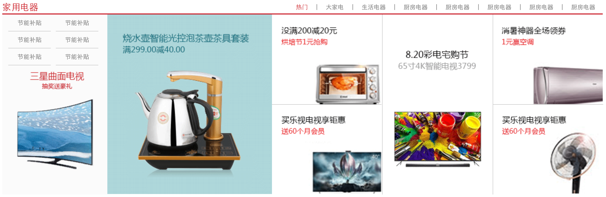

### 列表页制作

1. 创建 `list.html`
2. 因为列表页的头部和底部基本一致，所以要把首页中头部和底部的结构复制过来
3. 头部和底部的样式也需要，因此 `list.html` 中还需要引入 `common.css`
4. 创建 `list.css`，是列表页专门的样式文件

```html
<!DOCTYPE html>
<html lang="zh-CN">
  <head>
    <meta charset="UTF-8" />
    <meta name="viewport" content="width=device-width, initial-scale=1.0" />
    <!-- tdk -->
    <title>品优购列表页</title>
    <meta
      name="description"
      content="品优购-专业的综合网上购物商城，为您提供正品低价的购物选择、优质便捷的服务体验。商品来自全球数十万品牌商家，囊括家电、手机、电脑、服装、居家、母婴、美妆、个护、食品、生鲜等丰富品类，满足各种购物需求。"
    />
    <meta
      name="Keywords"
      content="网上购物,网上商城,家电,手机,电脑,服装,居家,母婴,美妆,个护,食品,生鲜,京东"
    />
    <!-- 样式 -->
    <link rel="stylesheet" href="css/base.css" />
    <link rel="stylesheet" href="css/common.css" />
    <link rel="stylesheet" href="css/list.css" />
    <!-- favicon 图标 -->
    <link rel="shortcut icon" href="favicon.ico" />
  </head>
  <body>
    <!-- 快捷导航模块 -->

    <!-- 头部模块 -->

    <!-- 导航模块 -->

    <!-- footer 模块 -->
  </body>
</html>
```

#### 秒杀模块

```html
    <header class="header w">
      <div class="logo">
        <h1><a href="index.html" title="品优购">品优购</a></h1>
      </div>
      <div class="seckill">
        <a href="#"></a>
      </div>
    ..
```

```css
.seckill {
  position: absolute;
  left: 190px;
  top: 40px;
  border-left: 1px solid #c81523;
  padding-left: 10px;
}
```

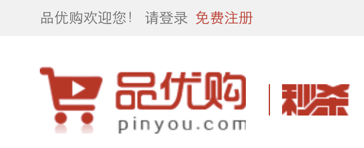

#### 列表页 header 和 nav 修改

```html
    <div class="nav">
      <div class="w">
        <div class="sk_list">
          <ul>
            <li><a href="#">品优秒杀</a></li>
            <li><a href="#">即将售罄</a></li>
            <li><a href="#">超值低价</a></li>
          </ul>
        </div>
        <div class="sk_content">
          <ul>
            <li><a href="#">女装</a></li>
            <li><a href="#" class="style_red">女鞋</a></li>
            <li><a href="#">女装</a></li>
            <li><a href="#">女装</a></li>
            <li><a href="#">女装</a></li>
            <li><a href="#">女装</a></li>
            <li><a href="#">女装</a></li>
            <li><a href="#">女装</a></li>
            <li><a href="#">更多分类</a></li>
          </ul>
        </div>
      </div>
    </div>
```

```css
.sk_list {
  float: left;
}
.sk_list ul li {
  float: left;
}
.sk_list ul li a {
  display: block;
  line-height: 47px;
  padding: 0 30px;
  font-size: 16px;
  font-weight: 700;
  color: #000;
}
.sk_content {
  float: right;
}
.sk_content ul li {
  float: left;
}
.sk_content ul li a {
  display: block;
  line-height: 49px;
  padding: 0 20px;
  font-size: 14px;
}
.sk_content ul li:last-child {
  position: relative;
}
/* 为最后一个 li 的 a 添加 ::after */
.sk_content ul li:last-child a::after {
  /* 加定位微调图标 */
  position: absolute;
  top: 0.2px;
  right: 6px;
  content: '\e91e';
  font-family: 'icomoon';
}
```

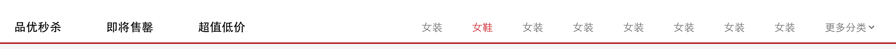

**出现一点小问题** :warning: ：调大了右侧 `ul li a`的行号以降低文字高度，撑大了右侧 ul ，如何消除对之后布局的影响呢

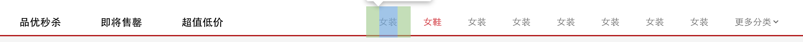

解决方法：在父级元素中“剪”掉多出的部分

```css
.nav {
  overflow: hidden;
}
```

#### 列表页主体

```html
    <div class="w sk-container">
      <div class="sk-hd">
        
      </div>
      <!-- 主体 -->
      <div class="sk-bd">
        <ul class="clearfix">
          <li>
            
          </li>
          <li>
            
          </li>
          <li>
            
          </li>
          <li>
            
          </li>
          <li>
            
          </li>
          <li>
            
          </li>
          <li>
            
          </li>
          <li>
            
          </li>
        </ul>
      </div>
    </div>
```

```css
.sk-bd ul li {
  float: left;
  overflow: hidden;
  width: 290px;
  height: 460px;
  border: 1px solid transparent;
  margin-right: 13px;
}
/* 清除每一行最后一个 li 的右边距 */
.sk-bd ul li:nth-child(4n) {
  margin-right: 0;
}
.sk-bd ul li:hover {
  border: 1px solid #c81523;
}
```

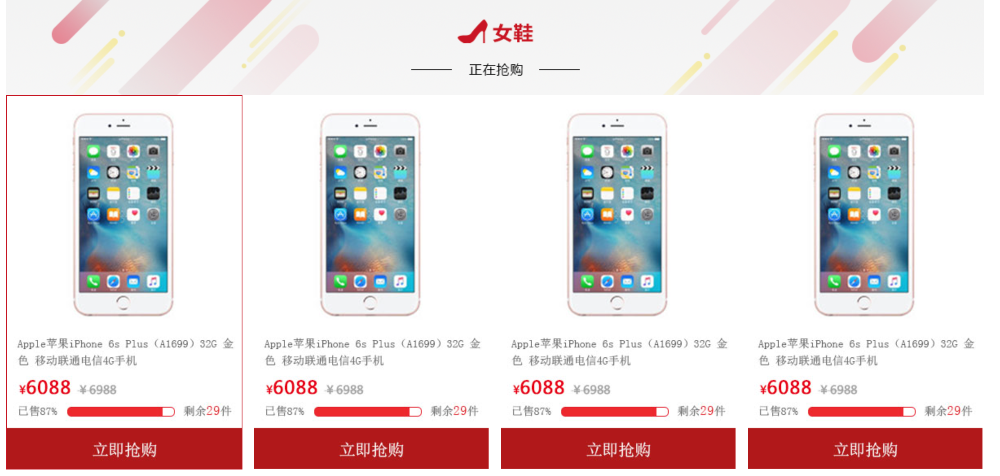

### 注册页制作

创建页面 `register.html`

> 注意：注册页面比较隐私，为了保护用户信息，我们不需要对当前页面做 SEO

```html
<!DOCTYPE html>
<html lang="en">
  <head>
    <meta charset="UTF-8" />
    <meta name="viewport" content="width=device-width, initial-scale=1.0" />
    <title>品优购-个人注册</title>
    <!-- 样式 -->
    <link rel="stylesheet" href="css/base.css" />
    <link rel="stylesheet" href="css/register.css" />
    <!-- favicon 图标 -->
    <link rel="shortcut icon" href="favicon.ico" />
  </head>
  <body>
    <div class="w">
      <header>
        <div class="logo">
          <a href="index.html">
            
          </a>
        </div>
      </header>
      <div class="registerarea">主体</div>
      <footer>底部</footer>
    </div>
  </body>
</html>
```

```css
.w {
  width: 1200px;
  margin: 0 auto;
}
header {
  height: 84px;
  border-bottom: 2px solid #c81523;
}
.logo {
  padding-top: 18px;
}
```

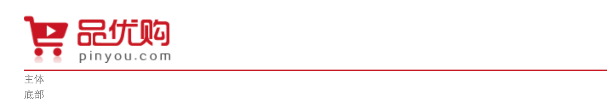

#### 注册页主体-头部

```html
<div class="w">
  <header>
    <div class="logo">
      <a href="index.html">
        
      </a>
    </div>
  </header>
  <div class="registerarea">
    <h3>
      注册新用户
      <div class="login">已有账号？<a href="index.htlm">去登录</a></div>
    </h3>
  </div>
  <footer>底部</footer>
</div>
```

```css
.registerarea {
  height: 520px;
  border: 1px solid #ccc;
  margin-top: 20px;
}
.registerarea h3 {
  height: 42px;
  line-height: 42px;
  border-bottom: 1px solid #ccc;
  background-color: #ececec;
  padding-left: 10px;
  font-size: 16px;
}
.registerarea h3 div {
  float: right;
  padding-right: 10px;
  font-size: 14px;
}
.registerarea h3 div a {
  color: #c81523;
}
```

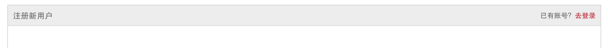

#### 注册页主体-第一个表单项

```html
    <div class="reg-form">
      <ul>
        <li>
          <label for="">手机号：</label> <input type="text" />
          <span class="error">手机号码格式不正确，请重新输入</span>
        </li>
        <li><label for="">机号：</label> <input type="text" /></li>
      </ul>
    </div>
```

```css
.reg-form {
  width: 600px;
  margin: 50px auto 0;
  background-color: pink;
}
.reg-form ul li label {
  /* 对 label 指定宽度、右对齐 */
  display: inline-block;
  text-align: right;
  width: 88px;
}
.reg-form ul li input {
  width: 242px;
  height: 37px;
  border: 1px solid #ccc;
}
.error {
  color: red;
}
```

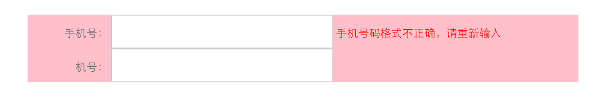

#### 注册页主体-其他表单项

```html
  <div class="reg-form">
    <ul>
      <li>
        <label for="">手机号：</label> <input type="text" />
        <span class="error">
          <i class="error-icon"></i>
          手机号码格式不正确，请重新输入</span
        >
      </li>
      <li>
        <label for="">短信验证码：</label> <input type="text" />
        <span class="success">
          <i class="success-icon"></i>
          验证正确</span
        >
      </li>
      <li>
        <label for="">登录密码：</label> <input type="text" />
        <span class="error">
          <i class="error-icon"></i>
          号码格式不正确，请重新输入</span
        >
      </li>
      <li><label for="">再次输入密码：</label> <input type="text" /></li>
    </ul>
  </div>
```

```css
.reg-form ul li {
  margin-bottom: 20px;
}
.reg-form ul li input {
  width: 242px;
  height: 37px;
  border: 1px solid #ccc;
  padding-left: 10px;
}
.error {
  padding-left: 10px;
  color: red;
}
.success-icon,
.error-icon {
  display: inline-block;
  width: 20px;
  height: 20px;
  vertical-align: middle;
  margin-top: -2px;
}
.error-icon {
  background: url(../images/error.png) no-repeat;
}
.success {
  padding-left: 10px;
  color: green;
}
.success-icon {
  background: url(../images/success.png) no-repeat;
}
```

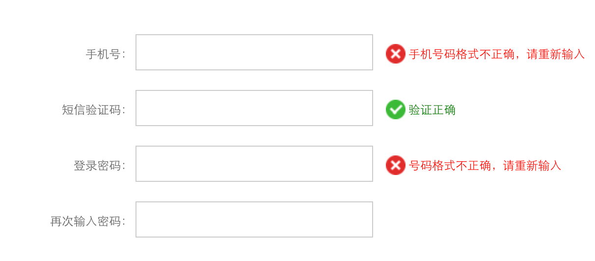

#### 注册页主体-安全程度

```html
            <li class="safe">
              安全程度 <em class="weak">弱</em><em class="middle">中</em
              ><em class="strong">强</em>
            </li>
```

```css
.safe {
  padding-left: 170px;
}
.safe em {
  padding: 0 12px;
  margin-right: 2px;
  color: #fff;
}
.safe .weak {
  background-color: #de1111;
}
.safe .middle {
  background-color: #40b83f;
}
.safe .strong {
  background-color: #f79100;
}
```

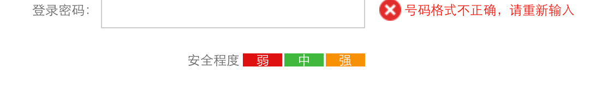

#### 注册页主体-同意模块和完成注册

```html
              <li class="agree">
                <input type="checkbox" />&nbsp;同意协议并注册<a href="#"
                  >《用户协议》</a
                >
              </li>
              <li class="registe">
                <button class="btn">完成注册</button>
              </li>
```

```css
.agree {
  padding-left: 126px;
}
.agree input {
  vertical-align: middle;
}
.agree a {
  color: #3273f6;
}
.btn {
  width: 200px;
  height: 34px;
  background-color: #c81523;
  color: #fff;
  margin-left: 100px;
  margin-top: 20px;
}
```

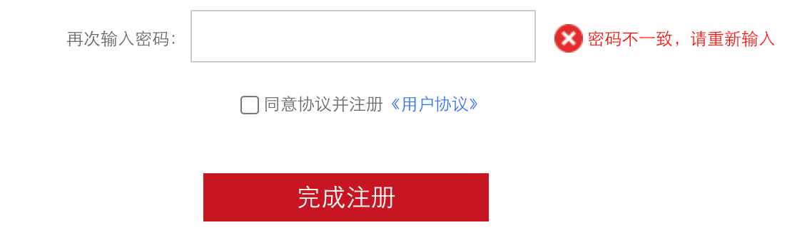

#### 注册页尾部

```html
      <!-- footer 模块 -->
      <footer class="footer">
        <div class="w">
          <!-- 版权部分 -->
          <div class="mod_copyright">
            <div class="links">
              <a href="#">关于我们</a> | <a href="#">联系我们</a> |
              <a href="#">联系客服</a> | <a href="#">商家入驻</a> |
              <a href="#">营销中心</a> | <a href="#">手机品优购</a> |
              <a href="#">友情链接</a> | <a href="#">销售联盟</a> |
              <a href="#">品优购社区</a> | <a href="#">品优购公益</a> |
              <a href="#">English</a> | <a href="#">Site</a> |
              <a href="#">Contact</a>
            </div>
            <div class="copyright">
              地址：北京市昌平区建材城西路金燕龙办公楼一层 邮编：100096
              电话：400-618-4000 传真：010-82935100 邮箱: zhanghj+itcast.cn
              <br />
              京ICP备08001421号京公网安备110108007702
            </div>
          </div>
        </div>
      </footer>
```

```css
.mod_copyright {
  text-align: center;
  margin-top: 20px;
}
.mod_copyright .links {
  margin-top: 15px;
}
.mod_copyright .links a {
  margin: 0 3px;
}
.mod_copyright .copyright {
  line-height: 20px;
}
```

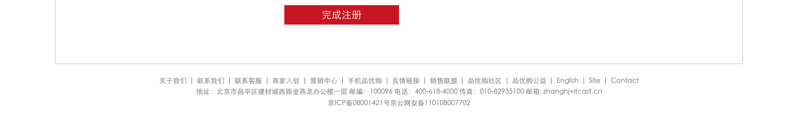

### 详情页

测量 psd 、绘制页面

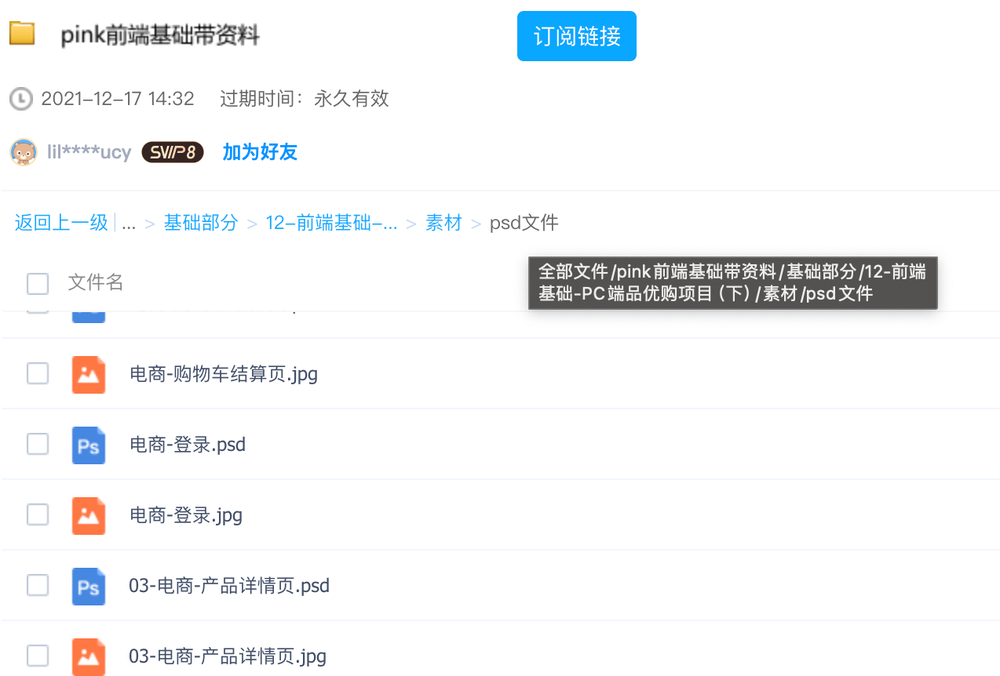

### 上传网站到互联网

## 课程总结

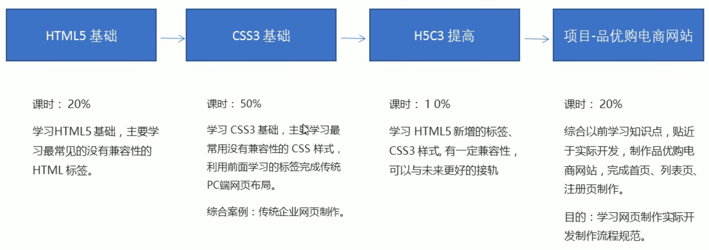 -->
