# CSS3 转换和转换

## 目录

- [1. CSS 基础](/langs/css-pink/)
- [2. CSS 进阶](/langs/css-pink/02_enhance/)
- [3. Html5 和 CSS3 了解](/langs/css-pink/03_h5c3_intro/)
- [4. CSS3 转换](/langs/css-pink/04_c3_transform/)

## CSS3 2D 转换

### 2D 移动

**2D 移动**：是 2D 转换里的一种功能，可以改变元素在页面中的位置，类似定位

```
trasform: translate(x, y);
trasform: translateX(n);
trasform: translateY(n);
```

示例

```html
  <style>
    p {
      width: 200px;
      height: 200px;
      background-color: pink;
      /* 同时移动 x、y 轴 */
      /* transform: translate(200px, 100px); */

      /* 只移动 x 轴 */
      transform: translate(200px, 0);
      transform: translateX(100px);
    }
  </style>
  <body>
    <p></p>
  </body>
```

---

总结：移动盒子的方法

1. 定位
2. 外边距
3. 2d 移动

---

**2D 移动特点一：不会影响其他元素的位置**

```html
  <style>
    * {
      margin: 0;
      padding: 0;
    }
    p {
      width: 200px;
      height: 200px;
    }
    .p2 {
      background-color: purple;
    }
    .p1 {
      background-color: pink;
      transform: translate(100px, 300px);
    }
  </style>
  <body>
    <p class="p1"></p>
    <p class="p2"></p>
  </body>
```

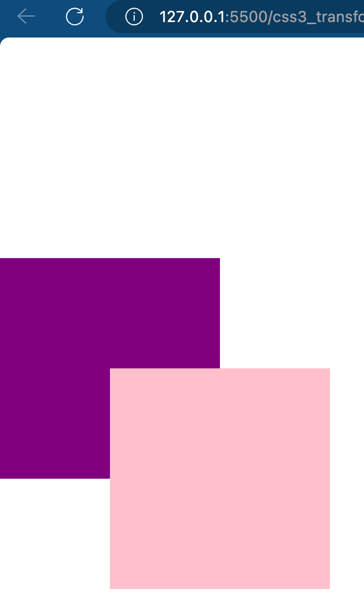

**2D 移动特点二**：在 translate 中使用百分比，百分比表示相对于自身元素的比例，比如 `translate(50%, 50%)`

另一个示例：盒子水平居中+垂直居中

```html
  <style>
    * {
      margin: 0;
      padding: 0;
    }
    .box {
      position: relative;
      width: 800px;
      height: 600px;
      margin: 50px auto;
      background-color: #ccc;
    }
    .child {
      width: 400px;
      height: 200px;
      background-color: pink;
      /* 定位 + 转换 */
      position: absolute;
      top: 50%;
      left: 50%;
      transform: translate(-50%, -50%);
    }
  </style>
  <body>
    <div class="box">
      <div class="child"></div>
    </div>
  </body>
```

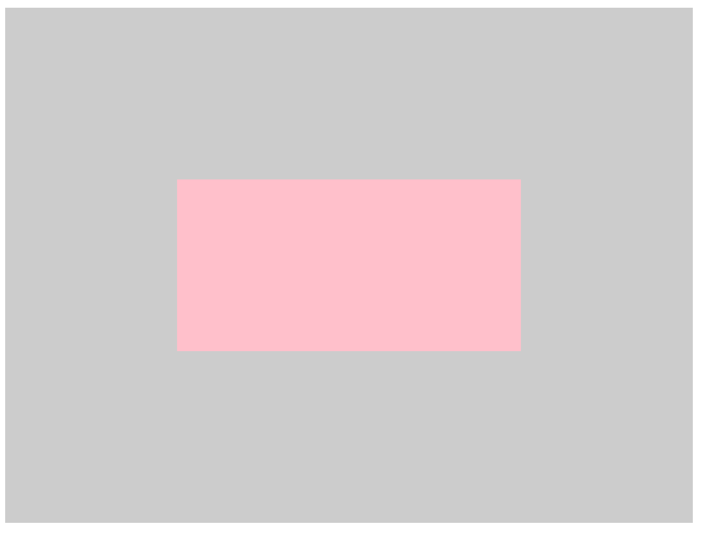

**2D 移动特点三：不对行内元素生效**

### 2D 旋转

2D 旋转指的是让元素在二维平面内顺时针旋转或逆时针旋转

```
transform: rotate(度数);
```

说明：

1. 参数表示度数，单位是 degree，缩写 deg，比如 `rotate(45deg)`
2. 角度为正数表示顺时针旋转；负数表示逆时针旋转
3. 默认旋转的中心点是元素中心点

小案例：旋转配合[过渡](https://developer.mozilla.org/zh-CN/docs/Web/CSS/transition)，鼠标 hover 时图片旋转

```html
  <style>
    img {
      width: 200px;
      height: 200px;
      border-radius: 100px;
      border: 4px solid pink;
      /* 过渡 */
      transition: all 0.3s;
    }
    img:hover {
      transform: rotate(360deg);
    }
  </style>
  <body>
    
  </body>
```

另一个案例：鼠标悬停时，箭头改变方向

```html
  <style>
    p.bar {
      position: relative;
      width: 249px;
      height: 35px;
      border: 1px solid #ccc;
    }
    p.bar::after {
      content: '';
      position: absolute;
      top: 13px;
      right: 10px;
      width: 10px;
      height: 10px;
      border-left: 1px solid black;
      border-top: 1px solid black;
      transform: rotate(45deg);
      transition: all 0.3s;
    }
    p.bar:hover::after {
      transform: rotate(225deg);
    }
  </style>
  <body>
    <p class="bar"></p>
  </body>
```

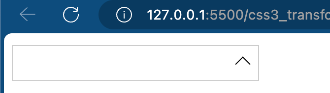

**⭐️ 设置旋转中心点**

```
transform-origin: x y;
```

说明：

1. 参数 x 和 y 默认是元素的中心点，即 `(50%, 50%)`，这里的百分比相对的是元素的左上角
2. 也可以给 x、y 设置像素或方位名词（`top|bottom|left|right|center`）

示例

```html
  <style>
    * {
      margin: 0;
      padding: 0;
    }
    p {
      margin: 50px auto;
      width: 200px;
      height: 200px;
      background: pink;
      transition: all 1s;
      transform: rotate(0deg);
      /* 默认中心点（相对于元素的左上角）*/
      /* transform-origin: 50% 50%; */

      /* 使用百分比设置旋转中心点 */
      /* transform-origin: 0 50%; */
      /* 也可以用像素 */
      /* transform-origin: 0 100px; */
      /* 也可使用方位名词 */
      transform-origin: left center;
    }
    p:hover {
      transform: rotate(360deg);
    }
  </style>
```

小案例：hover 一个元素时，从左下角旋转出来一个新元素

```html
  <style>
    * {
      margin: 0;
      padding: 0;
    }
    .box {
      margin: 30px auto;
      width: 200px;
      height: 200px;
      background-color: pink;
      overflow: hidden;
    }
    .child {
      height: inherit;
      width: inherit;
      background-color: purple;
      transform-origin: 0 100%;
      transform: rotate(90deg);
      transition: all 0.2s;
    }
    .box:hover .child {
      transform: rotate(0deg);
    }
    .child img {
      width: 200px;
      height: 200px;
    }
  </style>
  <body>
    <div class="box">
      <div class="child">
        
      </div>
    </div>
  </body>
```

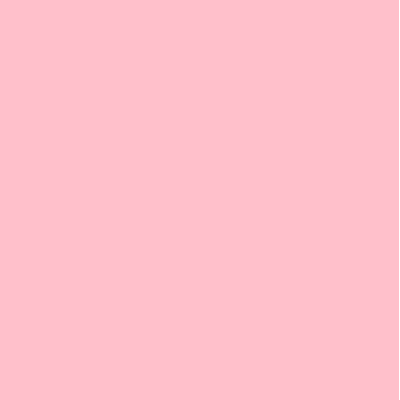

> 另一种做法：使用 `.box::after` 伪元素做

### 2D 缩放

放大或缩小元素

```
transform: scale(x, y);
```

说明：x 和 y 表示缩放比例，必须为正数

基本使用

```html
  <style>
    * {
      margin: 0;
      padding: 0;
    }
    p {
      margin: 100px auto;
      width: 200px;
      height: 200px;
      background-color: pink;
      transform: scale(1, 1);
      transition: all 0.3s;
    }
    p:hover {
      /* 1.基本用法：宽度为 2 倍、高度不变 */
      /* transform: scale(2, 1); */

      /* 2.等比例放大 */
      /* transform: scale(2); */
      /* 相当于 */
      /* transform: scale(2, 2); */

      /* 3.缩小：宽度缩小一倍，高度不变 */
      transform: scale(0.5, 1);
    }
  </style>
  <body>
    <p></p>
  </body>
```

**缩放和改变宽高不同之处**：

- **缩放不会影响其他盒子**；改变宽高会影响其他盒子
- **缩放可以设置中心点**（还是通过 `transform-origin` 设置）

小案例：光标经过图片放大

```html
  <style>
    .box {
      width: 200px;
      height: 200px;
      margin: 100px auto;
      border: 1px solid #ccc;
      overflow: hidden;
    }
    .box img {
      width: inherit;
      height: inherit;
      transition: all 0.2s;
    }
    .box:hover img {
      transform: scale(1.2);
    }
  </style>
  <body>
    <div class="box">
      
    </div>
  </body>
```

小案例：分页按钮

```html
  <style>
    * {
      margin: 0;
      padding: 0;
    }
    li {
      list-style: none;
    }
    .box {
      margin: 100px auto;
    }
    .box ul li {
      float: left;
      width: 50px;
      height: 50px;
      line-height: 50px;
      border: 2px solid skyblue;
      border-radius: 25px;
      text-align: center;
      font-size: 30px;
      margin-left: 20px;
      transition: all 0.2s;
      cursor: pointer;
    }
    .box ul li:hover {
      transform: scale(1.2);
    }
  </style>
  <body>
    <div class="box">
      <ul>
        <li>1</li>
        <li>2</li>
        <li>3</li>
        <li>4</li>
        <li>5</li>
        <li>6</li>
        <li>7</li>
      </ul>
    </div>
  </body>
```

鼠标经过 5 时：

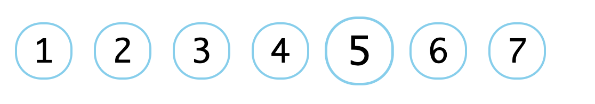

### 综合写法

```
transform: translate() rotate() scale()...;
```

说明

1. 写法为将多个转换排在 `transform` 后；
2. 排列的顺序会影响转换的效果
3. **当同时使用位移和其他属性时，需要将位移放在最前边**

示例

```html
  <style>
    p {
      width: 100px;
      height: 100px;
      background-color: pink;
      transition: all 0.5s;
    }
    p:hover {
      transform: translate(100px, 100px) rotate(360deg) scale(2);
    }
  </style>
  <body>
    <p>1</p>
  </body>
```

## CSS3 动画

动画，animation，是 C3 中最具有颠覆性的特征之一，可以通过设置多个节点来精确控制一个或一组动画，常用来实现复杂的动画效果。

相较于**过渡**，动画可以实现更多变化，更多控制，连续自动播放等效果

### 基本使用

制作动画步骤：

1. 定义动画
2. 使用动画

示例：打开页面后，盒子从左走到右

```html
  <style>
    /* 1.定义动画 */
    @keyframes move {
      0% {
        transform: translate(0, 0);
      }
      100% {
        transform: translate(1000px, 0);
      }
    }
    p {
      width: 200px;
      height: 200px;
      background-color: pink;
      /* 2.使用动画。设置动画名称、持续时间 */
      animation-name: move;
      animation-duration: 2s;
    }
  </style>
  <body>
    <p></p>
  </body>
```

**动画序列**

- `0%` 表示动画的开始、`100%` 表示动画的完成。这样的规则就是动画序列
- 在 `@keyframes` 中编写 CSS 样式，就能创建由当前样式逐渐改为新样式的动画效果
- 动画是使元素从一种样式逐渐变化为某一种样式的效果。你可以改变任意多的样式、任意多的次数
- 请用百分比来规定变化发生的时间，或用关键词 `from`,`to` 等同于 `0%`,`100%`

示例：使用多个动画序列

```html
  <style>
    /* 1.定义动画 */
    @keyframes move {
      0% {
        transform: translate(0, 0);
      }
      25% {
        transform: translate(800px, 0);
      }
      50% {
        transform: translate(0, 400px);
      }
      75% {
        transform: translate(800px, 400px);
      }
      100% {
        transform: translate(0, 0);
      }
    }
    p {
      width: 50px;
      height: 50px;
      background-color: pink;
      /* 2.使用动画。设置动画名称、持续时间 */
      animation-name: move;
      animation-duration: 2s;
    }
  </style>
  <body>
    <p></p>
  </body>
```

### 常见属性

| 属性                        | 描述                                                         |
| --------------------------- | ------------------------------------------------------------ |
| `@keyframes`                | 规定动画                                                     |
| `animation`                 | 所有动画属性的简写（除了 `animation-play-state` 属性）       |
| `animation-name`            | 规定 `@keyframes` 动画的名称。**必须**                       |
| `animation-duration`        | 规定动画完成一个周期所花费的时间，默认为 `0s`。**必须**      |
| `animation-timing-function` | 规定动画的速度曲线。默认为 `ease`                            |
| `animation-delay`           | 规定动画何时开始。默认为 `0s`                                |
| `animation-iteration-count` | 规定动画播放次数，默认为 1。`infinite` 表示无限              |
| `animation-direction`       | 规定动画是否在下一周期逆向播放，默认是 `normal` 表示正向，`alternate` 表示逆向播放，`reverse`表示反向 |
| `animation-play-state`      | 规定动画是否运行或暂停，默认是 `running`，`pause` 表示暂停。常配合鼠标经过使用 |
| `animation-fill-mode`       | 规定动画结束时的状态，默认为 `backward` 表示回到起始，`forwards` 表示保持 |

```html
  <style>
    @keyframes move {
      0% {
        transform: translate(0, 0);
      }
      25% {
        transform: translate(400px, 0) rotate(45deg);
      }
      50% {
        transform: translate(400px, 400px) rotate(90deg);
      }
      75% {
        transform: translate(0, 400px) rotate(135deg);
      }
      100% {
        transform: translate(0, 0) rotate(180deg);
      }
    }
    p {
      width: 50px;
      height: 50px;
      background-color: pink;
      /* 动画名称 */
      animation-name: move;
      /* 持续时间 */
      animation-duration: 4s;
      /* 运动曲线 */
      animation-timing-function: ease;
      /* 何时开始 */
      animation-delay: 1s;
      /* 迭代次数 */
      /* animation-iteration-count: infinite; */
      /* 播放方向。normal 正向，reverse 反向，alternate 正反交替 */
      /* animation-direction: reverse; */
      /* animation-direction: alternate; */
      /* 结束后的状态。forwards 保留结束状态，backwards 返回起始状态 */
      animation-fill-mode: forwards;
    }
    p:hover {
      /* 鼠标悬停时，暂停动画 */
      animation-play-state: paused;
    }
  </style>
  <body>
    <p>1</p>
  </body>
```

#### 速度曲线

 `animation-timing-function`

| 值            | 描述                                 |
| ------------- | ------------------------------------ |
| `liear`       | 匀速                                 |
| `ease`        | 默认。加速度先增大后减小，速度不对称 |
| `ease-in`     | 加速度一直增大                       |
| `ease-out`    | 加速度一直减小                       |
| `ease-in-out` | 加速度先增大后减小，速度对称         |
| `steps()`     | 指定间隔数量                         |

 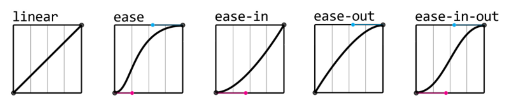

对比不同的速度曲线

```html
    <style>
      @keyframes timing {
        from {
          width: 0;
        }
        to {
          width: 800px;
        }
      }
      .box {
        margin: 0 auto;
        width: 800px;
      }
      .box div[class^='box'] {
        height: 50px;
        background-color: pink;
        margin-top: 10px;
      }
      .box .box1 {
        animation: timing 3s linear infinite;
      }
      .box .box2 {
        animation: timing 3s ease infinite;
      }
      .box .box3 {
        animation: timing 3s ease-in infinite;
      }
      .box .box4 {
        animation: timing 3s ease-out infinite;
      }
      .box .box5 {
        animation: timing 3s ease-in-out infinite;
      }
      .box .box6 {
        animation: timing 3s steps(10) infinite;
      }
    </style>
  </head>
  <body>
    <div class="box">
      <div class="box1">linear</div>
      <div class="box2">ease</div>
      <div class="box3">ease-in</div>
      <div class="box4">ease-out</div>
      <div class="box5">ease-in-out</div>
      <div class="box6">steps(10)</div>
    </div>
  </body>
```

另一个小案例：小熊奔跑

```html
  <head>
    <meta charset="UTF-8" />
    <meta name="viewport" content="width=device-width, initial-scale=1.0" />
    <title>Document</title>
    <style>
      @keyframes bear {
        0% {
          background-position: 0 0;
        }
        100% {
          background-position: -1600px 0;
        }
      }
      @keyframes move {
        0% {
          left: 0;
        }
        100% {
          left: 50%;
          transform: translateX(-50%);
        }
      }
      .bear {
        position: absolute;
        top: 210px;
        width: 200px;
        height: 100px;
        background: url(images/bear.png) no-repeat;
        animation: bear 2s steps(8) infinite, move 4s linear forwards;
      }
      .box {
        height: 400px;
        background-color: #ccc;
      }
    </style>
  </head>
  <body>
    <div class="box">
      <div class="bear"></div>
    </div>
  </body>
```

### 综合写法

```
animation: 动画名称(必) 持续时间(必) 运动曲线 何时开始 播放次数 播放反向 结束的状态;
animation: name duration timing-function delay iteration-count direction fill-mode;

animation: myfirst 4s linear 2s infinite alternate;
```

### 小案例

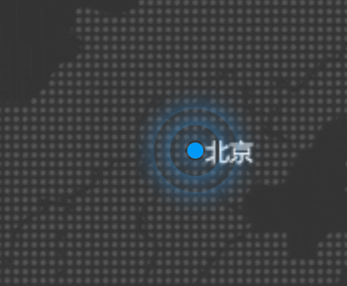

```html
  <head>
    <meta charset="UTF-8" />
    <meta name="viewport" content="width=device-width, initial-scale=1.0" />
    <title>Document</title>
    <style>
      .map {
        position: relative;
        width: 747px;
        height: 616px;
        background: url(images/map.png) no-repeat;
        margin: 0 auto;
      }
      .city {
        position: absolute;
        top: 227px;
        left: 550px;
        color: #fff;
      }
      .dot {
        width: 8px;
        height: 8px;
        background-color: #09f;
        border-radius: 50%;
      }
      .city div[class^='wave'] {
        position: absolute;
        width: 8px;
        height: 8px;
        border-radius: 50%;
        box-shadow: 0 0 12px #009dfd;
        top: 50%;
        left: 50%;
        transform: translate(-50%, -50%);
      }
      @keyframes larger {
        0% {
        }
        70% {
          width: 40px;
          height: 40px;
          opacity: 0.5;
        }
        100% {
          width: 72px;
          height: 72px;
          opacity: 0.2;
        }
      }
      .wave1 {
        animation: larger 1.2s linear infinite;
      }
      .wave2 {
        animation: larger 1.2s linear 0.4s infinite;
      }
      .wave3 {
        animation: larger 1.2s linear 0.8s infinite;
      }
      body {
        background-color: #333;
      }
    </style>
  </head>
  <body>
    <div class="map">
      <div class="city">
        <!-- 四合一：小圆点 + 三个波纹 -->
        <div class="dot"></div>
        <div class="wave1"></div>
        <div class="wave2"></div>
        <div class="wave3"></div>
      </div>
    </div>
  </body>
```

## CSS3 3D 转换

三维坐标系就是指立体空间，它由三个轴组成：

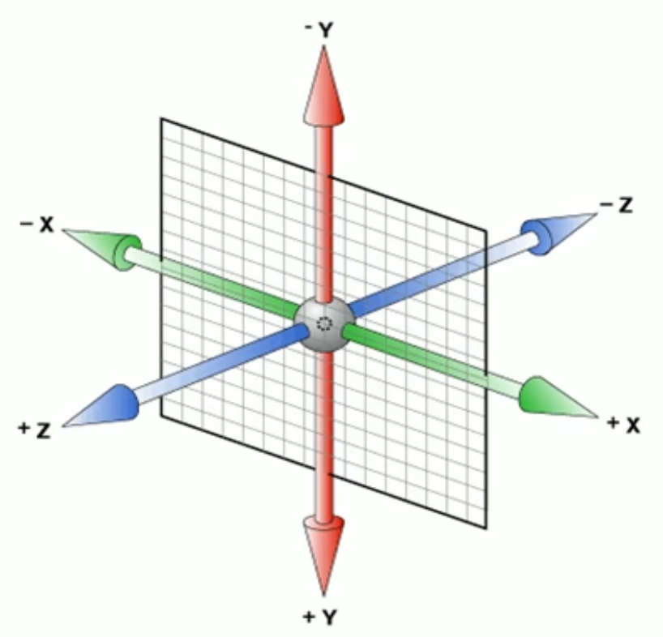

### 3D 移动

```
transform: translateX(100px)
transform: translateY(100px)
transform: translateZ(100px)
transform: translate(100px, 100px, 100px)
```

示例

```html
  <head>
    <meta charset="UTF-8" />
    <meta name="viewport" content="width=device-width, initial-scale=1.0" />
    <title>Document</title>
    <style>
      p {
        width: 200px;
        height: 200px;
        background-color: pink;
        /* translateZ: 
                沿着 z 轴移动
                单位一般为像素
                正值表示靠近用户移动，负值表示远离用户移动
        */
        /* transform: translateX(100px) translateY(100px) translateZ(100px); */
        /* 可以简写为 translate3d!
                z 轴不能省略，如果没有就指定为 0
         */
        transform: translate3d(100px, 100px, 100px);
      }
    </style>
  </head>
  <body>
    <p></p>
  </body>
```

透视 perspective

- 如果想在网页中产生 3D 效果，可以使用透视。
- 透视也称为**视距**：视距就是人眼到屏幕的距离
- 距离**视觉点**越近的在电脑平面成像越大，越远成像越小
- 透视的单位是像素

**透视写在【被观察元素的父盒子】上**

- `d`：表示视距，就是人眼到屏幕的距离
- `z`：表示 z 轴，指**元素**距离屏幕的距离，值越大，眼睛看到的元素就越大

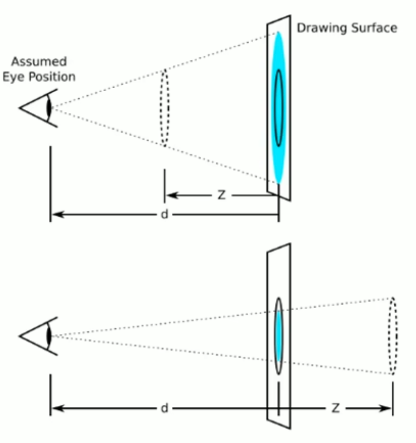

（原理图。上图 `z>0`，下图 `z<0`）

示例代码

```html
  <head>
    <meta charset="UTF-8" />
    <meta name="viewport" content="width=device-width, initial-scale=1.0" />
    <title>Document</title>
    <style>
      body {
        /* d-z=400px */
        /* perspective: 500px; */

        /* d-z=200px */
        /* perspective: 300px; */

        /* d-z=100px，元素变大 */
        perspective: 200px;
      }
      p {
        margin: 0 auto;
        width: 200px;
        height: 200px;
        background-color: pink;
        transform: translate3d(100px, 100px, 100px);
      }
    </style>
  </head>
  <body>
    <p></p>
  </body>
```

### 3D 旋转

可以让元素在三维平面内沿着 x、y、z 或自定义方向旋转

```
transform: rotateX(45deg)
transform: rotateY(45deg)
transform: rotateZ(45deg)
transform: rotate3d(45deg, 45deg, 45deg, deg) // 沿着自定义轴旋转
```

示例

```html
    <style>
      body {
    /* 添加透视和过渡增强效果 */
        perspective: 200px;
      }
      img {
        margin: 100px auto;
        width: 200px;
        height: 200px;
        display: block;
        transition: all 1s;
      }
      img:hover {
        transform: rotateX(45deg);
      }
    </style>
  </head>
  <body>
    
  </body>
```

**如何判断 x 轴的旋转方向？**

方法：左手准则

1. 左手拇指指向 **x 轴的正方向**（参考三维坐标轴 👇🏻）
2. 其余手指弯曲的方向就是该元素沿着 x 轴旋转的方向

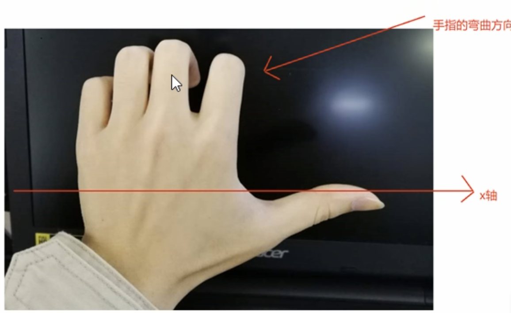

同理，y 和 z 轴旋转也可以使用此方法进行判断，即大拇指朝向坐标轴方向，其余手指朝向旋转方向

> 参考三维坐标轴
>
> 

补充：`rotate3d(x, y, z, deg)` 其中的 `(x,y,z)` 三者用来表示**旋转轴矢量**，最后一个表示旋转的角度。

```html
    <style>
      body {
        perspective: 200px;
      }
      img {
        margin: 100px auto;
        width: 200px;
        height: 200px;
        display: block;
        transition: all 1s;
      }
      img:hover {
        /* 矢量 (0,1,0) 指向 y 轴，等价于 rotateY(45deg) */
        /* transform: rotate3d(0, 1, 0, 45deg); */

        /* 沿着矢量 (1,1,0) 旋转 */
        transform: rotate3d(1, 1, 0, 45deg);
      }
    </style>
  </head>
  <body>
    
  </body>
```


### 3D 呈现

`transform-style`

- 属性要写给父元素，用于控制其**子元素**是否开启三维立体环境
- 默认值为 `flat` 表示不开启 3d 立体空间；另一值为 `preserve-3d` 表示开启立体空间

示例：

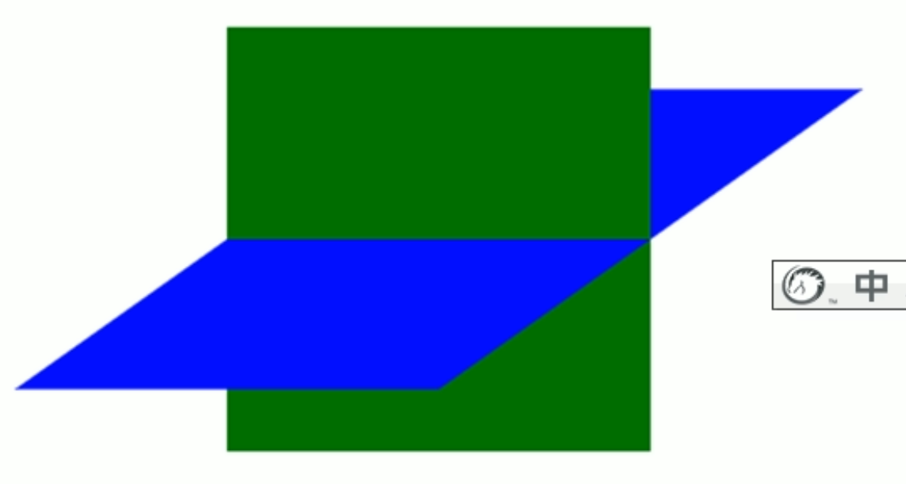

```html
    <style>
      .box {
        perspective: 500px;
        position: relative;
        margin: 100px auto;
        width: 300px;
        height: 500px;
        transition: all 2s;
        /* 让子元素保持3d立体空间 */
        transform-style: preserve-3d;
        transform: rotateY(-60deg);
      }
      .child1 {
        position: absolute;
        top: 50px;
        width: 300px;
        height: 200px;
        background-color: pink;
        /* transform: rotateX(30deg); */
      }
      .child2 {
        position: absolute;
        top: 0;
        width: 300px;
        height: 300px;
        background-color: blue;
        transition: all 1s;
      }
      .child2:hover {
        transform: rotateX(60deg);
      }
    </style>
  </head>
  <body>
    <div class="box">
      <div class="child1"></div>
      <div class="child2"></div>
    </div>
  </body>
```

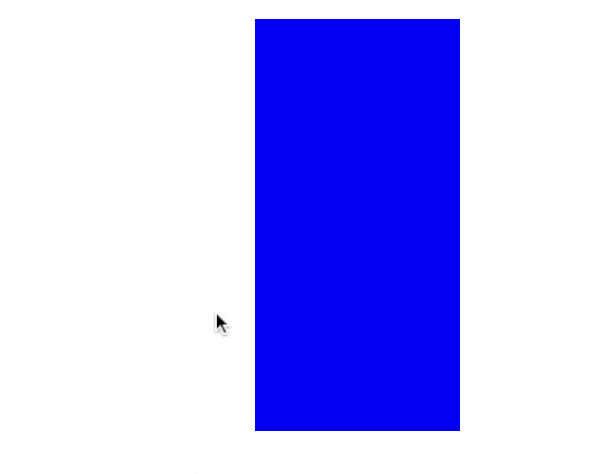

### 两个案例

**小案例**：两面反转的盒子

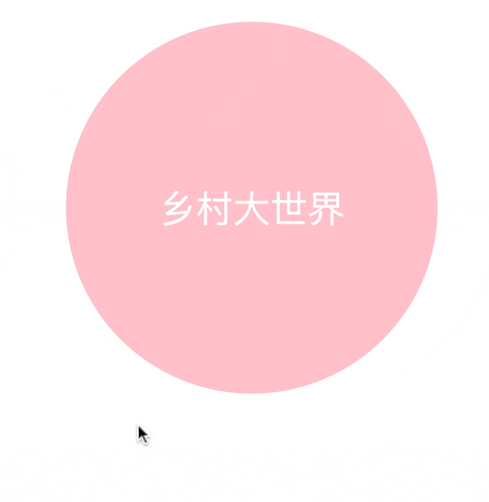

```html
    <style>
      body {
        perspective: 400px;
      }
      .box {
        position: relative;
        width: 300px;
        height: 300px;
        margin: 100px auto;
        transition: all 1s;
        transform-style: preserve-3d;
      }
      .box:hover {
        transform: rotateY(180deg);
      }
      .front,
      .back {
        position: absolute;
        top: 0;
        left: 0;
        width: 100%;
        height: 100%;
        border-radius: 50%;
        font-size: 30px;
        color: #fff;
        text-align: center;
        line-height: 300px;
      }
      .front {
        background-color: pink;
        transform: translateZ(1px);
      }
      .back {
        background-color: purple;
        transform: rotateY(180deg);
      }
    </style>
  </head>
  <body>
    <div class="box">
      <div class="front">乡村大世界</div>
      <div class="back">有胆你就来</div>
    </div>
  </body>
```

**小案例：3D 导航栏**

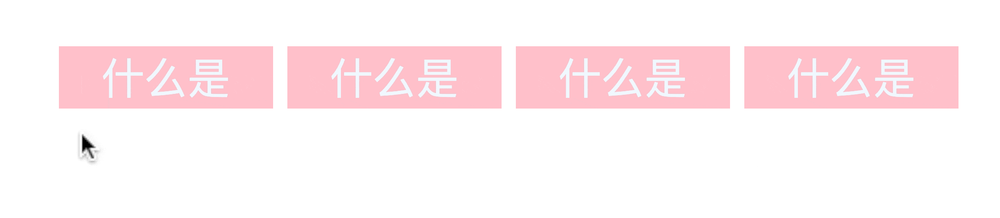

要点：确定旋转中心轴

```html
    <style>
      * {
        padding: 0;
        margin: 0;
      }
      ul {
        margin: 100px;
      }
      ul li {
        float: left;
        margin: 0 4px;
        list-style: none;
        width: 120px;
        height: 35px;
        /* .box 也需要透视效果，所以加在 .box 所有父元素 */
        perspective: 500px;
      }
      .box {
        position: relative;
        /* 开启 3d 呈现 */
        transform-style: preserve-3d;
        width: 100%;
        height: 100%;
        transition: all 1s;
      }
      .box:hover {
        transform: rotateX(90deg);
      }
      .front,
      .bottom {
        position: absolute;
        left: 0;
        top: 0;
        width: 100%;
        height: 100%;
        line-height: 35px;
        text-align: center;
        font-size: 24px;
        color: aliceblue;
      }
      .front {
        background-color: pink;
        transform: translateZ(17px);
      }
      .bottom {
        background-color: purple;
        transform: translateY(17px) rotateX(-90deg);
      }
    </style>
  </head>
  <body>
    <ul>
      <li>
        <div class="box">
          <div class="front">什么是</div>
          <div class="bottom">惊喜？</div>
        </div>
      </li>
      <li>
        <div class="box">
          <div class="front">什么是</div>
          <div class="bottom">惊喜？</div>
        </div>
      </li>
      <li>
        <div class="box">
          <div class="front">什么是</div>
          <div class="bottom">惊喜？</div>
        </div>
      </li>
      <li>
        <div class="box">
          <div class="front">什么是</div>
          <div class="bottom">惊喜？</div>
        </div>
      </li>
    </ul>
  </body>
```

## 综合案例-旋转木马


```html
    <style>
      body {
        perspective: 900px;
      }
      section {
        position: relative;
        width: 300px;
        height: 200px;
        margin: 250px auto;
        /* 保留 3d 效果 */
        transform-style: preserve-3d;
        animation: rotate 10s linear infinite;
        background: url(images/trees.jpeg) no-repeat;
      }
      section:hover {
        animation-play-state: paused;
      }
      @keyframes rotate {
        0% {
          transform: rotateY(0);
        }
        100% {
          transform: rotateY(360deg);
        }
      }
      section div {
        position: absolute;
        top: 0;
        left: 0;
        width: 100%;
        height: 100%;
        background: url(images/dog.jpg) no-repeat;
      }
      /*
      思路：六栏占360度，每栏占1/6，每部分的旋转轴都是 y 轴
      */
      section div:nth-child(1) {
        transform: translateZ(400px);
      }
      section div:nth-child(2) {
        transform: rotateY(60deg) translateZ(400px);
      }
      section div:nth-child(3) {
        transform: rotateY(120deg) translateZ(400px);
      }
      section div:nth-child(4) {
        transform: rotateY(180deg) translateZ(400px);
      }
      section div:nth-child(5) {
        transform: rotateY(240deg) translateZ(400px);
      }
      section div:nth-child(6) {
        transform: rotateY(300deg) translateZ(400px);
      }
    </style>
  </head>
  <body>
    <section>
      <div></div>
      <div></div>
      <div></div>
      <div></div>
      <div></div>
      <div></div>
    </section>
  </body>
```

## 浏览器私有前缀

浏览器私有前缀是为了兼容老版本的写法，较新版本的浏览器无需添加。

**私有前缀**

- `-moz-` 表示 firefox 浏览器私有属性
- `-ms-` 代表 ie 浏览器私有属性
- `-webkit-` 代表 safari、chrome 私有属性
- `-o-` 代表 opera 私有属性

提倡写法：先写私有前缀再写通用的

```css
-moz-border-radius: 10px;
-ms-border-radius: 10px;
-webkit-border-radius: 10px;
-o-border-radius: 10px
border-radius: 10px;
```
