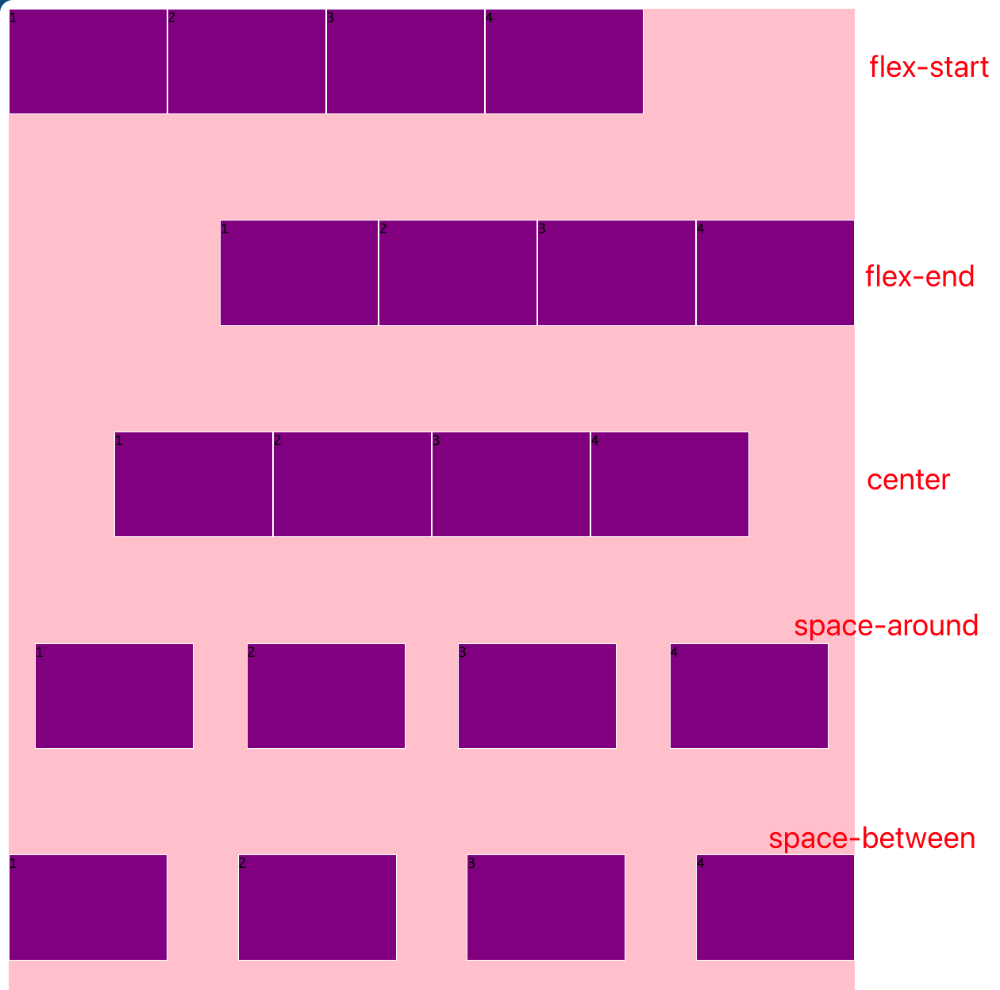
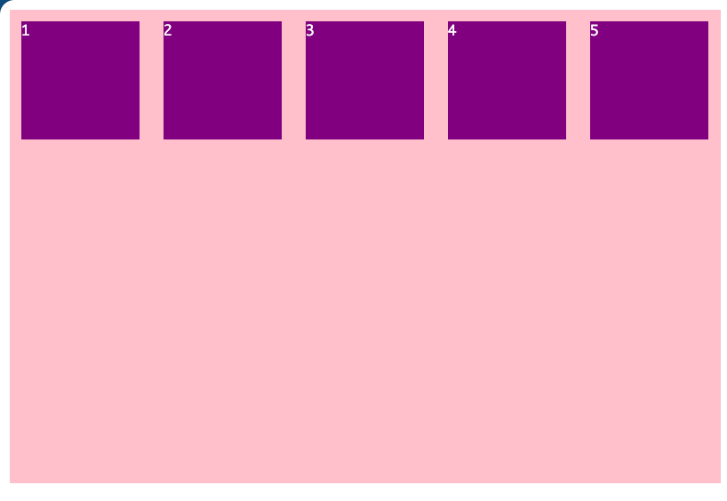
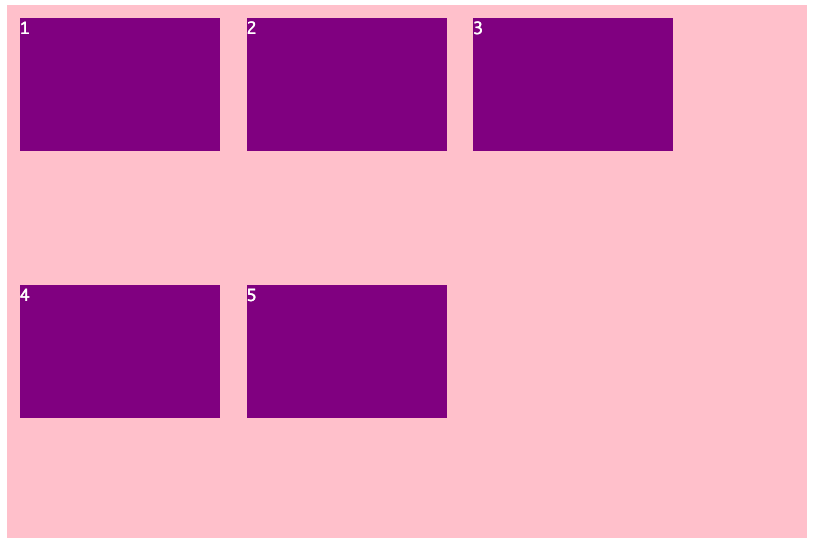
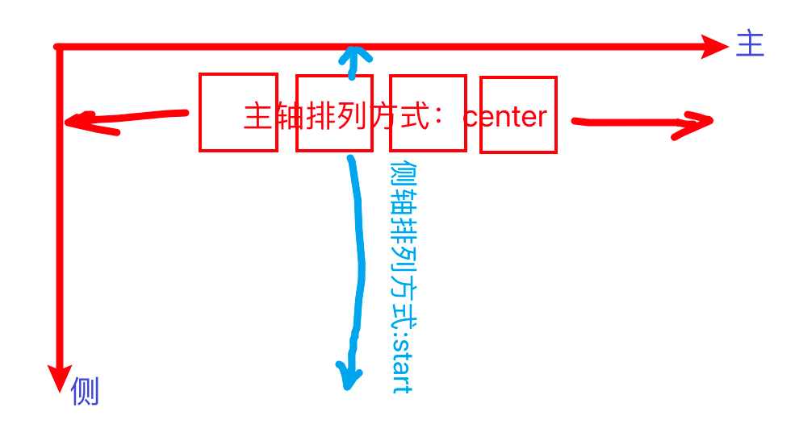
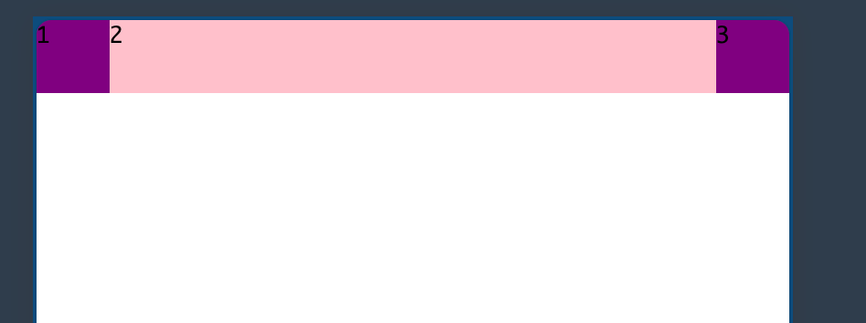
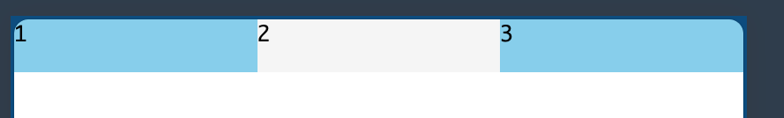
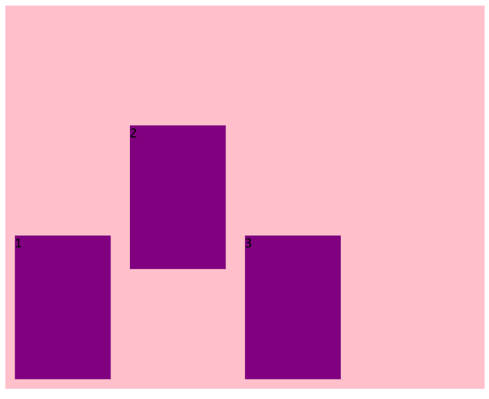
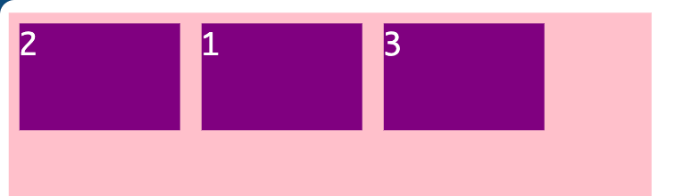

# 移动端

## 目录

- [1. CSS 基础](/langs/css-pink/)
- [2. CSS 进阶](/langs/css-pink/02_enhance/)
- [3. Html5 和 CSS3 了解](/langs/css-pink/03_h5c3_intro/)
- [4. CSS3 转换](/langs/css-pink/04_c3_transform/)
- [5. 移动端第一部分](/langs/css-pink/05_mobile_pt1/)
- [6. 移动端第二部分](/langs/css-pink/06_mobile_pt2/)

## 移动端开发选择

### 移动端主流方案

- 单独制作移动端页面（主流）。比如京东商城手机版、淘宝触屏版
- 响应式页面兼容移动端（其次）。比如三星手机官网

### CSS 初始化 nomalize.css

[Normalize.css: Make browsers render all elements more consistently. (necolas.github.io)](https://necolas.github.io/normalize.css/)

### CSS3 盒子模型

两种盒子模型（高度同理）

- 传统 CSS 盒子模型：`盒子的宽度 = CSS 中设置的 width + 左右border + 左右padding`

- CSS3 盒子模型：`盒子的宽度 = CSS 中设置的 width（width 中包含了 左右border 和 左右padding）`

也就是说，CSS3 中的盒子模型，padding 和 border 不会撑大盒子

```html
  <style>
    div {
      width: 200px;
      height: 200px;
      padding: 10px;
      border: 10px solid red;
    }
    div:nth-child(1) {
      /* 传统盒子模型 */
      box-sizing: content-box;
    }
    div:nth-child(2) {
      /* CSS3 盒子模型 */
      box-sizing: border-box;
    }
  </style>
  <body>
    <div></div>
    <div></div>
  </body>
```

### 几个特殊样式

```css
div {
  /* CSS3 盒子模型 */
  box-sizing: border-box;
}

a {
  /* 清除点击高亮 */
  -webkit-tap-highlight-color: transparent;
}

input {
  /* IOS 清除原有的样式（才可以自定义样式？） */
  -webkit-appearance: none;
}

img {
  /* 禁用长按页面弹出菜单 */
  -webkit-touch-callout: none;
}
```

### 移动端常见布局

技术选型：

1、**单独制作**移动端页面（主流）

- 流式布局（也叫百分比布局）
- flex 弹性布局（推荐）
- less + rem + 媒体查询布局
- 混合布局

2、**响应式页面**兼容移动端（其次）

- 原生媒体查询
- 使用框架，比如 bootstrap

## 流式布局

### 介绍

流式布局，也叫 百分比布局，说的是使用百分比进行宽度的控制，而非固定像素。将盒子的宽度设置成百分，盒子会自动根据屏幕的宽度进行伸缩。

流式布局方式是移动 Web 开发实用的比较常见的布局方式。

比如将屏幕左右平分

```html
  <style>
    * {
      margin: 0;
      padding: 0;
    }
    section {
      width: 100%;
      /* 控制父盒子最大宽度和最小宽度 */
      max-width: 980px;
      min-width: 320px;
      /* 居中 */
      margin: 0 auto;
    }
    section div {
      float: left;
      width: 50%;
      height: 400px;
    }
    section div:nth-child(1) {
      background-color: pink;
    }
    section div:nth-child(2) {
      background-color: purple;
    }
  </style>
  <body>
    <section>
      <div></div>
      <div></div>
    </section>
  </body>
```

注意：在为盒子设置百分比宽度时，往往还需要使用 `max-width` 和 `min-width` 两个属性控制盒子的最大宽度和最小宽度

### 案例

案例：京东商城移动端

技术选型：单独制作移动页面、采用流式布局

1、项目搭建

```text
.
├── css/
│   ├── index.css
│   └── normalize.css
├── images/
├── upload/
└── index.html
```

2、body设置

3、app布局（页面顶部盒子布局）

4、app内容填充（页面顶部盒子内容填充）

5、搜索模块布局

6、搜索模块内容制作 - 1

7、搜索模块内容制作 - 二倍精灵图 - 2

8、焦点图制作

9、品牌日模块制作

10、导航拦 nav  模块制作

11、新闻快报模块

12、补全特殊样式

## flex 布局

### 与传统布局比较

传统布局：

- 兼容性好
- 布局繁琐
- 有局限性：不能在移动端很好的布局

flex 弹性布局

- 操作方便，布局**极为简单**，移动端应用广泛
- PC 端浏览器兼容性差：在 IE 11 或更低版本中不支持或仅部分支持

建议

- 如果是 PC 端页面布局，建议使用传统布局
- 如果是移动端或者不考虑兼容性问题的 PC 端页面布局，建议使用 flex 弹性布局

### flex 布局原理

flex 是 `flexible box` 的缩写，意为“弹性布局”，用来为盒状模型提供最大的灵活性，**任何一个容器都可以指定为 flex 布局**，注意：

1. 当为父盒子设置 flex 布局以后，子元素的 float、clear 和 vertical-align 属性将失效
2. flex 布局其他名字有：伸缩布局、弹性布局、伸缩盒布局、弹性盒布局等
3. 采用 flex 布局的元素通常被称为 flex 容器（flex container），简称 “**容器**”；它的所有子元素自动成为容器成员，通常被称为 flex 项目（flex item），简称 “**项目**”
4. flex 项目无需做转换（设置 display 属性改变元素显示方式）

总结 flex 布局：通过给父盒子添加 `display: flex` 属性来控制子盒子的位置和排列方式

### flex 布局常见属性⭐

常见的**父元素**属性：

- `flex-direction`：设置主轴的方向
- `justify-content`：设置主轴上的子元素的排列方式
- `flex-wrap`：设置主轴上的子元素是否换行
- `align-items`：设置侧轴上的子元素的排列方式（单行，即 `flex-wrap: nowrap`）
- `align-content`：设置侧轴上的子元素的排列方式（多行，即 `flex-wrap: wrap`）
- `flex-flow`：复合属性，用来同时设置 `flex-direction` 和 `flex-wrap`

常见的子项属性：

- `flex`：设置子项占的份数
- `align-self`：控制子项自己在侧轴上的排列方式
- `order`：控制子项的前后顺序

### 设置主轴方向

使用 `flex-direction` 属性**设置主轴的方向**：

- 与主轴垂直的轴称为**侧轴**
- **默认的主轴方向是 x 轴方向，水平向右；默认侧轴方向是 y 轴方向，水平向下**
- 主轴的方向决定了**子元素的排列方向**，默认情况子元素沿水平方向排列
- 属性值有：`row`（默认值，x 轴从左到右）、`row-reverse`（x 轴从右到左）、`column`（从上到下）、`column-reverse`（从下到上）

示例

```html
  <head>
    <meta charset="UTF-8" />
    <meta name="viewport" content="width=device-width, initial-scale=1.0" />
    <title>flex-direction</title>
    <style>
      div {
        width: 80%;
        height: 500px;
        background-color: pink;
        /* flex 布局 */
        display: flex;
        /* 主轴方向 */
        /* flex-direction: row; */
        /* flex-direction: row-reverse; */
        flex-direction: column;
        /* flex-direction: column-reverse; */
      }
      div span {
        width: 150px;
        height: 100px;
        background-color: purple;
        margin-right: 5px;
        margin-bottom: 5px;
      }
    </style>
  </head>
  <body>
    <div><span>1</span><span>2</span><span>3</span></div>
  </body>
```

### 设置主轴子元素排列方式

使用 `justify-content` 属性设置项目在主轴上的排列方式

该属性的属性值有：

- `flex-start`：默认值，从头部开始排列
- `flex-end`：从尾部开始排列
- `center`：居中对齐（即如果主轴是 x 轴则水平居中、是 y 轴则垂直居中）
- `space-around`：**平分剩余空间**（每个子元素在主轴方向上的外边距相同）
- `space-between`：先将靠近头部和尾部的两个元素*贴边*，再平分剩余空间

注：在使用之前一定要先**确定主轴的方向**！

示例（使用默认主轴）

```html
  <head>
    <meta charset="UTF-8" />
    <meta name="viewport" content="width=device-width, initial-scale=1.0" />
    <title>flex-direction</title>
    <style>
      div {
        width: 800px;
        height: 200px;
        background-color: pink;
        /* flex 布局 */
        display: flex;
      }
      div:nth-child(1) {
        justify-content: flex-start;
      }
      div:nth-child(2) {
        justify-content: flex-end;
      }
      div:nth-child(3) {
        justify-content: center;
      }
      div:nth-child(4) {
        justify-content: space-around;
      }
      div:nth-child(5) {
        justify-content: space-between;
      }
      div span {
        width: 150px;
        height: 100px;
        background-color: purple;
        box-sizing: border-box;
        border: 1px solid #fff;
      }
    </style>
  </head>
  <body>
    <div>
      <span>1</span>
      <span>2</span>
      <span>3</span>
      <span>4</span>
    </div>
    <div>
      <span>1</span>
      <span>2</span>
      <span>3</span>
      <span>4</span>
    </div>
    <div>
      <span>1</span>
      <span>2</span>
      <span>3</span>
      <span>4</span>
    </div>
    <div>
      <span>1</span>
      <span>2</span>
      <span>3</span>
      <span>4</span>
    </div>
    <div>
      <span>1</span>
      <span>2</span>
      <span>3</span>
      <span>4</span>
    </div>
  </body>
```



### 设置主轴子元素是否换行

flex 布局中，**默认情况下所有项目都排在一条线上**（即一条 “主轴” 线上）**，不会换行**。

如果项目占用的宽度超过了父元素宽度，则会自动减小项目的宽度。

示例

```html
  <head>
    <meta charset="UTF-8" />
    <meta name="viewport" content="width=device-width, initial-scale=1.0" />
    <title>Document</title>
    <style>
      div {
        display: flex;
        width: 600px;
        height: 400px;
        background-color: pink;
      }
      div span {
        /* 5 * 150 > 600 */
        width: 150px;
        height: 100px;
        background-color: purple;
        color: #fff;
        margin: 10px;
      }
    </style>
  </head>
  <body>
    <div>
      <span>1</span>
      <span>2</span>
      <span>3</span>
      <span>4</span>
      <span>5</span>
    </div>
  </body>
```



可以使用 `flex-wrap` 属性控制子元素是否换行，其属性有两个：

- `nowrap`：默认值，表示不换行，所有项目排在一行上
- `wrap`：当项目占用长度超过父容器长度时会将超出长度的项目换行排列

示例：指定 `flex-wrap: wrap`，将超出长度的项目换行排列

```html
    <style>
      div {
        display: flex;
        width: 600px;
        height: 400px;
        background-color: pink;
        /* 项目是否换行 */
        flex-wrap: wrap;
      }
    </style>
```



### 设置侧轴子元素排列方式(单行)

使用 `align-items` 属性控制子项在**侧轴上**的排列方式，其可使用的属性值有：

- `stretch`：拉伸，默认值
- `flex-start`：从上到下
- `flex-end`：从下到上
- `center`：挤在一起居中

示意图



示例：子元素居中对齐

```html
  <head>
    <meta charset="UTF-8" />
    <meta name="viewport" content="width=device-width, initial-scale=1.0" />
    <title>Document</title>
    <style>
      div {
        width: 800px;
        height: 500px;
        background-color: pink;
        /* flex 布局 */
        display: flex;
        /* 设置主轴上子元素的排列方式 */
        justify-content: center;
        /* 设置侧轴上子元素的排列方式 */
        align-items: center;
      }
      div span {
        width: 200px;
        height: 100px;
        background-color: purple;
        margin: 10px;
      }
    </style>
  </head>
  <body>
    <div>
      <span>1</span>
      <span>2</span>
      <span>3</span>
    </div>
  </body>
```

### 设置侧轴子元素排列方式(多行)

上一小节：使用 `align-items` 属性设置（单行）子项在侧轴上的排列方式。（啥是单行子项？就是 `flex-wrap:nowrap`！）

本节：使用 `align-content` 属性设置（多行）子项在侧轴上的排列方式（子项在主轴上出现换行的情况），属性值有：

- `flex-start`：在侧轴头部排列
- `flex-end`：在侧轴尾部排列
- `center`：在侧轴中间显示
- `space-around`：子项在侧轴平分剩余空间
- `space-between`：子项在侧轴先分布在两头，在平分剩余空间
- `stretch`：默认值，子项高度平分父元素高度

**注意**：当 `flex-wrap: nowrap` 时，`align-content` 属性不起作用；而在 `flex-wrap: wrap` 时起作用

示例

```html
    <style>
      div {
        width: 600px;
        height: 400px;
        background-color: pink;
        /* flex 布局 */
        display: flex;
        justify-content: center;
        /* 项目是否换行 */
        flex-wrap: wrap;
        /* 设置侧轴上子项排列方式 */
        /* align-content: stretch; */
        /* align-content: flex-start; */
        /* align-content: flex-end; */
        /* align-content: center; */
        /* align-content: space-around; */
        align-content: space-between;
      }
      div span {
        width: 150px;
        height: 100px;
        background-color: purple;
        color: #fff;
        margin: 10px;
      }
    </style>
  </head>
  <body>
    <div>
      <span>1</span>
      <span>2</span>
      <span>3</span>
      <span>4</span>
      <span>5</span>
      <span>6</span>
    </div>
  </body>
```

### flex-flow 复合属性

`flex-flow` 属性是 `flex-direction` 和 `flex-wrap` 属性的复合属性，用来简写

示例

```css
    <style>
      div {
        width: 600px;
        height: 600px;
        background-color: pink;
        display: flex;
        /* flex-direction: row;
        flex-wrap: wrap; */
        /* 简写 */
        flex-flow: row wrap;
      }
      div span {
        width: 180px;
        height: 150px;
        background-color: purple;
        color: #fff;
        margin: 10px;
      }
    </style>
  </head>
  <body>
    <div>
      <span>1</span><span>2</span><span>3</span><span>4</span><span>5</span>
    </div>
  </body>
```

### 子项的 flex 属性

子项的 `flex` 属性用来定义子项**分配剩余空间的份数**，默认为 0 表示不占用剩余空间

示例：[圣杯布局](https://en.wikipedia.org/wiki/Holy_grail_(web_design))（两边元素长度固定、中间元素长度随屏幕宽度变化）

```html
    <style>
      * {
        padding: 0;
        margin: 0;
      }
      section {
        height: 40px;
        background-color: pink;
        margin: 0 auto;
        width: 100%;
        display: flex;
      }
      section div:nth-child(1) {
        width: 40px;
        height: 40px;
        background-color: purple;
      }
      section div:nth-child(2) {
        /* 左右两个 div 长度已经确定，只有第二个 div 占 1 份，即占剩下的总长度 */
        flex: 1;
      }
      section div:nth-child(3) {
        width: 40px;
        height: 40px;
        background-color: purple;
      }
    </style>
  </head>
  <body>
    <section>
      <div>1</div>
      <div>2</div>
      <div>3</div>
    </section>
  </body>
```



示例：均分

```html
    <style>
      * {
        padding: 0;
        margin: 0;
      }
      p {
        height: 30px;
        background-color: skyblue;
        display: flex;
      }
      p span {
        /* 三个 span 各占 1 份，所以均分 */
        flex: 1;
      }
      p span:nth-child(2) {
        background-color: whitesmoke;
      }
    </style>
  </head>
  <body>
    <p><span>1</span><span>2</span><span>3</span></p>
  </body>
```



### 子项的 align-center 和 order 属性

`align-center`属性：控制**单个项目**与其他项目不一样的对齐方式，该属性可以覆盖 `align-items` 属性。该属性的默认值为 auto，表示继承父元素的 `align-items` 属性，如果没有父元素，则等同于 `stretch`

示例

```html
    <style>
      p {
        width: 500px;
        height: 400px;
        background-color: pink;
        display: flex;
        align-items: flex-end;
      }
      p span {
        width: 100px;
        height: 150px;
        background-color: purple;
        margin: 10px;
      }
      p span:nth-child(2) {
        align-self: center;
      }
    </style>
  </head>
  <body>
    <p><span>1</span><span>2</span><span>3</span></p>
  </body>
```



`order` 属性：用来控制项目的排列顺序，默认为 0，可为负数，数值越小排列越靠前

示例

```html
    <style>
      p {
        width: 600px;
        height: 400px;
        background-color: pink;
        display: flex;
      }
      p span {
        width: 150px;
        height: 100px;
        background-color: purple;
        color: #fff;
        font-size: 28px;
        margin: 10px;
      }
      p span:nth-child(2) {
        order: -1;
      }
    </style>
  </head>
  <body>
    <p><span>1</span><span>2</span><span>3</span></p>
  </body>
```



### 补充：背景渐变

背景渐变是 CSS3 新特性。这里只介绍**线形渐变**，用法

```css
background: linear-gradient(起始方向, 颜色1, 颜色2)
```

注：起始方向默认是 `top` 表示从上到下，可选值还可以为 `left / right / bottom` 或复合写法比如 `left top`

示例

```html
    <style>
      div {
        width: 400px;
        height: 400px;
        /* 目前使用需要添加浏览器私有前缀 -webkit- */
        background: -webkit-linear-gradient(left bottom, pink, deeppink);
      }
    </style>
  </head>
  <body>
    <div></div>
  </body>
```

### 综合案例

案例：[携程网移动端页面](https://m.ctrip.com/html5/)

技术选型：单独制作移动页面、采用以 flex 布局为主其他布局技术为辅的混合布局

1、项目搭建

```text
.
├── css/
│   ├── index.css
│   └── normalize.css
├── images/
├── upload/
└── index.html
```

2、搜索模块布局

3、搜索模块 user 区域制作

4、搜索模块 search 区域制作

5、焦点图 focus 模块制作

6、局部导航栏 local-nav 布局

7、局部导航栏 local-nav 内容制作

8、主导航区 nav 布局

9、主导航区 nav 内容制作

10、侧导航栏入口 subnav-entry 模块制作

11、热门活动模块制作

12、更多福利模块制作

13、销售模块 sales-bd 区域制作

## rem 适配布局

1. 能够使用 rem 单位
2. 能够使用媒体查询的基本语法
3. 能够使用 less 的基本语法
4. 能够使用 less 中的嵌套
5. 能够使用 less 中的运算
6. 能够使用 2 种 rem 适配方案
7. 能够独立完成苏宁移动端首页的制作

### rem 基础

`rem` 是一个相对单位，类似于 `em`，`em` 表示父元素字体大小（比如 `1em` 表示和父元素字体大小一样大小）。而 `rem` 的基准是相对于 html 元素的字体大小，比如，假设根元素 html 的 font-size 是 12px，它的一个子元素的 width 为 2rem，那么换算成 px 就是 24px。

示例

```html
    <style>
      div {
        font-size: 12px;
      }
      p {
        /* em 单位是相对于父元素的「字体大小」来说的 */
        /* 10 * 12 = 120px */
        width: 10em;
        height: 10em;
        background-color: pink;
      }
      /* -------------- */
      html {
        font-size: 14px;
      }
      ul {
        margin: 0;
        padding: 0;
        /* rem 单位是相对于 html 元素的「字体大小」来说的 */
        /* 10 * 14 = 140px */
        width: 10rem;
        height: 10rem;
        background-color: purple;
      }
    </style>
  </head>
  <body>
    <div>
      <p></p>
    </div>
    <ul></ul>
  </body>
```

rem 优点：可以通过修改 html 元素的文字大小来改变页面中元素的大小来做**整体控制**

### 媒体查询

媒体查询（media query）是 CSS3 新语法。它可以：

- 针对不同的屏幕尺寸设置不同的样式
- 重置浏览器大小时，页面也会根据浏览器的宽度和高度重新渲染页面

语法（和动画声明类似）

```text
@media 媒体类型 关键字 (媒体属性) {
  ...CSS代码...
}
```

其中：

- 媒体类型：可选值有 `screen`（用于电脑、手机和平板等）、`print`（用于打印机和打印预览） 和 `all`（用于所有设备）
- 关键字：可选值有 `and`、 `not` 和 `only`。后两种用的少
- 媒体属性：被包括在 `()` 中，可用的属性有 `width / min-width / max-width`，比如 `(max-width: 800px)` 表示宽度小于等于 800px 时。注意 `min-width` 和 `max-width` 都包含等于的情况

示例

```html
    <style>
      @media screen and (max-width: 640px) {
        body {
          background-color: pink;
        }
      }
      @media screen and (max-width: 320px) {
        body {
          background-color: #ccc;
        }
      }
    </style>
  </head>
  <body></body>
```

小案例：根据页面宽度改变背景色

- 当宽度小于 540px 时背景为蓝色
- 当宽度大于等于 540px 且小于等于 969px 时背景为绿色
- 当宽度大于等于 970px 时背景为红色

```html
  <head>
    <meta charset="UTF-8" />
    <meta name="viewport" content="width=device-width, initial-scale=1.0" />
    <title>Document</title>
    <style>
      @media screen and (max-width: 539px) {
        /* w <= 539 */
        body {
          background-color: blue;
        }
      }
      @media screen and (min-width: 540px) and (max-width: 969px) {
       /* 根据 CSS 的层叠性，可以将「 and (max-width: 969px) 」去掉 */
        /* 540px <= w <= 969 */
        body {
          background-color: green;
        }
      }
      @media screen and (min-width: 970px) {
        /* w >= 970 */
        body {
          background-color: red;
        }
      }
    </style>
  </head>
  <body></body>
```

小案例：媒体查询 + rem 实现标题大小自动变化

```html
<html lang="en">
  <head>
    <meta charset="UTF-8" />
    <meta name="viewport" content="width=device-width, initial-scale=1.0" />
    <title>Document</title>
    <style>
      * {
        margin: 0;
        padding: 0;
      }
      @media screen and (max-width: 640px) {
        html {
          font-size: 100px;
        }
      }
      @media screen and (max-width: 320px) {
        /* 问题：注意层叠性！不能将 max-width:640px 的一项放在 max-width:320px 后 */
        html {
          font-size: 50px;
        }
      }
      h2 {
        height: 1rem;
        line-height: 1rem;
        font-size: 0.5rem;
        text-align: center;
        background-color: pink;
      }
    </style>
  </head>
  <body>
    <h2>花样年华</h2>
  </body>
</html>
```

补充：**媒体查询引入资源**

在编写页面时，当样式比较多时，我们可以为不同的媒体创建对应的 css 文件。在 link 中判断设备的尺寸然后引入不同的 css 文件。

案例：当屏幕宽度大于等于 640px 时一行显示 2 个 div 元素；当屏幕宽度小于 640px 时一行显示 1 个 div 元素。

```html
<html lang="en">
  <head>
    <meta charset="UTF-8" />
    <meta name="viewport" content="width=device-width, initial-scale=1.0" />
    <title>Document</title>
    <!-- 引入资源：针对不同的屏幕尺寸使用不同的 css 文件 -->
    <!-- 不是动态加载（开始时会加载两个样式文件），而是动态使用 -->
    <link
      rel="stylesheet"
      href="style-320px.css"
      media="screen and (min-width: 320px)"
    />
    <link
      rel="stylesheet"
      href="style-640px.css"
      media="screen and (min-width: 640px)"
    />
  </head>
  <body>
    <div>1</div>
    <div>2</div>
  </body>
</html>
```

### less 介绍

批判一下 CSS 的弊端：

- 需要书写大量看似没有逻辑的代码，冗余度比较高
- 不方便维护、拓展和复用
- 不支持计算
- 对于非前端开发师来讲往往回音为缺少 CSS 编写惊艳而很难写出组织良好、易于维护的代码

[Less](https://lesscss.org/)（leaner style sheets）是 CSS 的扩展语言，也可理解为 CSS 预处理器。

Less 是 CSS 的一种形式的拓展，它并没有减少 CSS 的功能，而是在现有的 CSS 语法的基础上又为 CSS 加入了程序式语言的特性，比如变量、Mixin 混入、运算以及函数等功能，大大简化了 CSS 的编写，并且将低了 CSS 的维护成本。顾名思义，Less 可以让开发者用更少的代码做更多的事。

其他常见的 CSS 预处理器还有：Sass、Stylus

总结：**Less 是 CSS 预处理语言，它扩展了 CSS 的动态特性**。

### less 使用

less 代码通常保存在 `.less` 为后缀的文件中。

1、**less 变量**

语法

```less
@变量名: 值;
```

其中，变量名命名规范有：

- 必须有 `@` 作为前缀
- 不能以数字开头
- 不能包含特殊字符
- 大小写敏感

示例

```less
@color: pink;
@p-font-size: 12px;
@base: 5%;

body {
  background-color: @color;
}

p {
  width: @p-font-size;
  background-color: @color;
}
```

2、**less 的编译**

使用 VSCode 的插件：**easy less**。安装完后，该插件会自动把 less 编译为同名 css 文件放到同级别目录。

3、**less 嵌套**

示例代码

```less
.header {
  width: 200px;
  height: 200px;
  background-color: pink;

  // .header span {...}
  span {
    font-size: 30px;
  }

  // .header > a {...}
  > a {
    color: red;
  }

  // & 表示当前元素本身（遇到伪类、伪类选择器或交集选择器时用）
  // .header::after {...}
  &::after {
    content: 'a';
  }
}
```

编译为 css 的结果

```css
.header {
  width: 200px;
  height: 200px;
  background-color: pink;
}
.header span {
  font-size: 30px;
}
.header > a {
  color: red;
}
.header::after {
  content: 'a';
}
```

4、**less 运算**

less 提供了数字、颜色和变量的运算支持

示例

```less
@border: 5px + 5;

div {
  width: 125px * 2 - 50;
  height: 100px * 2;
  border: @border solid red;
}

html {
  font-size: 50px;
}

p {
  width: (82rem / 50);
  height: (82 / 50rem); // 除法要放到小括号中
  background-color: (#ffffff / 2);
  border: 5px solid blue;
}
```

编译后的 css 为

```css
div {
  width: 200px;
  height: 200px;
  border: 10px solid red;
}
html {
  font-size: 50px;
}
p {
  width: 1.64rem;
  height: 1.64rem;
  background-color: #808080;
  border: 5px solid blue;
}
```

### rem 适配方案

rem 适配方案

- 目的：让一些不能等比自适应的元素在设备尺寸变化时能够**等比例适配**当前设备

- 原理：使用媒体查询设置不同设备对应的 html 元素的字体大小，然后页面元素使用 rem 做尺寸单位。当设备尺寸发生变化时，html 元素字体大小、元素大小都会跟着变化，从而达到等比缩放的效果。

rem 实际开发适配方案

- 按照设极稿和设备宽度的比例，利用媒体查询动态计算并设置 html 标签的字体大小
- 在 CSS 中，设计稿的宽、高和相对位置等取值，按照同等比例换算为 rem 为单位的值

⭐⭐ rem 适配方案**技术**使用 ⭐⭐

- 方案一：**less + 媒体查询 + rem**
- 方案二：**flexible.js + rem**，**主流选择，更简单**

### rem 最终适配方案

1、**了解设计稿常见尺寸宽度**

| 设备          | 常见宽度                                                     |
| ------------- | ------------------------------------------------------------ |
| iphone 4/5    | 640px                                                        |
| iphone 6/7/8  | 750px                                                        |
| android phone | 常见的有：320px/360px/375px/384px/400px/414px/500px/720px，大部分 4.7~5 寸的安卓设备为 720px |

一般情况下，我们会选择**一套或两套**效果图**适应大部分屏幕**，放弃极端屏幕或对其优雅降级，牺牲一些效果。

当前教程以 750px 为主（iPhone 6/7/8）

2、**动态设置 html 标签的 font-size 属性**

- 假设稿件宽度是 750px
- 把屏幕划分成 15 份（也可能是 20 或 10 份），每一份的长度作为 html 元素 font-size 属性的值（也就是一行可以放 15 个字）
- html 标签 font-size 属性值计算：`320px / 15 = 21.33     750px / 15 = 50`
- 由稿件中元素的长度（假设为 `x`，单位为 px）计算它的 rem 长度（假设为 `lrem`）的**换算公式**：`lrem = x / font-size`

示例

```html
<!DOCTYPE html>
<html lang="en">
  <head>
    <meta charset="UTF-8" />
    <meta name="viewport" content="width=device-width, initial-scale=1.0" />
    <title>Document</title>
    <style>
      @media screen and (min-width: 320px) {
        html {
          font-size: 21.33px;
        }
      }
      @media screen and (min-width: 750px) {
        html {
          font-size: 50px;
        }
      }
      div {
        width: 2rem;
        height: 2rem;
        background-color: pink;
      }
    </style>
  </head>
  <body>
    <!-- 在 >=320px 时 div 宽度为 42.66px  -->
    <!-- 在 >=750px 时 div 宽度为 50px  -->
    <div></div>
  </body>
</html>
```

### 综合案例—苏宁移动端

案例：苏宁移动端首页  m.suning.com

方案：单独制作移动页面

技术：rem 适配布局（less + rem + 媒体查询）

设计图：以 750px 设计尺寸

步骤：

1. 搭建目录；创建功能样式文件 `common.less`，在其中放置所有页面都要使用的「媒体查询适配 font-size」代码
2. 使用 @import 将共用样式引入 `index.less`
3. body 样式设置
4. 顶部搜索框 search-content 模块布局
5. 顶部搜索框 search-content 内容布局
6. 顶部搜索框 search-content 中的搜索模块制作
7. banner 和广告模块制作
8. 导航区域 nav 部分制作
9. 其他自己补充

总结：使用 rem 适配布局制作页面比较麻烦，但是做出来的页面相较别的方案更漂亮

### 综合案例—flexible.js + rem 适配

案例：苏宁移动端首页  m.suning.com

方案：单独制作移动页面

技术：[flexible.js](https://github.com/amfe/lib-flexible) + rem 适配布局

步骤：

1. 搭建项目
2. 安装 VSCode 插件 `cssrem`，修改其配置项「Root Font Size」为 75，熟悉使用
3. 改动：强制限制 html.font-size 的最大值为 75px
4. 顶部搜索框制作，其他自己补充

### swiper 轮播图框架介绍

[Swiper - The Most Modern Mobile Touch Slider (swiperjs.com)](https://swiperjs.com/)

使用 swiper：

1. 先下载所需的 js 和 css 文件
2. 在官网上复制样例代码
3. 根据需求做修改

### 综合案例—黑马面面

此案例来自 pink 老师的一个录播课。主要内容是了解移动端页面开发流程和掌握移动端常见布局思路。

技术方案：**flex + CSS3 弹性盒子 + rem + less + flexible.js**

本案例的**设备适配方案**：最小适配 320px、最大适配 750px

⭐ CSS 代码**规范**：

1. 类名语义化，尽量精短、明确，必须以字母开头命名并且全部字母为小写，单词之间统一使用下划线 `_` 连接
2. 类名嵌套层次尽量不超过三层
3. 尽量避免直接使用元素选择器
4. 尽量避免使用 id 选择器
5. 尽量避免使用通配符 `*` 和 `!important`
6. 属性书写顺序
   1. 布局定位属性：`display / position / float / clear / visibility / overflow`
   2. 尺寸属性：`width / height / margin / padding / border / background`
   3. 文本属性：`color / font / text-decoration / text-align / vertical-align`
   4. 其他属性：`content / cursor / border-radius / box-shadow / text-shadown`

⭐ 常用的几款 **UI 设计软件**：[蓝湖](https://lanhuapp.com/)、[幕客](https://www.mockplus.cn/)、[figma](https://www.figma.com/)等

步骤：

1. 项目框架搭建，初始文件准备
2. 头部 header 制作
3. 导航区 nav 布局
4. 导航区 nav 制作（发现 pink 老师给的 flexible.js 和我从 github 下载的来的不同，改过来后一切都好了）
5. go 模块制作
6. 就业指导头部 content-hd 区域制作
7. 引入`swiper` 及[样例代码](https://swiperjs.net/demo/slides-scale.html)（另一个网站：[swiper.com.cn](https://swiper.com.cn/demo/index.html)）
8. 为轮播图添加左右箭头。方法：参考带箭头样例进行 CV 代码
9. 为轮播图添加 slide 页
10. 调整轮播图：边距、透明度、轮播图尺寸调整、箭头位置大小颜色调整等（7-10 步：就业指导模块）
11. 充电学习模块轮播图模板准备
12. 充电学习模块轮播图制作：修改属性和样式、填充 slide
13. footer 区域布局
14. footer 区域制作
