# CSS 基础


## 目录

- [1. CSS 基础](/langs/css-pink/)
- [2. CSS 进阶](/langs/css-pink/02_enhance/)
- [3. Html5 和 CSS3 了解](/langs/css-pink/03_h5c3_intro/)
- [4. CSS3 转换](/langs/css-pink/04_c3_transform/)
- [n. CSS 重点总结](/langs/css-pink/points/)

[课程](https://www.bilibili.com/video/BV14J4114768/)

## 选择器

- 标签选择器
- 类选择器。使用最多
  - 多类名 `class=“red font35”` 样式归类，节省CSS代码，统一修改非常方便
- id 选择器。一般和 JS 搭配
- 通配符选择器
  - `*` 选择所有标签。 `* { color: red; }`

## 字体属性

- `font-family` 可指定多个字体，需要用 `,` 分割
- `font-size` 。谷歌浏览器默认 `16px`
  - 标题标签比较特殊，需要单独指定文字大小
- `font-weight` 没有单位，默认 400，加粗 700
- `font-style` 文字风格，`normal/italic`
- 复合属性：书写顺序 为 `font-size -> font-weight -> font-size/line-height font-family`  不需要的属性可以省略，但必须保留 `font-size` 和 `font-family`，否则 `font` 属性不起作用

```css
div {
  /* 不可颠倒顺序 */
  font: italic 700 16px 'Microsoft yahei'
}
```

## 文本属性

- `color` 文本颜色

```css
div {
  color: deeppink;    // 预定义的颜色值
  color: #ff0000;     // 十六进制
  color: rgb(255, 0, 0) // RGB形式
}
```

- `text-align` 文本水平对齐 `left / right / center`

- `text-decoration` 属性：  `none / underline / line-through / overline`

```css
a {
  text-decoration: none;
}
```

- `text-indent` 首行锁进

```css
p {
  text-indent: 2em;
}
```

> em 是一个相对单位，当前元素 1 个文字的大小，如果当前元素没有设置大小，则会按照元素的 1 个文字大小

- `line-height`

```css
p {
  line-height: 25px;
}
```

 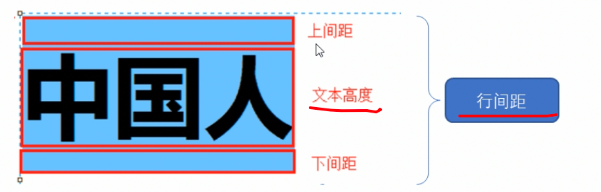

## CSS 引入(3)

- 内部样式表，将样式放在 `style` 标签，理论上可以放在 HTML 文档任何地方，但一般会放在文档的 `head` 标签中
- 行内样式表，在元素标签的 `style` 属性中设定样式，只能控制当前标签。没有体现出样式与结构相分离的思想，不推荐使用
- 外部样式表，适合样式比较多的情况

```html
<link rel="stylesheet" href="css文件路径" />
```

## Emmet 语法

快速生成 HTML 结构语法

- `*` 生成多个相同元素，比如  `div*3`
- 父子级关系 `ul>li`
- 兄弟关系 `div+p`
- 类名 `.nav`  `p.one`
- id 名 `#banner`
- 生成有顺序的 `.demo$*5`
- 标签内带文字 `div{$,pink老师不是gay}*3`

快速生成 CSS 样式

- `tac` ==> `text-align: center`
- `w100` ==> `width: 100px;`
- `h200` ==> `height: 200px`

快速格式化代码

- 配置 `setting.json`

```json
{
 "editor.formatOnType": true,
  "editor.formatOnSave": true
}
```

## 复合选择器(5)

- 后代( 儿子+各代子孙 )选择器，选择器以空格隔开，比如选择 ol 下的所有 li 后代： `ol li { x:y }`

- 子选择器（必须选择亲儿子元素），选择器以 `>` 隔开，比如 `ol > li { x: y}`
- 并集选择器，选择多组标签，同时为他们定义相同的样式，常用于集体声明，比如 `div, p { x:y }`

```css
div,
p,
.pig li {
 color: red
}
```

- 伪类选择器
  - 链接伪类选择器
    - `a:link` 未被访问
    - `a:visited` 已被访问
    - `a:hover` 鼠标指针位于其上
    - `a:active` 活动状态（鼠标按下未弹起）
    - 注：为了确保生效，最好按照 `LVHA` 的顺序声明
    - a 链接在浏览器中具有默认样式，需要给链接单独指定样式
  - focus 伪类选择器，用于选择获取焦点的表单元素，比如 `input:focus { x:y }`

## 元素显示模式(3)

**元素以什么方式进行显示**，比如 div 自己占一行，一行可放多个 span

HTML 元素一般分为块元素和行内元素。

- **块元素**

常见块元素：h1….h6、p、div、ul、ol、li 等

特点：

1. 独占一行
2. 高度、宽度、外边距和内边距都可以控制
3. 宽度默认是容器（父级宽度）的 100%
4. 是一个容器级盒子，里面可以放行内或块级元素

注意 :warning:：文字类元素（p、h1….h6等）不能使用块级元素

- **行内元素**

常见行内元素(也叫内联元素)：a、strong、b、em、i、del、s、ins、u、span 等

特点：

1. 相邻行内元素在一行上，一行可以显示多个
2. 高、宽直接设置是无效的
3. 默认宽度是他本身内容的宽度
4. 行内元素只能容纳文本或其他行内元素

注意:warning:

1. 链接里面不能再放链接

2. 链接里面可以放块级元素，但是给 a 转换成块级模式最安全

- **行内块元素**

几个特殊的标签：img、input、td 等

特征：同时具有块元素和行内元素的特点

特点：

1. 和相邻行内元素（或行内块）在一行上，但是他们之间有空白缝隙，一行可以显示多个（行内元素特点）
2. 默认宽度就是他本身内容的宽度（行内元素特点）
3. 高度、行高、外边距和内边距可以控制（块级元素特点）

- 总结

| 显示模式 | 排列方式               | 设置样式         | 默认宽度         | 包含                   |
| -------- | ---------------------- | ---------------- | ---------------- | ---------------------- |
| 块级     | 一行只能放一个块级元素 | 可设置宽高       | 容器的100%       | 可以包含任何标签       |
| 行内     | 一行放多个行内元素     | 不可直接设置宽高 | 它本身内容的宽度 | 容纳文本或其他行内元素 |
| 行内块   | 一行放多个行内块元素   | 可设置宽高       | 它本身内容的宽度 |                        |

注：行内元素 a 标签可以包含块级元素

- 元素显示模式转换

```css
/* 转换成块元素 */
span {
  display: block;
}

/* 转换成行内元素 */
div {
  display: inline;
}

/* 转换成行内块元素 */
a {
  display: inline-block;
}
```

## 小案例：小米侧边栏

<https://www.mi.com/index.html>

 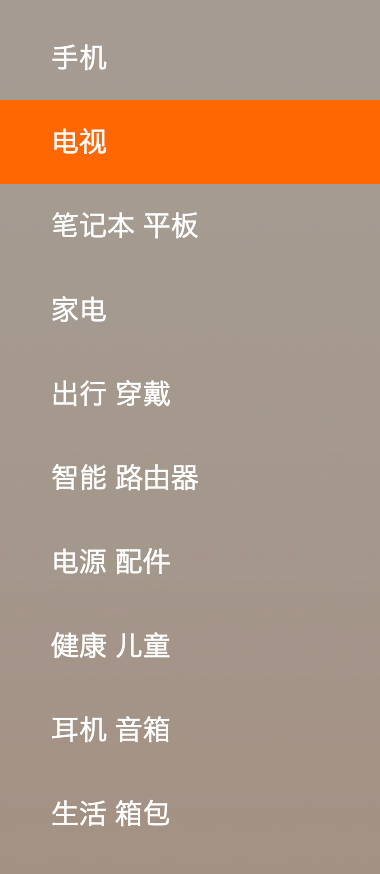

文字垂直居中：设置行高（`line-height`）和盒子高度相同

```html
<style type="text/css">
  a {
    display: block;
    height: 40px;
    width: 200px;
    text-indent: 2em;
    line-height: 40px;
    background-color: #a5a3a3;
    color: white;
    font-size: 14px;
    /* 去掉下划线 */
    text-decoration: none;
  }
  a:hover {
    background-color: rgb(237, 113, 46);
  }
</style>
<body>
  <a href="#">冰箱 空调</a>
  <a href="#">电视 家电</a>
  <a href="#">电脑 平板</a>
  <a href="#">手机 智能设备</a>
</body>
```

## 背景样式

- `background-color` ：**transparent**(默认) 或 color
- `background-image`：**none** 或 url(图片地址)。常用于控制 logo、一些装饰性图片或者是超大图片的位置

- `background-repeat`：图片平铺，（no-repeat|**repeat**|repeat-x|repeat-y）
- 背景图片和背景颜色可同时设置，但背景图片会压住背景颜色
- `background-position: x y;`
  - x/y 可以是**方位名词** `left|right|top|bottom|center`，顺序没关系
    - 如果只指定一个方位名词，另一个默认是垂直居中显示
  - x/y 可以是精确单位，此时第一个肯定是 x 坐标，第二个肯定是 y 坐标
    - 如果只指定一个值，那么一定是 x，另一个默认为垂直居中
  - x/y 可以是混合单位：精确单位和方位名词混合使用，第一个一定是 x，第二个一定是 y

- `background-attachment` fixed|**scroll**，默认 scroll 表示背景图片随和内容滚动

- 背景复合写法。没有特定顺序，一般的约定顺序为：
  - `background: 背景颜色 背景图片 北京平铺 背景图像滚动 背景图片位置`

- 背景色半透明 `background: rgba(0,0,0,0.3)` 最后一个参数是 alpha 透明度，取值范围在 0～1 之间
  - 注：背景半透明是指盒子背景半透明，盒子里面的内容不受影响
  - CSS3 新增属性，IE9+ 版本浏览器才支持的

小案例：装饰性图片

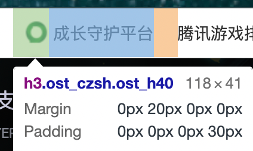

```html
<style>
  h3 {
    width: 118px;
    height: 41px;
    background-color: pink;
    font-weight: 400;
    font-size: 14px;
    line-height: 41px;
    background-image: url(images/favicon.ico);
    background-repeat: no-repeat;
    background-position: left;
    text-indent: 2.3em;
  }
</style>
<body>
  <h3>成长守护平台</h3>
</body>
```

小案例：做背景图片

```html
<style>
  body {
    background-image: url(images/b2.jpeg);
    background-repeat: no-repeat;
    background-position: top center;
  }
</style>
<body></body>
```

小案例：五彩导航

## 三大特性

- 层叠性：**相同选择器设置相同的样式**，此时产生样式冲突
  - 样式冲突，遵循**就近原则**，那个样式离结构近就执行哪个样式
  - 样式冲突，不会层叠
- 继承性：子标签会继承父标签的**某些样式**（主要是文字相关的样式，以 `text-`、`font-` 和 `line-`开头的属性），恰当使用可以简化代码、降低 CSS 样式的复杂性
  - 行高的继承：父元素的行高会继承给自元素
    - `font: 14px/24px 'Microsoft Yahei'` 14px 为文字大小，24px 为行高
    - `font: 14px/1.5` 1.5 表示行高为文字大小的 1.5 倍，即 14*1.5 = 21px

- :star:优先级：多个选择器之间的优先级顺序

  - 选择器相同，则执行层叠性

  - 选择器权重：`!important` > `行内样式 style =''` > `ID选择器` > `(伪)类选择器` > `元素选择器` > `继承或 *`

    | 选择器               | 权重|
    | -------------------- | -------------------------- |
    | `继承 或 *`          | 0                    |
    | `元素选择器`         | 1                    |
    | `(伪)类选择器`       | 10                    |
    | `ID选择器`           | 100                    |
    | `行内样式 style =''` | 1000                    |
    | `!important`         | 无穷大                     |

  - 最高优先级： `color: skyblue!important;`

  - **继承的权重为 0**，如果该元素没有直接选中，无论父元素权重多高，子元素得到的权重都是 0。比如 a 元素的样式不会继承自 父亲，说明浏览器内核中声明了 `a { color: blue; text-decoration: underline; }`。[:star:](https://www.bilibili.com/video/BV14J4114768?p=133)

  - **权重叠加**：使用复合选择器，会有权重叠加，需要计算权重。注意：不会进位

     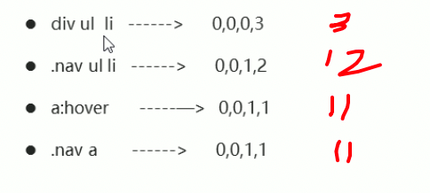

## 盒子模型

页面布局三大核心：盒子模型、浮动和定位

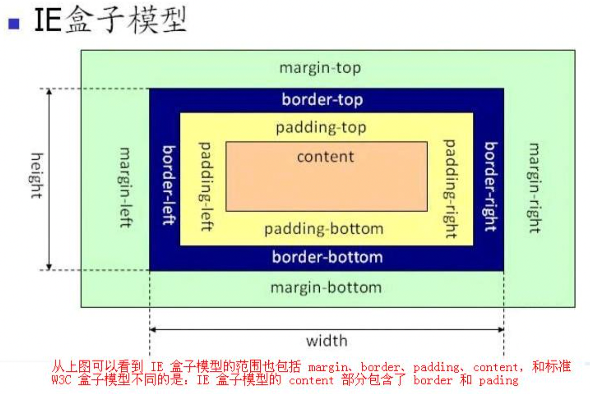

### 边框

- `boder: border-width || border-style || border-color`

- `border-width` 边框粗细
- `border-style` 边框样式，none/hidden/dashed/solid/double/groove/ridge/inset/outset
- `border-color` 边框颜色

- 复合写法：`border: 1px solid red;` 没有顺序要求

- 边框分开写：`border-top: 1px solid blue;`，同理可设置 border-bottom/border-left/border-right

- 表格边框

```html
<style>
  /* 表格属性 */
  table {
    width: 400px;
    height: 200px;
  }
  /* 表头高度 */
  th {
    height: 55px;
  }
  table,
  td,
  th {
    border: 1px solid pink;
    /* 合并相邻的边框 */
    border-collapse: collapse;
    font-size: 14px;
    text-align: center;
  }
</style>
<body>
  <table align="center" cellspacing="0">
    <thead>
      <tr>
        <th>排名</th>
        <th>关键词</th>
        <th>进入搜索</th>
        <th>最近七天</th>
        <th>相关链接</th>
      </tr>
    </thead>
    <tbody>
      <tr>
        <td>1</td>
        <td>鬼吹灯</td>
        <td>456</td>
        <td>123</td>
        <td>
          <a href="#">贴吧</a>&nbsp;<a href="#">图片</a>&nbsp;<a href="#"
            >新闻</a
          >
        </td>
      </tr>
      <tr>
        <td>2</td>
        <td>鬼吹灯</td>
        <td>456</td>
        <td>123</td>
        <td>
          <a href="#">贴吧</a>&nbsp;<a href="#">图片</a>&nbsp;<a href="#"
            >新闻</a
          >
        </td>
      </tr>
      <tr>
        <td>3</td>
        <td>鬼吹灯</td>
        <td>456</td>
        <td>123</td>
        <td>
          <a href="#">贴吧</a>&nbsp;<a href="#">图片</a>&nbsp;<a href="#"
            >新闻</a
          >
        </td>
      </tr>
    </tbody>
  </table>
</body>
```

:star:**边框会影响盒子实际大小**。`a x b` 的盒子添加 10px 的边框，那么此时盒子大小为 `a+10 x b+10`

### 内边距⭐️

**内边距**，即边框与内容之间的距离，设置 padding、padding-left/padding-right/padding-top/padding-bottom

内边距复合写法

- `padding: a` 上下左右都为 a
- `padding: a b`  上下为 a，左右为 b
- `padding: a b c` 上为 a，下为 c，左右为 b
- `padding: a b c d` 上 a，右 b，下 c，左 d

:star:**内边距会影响盒子实际大小**，如果盒子已经有了宽度和高度，此时再指定内边距，会**撑大**盒子

公式：要求盒子最终的边长为 w，左右内边距均为 a，则盒子实际变长为 `w - 2a`

```html
<!DOCTYPE html>
<html lang="en">
  <head>
    <meta charset="UTF-8" />
    <meta name="viewport" content="width=device-width, initial-scale=1.0" />
    <title>Document</title>
  </head>
  <style>
    * {
      padding: 0;
      margin: 0;
    }
    .box {
      width: 200px;
      height: 200px;
      border: 1px solid #ccc;
      /* 指定宽度的同时也设置左右 padding 为 20px，会撑大盒子 */
      padding-left: 20px;
      padding-right: 20px;
      /* 此时盒子长度为 242 = 200 + 20*2 + 1*2 */
    }
  </style>
  <body>
    <div class="box"></div>
  </body>
</html>
```

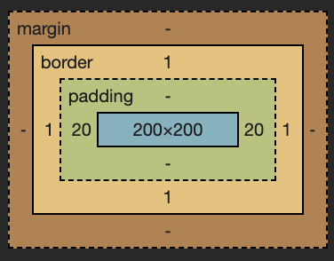

:star:**合理利用内边距撑开效果**，例如导航栏中的菜单项数字个数不相同，利用左右内边距撑开，比直接设置宽度好，例子：新浪导航栏

```html
<style>
  div {
    border-top: 3px solid #ff8500;
    border-bottom: 1px solid #edeef0;
    height: 41px;
    background-color: #fcfcfc;
    font-size: 12px;
  }
  a {
    /* 变换模式 */
    display: inline-block;
    color: #4c4c4c;
    text-decoration: none;
    height: 41px;
    line-height: 41px;
    /* 设置左右内边距，撑开盒子 */
    padding: 0px 20px;
  }
  a:hover {
    color: #ff8500;
    background-color: #edeef1;
  }
</style>
<body>
  <div>
    <a href="#">设为首页</a>
    <a href="#">手机新浪网</a>
    <a href="#">登录</a>
    <a href="#">移动客户端</a>
  </div>
</body>
```

:star:**如果盒子没有指定 width/height 属性，则 padding 不会撑开盒大小**

```html
<style>
  div {
    width: 300px;
    height: 300px;
    background-color: skyblue;
  }
  div p {
    background-color: seashell;
    padding: 30px;
  }
</style>
<body>
  <div>
    <p>
      Lorem, ipsum dolor sit amet consectetur adipisicing elit. Vel alias
      voluptatum velit?
    </p>
  </div>
</body>
```

### 外边距⭐️

外边距，用来控制盒子与盒子之间的距离。margin、margin-left/margin-right/margin-top/margin-bottom

**复合写法**和内边距相同

外边距典型应用：**让<u>块级</u>元素水平居中**。但必须满足两个条件：

1. 盒子必须指定宽度
2. 盒子**左右的外边距**都设置为 **auto**

> 行内元素或者行内块元素水平居中对齐：父元素添加 text-align:center 即可

**块元素嵌套时垂直外边距的塌陷问题**：两个嵌套关系的块元素，子元素设置上外边距，此时父元素会产生塌陷问题

解决方法：

1. 为父元素定义上边框：`border: 1px solid transparent`
2. 为父元素定义上内边距：`padding: 1px`
3. :star:为父元素添加 `overflow: hidden`（常用，没有增加盒子大小）

```html
  <style>
    .f {
      width: 400px;
      height: 400px;
      background-color: pink;
      /* overflow: hidden; */
    }
    .s {
      width: 200px;
      height: 200px;
      background-color: #000;
      /* 如果给子元素添加上外边距，一定会出现塌陷问题 */
      margin-top: 40px;
    }
  </style>
  <body>
      <div class="f">
        <div class="s"></div>
      </div>
  </body>
```

 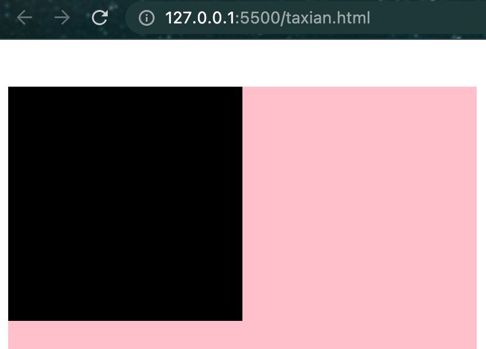

**清除内外边距**

```css
* {
  margin: 0;
  padding: 0;
}
```

注：为了照顾兼容性，尽量**只设置行内元素的左右内外边距**，不要设置上下内外边距。如果非要设置，转化为块级元素或行内块元素就可以了

## PS 基本操作

测量大小

吸色

## 综合案例(2)

**产品案例**

 

```html
<style>
    * {
      margin: 0;
      padding: 0;
    }
    body {
      background-color: #f5f5f5;
    }
    .prod {
      width: 298px;
      height: 415px;
      background-color: #fff;
      /* 居中 */
      margin: 100px auto;
    }
    .prod img {
      width: 100%;
      /* 图片平铺 */
      object-fit: cover;
      height: 240px;
    }
    .prod a {
      text-decoration: none;
      color: #000;
    }
    /* 评论 box */
    .review {
      color: #000;
      font-size: 14px;
      /* 没有width属性，不会撑大盒子 */
      padding: 0 20px;
      /* 设置margin-top，就不用计算 padding 了 */
      margin-top: 20px;
      height: 50px;
    }
    /* 回复人数元素 */
    .appraise {
      font-size: 12px;
      color: #b0b0b0;
      padding: 0 20px; /* 不设置上下边距：难以计算高度 */
      height: 18px; /* 设置高度 + 上边距，用来计算高度 */
      margin-top: 20px;
    }
    .info {
      padding: 0 20px;
      height: 30px;
      margin-top: 5px;
    }
    .info h4 {
      font-size: 14px;
      font-weight: 400;
      display: inline-block;
      color: #000;
    }
    .info em {
      font-style: normal;
      margin: 0 7px 0 15px;
      color: lightgrey;
    }
    .info span {
      color: orange;
    }
  </style>
  <body>
    <div class="prod">
      <a href="#"></a>
      <p class="review">
        <a href="#">快递牛，整体不错蓝牙递牛，整体不错。红米给力</a>
      </p>
      <div class="appraise">来自 117384232 人的评价</div>
      <div class="info">
        <h4><a href="#">Redmi Rots真无线蓝牙...</a></h4>
        <em>|</em>
        <span>99.9元</span>
      </div>
    </div>
  </body>
```

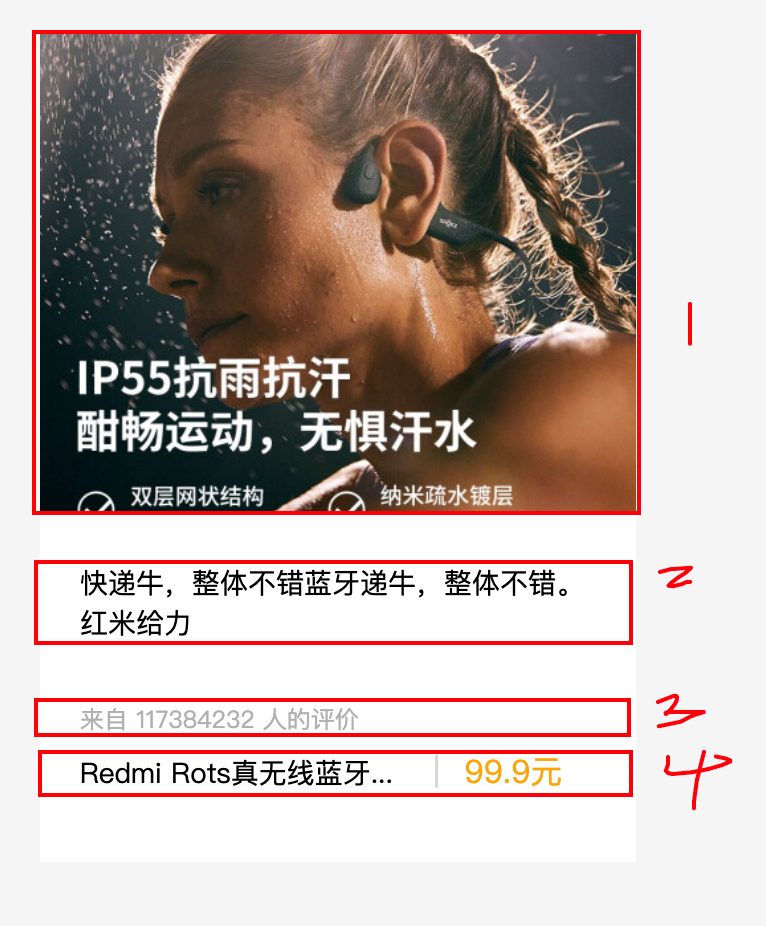

**快报案例**

复习盒子模型

 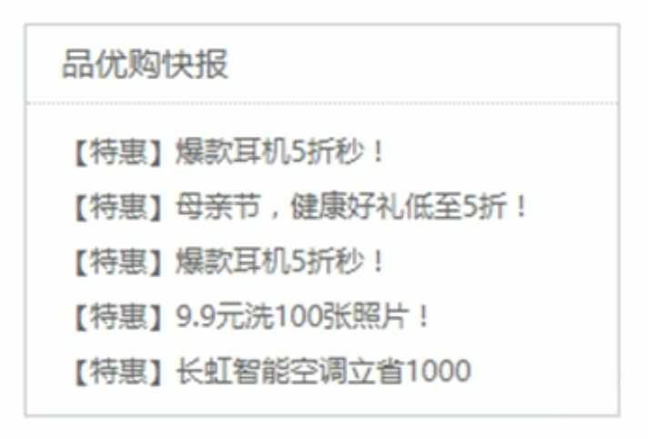

步骤：

1. 布局分析：拿到图片，利用 PS 倒推布局
2. 快报头部制作：`h3` 垂直居中、添加左边距
3. 快报列表制作：列表和 `a`、居中、边距设置

```html
<!DOCTYPE html>
<html lang="en">
  <head>
    <meta charset="UTF-8" />
    <meta name="viewport" content="width=device-width, initial-scale=1.0" />
    <title>Document</title>
    <style>
      * {
        margin: 0;
        padding: 0;
      }
      li {
        /* 全局去掉 li 前边的小圆点 */
        list-style: none;
      }
      .box {
        width: 248px;
        height: 163px;
        border: 1px solid #ccc;
        /* box 居中 */
        margin: 100px auto;
      }
      .box h3 {
        height: 32px;
        border-bottom: 1px dotted #ccc;
        font-size: 14px;
        /* 取消加粗 */
        font-weight: 400;
        line-height: 32px;
        /* 不能用 margin-left，h3盒子会错位 */
        padding-left: 15px;
      }
      .box ul li a {
        font-size: 12px;
        color: #666;
        /* 去掉 a 下划线 */
        text-decoration: none;
      }
      .box ul li a:hover {
        text-decoration: underline;
      }
      .box ul li {
        height: 23px;
        line-height: 23px;
        padding-left: 15px;
      }
      .box ul {
        margin-top: 7px;
      }
    </style>
  </head>
  <body>
    <div class="box">
      <h3>品优购快报</h3>
      <ul>
        <li><a href="#">【特惠】爆款耳机5折秒！</a></li>
        <li><a href="#">【特惠】母亲节，健康好礼低至5折！</a></li>
        <li><a href="#">【特惠】爆款耳机5折秒！</a></li>
        <li><a href="#">【特惠】9.9元洗100张照片！</a></li>
        <li><a href="#">【特惠】长虹智能空调立省1000元！</a></li>
      </ul>
    </div>
  </body>
</html>
```

## 圆角边框

CSS3 样式，用于设置元素的外边框圆角。

语法为

```css
border-radius: 数值或百分比;
分别设置
border-radius: 左上 右上 右下 左下;
border-radius: 左上-右下两个角 左下-右上两个角;

分别设置时使用的四个属性为：
border-top-left-radius/ border-top-right-radius/ border-bottom-right-radius/ border-bottom-left-radius
```

## 盒子阴影

CSS3 新增，使用 `box-shadow` 属性来添加阴影。

用法

```css
box-shadow: h-shadow v-shadow blur spread color inset;
```

| 值         | 描述                                   |
| ---------- | -------------------------------------- |
| *h-shadow* | 必须。水平阴影的位置。允许为负值       |
| *v-shadow* | 必须。垂直阴影的位置。允许为负值       |
| *blur*     | 可选。模糊距离                         |
| *spread*   | 可选。阴影的尺寸                       |
| *color*    | 可选。阴影的颜色。参考 CSS 颜色值      |
| *inset*    | 可选。将外部阴影（outset）改为内部阴影 |

示例：

```css
    #shadow {
      width: 200px;
      height: 200px;
      background-color: pink;
      margin: 50px auto;
    }
    #shadow:hover {
      box-shadow: 5px 5px 10px 5px rgba(0, 0, 0, 0.2);
    }
```

## 文字阴影

CSS3 新增，可以使用 `text-shadow` 将阴影应用在文本。

用法

```css
text-shadow: h-shadow v-shadow blur color;
```

| 值         | 描述                              |
| ---------- | --------------------------------- |
| *h-shadow* | 必须。水平阴影的位置。允许负值    |
| *v-shadow* | 必须。垂直阴影的位置。允许负值    |
| *blur*     | 可选。模糊距离                    |
| *color*    | 可选。阴影的颜色。参考 CSS 颜色值 |

## 浮动

大纲：

```
1. 为什么需要浮动
2. 浮动的排列特性
3. 3 种常见的布局方式
4. 为什么需要清除浮动
5. 2 种清除浮动的方法
6. 利用 PS 做基本切图
7. 利用 PS 插件实现切图
8. 完成学成在线的页面布局
```

网页布局的本质是使用 CSS 摆放盒子，把盒子摆放到对应位置。

CSS 提供了**三种传统的布局方式**：

1. 标准流（也称普通流、文档流）：块级元素和行内元素按照规定好的方式进行排列形成的流。

2. 浮动
3. 定位

实际开发中，一个页面基本都包含了这三种布局方式。

### 为什么需要浮动？

总结：有很多的布局效果单单使用标准流没有办法完成，此时就可以利用浮动完成布局。因为浮动可以改变元素标签默认的排列方式。

浮动最典型的应用：可以让多个块级元素在一行内排列显示。

**网页布局第一准则：多个块级元素纵向排列找标准流、多个块级元素横向排列找浮动**

### 什么是浮动

`float` 属性用于创建浮动框，将其移动到一边，直到左边缘或右边缘触及包含块或另一个浮动框的边缘。

语法

```css
float: 属性值;
```

| 属性值  | 描述                 |
| ------- | -------------------- |
| *none*  | 元素不浮动（缺省值） |
| *left*  | 元素向左浮动         |
| *right* | 元素向右浮动         |

示例

```html
    <style>
      #left {
        width: 200px;
        height: 200px;
        background-color: #cfa;
        float: left;
      }
      #right {
        width: 200px;
        height: 200px;
        background-color: #666;
        float: right;
      }
    </style>
  <body>
    <div id="left">左青龙</div>
    <div id="right">右白虎</div>
  </body>
```

### 浮动特性⭐️

1. 浮动元素会脱离标准流（脱标）
2. 浮动的元素会一行内显示并且元素顶部对齐
3. 浮动的元素会具有行内块元素的特性

特性一：设置了浮动的元素的**最重要特性**：

1. 脱离标准普通流的控制（浮），移动到指定位置（动），俗称**脱标**
2. 浮动的盒子**不再保留原先的位置**

```html
  <style>
    .box1 {
      width: 200px;
      height: 200px;
      background-color: #cfa;
      float: left;
    }
    .box2 {
      width: 300px;
      height: 300px;
      background-color: #eee;
    }
  </style>
  <body>
    <div class="box1"></div>
    <div class="box2"></div>
  </body>
```

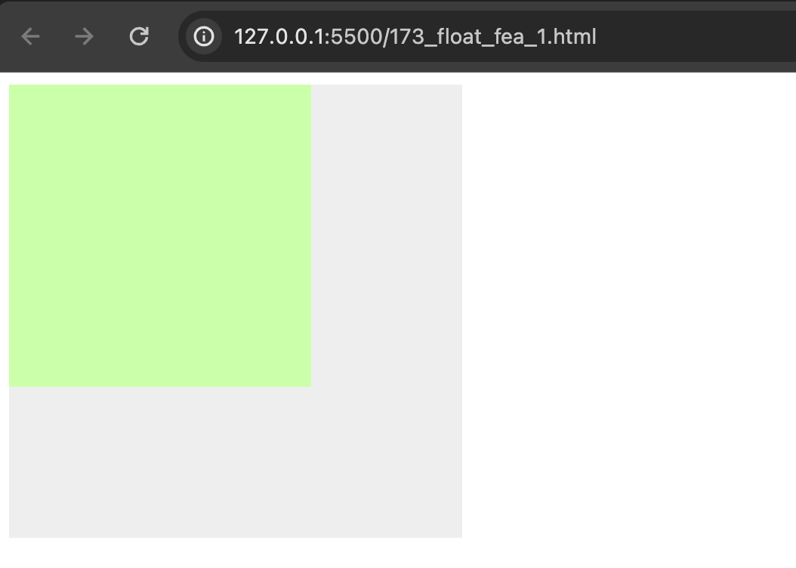

特性二：如果多个盒子都设置了浮动，则它们会按照属性值**一行内显示**并且**顶端对齐排列**。

```html
  <style>
    .box1 {
      width: 200px;
      height: 200px;
      background-color: #cfa;
      float: left;
    }
    .box2 {
      width: 300px;
      height: 300px;
      background-color: #eee;
      float: left;
    }
  </style>
  <body>
    <div class="box1"></div>
    <div class="box2"></div>
    <div class="box1"></div>
    <div class="box2"></div>
  </body>
```

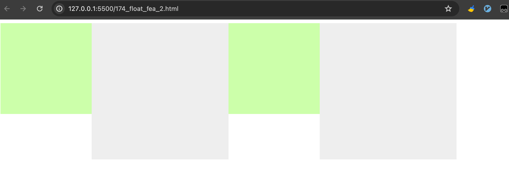

注：浮动的元素是互相贴靠在一起的（之间不会有缝隙），如果父级宽度装不下这些浮动的盒子，多出的盒子会另起一行对齐。

特性三：浮动元素具有行内块元素的特性。

任何元素都可以浮动。不管原来是什么模式的元素，添加浮动后具有**行内块元素**相似的特性。

```html
  <style>
    * {
      padding: 0;
      margin: 0;
    }
    /* 任何元素都可以浮动。不管原来是什么模式的元素，添加浮动之后都具有行内快元素相似的特性 */
    /* 如果行内元素有了浮动，则不需要转换块级\行内块元素就可以直接给宽高 */
    span,
    p {
      width: 200px;
      height: 200px;
      background-color: #cfa;
      float: left;
    }
  </style>
  <body>
    <span>1</span>
    <span>2</span>
    <p>3</p>
  </body>
```

### 浮动元素经常搭配标准流父盒子搭配使用

为了约束浮动元素的位置，我们网页布局一般采取的策略是：

**先用标准流的父元素排列上下位置，之后内部子元素采取浮动排列左右位置**。符合网页布局第一准则

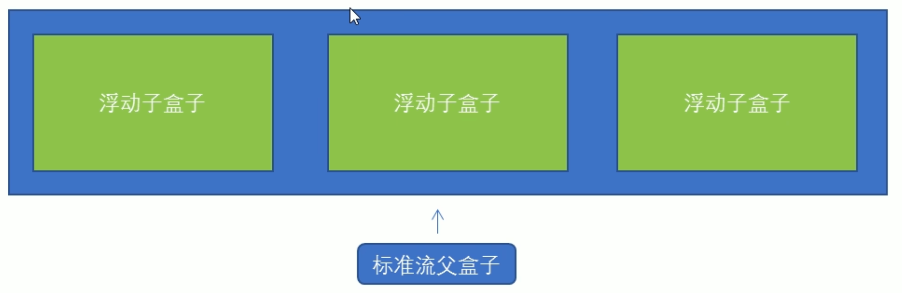

示例：小米商城官网

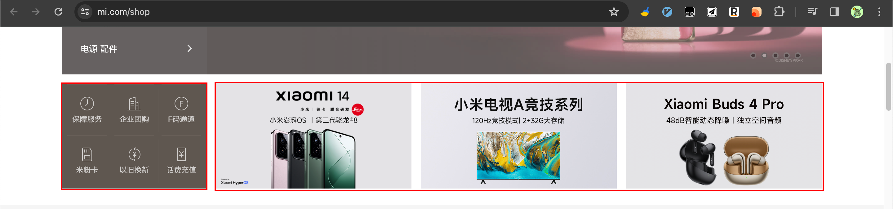

### 浮动练习(3)

练习一：左右布局

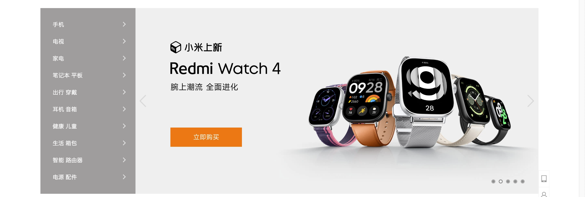

```html
  <style>
    .box {
      width: 1200px;
      height: 460px;
      background-color: pink;
      margin: 100px auto;
    }
    .left {
      width: 230px;
      height: 460px;
      background-color: #cfa;
      float: left;
    }
    .right {
      width: 970px;
      height: 460px;
      background-color: #666;
      float: right;
    }
  </style>
  <body>
    <div class="box">
      <div class="left">left</div>
      <div class="right">right</div>
    </div>
  </body>
```

练习二：产品排列

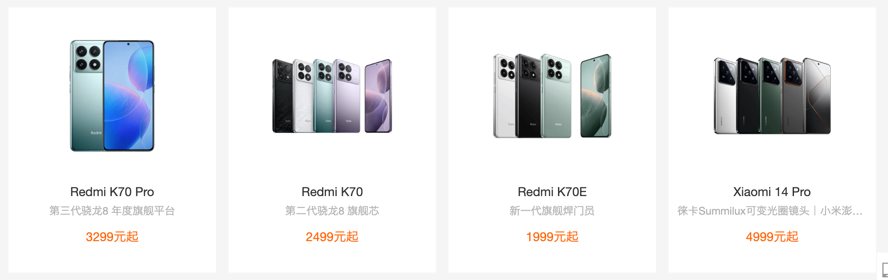

```html
  <style>
    * {
      margin: 0;
      padding: 0;
    }
    li {
      list-style: none;
    }
    .box {
      width: 1226px;
      height: 285px;
      background-color: #666;
      margin: 100px auto;
    }
    .box li {
      width: 296px;
      height: 285px;
      background-color: #cfa;
      float: left;
      margin-right: 14px;
    }
    /* 要注意权重的问题！ */
    .box .last {
      margin-right: 0;
    }
  </style>
  <body>
    <ul class="box">
      <li>1</li>
      <li>2</li>
      <li>3</li>
      <li class="last">4</li>
    </ul>
  </body>
```

案例三：特殊布局

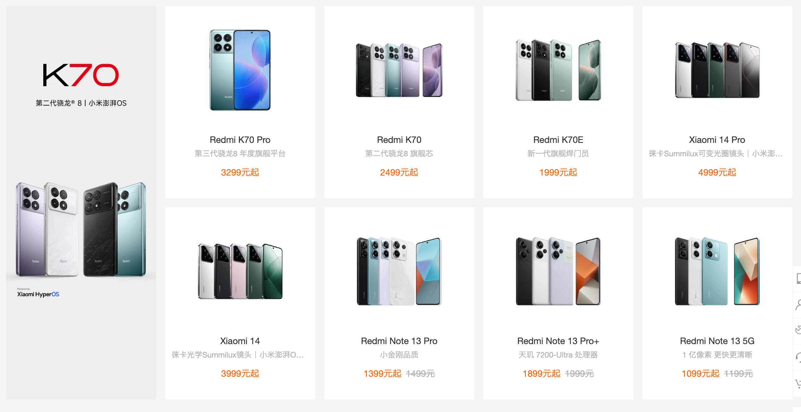

```html
  <style>
    * {
      padding: 0;
      margin: 0;
    }
    li {
      list-style: none;
    }
    .box {
      width: 1226px;
      height: 615px;
      background-color: #cfa;
      margin: 50px auto;
    }
    .left {
      width: 234px;
      height: 615px;
      background-color: #666;
      float: left;
    }
    .right {
      width: 992px;
      height: 615px;
      float: left;
    }
    .right > li {
      /* 网页布局第二准则：先设置盒子大小，之后设置盒子位置 */
      width: 234px;
      height: 300px;
      background-color: #fff;
      float: left;
      margin-left: 14px;
      margin-bottom: 14px;
    }
  </style>
  <body>
    <div class="box">
      <div class="left"></div>
      <ul class="right">
        <li>1</li>
        <li>2</li>
        <li>3</li>
        <li>4</li>
        <li>5</li>
        <li>6</li>
        <li>7</li>
        <li>8</li>
      </ul>
    </div>
  </body>
```

### 常见的网页布局

三种：

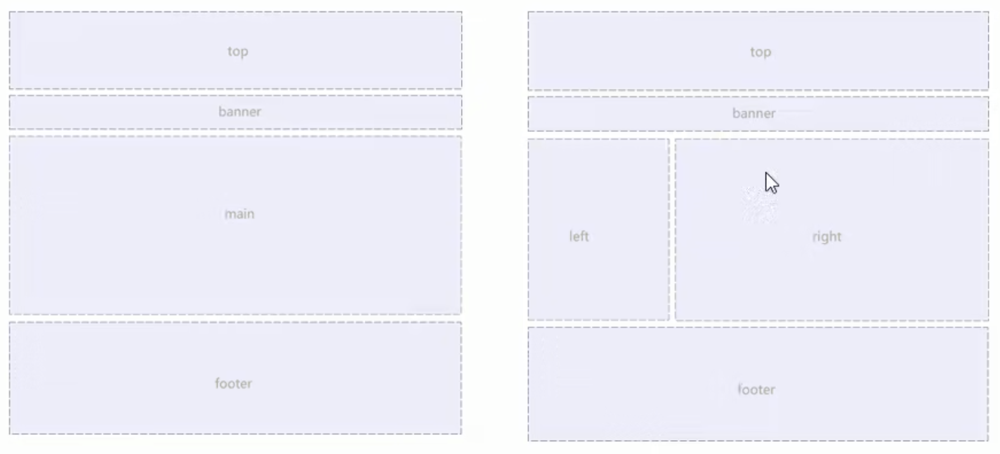

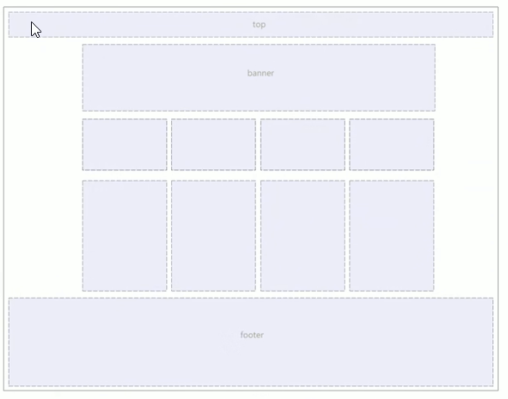

```html
  <style>
    * {
      padding: 0;
      margin: 0;
    }
    .top {
      height: 40px;
      background-color: #cfa;
    }
    .banner {
      width: 980px;
      height: 90px;
      background-color: #eee;
      margin: 10px auto;
    }
    .body {
      width: 980px;
      height: 350px;
      background-color: #eee;
      margin: 10px auto;
    }
    .body > div {
      width: 230px;
      height: 350px;
      float: left;
      margin-right: 20px;
      background-color: gray;
    }
    .body > .last {
      margin-right: 0;
    }
    .footer {
      height: 40px;
      background-color: #cfa;
    }
  </style>
  <body>
    <div class="top">top</div>
    <div class="banner">banner</div>
    <div class="body">
      <div>1</div>
      <div>2</div>
      <div>3</div>
      <div class="last">4</div>
    </div>
    <div class="footer">footer</div>
  </body>
```

### 浮动布局的注意点

1. 浮动和标准流父盒子搭配使用

**先用标准流的父元素排列上下位置，之后内部子元素采取浮动的方法排列左右位置。**

2. 一个元素浮动了，理论上其余的兄弟元素也要浮动

一个盒子里多个子盒子，如果一个盒子浮动了，那么其他兄弟也应该浮动，以防止引起问题。

> 有3个div兄弟，如果仅仅第2个浮动，会出现什么问题？三者会重合吗
>
> 答：不会，第2个盒子不会影响第1个，仅和第3个重合。

**浮动的盒子只会影响浮动盒子后面的标准流，不会影响前面的标准流。**

### 为何要清除浮动？

在前边的例子中，所有标准流父元素都有一个共同特点，即都是有高度的。

问题：**所有的标准流父盒子都必须有高度吗？**

特例：某新闻网站中有一个浮动的盒子，里边是新闻文字内容，此时该元素的父级元素高度不应该指定高度，因为不同的新闻文字字数不同。

期待的效果：让子盒子撑开父亲元素，父亲元素不指定高度。

如果将父亲元素高度设置为 0 呢？

```html
  <style>
    .box {
      height: 0;
      background-color: #cfa;
    }
    .box .first {
      width: 200px;
      height: 200px;
      background-color: #eee;
      float: left;
    }
    .box .second {
      width: 300px;
      height: 250px;
      background-color: gray;
      float: left;
    }
    .footer {
      height: 250px;
      background-color: orangered;
    }
  </style>
  <body>
    <div class="box">
      <div class="first"></div>
      <div class="second"></div>
    </div>
    <div class="footer"></div>
  </body>
```

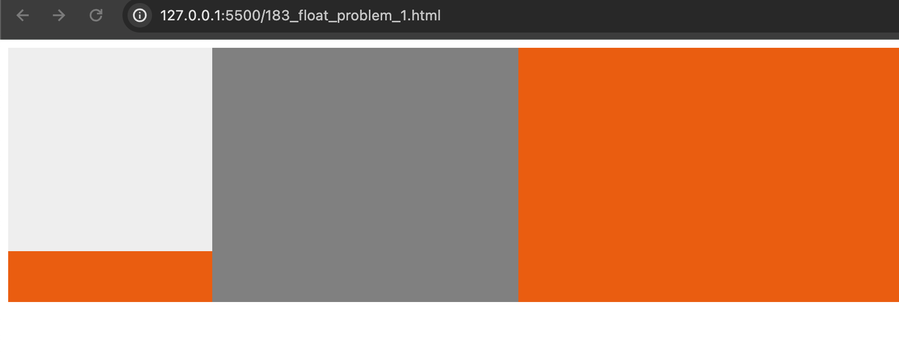

父亲盒子高度为 0 则不会显示，会影响下边的标准流盒子。

> 问：为啥要消除浮动？
>
> 答：由于浮动元素不占用原文档流的位置，所以他会对后边的元素排版产生影响。

### 清除浮动的方法

- 清除浮动的本质是清除浮动元素造成的影响。

- 如果父盒子本身有高度，则不需要清除浮动
- 清除浮动后，父级就会根据浮动的子盒子自动检测高度。父级有了高度，就不会影响下面的标准流了。

语法：

```css
clear: 属性值;
```

| 属性值  | 描述                       |
| ------- | -------------------------- |
| *left*  | 不允许左侧有浮动元素       |
| *right* | 不允许右侧有浮动元素       |
| *both*  | 同时清楚左右两侧浮动的影响 |

实际开发中，几乎只用 `clear: both;`

清除浮动的策略：闭合浮动，即只让浮动在父盒子内部影响，不影响父盒子外面的其他盒子。

清除浮动的方法：

1. 额外标签法，也称为隔墙法，是 W3C 推荐的做法。
2. 为父级元素添加 `overflow` 属性；
3. 为父级元素添加 `after` 伪元素；
4. 为父级元素添加双伪元素；

**一、额外标签法**

做法：在最后一个浮动元素后添加一个空的标签。例如 `<div style="clear:both;"></div>`，获取其他标签如 `br`

优点：通俗易懂，书写方便

缺点：添加许多无意义的标签，结构化较差

**注意：要求这个新的空标签必须是块级元素。**

```html
  <style>
    .box {
      background-color: #cfa;
    }
    .box .first {
      width: 200px;
      height: 200px;
      background-color: #eee;
      float: left;
    }
    .box .second {
      width: 300px;
      height: 250px;
      background-color: gray;
      float: left;
    }
    .footer {
      height: 250px;
      background-color: orangered;
    }
    .clear {
      clear: both;
    }
  </style>
  <body>
    <div class="box">
      <div class="first"></div>
      <div class="second"></div>
      <div class="clear"></div>
    </div>
    <div class="footer"></div>
  </body>
```

**二、为父级添加 overflow**

做法：给父级添加 overflow 属性，将其属性值设置为 hidden/auto/scroll

优点：代码简洁

缺点：无法显示溢出的部分

```css
    .box {
      background-color: #cfa;
      overflow: hidden;
    }
```

**三、为父级添加 :after 伪元素**

```html
<style>
    .clearfix:after {
      content: '';
      display: block;
      height: 0;
      clear: both;
      visibility: hidden;
    }
    .clearfix {
      /* IE6, IE7 专有 */
      *zoom: 1;
    }
</style>

  <body>
    <div class="box clearfix">
      <div class="first"></div>
      <div class="second"></div>
    </div>
    <div class="footer"></div>
  </body>
```

原理：是额外标签法的升级版，通过 css 生成最后一个标签，放在最后一个浮动元素后。

优点：没有增加标签，结构更简单

缺点：需要照顾低版本浏览器

**四、为父级添加双伪元素**

```html
<style>
    .clearfix:before,
    .clearfix:after {
      content: '';
      display: table;
    }
    .clearfix:after {
      clear: both;
    }
    .clearfix {
      *zoom: 1;
    }
</style>

  <body>
    <div class="box clearfix">
      <div class="first"></div>
      <div class="second"></div>
    </div>
    <div class="footer"></div>
  </body>
```

### 清除浮动总结

何时需要清除浮动？需满足以下三点：

1. 父级没高度
2. 子盒子浮动了
3. 影响其后标准流的布局了，应该清除浮动了

清除浮动的四种方法：

| 方式              | 优点               | 缺点                                 |
| ----------------- | ------------------ | ------------------------------------ |
| 额外标签法        | 通俗易懂，书写方便 | 添加许多无意义的标签，结构化较差     |
| 父级 overflow     | 书写简单           | 溢出隐藏                             |
| 父级 after 伪元素 | 结构语义化正确     | 由于IE6-7不支持 :after，有兼容性问题 |
| 父级双伪元素      | 结构语义化正确     | 由于IE6-7不支持 :after，有兼容性问题 |

## 学成在线项目

### 项目搭建

编写外部 css 文件并通过 link 元素将其链接到 html 内

### CSS 属性书写顺序 ⭐️

**建议**遵循以下编写**顺序**：

1. 布局定位属性：display/position/float/clear/visibility/overflow
2. 自身属性：width/height/margin/padding/border/background
3. 文本属性：color/font/text-decoration/text-align/vertical-align/white-space/break-word
4. 其他属性(CSS3)：content/cursor/border-radius/box-shadow/text-shadow/background:linear-gradient…

示例：

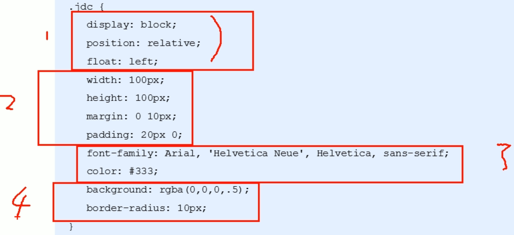

### 页面布局整体思路

为了提高网页制作效率，布局时通常有以下的整体思路：

1. 必须确定页面的版心（可视区，是页面最核心的区域），需要通过测量获取尺寸
2. 分析页面中的模块，以及每个行模块中的列模块。实为**页面布局第一准则**
3. 一行中的列模块经常浮动布局，先确定每个列的大小，之后确定列的位置。实为**页面布局第二准则**
4. 制作 HTML 结构。遵循**先结构后样式**的原则，结构永远最重要
5. 所以，先理清布局结构，再写代码尤为重要。这需要我们多写多积累

### 过程

header 区域：[submit](https://gitee.com/egu0/css_toturials_pink/commit/c28f3506d7011d7e7b53f83f5c290dcd321b2b9d)

- logo 区域
- 导航栏部分
- 搜索栏
- 用户区域

banner 区域 [submit](https://gitee.com/egu0/css_toturials_pink/commit/e2be93169b50cded7eff65b25af25a6c2aadfd77)

- 侧边导航栏
- 我的课程区域

精品推荐导航栏模块 [submit](https://gitee.com/egu0/css_toturials_pink/commit/a5562ef24977deabf615b97666f8ae806591b1e8)

精品推荐模块 [submit](https://gitee.com/egu0/css_toturials_pink/commit/4585207cf6fd5b26251c868df7241b800d7a711c)

- `box-hd` 区域
- `box-bd` 区域，结构搭建、盒子搭建

footer 区域 [submit](https://gitee.com/egu0/css_toturials_pink/commit/5a33f0081b9bd62fee50c1ec751ff38ef06c9d80)

- 大纲
- 左侧
- 右侧

## 定位

大纲

```markdown
1. 为什么要用定位
2. 定位的 4 种分类
3. 4 种定位各自的特点
4. 为什么常用【子绝父相】布局
5. 写出淘宝轮播图布局
6. 写出显示隐藏的 2 种方式以及区别
```

### 为什么需要定位

一些场景下标准流和浮动难以实现，比如

- 场景一：某个元素可以自由滴在一个盒子内移动位置，并且压住其他盒子。
- 场景二：当我们滚动窗口时候，有些盒子是固定在屏幕的某些位置。

总结：

1. 浮动可以让多个块级盒子一行并且没有缝隙排列显示，经常用于横向排列盒子
2. 定位则是可以让盒子自由的在某个盒子内移动位置或者固定在屏幕中某个位置，并且可以压住其他盒子

### 定位组成

定位：将盒子**定**在某个**位**置，所以**定位也是在摆放盒子，按照定位的方式移动盒子**。

**定位 = 定位模式 + 边偏移**

> 定位模式用于指定一个元素在文档中的定位方式。边偏移则决定了该元素的最终位置。

**定位模式**：决定元素的定位方式，通过 `position` 属性来设置，属性值可以为

| 属性值     | 含义     |
| ---------- | -------- |
| *static*   | 静态定位 |
| *relative* | 相对定位 |
| *absolute* | 绝对定位 |
| *fixed*    | 固定定位 |

**边偏移**：指定位的盒子移动到最终位置，有 top/bottom/left/right 四个属性：

| 属性值   | 示例           | 描述                                               |
| -------- | -------------- | -------------------------------------------------- |
| *top*    | `top: 90px`    | **顶端**偏移量，定义元素相对于其父元素上边线的距离 |
| *bottom* | `bottom: 80px` | **底端**偏移量，定义元素相对于其父元素下边线的距离 |
| *left*   | `left: 50px`   | **左侧**偏移量，定义元素相对于其父元素左边线的距离 |
| *right*  | `right: 20px`  | **右侧**偏移量，定义元素相对于其父元素右边线的距离 |

### 静态定位

是元素的默认定位方式，也称为**无定位**。

```css
position: static;
```

特点

- 静态定位按照标准流摆放元素，没有边偏移
- 静态定位在布局中很少用到

### 相对定位

指元素在移动位置时是相对它**原来的位置**来说的。

语法

```css
position: relative;
```

特点 ⭐️

- 它是相对于自己原来的位置移动的（**移动位置时参照点是自己原来的位置**）
- 元素位置移动后，会继续占有原来在标准流中的位置，且后面的盒子仍然以标准流的方式对待它。（**不脱标，继续保留原来的位置**）

示例

```html
  <style>
    * {
      padding: 0;
      margin: 0;
    }
    .first {
      position: relative;
      width: 200px;
      height: 200px;
      background-color: pink;
      top: 20px;
      left: 30px;
    }
    .second {
      height: 200px;
      background-color: #cfa;
    }
  </style>
  <body>
    <div>
      <div class="first"></div>
      <div class="second"></div>
    </div>
  </body>
```

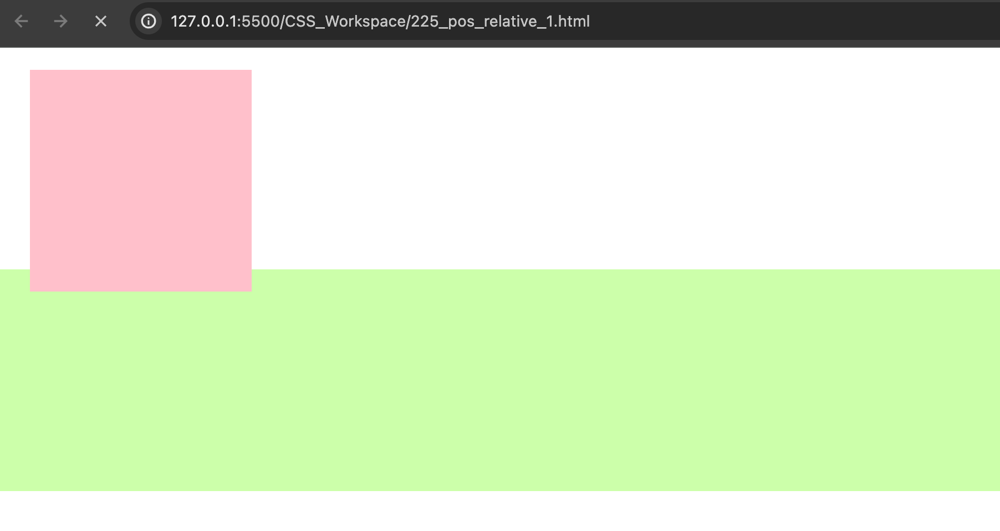

### 绝对定位

指元素在移动位置时是相对它**祖先元素的位置**来说的。

语法

```css
position: absolute;
```

特点 ⭐️

- 如果**没有祖先元素**或**祖先元素没有定位**，则以浏览器为准定位（document）
- 如果祖先元素有定位（相对、绝对、固定定位），则以**最近一级有定位的祖先元素**作为参考点移动位置。
- 绝对定位**不再占有原先的位置**（脱标）

> 示例：[1](https://gitee.com/egu0/css_toturials_pink/blob/main/CSS_Workspace/226_pos_absolute_1.html),[2](https://gitee.com/egu0/css_toturials_pink/blob/main/CSS_Workspace/227_pos_absolute_2.html),[3](https://gitee.com/egu0/css_toturials_pink/blob/main/CSS_Workspace/228_pos_absolute_3.html)

### 子绝父相

子级元素是绝对定位的话，父级元素要用相对定位。

含义：

- 子级绝对定位不会占有位置，可以放到父盒子里面的任何一个地方，不会影响其他的兄弟盒子
- 父盒子需要加定位限制子盒子在父盒子内显示
- 父盒子布局时，需要占有位置，因此父亲只能是相对定位

总结：**因为父级需要占用位置，因此是相对定位，子盒子不需要占用位置，则是绝对定位**。

> 注：子绝父相不是永远不变的，如果父元素不需要占有位置，子绝父绝页会遇到。

一个示例

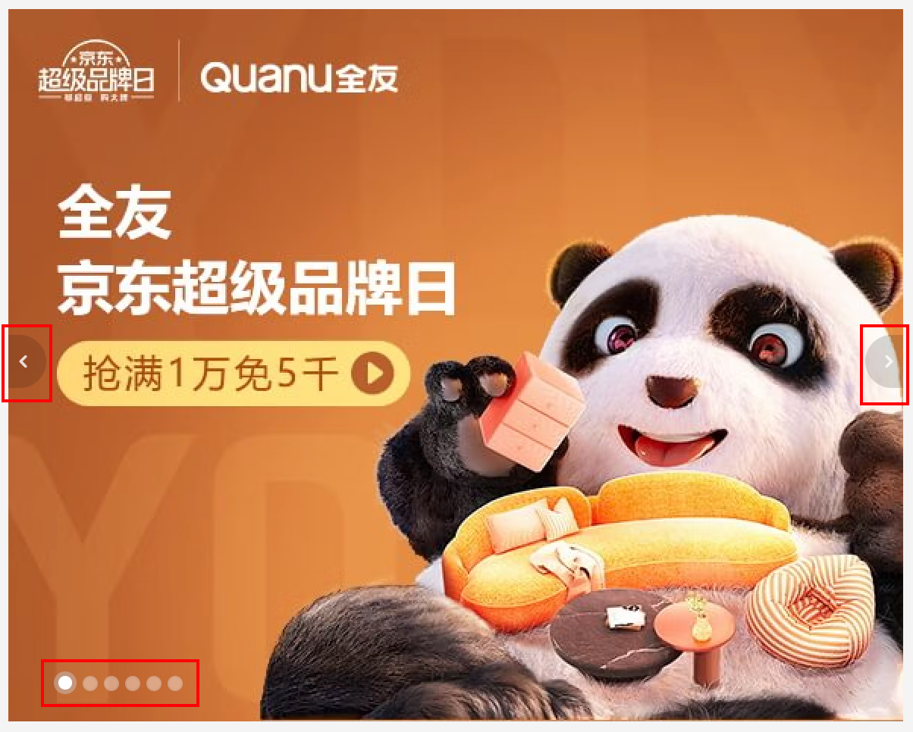

> 练手：学成在线-精品课程卡片-hot标签展示

### 固定定位

是指元素固定在浏览器可视区的某个位置。

主要使用场景：在浏览器页面滚动时元素的位置不会改变。

语法

```css
position: fixed;
```

特点

1. 以浏览器的可视窗口作为参照点移动元素
   1. 跟父元素没有任何关系
   2. 不随滚动条滚动
2. 固定定位不再占有原先的位置（脱标）

> 固定定位可以看成是一种特殊的绝对定位。

> 一个固定小技巧：有的定位不是以窗口作为参照的，而是以版心作为参照的
>
> 比如：[掘金文章页左侧工具栏](https://juejin.cn/post/7311880893841522722)
>
> 示例：
>
> ```html
>   <style>
>     * {
>       padding: 0;
>       margin: 0;
>     }
>     .box {
>       margin: auto;
>       width: 1000px;
>       height: 3000px;
>       background-color: #cfa;
>     }
>     .tools {
>       position: fixed;
>       /* 浏览器的一半 */
>       right: 50%;
>       bottom: 30%;
>       /* 版心的一半 + 调整 */
>       margin-right: 550px;
>       width: 50px;
>       height: 320px;
>       background-color: #666;
>     }
>   </style>
>   <body>
>     <div class="box"></div>
>     <div class="tools"></div>
>   </body>
> ```
>
> 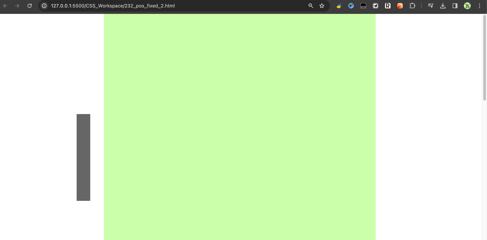

### 粘性定位

可以看做是相对定位和固定定位的混合。

```css
position: sticky;
```

特点

1. 以浏览器的可视窗口作为参照点移动元素（固定定位特点）
2. 粘性定位**占有原先的位置**（相对定位特点）
3. 必须添加 top/left/right/bottom 其中一个才有效

一个示例

```html
 <style>
    * {
      padding: 0;
      margin: 0;
    }
    body {
      height: 3000px;
    }
    .header {
      /* 粘性定位 */
      position: sticky;
      top: 4px;
      /* 初始位置 */
      margin: 100px auto;
      width: 1200px;
      height: 50px;
      background-color: #eee;
    }
    .header h3 {
      line-height: 50px;
      margin-left: 30px;
    }
  </style>
  <body>
    <div class="header">
      <h3>我是导航</h3>
    </div>
  </body>
```

效果：元素刚开始随着导航栏滚动，滚动到一定位置是变为固定定位的效果。

### 总结

| 定位模式              | 是否脱标             | 移动位置               | 是否常用     |
| --------------------- | -------------------- | ---------------------- | ------------ |
| static 静态定位       | 否                   | 不能使用边偏移         | 很少         |
| **relative 相对定位** | **否（占用位置）**   | **相对于自身位置移动** | **常用**     |
| **absolute 绝对定位** | **是（不占有位置）** | **带有定位的父级**     | **常用**     |
| **fixed 固定定位**    | **是（不占有位置）** | **浏览器可视区**       | **常用**     |
| sticky 粘性定位       | 否（占有位置）       | 浏览器可视区           | 当前阶段少用 |

### 定位的叠放顺序

使用定位布局时，可能会出现盒子重叠的情况。此时可以使用 `z-index` 来设置盒子的前后次序

```css
z-index: 0;
```

数值可为正或为负，值越大，盒子越靠上。默认为 `auto`；

只有定位的盒子才有 `z-index` 属性，浮动和标准流的元素没有该属性。

如果多个元素，它们的 `z-index` 属性相同，则按照书写顺序，后来者居上。

### 定位-拓展

如何让使用绝对定位的盒子实现居中呢？

> 注：加了 position:absolute 的盒子不能通过 margin:auto 实现居中。

示例

```html
  <style>
    .box {
      position: relative;
      width: 400px;
      height: 400px;
      background-color: #eee;
      margin: 100px auto;
    }
    .son {
      position: absolute;
      /* 水平居中 */
      left: 50%;
      margin-left: -100px;
      /* 垂直居中 */
      top: 50%;
      margin-top: -100px;
      
      width: 200px;
      height: 200px;
      background-color: #cfa;
    }
  </style>
  <body>
    <div class="box">
      <div class="son"></div>
    </div>
  </body>
```

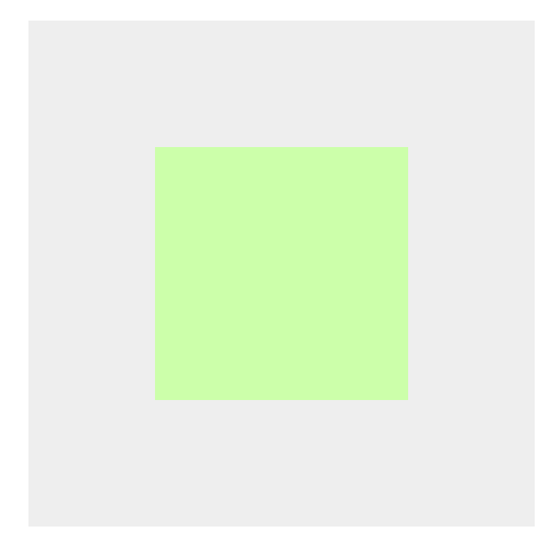

**定位特殊特性**

绝对定位和固定定位也和浮动类似。

1. 行内元素添加绝对或固定定位，可以直接设置高度和宽度。
2. 块级元素添加绝对或固定定位，如果不给宽度或高度，默认大小是内容的大小

```html
  <style>
    * {
      padding: 0;
      margin: 0;
    }
    .tex {
      position: absolute;
      top: 300px;
      
      width: 100%;
      height: 100px;
      background-color: #cfa;
    }
    p {
      background-color: #eee;
    }
  </style>
  <body>
    <span class="tex">
      Lorem ipsum dolor sit amet consectetur adipisicing elit. Quam sed
      recusandae impedit non quisquam labore sequi delectus. Magni consectetur
      omnis quam esse vel fuga, maiores nemo nulla. Ipsam, quis ratione?
    </span>
    <p>
      Lorem ipsum dolor sit, amet consectetur adipisicing elit. Cum molestiae
      necessitatibus at veritatis autem placeat iste voluptatum dolorum facilis
      porro. Unde quos facere quae autem dolorem nihil fugiat. Excepturi, optio.
    </p>
  </body>
```

扩展一：**绝对定位会完全压住它下边的盒子**。

```html
  <style>
    .box {
      position: absolute;
      left: 30px;
      width: 200px;
      height: 200px;
      background-color: #cfa;
    }
    .par {
      background-color: #eee;
    }
  </style>
  <body>
    <div class="box"></div>
    <p class="par">
      Lorem ipsum dolor sit, amet consectetur adipisicing elit. Aut sit
      blanditiis dicta voluptas iure nostrum cum et! Sed voluptatem similique,
      quasi possimus nesciunt laudantium, iste molestias aspernatur eius,
      recusandae rerum.
    </p>
  </body>
```

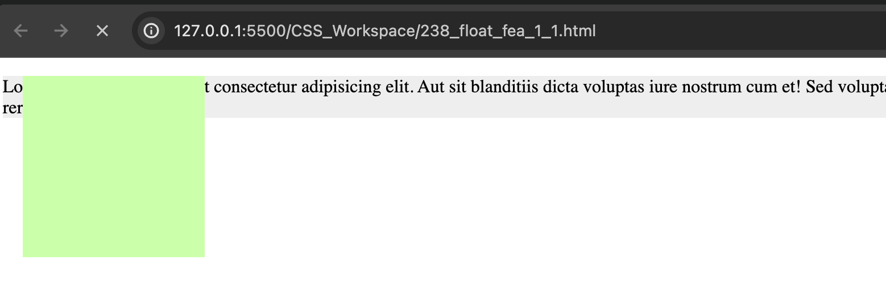

但浮动元素只会压住他下边的标准流盒子，但是不会压住下面标准流盒子里面的文字或图片。

```html
  <style>
    .box {
      float: left;
      margin-left: 40px;
      width: 200px;
      height: 200px;
      background-color: #cfa;
    }
    .par {
      background-color: #eee;
    }
  </style>
  <body>
    <div class="box"></div>
    <p class="par">
      Lorem ipsum dolor sit, amet consectetur adipisicing elit. Aut sit
      blanditiis dicta voluptas iure nostrum cum et! Sed voluptatem similique,
      quasi possimus nesciunt laudantium, iste molestias aspernatur eius,
      recusandae rerum.
    </p>
  </body>
```

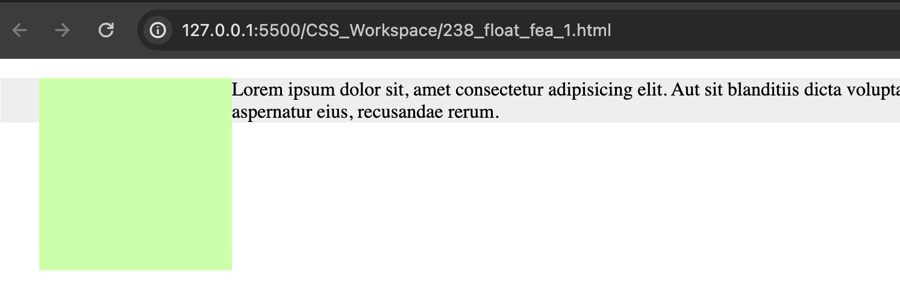

### 综合案例-淘宝焦点图

大盒子

左右两个按钮

底部盒子

底部盒子小圆点制作

## 网页布局总结

根据盒子模型我们知道大部分标签是一个盒子

通过 CSS 浮动、定位可以让每个盒子排列成为网页。

一个完成的网页是通过**标准流、浮动、定位**一起完成布局的，每个都有自己的专门用法。

1. 标准流：可以让盒子上下排列或者左右排列，**垂直的块级盒子使用的就是标准流布局**。
2. 浮动：可以让多个块级元素一行显示或者左右对齐，**多个块级盒子水平显示就用浮动布局**
3. 定位：定位的最大特点是层叠，指可以让多个盒子前后叠压来显示，**如果元素自由在某个盒子内移动就用定位布局**。

## 元素的显示与隐藏

方法

1. display
2. visibility
3. overflow

**display** 用于设置一个元素如何显示。

- `none` 隐藏元素，元素还存在，不在占用原来的位置
- `block` 块级元素

**visibility** 设置可见性

- `hidden` 隐藏，元素还存在，占用原来的位置
- `visible` 可见

**overflow** 控制溢出的部分的可见性

- `hidden` 隐藏溢出的部分，避免超出部分影响布局。如果使用有定位的盒子，且有溢出的效果，慎用该属性值，因为他会隐藏超出的部分。
- `scroll` 显示滚动条
- `auto` 超出时显示滚动条

### 土豆网案例-显示与隐藏

<https://gitee.com/egu0/css_toturials_pink/tree/main/CSS_Workspace/249_tudou_hidden_display>
