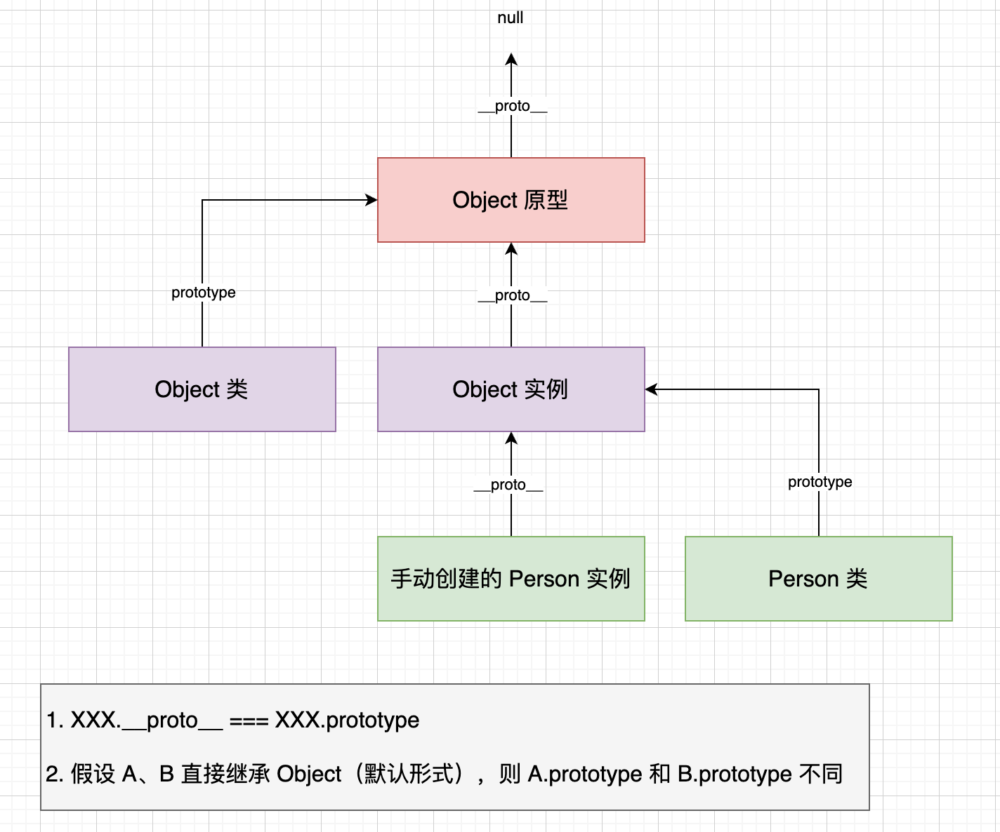

# Javascript 入门

[仓库](https://gitee.com/egu0/js-tutorials)

## 数据类型

**基本数据类型**（Primitive Data Types）

- Number（数字）
- String（字符串）
- Boolean（布尔值）
- Null（空值）: 表示空值或空对象指针
- Undefined（未定义）: 表示未定义的值
- Symbol（符号，ES6新增）: 用于创建唯一的标识符

**引用数据类型**（Reference Data Types）

- Object（对象）: 用于存储复杂数据结构和更大的数据集
- Array（数组）: 一种特殊类型的对象，用于存储有序的数据集合
- Function（函数）: 也是一种特殊类型的对象，用于执行特定任务的可执行代码块
- ...

**数据类型的分类对于理解变量的特性、内存分配和数据操作非常重要**

---

⭐️ **var, let, const 区别**

- **var**：是在 ES5 中引入的关键字，它声明的变量存在**变量提升**，即可以在声明之前使用，但其作用域是**函数作用域或全局作用域**。使用 **var** 声明的变量可以被重复声明，而不会报错。
- **let**：是在 ES6 中引入的关键字，它声明的变量**不存在变量提升**，即必须在声明后才能使用，其作用域是**块级作用域**。使用 **let** 声明的变量不可以被重复声明，否则会报错。
- **const**：也是在 ES6 中引入的关键字，它用于声明常量，其值在声明后不能被修改，但对象和数组等引用类型的数据结构中，其内部的属性或元素是可以被修改的。

```js
  <script>
    /*
      作用域分类：
      - 全局作用域
      - 局部作用域
         - 块作用域
         - 函数作用域

      var,let,const 三者的作用域：
      - 共有的作用域
         - 全局作用域
         - 函数作用域
      - var 无块作用域，let 和 const 有块作用域
    */

    {
      var a = 1 // 无块作用域，相当于全局声明
    }
    console.log(a) //1

    {
      {
        {
          {
            b = 2 // var 缺省声明
          }
        }
      }
    }
    console.log(window.b) //2
  </script>
```

## 对象

基本使用 - 1

```js
  <script>
    let obj1 = new Object()
    // 也可省略 new
    // let obj2 = Object()

    obj1.name = '孙悟空'
    obj1.age = 18
    obj1.gender = '男'
    console.log(obj1)
  </script>
```

基本使用 - 2

```js
  <script>
    let obj = Object()
    // 属性名可以使任何值。如果太特殊，需使用[]来设置
    // 建议按照命名规范来命名属性名
    obj.if = 'a'
    obj.let = 'b'
    obj['a09u][@131]'] = 'c'

    let sym = Symbol()
    obj[sym] = '将symbol作为属性名'
    // 要求值必须用原 symbol 取，symbol 相当于一个钥匙

    // 属性值可以是任意的数据类型（也可以是一个对象）

    console.log(obj.let)
    console.log(obj['a09u][@131]'])
    console.log("let" in obj);
    console.log(obj)
  </script>
```

通过字面量创建对象

```js
  <script>
    // 通过字面量创建对象
    // let obj = {}
    let obj = { name: 'zz', age: 18, gender: '男' }
    console.log(log)
  </script>
```

枚举所有属性值

```js
  <script>
    let obj = { name: 'zz', age: 18, gender: '男' }
    // 枚举属性名
    for (let key in obj) {
      console.log(key, '===>', obj[key])
    }
    // 注：并不是所有属性都可以枚举，比如使用符号添加的属性
  </script>
```

⭐️⭐️⭐️ **基本数据类型和引用数据类型的操作对应的内存空间分析**

为对象添加**方法**

```js
  <script>
    let obj = Object()
    obj.name = 'bob'
    // 添加方法
    obj.sayHello = () => {
      console.log('hello')
    }
    obj.sayHello()
  </script>
```

## 函数

```js
  <script>
    // 函数声明
    function fn1() {}
    // 函数表达式
    const fn2 = function () {}
    // 箭头函数
    const fn3 = () => {}
  </script>
```

箭头函数

```js
    const add = (a, b) => {
      return a + b
    }
    const print = (target) => {
      console.log(target)
    }
```

函数形参默认值

```js
    const fnx = function (name, gender = 'unknown') {}
    const fny = function (arg1, arg2 = { name: 'bob' }) {}
```

函数作为形参

```js
  <script>
    function callback() {
      console.log('callback')
    }

    function main(fn) {
      fn()
    }

    main(callback)
  </script>
```

箭头函数返回值

```js
  <script>
    // 函数体内只有一行 return 语句则可以省略 return 关键字
    const sum = (a, b) => a + b

    // 如果箭头函数直接返回对象，需要在其外包一层 ()，避免将对象的 {} 识别为代码块
    const fn = () => ({
      name: '孙悟空',
    })

    console.log(sum(123, 456))
  </script>
```

### 3 个作用域

局部作用域 vs 全局作用域 vs 函数作用域

```
- 全局作用域
  - 在网页打开时创建、关闭时销毁
  - 所有直接编写在 script 标签中的变量都位于全局作用域中
  - 全局作用域中的变量是全局变量，可以在任意位置访问
- 局部作用域
  - 块作用域
    - 是一种局部作用域
    - 在代码块执行时创建、执行完毕后销毁
    - 在其中声明的变量是局部变量，只能在块内访问
  - 函数作用域
    - 也是一种局部作用域
    - 在函数执行时创建、执行完毕后销毁
    - 在函数中定义的变量是局部变量，只能在函数内访问
```

```js
  <script>
    // 块作用域示例
    let x = 1
    {
      let a = 3
      let x = 2
      {
        // let x = 3
        console.log(x) //2
      }
    }
    // 无法在块作用域外访问其中定义的局部变量 'a'
    // console.log(a)

    // 函数作用域示例
    function fn() {
      let a = 10
      let b = 30
      function f1() {
        let a = 20
        console.log(a) //20
        console.log(b) //30
      }
      f1()
    }
    fn()
    // 无法访问函数作用域中的定义的变量 'b'
    // console.log(b)
  </script>
```

### **作用域链**

```js
  <script>
    /*
      作用域链条：
        - 当我们使用一个变量时，JS 解释器会有现在当前作用域中查找变量，
          - 如果找到了则直接使用
          - 找不到则去上一层作用域中查找，如此往复
          - 如果一直到找到全局作用域且没有在其中找到，则会报错: Uncaught ReferenceError: [xxx] is not defined
    */

    // 块作用域示例
    let a = 10
    {
      let a = '第一个代码块中的变量 a'
      {
        let a = '第二个代码块中的变量 a'
        console.log(b)
      }
    }

    // 函数作用域示例
    let b = 33
    function fn() {
      let b = 44
      function f1() {
        let b = 55
        console.log(b)
      }
      f1()
    }
    fn()
  </script>
```

### **方法** vs **函数**

```js
  <script>
    /*
        方法（method）
          - 当一个对象的某个属性值是一个函数时，我们就称这个函数是该对象的方法
          - 通过 对象.xxx() 调用函数就称为【调用对象的方法】
     */
    let ob = {}
    obj.name = 'eugene'
    obj.age = 18
    // 函数也可以作为一个对象的属性
    obj.sayHello = () => {
      console.log('hello!')
    }
  </script>
```

### window 对象

```js
  <script>
    /*
       window 对象
        - 浏览器为我们提供了 window 对象，可以直接使用
        - window 对象代表浏览器窗口，通过该对象可以对浏览器窗口进行各种操作
        - window 对象还负责存储【Javascript 中的内置对象（如 window.alert）】和【浏览器的宿主对象（如 window.document）】
    */

    console.log('hi')
    window.console.log('hello')

    //向 window 中添加的属性会自动成为全局变量
    my_counter = 3
    window.my_num = 100
    console.log(window.my_counter, my_num)
  </script>
```

```js
<script>
    /*
      var: 用来声明变量，var 有函数作用域，但不具有块作用域
        - 在全局中使用 var 声明的变量都会作为 window 对象的属性
        - 使用 function 声明的函数都会作为 window 的方法
        - 使用 let 声明的变量不会存储在 window 中
    */

    var x_epoch = 10
    console.log(window.x_epoch) //10

    function fn() {
      console.log('我是fn')
    }
    window.fn() //work

    // 测试 let
    /*
      let y_zoom_level = 3
      console.log(window.y_zoom_level) // undefined
      let fn2 = function () {
        console.log('我是fn2')
      }
      window.fn2() //Uncaught TypeError: window.fn2 is not a function
    */
</script>
```

```js
  <script>
    function fn3() {
      d = 5 // 在局部作用域中，如果没有使用 var 或 let 声明，则变量会自动成为 window 对象的属性，成为全局变量
    }
    fn3()
    console.log(d) //5
  </script>
```

### **变量提升和函数提升**

```js
  <script>
    /*
      变量提升：
        - 使用 var 声明的变量会在所有代码执行前被声明（提前被声明）
        - 可以在变量声明前就访问变量
        - 没有太大意义
        - 补充：let 声明的变量也会提升，但是赋值之前被禁止访问

      函数提升：
        - 使用函数声明创建的函数，会在其他代码执行前被创建
        - 可以在函数声明前就调用
    */

    console.log(a) //undifined
    //变量声明，会被提升。如果不使用 var 修饰则不会提升
    var a = 10

    fn()
    //函数声明，会被提升
    function fn() {
      console.log(1)
    }

    /*
      console.log(b) //Uncaught ReferenceError: Cannot access 'b' before initialization
      let b = 20
    */
  </script>
```

提升的作用：提前分配内存，提高运行效率

### **练习**

```js
  <script>
    var a = 1
    function fn() {
      a = 2
      console.log(a) //2
    }
    fn()
    console.log(a) //2
  </script>
```

```js
  <script>
    var a = 1
    function fn() {
      console.log(a) //undefined
      var a = 2
      console.log(a) //2
    }
    fn()
    console.log(a) //1
  </script>
```

```js
  <script>
    var a = 1
    function fn(a) {
      console.log(a) //undefined
      a = 2
      console.log(a) //2
    }
    fn()
    console.log(a) //1
  </script>
```

```js
  <script>
    var a = 1
    function fn(a) {
      console.log(a) //10
      a = 2
      console.log(a) //2
    }
    fn(10)
    console.log(a) //1
  </script>
```

```js
  <script>
    var a = 1
    function fn(a) {
      console.log(a) //1
      a = 2
      console.log(a) //2
    }
    fn(a)
    console.log(a) //1
  </script>
```

练习 2: [airdrop](https://www.bilibili.com/video/BV1mG411h7aD?t=815.5&p=66)

```js
  <script>
    console.log(a) //2
    var a = 1
    console.log(a) //1
    function a() { alert(2) }
    console.log(a) //1, 上一行声明的 a() 被提升了
    var a = 3
    console.log(a) //3
    var a = function () { alert(4) }
    console.log(a) //4
  var a
    console.log(a) //4
  </script>
```

结果。

```
ƒ a() {
      alert(2)
    }
1
1
3
ƒ () {
      alert(4)
    }
ƒ () {
      alert(4)
    }
```

### 代码 debug

两种方法：在代码中添加 `debugger` 一行或在浏览器中手动打断点

### **立即执行函数**

在一个一次性的函数作用域中编写代码，而非在全局作用域中，避免变量冲突的问题

```js
  <script>
    /*
      开发时应尽量减少直接在全局作用域中编写代码！  ===》  很容易与别人的代码冲突
      解决方法：尽量编写局部作用域

      - 如果全局都用 let 声明变量，则可以使用 { } 来创建块作用域
      - 如果允许使用 var 声明变量，则可以创建函数来隔离他们（var 变量有函数作用域）
    */

    // var 没有块作用域，下边的代码会产生覆盖的问题
    /*
      {
        var a = 10
      }
      {
        var a = 20
      }
    */

    // var 有函数作用域，两个作用域中的同名变量不会影响
    function fn1() {
      var b = 30
    }
    function fn2() {
      var b = 40
    }

    /*
      立即执行函数(IIFE)：
        - 是一个匿名函数，并且他只会调用一次
        - 利用 IIFE 来创建一个一次性的函数作用域以避免变量冲突的问题
    */
    ;(() => {
      var c = 50
      console.log('IIFE', c)
    })()
    ;(() => {
      var c = 80
      console.log('IIFE', c)
    })()
  </script>
```

### 函数中的 this

函数中的 this：可以在方法中引用调用方法的对象

两个示例：

```js
  <script>
    function fn() {
      console.log('fn', this)
    }
  //以函数形式调用。也相当于 window.fn()
    fn()//fn Window {window: Window, self: Window, document: document, name: '', location: Location, …}


    const obj = {
      name: 'eg',
      sayHello: function () {
        console.log('hello from', this)
      },
    }
    //以方法形式调用
    obj.sayHello()//hello from {name: 'eg', sayHello: ƒ}
  </script>
```

### 箭头函数中的 this

永远是 window 对象

### 严格模式

```
  正常模式：
    - 默认模式
    - 语法检查不严格，原则是能不报错就不报错
    - 运行性能较差

  严格模式：
    - 禁止一些语法 
    - 更容易报错
    - 运行性能较好
```

全局严格模式

```js
  <script>
    // 'use strict'
    let a = 1
    // a = 1
    console.log(a)
  </script>
```

函数严格模式

```js
<script>
    function fn() {
      // 'use strict'
      let b = 1
      // b = 1
      console.log(b)
    }
    fn()
</script>
```

## 面向对象

```js
  <script>
    /*
        面向对象 OOP, oriented object programming
          - 对象是对现实世界的抽象
          - 程序世界中，一切皆对象
          - 类是对象的模板，对象是类的实例

        创建对象
          - 方法一：使用 Object 创建
            - 缺点 1：无法区分类型
            - 缺点 2：无法继承
          - 方法二：使用 class 关键字创建
            - 创建方法：
              - class 类名 {  }, 更常用
              - const 类名 = class {  }
    */

    class Person {}
    class Dog {}

    // 使用 new 通过构造函数创建对象
    const p1 = new Person()
    const p2 = new Person()

    console.log(p1 instanceof Person) // true
    console.log(p1 instanceof Dog) // false
    console.log(p1 == p2) // false
    console.log(p1 === p2) // false

    const d1 = new Dog()
    console.log(p1 == d1) // false
    console.log(p1 === d1) // false
  </script>
```

### 属性

```js
  <script>
    /*
       属性分类：
        - 实例属性
        - 类属性
      
       添加属性：
        - 在类的代码块中添加(实例属性或类属型)
        - 通过实例添加，比如 p.country
        - 通过类添加，比如 Person.LEVEL

       补充：类的代码块默认就是严格模式
    */
    class Person {
      // 实例属性，只能通过实例访问
      name
      age
      // 类属性，只能通过类访问
      static identifier = 'PERSON'
    }
    
    let p1 = new Person()
    p1.name = 'eugene'
    // 通过[实例.xxx = yyy]添加实例属性
    p1.gender = 'M'
    // 通过[类.xxx = yyy]添加类属型
    Person.LEVEL = 1

    console.log(p1.name, p1.age, p1.gender)
    console.log(Person.identifier, Person.LEVEL)
  </script>
```

### 方法

```js
  <script>
    /*
       方法分类：
         - 实例方法
         - 类方法

       添加方法：
         - 在类的代码块中添加（实例方法或类方法）
         - 通过实例添加，比如 p.speak
         - 通过类添加，比如 Person.speak

       声明方法：有两种方式，其中[ xxx(){} ]的方式不能在打印对象时被打印出来

       ⭐️ 类代码块中定义的方法中的 this：
        - 实例方法：this 指向实例
        - 类方法：this 指向类
     */
    class Person {
      // 创建实例方法：两种方法，后者在打印对象时看不到，但依旧可以调用
      eat1 = function () {
        // this: p1
        console.log('实例方法 eat1', this)
      }
      eat2() {
        // this: p1
        console.log('实例方法 eat2', this)
      }

      // 创建类方法：两种方法
      static speak1 = function () {
        // this: class
        console.log('类方法 speak1', this)
      }
      static speak2() {
        // this: class
        console.log('类方法 speak2', this)
      }
    }
  
    let p1 = new Person()
    p1.eat1()
    p1.eat2()
    Person.speak1()
    Person.speak2()
  
  // 进阶：通过 实例. 或 类. 添加两种方法并分别查看 this
    p1.run1 = function () {
      // this: p1
      console.log('实例方法 run1', this)
    }
    p1.run2 = () => {
      // this: window
      console.log('实例方法 run2', this)
    }
    
    Person.sleep2 = function () {
      // this: class
      console.log('类方法 sleep2', this)
    }
    Person.sleep1 = () => {
      // this: window
      console.log('类方法 sleep1', this)
    }
    
    p1.run1()
    p1.run2()
    Person.sleep1()
    Person.sleep2()
  </script>
```

### 构造函数

```js
  <script>
    class Person {
      // 构造函数，在实例化对象时自动调用
      constructor(name, age, gender) {
        // 在构造函数中为实例属性赋值
        // 构造函数中 this 表示当前实例
        this.name = name
        this.age = age
        this.gender = gender
      }
    }

    // 实例化对象
    let p1 = new Person('孙悟空', 18, '男')
    console.log(p1)
  </script>
```

### 封装

```js
  <script>
    /*
      封装的含义是什么？
        - 存储不同属性
        - 保证数据安全
      如何确保数据安全？
        - 私有化数据：在属性名前加 '#' 后，不能直接通过 [实例.#xxx] 操作
        - 提供 getter/setter 方法向外暴露私有属性（两种方式）
      私有化数据有何好处？
        - 控制属性的读写权限
        - 可以在 getter/setter 中对数据进行校验
    */
    class Person {
      // 私有属性：
      //  - 在属性名前加 '#'。需要先声明才能通过 this.#xxx 使用
      //  - 安全性：仅能在类内操作该属性
      #address
      constructor(name, age, address) {
        this.name = name
        this.age = age
        this.#address = address
      }
      sayHello() {
        console.log('hello from', this.name, ',', this.#address)
      }

      // 第一种 getter/setter 写法
      setAddress(address) {
        this.#address = address
      }
      getAddress() {
        return this.#address
      }

      // 第二种 getter/setter 写法
      get address() {
        return this.#address
      }
      set address(address) {
        this.#address = address
      }
    }

    let obj = new Person('bob', 18, 'beijing')
    obj.sayHello()
    console.log(obj)

    // 第一种 getter/setter
    obj.setAddress('shanghai')
    console.log(obj.getAddress())
    console.log(obj)
    // 第二种 getter/setter
    obj.address = 'wuhan'
    console.log(obj.address)
    console.log(obj)
  </script>
```

### 多态

```js
  <script>
    class Person {
      constructor(name) {
        this.name = name
      }
    }
    class Dog {
      constructor(name) {
        this.name = name
      }
    }

    const p = new Person('小明')
    const d = new Dog('小黄')

    /*
      定义一个函数，该函数接收一个对象作为参数，它可以输出 hello 并打印对象的 name 属性

      多态
        - 在 JS 中不会检查参数类型，所以这就意味着任何数据都可以作为参数传递
        - 要调用某个函数，无需指定类型，只要对象满足某些条件即可
    */
    function sayHello(obj) {
      console.log(`hello ${obj.name}`)
    }
    sayHello(p)
    sayHello(d)
    sayHello({})
  </script>
```

### 继承

```js
  <script>
    /*
      继承:
        - 子类通过 extends 继承父类，子类拥有父类的非私有属性和方法
        - 重写父类普通方法
        - 重写父类构造方法

      继承好处：
        - 继承可以减少代码的重复
        - 在不修改类的情况下对其进行扩展

      OOP 特点：
        封装 -> 安全性
        继承 -> 扩展性
        多态 -> 灵活性
    */
    class Animal {
      constructor(name) {
        this.name = name
      }
      speak() {}
    }
    class Dog extends Animal {
      //重写构造函数
      constructor(name) {
        //比如调用父类构造函数
        super(name)
        //...
      }
      //重写父类方法
      speak() {
        console.log('woof woof')
      }
    }
    class Cat extends Animal {
      speak() {
        console.log('meow meow')
      }
    }
    const dog = new Dog('spot')
    const cat = new Cat('kitty')
    dog.speak()
    cat.speak()
  </script>
```

### **对象的结构 & 原型**

```
对象中存储属性的区域有两处：
  1. 对象自身
    - 比如 Person 类的代码块中定义的 'name' 属性
    - 比如在类构造器中通过 this.xxx 添加的属性
  2. 对象的原型（是一个对象，常称为原型对象）
    - 在对象中有一个属性用来存储【原型对象】，该属性是 __proto__
    - 原型对象也负责存储对象的属性

何时会将属性(或方法)添加到原型对象中？
    - 在类中通过【xxx(){}】方法添加的方法
    - 主动向原型中添加的属性或方法

如何访问原型对象？
    - 通过对象的 __proto__ 属性
    - 通过 Object.getPrototypeOf(target)

原型对象也可能有原型，这样就构成了原型链
    - 根据对象复杂程度不同，原型链的长度也不同
      - person.__proto__.__proto__.__proto__ 为 null
      - {}.__proto__.__proto__ 为 null

访问对象属性时：
    - 首先会在对象自身中寻找
    - 如果找不到，则会在对象的原型链中一层一层往上寻找
    - 如果整条链都未找到则返回 undefined
注意：之前讲的【作用域链】是找属性的链
```

```js
<script>
    class Person {
      constructor(name, age) {
        this.name = name
        this.age = age
      }
      sayHello() {
        console.log(`hello from ${this.name}!`)
      }
    }

    const man = new Person('bob')

    // 对象自身中添加 sayHello 又会发生什么？
    // man.sayHello = 'hello'

    console.log(man)
    console.log(man.__proto__)

    if (typeof man.sayHello === 'function') {
      man.sayHello()
    }
    if (typeof man.__proto__.sayHello === 'function') {
      man.__proto__.sayHello()
      // 等价于
      //  Object.getPrototypeOf(man).sayHello()
    }

    console.log(man.__proto__.__proto__.__proto__) // null
    console.log({}.__proto__.__proto__) // null
  </script>
```

### 原型的作用

```
结论：【所有同类型实例的原型都是同一个父类实例】

原型的作用？
  - 提供一个【公共区域】，可供所有同类实例访问。这样我们只需要创建一个属性，即可被所有实例访问

原型的用处？
  - 存储所有同类实例共享的公共属性

JS 的继承是通过原型链实现的：【子类实例的原型都指向同一个父类实例】

【【【其他思考】】】
  - 函数的原型链是什么样的？
  - Object 的原型链是什么样的？
```

```js
<script>
    class Person {
      name = 'bob'
      age = 18
      sayHello() {
        console.log('hello from', this.name)
      }
    }

    const p1 = new Person()
    const p2 = new Person()
    console.log(
      p1.__proto__ === p2.__proto__,
      p1.__proto__ === Person.prototype
    ) // true true
    console.log('---')

    // JS 继承基于原型链实现
    class Base {}
    class Inherit extends Base {}
    const i = new Inherit()
    console.log(i) // Inherit实例
    console.log(i.__proto__) // Base实例
    console.log(i.__proto__.__proto__) // Object实例
    console.log(i.__proto__.__proto__.__proto__) // Object原型
    console.log(i.__proto__.__proto__.__proto__.__proto__) // null
    // 原型链（箭头表示‘上一层的原型为’）：Inherit -> Base -> Object -> Object原型 -> null
  </script>
```



### **修改原型**

```js
<script>
  /*
    大部分情况下，我们不需要修改原型。只有在某些特殊情况下，才需要修改原型。
    
    原则：
        - 原型尽量不要改
        - 如果要改，尽量不要通过实例修改，而是通过类的prototype属性修改
        - 最好不要对原型进行赋值
  */
  class Person {
    name = 'eugene'
    age = 18
    sayHello() {
      console.log('hello')
    }
  }

  const p1 = new Person()
  const p2 = new Person()

  // 方式一：通过对象的 __proto__ 属性修改原型
  //  不推荐
  // p1.__proto__.run = () => {
  //   console.log('forest, run!')
  // }

  // 方式二：直接修改实例的原型，只影响当前实例，不会影响原型链
  //  不推荐
  // p1.__proto__ = class {
  //   run() {
  //     console.log('forest, run!')
  //   }
  // }

  // 方式三：通过类的 prototype 属性修改原型，将方法加入原型
  //  推荐！！！
  Person.prototype.run = () => {
    console.log('forest, run!')
  }

  p1.run()
  p2.run()
</script>
```

### instanceof & hasOwn

```js
<script>
  class Base {}
  class Inherit extends Base {
    sayHello() {}
    run = function () {}
  }

  const b = new Base()
  const i = new Inherit()

  // instanceof: 检查某个对象是否是目标类的实例
  //  本质：检查对象的原型链中是否有目标类的实例
  //  特殊：Object是所有对象的原型
  console.log(i instanceof Base) // true
  console.log(i instanceof Inherit) // true
  console.log(i instanceof Object) // true
  console.log('---')

  // 检查对象中是否包含某属性
  //  - in 运算符：无论属性在对象自身还是原型中，如果存在都会返回 true
  //  - hasOwnProperty：只会检查对象自身，不会检查原型
  //  - hasOwn(obj, prop)：Object类的静态方法，作用与 hasOwnProperty 相同
  console.log(i.hasOwnProperty('sayHello')) //false
  console.log(i.hasOwnProperty('run')) //true
  console.log(Object.hasOwn(i, 'sayHello')) //false
  console.log(Object.hasOwn(i, 'run')) //true
</script>
```

### 早期 JS 创建类的方式

```js
  <script>
    // 通过 IIEF 创建类
    var Person = (function () {
      function Person(name, age) {
        // 构造函数，this 表示新建实例
        this.name = name
        this.age = age

        // 方法（向对象自身添加方法）
        this.sayHello = () => {
          console.log('hello')
        }
      }

      // 向类原型添加方法
      Person.prototype.run = () => {
        console.log('forest, run!')
      }
      // 添加静态属性
      Person.identifier = 'forest'
      // 添加静态属性
      Person.sfn = () => {
        console.log('sfn')
      }

      return Person
    })()
    const p = new Person('eugene', 18)
    console.log(p)
    console.log(p.__proto__)
    console.log('---')

    var Animal = (function () {
      function Animal() {}
      return Animal
    })()
    var animal1 = new Animal()
    var Cat = (function () {
      function Cat() {}
      // 继承 Animal
      Cat.prototype = animal1
      return Cat
    })()
    let c = new Cat()
    console.log(c) // c.__proto__ === animal1
  </script>
```

[MDN new 关键字文档](https://developer.mozilla.org/zh-CN/docs/Web/JavaScript/Reference/Operators/new#%E6%8F%8F%E8%BF%B0)

### OOP 总结

```
对象分类：
  1. 内建对象，由 ES 标准定义的对象，如：Object，Function...
  2. 宿主对象，即浏览器提供的对象，比如 window(BOM)、document(DOM)
  3. 自定义的对象
```

## 数组

### 基本操作

```js
<script>
  /*
      数组
        - 是一种符合数据类型，在数组中可以存储多个不同类型的数据
        - 存储有序数据，可以通过【索引】操作数据

      创建数组
        - 通过【new Array()】创建
        - 通过字面量创建

      数组元素存取、数组长度
  */
  const arr1 = new Array()
  // const arr2 = []
  // const arr3 = [1, 2, 3, '4']

  arr1[0] = 1
  arr1[1] = 'str'
  arr1[2] = true
  arr1[3] = { name: 'bob', age: 18 }
  console.log(arr1)
  console.log(arr1.length) // 4

  // 跳过 arr1[4...9]，直接存储 arr1[10]：造成非连续数组，浪费内存空间，应避免这种情况
  arr1[10] = '10'
  console.log(arr1)
  // arr.length 的值为【数组最大索引 + 1】
  console.log(arr1.length) // 11

  // 技巧：向数组末尾添加数据
  arr1[arr1.length] = 'zz'

  // 技巧：通过修改 length 可以间接删除元素
  arr1.length = 3
</script>
```

```js
  <script>
    // 任何类型的数据都可以成为数组中的元素
    // 但创建数组时尽量确保数组中存储相同类型的数据
    let arr1 = [
      1,
      'hello',
      true,
      null,
      undefined,
      { name: 'bob', age: 18 },
      () => {
        console.log('hello')
      },
      [1, 2, 3],
    ]
    console.log(arr1)

    // 遍历数据
    let arr2 = ['bob', 'alice', 'tom', 'jerry', 'jack']
    for (let i = 0; i < arr2.length; i++) {
      console.log(arr2[i])
    }
  </script>
```

```js
  <script>
    let arr = ['bob', 'alice', 'tom', 'jerry', 'jack']
    // for-of语句：用来遍历可迭代对象
    for (let name of arr) {
      console.log(name)
    }
    // 字符串是可迭代对象
    for (const ch of 'hello') {
      console.log(ch)
    }
  </script>
```

### 数组方法-1

```js
  <script>
    let arr = ['bob', 'alice', 'tom', 'jerry', 'jack']

    // Array.isArray(var)
    console.log(Array.isArray(arr)) // true
    console.log(Array.isArray('')) // false

    // at
    console.log(arr.at(0)) // bob。从前往后查，索引从 0 开始
    console.log(arr.at(-1)) // jack。从后往前查

    // concat
    console.log(arr.concat('hello')) // ['bob', 'alice', 'tom', 'jerry', 'jack', 'hello']

    // indexOf
    console.log(arr.indexOf('abc')) // -1
    console.log(arr.indexOf('bob')) // 0

    // join
    console.log(arr.join('-')) // bob-alice-tom-jerry-jack

    // slice(start, end)，截取数组，start inclusive，end exclusive
    console.log(arr.slice(1, 3)) // ['alice', 'tom']
    console.log(arr.slice(3)) // ['jerry', 'jack']
    console.log(arr.slice(-2)) // ['jerry', 'jack']
    console.log(arr.slice(-2, -1)) // ['jerry']
  </script>
```

```js
  <script>
    let arr = ['bob', 'alice', 'tom']

    // 数组复制 - 1
    let arr2 = arr.slice() // 会产生一个新的数组对象
    console.log(arr === arr2) // false

    // 数组复制 - 2
    let arr3 = { ...arr }
    console.log(arr === arr3) // false
  </script>
```

### 浅拷贝 & 深拷贝

```js
<script>
  // 浅拷贝：只对对象本身进行复制不会复制其中的属性
  let arr1 = [{ name: 'bob' }, { name: 'alice' }]
  let arr2 = arr1.slice()
  console.log(arr1 === arr2) // false
  console.log(arr1[0] === arr2[0]) // true, 浅拷贝！

  // 深拷贝：性能差。不仅复制对象本身，还会复制其中的属性
  let arr3 = structuredClone(arr1)
  console.log(arr1 === arr3) // false
  console.log(arr1[0] === arr3[0]) // false, 深拷贝!
</script>
```

```js
<script>
  let arr1 = { name: 'bob', age: 18, hobbies: ['swimming', 'dancing'] }

  // 使用【展开运算符】进行【浅拷贝】
  let arr2 = { ...arr1 }
  console.log(arr1 === arr2) // false
  console.log(arr1.hobbies === arr2.hobbies) // true

  // 使用【Object.assign()】进行【浅拷贝】
  let arr3 = { address: 'portland', name: 'zack' }
  Object.assign(arr3, arr1)
  console.log(arr3)
  console.log(arr1 === arr3) // false, { address: 'portland', name: 'zack', age: 18 }
  console.log(arr1.hobbies === arr3.hobbies) // true
</script>
```

### 数组方法-2

```js
<script>
  let arr = ['bob', 'alice', 'tom']

  // push: 添加一个或多个元素到数组末尾
  arr.push('jerry', 'jack')
  console.log(arr) // ['bob', 'alice', 'tom', 'jerry', 'jack']

  // pop: 删除最后一个元素
  arr.pop()
  console.log(arr) // ['bob', 'alice', 'tom', 'jerry']

  // shift: 删除第一个元素
  arr.shift()
  console.log(arr) // ['alice', 'tom', 'jerry']

  // unshift: 添加一个或多个元素到数组开头
  arr.unshift('bob')
  console.log(arr) // ['bob', 'alice', 'tom', 'jerry']

  // splice: 删除元素
  let deletedSubArr = arr.splice(1, 1) // 在索引为 start 位置删除 count 个元素
  console.log(arr) // ['bob', 'tom', 'jerry']
  console.log(deletedSubArr) // ['alice']
  arr.splice(1, 1, 'kate', 'lili') // 替换：删除索引为 1 的元素，并插入若干元素
  console.log(arr) // ['bob', 'kate', 'lili', 'jerry']
  arr.splice(1, 0, 'kate', 'lili') // 插入：在索引为 1 的位置删除 0 个元素，并插入若干元素
  console.log(arr) // ['bob', 'kate', 'lili', 'kate', 'lili', 'jerry']

  // reverse: 反转数组
  arr.reverse()
  console.log(arr) // ['jerry', 'tom', 'bob']
</script>
```

> 小练习：给定一个整数数组，如何去重？

> 排序介绍：选择排序和冒泡排序

### 高阶函数

```
高阶函数：
  - 函数的参数或返回值是函数
  - 为什么将函数作为参数？
    - 可以为另一个函数动态传递代码
```

```js
<script>
  // 利用【高阶函数】创建一个数组 filter 函数，第二个参数是一个【过滤条件】函数
  function filter(arr, conditionCallback) {
    if (!Array.isArray(arr)) {
      throw new Error('arr is not an array')
    }
    if (typeof conditionCallback !== 'function') {
      throw new Error('conditionCallback is not a function')
    }

    // filter
    let result = []
    for (let i = 0; i < arr.length; i++) {
      if (conditionCallback(arr[i])) {
        result.push(arr[i])
      }
    }
    return result
  }

  console.log(
    filter([1, 2, 3, 4, 5, 6, 7, 8, 9, 10], (item) => item % 2 === 0)
  )
  console.log(filter([1, 2, 3, 4, 5, 6, 7, 8, 9, 10], (item) => item > 5))

  // 使用 Array.prototype.filter() 方法进行过滤
  let arr = [1, 2, 3, 4, 5, 6, 7, 8, 9, 10]
  console.log(arr.filter((item) => item % 2 === 0))
  console.log('---')

  // 高阶函数示例2：业务逻辑日志记录
  function bussinesss() {
    console.log('...业务操作')
  }
  function outer(callback) {
    return () => {
      console.log('...logging')
      const res = callback()
      return res
    }
  }
  const newBussiness = outer(bussinesss)
  newBussiness()
</script>
```

### 闭包

```js
<script>
  /*
      闭包：
        - 函数嵌套
        - 内部函数引用外部函数的变量
        - 内部函数作为返回值返回

      作用：利用函数隐藏不希望被外部访问的变量
  */
  function fn() {
    let num = 0
    // 返回【闭包】，只能访问 num
    return () => {
      num++
      console.log(num)
    }
  }
  const newFn = fn()
  newFn() // 1
  newFn() // 2
  newFn() // 3
</script>
```

几个例子：理解变量的“词法作用域”

```js
<script>
  // e.g. 1
  ;(function () {
    let a = 1
    function fn() {
      console.log(a)
    }

    function fn2() {
      let a = 'fn2'
      fn()
    }

    fn2() // 1
  })()

  // e.g. 2
  ;(function () {
    let a = 1

    function fn3() {
      let a = 'fn3'
      function fn4() {
        console.log(a)
      }
      fn4()
    }

    fn3() // fn3
  })()

  // e.g. 3
  ;(function () {
    let a = 1

    function fn3() {
      let a = 'fn3'
      function fn4() {
        console.log(a)
      }
      return fn4
    }

    let target = fn3()
    target() // fn3
  })()
</script>
```

注意事项

```js
<script>
  /*
    闭包的生命周期
        - 创建：在外部函数调用时产生，且每调用一次产生一个新的闭包
        - 销毁：在内部函数“丢失”时销毁

    闭包主要用来隐藏一些不希望被外部访问的内容，所以需要占用一定的内存
    相对于类来说，闭包比较浪费内存（类可以使用原型）

    使用场景：使用次数较少（需要大量创建实例时实用类）
  */
  function outer() {
    let v = 0
    return function inner() {
      console.log(v++)
    }
  }
  let fn1 = outer()
  let fn2 = outer()
  fn1() // 0
  fn1() // 1
  fn1() // 2
  fn1() // 3
  fn2() // 0

  // 内部函数被垃圾回收时闭包销毁
  fn1 = null
  fn2 = null
</script>
```

### 递归

```js
<script>
  /*
      递归：
        - 一个函数在内部调用自己的函数称为递归函数
        - 递归的作用和【循环】一致
        - 递归函数必须有一个终止条件
  */
  function fn(n) {
    if (n <= 0) {
      return 1
    }
    return n * fn(n - 1)
  }
  console.log(fn(1)) // 1
  console.log(fn(2)) // 2
  console.log(fn(3)) // 6
  console.log(fn(4)) // 24
</script>
```

### 数组的高阶函数

```js
<script>
  // sort: 数组排序，破坏性方法
  //    默认按照unicode编码排序，不适用于排序整数，但可指定排序规则
  let nums = [9, 2, 33, 4, 15]
  nums.sort()
  console.log(nums) // [15, 2, 33, 4, 9]
  nums.sort((a, b) => a - b)
  console.log(nums) // [2, 4, 9, 15, 33]

  // foreach。之前可用for、for-of遍历
  nums.forEach((item, index, cur_arr) => console.log(item))
  console.log('---')

  // filter: 筛选数据，破坏性方法
  let even = nums.filter((item) => item % 2 === 0)
  console.log(even)
  console.log('---')

  // map: 根据当前数组生成一个新的数组，回调函数返回值组成了新数组
  let doubled = nums.map((item) => item * 2)
  console.log(doubled)
  console.log('---')

  // reduce: 对数组进行【整合】，方向是从左向右
  let sum = nums.reduce((previousVal, currentVal) => {
    // 回调参数：(之前的值, 当前值)
    console.log(previousVal, currentVal)
    return previousVal + currentVal
  })
  console.log(sum)
</script>
```

### arugments 和可变参数

```js
<script>
  function fn() {
    /*
      arguments:
        - 是函数中的一个【隐含参数】
        - 是一个【类数组】对象
          - 和数组相似，可通过 arguments[x] 读取元素；也可使用 for-i,for-of 遍历
          - 可通过 arguments.length 获取长度
          - 但不是数组对象，不能调用数组方法
        - 用来存储函数的实参
          - 无论用户是否定义形参，实参都会存储到 arguments 中
    */
    console.log(arguments)
    console.log(arguments.length)
    console.log(Array.isArray(arguments)) // false
    console.log(typeof arguments) // object
    // for (let i = 0; i < arguments.length; i++) {
    //   console.log(arguments[i])
    // }
    // for (const item of arguments) {
    //   console.log(item)
    // }
  }

  fn(1, 100, true, 'hi')
  console.log('---')

  /*
      可变参数
          - 可以接受任意数量参数，并将他们放入一个数组中
          - 必须放在形参列表的最后
          - 和 arguments 的对比：
              - 可变参数名可以自定义
              - 可变参数是一个数组
              - 可变参数是可以配合其他参数一起使用，比如 fn(name, age, email, ...myArgs)
  */
  function fn2(...myArgs) {
    console.log(myArgs)
    console.log(arguments)
    console.log(Array.isArray(myArgs)) // true
  }

  fn2()
</script>
```

### call 和 apply

```js
<script>
  /*
    根据函数调用方式不同，this 的值也不同：
      - 普通函数，this 为全局对象 window
      - 方法形式，this 为调用者
      - 构造函数，this 为新创建的实例
      - 箭头函数，this 由外层作用域决定
      - 通过 call 或 apply 调用的函数，this 为传递的第一个参数
  */
  ;(function () {
    function fn() {
      console.log(this) // Window {...}
    }
    fn()
  })()

  ;(function () {
    const obj = {
      fn: function () {
        console.log(this) // { fn: f }
      },
    }
    obj.fn()
  })()

  ;(function () {
    function fn() {
      console.log('fn:', this)
    }

    // 通过调用函数的 call 方法或 apply 方法调用函数
    //    - call 和 apply 可以指定函数的 this 值
    //    -
    let obj = { name: 'eugene' }
    fn.call(obj) // fn: { name: 'eugene' }
    fn.apply(obj) // fn: { name: 'eugene' }
  })()

  ;(function () {
    function sum(a, b) {
      console.log('a = ', a, ', b = ', b, ', this = ', this)
    }

    const obj = { name: 'eugene' }
    sum.call(obj) // a =  undefined, b =  undefined, this =  { name: 'eugene' }
    sum.call(obj, 1, 2) // a =  1, b =  2, this =  { name: 'eugene' }
    sum.apply(obj) // a =  undefined, b =  undefined, this =  { name: 'eugene' }
    sum.apply(obj, [1, 2]) // a =  1, b =  2, this =  { name: 'eugene' }
  })()
</script>
```

### bind 和箭头函数

```js
<script>
  /*
      bind: 是函数的方法，可以用来创建一个新的函数
          - 可为新函数绑定 this，无论新函数怎么调用其中的 this 永远都是传递的对象
          - 可为新函数绑定参数
  */

  function fn(a, b, c) {
    console.log(a, b, c, this)
  }

  // arg1: 绑定this
  // arg2...: 绑定原函数的参数
  const newBind = fn.bind({ name: 'eugene' }, 'hello', 'world', '!')

  newBind() // hello world ! { name: 'eugene' }
  newBind.call({}) // hello world ! { name: 'eugene' }
  newBind('QWQ') // hello world ! { name: 'eugene' }

  // 箭头函数无自身的 this，而是由外层作用域决定，也无法通过 call 或 apply 或 bind 修改
  // 箭头函数中无 arguments
  // e.g.1
  const arrowFn = () => {
    console.log(this)
  }
  arrowFn() // Window {}
  arrowFn.call({}) // Window {}
  arrowFn.apply({}) // Window {}
  // e.g.2
  class MyClass {
    fn = () => {
      console.log(this)
    }
  }
  new MyClass().fn.call(window) // MyClass {}
</script>
```

## 内建对象

### 解构数组

```js
<script>
  let arr = [1, 2, 3]
  //
  ;[a, b, c, d] = arr
  console.log(a, b, c, d) // 1 2 3 undefined
  // 可以添加默认值
  ;[a, b, c, d = 10] = arr
  console.log(a, b, c, d) // 1 2 3 10
  //
  ;[x, y] = arr
  console.log(x, y) // 1 2
  //
  ;[z, ...rest] = arr
  console.log(z, rest) // 1 [2, 3]
  // 重新排序
  let m = 1
  let n = 2
  ;[m, n] = [n, m]
  console.log(m, n) // 2 1
  // 解构二维数组
  let arr2 = [
    [1, 2],
    [3, 4],
  ]
  ;[[m, n], [c, d]] = arr2
  console.log(m, n, c, d) // 1 2 3 4
</script>
```

### 解构对象

```js
<script>
  /*
      对象解构
  */

  let ppl = {
    name: 'bob',
    age: 18,
  }
  // let { 对象中属性名:解构出的属性名,... } = {...}
  let { name: name, age: age } = ppl
  let { name: newName, age: newAge } = ppl
  console.log(name, age)
  console.log(newName, newAge)

  // 简写
  ;(function () {
    let { name, age } = ppl
    console.log(name, age)
  })()

  // 默认值
  ;(function () {
    let { name, age, gender = '男' } = ppl
    console.log(name, age, gender)
  })()
</script>
```

### JSON 工具

```js
<script>
  /*
    JSON: JavaScript Object Notation，是一种轻量级的数据交换格式

    常用方法：
      - stringify(Object)
      - parse(String)

    表示 JSON 的两种格式：
      - '{"key": "value"}'
      - '[{"key": "value"}, {"key": "value"}]'

    JSON 中支持的数据类型：number, string, boolean, null, array, object

    用途：
      - 数据交换
      - 配置文件
      - 对象深拷贝
  */
  let ppl = {
    name: 'bob',
    age: 18,
    gender: 'male',
  }
  // 序列化
  const json = JSON.stringify(ppl)
  console.log(json)
  // 解析 JSON（也称反序列化）
  const obj = JSON.parse(json)
  console.log(obj)
  console.log(JSON.parse('{"name": "bob", "age": 18}'))

  // 数组也可以序列化和反序列化
  console.log(
    JSON.stringify([
      { name: 'bob', age: 18 },
      { name: 'alice', age: 19 },
    ])
  )
  console.log(
    JSON.parse('[{"name": "bob", "age": 18}, {"name": "alice", "age": 19}]')
  )
</script>
```

### Map

```js
<script>
  /*
    map
      - 用来存储键值对结构的数据
      - 属性和方法：
        - size: 键值对数量
        - set(key, value): 添加或修改键值对
        - get(key): 获取指定 key 对应的 value
        - has(key): 判断指定 key 是否存在
        - delete(key): 删除指定 key 对应的键值对
        - clear(): 删除所有键值对
        - forEach
        - entries
        - keys
        - values

    map 与 object 的主要区别？
      - object 中属性名只能是【字符串或符号】，map 中可以是任何数据类型
  */

  // object
  let sym = Symbol()
  let objKey = Object()
  let obj = {
    name: 'bob',
    [sym]: '123',
    [objKey]: 'obj',
  }
  console.log(obj)
  console.log(obj[sym]) // '123'
  console.log(obj[objKey]) // 'obj'
  console.log(obj[{}]) // 'obj'
  console.log(obj['[object Object]']) // 'obj'

  // map
  let map = new Map()
  map.name = 'jack'
  map.set('age', 18)
  map.set(objKey, [1, 2, 3])
  map.set(NaN, 'not a number')
  console.log(map)
  console.log('size:', map.size)
  console.log(map.get('age')) // 18
  console.log(map.get(objKey)) // [1, 2, 3]
  console.log(map.get(NaN)) // 'not a number'
</script>
```

```js
<script>
  /*
    map
      - map 与数组互相转换
      - 遍历 map。两种方式

    map 方法？
      - keys()
      - values()
      - entries()
  */

  const map = new Map()
  map.set('name', 'bob')
  map.set('age', 18)
  map.set({}, 'hi')

  // 将 map 转为数组。有两种方法，推荐前者
  let arr = [...map]
  // let arr = Array.from(map)
  console.log(arr) // [['name', 'bob'], ['age', 18], [{}, 'hi']]
  // 将二维数组转换为 map
  const newMap = new Map(arr)
  console.log('new map:', newMap)

  // 遍历 map
  // for (const entry of map) {
  //   const [key, value] = entry
  //   console.log(entry, key, value)
  // }
  for (const [key, value] of map) {
    console.log(key, value)
  }
  map.forEach((value, key) => console.log(key, value))

  // 方法
  console.log(map.keys())
  console.log(map.values())
  console.log(map.entries())
</script>
```

### Set

```js
<script>
  /*
      Set
        - 用于创建一个集合，功能与数组类似，不同点在于 Set 不能存储重复数据

      方法：
        - add(value)
        - has(value)
        - delete(value)
        - for-of / forEach
  */

  const set = new Set()

  set.add(10)
  set.add('bob')
  set.add(10)
  console.log(set.has(10)) // true
  console.log(set.has(11)) // false
  console.log(set)
  console.log(set.size)

  // 与数组相互转化
  let arr = [...set]
  console.log(arr)
  const newSet = new Set(arr)
  console.log('new set:', newSet)

  // 遍历
  for (const val of set) {
    console.log(val)
  }
  set.forEach((val) => {
    console.log(val)
  })
</script>
```

### Math

[Math / MDN reference](https://developer.mozilla.org/zh-CN/docs/Web/JavaScript/Reference/Global_Objects/Math)

```js
<script>
  /*
    Date:
      - 方法：
        - getFullYear()：获取年份
        - getMonth()：获取月份，范围 0-11
        - getDate()：获取日期，范围 1-31
        - getDay()：获取星期几，范围 0-6
        - getHours()：获取小时
        - getMinutes()：获取分钟
        - getSeconds()：获取秒
        - getMilliseconds()：获取毫秒
        - getTime()：获取时间戳，从【1970年1月1日】到现在的毫秒数
        - toLocaleDateString()：转为本地日期
        - toLocaleTimeString()：转为本地时间
        - toLocaleString()：转为本地日期时间

  */
  let d = new Date()
  // let d = new Date('12/20/1998 11:22:33')
  // let d = new Date('2019-01-19T23:34:16')
  // let d = new Date('2019-01-19T23:34:16+08:00')
  // let d = new Date(2024, 0, 19, 23, 34, 16)
  console.log(d) // Fri Jan 19 2024 23:34:16 GMT+0800 (中国标准时间)
  console.log(d.toLocaleDateString()) // 2024/1/19
  console.log(d.toLocaleTimeString()) // 23:34:16
  console.log(d.getFullYear()) // 2024
  console.log(d.getMonth() + 1) // 1
  console.log(d.getDate()) // 19
  console.log(d.getDay()) // 5
  console.log(d.getHours()) // 23
  console.log(d.getMinutes()) // 34
  console.log(d.getTime()) // 1579932216000
  console.log(Date.now()) // 1579932216000
</script>
```

### Date

```js
<script>
  let d = new Date()

  // 获取【本地】时间格式的字符串
  console.log(d.toLocaleDateString())
  console.log(d.toLocaleTimeString())
  console.log(d.toLocaleString())
  //
  console.log(d.toLocaleString('zh-HK'))
  console.log(
    d.toLocaleString('en-US', {
      dateStyle: 'full', // full/long/medium/short
      timeStyle: 'medium',
      timeZone: 'America/Los_Angeles',
    })
  )
  // more at https://developer.mozilla.org/en-US/docs/Web/JavaScript/Reference/Global_Objects/Intl/DateTimeFormat/DateTimeFormat
</script>
```

### 包装类

```js
<script>
  /*
        包装类
          - String: 把字符串包装为 String 类型对象
          - Number: 把数字包装为 Number 类型对象
          - Boolean: 把布尔值包装为 Boolean 类型对象
          - BigInt: 把大整数包装为 BigInt 类型对象
          - Symbol: 把符号包装为 Symbol 类型对象

        尽量不要使用【包装类】，因为它们实例化结果在比较时比的是【内存地址】

        当我们对一个【原始值】调用方法或属性时，
          JS解释器会临时将原始值包装为对应的对象，
          然后调用这个对象的方法或属性
          因此，可以在原始值上直接调用属性或方法
  */

  let str2 = new String('hello')
  let str3 = new String('hello')
  console.log(str2 == str3) // false
  console.log(str2 === str3) // false

  let flag2 = new Boolean(true)
  let flag3 = new Boolean(true)
  console.log(flag2 == flag3) // false
  console.log(flag2 === flag3) // false

  let str = 'hi'
  str.xxxAttr = 'i am xxx' // 调属性时会【临时自动】转为包装类即String的对象，并进行操作
  console.log(str, str.xxxAttr) // hi undefined（为啥是 undifined？临时转换时创建了另一个新String对象）

  let flag = false
  console.log(flag, flag.toString())
</script>
```

```js
<script>
  /*
         String 类所有实例方法：https://developer.mozilla.org/en-US/docs/Web/JavaScript/Reference/Global_Objects/String#instance_methods

         字符串：
           - 本质是一个字符数组
           - 不可变类型，无法通过实例方法进行修改
           - 属性和方法：
               - length
               - 通过 [] 操作字符串，readonly
               - at(index)
               - chatAt(index)
               - concat(...args)
               - includes(targetStr [, startIndex])：是否包含指定的字符串（从左到右查）
               - indexOf(targetStr [, startIndex]): 查询位置（从左到右查）
               - lastIndexOf(targetStr [, startIndex]): 查询位置（从右到左查）
               - startsWith(targetStr [, startIndex]): 是否以 targetStr 开头（从左到右查）
               - endsWith(targetStr [, startIndex]): 是否以 targetStr 结尾（从右到左查）
               - padStart(targetLength [, fillStr]): 填充字符串（从左到右填充）
               - padEnd(targetLength [, fillStr]): 填充字符串（从右到左填充）
               - replace(targetStr, replaceStr): 替换第一个（从左到右查找）
               - replaceAll(targetStr, replaceStr): 替换所有（从左到右查找）
               - slice(startIndex [, endIndex]): 截取字符串 [start, end)
               - substring(startIndex [, endIndex]): 截取字符串 [start, end)
               - substr(startIndex [, length]): 截取字符串 [start, length + end)
               - split(separator, limit): 分割字符串，limit 控制返回数组元素数量
               - toLowerCase(): 转换为小写
               - toUpperCase(): 转换为大写
               - trim(): 去除首尾空格
               - trimStart(): 去除首部空格
               - trimEnd(): 去除尾部空格
     */

  let s = 'hello'
  console.log(s)
  for (let i = 0; i < s.length; i++) {
    console.log(s[i])
  }
  for (let i = 0; i < s.length; i++) {
    console.log(s.at(i))
  }
  for (let i = -1; i >= -s.length; i--) {
    console.log(s.at(i))
  }
  console.log(s.concat('world', '!')) // helloworld!
  console.log(s.includes('llo')) // true
  console.log(s.includes('llo', 3)) // 指定查询的起始位置(include)。false
  console.log(s.indexOf('llo')) // 2
  console.log(s.indexOf('llo', 3)) // -1
  console.log(s.startsWith('hell')) // true
  console.log(s.startsWith('hell', 1)) // false
  console.log(s.startsWith('ell', 1)) // true
  console.log(s.padStart(10, '*')) // **********hello
  console.log(s.padEnd(10, '-')) // hello-------
  console.log(s.replace('ell', 'al')) // halo
  console.log(s.slice(2, 5)) // llo
  console.log(s.substring(2, 5)) // llo
  console.log(s.substring(5, 2)) // llo。更智能，会自动比较参数大小后进行截取
  console.log(s.substr(2, 2)) // ll
  console.log('i-am-eugene-guo'.split('-', 3)) // ['i', 'am', 'eugene']
  console.log('American'.toLowerCase())
  console.log('American'.toUpperCase())
  console.log(s.trim())
</script>
```

### 正则表达式

简介

```js
<script>
  /*
    正则表达式：
      - 简单理解为：“正确”规则，用来匹配字符串
      - 正则表达式是JS中的一个对象，所以需要先创建正则表达式对象
  */

  let reg1 = new RegExp('a', 'i') // 通过 RegExp 类创建正则表达式对象，参数为 (正则表达式, 匹配模式)
  let reg2 = /a/i // 使用字面量创建正则表达式对象
  console.log(reg1, reg2) // /a/i /a/i

  let reg4 = /\w/
  let reg3 = new RegExp('\\w') // 如果正则表达表达式包含 \xxx，则需要转义
  console.log(reg3, reg4) // /\w/ /\w/
  console.log(typeof reg3, typeof reg4) // object object

  // 使用 reg.test(str) 检查字符串是否符合规则
  let reg = /a/ // 规则：包含 'a' 这个字符串
  console.log(reg.test('a')) // true   <---- /a/i
  console.log(reg.test('abc')) // true   <---- /a/i
</script>
```

语法

```js
<script>
  /*
  正则表达式规则:
    1. /xxx/
    2. /xxx|yyy/
    3. /[xxx]/, /[xxx|yyy]/, /[a-zA-Z0-9]/
    4. [^xxx]
    5. /\./
    6. 字符类
        - \w, 相当于 [a-zA-Z0-9_]
        - \W, 相当于 [^a-zA-Z0-9_]
        - \d, 相当于 [0-9]
        - \D, 相当于 [^0-9]
        - \s, 空白，相当于 [ \t\n\r\f\v]
        - \S, 相当于 [^ \t\n\r\f\v]
        - \b, 匹配单词边界
        - \B, 匹配非单词边界
    7. /^xxx/, /xxx$/，以 xxx 开头或结尾
   */
  let reg11 = /a/ // 包含 'a'
  let reg12 = /abc/ // 包含 'abc'
  console.log(reg12.test('bcabae')) // false
  let reg21 = /a|b/ // 包含 'a' 或 'b'
  let reg22 = /abc|cba/ // 包含 'abc' 或 'cba'

  let reg23 = /[abc]/ // 包含 'a','b','c' 中的任意一个
  console.log(reg23.test('a')) // true
  console.log(reg23.test('ab')) // true
  console.log(reg23.test('z')) // false
  let reg24 = /[a-z]/
  console.log(reg24.test('Zhan')) // true
  console.log(reg24.test('ZHAN')) // false
  let reg25 = /[a-zA-Z]/
  let reg26 = /[a-z]/i // 忽略大小写，与 /[a-zA-Z]/ 功能相同
  let reg27 = /[a-zA-Z0-9]/

  let reg41 = /[^xyz]/ // 包含除 'x','y','z' 以外的内容
  console.log(reg41.test('xyz')) // false
  console.log(reg41.test('x-ray')) // true
  console.log(reg41.test('elon')) // true
  let reg32 = /[^a-z]/ // 包含除 'a','b'...'z' 以外的内容

  let reg51 = /./ // 包含任意字符
  console.log(reg51.test('a')) // true
  console.log(reg51.test('abbbbb')) // true
  console.log(reg51.test('\r')) // false
  console.log(reg51.test('\n')) // false
  let reg42 = /\./ // 包含 '.'

  let reg71 = /^abc$/ // 精准匹配 'abc'，也称为【完全匹配】
  console.log(reg71.test('abc')) // true
  console.log(reg71.test('a')) // false
</script>
```

量词

```js
<script>
  /*
    量词
      - xxx{ m [,n] }：对 “xxx” 重复 m【到 n 】次
      - xxx+：对 “xxx” 重复至少 1 次
      - xxx*：对 “xxx” 重复 0 或 1 或多次
      - xxx?：对 “xxx” 重复 0 或 1 次
  */

  let re1 = /aa/
  console.log(re1.test('a')) // false
  console.log(re1.test('aa')) // true

  // 表示 'a' 重复 2 次
  let re2 = /a{2}/
  // 表示三个小写字母
  let re21 = /[a-z]{3}/

  // 表示 'a' 重复 2 到 3 次
  let re3 = /a{2,3}/
  console.log(re3.test('a')) // false
  console.log(re3.test('aa')) // true
  console.log(re3.test('aaa')) // true

  // 表示 'a' 重复至少 2 次
  let re4 = /a{2,}/
  console.log(re4.test('a')) // false
  console.log(re4.test('aa')) // true
  console.log(re4.test('aaa')) // true
  console.log(re4.test('aaaa')) // true

  // 表示 'a' 至少重复 1 次
  let re5 = /a+/
  console.log(re5.test('b')) // false
  console.log(re5.test('a')) // true
  console.log(re5.test('aa')) // true

  // 表示 'a' 至少重复 0 或 1 或多次
  let re6 = /a*/
  console.log(re6.test('b')) // true
  console.log(re6.test('a')) // true
  console.log(re6.test('aa')) // true

  // 表示 'a' 重复 0 或 1 次
  let re7 = /a?/
  console.log(re7.test('b')) // true
  console.log(re7.test('a')) // true
  console.log(re7.test('aaa')) // true！？
</script>
```

`RegExp.prototype.exec()` 方法

```js
<script>
  /*
      exec() 获取匹配的字符串
  */
  let str = 'abcaecafcacc'
  let re = /a[a-z]c/i // 匹配所有 a[a-z]c, 忽略大小写
  let result = re.exec(str)
  console.log(result)

  let re2 = /a[a-z]c/gi // 在 re 基础上进行全局匹配
  console.log(re2.exec(str)) // ['abc', index: 0, input: 'abcaecafcacc', groups: undefined]
  console.log(re2.exec(str)) // ['aec', index: 3, input: 'abcaecafcacc', groups: undefined]
  console.log(re2.exec(str)) // ['afc', index: 6, input: 'abcaecafcacc', groups: undefined]
  console.log(re2.exec(str)) // ['acc', index: 9, input: 'abcaecafcacc', groups: undefined]
  console.log(re2.exec(str)) // null

  let re3 = /a([a-z])c/gi // 在 re2 的基础上进行分组
  console.log(re3.exec(str)) // ['abc', 'b', index: 0, input: 'abcaecafcacc', groups: undefined]
  console.log(re3.exec(str)) // ['aec', 'e', index: 3, input: 'abcaecafcacc', groups: undefined]
  console.log(re3.exec(str)) // ['afc', 'f', index: 6, input: 'abcaecafcacc', groups: undefined]
  console.log(re3.exec(str)) // ['acc', 'c', index: 9, input: 'abcaecafcacc', groups: undefined]
  console.log(re3.exec(str)) // null

  // 使用 while 循环，获取所有匹配的内容
  while ((result = re3.exec(str))) {
    console.log(result)
  }
</script>
```

```js
// 练习：提取手机号
let s =
  'dajsdh13715678903jasdlakdkjg13457890657djashdjka13811678908sdadadasd'
let reg = /1[3-9][\d]{9}/g
// while ((res = reg.exec(s))) {
//   console.log(res)
// }

// 提取手机号，用 * 替换中间四位：分为两组，第一组为前三位，第二组为后四位
let reg2 = /(1[3-9]\d)\d{4}([\d]{4})/g
while ((res = reg2.exec(s))) {
  console.log(res, `${res[1]}****${res[2]}`)
}
```

用到正则表达式的字符串实例方法

```js
<script>
  /*
          split()：可以根据正则表达式分割字符串
          search()：
            - 可以根据正则表达式查找目标串第一次在字符串中出现的位置。不存在时返回-1
            - indexOf(xxx) 只能传递字符串进行完全匹配
          replace()：根据正则表达式替换字符串中的指定内容
          match()：根据正则表达式匹配字符串
          matchAll()：根据正则表达式匹配字符串，必须设置全局标志位，返回迭代器
  */

  let str = '孙悟空abc猪八戒acc唐僧adc沙和尚'
  console.log(str.split(/a[bcd]c/)) // ['孙悟空', '猪八戒', '唐僧', '沙和尚']

  str = 'dajsdh13715678903jasdlakdkjg13457890657djashdjka13811678908sdadadasd'
  console.log(str.search(/1[3-9]\d{9}/)) // 6

  console.log(str.replace(/1[3-9]\d{9}/g, '**phone**')) // dajsdh**phone**jasdlakdkjg**phone**djashdjka**phone**sdadadasd

  console.log(str.match(/1[3-9]\d{9}/g)) // ['13715678903', '13457890657', '13811678908']
  let it = str.matchAll(/1[3-9]\d{9}/g)
  // let it = str.matchAll(/1[3-9](\d{9})/g) // 可进行分组
  for (const item of it) {
    console.log(item)
  }
</script>
```

## Dom

- Dom，文档对象模型
- Bom，浏览器对象模型

## JQuery
