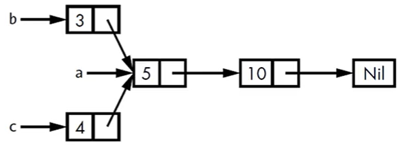

# 第三部分

## 目录

- [第一部分](/langs/rust/)
- [第二部分](/langs/rust/02/)
- [第三部分](/langs/rust/03/)
- [第四部分](/langs/rust/04/)

## 智能指针

指针通常被理解为保存内存地址的变量，是很多语言共有的概念。

**Rust 中最常见的指针是引用**，它的特点有：

- 使用 `&` 符号
- <u>借用</u>它指向的值
- 没有其余开销
- 最常见的指针类型


**智能指针**与指针类似，区别是：

1. 智能指针**有额外的元数据和功能**。比如**引用计数**类型，它的基本原理是通过记录所有者的数量将一份数据被多个所有者同时持有，并在没有任何所有者时自动清理数据。
2. 引用（就是指针）只借用数据，而智能指针很多时候都拥有它所指向的数据


智能指针的**例子**，比如 `String`、`Vec<T>`，它们的特点为：

- 拥有一片内存区域，且允许用户对其操作
- 拥有元数据，比如容量
- 提供额外的功能和保障，比如 String 保障数据是合法的 UTF-8 编码


智能指针的**实现**：通常是 struct 类型且实现了 **Deref** 和 **Drop** 两个 trait

- `Deref`：允许智能指针实例像引用一样使用
- `Drop`：用于定义当智能指针实例走出作用域时需要运行的代码（定义收尾工作）


**本章内容**

1、介绍标准库中常见的智能指针

- `Box<T>`：在 heap 上分配值
- `Rc<T>`：启用多重所有权的引用计数类型
- `Ref<T>` 和 `RefMut<T>`，通过 `RefCell<T>` 访问：在运行时强制借用规则的类型

2、内部可变模式：在不可变类型暴漏出可修改其内部值的 API

3、引用循环：它如何泄露内存以及如何防止发生

### Box 智能指针

Box\<T\> 是最简单的智能指针，因为实现了 Deref 和 Drop 两个 trait

特点

- 提供了“间接存储”的功能，允许在运行时动态地分配对象，并且在对象不再需要时自动释放内存
- 没有额外功能
- 没有性能开销

使用场景

- 编译时，某类型的大小无法确定但编译器需要知道它确切的大小。（Box 指针记录的是内存地址，所以占用的空间大小是明确的）
- 在不复制数据的情况下移交数据的所有权。
- 使用某个值时只关心它是否实现了特定 trait，而不关心它的具体类型


简单示例：使用 Box 在 heap 上存储数据

```rust
fn main() {
    let b = Box::new(3);
    println!("b = {}", b);
}
```


**使用 Box 赋能递归类型**

递归类型：包含自身类型字段的类型，比如

```rust
enum ListNode {
    Next(i32, ListNode),
    Nil,
}

struct ListNode {
    val: i32,
    next: Option<Box<ListNode>>,
}
```

问题：Rust 在编译时需要明确每个类型所占用的空间大小，而递归类型无法在编译时确定。

解决方法：使用 Box 来固定递归类型所占用的空间大小

```rust
use crate::ListNode::{Next, Nil};

fn main() {
    let list = Next(1, Box::new(Next(2, Box::new(Next(3, Box::new(Nil))))));
    println!("{:?}", list);
}

#[derive(Debug)]
enum ListNode {
    Next(i32, Box<ListNode>),
    Nil,
}
```

### Deref Trait

实现了 Deref Trait 的类型：

- 支持自定义**解引用运算符**的行为

- 允许开发者像处理常规引用一样来处理智能指针


**解引用**

常规引用也是一种指针

```rust
fn main() {
    let x = 5;
    let y = &x;

    assert_eq!(5, x);
    assert_eq!(5, *y);
}
```

使用 Box\<T\> 替代上边的引用

```rust
fn main() {
    let x = 5;
    let y = Box::new(x);

    assert_eq!(5, x);
    assert_eq!(5, *y);
}
```


**仿照 Box 自定义智能指针**

```rust
fn main() {
    let x = 5;
    let y: MyBox<i32> = MyBox::new(x);

    assert_eq!(5, x);
    assert_eq!(5, *y); // error[E0614]: type `MyBox<{integer}>` cannot be dereferenced
}

struct MyBox<T>(T);//元组结构体
impl<T> MyBox<T> {
    fn new(x: T) -> Self {
        MyBox(x)
    }
}
```

问题：MyBox 类型不能被解引用

解决：为 MyBox 实现 Deref trait。具体地，实现一个 deref 方法，方法借用 self，返回一个指向内部数据的引用

```rust
impl<T> std::ops::Deref for MyBox<T> {
    //指定关联类型
    type Target = T;

    //解引用方法，参数为 &self，返回值为 &T
    fn deref(&self) -> &Self::Target {
        &self.0
    }
}
```

解引用**完整形式**

```rust
use std::ops::Deref;

fn main() {
    let x = 5;
    let y: MyBox<i32> = MyBox::new(x);

    assert_eq!(5, x);
    assert_eq!(5, *y);//为 MyBox 实现 Deref trait 后可以使用解引用符号获取 MyBox 实例内部的值
    assert_eq!(5, *(y.deref())); //编译器最终会将 *y 展开为这种形式
}

//...
```


**可变性**

类似 Deref trait，可为类型实现 `DerefMut` trait 以重载其可变引用的解引用运算符

示例

```rust
use std::ops::{Deref, DerefMut};

struct DerefMutExample<T> {
    value: T
}

impl<T> Deref for DerefMutExample<T> {
    type Target = T;

    fn deref(&self) -> &Self::Target {
        &self.value
    }
}

impl<T> DerefMut for DerefMutExample<T> {
    fn deref_mut(&mut self) -> &mut Self::Target {
        &mut self.value
    }
}

let mut x = DerefMutExample { value: 'a' };
*x = 'b';
assert_eq!('b', x.value);
```


**隐式解引用转换**

隐式解引用转换是 Rust 为函数和方法提供的一种便捷特性。

假设 T 实现了 Deref trait，

- 那么编译器可以自动把 **T 的引用**转化为 **T 经过 Deref 操作后生成的引用**
- 具体地，当把 **T 的引用**传递给函数或方法时，且它的类型和定义的参数类型不匹配，那么编译器会自动进行一系列调用，最终把它转为所需的参数类型（编译器完成，所以在运行时没有额外性能开销）

隐式转换规则：

- 当 `T: Deref<Target=U>`，允许 `&T` 转换为 `&U`
- 当 `T: Deref<Target=U>`，允许 `&mut T` 转换为 `&U`
- 当 `T: DerefMut<Target=U>`，允许 `&mut T` 转换为 `&mut U`


示例

```rust
fn hi(name: &String) {
    println!("Hi, {}!", name);
}

fn hello(name: &str) {
    println!("Hello, {}!", name);
}

fn ni_hao(name: &str) {
    println!("你好, {}！", name);
}

fn main() {
    let b = MyBox::new(String::from("eugene"));
    // 转换一：&MyBox -> &String
    hi(&b);
    // 转换二：&String -> &str
    hello(&String::from("guo"));
    // 转换一 + 转换二
    ni_hao(&b);
}

struct MyBox<T>(T);

impl<T> MyBox<T> {
    fn new(x: T) -> Self {
        MyBox(x)
    }
}

impl<T> std::ops::Deref for MyBox<T> {
    //指定关联类型
    type Target = T;

    //解引用方法，参数为 &self，返回值为 &T
    fn deref(&self) -> &Self::Target {
        &self.0
    }
}
```

参考 `string.rs` 源码

```rust
impl ops::Deref for String {
    type Target = str;
    // &String -> &str
    fn deref(&self) -> &str {
        unsafe { str::from_utf8_unchecked(&self.vec) }
    }
}

impl ops::DerefMut for String {
    // &mut String -> &mut str
    fn deref_mut(&mut self) -> &mut str {
        unsafe { str::from_utf8_unchecked_mut(&mut *self.vec) }
    }
}
```


### Drop trait

Drop trait 允许开发者自定义实例离开作用域时发生的动作，常见的动作为资源释放。

做法：实现 Drop trait 只需实现一个 drop 方法，方法参数是 self 的可变引用

示例

```rust
struct MySmartPointer {
    value: String,
}

// Drop trait 在 prelude 中，无需手动导入就可以直接使用
impl Drop for MySmartPointer {
    fn drop(&mut self) {
        println!("Dropping MySmartPointer instance, value is {:?}", self.value);
    }
}

fn main() {
    let _i1 = MySmartPointer { value: "jacy".to_string(), };
    let _i2 = MySmartPointer { value: "totis".to_string(), };
    println!("Creating Finished.")
}
/* Output:
Creating Finished.
Dropping MySmartPointer instance, value is "totis"
Dropping MySmartPointer instance, value is "jacy"
*/
```

注意：drop 的顺序与实例的声明顺序相反


**使用 std::mem::drop 提前 drop**

Rust 不允许手动调用 Drop trait 的 drop 方法，但可以调用标准库中 `std::mem::drop` 函数来提前 drop 值

```rust
fn main() {
    let i1 = MySmartPointer {
        value: "jacy".to_string(),
    };
    std::mem::drop(i1);//手动 drop
    
    let _i2 = MySmartPointer {
        value: "totis".to_string(),
    };
    println!("Creating Finished.")
}
/* Output:
Dropping MySmartPointer instance, value is "jacy"
Creating Finished.
Dropping MySmartPointer instance, value is "totis"
*/
```

### Rc 智能指针

对于给定的值，开发者可以轻松判断哪个变量拥有它。但在某些场景下，单个值可能被多个所有者所持有，这被称为**多重所有权**。

为了支持多重所有权，Rust 提供了**引用计数智能指针**类型 `Rc<T>`（Reference count），它会在实例内部维护一个用于记录值的引用次数的计数器，从而判断这个值是否仍然在使用。如果值的引用次数为 0，说明这个值可以被安全清理掉。

Rc 只能用于单线程场景。

补充：

- Rc 不在 prelude 中，所以需要手动导入
- `Rc::clone(&a)` 函数：用于增加 a 的引用计数（区别于实例的 clone 方法，它被用来深度拷贝）
- `Rc::strong_count(&a)` 函数：用于获取 a 的（强）引用计数值。`Rc::weak_count` 函数用于获得弱引用计数值


**示例：如下图，b 和 c 两个 List 共享 a 这个 List 的所有权**



尝试使用 Box 智能指针。结果遇到所有权错误

```rust
#[derive(Debug)]
enum ListNode {
    Next(i32, Box<ListNode>),
    Nil,
}

use crate::ListNode::{Next, Nil};

fn main() {
    let a = Next(1, Box::new(Next(2, Box::new(Next(3, Box::new(Nil))))));

    let b = Next(1, Box::new(a));
    let c = Next(1, Box::new(a));//错误，单个值的所有权问题
}
```

尝试使用 Rc 智能指针

```rust
#[derive(Debug)]
enum ListNode {
    Node(i32, Rc<ListNode>),
    Nil,
}

use crate::ListNode::{Nil, Node};
use std::rc::Rc;

fn main() {
    let a: Rc<ListNode> = Rc::new(Node(5, Rc::new(Node(10, Rc::new(Nil))))));
    println!("a' ref count is {}", Rc::strong_count(&a)); //1

    let _b: ListNode = Node(3, Rc::clone(&a));
    println!("a' ref count is {}", Rc::strong_count(&a)); //2

    {
        let _c: ListNode = Node(4, Rc::clone(&a));//添加引用计数，所有者是 _c
        println!("a' ref count is {}", Rc::strong_count(&a)); //3
        //Rc 实例在离开所有者的作用域时引用计数减少
    }

    println!("a' ref count is {}", Rc::strong_count(&a)); //2
}
```


注意：Rc 实例是不可变引用，可以让程序的不同部分之间共享只读数据

### RefCell 智能指针

**内部可变性**

- 是 Rust 的设计模式之一
- 允许开发者在只持有不可变引用的前提下对数据进行修改（使用 unsafe 代码绕过 Rust 正常的可变性和借用规则）


**借用规则**回顾：

- 在任何给定时间内，要么只能拥有一个可变引用，要么只能拥有任意数量的不可变引用
- 引用总是有效的

```rust
fn main() {
    let mut m = String::from("myii");
    let s1 = &mut m;
    let s2 = &mut m; //cannot borrow `m` as mutable more than once at a time
    do_it(s1, s2);

    let mut g = String::from("ggo");
    let g1 = &mut g;
    let g2 = &g; //cannot borrow `g` as immutable because it is also borrowed as mutable
    work_on_it(g1, g2);
}

fn do_it(_s1: &mut String, _s2: &mut String) {}
fn work_on_it(_s1: &mut String, _s2: &String) {}
```


**Rc vs RefCell**

- Rc 实例支持多重所有权；而 RefCell 实例持有其中数据的唯一所有权
- 二者都只能用于单线程的场景


**Box vs RefCell**

- Box 在**编译阶段**检查代码是否遵守了借用规则，不满足时出现编译错误
- RefCell 在**运行阶段**检查借用规则，不满足时会触发 panic


在编译阶段或运行阶段检查借用规则的优劣是什么？

- 编译阶段：1可以尽早暴露问题，2没有任何运行时开销，3对大多数场景来说是最佳选择，是 Rust 的默认行为
- 运行阶段：1问题暴露延后甚至到生产环境，2因借用计数产生些许性能损失，3实现某些特定的内存安全场景（即内部可变性）


**Box、Rc 和 RefCell 三者对比**

| \\           | 所有者 | 可变性和借用检查               |
| ------------ | ------ | ------------------------------ |
| `Box<T>`     | 一个   | 可变、不可变借用（编译期检查） |
| `Rc<T>`      | 多个   | 不可变借用（编译期检查）       |
| `RefCell<T>` | 一个   | 可变、不可变借用（运行期检查） |


RefCell 是实现内部可变性（可变的借用一个不可变的值）的一种方法，它没有完全绕开借用规则，因为虽然它使用内部可变性通过了编译阶段的借用检查，但借用检查的工作仅仅是延后到运行阶段而已。

示例：一个值对外部是不可变的，但能在其某个方法内修改自身的值，除了这个方法其余代码都不能修改这个值

```rust
use std::cell::RefCell;

pub trait Messager {
    fn send(&self, msg: &str);
}

struct MockMessager {
    sent_messages: RefCell<Vec<String>>,
}

impl MockMessager {
    fn new() -> Self {
        MockMessager {
            sent_messages: RefCell::new(vec![]),
        }
    }
}

impl Messager for MockMessager {
    fn send(&self, msg: &str) {
        //self.sent_messages.borrow_mut(): 获取内部值的可变引用
        self.sent_messages.borrow_mut().push(String::from(msg));
    }
}

fn main() {
    let mm = MockMessager::new();
    mm.send("ok");
    mm.send("network error: gQiKeO");
    
    //mm.sent_messages.borrow(): 获取内部值的不可变引用
    assert_eq!(2, mm.sent_messages.borrow().len());
    
    //mm.sent_messages.borrow_mut(): 获取内部值的可变引用
    mm.sent_messages.borrow_mut().push(String::from("what?"));
    assert_eq!(3, mm.sent_messages.borrow().len());
}
```


RefCell 实例的两个重要方法：

- `borrow()`：返回智能指针 `Ref<T>`
- `borrow_mut()`：返回智能指针 `RefMut<T>`


RefCell 会记录当前存在多少个活跃的 Ref 和 RefMut 智能指针：

- 每次调用 borrow 方法时，不可变借用计数会加一；当一个 Ref 实例离开作用域或被释放时，不可变借用计数减一
- 每次调用 borrow_mut 方法时，可变借用计数会加一；当一个 RefMut 实例离开作用域或被释放时，可变借用计数减一


Rust 会根据 RefCell 中统计的借用计数来进行**运行时的借用检查**，即给定时间内只允许拥有多个不可变借用和一个可变借用，否则 panic，比如

```rust
//...

fn main() {
    let mm = MockMessager::new();
    mm.send("ok");
    mm.send("network error: gQiKeO");
    
    do_it(mm.sent_messages.borrow_mut(), mm.sent_messages.borrow_mut());
}
fn do_it(_x1: RefMut<Vec<String>>, _x2: RefMut<Vec<String>>) {}

//结果：执行 cargo build 不报错；执行 cargo run 时 panic：already borrowed: BorrowMutError
```


**结合 Rc 使用，从而实现一个拥有多重所有权的可变数据**

将 RefCell 和 Rc 结合使用是一种很常见的做法，Rc 允许多个所有者持有同一个数据的不可变引用，如果在 Rc 中存储了 RefCell，那么就可以定义出拥有多个所有者而且能够进行修改的值。

示例

```rust
#[derive(Debug)]
enum List {
    Node(Rc<RefCell<i32>>, Rc<List>),
    Nil,
}

use crate::List::{Nil, Node};
use std::{cell::RefCell, rc::Rc};

fn main() {
    // l2 10 --
    //         \
    //      l1  5 -> nil
    //         |
    // l3 20 --
    let value = Rc::new(RefCell::new(5));
    let l1 = Rc::new(Node(Rc::clone(&value), Rc::new(Nil)));

    //*value         将 Rc<RefCell<T>> 解引用到 RefCell<T>
    //borrow_mut()   获取可变引用
    *value.borrow_mut() += 3;

    let l2 = Node(Rc::new(RefCell::new(10)), Rc::clone(&l1));
    let l3 = Node(Rc::new(RefCell::new(20)), Rc::clone(&l1));

    println!("{:?}", l1);
    println!("{:?}", l2);
    println!("{:?}", l3);
}
```


补充：其他可以实现内部可变性的类型

- `Cell<T>`：通过复制来访问数据
- `Mutex<T>`：用于实现跨线程情形下的内部可变性模式

### 循环引用问题

Rust 的内存安全机制可以避免绝大多数情况下因开发者疏忽导致的内存泄漏问题，但不是 100% 避免。例如在使用 Rc 和 RefCell 就可能创造出循环引用，从而发生内存泄漏。


示例：循环链表

```rust
#[derive(Debug)]
enum List {
    Node(i32, RefCell<Rc<List>>),
    Nil,
}

use crate::List::{Nil, Node};
use std::{cell::RefCell, rc::Rc};

impl List {
    fn next(&self) -> Option<&RefCell<Rc<List>>> {
        match self {
            Node(_, item) => Some(item),
            Nil => None,
        }
    }
}

fn main() {
    let a = Rc::new(Node(5, RefCell::new(Rc::new(Nil))));
    println!(
        "1. ref count: a is {}, \n\ta.next is {:?}",
        Rc::strong_count(&a),
        a.next()
    );

    // a: 5 -> nil
    // b: 10 -> a
    let b = Rc::new(Node(10, RefCell::new(Rc::clone(&a))));
    println!(
        "2. ref count: a is {}, b is {}, \n\ta.next is {:?}, \n\tb.next is {:?}",
        Rc::strong_count(&a),
        Rc::strong_count(&b),
        a.next(),
        b.next()
    );

    // a: 5 -> b
    if let Some(link) = a.next() {
        *link.borrow_mut() = Rc::clone(&b);
    }
    println!(
        "3. ref count: a is {}, b is {}",
        Rc::strong_count(&a),
        Rc::strong_count(&b),
    );

    //infinite loop
    // println!("{:?}", a.next());
    // println!("{:?}", b.next());
}
/*
1. ref count: a is 1, 
        a.next is Some(RefCell { value: Nil })
2. ref count: a is 2, b is 1, 
        a.next is Some(RefCell { value: Nil }), 
        b.next is Some(RefCell { value: Node(5, RefCell { value: Nil }) })
3. ref count: a is 2, b is 2
*/
```


防止内存泄漏的方法：

1. 依靠开发者保证
2. 重新组织数据结构：同时使用表达所有权的引用和不表达所有权的引用，只有所有权关系才影响值的清理


**Rc 的 clone 和 downgrade 函数**

- `Rc::clone(&a)` 函数返回类型 `Rc<T>`，会为 a 的 `strong_count` 加一，a 只有在 `strong_count` 为 0 时才会被清理

- `Rc::downgrade(&b)` 函数返回类型为 `Weak<T>`，会为 b 的 `weak_count` 加一（用来追踪存在多少个 `Weak<T>`），`weak_count` 不为 0 不影响 b 的清理


**强引用和弱引用**

- 可以用强引用表达 Rc 实例的所有权关系，弱引用则不行
- 当强引用数量为 0 时，弱引用会自动断开
- 在使用 `Weak<T>` 前需要保证它指向的值仍然存在，方法：获取 Weak 实例 upgrade 方法返回值 `Option<Rc<T>>` 来判断


示例：在一个网状结构中，有两个节点之间相互引用，此时出现了循环引用

```rust
use std::cell::RefCell;
use std::rc::Rc;

#[allow(dead_code)]
#[derive(Debug)]
struct Node {
    value: i32,
    neighbors: RefCell<Vec<Rc<Node>>>,
}

fn main() {
    let one = Rc::new(Node {
        value: 3,
        neighbors: RefCell::new(vec![]),
    });

    // another.neighbors = [ leaf ]
    let another = Rc::new(Node {
        value: 5,
        neighbors: RefCell::new(vec![Rc::clone(&one)]),
    });

    // one.neighbors = [ another ]
    (*one).neighbors.borrow_mut().push(Rc::clone(&another));

    //2,2
    println!(
        "ref count: one is {}, another is {}",
        Rc::strong_count(&one),
        Rc::strong_count(&another)
    );
}
```


改进：假设网状结构是一颗多叉树，且需要**在 Node 类型中记录它的父节点和所有子节点**

**使用 Weak 引用避免循环引用，示例一**

```rust
use std::cell::RefCell;
use std::rc::{Rc, Weak};

#[allow(dead_code)]
#[derive(Debug)]
struct Node {
    value: i32,
    parent: RefCell<Weak<Node>>,
    children: RefCell<Vec<Rc<Node>>>,
}

fn main() {
    let leaf = Rc::new(Node {
        value: 3,
        parent: RefCell::new(Weak::new()),
        children: RefCell::new(vec![]),
    });

    // 打印 leaf.parent（需要先将其转换后 Rc 实例）
    println!("1. leaf's parent:\n{:#?}", leaf.parent.borrow().upgrade());

    let parent = Rc::new(Node {
        value: 5,
        parent: RefCell::new(Weak::new()),
        children: RefCell::new(vec![Rc::clone(&leaf)]),//强引用：parent  ---rc--->  leaf
    });

    // 弱引用：leaf.parent  ---weak--->  parent
    *leaf.parent.borrow_mut() = Rc::downgrade(&parent);
    
    // 再次打印 leaf.parent（需要先将其转换后 Rc 实例）
    println!("2. leaf's parent:\n{:#?}", leaf.parent.borrow().upgrade());
}
/*
1. leaf's parent:
None
2. leaf's parent:
Some(
    Node {
        value: 5,
        parent: RefCell {
            value: (Weak),
        },
        children: RefCell {
            value: [
                Node {
                    value: 3,
                    parent: RefCell {
                        value: (Weak),
                    },
                    children: RefCell {
                        value: [],
                    },
                },
            ],
        },
    },
)
*/
```

**示例二**

```rust
use std::cell::RefCell;
use std::rc::{Rc, Weak};

#[allow(dead_code)]
#[derive(Debug)]
struct Node {
    value: i32,
    parent: RefCell<Weak<Node>>,      //子节点指向父节点的智能指针用 Weak
    children: RefCell<Vec<Rc<Node>>>, //父节点指向子节点的智能指针用 Rc
}

fn main() {
    //创建叶子节点
    let leaf = Rc::new(Node {
        value: 3,
        parent: RefCell::new(Weak::new()),
        children: RefCell::new(vec![]),
    });

    //打印引用计数
    //leaf: 1,0
    print_ref_count(1, &leaf, None);

    {
        //在作用域中创建分支节点
        let branch = Rc::new(Node {
            value: 5,
            parent: RefCell::new(Weak::new()),
            children: RefCell::new(vec![]),
        });

        //leaf: 1,0  branch: 1,0
        print_ref_count(2, &leaf, Some(&branch));

        //⭐ 创建 leaf 的强引用并将其加入到 branch.children 集合；伪代码：branch.children.push( Rc(leaf) )
        (*branch).children.borrow_mut().push(Rc::clone(&leaf));

        //leaf: 2,0  branch: 1,0
        print_ref_count(3, &leaf, Some(&branch));

        //⭐ 创建 branch 的弱引用，并赋值给 leaf.parent；伪代码：leaf.parent = Weak(branch)
        *leaf.parent.borrow_mut() = Rc::downgrade(&branch);

        //leaf: 2,0  branch: 1,1
        print_ref_count(4, &leaf, Some(&branch));

        //循环引用
        // leaf.parent      ---weak--->   branch
        // branch.children  ----rc---->     leaf
    }

    // leaf's parent: None
    println!("\nleaf's parent: {:#?}", leaf.parent.borrow().upgrade());
    //leaf: 1, 0
    print_ref_count(5, &leaf, None);
}

/// 打印两个 Rc 实例的强弱引用计数值
fn print_ref_count(stage: i32, leaf: &Rc<Node>, branch: Option<&Rc<Node>>) {
    println!(
        "\n{}. leaf's ref count: strong {}, weak {}",
        stage,
        Rc::strong_count(leaf),
        Rc::weak_count(leaf),
    );
    if let Some(parent) = branch {
        println!(
            " branch's ref count: strong {}, weak {}",
            Rc::strong_count(parent),
            Rc::weak_count(parent)
        );
    }
}
/*
1. leaf's ref count: strong 1, weak 0

2. leaf's ref count: strong 1, weak 0
 branch's ref count: strong 1, weak 0

3. leaf's ref count: strong 2, weak 0
 branch's ref count: strong 1, weak 0

4. leaf's ref count: strong 2, weak 0
 branch's ref count: strong 1, weak 1

leaf's parent: None

5. leaf's ref count: strong 1, weak 0
*/
```

## 多线程

### 多线程基础

多线程可以提高执行性能，但增加了程序的复杂性。

多线程可能导致的问题：

- 竞争状态，线程以不一致的顺序访问数据或资源
- 死锁，两个或多个线程彼此等待对方使用完所持有的资源，导致无法继续执行
- 只在某些情况下发生的 Bug，很难复现和修复


实现线程的方式：

1. `1:1 模型`：通过调用 OS 的 API 来创建线程，需要较小的运行时
2. `M:N 模型`：语言自己实现的线程（绿色线程），需要更大的运行时

Rust 标准库仅提供 1:1 模型的线程，但一些外部 crate 提供了 M:N 模型的线程


示例

```rust
use std::{thread, time::Duration};

fn main() {
    thread::spawn(|| {
        for i in 0..10 {
            println!("in spawned thread, i is {}", i);
            thread::sleep(Duration::from_millis(1));
        }
    });

    for i in 0..5 {
        println!("in    main thread, i is {}", i);
        thread::sleep(Duration::from_millis(1));
    }
}
```

问题：子线程还没执行完毕就结束了

解决：通过 **join handle** 来等待所有线程执行完成。

具体的，`thread::spawn` 函数返回类型为 `JoinHandle`，可以调用 JoinHandle 实例的 join 方法等待对应的线程执行完成

```rust
use std::{thread, time::Duration};

fn main() {
    let join_handle = thread::spawn(|| {
        for i in 0..10 {
            println!("in spawned thread, i is {}", i);
            thread::sleep(Duration::from_millis(1));
        }
    });

    for i in 0..5 {
        println!("in    main thread, i is {}", i);
        thread::sleep(Duration::from_millis(1));
    }

    //调用 join 方法等待子线程执行完成
    join_handle.join().unwrap();
}
```


**使用 move 关键字，将值的所有权从一个线程转移到另一个线程**

语法：`move || { ... }`

含义：表示将在闭包体中使用的外部作用域中的值的所有权移动到闭包中

示例

```rust
use std::thread;

fn main() {
    let nums = vec![1, 2, 3];
    
    let jh = thread::spawn(move || {
        println!("nums: {:?}", nums);
    });

    // println!("{:?}", nums); //borrow of moved value: `nums`

    jh.join().unwrap();
}
```

### 消息传递

消息传递：线程之间通过发送消息（数据）进行通信

Rust 标准库提供了 Channel 来支持消息传递


Channel 简单介绍

- 包含发送端和接收端
- 调用发送端方法发送数据；接收端可以检查或接收到达的消息
- 如果发送端或接收端其中之一被丢弃了，那么 channel 实例就关闭了


使用 `mpsc::channel` 函数创建 Channel，返回一个元组，其中包含两个元素分别表示发送端和接收端

> mpsc 表示 multiple producer, single consumer

示例

```rust
use std::{sync::mpsc, thread::spawn};

fn main() {
    let (sender, receiver) = mpsc::channel();

    spawn(move || {
        //发送数据
        sender.send("hi").unwrap();
    });

    //阻塞接收消息
    match receiver.recv() {
        Ok(data) => {
            println!("recv: {}", data);
        }
        Err(err) => {
            println!("err: {}", err);
        }
    }
}
```


简单说明几个 api

- `s.send(data)` 发送数据，返回一个 Result，表示发送状态
- `r.recv()` 阻塞接收，返回一个 Result
- `r.try_recv()` 非阻塞接收，立即返回一个 Result


**channel 和所有权转移**

send 一个值时会发生所有权转移，示例

```rust
use std::{sync::mpsc, thread::spawn};

fn main() {
    let (sender, receiver) = mpsc::channel();

    spawn(move || {
        let data = String::from("hi");
        sender.send(data).unwrap();//所有权转移
        println!("data: {}", data);//错误
    });

    let res = receiver.recv().unwrap();
    println!("recv: {}", res);
}
```


**发送多个值**

```rust
use std::{
    sync::mpsc,
    thread::{self, spawn},
    time::Duration,
};

fn main() {
    let (sender, receiver) = mpsc::channel();

    spawn(move || {
        let msgs = vec![
            String::from("hi"),
            String::from("how are you"),
            String::from("fine"),
            String::from("you have a fast internet today"),
        ];
        for msg in msgs {
            sender.send(msg).unwrap();
            thread::sleep(Duration::from_millis(1000));
        }
        //发送完所有数据后，子线程退出，sender 实例销毁，通道也会销毁
    });

    //通过 for in 读取接收端；通道销毁时循环结束
    for msg in receiver {
        println!("Got: {:?}", msg);
    }

    println!("over!");
}
```


**克隆发送端**

示例：创建管道后克隆发送端，并使用多个发送端同时向管道发送数据

```rust
use std::{
    sync::mpsc,
    thread::{self, spawn},
    time::Duration,
};

fn main() {
    let (sender, receiver) = mpsc::channel();
    //克隆发送端
    let sender2 = mpsc::Sender::clone(&sender);

    spawn(move || {
        let msgs = vec![
            String::from("hi"),
            String::from("how are you"),
            String::from("fine"),
        ];
        for msg in msgs {
            sender.send(msg + ", from sender.").unwrap();
            thread::sleep(Duration::from_millis(1));
        }
    });

    spawn(move || {
        let msgs = vec![String::from("hi")];
        for msg in msgs {
            sender2.send(msg + ", from sender2.").unwrap();
            thread::sleep(Duration::from_millis(1));
        }
    });

    for msg in receiver {
        println!("Got: {:?}", msg);
    }

    println!("over!");
}
```

### 共享状态

Rust 支持通过共享内存实现并发。

上一节中介绍的 channel 类似单所有权，即一旦将值的所有权转移到 Channel 中就无法使用了

而共享内存类似多所有权，即多个线程可以同时访问同一块内存


**使用 Mutex，每次只允许一个线程访问数据**

Mutex 是 mutual exclusion（互斥锁）的简写，特点是在同一时刻只允许一个线程访问某些数据

具体的，mutex 中包含 lock 数据结构，它记录了哪个线程对数据拥有独占访问权。对于线程来说，要想访问数据必须先获取 lock。


Mutex 两条规则：

1. 在使用数据之前，必须尝试获取锁（lock）
2. 使用完 mutex 所保护的数据后需要对数据进行解锁，以便其它线程可以获取锁


Mutex API 介绍

- 通过 `Mutex::new(data)` 创建 mutex，是一个智能指针
- 访问数据前，需要通过 `lock` 方法获取锁：
  - 会阻塞当前线程
  - 执行成功后返回 MutextGuard（智能指针）
  - 可能会失败


示例：Mutex 简单使用

```rust
use std::sync::Mutex;

fn main() {
    let m = Mutex::new(5);
    {
        let mut num: std::sync::MutexGuard<'_, i32> = m.lock().unwrap();
        //num 是一个可变的智能指针，所有可以通过解引用符修改其中的数据
        *num = 6;
        //退出语句块时，锁会自动释放
    }
    println!("m = {:?}", m);
}
```


**示例：多个线程共享 Mutex 实例**

无法直接将一个 Mutex 实例移动到多个线程中，所以尝试使用 Rc 实现（思路是把 Rc 实例的克隆传递到多个线程中）

```rust
use std::{rc::Rc, sync::Mutex, thread};

fn main() {
    let counter = Rc::new(Mutex::new(0));
    *(counter.lock().unwrap()) += 0;

    let mut handles = vec![];

    for i in 0..10 {
        //克隆 Rc 实例
        let m = Rc::clone(&counter);
        //Rc 实例只能用于单线程
        //error[E0277]: `Rc<Mutex<i32>>` cannot be sent between threads safely
        let jh = thread::spawn(move || {
            let mut counter: std::sync::MutexGuard<'_, i32> = m.lock().unwrap();
            *counter += 1;
        });
        handles.push(jh);
    }

    for handle in handles {
        handle.join().unwrap();
    }

    assert_eq!(10, *counter.lock().unwrap());
}
```

结果：编译错误，因为 Rc 实例无法在多线程之间安全传递

解决：**使用 Arc 进行原子引用计数**

- Arc 表示 atomic Rc，可用于并发环境
- Arc 和 Rc 两者的 API 是相同的

示例：

```rust
use std::{
    sync::{Arc, Mutex},
    thread,
};

fn main() {
    let counter = Arc::new(Mutex::new(0));
    *(counter.lock().unwrap()) += 0;

    let mut handles = vec![];

    for _i in 0..10 {
        let m = Arc::clone(&counter);
        let jh = thread::spawn(move || {
            let mut counter: std::sync::MutexGuard<'_, i32> = m.lock().unwrap();
            *counter += 1;
        });
        handles.push(jh);
    }

    for handle in handles {
        handle.join().unwrap();
    }

    assert_eq!(10, *counter.lock().unwrap());
}
```


总结：

- `Mutex<T>` 提供了内部可变性，功能和 `RefCell<T>` 一样

- `Mutex<T>` 有死锁风险

- 单线程下使用 `Rc<RefCell<T>>` 类型、多线程下用 `Arc<Mutex<T>>` 类型

### Sync 和 Send

`std::marker::Sync` 和 `std::marker::Send` 是两个标签 trait，其中不包含任何内容


**Send**：允许线程间转移所有权

- 实现了 Send trait 的类型可在线程间转移所有权
- Rust 中几乎所有类型都实现了 Send trait，但 `Rc<T>` 没有实现 Send 故只能用于单线程情景
- 任何完全由 Send 类型组成的类型也被标记为 Send 类型
- 除了原始指针之外，几乎所有的基础类型都是 Send 类型


**Sync**：允许多线程访问

- 实现 Sync 的类型可以安全地被多个线程引用
- 基础类型都是 Sync，除了 Rc、RefCell 和 Cell 家族
- 任何完全由 Sync 类型组成的类型也是 Sync


手动实现 Send 和 Sync 很难保证安全

## 面向对象

本章：Rust 语言的面向对象的编程特性

### Rust OOP

**Q：Rust 是 OOP 语言吗？**

在 “设计模式四人帮” 的《设计模式》中给出了面向对象的定义：

- 面向对象的程序由对象组成
- 对象包装了数据和操作这些数据的过程，这些过程通常被称为方法或操作

基于以上定义可确定 Rust 是面向对象的，因为

1. struct、enum 实例中包含数据
2. impl 块为 struct、enum 提供了方法


**Rust 中的封装**

封装：调用对象对外暴露的代码无法直接访问对象内部的实现细节，唯一可以与对象进行交互的方法就是通过他公开的 API

Rust 提供了 pub 关键字，用于指定 enum 、struct 及其字段的可见性（注：enum 一旦是 pub 的，那么其中的变体都是 pub 的）

示例

```rust
//---------------------------------------------------lib.rs
#[allow(dead_code)]
#[derive(Debug)]
pub struct ArtCollection {
    all: Vec<String>,
    owner: String,
}

#[allow(dead_code)]
impl ArtCollection {
    pub fn new() -> Self {
        ArtCollection {
            all: vec![],
            owner: String::new(),
        }
    }
    pub fn all(&self) -> &Vec<String> {
        &self.all
    }
    pub fn all_mut(&mut self) -> &mut Vec<String> {
        &mut self.all
    }
    pub fn add_one(&mut self, col: String) {
        self.all.push(col);
    }
    pub fn owner(&self) -> &String {
        &self.owner
    }
    pub fn set_owner(&mut self, new_owner: String) {
        self.owner = new_owner;
    }
}

//---------------------------------------------------main.rs
use oop_demo::ArtCollection;

fn main() {
    let mut c = ArtCollection::new();
    c.add_one(String::from("kiky"));
    c.set_owner(String::from("jiji"));

    let m = c.all_mut();
    m.push(String::from("tity"));

    println!("owner is {}", c.owner());
    for item in c.all().iter() {
        println!("Got: {}", item);
    }

    println!("col: {:?}", c);
}
```


**Rust 中的继承**

继承：对象可以沿用另一个对象的数据和行为，并且无需重复定义相关代码

Rust 没有提供继承，但也提供了类似继承的特性：

1. 代码复用：可以在 trait 中定义默认方法，实现它的类型如果不重写默认方法，那么就拥有了默认方法


**Rust 中的多态**

多态：允许将子类的对象当作父类的对象使用

Rust 中可以通过泛型和 trait 约束来实现多态（被称为限定参数化多态，bounded parametric）


**补充：一些注意**

- 避免将 struct 或 enum 的实例称为对象，因为它们与 impl 块是分开的
- 实现了 trait 的类型的实例有些类似于其它语言的对象，因为它们某种程度上组合了数据和行为


### OOP 示例

本节：使用 trait 来存储不同类型的值

需求：

1. 创建一个 GUI 工具，它会遍历一个元素（组件，例如按钮、文本框）列表并依次调用元素的 draw 方法进行绘制
2. 面向对象处理逻辑：先定义 Component 父类，其中定义 draw 方法；然后创建 Button、TextField 等类继承 Component 类

示例

```rust
//--------------------------------------------lib.rs
pub trait Draw {
    fn draw(&self);
}

/// Q：为啥不使用泛型 + trait bounds 的写法？
/// A：使用泛型时只能在 components 中存放一种 Draw trait 的实现
///    pub struct Screen<T: Draw> {
///        pub components: Vec<T>,
///    }
pub struct Screen {
    // Draw 是一个 trait，无法通过 <Draw> 使用，而需要用 dyn 修饰：<dyn Draw>，表示实现了 Draw 的类型
    pub components: Vec<Box<dyn Draw>>,
}

impl Screen {
    pub fn run(&self) {
        for comp in self.components.iter() {
            comp.draw();
        }
    }
}

pub struct Button {
    pub label: String,
}
impl Draw for Button {
    fn draw(&self) {
        println!("drawing button, label is {:?}", self.label);
    }
}

pub struct TextFiled {
    pub content: String,
}
impl Draw for TextFiled {
    fn draw(&self) {
        println!("drawing textfield, content is {:?}", self.content);
    }
}

//--------------------------------------------main.rs
fn main() {
    let screen = Screen {
        components: vec![
            Box::new(Button {
                label: String::from("click me"),
            }),
            Box::new(TextFiled {
                content: String::from("I ate salad for breakfast."),
            }),
            // Box::new(String::from("hi")), //the trait bound `String: Draw` is not satisfied
        ],
    };
    screen.run();
}
```


**单态化、静态派发和动态派发**

**单态化**：将 trait 约束作为泛型时，编译器会为**开发者用来替换泛型类型参数的**每一个具体类型生成函数和方法的非泛型实现

通过单态化生成的代码会执行**静态派发**（static dispatch），在编译过程中确定调用的具体方法

当无法在编译过程中确定调用的究竟是哪一种方法时，编译器会产生额外的代码以便在运行时找出希望调用的方法，这被称为**动态派发**（dynamic dispatch），比如上例中的部分代码

```rust
pub struct Screen {
    // <dyn Draw> 表示实现了 Draw 的类型，无法在编译期确定具体类型，会执行动态派发
    pub components: Vec<Box<dyn Draw>>,
}
```

动态派发缺点：

1. 产生运行时开销
2. 组织编译器内联方法代码，使得部分优化操作无法进行


需要动态派发的 trait 需要满足这两个条件：

- 方法的返回类型不是 Self
- 方法中不包含任何泛型类型参数

示例

```rust
pub trait Clone {
    fn coloe(&self) -> Self;
}

pub struct Collection {
    // 报错：the trait `Clone` cannot be made into an object
    pub elements: Vec<Box<dyn Clone>>,
}
```

### 设计模式示例

状态模式：某个数据拥有的一个内部状态，这个状态有数个状态对象表达而成，数据的行为随着内部状态的改变而改变。当业务需求发生变化时，只需要更新状态对象内部的代码以改变其规则，或者增加一些新的状态


状态模式示例：博文发布

```rust
fn main() {
    let mut post = Post::new();

    post.add_text("I ate a salad for lunch today");
    assert_eq!("", post.content());

    post.request_review();
    assert_eq!("", post.content());

    post.approve();
    assert_eq!("I ate a salad for lunch today", post.content());
}

pub struct Post {
    state: Option<Box<dyn State>>,
    content: String,
}
impl Post {
    pub fn new() -> Post {
        Post {
            state: Some(Box::new(Draft {})),
            content: String::new(),
        }
    }
    pub fn add_text(&mut self, text: &str) {
        self.content.push_str(text)
    }
    pub fn content(&self) -> &str {
        self.state.as_ref().unwrap().content(&self)
    }
    pub fn request_review(&mut self) {
        if let Some(s) = self.state.take() {
            self.state = Some(s.request_review())
        }
    }
    pub fn approve(&mut self) {
        if let Some(s) = self.state.take() {
            self.state = Some(s.approve())
        }
    }
}

trait State {
    fn request_review(self: Box<Self>) -> Box<dyn State>;
    fn approve(self: Box<Self>) -> Box<dyn State>;
    fn content<'a>(&self, _post: &'a Post) -> &'a str {
        ""
    }
}

struct Draft {}
impl State for Draft {
    fn request_review(self: Box<Self>) -> Box<dyn State> {
        Box::new(PendingReview {})
    }
    fn approve(self: Box<Self>) -> Box<dyn State> {
        self
    }
}

struct PendingReview {}
impl State for PendingReview {
    fn request_review(self: Box<Self>) -> Box<dyn State> {
        self
    }
    fn approve(self: Box<Self>) -> Box<dyn State> {
        Box::new(Published {})
    }
}

struct Published {}
impl State for Published {
    fn request_review(self: Box<Self>) -> Box<dyn State> {
        self
    }
    fn approve(self: Box<Self>) -> Box<dyn State> {
        self
    }
    fn content<'a>(&self, post: &'a Post) -> &'a str {
        &post.content
    }
}
```

状态模式的取舍权衡之缺点：

- 某些状态之间是相互耦合的
- 需要重复实现一些逻辑代码


改进：将状态和行为编码到 struct 中

```rust
fn main() {
    let mut post = Post::new();

    post.add_text("I ate a salad for lunch today");

    let post = post.request_review();

    let post = post.approve();
    assert_eq!("I ate a salad for lunch today", post.content());
}

struct Post {
    content: String,
}

impl Post {
    pub fn new() -> DraftPost {
        DraftPost {
            content: String::new(),
        }
    }
    pub fn content(&self) -> &str {
        &self.content
    }
}

pub struct DraftPost {
    content: String,
}

impl DraftPost {
    fn add_text(&mut self, text: &str) {
        self.content.push_str(text)
    }
    fn request_review(self) -> PendingReviewPost {
        PendingReviewPost {
            content: self.content,
        }
    }
}

struct PendingReviewPost {
    content: String,
}

impl PendingReviewPost {
    pub fn approve(self) -> Post {
        Post {
            content: self.content,
        }
    }
}
```


总结：面向对象的经典模式并不总是 Rust 编程实践中的最佳选择，因为 Rust 具有所有权等其他面向对象语言没有的特性

## 模式匹配

### 模式

模式是 Rust 中的一种特殊语法，用于**匹配**复杂和简单类型的**结构**。

作用：可以更好地控制程序的控制流

模式由以下元素或它们的组合组成：

- 字面值
- 结构的数组、enum、struct 和 tuple
- 变量
- 通配符
- 占位符

模式的使用：需要将其与某个值比较，如果匹配上了那么就可以在代码中使用这个值的相应部分


**常见的使用模式的场景**

**1、match 语句**

```
match VALUE {
	PATTERN1 => EXPRESSION1,
	PATTERN2 => EXPRESSION2,
	PATTERN3 => EXPRESSION3,
}
```

match 表达式要求：在其中列举所有可能性；

一个特殊的模式是 `_`：

- 表示匹配没有列举出的可能或用于忽略某些值
- 不会绑定到变量
- 通常用在 match 语句的最后一个分支

**2、if let 表达式**

if let 表达式主要作为一种简短的方式来等价只有一个匹配项的 match 语句

if let 可以拥有同级别的 else if、else if let 和 else 分支

if let 通常不穷举所有可能

示例

```rust
fn main() {
    let o = Some(4);
    let p = Some(4);
    let num = 6;

    if let Some(i) = o {
        println!("{}", i);
    } else if num > 5 {
        println!("num: {}", num);
    } else if let Some(j) = p {
        println!("{}", j);
    } else {
        println!("else");
    }
}
```

**3、while let**

和 if let 语句相似；

while let 语句：只要模式继续满足匹配条件，那它允许 while 循环一直运行

```rust
fn main() {
    let mut nums = vec![1, 2, 3];

    while let Some(num) = nums.pop() {
        println!("Got: {}", num);
    }
}
```

**4、for 循环**

for 循环是 Rust 中最常见的循环

for 循环中，模式就是紧随 for 关键字后的值

示例

```rust
fn main() {
    let v = vec!['a', 'b', 'c'];

    for (idx, ch) in v.iter().enumerate() {
        println!("arr[{}]={}", idx, ch);
    }
}
```

**5、let 语句**

let 语句也是模式

```
let PATTERN = EXPRESSION;
```

示例

```rust
fn main() {
    let num = 5;

    let (x, y, z) = (1, 2, 3);
}
```

**6、函数参数**

```rust
//函数参数也可以是模式匹配：一
fn foo(_x: i32) {}

//函数参数也可以是模式匹配：二
fn print_coordinates(&(x, y): &(i32, i32)) {
    println!("({}, {})", x, y);
}

fn main() {
    foo(5);

    let point = (3, 5);
    print_coordinates(&point);
}
```


**介绍模式的两种形式（概念）**

- 无可辨驳的：能匹配任何可能传递的值的模式，例如 let 语句 `let x = 5;`

- 可辨驳的：对于某些可能的值无法进行匹配的模式，例如 if let 语句 `if let Some(x) = None {}`

let 语句、函数参数、for 循环只接受无可辩驳的模式；

if let、while let 同时可以接受可辨驳和无可辩驳的模式

### 模式语法

**一、匹配字面值**

模式可以直接匹配字面值

```rust
fn main() {
    let x = 3;

    match x {
        1 => println!("one"),
        2 => println!("two"),
        3 => println!("three"),
        _ => println!("other"),
    }
}
```


**2、匹配命名变量**

命名变量可以匹配任何值的无可辩驳模式

```rust
fn main() {
    let x = Some(5);
    let y = 10;

    match x {
        Some(50) => println!("Got 50!"),
        // Got 5!，y 是命名变量，可以匹配任何值，与作用域中的 y 没有关系
        Some(y) => println!("Got {:?}!", y),
        _ => println!("Met default case, x is {:?}", x),
    }

    println!("x = {:?}, y = {:?}", x, y); // x=Some(5), y=10
}
```


**三、多重模式**

在 match 表达式中，可以用 `|` 语法匹配多中模式

```rust
fn main() {
    let x = 3;

    match x {
        1 | 2 => println!("one or two"),
        3 => println!("three"),
        _ => println!("other"),
    }
}
```


**四、使用 ..= 来匹配某个范围的值**

```rust
fn main() {
    let x: u8 = 33;

    match x {
        0..=10 => println!("failed"),
        _ => println!("passed"),
    }

    let ch = 'c';
    match ch {
        'a'..='j' => println!("early letter"),
        'k'..='z' => println!("late letter"),
        _ => println!("other char"),
    }
}
```


**五、解构**

可以使用模式来解构 struct、enum、tuple，从而引用这些类型值的不同部分

```rust
struct Point {
    x: i32,
    y: i32,
}

fn main() {
    let p = Point { x: 0, y: 8 };

    //省略写法
    let Point { x, y } = p;
    assert_eq!(0, x);
    assert_eq!(8, y);
    
    //为字段起别名
    let Point { x: a, y: b } = p;
    assert_eq!(0, a);
    assert_eq!(8, b);

    match p {
        //y: b 表示为 y 起别名 b
        Point { x: 0, y: b } => println!("(0, {})", b),
        Point { x, y: 0 } => println!("({}, 0)", x),
        Point { x, y } => println!("({}, {})", x, y),
    }
}
```


**六、解构枚举**

```rust
pub enum Message {
    Quit,
    Move { x: i32, y: i32 },
    Write(String),
    ChangeColor(i32, i32, i32),
}
fn main() {
    let msg = Message::ChangeColor(0, 160, 255);
    match msg {
        Message::Quit => println!("quit program"),
        Message::Move { x, y } => println!("move to ({},{})", x, y),
        Message::Write(content) => println!("messsage: {}", content),
        Message::ChangeColor(r, g, b) => println!("change color to ({},{},{})", r, g, b),
    }
}
```


**七、解构嵌套的结构体和枚举**

```rust
pub enum Color {
    Rgb(i32, i32, i32),
    Hsv(i32, i32, i32),
}
pub enum Message {
    Quit,
    Move { x: i32, y: i32 },
    Write(String),
    ChangeColor(Color),
}
fn main() {
    let msg = Message::ChangeColor(Color::Hsv(0, 160, 255));

    match msg {
        Message::Quit => println!("quit program"),
        Message::Move { x, y } => println!("move to ({},{})", x, y),
        Message::Write(content) => println!("messsage: {}", content),
        Message::ChangeColor(Color::Rgb(r, g, b)) => {
            println!("change color to rgb({},{},{})", r, g, b)
        }
        Message::ChangeColor(Color::Hsv(h, s, v)) => {
            println!("change color to hsv({},{},{})", h, s, v)
        }
    }
}
```


**八、解构 struct 和 tuple**

```rust
pub struct Point {
    x: i32,
    y: i32,
}
fn main() {
    let ((num1, num2), Point { x, y }) = ((9, 8), Point { x: 6, y: 10 });
    println!("num1:{}", num1);
    println!("num2:{}", num2);
    println!("x:{}", x);
    println!("y:{}", y);
}
```


**九、在模式中忽略值**

在模式中忽略整个值或部分值。

a.使用 `_` 忽略整个值

```rust
fn foo(_: i32, y: i32) {
    println!("y is {}", y);
}
```

b.使用嵌套的 `_` 来忽略值的一部分

```rust
fn main() {
    let mut value = Some(5);
    let new_value = Some(5);

    match (value, new_value) {
        (Some(_), Some(_)) => {
            println!("can overwrite an existing value")
        }
        _ => value = new_value,
    }

    println!("setting is {:?}", value)
}
```

c.忽略命名使用 `_` 开头的变量

```rust
fn main() {
    let x = 12; //编译警告
    let _y = 38;

    let s = Some(String::from("hi"));
    // if let Some(_s) = s { //会移动所有权
    if let Some(_) = s { //不会移动所有权
        println!("hit if let stmt");
    }
    println!("s:{:?}", s); //可以正常使用
}
```

d.使用 `..` 来忽略值的剩余部分

```rust
#[allow(dead_code)]
struct Point {
    x: i32,
    y: i32,
    z: i32,
}
fn main() {
    let point = Point { x: 0, y: 1, z: 2 };
    match point {
        Point { x, .. } => println!("x is {}", x),
    }

    //-------------
    let nums = (2, 4, 6, 8, 10, 12);
    match nums {
        (first, .., last) => {
            println!("first is {}, last is {}", first, last)
        }
    }
}
```


**十、使用 match 守卫提供额外条件**

match 守卫：在 match 的 arm 后添加额外的 if 条件，想要匹配该 arm 也需满足该 if 条件

match 守卫适用于比单独的模式更复杂的场景

```rust
fn main() {
    let num = Some(4);
    match num {
        Some(x) if x < 5 => println!("less than five, actual value is {}", x),
        Some(x) => println!("x is {}", x),
        None => (),
    }

    //---------------------------
    let x = Some(5);
    let y = 15;
    match x {
        Some(50) => println!("Got 50!"),
        Some(n) if n == y => println!("matched, n = {}", n),
        _ => println!("defalut arm, x is {:?}", x),
    }
    println!("finally, x is {:?}, y is {:?}", x, y);

    //---------------------------
    let x = 4;
    let y = false;
    match x {
        4 | 5 | 6 if y => println!("yes"),
        _ => println!("no"),
    }
}
```


**十一、@ 绑定**

`@` 绑定允许开发者创建一个变量，并利用它**在测试某个值与模式匹配的同时**保存该值

```rust
pub enum Message {
    Hello { id: i32 },
    General { content: String },
    Bye,
}
fn main() {
    let msg = Message::Hello { id: 105 };

    match msg {
        //接收内容
        Message::General {
            content: raw_content,
        } => println!("raw message is {:?}", raw_content),
        //指定整数范围
        Message::Hello { id: 0..=100 } => println!("hi, from user whoes id ranges [0, 100]"),
        //指定整数范围 + 使用 @ 接收内容
        Message::Hello {
            id: id_var @ 101..=1000,
        } => println!("hi, from user whoes id is {}", id_var),
        _ => println!("other message"),
    }
}
```


