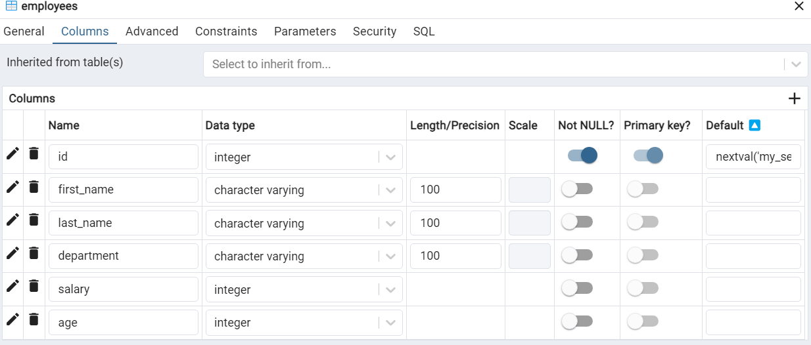

# Rust 入门

Rust 是一种快速的、高并发、安全且具有授权性的编程语言，最初由 Graydon Hoare 于 2006 年创造和发布。现在它是开源语言，主要由 Mozilla 团队和许多开源社区成员共同维护和开发。他的目标是 C 和 C++ 占主导地位的系统编程领域。

<https://www.rust-lang.org/learn>

Rust 优点：

- 惊人速度，可以媲美 C 或 C++ 语言
- 内存安全
- 线程安全
- 优秀的泛型支持
- 模式匹配
- 类型推断
- 等

Rust 可以做什么？

1. 可以编写操作系统、游戏引擎和许多性能关键型应用程序
2. 可以构建高性能 Web 应用程序、网络服务、类型安全的数据库对象关系映射（ORM）库，还可以将程序编译成 WebAssembly 在 Web 浏览器上运行
3. Rust 还在为嵌入式平台构建安全性优先的实时应用程序方面获得了相当大的关注，例如 Arm 基于 Cortex-M 的微控制器，目前该领域主要由 C 语言主导。

## helloworld

安装，验证

```
rustc --version
```

`helloworld.rs`

```rust
// main 函数是程序入口
fn main() {
    // println 是一个宏，需要添加 ! 以调用
    println!("Hello, world!");
}
```

执行编译 `rustc helloworld.rs`，然后会得到一个二进制可执行文件，通过 `./helloworld` 执行

**通过 cargo 创建项目**

```sh
#创建 cargo 项目
cargo new hello
cd hello

#熟悉项目。main.rs 和 Cargo.toml

#构建项目。默认以 debug 模式构建
#也可指定 --release 参数进行构建，表示编译用于发布的版本，此时编译的可执行文件不包含调试数据
cargo build
./build/debug/hello
```

## 变量与常量

变量的命名规范：

- 可以是字母、数字或下划线
- 必须以字母或下划线开头。不能以数字开头
- 变量名区分大小写


Rust 有变量和常量之分，其中变量可以进一步分为**可变变量和不可变变量**。默认情况下，变量是不可变的。

```rust
fn define_vars() {
    let _c = 1;
    println!("_c = {}", _c);

    // 允许非 snake case 命名的变量名
    #[allow(non_snake_case)]
    let nAmE = "guo";
    println!("Hello, {}!", nAmE);

    // 声明的变量默认是不可变的
    let times = 3;
    // times += 1; // error[E0384]: cannot assign twice to immutable variable `times`
    println!("times = {}", times);

    // 声明可变变量
    let mut num = 1;
    println!("num = {}", num);
    num += 1;
    println!("num = {}", num);
}
```


**常量与不可变变量的差异**

1. 常量不仅是不可变的，并且他们始终是不可变的
2. 常量可以在全局声明
3. 常量只能设置为常量表达式

总结：常量是一个符号，在编译期间被替换为具体的值；变量在运行期计算

```rust
// const 大写常量名 : 类型 = 常量值
const COUNT: i32 = 100;

fn main() {
    println!("{}", COUNT);
}
```


**变量可以被覆盖，常量不可以**

```rust
let name = "guo";
//1.变量覆盖
let name = "mary";
println!("name is {}", name);

let mut age = 18;
//2.变量覆盖并且改变类型
let mut age = "20";
println!("age = {}", age);

//------------------------------------------

const DISCOUNT: f64 = 0.9;
// 常量无法被隐藏。
// const DISCOUNT: f64 = 0.9;
println!("DISCOUNT = {}", DISCOUNT);
```

**变量的作用域**

```rust
let mall = "宝龙城";
{
    //可以在内部作用域使用外部的变量
    println!("mall:{}", mall);
    let sales = 123;
}
// 无法在外部作用域使用内部的变量
// println!("sales:{}", sales);
```

**无法使用未初始化的变量**

```rust
let balance;
//无法使用未初始化的变量
// println!("balance:{}", balance);
balance=1000;
println!("balance:{}", balance);
```

**复合类型变量被借用时不可被赋值**

```rust
let mut ele1 = Box::new(101);
let ele2 = &ele1;
// ele1 被借用时不能赋值
// ele1 = Box::new(100);
println!("{}", ele1);
println!("{}", ele2);
```


## 基础数据类型

四种标量类型：

- **整数**。默认是 i32
  - 无符号整数：u8, u16, u32, u64, usize
  - 有符号整数：i8, i16, i32, i64, isize（usize 和 isize 取决于电脑是多少位的，如果是 64 位，那么 usize 和 isize 为 64 位的；32 位的同理）
- **浮点**。f32、f64。默认是 f64
- **布尔**
- **字符**。是 unicode 码，大小为 4B，由单引号来包括

示例

```rust
fn main() {
    let str_no_type = "hello";
    let str_with_type: &str = "world";

    println!(
        "str_no_type: {}, str_with_type: {}",
        str_no_type, str_with_type
    );

    // ---------------------------------

    // 默认整数为 i32 类型
    let count = 5;
    //打印 count 变量的类型
    println!("count type: {}", std::any::type_name_of_val(&count));

    // ---------------------------------

    let score = 5.0;
    let avg: f32 = 5.12345;

    println!("score: {}, avg: {}", score, avg);

    // ---------------------------------

    let flag = true;
    let male: bool = true;

    println!("flag: {}, male: {}", flag, male);

    // ---------------------------------

    let ch = 'a';
    let smile = '😄';
    let middle = '中';

    println!("ch: {}, smile: {}, middle: {}", ch, smile, middle);

    // ---------------------------------

    let array = [1, 2, 3, 4, 5];
    let nums: [i32; 5] = [1, 2, 3, 4, 5];

    println!("array: {:?}, nums: {:?}", array, nums);
    println!("array[1]: {}, nums[3]: {}", array[1], nums[3]);
}
```

整型

```rust
fn define_integers() {
    //有符号整数
    let a = 10; // default i32
    let b: i8 = 5; // 1B
    let c: i16 = 10; // 2B
    let d: i32 = 10; // 4B
    let e: i64 = 10; // 8B
    let f: i128 = 10; // 16B
    let g: isize = 10; // 32bit PC -> 4B, 64bit PC -> 8B

    println!(
        "a: {}, b: {}, c: {}, d: {}, e: {}, f: {}, g: {}",
        a, b, c, d, e, f, g
    );

    //无符号整数
    let b1: u8 = 5;
    let c1: u16 = 10;
    let d1: u32 = 10;
    let e1: u64 = 10;
    let f1: u128 = 10;
    let g1: usize = 10;
    println!(
        "b1: {}, c1: {}, d1: {}, e1: {}, f1: {}, g1: {}",
        b1, c1, d1, e1, f1, g1
    );

    // 越界
    // let o: u8 = 256; // error: literal out of range for `u8`
    let o: u8 = 255;
    println!("o: {}", o);

    // 类型不匹配
    // let h: i32 = 3.14; // error: mismatched types
    // println!("h: {}", h);

    /*
    i8: -128 ~ 127
    i16: -32768 ~ 32767
    i32: -2147483648 ~ 2147483647
    i64: -9223372036854775808 ~ 9223372036854775807
    i128: -170141183460469231731687303715884105728 ~ 170141183460469231731687303715884105727
    isize: -9223372036854775808 ~ 9223372036854775807
    */
    println!("i8: {} ~ {}", i8::MIN, i8::MAX);
    println!("i16: {} ~ {}", i16::MIN, i16::MAX);
    println!("i32: {} ~ {}", i32::MIN, i32::MAX);
    println!("i64: {} ~ {}", i64::MIN, i64::MAX);
    println!("i128: {} ~ {}", i128::MIN, i128::MAX);
    println!("isize: {} ~ {}", isize::MIN, isize::MAX);

    /*
    u8: 0 ~ 255
    u16: 0 ~ 65535
    u32: 0 ~ 4294967295
    u64: 0 ~ 18446744073709551615
    u128: 0 ~ 340282366920938463463374607431768211455
    usize: 0 ~ 18446744073709551615
    */
    println!("u8: {} ~ {}", u8::MIN, u8::MAX);
    println!("u16: {} ~ {}", u16::MIN, u16::MAX);
    println!("u32: {} ~ {}", u32::MIN, u32::MAX);
    println!("u64: {} ~ {}", u64::MIN, u64::MAX);
    println!("u128: {} ~ {}", u128::MIN, u128::MAX);
    println!("usize: {} ~ {}", usize::MIN, usize::MAX);
}
```

浮点型

- `f32` 单精度浮点型
- `f64` 双精度浮点型，默认浮点类型

rust 中不能将 `0.0` 赋值给任意一个模型，也不能将 `0` 赋值给任意一个浮点型

```rust
fn define_floats() {
    // 单精度浮点型
    let f1: f32 = 3.14;
    // 双精度浮点型
    let f2: f64 = 3.14;
    // 默认类型为 f64
    let f3 = 3.14;

    println!("f1: {}, f2: {}, f3: {}", f1, f2, f3);

    /*
    f32: -340282350000000000000000000000000000000 ~ 340282350000000000000000000000000000000
    f64: -179769313486231570000000000000000000000000000000000000000000000000000000000000000000000000000000000000000000000000000000000000000000000000000000000000000000000000000000000000000000000000000000000000000000000000000000000000000000000000000000000000000000000000000000000000000000000000000000000000000000000000000 ~ 179769313486231570000000000000000000000000000000000000000000000000000000000000000000000000000000000000000000000000000000000000000000000000000000000000000000000000000000000000000000000000000000000000000000000000000000000000000000000000000000000000000000000000000000000000000000000000000000000000000000000000000
    */
    println!("f32: {} ~ {}", f32::MIN, f32::MAX);
    println!("f64: {} ~ {}", f64::MIN, f64::MAX);
}
```

布尔型和字符型

```rust
fn define_bools() {
    let f = true;
    let t = false;
    if f || t {
        println!("match");
    }
}

fn define_chars() {
    let c1 = 'a';
    let c2 = '中';
    let c3 = '😄';
    println!("c1: {}, c2: {}, c3: {}", c1, c2, c3);
}
```

## 字符串

Rust 提供了两种字符串：

- `&str`：Rust 核心内置的数据类型，字符串字面量，也叫字符串切片
- `String`：Rust 标准库中的一个公开 pub 结构体。使用 UTF-8 作为数据编码格式，长度可变，对象内存在堆中分配

```rust
// &str 字符串切片
let name = "John";
let len = name.len();
println!("length of {} is {}", name, len);

let cs = name.chars();
for c in cs {
    println!("split char:[{}]", c);
}

//---------------------------------------------

/*
String 简单使用
*/

// 1.创建空字符串
let s1 = String::new();
println!("s1:[{}]'s len is {}", s1, s1.len());
// 2.从字面量创建
let s2 = String::from("literal");
println!("s2:[{}]'s len is {}", s2, s2.len());

// 3.末尾追加内容
let mut s3 = String::from("value");
s3.push_str(" of jewel");
s3.push('r');
s3.push('y');
println!("s3:[{}]'s len is {}", s3, s3.len());

// 4.字符串替换
let s4 = String::from("hello");
let res_s4 = s4.replace("ello", "i");
println!("res_s4:[{}]'s len is {}", res_s4, res_s4.len());

// 5. &str -> String
let s5_slice = "hello";
let s5 = s5_slice.to_string();
println!("s5:[{}]'s len is {}", s5, s5.len());

// 6. String -> &str
let s6 = String::from("hello");
let s6_slice = s6.as_str();
println!("s6_slice:[{}]'s len is {}", s6_slice, s6_slice.len());

// 7. trim
let s7 = String::from(" hello ");
let s7_trim = s7.trim();
println!("s7_trim:[{}]'s len is {}", s7_trim, s7_trim.len());

// 8. split
let s8 = String::from("Java,Rust,Go,NodeJS,Python");
println!("s8:[{}]'s len is {}", s8, s8.len());
let col1 = s8.split(',');
for item in col1 {
    println!("split item:{}", item);
}

// 9. String -> char array
let s9 = String::from("Hi~ o(*￣▽￣*)ブ，我是王大锤");
println!("s9:[{}]'s len is {}", s9, s9.len());
let chars = s9.chars();
for ch in chars {
    println!("split char:[{}]", ch);
}

// 10. 拼接
let s10 = String::from("Hello ");
let s11 = String::from("World");
let s12 = s10 + &s11;
println!("s12:[{}]'s len is {}", s12, s12.len());
```

## 类型系统与类型转换

数值数据：

1. **显示类型转换**，比如 `let b = a as u64;`
2. 为数值字面量指定类型，比如 `102u8`、`3.14f32`

示例

```rust
fn main() {
    let a = 25;
    //显示类型转换
    let b = a as u16;
    println!("b:{}", b);

    //为数值字面量指定类型
    let c = 299u64;
    println!("c:{}", c);
}
```

**使用 type 关键为类型起别名，需要采用驼峰命名法**

```rust
fn main() {
    //类型别名
    let i: int = -100;
    let j: unsign_int = 99;
    let k = i + j as int;
    println!("k:{}", k);//-1
}

type int = i32;
type unsign_int = u32;
```


**类型转换**

Rust 使用特质截距类型之间的转换问题，一般会用到 From 和 Into 两个 trait。

From 特质允许一种类型决定“怎么根据另一种类型生成自己”，因此它提供了一种类型转换的简单机制。

在标准库中有很多 From 的实现，规定原生类型及其他常见类型的转换功能。

```rust
fn main() {
    let name = String::from("123");
    println!("name:{}", name);

    //自定义结构体
    //实现 From<T> 特质后，可通过 ::from() 构建对象
    let p1 = Person::from(12);
    println!("{:?}", p1);
    let p2 = Person::from("Mary".to_string());
    println!("{:?}", p2);

    //自定义结构体
    // Into 特质提供 into 函数
    // i.into() -> U 相当于 U::from(i)
    let num = 18;
    let p3: Person = num.into();
    println!("{:?}", p3);

    // 解析字符串到整数
    let num2:i32 = "15".parse().unwrap();
    println!("{}", num2);
}

#[derive(Debug)]
struct Person {
    age: i32,
    name: String
}

// 调用 Person::from(T) 获取 Person 对象
impl From<i32> for Person {
    fn from(value: i32) -> Self {
        Person { age: value, name: String::new()}
    }
}
impl From<String> for Person {
    fn from(value: String) -> Self {
        Person { age: 0, name: value}
    }
}
```


## 运算符

- 算术运算符。`+,-,*,/,%`，注意：不自持 `++,--`
- 位运算符。`&,|,^,!,<<,>>`（与，或，亦或，非，左移，右移）
- 关系运算符。`>,<,==,<=,>=`
- 逻辑运算符。`&&,||,!`

## 流程控制

### if 语句

- `if ...`
- `if ... else ...`
- `if ... else if ... else ...`

示例

```rust
fn main() {
    let number = 7;
    if number < 5 {
        println!("number < 5");
        if number < 3 {
            println!("number < 3");
        }
    } else {
        println!("number >= 5");
    }
}
```

从 **if 表达式** 接收 **返回值**

```rust
let flag = true;
// rust 是静态类型，编译期间决定所有变量的类型
// 无法通过编译
// let number = if flag { 5 } else { "six" };
let number = if flag { 5 } else { 6 };

println!("number = {}", number);
```

### match

匹配。类似 C 中的 switch 语句

```rust
fn match_1(code: i32) -> String {
    /*
    match VAR_EXPR {
        CONSTANT_VAL1 => {},
        CONSTANT_VAL2 => {},
        _ => {}
    }
    */
    let r = match code - 1 {
        1 => {
            println!("1移动");
            return "移动".to_string();
        }
        2 => return "联通".to_string(),
        _ => "电信".to_string(),
    };
    return r;
}
```

引用变量的模式匹配

```rust
let b = &100;
// let ref b = 66;

//引用类型数据模式匹配
match b {
    &v => println!("&v:{}", v)
}

match *b {
    v => println!("v:{}", v)
}
```

```rust
//非引用变量，通过 ref 和 ref mut 仍然可以得到引用
let n2 = 5;
let mut n3 = 7;

match n2 {
    ref v => {
        println!("n2:{}", v);
        println!("*n2:{}", *v);
    }
}

match n3 {
    ref mut v => {
        println!("n3:{}", v);
        println!("*n3:{}", *v);
    }
}
```


### 循环

三种循环

- `loop`
- `while`
- `for`
- 循环中支持的动作：`break, continue`

示例

```rust
let mut i = 0;
loop {
    if i < 3 {
        println!("looping...");
        i += 1;
    } else {
        break;
    }
}

// -----------------------------------

let mut counter = 0;
while counter < 3 {
    println!("counting...");
    counter += 1;
}

// -----------------------------------

let arr = [1, 2, 3, 4, 5];
// iter() 返回迭代器。其他类似的方法：iter_mut(), into_iter(), 
for element in arr.iter() {
    println!("element = {}", element);
}

// [left, right)
for n in 1..5 {
    println!("n = {}", n);
}

// [left, right]
for n in 1..=5 {
    println!("n = {}", n);
}
```

## 函数

返回值

```rust
fn hello() {
    println!("hello");
}

// 默认返回值：无明确返回值时，会返回一个单元类型，即 ()
fn hi() -> () {
    println!("hi");
    return ();
    //return;
}

fn get_name_1() -> String {
    return "return_1".to_string();
}
// 如果没有 return 语句。则使用最后一条语句的执行结果作为返回值
// 并且数据类型要保持一致
fn get_name_2() -> String {
    "return_2".to_string()
}

fn main() {
    hello();
    hi();
    println!("{}", get_name_1());
    println!("{}", get_name_2());
}
```

值传递和引用传递

```rust
//值传递，函数内部和外部各自保存了相同的值，不会相互影响，因此内外结果不一致
fn add(mut a: i32, mut b: i32) -> i32 {
    a += 1;
    b -= 1;
    return a + b;
}
//引用传递，函数内部和外部保存了相同的值，数据一致
fn add_m(a: &mut i32, b: &mut i32) -> i32 {
    *a += 1;
    *b -= 1;
    return *a + *b;
}

fn main() {
    //可变变量的值传递。同理不可变变量也可以进行值传递
    let mut a = 1;
    let mut b = 2;
    a += 1;
    b += 2;
    println!("a + b = {}", add(a, b));
    println!("a = {}, b = {}", a, b);
    
    //引用传递。只能传递可变变量的引用
    let mut c = 10;
    let mut d = 20;
    println!("c = {}, d = {}", c, d);
    println!("c + d = {}", add_m(&mut c, &mut d));
    println!("c = {}, d = {}", c, d);
}
```

**复合类型变量参数传递会出现所有权问题**

相对的，内置类型变量参数传递不会出现所有权问题

```rust
fn main() {
    // 传递内置类型的变量，所有权不会丢失
    let x = 128;
    black_box(x);
    println!("x = {}", x);

    // 传递 String 结构体变量，所有权会转移到函数内
    let s = "hello".to_string();
    black_box_str(s);
    // 无法再次使用 s 了
    // println!("s = {}", s);

    // 注：传递 &str 变量，不会转移所有权。说明 &str 是内置类型
    let s2 = "hello";
    black_box_str2(s2);
    println!("s2 = {}", s2);
}

fn black_box(i: i32) {
    println!("black box...{}", i)
}
fn black_box_str(i: String) {
    println!("black box...{}", i)
}
fn black_box_str2(i: &str) {
    println!("black box...{}", i)
}
```

## tuple 元组

Tuple 元组是一个复合类型，可以存储多个不同类型的数据。

元组使用 `()` 来构造，函数可以使用元组返回多个值，因为元组可以拥有任意多个值。

元组一旦定义，其长度就固定了，不能增加或减少元素。元组下标从 0 开始

```rust
fn main() {
    let t = (128.5, "英语", true);
    println!("{:?}", t);

    // 通过 .下标 访问元素
    println!("{} {} {}", t.0, t.1, t.2);

    // 元组解构
    let (grade, subject, passed) = t;
    println!("{} {} {}", grade, subject, passed);

    // 传递元组变量，没有所有权问题
    print_tuple(t);
    println!("{} {} {}", t.0, t.1, t.2);
}

fn print_tuple(t: (f64, &str, bool)) {
    println!("{:?}", t);
}
```

## 数组

数组用来存储一系列数据，每个数据的类型相同。数组在内存中是连续存储的。

数组由 `[]` 构造，长度在编译器被确定，数组在栈中分配，数组下标从 0 开始。

```rust
fn main() {
    // let 数组名 : [元素类型 ; 长度] = [数据1, 数据2, ...];
    let a0: [f64; 2] = [1.0, 2.0];

    // 自动类型推导
    let a1 = [1, 2, 3];

    println!("a0: {:?}, a1: {:?}", a0, a1);

    // 创建具有默认值的数组，[默认值; 长度]
    let a2: [&str; 3] = [""; 3];
    println!("a2: {:?}", a2);

    for item in a1 {
        println!("item of a1:{}", item);
    }

    // 修改不可变数组，失败
    // a2[0] = "HI";

    let mut a3 = [1, 2, 3];
    println!("a3: {:?}", a3);
    a3[0] = 0;
    println!("a3: {:?}", a3);

    // 值传递
    let a4 = ["python", "java", "rust"];
    print_arr(a4);
    println!("a4: {:?}", a4);

    // 引用传递
    let mut a5 = ["Angular", "React", "Vue"];
    modify_arr(&mut a5);
    println!("a5: {:?}", a5);
}

fn print_arr(mut arr: [&str; 3]) {
    let len = arr.len();
    arr[0] = "C++";
    for i in 0..len {
        println!("arr[{}]: {}", i, arr[i]);
    }
}

fn modify_arr(arr: &mut [&str; 3]) {
    let len = arr.len();
    arr[0] = "Next";
    for i in 0..len {
        println!("arr[{}]: {}", i, arr[i]);
    }
}
```

## 切片

切片是指向**一段连续内存**的指针，这段连续内存可能来自数组、字符串或向量（vector）对象。

可以使用数字索引访问切片的元素，下标从 0 开始。

切片语法

```
let 切片变量名 = &对象[起始位置..结束位置];
```

示例

```rust
fn main() {
    let mut v = Vec::new();
    v.push("Rust");
    v.push("Python");
    v.push("C++");
    v.push("C#");
    println!("v: {:?}", v);

    // [0, 2)
    let s1 = &v[0..2];
    println!("s1: {:?}", s1);

    // [0, 2]
    let s2 = &v[0..=2];
    println!("s1: {:?}", s2);

    // &变量[..] 获取全部元素
    let s3 = &v[..];
    println!("s3: {:?}", s3);

    // [1, len)
    let s4 = &v[1..];
    println!("s4: {:?}", s4);
    // 切片对象 s4 没有所有权转移问题
    print_slice(s4);
    println!("s4: {:?}", s4);

    // 可变切片
    let mut v2 = Vec::new();
    v2.push("Vue");
    v2.push("React");
    v2.push("Next");
    modify_slice(&mut v2[1..]);
    // ["Vue", "Python", "Next"]
    println!("v2: {:?}", v2);
}

fn modify_slice(slice: &mut [&str]) {
    // 修改 slice[0]
    slice[0] = "Python";
    println!("slice: {:?}", slice);
}

fn print_slice(slice: &[&str]) {
    println!("slice: {:?}", slice);
}
```


## 结构体

结构体可以由各种不同类型的变量组成。结构体使用 struct 关键字来创建。struct 是 structure 的缩写。

结构体之间可以嵌套，即一个结构体可以作为另一个结构体的字段。

有三种类型的结构体

1. 元组结构体（也称为具名元组）。`struct Pair(String, i32);`
2. 经典的 C 语言风格结构体。常用。比如 `struct XX { ... }`
3. 单元结构体，不带字段，在泛型中很有用。`struct Unit;`

示例

```rust
//1.创建结构体
struct Point {
    x: i32,
    y: i32,
    label: String,
}

// 创建函数，用于打印 Point 结构体变量
fn printpoint(point: &Point) {
    println!("{} ({},{})", point.label, point.x, point.y);
}

fn change_n_print_point(point: &mut Point) {
    point.label = String::from("JJJ");
    println!("{} ({},{})", point.label, point.x, point.y);
}

// rust 语法糖，让我可以像使用对象一样使用结构体
// impl Point {}: 表示为 Point 结构体定义方法
impl Point {
    fn printpoint(&self) {
        println!("{} ({},{})", self.label, self.x, self.y);
    }

    // 修改结构体对象的 label 属性
    fn changelabel(&mut self, newlabel: String) {
        self.label = newlabel;
    }

    fn getlabel(&self) -> String {
        return self.label.clone();
    }
}

fn main() {
    let mut p = Point {
        x: 281,
        y: -387,
        label: String::from("Jack"),
    };
    println!("{}-({},{})", p.label, p.x, p.y);

    p.x = 100;
    println!("{}-({},{})", p.label, p.x, p.y);

    // ------- 通过借用操作结构体变量---------

    // 将可变结构变量借用给外部函数（外部函数不可修改）
    printpoint(&p);

    // 将可变结构体变量作为可变变量借用给外部函数（外部函数可以修改）
    change_n_print_point(&mut p);

    // ------- 通过方法操作结构体变量---------

    // 调用结构体对象的方法打印结构体
    p.printpoint();

    // 调用结构体对象的方法修改结构体的 label 属性
    let newlabel = String::from("Tom");
    p.changelabel(newlabel);

    // 调用结构体对象的方法读取其中的 label 变量
    let l = p.getlabel();
    println!("label: {}", l);

    p.printpoint();
}
```

元组结构体简单示例

```rust
// 元组结构体
let p = (String::from("Rust"), 100);
println!("{}-{}", p.0, p.1);

// 解构元组结构体
let (study, spend) = p;
println!("{}-{}", study, spend);
```

解构结构体

```rust
fn main() {
    let s = Student {
        name: String::from("guo"),
        age: 18,
        male: true
    };
    println!("student:{:?}", s);

    //全量解构
    let Student {name, age, male} = s;
    println!("name:{}, age:{}, male:{}", name, age, male);

    //部分解构
    let Student {name, ..} = Student {
        name: "AAA".to_string(),
        age: 10,
        male: true
    };
    println!("name:{}", name);

}

#[derive(Debug)]
struct Student {
    name: String,
    age: u8,
    male: bool
}
```


## 枚举

enum 关键字允许创建一个从若干个不同取值中选其一的枚举类型。任何一个在 struct 中合法的取值在 enum 中也合法。

```rust
fn main() {
    let g1 = Gender::MALE;
    println!("{:?}", g1);
}

#[derive(Debug)]
enum Gender {
    MALE,
    FEMALE,
    OHTER,
}
```

结合 match 语句使用

```rust
fn main() {
    println!("{}", get_gender_identity(Gender::MALE));
    println!("{}", get_gender_identity(Gender::FEMALE));
    println!("{}", get_gender_identity(Gender::OHTER));
}
fn get_gender_identity(g: Gender) -> String {
    match g {
        Gender::MALE => "male".to_string(),
        Gender::FEMALE => "female".to_string(),
        Gender::OHTER => "other".to_string(),
        _ => "unknown".to_string(),
    }
}
```

带有数据的枚举类型示例

```rust
fn main() {
    let rd = RoadMap::Name("Rust 入门到精通".to_string());
    match rd {
        RoadMap::Name(name) => {
            println!("{}", name);
        }
    }
}

enum RoadMap {
    Name(String),
}
```


补充： `Option<T>` 枚举，多用在函数返回值上。

```rust
//enum Option<T> {
//    Some(T), // 表示有值
//    None     // 表示无值
//}
fn main() {
    let result = get_discount(10);
    match result {
        Some(v) => println!("{:?}", v),
        None => println!("no discount"),
    }
    
    //std::env::home_dir() 返回 Option<T> 泛型
    match std::env::home_dir() {
        Some(data) => println!("{:?}", data),
        None => println!("None"),
    }
}
fn get_discount(price: i32) -> Option<bool> {
    if price > 100 {
        Some(true)
    } else {
        None
    }
}
```

补充：`Result<T,E>`枚举

```rust
//enum Result<T, E> {
//    Ok(T), //表示成功
//    Err(E),//表示失败
//}
fn main() {
    match std::env::var("LANG") {
        Ok(data) => println!("{:?}", data),
        Err(err) => println!("{:?}", err),
    }

    match std::env::var("NOT_EXIST_VAR_NAME") {
        Ok(data) => println!("{:?}", data),
        Err(err) => println!("{:?}", err),
    }
    
    let r = get_data("r10101".to_string());
    let r2 = get_data("r10011".to_string());
    match r {
        Ok(data) => println!("Ok:{}", data),
        Err(err) => println!("Err:{}", err),
    }
    match r2 {
        Ok(data) => println!("Ok:{}", data),
        Err(err) => println!("Err:{}", err),
    }
}

fn get_data(id: String) -> Result<String, String> {
    if id.starts_with("r1010") {
        return Ok(String::from("yes"));
    } else {
        return Err(String::from("failed"));
    }
}
```

## 集合

**向量 vector**

- 集合中元素的类型类型
- 长度可变，运行时可以增加或减少元素
- 支持随机访问（下标访问）
- 添加时，新元素被添加到尾部
- 元素保存在堆上

```rust
fn vec1() {
    let mut v = Vec::new();
    v.push("Rust");
    v.push("C");
    v.push("Java");
    println!("{:?}", v);
    println!("len:{}", v.len());

    let mut v2 = vec!["Rust", "C++", "Java"];
    println!("{:?}", v2);

    // 移除元素
    let e = v2.remove(0);
    println!("removed one:{}", e);
    println!("v2:{:?}", v2);

    // 是否包含
    let exist = v2.contains(&"Rust");
    println!("exist:{}", exist);

    // 随机访问
    let e0 = v2[0];
    println!("random access v2[0]:{}", e0);

    // 遍历
    for item in v2 {
        println!("item:{}", item);
    }
}
```


**哈希表 hashmap**

- 键值对集合，键唯一，值可以重复

```rust
#[allow(dead_code)]
fn hashmap1() {
    let mut scores: HashMap<&str, i32> = HashMap::new();
    scores.insert("Blue", 10);
    scores.insert("Yellow", 50);
    println!("map:{:?}", scores);

    // 通过键获取
    let val: Option<&i32> = scores.get("Blue");
    match val {
        Some(v) => println!("value:{}", v),
        None => println!("key:Blue not exist"),
    }

    // 遍历
    for (key, value) in scores.iter() {
        println!("key:{}, value:{}", key, value);
    }

    // 判断键是否存在
    let exist = scores.contains_key("Blue");
    if exist {
        println!("key:Blue exist");
    }

    // 通过键删除元素
    let res: Option<i32> = scores.remove("Blue");
    println!("res: {:?}", res);
    println!("map:{:?}", scores);
}
```


**集合 hashset**

- 集合中元素的数据类型相同，且元素不重复

```rust
#[allow(dead_code)]
fn hashset1() {
    let mut hs = HashSet::new();
    hs.insert("Rust");
    hs.insert("C++");
    hs.insert("Python");
    println!("set:{:?}", hs);

    hs.insert("Python");
    println!("set:{:?}", hs);

    // 大小
    println!("len:{}", hs.len());

    // 遍历
    for item in hs.iter() {
        println!("item:{}", item);
    }

    // 获取
    let res = hs.get("Python");
    match res {
        Some(v) => println!("key:{} exist", v),
        None => println!("key:Python not exist"),
    }

    // 判断是否存在
    let exist = hs.contains("Rust");
    if exist {
        println!("key:Rust exist");
    }

    // 删除指定元素
    let result = hs.remove("C++");
    println!("result: {}", result);
    println!("set:{:?}", hs);
}
```


## 泛型

泛型是运行时指定数据类型的一种机制，好处是通过高度的抽象，使用一套代码应用多种数据类型。比如向量类型，可用来保存整型数据，也可以用来保存字符串数据。

泛型可以保证数据安全和类型安全，同时可以减少代码量。

Rust 中的泛型主要包含泛型集合、泛型结构体、泛型函数、泛型枚举和特质。

Rust 中使用 `<T>` 语法来实现泛型，其中 `<T>` 可以是任意数据类型。

**泛型结构体**

```rust
// 泛型结构体
struct Data<T> {
    value: T,
}
fn main() {
    // 使用泛型结构体
    let mut data = Data { value: 1 };
    println!("data.value:{}", data.value);
    data.value = 2;
    println!("data.value:{}", data.value);
}
```

**特质**

```rust
fn main() {
    let mut book = Book {
        name: String::from("Rust"),
        id: 1,
        author: String::from("欢喜"),
    };
    book.show();
    book.id = 2001;
    book.show();
}

struct Book {
    name: String,
    id: u32,
    author: String,
}

// 特质，相当于其它语言中的接口
trait ShowBook {
    fn show(&self);
}

// 实现特质
impl ShowBook for Book {
    fn show(&self) {
        println!(
            "Book: name:{}, id:{}, author:{}",
            self.name, self.id, self.author
        );
    }
}
```

**泛型参数**，函数的参数类型是泛型

```rust
fn main() {
	// 格式为：
    // fn 函数名<T: 特质>(
    //      参数1: T,
    //      ...
    // ) {}
    show2(book);
}

struct Book {
    name: String,
    id: u32,
    author: String,
}

// 为 Book 实现内置的 Display 特质
impl std::fmt::Display for Book {
    fn fmt(&self, f: &mut core::fmt::Formatter<'_>) -> std::fmt::Result {
        print!(
            "Book[name:{}, id:{}, author:{}]",
            self.name, self.id, self.author
        );
        return Result::Ok(());
    }
}

// 定义泛型函数
fn show2<T: std::fmt::Display>(t: T) {
    println!("t:{}", t);
}
```

output

```
show2:Book[name:Rust, id:2001, author:欢喜]
```

另一个示例：两数相加

```rust
fn main() {
    println!("10 + 20 = {}", sum(10, 20));
    println!("10.71 + 20.123 = {}", sum(10.71, 20.123));
}

fn sum<T: std::ops::Add<Output = T>>(a: T, b: T) -> T {
    return a + b;
}
```


## 内存生命周期

rust 使用**半自动内存**管理机制。

- 在 C 中需要手动调用 free 释放内存；（手动内存管理）

- Rust：编译器在编译期间计算变量的使用范围，并在变量不再被使用时的源码中插入 free 语句

## 所有权

内存管理方式

- C 语言，需要使用 malloc 和 free 等 api 手动管理内存，太麻烦，容易造成 bug。
- Go，Java 等使用垃圾收集器 GC 自动管理内存，几乎不能用来编写底层程序（指贴近硬件的软件应用，例如操作系统和硬件驱动）
- Rust：基于生命周期的半自动管理


**所有权：每个堆上对象只能由一个变量引用**

所有权问题只会出现在复合类型对象身上，比如 String；而不会出现在栈上变量身上，比如整形、浮点、数组、元组等。

示例：所有权与作用域

```rust
//在堆中创建了字符串对象，他的所有者是名为 str1 的变量
let str1 = String::from("hello");
println!("{}", str1);

{
    let str2 = String::from("world");
    println!("{}", str1);
    println!("{}", str2);
}
// 无法访问 str2，因为已经离开它的作用域
// println!("{}", str2);
```

所有权的**唯一性**：同一时间某个堆中对象只能被一个变量引用

```rust
let str1 = String::from("hello");
println!("{}", str1);

// 所有权的唯一性
// 赋值时发生了所有权转移：str3 指向了堆中的字符串对象，str1 指向丢失
let str3 = str1;
println!("{}", str3);
// println!("{}", str1);
```

另一个示例

```rust
let a = String::from("hello");
println!("{}", a);
{
    let b = a; //所有权转移
    println!("{}", b);
}
println!("{}", a); //离开作用域，字符串对象 b 销毁；a 变量所有权被转移
```


**所有权移动的场景**：

- 赋值
- 值作为参数传递
- 从函数返回一个值

```rust
fn main() {
    let l1 = vec!["Rust", "Python", "C"];
    let l2 = l1; //所有权转移
    println!("{:?}", l2);
    // l1 的所有权转移给了 l2，所以 l1 无法使用
    // println!("{:?}", l1);

    let l3 = vec!["Rust", "Python", "C"];
    print_vec(l3);
    // l3 的所有权转移给了 print_vec，所以 l3 无法使用
    // println!("{:?}", l3);

    let l4 = vec!["Rust", "Python", "C"];
    let l5 = process_vec(l4);
    // l4 的所有权转移给了 process_vec，所以 l4 无法使用
    // println!("{:?}", l4);
    // process_vec 返回了 l，相当于把所有权转移给了接收变量 l5，所以 l5 可以使用
    println!("{:?}", l5);
}

fn print_vec(l: Vec<&str>) {
    println!("in print_vec:{:?}", l);
}

fn process_vec(mut l: Vec<&str>) -> Vec<&str> {
    l.push("Java");
    println!("in process_vec:{:?}", l);
    return l;
}
```

## 引用和借用

引用是一种指向其他数据的指针类型，它允许您访问数据而不获取其所有权。引用不拥有数据，只是指向数据的内存地址。引用常用于处理借用和共享数据。

不可变引用

```rust
let s = "guo".to_string();
let u = &s;// &s 表示创建引用，默认为不可变引用
let w = &s;//可以多次引用
let v = &&s;//支持多级引用

println!("s==*u? {}", s == *u);//true
println!("s==**v? {}", s == **v);//true
println!("*u==**v? {}", *u == **v);//true
println!("u=*v? {}", u == *v);//true

// u.push_str("!");//不能通过 u 改变字符串，因为 u 是不可变引用
let p = u.split("u");//可以读取
for i in p.into_iter() {
    println!("split:{}", i);
}
```

可变引用

```rust
let mut a = 10;
let b = &mut a;//创建可变引用，a 必须是可变变量
// let c = &mut a;//可变变量不能被多次引用
// println!("a:{}", a);//a已经被引用，不能使用了

*b = 20;
println!("b:{}", b);
```

`ref` 关键字和 `&` 符号功能相同，都是创建引用

```rust
let ref a = 1;//a:&i32
let ref b = a;//b:&&i32
let ref c = b;//c:&&&i32

let d: &&&i32 = &&&1;

println!("c:{}, d:{}", c, d);//1,1
println!("*c:{}, *d:{}", *c, *d);//1,1
println!("**c:{}, **d:{}", **c, **d);//1,1
println!("***c:{}, ***d:{}", ***c, ***d);//1,1
println!("c==d? {}", c == d);//true
println!("*c==*d? {}", *c == *d);//true
println!("**c==**d? {}", **c == **d);//true
println!("***c==***d? {}", ***c == ***d);//true
```


**借用**：将变量的引用作为参数从一个函数传递到另一个函数暂时使用，执行完毕后将所有权返回给当初传递给它的变量。

示例

```rust
fn main() {
    let l1 = vec!["rust", "go", "python"];
    let l2 = l1;
    print_vec_1(&l2);//默认传递不可变引用
    println!("l2: {:?}", l2);

    let mut l3 = vec!["rust", "go", "python"];
    print_vec_2(&mut l3);//传递可变变量的可变引用
    print_vec_1(&l3);//传递可变变量的不可变引用
    println!("l3: {:?}", l3);
}

fn print_vec_1(v: &Vec<&str>) {
    println!("in print_vec_1 fn: {:?}", v);
}

fn print_vec_2(v: &mut Vec<&str>) {
    v.push("c");
    println!("in print_vec_2 fn: {:?}", v);
}
```


示例：将 String 对象传递个一个函数进行处理，并且不转移原字符串的所有权

```rust
fn main() {
    let s = String::from("Rust,Go,C++");
    let parts = split_string(&s);//传递不可变引用，s 不会被改变
    for item in parts {
        println!("{}", item);
    }
    println!("s: {:?}", s);
}

fn split_string(s: &String) -> std::str::Split<'_, &str> {
    let parts: std::str::Split<'_, &str> = s.split(",");
    parts
}
```


## io

I/O 就是输入和输出。Rust 中 IO 的三大块内容：读取数据、写入数据、命令行参数。

Rust 中有两个 IO 相关的 trait：（在 `stdio.rs` 这个文件内）

- `Read` 用于输入流读取字节数据
- `Write` 用于向输出流中写入数据，包含字节数据和 UTF-8 数据两种格式

示例

```rust
use std::io::Write;

fn main() {
    // read_stdin();

    write_stdout();

    // 获取命令行参数
    let args = std::env::args();
    for arg in args {
        println!("arg: {}", arg);
    }
}

#[allow(dead_code)]
fn write_stdout() {
    //获取标准输出流的句柄
    let mut handle = std::io::stdout();
    //向标准输出流中写入字节流内容，也返回 Result 枚举
    let result = handle.write(">1234567<\n".as_bytes());
    //获取 Result 枚举中的 Ok 值
    let len = result.unwrap();
    println!("write {} bytes", len);
}

#[allow(dead_code)]
fn read_stdin() {
    let mut input = String::new();

    // std::io::stdin() 返回标准输入流 stdin 句柄
    let handle = std::io::stdin();

    // 从标注输入流中读取一行，返回一个 Result 枚举
    let content = handle.read_line(&mut input);

    // 从 Result 枚举中取出内容
    match content {
        Ok(length) => {
            println!("Read {} bytes", length);
        }
        Err(_) => println!("fail"),
    }

    println!("input: {:?}", input);
}
```

### 文件操作

打开、创建和删除文件

```rust
//打开项目目录下的 data.txt 文件
let f = std::fs::File::open("data.txt");
println!("文件打开结果:{:?}", f);

// 创建文件
match std::fs::File::create("data2.txt") {
    Ok(data) => {
        println!("文件创建成功:{:?}", data);
    }
    Err(err) => println!("文件创建失败:{:?}", err),
}

// 删除文件
let f3 = std::fs::remove_file("data2.txt");
f3.expect("文件删除失败");
```

写入文件

```rust
let mut oo = OpenOptions::new();
let moo = oo.append(true);
let mut file = moo.open("data.txt").expect("文件打开失败");

file.write("\nthis is added new line.".as_bytes())
    .expect("文件写入失败");

file.write_all("\nthis is added by write_all() function.".as_bytes())
    .expect("文件写入失败");
file.write_all("\nthis is added by write_all() function.".as_bytes())
    .expect("文件写入失败");
```

读取文件

```rust
let mut file = std::fs::File::open("data.txt").unwrap();
let mut content = String::new();
let size = file.read_to_string(&mut content).unwrap();
println!("文件内容:{:?},文件大小:{}", content, size);
```

## 迭代器

`Iterator` 特质有两个函数：

- `iter()` 返回一个迭代器对象
- `next()` 返回迭代器中的下一个元素。如果迭代结束则返回 `None`

三个迭代器方法

- `iter()` 返回只读、可重入的迭代器
- `into_iter()` 返回只读、不可重入的迭代器
- `iter_mut()` 返回可写、可重入的迭代器

示例 `iter()`

```rust
let mut v = vec!["Rust", "C++", "Python"];

// v.iter() 返回一个只读、可重入迭代器
let mut it = v.iter();
println!("next: {:?}", it.next());
println!("next: {:?}", it.next());
println!("next: {:?}", it.next());
println!("next: {:?}", it.next());

v.push("Java");
println!("v: {:?}", v);

let mut it = v.iter();
println!("next: {:?}", it.next());
println!("next: {:?}", it.next());
println!("next: {:?}", it.next());
println!("next: {:?}", it.next());
println!("next: {:?}", it.next());
```

示例 `iter_mut()`

```rust
let mut v = vec!["Rust", "C++", "Python"];
println!("v: {:?}", v);

// iter_mut 返回一个可写、可重入迭代器
let mut it2 = v.iter_mut();
// 修改 next() 的返回值，因为类型是 &mut &str
*(it2.next().unwrap()) = "Javascript";
println!("修改字符串...");
println!("next: {:?}", it2.next());
println!("next: {:?}", it2.next());
println!("next: {:?}", it2.next());

v.push("Java");
println!("v: {:?}", v);

let mut it2 = v.iter_mut();
println!("next: {:?}", it2.next());
println!("next: {:?}", it2.next());
println!("next: {:?}", it2.next());
println!("next: {:?}", it2.next());
println!("next: {:?}", it2.next());
```

示例 `into_iter()`

```rust
let v = vec!["Rust", "C++", "Python"];
// v.into_iter() 返回只读、不可重入迭代器。调用 into_iter() 后向量的所有权转移了
let mut it2 = v.into_iter();
println!("next: {:?}", it2.next());
println!("next: {:?}", it2.next());
println!("next: {:?}", it2.next());
println!("next: {:?}", it2.next());
```

迭代器配合 for 语句使用

```rust
let mut v = vec!["Rust", "C++", "Python"];
// for in
for item in v.iter() {
    println!("item: {}", item);
}

v.push("Java");
println!("v: {:?}", v);
```

## 闭包

闭包是在一个函数内创建和调用的匿名函数

特点：

- 闭包没有函数名，但可以为其指定一个变量名，通过这个变量名来访问闭包
- 闭包不用声明返回值，但可以有返回值，并且使用最后一条语句的执行结果作为返回值
- 闭包可被称为内联函数，在其中可以访问外层函数里的变量

闭包格式：
- 使用 `||` 代替 `()` 将输入参数括起来
- 函数体界定符 `{}` 对于单个表达式是可选的，其他情况必须加上

    |参数列表| {
        逻辑
    }

闭包参数列表中的参数不用标注类型，传递的对象的所有权可移动和借用
- 值引用：T
- 引用：&T
- 可变引用：&mut T

```rust
let show = |x| println!("x = {}", x);
show(10);

let c1 = |x| {
    x * 2
};
let r1 = c1(10);
println!("r1 = {}", r1);

let add = |x, y| x + y;
let r2 = add(10, 20);
println!("r2 = {}", r2);

let v = 10;
//访问外层函数中的变量
let add2 = |x| x + v;
let r3 = add2(4);
println!("r3 = {}", r3);
```

将闭包作为参数传递给函数

```rust
fn c1<F>(clo: F) -> ()
    where F: Fn(i32, i32) -> i32
{
    let r = clo(10, 20);
    println!("c1:{}", r);
}

fn main() {
    //将闭包作为参数传递给函数，在函数内调用闭包
    c1(add);

    //闭包可以捕获变量
    let val = 10;
    c2(|x| x + val, 5);
}

fn c2<F>(clo: F, num: i32)
    where F: Fn(i32) -> i32
{
    let r = clo(num);
    println!("c2:{}", r);
}
```


```rust
fn main() {
    //调用返回值是闭包的函数
    let c3 = f3();
    println!("c3:{}", c3(22));

    //参数和返回值都是闭包
    let c4 = f4(|x, y| x + y + 3);
    println!("c4:{}", c4(30));// 1+2+3+30=36
}

//参数和返回值都是闭包
fn f4<F>(col: F) -> impl Fn(i32) -> i32
    where F: Fn(i32, i32) -> i32
{
    let val = col(1, 2);
    move |x| x + val
}

//返回一个闭包
fn f3() -> impl Fn(i32) -> i32
{
    |x| x + 10
}
```


## 线程

一个程序往往有多个进程，而一个进程有一个或多个线程。

多线程：一个进程可以运行多个线程的机制。

一个进程一定有一个**主线程**，主线程之外创建出来的线程叫**子线程**。

示例：`thread::spawn( 执行闭包 )`

```rust
use std::thread;
use core::time::Duration;

fn main() {
    /*
    创建线程：thread::spawn( 执行闭包 )
    */
    thread::spawn(|| {
        for i in 1..10 {
            println!("子线程-{}", i);
            thread::sleep(Duration::from_millis(10));
        }
    });
    
    thread::sleep(Duration::from_millis(200));
}
```

示例：主线程等待子线程执行结束

```rust
use std::thread;
use core::time::Duration;

fn main() {
    let handler = thread::spawn(|| {
        for i in 1..10 {
            println!("子线程-{}", i);
            thread::sleep(Duration::from_millis(10));
        }
    });

    for i in 1..5 {
        println!("main-{}", i);
        thread::sleep(Duration::from_millis(10));
    }

    // 等待子线程执行结束
    handler.join().unwrap();
}
```

## 错误处理

Rust 中的错误分为两大类：**可恢复**和不可恢复。相当于 Java 中的异常和错误。

- `Recoverable`：错误可以被自动捕获，程序会继续执行
- `UnRecoverable`：错误不可被捕获，会导致程序崩溃退出

执行 `panic!();` 后程序立即退出。退出时调用者抛出退出原因

**示例**

越界访问：不可被捕获

```rust
let v = vec!["Rust", "Go", "Java"];
// 数组越界：不可恢复错误
v[10];
```

文件不存在：可被捕获

```rust
let f = File::open("beauty.jpg");
// 文件不存在：可恢复错误。程序继续执行
println!("file:{:?}", f);
```

`result.unwrap()` 错误：不可被捕获

```rust
#[allow(dead_code)]
fn get_err_result() -> Result<bool, String> {
    Err("错误".to_string())
}

#[allow(dead_code)]
fn f3() {
    // unwrap 
    //  如果枚举结果是 Err, 那么会 panic
    //  如果枚举结果是 Ok，那么会自动解包数据并返回
    get_err_result().unwrap();
}
```

`result.expect()` 错误：不可被捕获

```rust
#[allow(dead_code)]
fn expect_err() -> Result<bool, String> {
    Err("出错了！".to_string())
}

#[allow(dead_code)]
fn f4() {
    // expect(err_msg)
    //  如果枚举结果是 Ok, 那么会自动解包数据并返回
    //  如果枚举结果是 Err, 那么会 panic
    expect_err().expect("这是一段消息");
}
```

## 智能指针

两个特质

- `std::ops::Deref` 使得我们可以通过解引用获取结构体中的值，比如 `*b`
- `std::ops::Drop` 当实例超出它的作用域范围时会被销毁，销毁之前会调用 drop 方法做善后清理工作

示例：操作 Box 结构体，已知它实现了这两个接口

```rust
let a = 6;

//Box 装箱: 将数据存放在堆上
let b = Box::new(a);

//Box 拆箱：通过 *b 解引用获取内容
println!("b={}", b);
```

示例：定义结构体实现这些特质并验证功能

```rust
#[allow(dead_code)]
fn f2() {
    let b = 123;
    let mut c = CustomBox::new(b);
    *c = 111;
    println!("*c={}", *c);
    *c = 123;
    
    println!("123 == b? {}", 123 == b);//true
    println!("123 == *c? {}", 123 == *c);//true
    println!("b == *c? {}", b == *c);//true
}

fn main() {
    // f1();
    f2();
    println!("main");
}

struct CustomBox<T> {
    value: T
}

impl<T> CustomBox<T> {
    //为结构体添加方法
    fn new(val: T) -> CustomBox<T> {
        CustomBox { value: val}
    }
}

//为结构体 CustomBox 实现 Deref 特质，可以通过解引用访问其中的值
impl<T> Deref for CustomBox<T> {
    type Target = T;

    fn deref(&self) -> &T {
        &self.value
    }
}

//为结构体 CustomBox 实现 DerefMut 特质，可以通过解引用修改其中的值
impl<T> DerefMut for CustomBox<T> {
    fn deref_mut(&mut self) -> &mut T{
        &mut self.value
    }
}

//为结构体 CustomBox 实现 Drop 特质，可以在 drop 方法中定义对象销毁前要做的清理工作
impl<T> Drop for CustomBox<T> {
    //CustomBox 对象在超出它的作用域范围时会被销毁
    fn drop(&mut self) {
        println!("CustomBox dropped.");
    }
}
```

## 包管理

Rust 内置了一个包管理器 cargo，用来管理项目

```sh
cargo --version

#创建项目
cargo new 项目名

#分析项目中的错误，但不会编译任何项目文件
cargo check

#编译当前项目，可以添加 --release 参数用于发布构建
cargo build

#编译运行 src/main.rs
cargo run

#移除 target 目录
cargo clean

#更像 Cargo.lock 中列出的所有依赖
cargo update

#查看命令列表
cargo --list

#查看命令详细用法
cargo 命令 --help
```

## 模块

Rust 中的模块类似 C++ 中的命名空间、Java 中的包。

**crate**，也被称为库（library）

- 在代码组织上，比模块跟高级的是 `crate`，一个 crate 可以存放多个模块。
- crate 是 Rust 的基本编译单元，可以分为可执行二进制文件（包含 main 函数作为程序入口）或一个库
- [crate.io](https://crate.io) 是 Rust 官方提供的第三方包地址。可用 `cargo install xxx` 从中下载所需的 crate

定义模块

```rust
mod 模块名 { //默认是私有模块，不能被外部其他模块或程序使用
	fn 函数名 {
		//函数逻辑
	}
}
```

注意：私有模块的所有函数都必须是私有的；公开模块的函数允许有私有的

示例：

1、创建项目 `mod_test`

```sh
cargo new mod_test
cd mod_test
```

2、创建库 `mylib`

```sh
cargo new --lib mylib
cd mylib
```

3、修改 mylib 库，在 `mylib/src/lib.rs` 中添加 `my_math_util` 模块

```rust
//定义公开模块
pub mod my_math_util {
    //定义公开函数
    pub fn add(a: i32, b: i32) -> i32 {
        a + b
    }

    //允许模块嵌套
    pub mod submod {
        pub fn sub(a: i32, b: i32) -> i32 {
            a - b
        }
    }
}
```

4、在项目中使用 mylib 库的 my_math_util 模块

4.1、修改 `mod_test/Cargo.toml`，引入 `mylib`

```toml
[dependencies]
mylib={path="./mylib"}
```

4.2、在 `mod_test/src/main.rs` 中使用 `mylib` 中定义的模块

```rust
use mylib::my_math_util::add;
use mylib::my_math_util::submod::sub;

fn main() {
    let x = add(100, 200);
    println!("{}", x);

    let y = sub(200, 100);
    println!("{}", y);
}
```

## if-let 和 while-let

if-let 和 while-let 是 rust 提供的语法糖。

`if-let` 示例：对于 Option、Result 等枚举对象来说，1取代模式匹配中的 match 语句，使代码更优雅，2取代 unwrap/expect 等取值方法，避免程序 panic。

```rust
    //Option
    let o1 = Some("bojun");
    if let Some(msg) = o1 {
        println!("成功,消息为:{}", msg);
    }

    //Result
    let r: Result<i32, String> = Ok(200);
    if let Ok(code) = r {
        println!("code:{}", code);
    } else if let Err(msg) = r {
        println!("msg:{}", msg);
    }

    let r2:Option<i32> = None;
    if let Some(code) = r2 {
        println!("code:{}", code);
    } else {
        println!("返回空值");
    }

    let r3 = Some(120);
    let flag = true;
    if let Some(num) = r3 {
        println!("num:{}", num);
    } else if flag {
        println!("flag is true");
    } else {
        println!("other");
    }
```

`while-let` 语句

```rust
let mut numbers = vec![1, 2, 3, 4, 5];

while let Some(number) = numbers.pop() {
    println!("Popped: {}", number);

    if number == 3 {
        break;
    }
}
```

## async 和 await

多线程的引入

```rust
use std::{thread::{self, sleep}, time::Duration};

fn main() {
    // 1.顺序执行
    // process1();
    // process2();

    // 3.多线程并行执行
    let t1 = thread::spawn(process1);
    let t2 = thread::spawn(process2);
    t1.join().unwrap();
    t2.join().unwrap();
}

fn process1() {
    for i in 1..=5 {
        println!("process1 - {}", i);
        sleep(Duration::from_millis(300));
    }
}

fn process2() {
    for i in 1..=5 {
        println!("process2 - {}", i);
        sleep(Duration::from_millis(300));
    }
}
```


安装 [async-std](https://crates.io/crates/async-std)，修改 `Cargo.toml`

```toml
[dependencies]
async-std = {version = "1.12.0", features = ["attributes"]}
```

**async** 关键字修饰的函数的几点说明

- 可以在函数内使用 `.await` 语法
- 函数返回值类型变为 `impl std::future::Future<Output=返回值类型>`
- 自动将结果封装到 Future 对象中

示例

```rust
use std::time::Duration;
use async_std::task::{spawn, sleep};

#[async_std::main]
async fn main() {
    let p1_async = spawn(process1());//创建子线程执行
    process2().await;//主线程执行
    p1_async.await;
}

async fn process1() {
    for i in 1..=5 {
        println!("process1 - {}", i);
        sleep(Duration::from_millis(300)).await;
    }
}

async fn process2() {
    for i in 1..=5 {
        println!("process2 - {}", i);
        sleep(Duration::from_millis(300)).await;
    }
}
```

另一个示例

```rust
use std::{future::Future, process::Output};

#[async_std::main]
async fn main() {
  let str = finish_introduction().await;
  println!("{}", str);
}

async fn name() -> String {
    String::from("My name is Eugene, ")
}
// 返回 Future
fn append_area() -> impl Future<Output = String> {
    async {
        let str = name().await;
        str + "from middle of China, "
    }
}
fn finish_introduction() -> impl Future<Output = String> {
    // async 闭包
    let r = |x: String| async move {
        let str = append_area().await;
        str + &*x
    };

    r("I like hiking, bikes and artificial intelligence.".to_string())
}
```


## 实战-二叉树翻转

https://leetcode.com/problems/reverse-odd-levels-of-binary-tree/

## 实战-web后台

```sh
#通过 docker 安装 pg
docker run --name pg -p 5432:5432 -e POSTGRES_PASSWORD=123456 -d postgres:15-alpine
```

下载 pgadmin 客户端工具，创建 `rust_db` 库，在其中 1创建 `my_seq` 序列，2创建 `employees` 表

其中，要为 id 字段指定默认值为 `nextval('my_seq')` 表示该字段的值会由指定的 my_seq 序列自动生成



克隆代码。目录结构为：

```
.
├── Cargo.lock
├── Cargo.toml
├── migrations              手动添加空目录吧！
└── src
    ├── db.rs               初始化连接函数、获取连接的函数
    ├── employees
    │   ├── model.rs        model层
    │   ├── mod.rs          
    │   └── routes.rs       控制层
    ├── error_handler.rs    错误处理
    ├── main.rs             程序逻辑：初始化连接、初始化服务器、启动服务器
    └── schema.rs           表schema
```

修改配置（`.env`），运行项目。测试

```sh
#添加一条。id 会自动生成
curl -X POST http://localhost:5000/employees --json '{"first_name":"Li","last_name":"Lei","department":"Engineering","salary":5000,"age":30}'

#查找所有
curl http://localhost:5000/employees

#指定 id 查找
curl http://127.0.0.1:5000/employees/0

#指定 id 删除
curl -X DELETE http://127.0.0.1:5000/employees/0

#指定 id 更新
curl -X PUT http://localhost:5000/employees/1 -H "Content-Type: application/json" -d '{"first_name":"Wang","last_name":"Fang","department":"Engineering","salary":5000,"age":30}'
```

遇到的问题及解决

- **error: proc-macro derive panicked, 宏 embed_migrations 调用错误**：创建`migrations`空目录
- **= note: /usr/bin/ld: cannot find -lpq: No such file or directory**：安装 postgress 依赖，`sudo apt install libpq-dev`


相关仓库：

- [i-coder-robot/rust-practice (github.com)](https://github.com/i-coder-robot/rust-practice)
- [Yuki-Okmt/todo_api (github.com)](https://github.com/Yuki-Okmt/todo_api)

## 其他补充

- rust 实战 - [mohanson/gameboy](https://github.com/mohanson/gameboy)
- rust 实战 - [mohanson/wasc](https://github.com/mohanson/wasc)
- <https://www.bilibili.com/video/BV16B4y1q7Sq>
- <https://www.bilibili.com/video/BV19g411g7qi>


