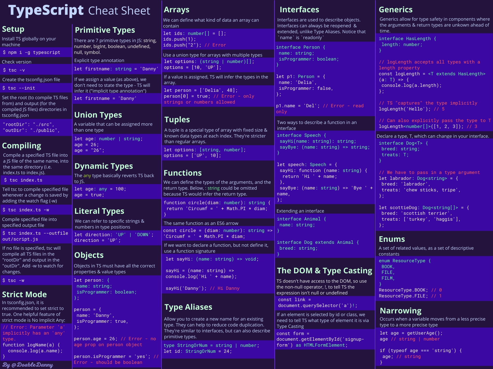

# start with TS

## hello ts

全局安装 typescript

```
npm i -g typescript
#检查是否安装成功
tsc -v
```

创建空项目，创建 `01_hi.ts`

```ts
var sport = 'football';
var id = 5;
```

使用 tsc 命令编译 ts 文件

```sh
#1.默认生成同名 ts 文件，也可使用 [--outfile 新文件名] 指定输出文件名
tsc 01_hi.ts 

#2.自动编译。使用 -w 参数表示监听文件的变化，如果内容变化了则进行重新编译
tsc 01_hi.ts -w
```

## ts 配置文件

在 ts 配置文件中我们可以指定编译目录、编译选项、代码检查的严格程度等配置。

使用如下命令创建 ts 配置文件 `tsconfig.json`

```
tsc --init
```

一览

```json
{
    // 指定要编译的目录
    "include": [
        "src"
    ],
    "compilerOptions": {
        /* Modules */
        "target": "es2016", // 设置生成的 JavaScript 的 JavaScript 语言版本，并包含兼容的库声明。
        "module": "es2015", // 模块化
        "rootDir": "./src", // Where to compile from
        "outDir": "./dist", // Where to compile to
        
        /* JavaScript Support */
        "allowJs": true, // Allow JavaScript files to be compiled
        "checkJs": true, // Type check JavaScript files and report errors
        
        /* Emit */
        "sourceMap": true, // Create source map files for emitted JavaScript files (good for debugging)
        "removeComments": true, // Don't emit comments
        "strict": true, //严格模式
        "noImplicitAny": true, // 不包含隐式 any。当没有显示指定类型且 ts 推断出 any 类型时进行错误提示
        "strictNullChecks": true, // 严格空值检查。ts 进行空值检查，如果变量可能为空且被错误使用时进行提示
    },
}
```

创建两个目录 `src`, `dist`

然后将 `r01_hi.ts` 移动到 src 目录中

再次执行 `tsc -w`，此时 tsc 会动态监听 src 下的所有 ts/js 文件的变化并进行编译

## 快速回顾



## 基础知识

### 数据类型

7 类**基本类型**：`string/number/bigint/boolean/undefined/null/symbol`

```ts
var sport: string = 'football';
var id: number = 5;
var isMarried: boolean = true;
var years: string | number;
years = '20';
years = 21;
```

**引用类型**：`String/Number/Boolean/...`

```ts
var my_name = new String('guo');
var my_id = new Number(5);
var my_flag = new Boolean(true);
```

### Array

```ts
let ids: number[] = [1, 2, 3, 4, 5]; // can only contain numbers
ids.push(6);

let names: string[] = ['Danny', 'Anna', 'Bazza']; // can only contain strings
let options: boolean[] = [true, false, false]; // can only contain true or false
let books: object[] = [
  { name: 'Fooled by randomness', author: 'Nassim Taleb' },
  { name: 'Sapiens', author: 'Yuval Noah Harari' },
]; // can only contain objects
let arr: any[] = ['hello', 1, true]; // any basically reverts TypeScript back into JavaScript
```

You can use **union types** to define arrays containing multiple types

```ts
let person: (string | number | boolean)[] = ['Danny', 1, true];
person[0] = 100;

let person = ['Danny', 1, true]; // This is identical to above example
person[0] = 100;
person[1] = { name: 'Danny' }; // Error - person array can't contain objects
```

```ts
//tuple: an array with fixed size and known datatypes
let person: [string, number, boolean] = ['Danny', 1, true];
person[0] = 100; // Error - Value at index 0 can only be a string
```

### Object

```ts
// Declare a variable called person with a specific object type annotation
let person: {
  name: string;
  location: string;
  isProgrammer: boolean;
};

// Assign person to an object with all the necessary properties and value types
person = {
  name: 'Danny',
  location: 'UK',
  isProgrammer: true,
};

// ERROR: missing the isProgrammer property
person = {
  name: 'John',
  location: 'US',
};
```

```ts
interface Person {
  name: string;
  location: string;
  isProgrammer: boolean;
}

let person1: Person = {
  name: 'Danny',
  location: 'UK',
  isProgrammer: true,
};
```

```ts
interface Speech {
  sayHi(name: string): string;
  sayBye: (name: string) => string;
}

let sayStuff: Speech = {
  sayHi: function (name: string) {
    return `Hi ${name}`;
  },
  sayBye: (name: string) => `Bye ${name}`,
};

console.log(sayStuff.sayHi('Heisenberg')); // Hi Heisenberg
console.log(sayStuff.sayBye('Heisenberg')); // Bye Heisenberg
```

### 函数

```ts
const circle = (diam: number): string => {
  return 'The circumference is ' + Math.PI * diam;
};

// Using explicit typing 
const circle: Function = (diam: number): string => {
  return 'The circumference is ' + Math.PI * diam;
};

// Inferred typing
const circle = (diam: number) => {
  return 'The circumference is ' + Math.PI * diam;
};

const add = (a: number, b: number, c?: number | string) => {
  console.log(c);
  return a + b;
};

// Below, the return type of void has been explicitly stated. 
// But again, this isn't necessary as TypeScript will infer it.
const logMessage = (msg: string): void => {
  console.log('This is the message: ' + msg);
};

// Declare the varible sayHello, and give it a function signature that takes a string and returns nothing.
let sayHello: (name: string) => void;

// Define the function, satisfying its signature
sayHello = (name) => {
  console.log('Hello ' + name);
};
```

### 动态类型 any

```ts
let age: any = '20';
age = 21;
age = {
    years: 21,
    month: 6
}
```

### 类型别名

```ts
type StringOrNumber = string | number;

type PersonObject = {
  name: string;
  id: StringOrNumber;
};

const person1: PersonObject = {
  name: 'John',
  id: 1,
};

const person2: PersonObject = {
  name: 'Delia',
  id: 2,
};

const sayHello = (person: PersonObject) => {
  return 'Hi ' + person.name;
};

const sayGoodbye = (person: PersonObject) => {
  return 'Seeya ' + person.name;
};
```

### 类型转换

```ts
// Here we are telling TypeScript that we are certain that this anchor tag exists
// .. = EXPRESSION!
const link = document.querySelector('a')!;
console.log(link.href);
```

```ts
// We need to tell TypeScript that we are certain form exists, and that we know it is of type HTMLFormElement.
// .. = EXPRESSION as X
const form = document.getElementById('signup-form') as HTMLFormElement;
console.log(form.method);
```

### 类

```ts
class Person {
  name: string;
  isCool: boolean;
  pets: number;

  constructor(n: string, c: boolean, p: number) {
    this.name = n;
    this.isCool = c;
    this.pets = p;
  }

  sayHello() {
    return `Hi, my name is ${this.name} and I have ${this.pets} pets`;
  }
}

const person1 = new Person('Danny', false, 1);
console.log(person1.sayHello()); // Hi, my name is Danny and I have 1 pets

let People: Person[] = [person1, person2];
```

访问标记符 `readonly/private/protected/public`

Note that if we omit the access modifier, by default the property will be public.

```ts
class Person {
  readonly name: string; // This property is immutable - it can only be read
  private isCool: boolean; // Can only access or modify from methods within this class
  protected email: string; // Can access or modify from this class and subclasses
  public pets: number; // Can access or modify from anywhere - including outside the class

  constructor(n: string, c: boolean, e: string, p: number) {
    this.name = n;
    this.isCool = c;
    this.email = e;
    this.pets = p;
  }

  sayMyName() {
    console.log(`Your not Heisenberg, you're ${this.name}`);
  }
}

const person1 = new Person('Danny', false, 'dan@e.com', 1);
console.log(person1.name); // Fine
person1.name = 'James'; // Error: read only
console.log(person1.isCool); // Error: private property - only accessible within Person class
console.log(person1.email); // Error: protected property - only accessible within Person class and its subclasses
console.log(person1.pets); // Public property - so no problem
```

We can make our code more **concise** by constructing class properties this way:

```ts
class Person {
  //the properties are automatically assigned in the constructor
  constructor(
    readonly name: string,
    private isCool: boolean,
    protected email: string,
    public pets: number
  ) {}

  sayMyName() {
    console.log(`Your not Heisenberg, you're ${this.name}`);
  }
}

const person1 = new Person('Danny', false, 'dan@e.com', 1);
console.log(person1.name); // Danny
```

继承

```ts
class Programmer extends Person {
  programmingLanguages: string[];

  constructor(
    name: string,
    isCool: boolean,
    email: string,
    pets: number,
    pL: string[]
  ) {
    // The super call must supply all parameters for base (Person) class, as the constructor is not inherited.
    super(name, isCool, email, pets);
    this.programmingLanguages = pL;
  }
}
```

### 模块化

TypeScript also supports modules. The TypeScript files will compile down into multiple JavaScript files.

```json
 "target": "es2016",
 "module": "es2015"
```

```ts
// src/hello.ts
export function sayHi() {
  console.log('Hello there!');
}

// src/script.ts
import { sayHi } from './hello.js';

sayHi(); // Hello there!
```

### 接口

使用 `interface` 关键字创建接口

```ts
interface Person {
  name: string;
  age: number;
}

function sayHi(person: Person) {
  console.log(`Hi ${person.name}`);
}

sayHi({
  name: 'John',
  age: 48,
}); // Hi John
```

使用 `type` 关键字创建接口

```ts
type Person = {
  name: string;
  age: number;
};

function sayHi(person: Person) {
  console.log(`Hi ${person.name}`);
}

sayHi({
  name: 'John',
  age: 48,
}); // Hi John
```

Or **an object type** could be defined anonymously:

```ts
function sayHi(person: { name: string; age: number }) {
  console.log(`Hi ${person.name}`);
}

sayHi({
  name: 'John',
  age: 48,
}); // Hi John
```

Interfaces are very similar to type aliases, and in many cases you can use either. The key distinction is that **type aliases cannot be reopened to add new properties**, vs an interface which is always extendable. [learn more](https://www.typescriptlang.org/docs/handbook/2/everyday-types.html#differences-between-type-aliases-and-interfaces).

继承一个接口

```ts
interface Animal {
  name: string
}

interface Bear extends Animal {
  honey: boolean
}

const bear: Bear = {
  name: "Winnie",
  honey: true,
}
```

继承一个类型（通过交集操作）

```ts
type Animal = {
  name: string
}

type Bear = Animal & {
  honey: boolean
}

const bear: Bear = {
  name: "Winnie",
  honey: true,
}
```

为接口添加新字段

```ts
interface Animal {
  name: string
}

// Re-opening the Animal interface to add a new field
interface Animal {
  tail: boolean
}

const dog: Animal = {
  name: "Bruce",
  tail: true,
}
```

注意：a type cannot be changed after being created.

Interfaces can also define function signatures:

```ts
interface Person {
  name: string
  age: number
  speak(sentence: string): void
}

const person1: Person = {
  name: "John",
  age: 48,
  speak: sentence => console.log(sentence),
}
```

We can tell a class that it must contain certain properties and methods by implementing an interface:

```ts
interface HasFormatter {
  format(): string;
}

class Person implements HasFormatter {
  constructor(public username: string, protected password: string) {}

  format() {
    return this.username.toLocaleLowerCase();
  }
}

// Must be objects that implement the HasFormatter interface
let person1: HasFormatter;
let person2: HasFormatter;

person1 = new Person('Danny', 'password123');
person2 = new Person('Jane', 'TypeScripter1990');

console.log(person1.format()); // danny

let people: HasFormatter[] = [];
people.push(person1);
people.push(person2);
```

### 字面量类型

```ts
// Union type with a literal type in each position
let favouriteColor: 'red' | 'blue' | 'green' | 'yellow';

favouriteColor = 'blue';
favouriteColor = 'crimson'; // ERROR: Type '"crimson"' is not assignable to type '"red" | "blue" | "green" | "yellow"'.
```

## 高级内容

### 泛型

Generics allow you to create a component that can work over a variety of types, rather than a single one, **which helps to make the component more reusable.**

https://www.freecodecamp.org/news/learn-typescript-beginners-guide#generics

### 枚举

Enums are a special feature that TypeScript brings to JavaScript.

Enums allow us to define or declare a collection of related values, that can be numbers or strings, as a set of named constants.

```ts
enum ResourceType {
  BOOK,
  AUTHOR,
  FILM,
  DIRECTOR,
  PERSON,
}

console.log(ResourceType.BOOK); // 0
console.log(ResourceType.AUTHOR); // 1

// To start from 1
enum ResourceType {
  BOOK = 1,
  AUTHOR,
  FILM,
  DIRECTOR,
  PERSON,
}

console.log(ResourceType.BOOK); // 1
console.log(ResourceType.AUTHOR); // 2
```

By default, enums are **number based** – they store string values as numbers. But they can also be strings:

```ts
enum Direction {
  Up = 'Up',
  Right = 'Right',
  Down = 'Down',
  Left = 'Left',
}

console.log(Direction.Right); // Right
console.log(Direction.Down); // Down
```

### 严格模式

It is **recommended** to have all strict type-checking operations enabled in the `tsconfig.json` file. This will cause TypeScript to report more errors, but will help prevent many bugs from creeping into your application.

```json
{
    "compilerOptions": {
        "strict": true,
    }
}
```

### 不包含隐式 any

在一些场景下，如果没有显示指定变量的类型并且 TS 没有推断出类型时，此时变量的类型会被回退为 any。这可能会导致错误，比如：

```ts
function fn(s) {
  console.log(s.subtr(3));
}
fn(42);
```

解决：指定 `noImplicitAny` ，告诉 TS 在推断出 any 类型时进行错误提示

```json
{
    "compilerOptions": {
        "noImplicitAny": true,
    }
}
```

### 严格空值检查

默认情况下，`strictNullChecks` 开关是关闭的，表示 TS 不进行严格空值检查，认为变量都是非空的，即非 null、非 undefined。这可能会导致错误，比如：

```ts
let whoSangThis: string = '';

const singles = [
    { song: 'touch of grey', artist: 'grateful dead' },
    { song: 'paint it black', artist: 'rolling stones' },
];

const single = singles.find((s) => s.song === whoSangThis);

console.log(single.artist);//这里的 single 可能为空，但没有提示，所有出错隐患
```

解决：

```json
{
    "compilerOptions": {
        "strictNullChecks": true,
    }
}
```

```ts
//...

const single = singles.find((s) => s.song === whoSangThis);

// console.log(single.artist);
if (single) {
    console.log(single.artist);
}
```

### 类型缩窄

在 TS 项目中，变量可以从不太精确的类型变为到更精确的类型，这个过程称为类型缩窄。

简单示例：使用 if 语句进行类型缩窄，从 `string|number` 到 `string` 或 `number`

```ts
function addAnother(val: string | number) {
  if (typeof val === 'string') {
    // TypeScript treats `val` as a string in this block, so we can use string methods on `val` and TypeScript won't shout at us
    return val.concat(' ' + val);
  }

  // TypeScript knows `val` is a number here
  return val + val;
}

console.log(addAnother('Woooo')); // Woooo Woooo
console.log(addAnother(20)); // 40
```

另一个示例

```ts
interface Vehicle {
  topSpeed: number;
}

interface Train extends Vehicle {
  type: 'Train';
  carriages: number;
}

interface Plane extends Vehicle {
  type: 'Plane';
  wingSpan: number;
}

type PlaneOrTrain = Plane | Train;

function getSpeedRatio(v: PlaneOrTrain) {
  if (v.type === 'Train') {
    return v.topSpeed / v.carriages;
  }
  return v.topSpeed / v.wingSpan;
}

let bigTrain: Train = {
  type: 'Train',
  topSpeed: 100,
  carriages: 20,
};

console.log(getSpeedRatio(bigTrain)); // 5
```

### 开发 react 应用

TypeScript has full support for React and JSX. This means we can use TypeScript with the three most common React frameworks:

- create-react-app ([TS setup](https://create-react-app.dev/docs/adding-typescript/))
- Gatsby ([TS setup](https://www.gatsbyjs.com/docs/how-to/custom-configuration/typescript/))
- Next.js ([TS setup](https://nextjs.org/learn/excel/typescript))

[Learn more](https://www.freecodecamp.org/news/learn-typescript-beginners-guide#bonustypescriptwithreact).

## 实战-express应用

目录：`pkg_web_express`

[express - npm (npmjs.com)](https://www.npmjs.com/package/express)

引入依赖

```json
  "dependencies": {
    "@types/express": "^4.17.21",
    "express": "^4.19.1"
  }
```

构造目录

```
.
├── dist                     编译输出目录
├── package.json
├── src                      源码目录
│   └── index.ts             一个 ts 文件
└── tsconfig.json            ts 配置
```

编译

```
tsc -w
```

下载 `nodemon` 工具，运行编译出来的 `dist/index.js`（监听指定 js 文件变化，如果发生了变化则再次执行）

```
nodemon dist/index.js
```

配置文件 `tsconfig.json`

```json
{
    // 指定要编译的目录
    "include": [
        "src"
    ],
    "compilerOptions": {
        "paths": {
            // This is solely to stop a bug with @types/node as of 12/15/2023
            // https://github.com/DefinitelyTyped/DefinitelyTyped/discussions/67406#discussioncomment-7866621
            "undici-types": [
                "./node_modules/undici-types/index.d.ts"
            ],
        },
        /* Modules */
        "target": "es2016", // 设置生成的 JavaScript 的 JavaScript 语言版本，并包含兼容的库声明。
        "module": "es2015", // 模块化
        "rootDir": "./src", // Where to compile from
        "outDir": "./dist", // Where to compile to
        /* JavaScript Support */
        "allowJs": true, // Allow JavaScript files to be compiled
        "checkJs": true, // Type check JavaScript files and report errors
        /* Emit */
        "sourceMap": true, // Create source map files for emitted JavaScript files (good for debugging)
        "removeComments": true, // Don't emit comments
        "strict": true, //严格模式
        "noImplicitAny": true, // 不包含隐式 any。当没有显示指定类型且 ts 推断出 any 类型时进行错误提示
        "strictNullChecks": true, // 严格空值检查。ts 进行空值检查，如果变量可能为空且被错误使用时进行提示
    },
}
```

**遇到的错误**

```
[11:56:02 PM] File change detected. Starting incremental compilation...

node_modules/@types/node/globals.d.ts:6:76 - error TS2792: Cannot find module 'undici-types'. Did you mean to set the 'moduleResolution' option to 'nodenext', or to add aliases to the 'paths' option?

6 type _Request = typeof globalThis extends { onmessage: any } ? {} : import("undici-types").Request;
                                                                             ~~~~~~~~~~~~~~

node_modules/@types/node/globals.d.ts:7:77 - error TS2792: Cannot find module 'undici-types'. Did you mean to set the 'moduleResolution' option to 'nodenext', or to add aliases to the 'paths' option?

...
```

解决：[[@types/node\] Compiler error: Cannot find module 'undici-types' · DefinitelyTyped/DefinitelyTyped · Discussion #67406 (github.com)](https://github.com/DefinitelyTyped/DefinitelyTyped/discussions/67406#discussioncomment-7866621)


