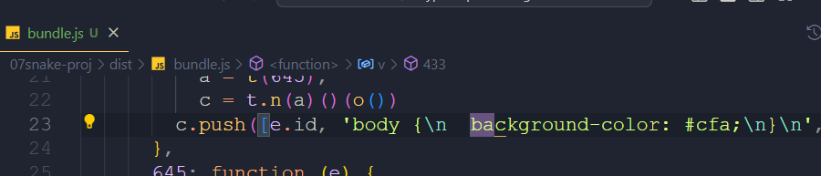
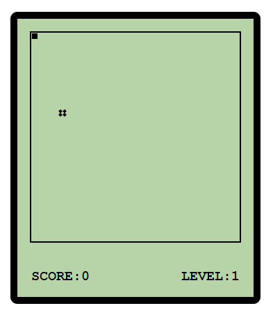

# Typescript 入门

- [仓库](https://gitee.com/egu0/typescript-learning)
- [教程](https://www.bilibili.com/video/BV1Xy4y1v7S2)

## 安装

```shell
nvm use node18.16.0
npm -g i typescript
tsc
tsc a.ts && node a.js
```

## 基本类型

- boolean
- number
- string
- 字面量，限制变量的值就是该字面量的值
- any 任意类型，相当于关闭目标变量的 TS 类型检测，可以直接赋值给任意变量
- unknown 未知类型，类型安全的 any，不可以直接赋值给其他变量
- +++++++++++++++++
- void 返回为“空”，修饰函数
- never 永远不会返回结果
- +++++++++++++++++
- object 对象，可以为 {} 或 函数
- array 数组
- tuple 元组，长度固定，效率较高
- enum 枚举
- 补充：类型或与类型与
- 补充：类型别名

## 编译选项

1. `tsc a.tsc -w`：监视单个 ts 文件的变化并进行动态编译

2. `tsc -w`：编译所有文件。需要添加 tsconfig.json 文件（文件中内容为空或 `{}`）

3. `tsconfig.json` 配置

```js
{
  /*
  指定哪些文件需要被编译。两个星表示任意目录，一个星表示任意文件名
  */
  "include": ["./src/**/*"],
  /*
  排除哪些目录。默认值为 ["node_modules", "bower_components", "jspm_packages"]
  */
  "exclude": ["./src/demo/**/*"],
  /*
  继承哪个配置。重复配置不想写第二遍，可以进行配置
  */
  "extends": "./config/base.json",
  /*
  包含哪些文件。与 include 功能相似
  */
  "files": ["./a.ts"],
  /*
  编译选项
  */
  "compilerOptions": {
    /*
    指定 ts 代码被编译到哪个 ES 版本。默认 ES3（较老，兼容性好）
    可选值：'es3', 'es5', 'es6', 'es2015', 'es2016', 'es2017', 'es2018', 'es2019', 'es2020', 'es2021', 'es2022', 'esnext'
    */
    "target": "ES2015",
    /*
    指定使用的模块化规范，比如 es2015(ES6) / commonjs。
    可选值：'none', 'commonjs', 'amd', 'system', 'umd', 'es6', 'es2015', 'es2020', 'es2022', 'esnext', 'node16', 'nodenext'
    */
    "module": "ES2015",
    /*
    指定第三方库目录，一般情况下不需要改。
    可选值：'es5', 'es6', 'es2015', 'es7', 'es2016', 'es2017', 'es2018', 'es2019', 'es2020', 'es2021', 'es2022', 'es2023', 'esnext', 'dom', 'dom.iterable', 'webworker', 'webworker.importscripts', 'webworker.iterable', 'scripthost', 'es2015.core', 'es2015.collection', 'es2015.generator', 'es2015.iterable', 'es2015.promise', 'es2015.proxy', 'es2015.reflect', 'es2015.symbol', 'es2015.symbol.wellknown', 'es2016.array.include', 'es2017.object', 'es2017.sharedmemory', 'es2017.string', 'es2017.intl', 'es2017.typedarrays', 'es2018.asyncgenerator', 'es2018.asynciterable', 'es2018.intl', 'es2018.promise', 'es2018.regexp', 'es2019.array', 'es2019.object', 'es2019.string', 'es2019.symbol', 'es2019.intl', 'es2020.bigint', 'es2020.date', 'es2020.promise', 'es2020.sharedmemory', 'es2020.string', 'es2020.symbol.wellknown', 'es2020.intl', 'es2020.number', 'es2021.promise', 'es2021.string', 'es2021.weakref', 'es2021.intl', 'es2022.array', 'es2022.error', 'es2022.intl', 'es2022.object', 'es2022.sharedmemory', 'es2022.string', 'es2022.regexp', 'es2023.array', 'esnext.array', 'esnext.symbol', 'esnext.asynciterable', 'esnext.intl', 'esnext.bigint', 'esnext.string', 'esnext.promise', 'esnext.weakref', 'decorators', 'decorators.legacy'
    */
    // "lib": []
    /*
    编译结果输出文件夹
     */
    "outDir": "./output",
    /*
    将代码合并为一个文件（将全局作用域中的代码合并到一个文件中）
    模块作用域需要为 amd 或 system
    */
    // "outFile": "./output/app.js"
    /*
    是否对 js 文件进行编译。默认为 false，表示不处理 js，在模块化项目中可能会出错
    */
    "allowJs": true,
    /*
    是否检查 js 代码符合规范，默认 false
    */
    "checkJs": false,
    /*
    移除注释，默认 false
    */
    "removeComments": true,
    /*
    不生成编译后的文件。即执行编译但不输出 js 文件
    */
    "noEmit": true,
    /*
    出现错误时不生成编译后文件，默认 false
    */
    "noEmitOnError": true,
    /*
    设置编译后的文件是否使用严格模式，默认 false
    */
    "alwaysStrict": true,
    /*
    不允许隐式 any 类型，默认 false
    */
    "noImplicitAny": true,
    /*
    不允许 any 类型的 this，默认 false
    */
    "noImplicitThis": true,
    /*
    严格检查空值，默认 false
    */
    "strictNullChecks": true,
    /*
    所有严格检查的总开关，默认 false。
    一旦打开 alwaysStrict noImplicitAny noImplicitThis strictNullChecks 都为 true
    */
    "strict": true
  }
}
```

## 使用 webpack 打包 ts 代码

### 基本整合

创建项目

```sh
npm init -y
npm i -D webpack webpack-cli typescript ts-loader
```

准备 `webpack.config.js` ，配置 webpack

```js
const path = require('path')

module.exports = {
  // 运行模式 development/production
  mode: 'production',
  // 入口文件
  entry: './src/index.ts',
  // 指定输出目录
  output: {
    // 输出路径
    path: path.resolve(__dirname, 'dist'),
    // 输出文件名
    filename: 'bundle.js',
  },
  / 打包时使用的模块
  module: {
    rules: [
      {
        //规则生效的文件。匹配所有 ts 文件
        test: /\.ts$/,
        // 使用 ts-loader 处理 ts 文件
        use: 'ts-loader',
        // 要排除的文件夹
        exclude: /node_modules/,
      },
    ],
  },
}

```

准备 `tsconfig.json`，配置 typescript

```json
{
  "compilerOptions": {
    "target": "ES2015",
    "module": "ES2015",
    "outDir": "./dist",
    "strict": true
  }
}
```

在 package.json 中添加脚本命令

```json
  "scripts": {
    "test": "echo \"Error: no test specified\" && exit 1",
    "build": "webpack"
  },
```

创建 `./src/index.ts` 编写示例代码后，执行 `npm run build` 打包项目，可在 `dist` 中查看到生成的文件

至此，完成了 typescript 与 webpack 的最基本的整合

### 插件 html-webpack-plugin

插件来源：[jantimon/html-webpack-plugin](https://github.com/jantimon/html-webpack-plugin)

插件作用：简化 html 的创建（index.html 的创建）

```sh
npm i -D html-webpack-plugin
```

`webpack.config.js`

```js
const HtmlWebpackPlugin = require('html-webpack-plugin')

module.exports = {
  // ...
  // 配置 webpack 插件
  plugins: [
    new HtmlWebpackPlugin({
      // 方法一：不添加参数，会自动生成一个 index.html
      title: '自定义 title',
      // 方法二：根据模板来构建
      template: './src/index.html',
    }),
  ],
}
```

执行命令 `npm run build` 再次查看

### 插件 webpack-dev-server

提供“内置服务器”，项目在此服务器中运行。服务器又与 webpack 关联，可以监测文件的变化动态编译

```sh
npm i -D webpack-dev-server
```

配置 `package.json`

```js
  "scripts": {
    "test": "echo \"Error: no test specified\" && exit 1",
    "build": "webpack",
    // 启动开发服务器
    "start": "webpack serve"
  }
```

执行 `npm run start` 查看

### 插件 clean-webpack-plugin

每次编译前清空输出目录

```sh
npm i -D clean-webpack-plugin
```

配置 `webpack.config.js`

```js
// 引入 clean 插件
const { CleanWebpackPlugin } = require('clean-webpack-plugin')

module.exports = {
  plugins: [new CleanWebpackPlugin()],
}
```

验证：在 `./dist` 添加添加一个新文件，执行 `npm run start` 后新文件消失

### 测试模块化

添加 `./src/m1.ts`

```ts
export const hi = '你好'
```

在 `./src/index.ts` 中引入并使用

```ts
import { hi } from './m1'

console.log(hi)
```

执行 `npm run build` 出现错误

```text
ERROR in ./src/index.ts 1:0-26
Module not found: Error: Can't resolve './m1' in 'D:\VscodeWorkSpace\typescript-learn\04webpack\src'
resolve './m1' in 'D:\VscodeWorkSpace\typescript-learn\04webpack\src'
```

原因：webpack 中不知道 ts 可作为模块使用，也就是不知道哪些文件被引入
解决：在 `webpack.config.js` 中配置哪些文件可以当作模块被引入

```js
module.exports = {
  // 用来设置引用模块
  resolve: {
    extensions: ['.ts', '.js'],
  },
}
```

再次编译，可以编译成功

存在的其他问题：生成的 js 代码在老浏览器上不兼容，需要引入 babel 工具进行兼容

### 整合 babel

一个场景：使用 ES2020 标准编写项目，但 IE 浏览器不支持 ES2020 标准，生成的代码无法在 IE 中运行
解决：写完代码后进行转换旧版标准

`tsconfig.js` 中的 `compilerOptions.target` 指定 TS 代码编译到那个版本，但是只能做**语法的转换**，一些复杂的功能比如 promise 无法转换

目录 `05webpack_babel` 中

```sh
npm i -D @babel/core @babel/preset-env babel-loader core-js
```

```js
module.exports = {
  module: {
    rules: [
      {
        test: /\.ts$/,
        // 先 ts 转为 js，再 js 做版本兼容代码转换
        use: [
          // 配置 babel
          {
            // 指定 babel 加载器
            loader: 'babel-loader',
            options: {
              // 设置预定义的环境
              presets: [
                [
                  // 指定环境插件
                  '@babel/preset-env',
                  // 配置信息
                  {
                    // 要兼容的目标浏览器
                    targets: {
                      chrome: '58',
                      ie: '11',
                    },
                    // corejs 的版本（安装的版本）
                    corejs: '3',
                    // 按需加载
                    useBuiltIns: 'usage',
                  },
                ],
              ],
            },
          },
          'ts-loader',
        ],
        // 要排除的文件夹
        exclude: /node_modules/,
      },
    ],
  },
}
```

在 `index.ts` 中添加一行 `console.log(Promise)` 后重新编译发现生成的 `bundle.js` 文件长度大大增加
分析：IE11 不支持 Promise，于是使用 core-js 代码让 Promise 可以使用。生成的很长的代码实际上是 core-js 的代码

⚠️ 编译的代码在 IE11 中运行时出现报错，因为 js 代码最外一层的 ‘立即执行函数’（由 webpack 生成的）不会被 IE11 所识别
解决：在 `webpack.config.js` 中配置

```js
module.exports = {
  output: {
    // 禁用箭头函数
    environment: {
      arrowFunction: false,
    },
  },
```

## 面向对象

- ab 类
- c 继承
- d 抽象类
- e 接口。接口指定义对象的结构，而不考虑实际值：
- f 类成员属性修饰符、getter and setter、一个语法糖
- g 泛型

## 项目练习-贪吃蛇

[link](https://www.bilibili.com/video/BV1Xy4y1v7S2/?p=22&spm_id_from=pageDriver&vd_source=a600c7a313982cfc9e3fbc13c69259da)

### 初始化项目

```json
{
  "name": "07snake",
  "version": "1.0.0",
  "description": "",
  "main": "webpack.config.js",
  "scripts": {
    "test": "echo \"Error: no test specified\" && exit 1",
    "build": "webpack",
    "start": "webpack serve"
  },
  "keywords": [],
  "author": "",
  "license": "ISC",
  "devDependencies": {
    "@babel/core": "^7.22.1",
    "@babel/preset-env": "^7.22.4",
    "babel-loader": "^9.1.2",
    "clean-webpack-plugin": "^4.0.0",
    "core-js": "^3.30.2",
    "html-webpack-plugin": "^5.5.1",
    "ts-loader": "^9.4.3",
    "typescript": "^5.1.3",
    "webpack": "^5.85.0",
    "webpack-cli": "^5.1.2",
    "webpack-dev-server": "^4.15.0"
  }
}

```

```js
// 引入一个包
const path = require('path')
// 引入html插件
const HTMLWebpackPlugin = require('html-webpack-plugin')
// 引入clean插件
const { CleanWebpackPlugin } = require('clean-webpack-plugin')

// webpack中的所有的配置信息都应该写在module.exports中
module.exports = {
  mode: 'production',
  // 指定入口文件
  entry: './src/index.ts',

  // 指定打包文件所在目录
  output: {
    // 指定打包文件的目录
    path: path.resolve(__dirname, 'dist'),
    // 打包后文件的文件
    filename: 'bundle.js',

    // 告诉webpack不使用箭头
    environment: {
      arrowFunction: false,
      // 不使用const,此时兼容IE 10
      const: false,
    },
  },

  // 指定webpack打包时要使用模块
  module: {
    // 指定要加载的规则
    rules: [
      {
        // test指定的是规则生效的文件
        test: /\.ts$/,
        // 要使用的loader
        use: [
          // 配置babel
          {
            // 指定加载器
            loader: 'babel-loader',
            // 设置babel
            options: {
              // 设置预定义的环境
              presets: [
                [
                  // 指定环境的插件
                  '@babel/preset-env',
                  // 配置信息
                  {
                    // 要兼容的目标浏览器
                    targets: {
                      chrome: '58',
                      ie: '11',
                    },
                    // 指定corejs的版本
                    corejs: '3',
                    // 使用corejs的方式 "usage" 表示按需加载
                    useBuiltIns: 'usage',
                  },
                ],
              ],
            },
          },
          'ts-loader',
        ],
        // 要排除的文件
        exclude: /node-modules/,
      },
    ],
  },

  // 配置Webpack插件
  plugins: [
    new CleanWebpackPlugin(),
    new HTMLWebpackPlugin({
      // title: "这是一个自定义的title"
      template: './src/index.html',
    }),
  ],

  // 用来设置引用模块
  resolve: {
    extensions: ['.ts', '.js'],
  },
}
```

```js
{
  "compilerOptions": {
    "target": "ES2015",
    "module": "ES2015",
    "strict": true,
    "noEmitOnError": true
  }
}
```

`src/index.ts`

```ts
console.log(123);
```

```sh
npm run build
```

2、使用 css 处理器

```sh
npm i -D less less-loader css-loader style-loader
```

添加规则

```js
   rules:[
       ...
       
      // 设置less文件的处理
      {
        test: /\.less$/,
        use: [
          'style-loader',
          'css-loader',
          'less-loader',
        ],
      },
   ]
```

创建  `src/style/index.less`

```less
body {
    background-color: #cfa;
}
```

在 `index.ts` 中引入

```ts
import './style/index.less'
```

编译、运行。



引入 postcss 加载器，增加样式的兼容性

```sh
npm i -D postcss postcss-loader postcss-preset-env
```

```js
      // 设置less文件的处理
      {
        test: /\.less$/,
        use: [
          'style-loader',
          'css-loader',

          // 引入postcss
          // 类似于babel，把css语法转换兼容旧版浏览器的语法
          {
            loader: 'postcss-loader',
            options: {
              postcssOptions: {
                plugins: [
                  [
                    // 浏览器兼容插件
                    'postcss-preset-env',
                    {
                      // 每个浏览器最新两个版本
                      browsers: 'last 2 versions',
                    },
                  ],
                ],
              },
            },
          },

          'less-loader',
        ],
      },
```

修改 `index.less`

```less
body {
  background-color: #cfa;
  display: flex;
}
```

编译，查看 `bundle.js`，部分代码为：

```js
    v = {
      485: function (e, n, t) {
        var r = t(81),
          o = t.n(r),
          a = t(645),
          i = t.n(a)()(o())
        i.push([
          e.id,
          'body {\n  background-color: #cfa;\n  display: -webkit-box;\n  display: -ms-flexbox;\n  display: flex;\n}\n',
          '',
        ]),
          (n.Z = i)
      },
```

可以看到兼容性增加了

### 项目界面

启动【开发-监听】模式

```sh
npm run start
```

结构搭建



1. 上下区域：stage 区 和 score 区
2. stage 区：绘制 snake 和 food 两块小区域。其中 food 小区域由 4 个 div 组成

`index.html`

```html
<!DOCTYPE html>
<html lang="en">
  <head>
    <meta charset="UTF-8" />
    <meta name="viewport" content="width=device-width, initial-scale=1.0" />
    <title>贪吃蛇</title>
  </head>
  <body>
    <!-- 创建游戏主容器 -->
    <div id="main">
      <!-- 游戏舞台 -->
      <div id="stage">
        <div id="snake">
          <div></div>
        </div>
        <div id="food">
          <div></div>
          <div></div>
          <div></div>
          <div></div>
        </div>
      </div>
      <!-- 积分牌 -->
      <div id="score-panel">
        <div>SCORE:<span id="score">0</span></div>
        <div>LEVEL:<span id="level">1</span></div>
      </div>
    </div>
  </body>
</html>
```

`index.less`

```less
// 设置变量
@bg-color: #b7d4a8;

body {
  font: bold 20px 'Courier';
}

// 清除样式
* {
  padding: 0;
  margin: 0;
  // 盒子模型的计算方式
  box-sizing: border-box;
}

// 主容器
#main {
  width: 360px;
  height: 420px;
  background-color: @bg-color;
  margin: 50px auto;
  border: 10px solid black;
  border-radius: 10px;

  //弹性盒模型
  display: flex;
  //主轴方向为垂直
  flex-flow: column;
  //辅轴居中
  align-items: center;
  //主轴对齐方式
  justify-content: space-around;

  //游戏舞台
  #stage {
    width: 304px;
    height: 304px;
    border: 2px solid black;

    // 相对定位
    position: relative;

    #snake {
      & > div {
        width: 10px;
        height: 10px;
        background-color: #000;
        border: 1px solid @bg-color;

        // 开启绝对定位
        position: absolute;
      }
    }
    #food {
      width: 10px;
      height: 10px;

      position: absolute;
      left: 40px;
      top: 110px;

      display: flex;
      // 横向排列，可换行
      flex-flow: row wrap;
      //两个轴的对齐方式
      justify-content: space-between;
      align-content: space-around;

      & > div {
        width: 4px;
        height: 4px;
        background-color: black;
        //使4个div旋转45度
        transform: rotate(45deg);
      }
    }
  }

  #score-panel {
    width: 300px;
    // 二者水平排列
    display: flex;
    justify-content: space-between;
  }
}
```

### Food类实现

```ts

//定义食物类
class Food {
  element: HTMLElement
  constructor() {
    //获取food元素
    this.element = document.getElementById('food')!
  }
  /**
   * 获取食物 x 轴坐标
   */
  get X() {
    return this.element.offsetLeft
  }
  /**
   * 获取食物 y 轴坐标
   */
  get Y() {
    return this.element.offsetTop
  }
  /**
   * 修改食物位置
   */
  change() {
    const x = Math.floor(Math.random() * 30) * 10 //floor()向下取整
    const y = Math.floor(Math.random() * 30) * 10 //floor()向下取整
    this.element.style.left = `${x}px`
    this.element.style.top = `${y}px`
  }
}

const food = new Food()
console.log(food.X, food.Y)
food.change()
```

### ScorePanel类实现

```ts
//记分牌
class ScorePanel {
  score = 0
  level = 1
  scoreElement: HTMLElement
  levelElement: HTMLElement

  //最大等级
  maxLevel: number

  constructor(maxLevel: number = 10) {
    this.scoreElement = document.getElementById('score')!
    this.levelElement = document.getElementById('level')!
    this.maxLevel = maxLevel
  }

  /**
   * 加分
   */
  incScore() {
    this.score++
    this.scoreElement.innerHTML = this.score + ''

    //每10分升一级
    if (this.score % 10 === 0) {
      this.levelUp()
    }
  }

  /**
   * 提升等级
   */
  levelUp() {
    if (this.level < this.maxLevel) {
      this.levelElement.innerHTML = ++this.level + ''
    }
  }
}

export default ScorePanel
```

### GameControl类实现

基础功能：<https://gitee.com/egu0/typescript-learning/commit/4db6f92b06de026bdda697ab5961b2cba564309c>

持续移动：<https://gitee.com/egu0/typescript-learning/commit/c7fe6aa6a14735c470b051356c0e60df0b3108a9>

检查边界和食物：<https://gitee.com/egu0/typescript-learning/commit/e9340ac444276d6ae556482d5462d428099f1955>

移动蛇身：<https://gitee.com/egu0/typescript-learning/commit/176d6e5942ad9572f77c0f24bab1432c24b3b454>

禁止回头 & 头撞身检测：<https://gitee.com/egu0/typescript-learning/commit/48c95be9af040ea6f22d36918abaee40cd9f5942>
