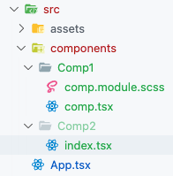
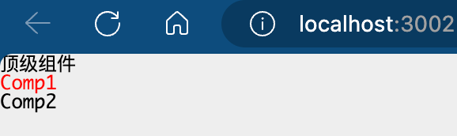
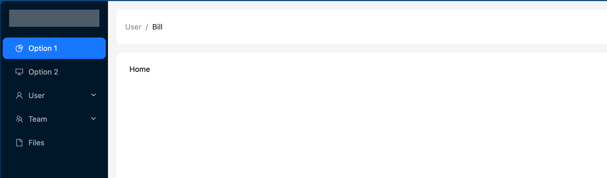
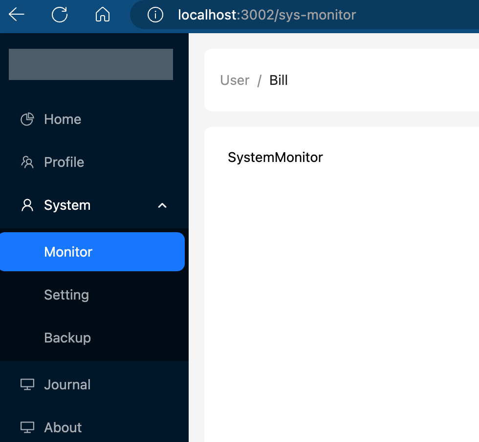

# React 后台管理系统

`bid: BV1FV4y157Zx`

`node: v16.x.x`

## 创建项目

```
npm init vite
```

添加依赖

```json
  "dependencies": {
    "react": "^18.2.0",
    "react-dom": "^18.2.0",
    "react-router-dom": "^6.3.0",
    "react-redux": "^7.2.8",
    "redux": "^4.2.1"
  },
```

下载依赖 & 启动开发环境

```
npm i

npm run dev
```

在 `package.json` 中指定 “启动参数”

```json
  "scripts": {
    "dev": "vite --host --port 3002 --open",
  }
```

初始化 `src` 目录：保留三个文件，删除其中多余的代码

```
- /
  - src/
    - App.tsx
    - main.tsx
    - vite-env.d.ts
```

## 样式初始化

> 乐哥：`reset-css` 比 `normalize.css` 更直接、干净利索地去除默认样式，更适合企业开发场景，所以首选 `reset-css`

```
npm i reset-css
```

`main.tsx`

```jsx
// 引入 reset-css，重置样式表
import 'reset-css'
```

## Sass 安装与初步使用

vite 中使用 sass 很方便，loader 不用自己配置，安装好即可使用

```
npm i sass -D
```

创建 `src/assets/style/global.scss` 开始使用

> 注意：文件后缀为 `.scss`，而非 `.sass`！

```scss
// 定义变量
$color: #eee;

body {
  // 禁止选中文字
  user-select: none;
  background-color: $color;
}
img {
  // 禁止拖动
  -webkit-user-drag: none;
}
```

在 `main.tsx` 中引入

```tsx
// 引入 global.scss
import './assets/style/global.scss'
```

## 配置项目路径别名

### 配置解析 @ 到 src/

配置 `vite.config.ts`

```ts
import { defineConfig } from 'vite'
import react from '@vitejs/plugin-react'
import path from 'path'

// https://vitejs.dev/config/
export default defineConfig({
  plugins: [react()],
  resolve: {
    alias: {
      '@': path.__resolve(__dirname, './src'),
    },
  },
})
```

此时 `vite.config.ts` 爆红：因为缺少 ts 的一些声明配置

解决：

```
npm i @types/node -D
```

> 如果还爆红，尝试修改 import 一句：`import * as path from 'path'`

验证：使用 `@` 表示 src 目录时可以正确解析

```tsx
import '@/assets/style/global.scss'
```

### 路径名提示

在 `tsconfig.json` 中添加配置

```json
{
  "compilerOptions": {
    "baseUrl": "./",
    "paths": {
      "@/*": ["src/*"]
    }
  }
}
```

## Sass 模块化管理样式



`comp.module.scss`

```scss
.box {
  color: red;
}
```

`Comp1/comp.tsx`

```tsx
// 直接引入：这种的效果是“全局引入”，而非模块化引入!
// import './comp.module.scss'

// 模块化引入!
import styles from './comp.module.scss'

const Comp1 = () => {
  return (
    <>
      <!-- 使用样式 -->
      <div className={styles.box}>Comp1</div>
    </>
  )
}
export default Comp1
```

`Comp2/index.tsx`

```tsx
const Comp2 = () => {
  return (
    <>
      <div className="box">Comp2</div>
    </>
  )
}
export default Comp2
```

`App.tsx`

```tsx
import Comp1 from './components/Comp1/comp'
import Comp2 from './components/Comp2'

function App() {
  return (
    <>
      <div>顶级组件</div>
      <Comp1 />
      <Comp2 />
    </>
  )
}

export default App
```



**要点**：

1. 样式文件后缀为 `.module.scss`
2. 模块化引入样式文件：`import styles from './xxx.module.scss'`
3. 样式属性应用：`className={styles.yyy}`

## AntDesign 初步引入

[Ant Design of React - Ant Design (antgroup.com)](https://ant-design.antgroup.com/docs/react/introduce-cn)

[Installation](https://ant-design.antgroup.com/docs/react/introduce#installation)

```
npm i antd --save
npm i @ant-design/icons --save
```

`v5.x.x` 版本的 `antd`：无需引入 css，支持自动按需引入组件

测试使用 Button 组件

```tsx
import { Button } from 'antd'

function App() {
  return (
    <>
      <div>顶级组件</div>
      <Button type="primary">Primary Button</Button>
      <Button>Default Button</Button>
      <Button type="dashed">Dashed Button</Button>
      <Button type="text">Text Button</Button>
      <Button type="link">Link Button</Button>
    </>
  )
}

export default App
```

## 路由

### 旧方案

创建组件：`@/views/Home/index.tsx` 和 `@/views/About/index.tsx`

创建路由组件 `@/router/index.tsx`：配置路由结构、路由与组件的映射关系

```tsx
import App from '@/App'
import About from '@/views/About'
import Home from '@/views/Home'
import { BrowserRouter, Route, Routes } from 'react-router-dom'

// const router = () => {
//   return (<BrowserRouter>
//   //...
//   </BrowserRouter>)
// }
// 简写为：
const router = () => (
  <BrowserRouter>
    <Routes>
      {/* 一级路由 */}
      <Route path="/" element={<App />}>
        {/* 子路由，也是二级路由 */}
        <Route path="/home" element={<Home />}></Route>
        <Route path="/about" element={<About />}></Route>
      </Route>
    </Routes>
  </BrowserRouter>
)

export default router
```

修改 `@/main.tsx`：为 render 函数传递路由组件

```tsx
import ReactDOM from 'react-dom/client'
// 引入 reset-css，重置样式表
import 'reset-css'
// 引入 global.scss
import '@/assets/style/global.scss'
// 引入 router
import Router from '@/router'

ReactDOM.createRoot(document.getElementById('root')!).render(<Router />)
```

修改一级路由 `@/App.tsx`：在模板中添加占位组件，用于渲染子路由组件

```tsx
import { Outlet } from 'react-router-dom'

function App() {
  return (
    <div style={{ backgroundColor: 'pink', height: '100vh' }}>
      {/* 占位组件，用于展示组件，相当于 Vue 中的 router-view */}
      <Outlet></Outlet>
    </div>
  )
}

export default App
```

### 旧方案其他配置

**手动路由跳转**

```tsx
// App.tsx
import { Outlet, Link } from 'react-router-dom'

function App() {
  return (
    <div>
      <Link to="/home">go to home page</Link>&nbsp;|&nbsp;
      <Link to="/about">go to about page</Link>
      <hr />
      {/* 占位组件，用于展示组件，相当于 Vue 中的 router-view */}
      <Outlet></Outlet>
    </div>
  )
}

export default App
```

**重定向**

```tsx
// router/index.tsx
import App from '@/App'
import About from '@/views/About'
import Home from '@/views/Home'
import { BrowserRouter, Route, Routes, Navigate } from 'react-router-dom'

const router = () => (
  <BrowserRouter>
    <Routes>
      <Route path="/" element={<App />}>
        <Route path="/home" element={<Home />}></Route>
        <Route path="/about" element={<About />}></Route>

        {/* 访问 / 时重定向到 /home */}
        <Route path="/" element={<Navigate to={'/home'} />}></Route>
      </Route>
    </Routes>
  </BrowserRouter>
)

export default router
```

### 新方案

`@/router/index.tsx`：配置成一个数组，和 vue 相似

```tsx
import About from '@/views/About'
import Home from '@/views/Home'
import { Navigate } from 'react-router-dom'

const routes = [
  {
    path: '/',
    element: <Navigate to="/home" />,
  },
  {
    path: '/home',
    element: <Home />,
  },
  {
    path: '/about',
    element: <About />,
  },
]

export default routes
```

`main.tsx`：使用 BrowserRouter 组件包裹根路由组件

```tsx
import ReactDOM from 'react-dom/client'
// 引入 reset-css，重置样式表
import 'reset-css'
// 引入 global.scss
import '@/assets/style/global.scss'

import { BrowserRouter } from 'react-router-dom'
import App from './App'

ReactDOM.createRoot(document.getElementById('root')!).render(
  <BrowserRouter>
    <App />
  </BrowserRouter>
)
```

`App.tsx`：使用 useRoutes 这个 hook 根据【路由数组】创建组件并进行展示

```tsx
import { useRoutes, Link } from 'react-router-dom'
import router from '@/router'

function App() {
  // 通过 useRoutes 创建路由组件，相当于创建了一个 Outlet 组件
  const routes = useRoutes(router)
  return (
    <div>
      <Link to="/home">go to home page</Link>&nbsp;|&nbsp;
      <Link to="/about">go to about page</Link>
      <hr />
      {routes}
    </div>
  )
}

export default App
```

### 新方案其他配置

**懒加载**

```tsx
import React, { lazy } from 'react'
import { Navigate } from 'react-router-dom'

// 使用懒加载
const About = lazy(() => import('@/views/About'))
const Home = lazy(() => import('@/views/Home'))

const routes = [
  {
    path: '/',
    element: <Navigate to="/home" />,
  },
  {
    path: '/home',
    // 懒加载的组件需要使用 React.Suspense 包裹
    element: (
      <React.Suspense fallback={<div>loading...</div>}>
        {<Home />}
      </React.Suspense>
    ),
  },
  {
    path: '/about',
    element: (
      <React.Suspense fallback={<div>loading...</div>}>
        {<About />}
      </React.Suspense>
    ),
  },
]

export default routes
```

使用封装**简化**代码

```tsx
// 定义 prop 结构
type IReactSuspenseTemplateProps = {
  comp: JSX.Element
}

// 封装 React.Suspense
const ReactSuspenseTemplate = (props: IReactSuspenseTemplateProps) => {
  return (
    // 懒加载的组件需要使用 React.Suspense 包裹
    <React.Suspense fallback={<div>loading...</div>}>
      {props.comp}
    </React.Suspense>
  )
}

const routes = [
  {
    path: '/',
    element: <Navigate to="/home" />,
  },
  {
    path: '/home
    element: <ReactSuspenseTemplate template={<Home />} />,
  },
  {
    path: '/about',
    element: <ReactSuspenseTemplate template={<About />} />,
  },
]
```

## 首页布局

### 选择模板

[布局 Layout - Ant Design (antgroup.com)](https://ant-design.antgroup.com/components/layout-cn#components-layout-demo-side)

logo 样式

```css
.logo-vertical {
  height: 32px;
  margin: 16px;
  background: rgba(255, 255, 255, 0.3);
}
```

页面熟悉及改动



### 菜单栏-通过点击事件获取路径

```tsx
/**
 * Create a new MenuItem object.
 *
 * @param {React.ReactNode} label - The label for the menu item.
 * @param {React.Key} key - The unique key for the menu item. 可以是路由路径
 * @param {React.ReactNode} [icon] - Optional icon for the menu item.
 * @param {MenuItem[]} [children] - Optional array of child menu items.
 * @return {MenuItem} The newly created MenuItem object.
 */
function getItem(
  label: React.ReactNode,
  key: React.Key,
  icon?: React.ReactNode,
  children?: MenuItem[]
): MenuItem {
  return {
    key,
    icon,
    children,
    label,
  } as MenuItem
}

// 通过 getItem 函数构造菜单
const items: MenuItem[] = [
  // 菜单标题、菜单唯一标识、菜单图标(可选)、子菜单列表(可选)
  getItem('Option 1', '/page1', <PieChartOutlined />),
  getItem('Option 2', '/page2', <DesktopOutlined />),
  getItem('User', 'sub1', <UserOutlined />, [
    getItem('Tom', '3'),
    getItem('Bill', '4'),
    getItem('Alex', '5'),
  ]),
  getItem('Team', 'sub2', <TeamOutlined />, [
    getItem('Team 1', '6'),
    getItem('Team 2', '8'),
  ]),
  getItem('Files', '9', <FileOutlined />),
]

// 处理菜单点击
const onMeauClick = (e: { key: string }) => {
  console.log('点击了菜单, key=', e.key)
}

;<Menu
  theme="dark"
  defaultSelectedKeys={['1']}
  mode="inline"
  items={items}
  onClick={onMeauClick}
/>
```

### 菜单栏-编程式跳转

```tsx
// 通过 getItem 函数构造菜单
const items: MenuItem[] = [
  // 菜单标题、菜单唯一标识、菜单图标(可选)、子菜单列表(可选)
  getItem('Home', '/home', <PieChartOutlined />),
  getItem('About', '/about', <DesktopOutlined />),
]

const App: React.FC = () => {
  const routes = useRoutes(router)

  // 调用 useNavigate
  const navigateTo = useNavigate()

  // 处理菜单点击
  const onMeauClick = (e: { key: string }) => {
    console.log('点击了菜单, key=', e.key)
    navigateTo(e.key)
  }
  ...
```

### 菜单栏-嵌套路由

`@/router/index.tsx`

```tsx
const routes = [
  {
    path: '/',
    element: <Navigate to="/home" />,
  },
  {
    path: '/',
    element: <ReactSuspenseTemplate comp={<AppLayout />} />,
    children: [
      {
        path: '/home',
        element: <ReactSuspenseTemplate comp={<Home />} />,
      },
      {
        path: '/journal',
        element: <ReactSuspenseTemplate comp={<Journal />} />,
      },
      {
        path: '/about',
        element: <ReactSuspenseTemplate comp={<About />} />,
      },
    ],
  },
]
```

`@/views/AppLayout/index.tsx`

```tsx
import { Outlet } from 'react-router-dom'

const AppLayout: React.FC = () => {
 return (
 	...
   <Outlet />
  ...
 )
}
```

`App.tsx`

```tsx
import { useRoutes } from 'react-router-dom'
import router from '@/router'

const App = () => {
  const routes = useRoutes(router)
  return <div>{routes}</div>
}

export default App
```

`main.tsx`

```tsx
import ReactDOM from 'react-dom/client'
// 引入 reset-css，重置样式表
import 'reset-css'
// 引入 global.scss
import '@/assets/style/global.scss'

import { BrowserRouter } from 'react-router-dom'
import App from './App'

ReactDOM.createRoot(document.getElementById('root')!).render(
  <BrowserRouter>
    <App />
  </BrowserRouter>
)
```

Checkpoint：https://gitee.com/egu0/react_management_system_lege/tree/f8de19a73c5367c67731b78d9d1f4e6e6f88d183/

### 菜单栏-只能展开一个子菜单

Menu 组件 API 及属性：

- 通过 `onOpenChange` 回调获取当前展开的子菜单列表，特点：最新打开的子菜单标识始终在 `keys` 的最后一项
- 通过 `openKeys` 指定当前展开的子菜单

```tsx
const AppLayout: React.FC = () => {

  // 处理子菜单展开和关闭
  const onOpenChangeHandle = (keys: string[]) => {
    console.log('当前展开的子菜单的标识列表为:', keys)
  }

  return (
    ...
      <Menu
        theme="dark"
        defaultSelectedKeys={['/home']}
        mode="inline"
        items={items}
        onClick={onMeauClick}
        // SubMenu 展开/关闭的回调
        onOpenChange={onOpenChangeHandle}
        // 当前展开的 SubMenu 菜单项 key 数组
        openKeys={['sub1']}
      />
    ...
  )
}
```

一个最终示例

```tsx
const AppLayout: React.FC = () => {

  // 维护当前展开的子菜单
  const [openKeys, changeOpenKeys] = useState([''])
  // 处理子菜单展开和关闭
  const onOpenChangeHandle = (keys: string[]) => {
    console.log('当前展开的子菜单的标识列表为:', keys)
    const len = keys.length
    if (len > 0) {
      // 仅打开或关闭 keys[-1] 项子菜单
      changeOpenKeys([keys[len - 1]])
    } else {
      changeOpenKeys([])
    }
  }

  return (
  ...
  )
}
```

> 思考：具有三级子菜单的菜单是否可以采用以上代码？
>
> 验证：…

### 菜单栏-菜单组件抽取

抽取到 `MainMenu.tsx`

### 菜单栏-重新组织菜单结构数据

之前的写法为

```tsx
function getItem(
  label: React.ReactNode,
  key: React.Key,
  icon?: React.ReactNode,
  children?: MenuItem[]
): MenuItem {
  return {
    key,
    icon,
    children,
    label,
  } as MenuItem
}

// 通过 getItem 函数构造菜单
const items: MenuItem[] = [
  // 菜单标题、菜单唯一标识、菜单图标(可选)、子菜单列表(可选)
  getItem('Home', '/home', <PieChartOutlined />),
  getItem('About', '/about', <DesktopOutlined />),
  getItem('Journal', '/journal', <DesktopOutlined />),
  getItem('User', 'sub1', <UserOutlined />, [
    getItem('Tom', '3'),
    getItem('Bill', '4'),
    getItem('Alex', '5'),
  ]),
  getItem('Team', 'sub2', <TeamOutlined />, [
    getItem('Team 1', '6'),
    getItem('Team 2', '8'),
  ]),
]
```

可以改写为

```tsx
const items2: MenuItem[] = [
  {
    label: 'Home',
    key: '/home',
    icon: <PieChartOutlined />,
  },
  {
    label: 'About',
    key: '/about',
    icon: <DesktopOutlined />,
  },
  {
    label: 'Journal',
    key: '/journal',
    icon: <DesktopOutlined />,
  },
  {
    label: 'User',
    key: 'sub1',
    icon: <UserOutlined />,
    children: [
      {
        label: 'Tom',
        key: '3',
      },
      {
        label: 'Bill',
        key: '4',
      },
      {
        label: 'Alex',
        key: '5',
      },
    ],
  },
  {
    label: 'Team',
    key: 'sub2',
    icon: <TeamOutlined />,
    children: [
      {
        label: 'Team 1',
        key: '6',
      },
      {
        label: 'Team 2',
        key: '8',
      },
    ],
  },
]
```

### 菜单栏-配置其他路由

checkpoint: https://gitee.com/egu0/react_management_system_lege/tree/6cc3fe32db2ead80a50502ac371599891f14b19a/

### 菜单栏-刷新时选中当前菜单项

```tsx
const MainMenu = () => {
  // 获取当前路由信息
  const currentRoute = useLocation()
  // console.log('current uri:', currentRoute.pathname)

  return (
    <Menu
      theme="dark"
      // 动态指定默认选中的菜单项
      defaultSelectedKeys={[currentRoute.pathname]}
      mode="inline"
      items={items}
      onClick={onMeauClick}
      onOpenChange={onOpenChangeHandle}
      openKeys={openKeys}
    />
  )
}
```

### 菜单栏-配置默认展开项为二级菜单

“二级菜单” 说明

```
{
	label: 'System',
	children: [
		{ label: 'Monitor' },        <------ 二级菜单
		{ label: 'Setting' },
		{ label: 'Backup' }
	]
}
```



问题：在上图所示的状态下刷新界面后，不会自动选中菜单项。

**解决**：查找所有二级路由，即 `items[i]['children']`，判断 key 是否为 currentRoute.pathname，如果是则返回 `items[i]['key']`，即一级菜单项的 key，只需确定一级菜单即可（这里简化处理，只考虑拥有二级结构的菜单）

```tsx
// 一级菜单项的 key
let firstLevelMenuItemKey: string = ''

// 查找逻辑
function findKey(obj: { key: string }) {
  return obj.key === currentRoute.pathname
}
// 遍历所有二级路由
for (let i = 0; i < items.length; i++) {
  if (items[i]!['children'] && items[i]!['children'].find(findKey)) {
    firstLevelMenuItemKey = items[i]!['key'] as string
    break
  }
}

// 指定展开的一级菜单
const [openKeys, changeOpenKeys] = useState([firstLevelMenuItemKey])

return (
  <Menu
    theme="dark"
    defaultSelectedKeys={[currentRoute.pathname]}
    mode="inline"
    items={items}
    onClick={onMeauClick}
    // SubMenu 展开/关闭的回调
    onOpenChange={onOpenChangeHandle}
    // 当前展开的 SubMenu 菜单项 key 数组
    openKeys={openKeys}
  />
)
```

Q：是否需要修改 Menu 组件的 `defaultSelectedKeys`?

A：无需，上一小节的代码逻辑已经实现了将 uri 赋值给 `defaultSelectedKeys` 的功能

## 登录页

添加 `@/views/Login/index.tsx`

配置 `/login` 一级路由

`index.tsx`

```tsx
import style from './index.module.scss'
import initLoginBg from './init.ts'
import { useEffect } from 'react'

const Login = () => {
  // 加载完组件后初始化背景
  useEffect(() => {
    initLoginBg()
    window.onresize = function () {
      initLoginBg()
    }
  }, [])

  return (
    <>
      <div className={style.loginPage}>
        {/* 背景 canvas */}
        <canvas
          id="canvas"
          style={{
            display: 'block',
          }}
        ></canvas>
        {/* 登录盒子 */}
        <div className={style.loginBox}>
          <h1>前端乐哥&nbsp;の&nbsp;通用后台系统</h1>
          <p>STAY TUNED !</p>
        </div>
      </div>
    </>
  )
}

export default Login
```

- [src/views/Login/init.ts · zqingle/lege-react-management - Gitee.com](https://gitee.com/zqingle/lege-react-management/blob/master/src/views/Login/init.ts)
- [src/views/Login/login.module.scss · zqingle/lege-react-management - Gitee.com](https://gitee.com/zqingle/lege-react-management/blob/master/src/views/Login/login.module.scss)

`vite-env.d.ts`

```ts
/// <reference types="vite/client" />

// 支持引入 ts 类型
declare module '*.ts'
```

### 登录页-基础表单

```tsx
{
  /* 登录盒子 */
}
;<div className={style.loginBox}>
  <div>
    <h1>前端乐哥&nbsp;の&nbsp;通用后台系统</h1>
    <p>Stay Hungry, Stay Foolish!</p>
  </div>
  <div>
    <Space direction="vertical" size={'large'} style={{ width: '100%' }}>
      <Input placeholder="请输入账号" />
      <Input placeholder="请输入密码" type="password" />
      <Button type="primary" block>
        登录
      </Button>
    </Space>
  </div>
</div>
```

### 登录页-验证码模块布局

```tsx
    <Input placeholder="请输入账号" />
    <Input placeholder="请输入密码" type="password" />

    <div className={style.captchaBox}>
      <Input placeholder="验证码" />
      <div>
        <a href="#">
          
        </a>
      </div>
    </div>

    <Button type="primary" block>
      登录
    </Button>
```

```scss
.captchaBox {
  display: flex;
  .captchaImg {
    margin-left: 20px;
    border-radius: 3px;
  }
}
```

### 登录页-获取表单值

```tsx
const Login = () => {

  const [username, setUsername] = useState<string>('')
  const onUserNameChange = (e: ChangeEvent<HTMLInputElement>) => {
    setUsername(e.target.value)
  }

  ...

  const onLoginHandle = () => {
    console.log('登录。。。')
    console.log(username, password, captchaVal)
  }

  return (
    <>
      ...
            <Input
              value={username}
              placeholder="请输入用户名或邮箱"
              onChange={onUserNameChange}
            />
    ...
            <Button type="primary" block onClick={onLoginHandle}>
              登录
            </Button>
   </>
  )
}
```

## React Redux

### redux-dev-tools 工具

安装完后重启浏览器，启动环境，在页面中打开【开发者工具】，可以看到有【Redux】标签页

### React Redux 基础配置

`@/store/reducer.ts`

```ts
// 默认状态
const defaultState = {
  num: 20,
}

const reducer = (
  state = defaultState,
  action: { type: string; payload: number }
) => {
  // 该回调在调用 dispatch=userDispatch() 时触发
  // 状态拷贝
  const newState = JSON.parse(JSON.stringify(state))
  // 根据 action.type 更新状态
  switch (action.type) {
    case 'ADD':
      newState.num += action.payload
      break
    case 'REDUCE':
      newState.num -= action.payload
      break
  }
  // 返回新状态
  return newState
}

export default reducer
```

`@/store/index.ts`

```ts
import { legacy_createStore } from 'redux'
import reducer from './reducer'

// 参数2作用：为了正常使用浏览器redux插件
const store = legacy_createStore(
  reducer,
  window.__REDUX_DEVTOOLS_EXTENSION__ && window.__REDUX_DEVTOOLS_EXTENSION__()
)

export default store
```

`main.tsx`

```tsx
// 状态管理
import { Provider } from 'react-redux'
import store from './store'

ReactDOM.createRoot(document.getElementById('root')!).render(
  <Provider store={store}>
    <BrowserRouter>
      <App />
    </BrowserRouter>
  </Provider>
)
```

读写状态

```tsx
import { useDispatch, useSelector } from 'react-redux'

const About = () => {
  // 引入状态
  const { num } = useSelector((state) => ({
    num: state.num,
  }))

  const dispatch = useDispatch()
  const changeNum = () => {
    // 修改状态
    dispatch({
      type: 'ADD',
      payload: 1,
    })
  }

  return (
    <>
      <div>about</div>
      <div>{num}</div>
      <button onClick={changeNum}>+1</button>
    </>
  )
}

export default About
```

**解决两处 TS 红线**

创建 `@/types/store.d.ts`

```ts
// 全局类型声明
// 不要写传统的 import 语句，而是在语句中调用 import 函数
type RootState = ReturnType<typeof import('@/store').getState>
interface Window {
  __REDUX_DEVTOOLS_EXTENSION__: function
}
```

### 数据和方法抽离

当前所有数据和修改方法都写在 `reducer.ts` 中，随着业务功能的增加，状态管理的代码也会增加，会出现文件过大、不便于维护的问题。

将各类状态抽取到单独的模块，比如 `@/store/NumState/index.ts`

```ts
export default {
  state: {
    num: 20,
  },
  actions: {
    add(newState: { num: number }, action: { payload: number }) {
      newState.num += action.payload
    },
    reduce(newState: { num: number }, action: { payload: number }) {
      newState.num -= action.payload
    },
  },
}
```

`reducer.ts`

```ts
import NumState from './NumState'

const defaultState = {
  // 提取状态
  ...NumState.state,
}

const reducer = (state = defaultState, action: any) => {
  const newState = JSON.parse(JSON.stringify(state))
  switch (action.type) {
    case 'ADD':
      // 调用 action
      NumState.actions.add(newState, action)
      break
    case 'REDUCE':
      NumState.actions.reduce(newState, action)
      break
  }
  return newState
}

export default reducer
```

### 抽离优化：方法名与 case-key 统一

方法：在 NumState 子状态模块中定义 case-key 同名字符串变量，保存 action 方法名

`@/store/NumState/index.ts`

```ts
export default {
  state: {
    num: 20,
  },
  actions: {
    // 修改名字
    ADD(
      newState: { num: number },
      action: { payload: number }
    ) {
      newState.num += action.payload
    },
    ...
  },
  ADD: 'ADD',
  REDUCE: 'REDUCE',
}
```

`reducer.ts`

```ts
import NumState from './NumState'

const defaultState = {
  ...NumState.state,
}
const reducer = (state = defaultState, action: any) => {
  const newState = JSON.parse(JSON.stringify(state))
  switch (action.type) {
    // 使用 NumState 定义的变量
    case NumState.ADD:
      NumState.actions[NumState.ADD](newState, action)
      break
    case NumState.REDUCE:
      NumState.actions[NumState.REDUCE](newState, action)
      break
  }
  return newState
}

export default reducer
```

### 为何要 reducer 模块化

考虑再添加一个状态模块 `@/store/ArrState/index.ts`

```ts
export default {
  state: {
    sarr: [10, 20, 30],
  },
  actions: {
    PUSH(newState: { sarr: number[] }, action: { payload: number }) {
      newState.sarr.push(action.payload)
    },
  },
  PUSH: 'PUSH',
}
```

此时需要在 `reducer.ts` 中配置该 state 模块

```ts
import NumState from './NumState'
import ArrState from './ArrState'

const defaultState = {
  ...NumState.state,
  // 配置默认state
  ...ArrState.state,
}

const reducer = (state = defaultState, action: any) => {
  const newState = JSON.parse(JSON.stringify(state))
  switch (action.type) {
    case NumState.ADD:
      NumState.actions[NumState.ADD](newState, action)
      break
    case NumState.REDUCE:
      NumState.actions[NumState.REDUCE](newState, action)
      break
    //配置 action
    case ArrState.PUSH:
      ArrState.actions[ArrState.PUSH](newState, action)
      break
  }
  return newState
}

export default reducer
```

如何评价：**麻烦**

如何解决：reducer 模块化

`HAHAHA`

### 模块化 reducer

创建两个 reducer

`@/store/NumStore/reducer.ts`

```ts
import ArrState from './index'

const reducer = (state = { ...ArrState.state }, action: any) => {
  const newState = JSON.parse(JSON.stringify(state))
  switch (action.type) {
    case ArrState.PUSH:
      ArrState.actions[ArrState.PUSH](newState, action)
      break
  }
  return newState
}

export default reducer
```

`@/store/ArrStore/reducer.ts`

```ts
import NumState from './index'

const reducer = (state = { ...NumState.state }, action: any) => {
  const newState = JSON.parse(JSON.stringify(state))
  switch (action.type) {
    case NumState.ADD:
      NumState.actions[NumState.ADD](newState, action)
      break
    case NumState.REDUCE:
      NumState.actions[NumState.REDUCE](newState, action)
      break
  }
  return newState
}

export default reducer
```

在 `@/store/index.ts` 中组合各 reducer 模块

```ts
import { legacy_createStore, combineReducers } from 'redux'
import NumStateReducer from './NumState/reducer'
import ArrStateReducer from './ArrState/reducer'

const reducers = combineReducers({
  NumStateReducer,
  ArrStateReducer,
})

// 参数2作用：为了正常使用浏览器redux插件
const store = legacy_createStore(
  reducers,
  window.__REDUX_DEVTOOLS_EXTENSION__ && window.__REDUX_DEVTOOLS_EXTENSION__()
)

export default store
```

操作 `NumState`

```ts
import { useDispatch, useSelector } from 'react-redux'

const About = () => {
  const { num } = useSelector((state: RootState) => ({
    // 这里格式：state.REDUCER名.状态名
    num: state.NumStateReducer.num,
  }))

  const dispatch = useDispatch()
  const changeNum = () => {
    dispatch({
      type: 'ADD',
      payload: 1,
    })
  }

  return (
    <>
      <div>about</div>
      <div>{num}</div>
      <button onClick={changeNum}>+1</button>
    </>
  )
}

export default About
```

此时可以删除掉 `@/store/reducer.ts`

整体一窥：[checkpoint](https://gitee.com/egu0/react_management_system_lege/tree/129274a186f762ffb283c79d0291b21dc7a7c23c/)

### 将 reducer 中的 switch 改为 for

以 NumState 为例。

`index.ts`

```ts
export default {
  state: {
    num: 20,
  },
  actions: {
    ADD(newState: { num: number }, action: { payload: number }) {
      newState.num += action.payload
    },
    REDUCE(newState: { num: number }, action: { payload: number }) {
      newState.num -= action.payload
    },
  },
  // 添加变量，用来记录所有 action 信息
  actionNames: {
    ADD: 'ADD',
    REDUCE: 'REDUCE',
  },
}
```

`reducer.ts`

```ts
import NumState from './index'

const reducer = (state = { ...NumState.state }, action: { type: string }) => {
  const newState = JSON.parse(JSON.stringify(state))

  // 遍历 NumState.actionNames 所有 key，匹配 action.type
  for (let key in NumState.actionNames) {
    if (key === action.type) {
      NumState.actions[NumState.actionNames[key]](newState, action)
      break
    }
  }
  return newState
}

export default reducer
```

### actionNames 自动生成

```ts
const store = {
  state: {
    num: 20,
  },
  actions: {
    ADD(newState: { num: number }, action: { payload: number }) {
      newState.num += action.payload
    },
    REDUCE(newState: { num: number }, action: { payload: number }) {
      newState.num -= action.payload
    },
  },
  // 置空，无需手动写
  actionNames: {},
}

// 自动收集
for (let key in store.actions) {
  store.actionNames[key] = key
}

export default store
```

此时的 reducer.ts 为

```ts
import stateObj from './index'

const reducer = (state = { ...stateObj.state }, action: { type: string }) => {
  const newState = JSON.parse(JSON.stringify(state))
  for (let key in stateObj.actionNames) {
    if (key === action.type) {
      stateObj.actions[stateObj.actionNames[key]](newState, action)
      break
    }
  }
  return newState
}

export default reducer
```

### 完善其他模块的 reducer

发现所有模块的 `reducer.ts` 都一样，于是可以它的功能放在 `@/store/index.ts` 中

```ts
import { legacy_createStore, combineReducers } from 'redux'

import NumState from './NumState'
import ArrState from './ArrState'

// 根据 state 构造 reducer
function createReducer(stateObj: any) {
  return (state = { ...stateObj.state }, action: { type: string }) => {
    const newState = JSON.parse(JSON.stringify(state))
    for (let key in stateObj.actionNames) {
      if (key === action.type) {
        stateObj.actions[stateObj.actionNames[key]](newState, action)
        break
      }
    }
    return newState
  }
}

const reducers = combineReducers({
  NumStateReducer: createReducer(NumState),
  ArrStateReducer: createReducer(ArrState),
})

const store = legacy_createStore(
  reducers,
  window.__REDUX_DEVTOOLS_EXTENSION__ && window.__REDUX_DEVTOOLS_EXTENSION__()
)

export default store
```

所有所有子 store 的 reducer.ts 都可以删除了。

checkpoint：https://gitee.com/egu0/react_management_system_lege/tree/84b95b52ee6d4b3f1b32fbddb96fc2a9bddd5f5f/

### 初步使用 redux-thunk 进行异步操作

在上边代码中的 action 方法中定义异步更新 state 的逻辑，发现并不能正常工作

```ts
const store = {
  state: {
    num: 20,
  },
  actions: {
    REDUCE(newState: { num: number }, action: { payload: number }) {
      setTimeout(() => {
        console.log('异步更新状态')
        newState.num -= action.payload
      }, 1000)
    },
  },
}
```

解决方法：`redux-thunk`、`redux-saga` 等。这里讲解 redux-thunk

```sh
npm i redux-thunk
#npm i redux-thunk --legacy-peer-deps
```

`@/store/index.ts`

```ts
import { thunk } from 'redux-thunk'
import {
  legacy_createStore,
  combineReducers,
  compose,
  applyMiddleware,
} from 'redux'
import NumState from './NumState'
import ArrState from './ArrState'

....

// 引入 redux-thunk 后配置以同时支持浏览器插件、thunk
// 1.判断是否有 __REDUX_DEVTOOLS_EXTENSION_COMPOSE__ 模块
let composeEnhancers = window.__REDUX_DEVTOOLS_EXTENSION_COMPOSE__
  ? window.__REDUX_DEVTOOLS_EXTENSION_COMPOSE__({})
  : compose
// 2.把仓库数据、浏览器 redux-dev-tools、reduxThunk插件关联到 store
const store = legacy_createStore(
  reducers,
  composeEnhancers(applyMiddleware(thunk))
)

export default store
```

异步调用

```jsx
const changeNum2 = () => {
  dispatch((dis: Function) => {
    // 参数也是 dispatch 对象
    setTimeout(() => {
      dis({
        type: 'REDUCE',
        payload: -1,
      })
    }, 1000)
  })
}
```

commit: https://gitee.com/egu0/react_management_system_lege/commit/fa977633d781db7ccc865b6e8fc94f10622a64a5

### 将异步抽取到子状态模块中

`@/store/NumState/index.ts`

```ts
const store = {
  state: {
    num: 20,
  },
  actions: {
    REDUCE(newState: { num: number }, action: { payload: number }) {
      newState.num -= action.payload
    },
  },
  actionNames: {},
  // 保存所有异步方法，仿照 vuex 写法
  asyncActions: {
    // 异步方法
    asyncReduce(dis: Function) {
      setTimeout(() => {
        // 类似 vuex 中的 commit
        dis({ type: 'REDUCE', payload: 1 })
      }, 1000)
    },
  },
}

for (let key in store.actions) {
  store.actionNames[key] = key
}

export default store
```

使用异步操作

```tsx
import { useDispatch, useSelector } from 'react-redux'
// 引入子状态模块
import numState from '@/store/NumState'

const About = () => {
  const { num } = useSelector((state: RootState) => ({
    num: state.NumStateReducer.num,
  }))

  const dispatch = useDispatch()
	...
  const changeNum2 = () => {
    // 提交异步 action
    dispatch(numState.asyncActions.asyncReduce)
  }

  return (
    <>
      <div>about</div>
      <div>{num}</div>
      &nbsp;<button onClick={() => changeNum2()}>-1</button>
    </>
  )
}

export default About
```

## 数据交互

后台程序：[/server.js](./server.js)

### axios 初步使用

```
npm i axios
```

`@/request/index.ts`

```ts
import axios from 'axios'

// 创建 axios 实例
const instance = axios.create({
  baseURL: 'http://localhost:3000',
  // 超时时间，20s
  timeout: 20000,
})

// 请求拦截器
instance.interceptors.request.use(
  (config) => {
    return config
  },
  (err) => {
    return Promise.reject(err)
  }
)

// 响应拦截器
instance.interceptors.response.use(
  (res) => {
    return res.data
  },
  (err) => {
    return Promise.reject(err)
  }
)

export default instance
```

`@/request/api.ts`

```ts
import request from './index'

// 请求验证码
export const captchaAPI = () => request.get('/prod-api/captchaImage')
```

`Login/index.tsx` 使用 async/await 写法处理请求

```tsx
  const refreshCaptcha = async () => {
    let captchaAPIRes = await captchaAPI()
    console.log(captchaAPIRes)
  }

  ...

  <div onClick={refreshCaptcha}>
    
  </div>
```

### 补全请求接口信息

在 `@/types/api.d.ts` 定义【请求验证码】接口的响应类型

```ts
interface CaptchaAPIRes {
  msg: string
  img: string
  uuid: string
  captchaEnabled: boolean
  code: number
}
```

修改 `api.ts`

```ts
import request from './index'

// 请求验证码，指定返回类型为Promise<CaptchaAPIRes>
export const captchaAPI = (): Promise<CaptchaAPIRes> =>
  request.get('/prod-api/captchaImage')
```

此时可以为响应体对象指定类型。在 `Login/index.tsx` 中

```tsx
const refreshCaptcha = async () => {
  // 指定 api.d.ts 中声明的类型
  let captchaAPIRes: CaptchaAPIRes = await captchaAPI()
  console.log(captchaAPIRes)
}
```

### 完善验证码业务逻辑

```tsx
const Login = () => {
  useEffect(() => {
    ...
    // 刷新页面后加载验证码
    refreshCaptcha()
  }, [])

  ...

  const [captchaBase64, setCaptchaBase64] = useState<string>('')
  const refreshCaptcha = async () => {
    let captchaAPIRes: CaptchaAPIRes = await captchaAPI()
    console.log('验证码信息为:', captchaAPIRes)
    if (captchaAPIRes.code === 200) {
      //1.替换验证码图片
      setCaptchaBase64(captchaAPIRes.img)
      //2.保存uuid
      localStorage.setItem('uuid', captchaAPIRes.uuid)
    }
  }

  ...

      <div onClick={refreshCaptcha}>
        
      </div>
```

### 登录接口

`@/types/api.d.ts` 定义类型

```ts
interface LoginAPIRES {
  code: number
  msg: string
  token: string
}
interface LoginAPIReqParams {
  username: string
  password: string
  uuid: string
  code: string
}
```

`@/request/api.ts` 定义 api 接口

```ts
// 登录
export const loginAPI = (params: LoginAPIReqParams): Promise<LoginAPIRES> =>
  request.post('/prod-api/login', params)
```

### 登录业务逻辑

```tsx
const onLoginHandle = async () => {
  console.log('登录。。。')
  console.log(username, password, captchaVal)
  if (!username.trim() || !password.trim() || !captchaVal.trim()) {
    message.warning('缺失用户名、密码或验证码')
    return
  }
  let loginAPIRes: LoginAPIRES = await loginAPI({
    username,
    password,
    code: captchaVal,
    uuid: localStorage.getItem('uuid') as string,
  })
  if (loginAPIRes.code === 200) {
    // 1.提示登录成功
    // 2.保存 token
    localStorage.setItem('token', loginAPIRes.token)
    // 3.跳转首页
    navigate('/home')
    // 4.删除uuid
    localStorage.removeItem('uuidj')
  } else {
    // 提示登录失败
    message.warning('登录失败！')
  }
}
```

## 前置路由守卫

在上一节的代码中，我们实现了登录功能。在成功登录后将 token 存放在了 localstorage 中、并跳转到首页。如果登录后再次访问登录页，按理说会被重定向到首页，但并没有代码来做这个功能。这一节我们将通过路由守卫来实现这样的功能

`App.tsx`

```tsx
import { useLocation, useNavigate, useRoutes } from 'react-router-dom'
import { useEffect } from 'react'
import { message } from 'antd'
import router from './router'

function ToLogin() {
  const nav = useNavigate()
  //定义组件的目的是利用它的 useEffect
  useEffect(() => {
    nav('/login')
  }, [])
  return <div></div>
}
function ToHome() {
  const nav = useNavigate()
  useEffect(() => {
    nav('/home')
  }, [])
  return <div></div>
}

// 前置路由守卫
function BeforeRouterEnter() {
  const routes = useRoutes(router)
  const loc = useLocation()
  let token = localStorage.getItem('token')

  // 存在令牌不可以跳转 /login
  if (token && loc.pathname === '/login') {
    return <ToHome />
  }
  // 不存在令牌不可跳转 非/login
  if (!token && loc.pathname !== '/login') {
    message.warning('登录已失效，请再次登录')
    return <ToLogin />
  }
  return routes
}

function App() {
  return <BeforeRouterEnter />
}

export default App
```
