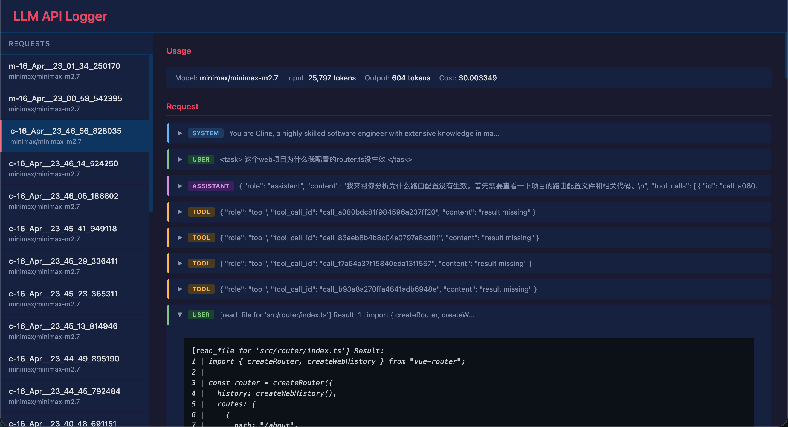

耗时两天，完成了 [how-ai-coder-works@v0.1](https://github.com/egu0/how-ai-coder-works/tree/42a9a3aa8a3ebc946a8fc951cb71ab360c56a9d5)

核心功能：代理 AI 编程助手与大模型进行交互，解析并可视化展示交互数据

思路来自[@马克的技术工作坊](https://v.douyin.com/6sosuxfAyRI/)
